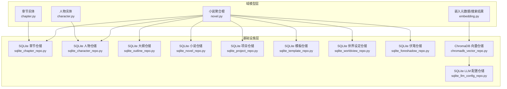
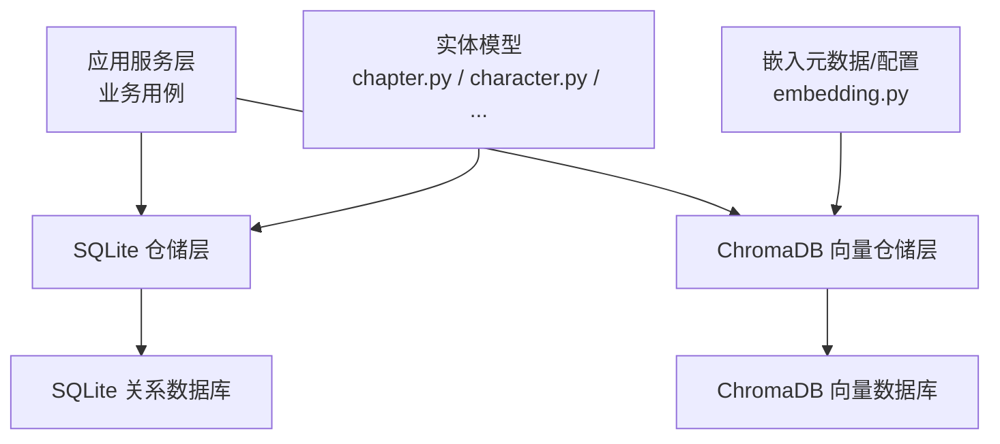
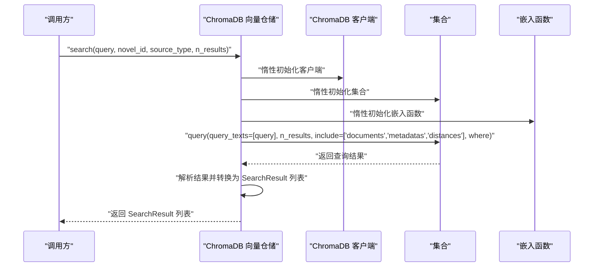
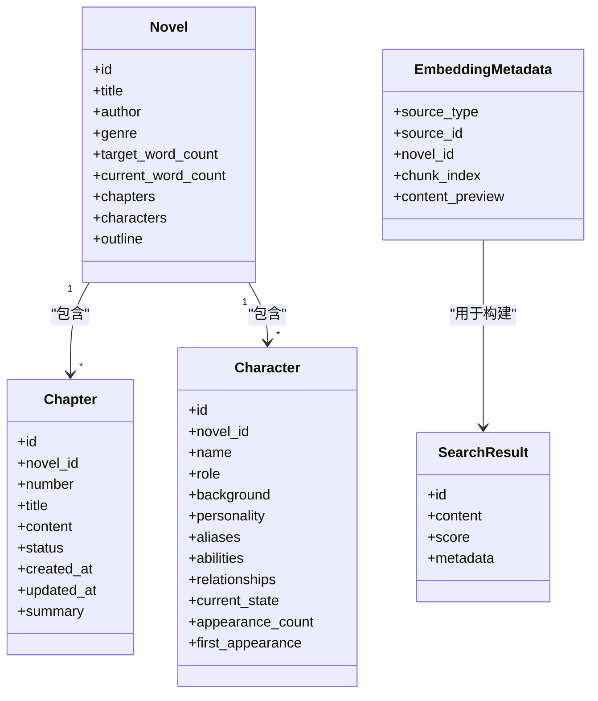
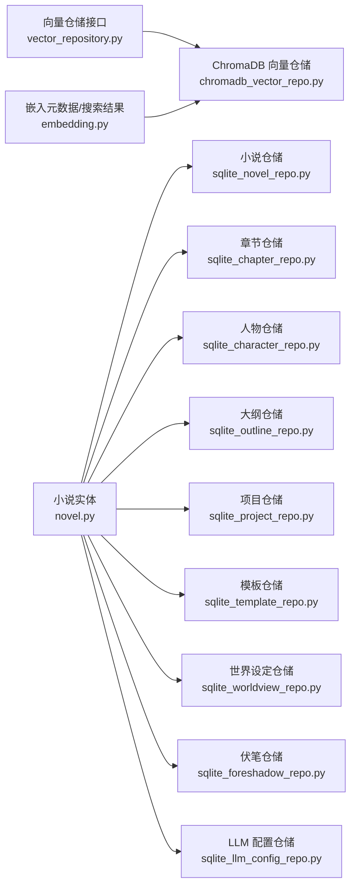

# 数据库设计

<cite>
**本文引用的文件**
- [sqlite_chapter_repo.py](file://infrastructure/persistence/sqlite_chapter_repo.py)
- [sqlite_character_repo.py](file://infrastructure/persistence/sqlite_character_repo.py)
- [sqlite_outline_repo.py](file://infrastructure/persistence/sqlite_outline_repo.py)
- [sqlite_novel_repo.py](file://infrastructure/persistence/sqlite_novel_repo.py)
- [sqlite_project_repo.py](file://infrastructure/persistence/sqlite_project_repo.py)
- [sqlite_template_repo.py](file://infrastructure/persistence/sqlite_template_repo.py)
- [sqlite_foreshadow_repo.py](file://infrastructure/persistence/sqlite_foreshadow_repo.py)
- [sqlite_worldview_repo.py](file://infrastructure/persistence/sqlite_worldview_repo.py)
- [sqlite_llm_config_repo.py](file://infrastructure/persistence/sqlite_llm_config_repo.py)
- [chromadb_vector_repo.py](file://infrastructure/persistence/chromadb_vector_repo.py)
- [vector_repository.py](file://domain/repositories/vector_repository.py)
- [embedding.py](file://domain/value_objects/embedding.py)
- [chapter.py](file://domain/entities/chapter.py)
- [character.py](file://domain/entities/character.py)
- [novel.py](file://domain/entities/novel.py)
</cite>

## 目录
1. [简介](#简介)
2. [项目结构](#项目结构)
3. [核心组件](#核心组件)
4. [架构总览](#架构总览)
5. [详细组件分析](#详细组件分析)
6. [依赖分析](#依赖分析)
7. [性能考虑](#性能考虑)
8. [故障排查指南](#故障排查指南)
9. [结论](#结论)
10. [附录](#附录)

## 简介
本设计文档面向 InkTrace 项目的数据库层，系统性阐述两类存储体系：
- 关系型数据库：基于 SQLite 的多表设计与实体映射，覆盖小说、章节、人物、大纲、项目、模板、世界设定、伏笔与 LLM 配置等业务实体。
- 向量数据库：基于 ChromaDB 的嵌入向量存储与相似度检索，支撑 RAG 场景的内容检索。

文档将从表结构设计、主外键与索引约束、数据持久化策略、向量检索机制、初始化与迁移策略、性能优化、备份与版本管理等方面进行深入说明，并提供工程化的实施建议。

## 项目结构
数据库相关代码主要分布在以下位置：
- 域模型层：domain/entities 与 domain/value_objects 定义了实体与值对象（如章节、人物、嵌入元数据等）。
- 基础设施层：infrastructure/persistence 下的各类仓储实现，分别对应 SQLite 表与 ChromaDB 集合。
- 接口层：domain/repositories 定义了向量仓储接口，便于替换底层实现。

图表来源
- [chapter.py:18-109](file://domain/entities/chapter.py#L18-L109)
- [character.py:64-273](file://domain/entities/character.py#L64-L273)
- [novel.py:20-178](file://domain/entities/novel.py#L20-L178)
- [embedding.py:14-79](file://domain/value_objects/embedding.py#L14-L79)
- [sqlite_chapter_repo.py:19-137](file://infrastructure/persistence/sqlite_chapter_repo.py#L19-L137)
- [sqlite_character_repo.py:20-162](file://infrastructure/persistence/sqlite_character_repo.py#L20-L162)
- [sqlite_outline_repo.py:20-196](file://infrastructure/persistence/sqlite_outline_repo.py#L20-L196)
- [sqlite_novel_repo.py:20-126](file://infrastructure/persistence/sqlite_novel_repo.py#L20-L126)
- [sqlite_project_repo.py:20-125](file://infrastructure/persistence/sqlite_project_repo.py#L20-L125)
- [sqlite_template_repo.py:21-165](file://infrastructure/persistence/sqlite_template_repo.py#L21-L165)
- [sqlite_worldview_repo.py:24-455](file://infrastructure/persistence/sqlite_worldview_repo.py#L24-L455)
- [sqlite_foreshadow_repo.py:19-138](file://infrastructure/persistence/sqlite_foreshadow_repo.py#L19-L138)
- [sqlite_llm_config_repo.py:18-145](file://infrastructure/persistence/sqlite_llm_config_repo.py#L18-L145)
- [chromadb_vector_repo.py:19-270](file://infrastructure/persistence/chromadb_vector_repo.py#L19-L270)

章节来源
- [sqlite_chapter_repo.py:19-137](file://infrastructure/persistence/sqlite_chapter_repo.py#L19-L137)
- [sqlite_character_repo.py:20-162](file://infrastructure/persistence/sqlite_character_repo.py#L20-L162)
- [sqlite_outline_repo.py:20-196](file://infrastructure/persistence/sqlite_outline_repo.py#L20-L196)
- [sqlite_novel_repo.py:20-126](file://infrastructure/persistence/sqlite_novel_repo.py#L20-L126)
- [sqlite_project_repo.py:20-125](file://infrastructure/persistence/sqlite_project_repo.py#L20-L125)
- [sqlite_template_repo.py:21-165](file://infrastructure/persistence/sqlite_template_repo.py#L21-L165)
- [sqlite_worldview_repo.py:24-455](file://infrastructure/persistence/sqlite_worldview_repo.py#L24-L455)
- [sqlite_foreshadow_repo.py:19-138](file://infrastructure/persistence/sqlite_foreshadow_repo.py#L19-L138)
- [sqlite_llm_config_repo.py:18-145](file://infrastructure/persistence/sqlite_llm_config_repo.py#L18-L145)
- [chromadb_vector_repo.py:19-270](file://infrastructure/persistence/chromadb_vector_repo.py#L19-L270)
- [vector_repository.py:17-95](file://domain/repositories/vector_repository.py#L17-L95)
- [embedding.py:14-79](file://domain/value_objects/embedding.py#L14-L79)
- [chapter.py:18-109](file://domain/entities/chapter.py#L18-L109)
- [character.py:64-273](file://domain/entities/character.py#L64-L273)
- [novel.py:20-178](file://domain/entities/novel.py#L20-L178)

## 核心组件
- SQLite 关系数据库：通过各仓储类在首次访问时创建表结构，采用 JSON 字段存储复杂对象，统一使用 ISO 时间字符串持久化时间戳。
- ChromaDB 向量数据库：以集合为单位存储嵌入向量，使用中文句向模型生成嵌入，支持按 novel_id/source_type 过滤检索，提供相似内容检索与向量更新/删除能力。
- 值对象与实体：通过 dataclass 定义不可变值对象（如嵌入元数据、搜索结果、向量存储配置），以及可变实体（如章节、人物、小说）。

章节来源
- [sqlite_chapter_repo.py:34-53](file://infrastructure/persistence/sqlite_chapter_repo.py#L34-L53)
- [chromadb_vector_repo.py:35-72](file://infrastructure/persistence/chromadb_vector_repo.py#L35-L72)
- [embedding.py:14-79](file://domain/value_objects/embedding.py#L14-L79)
- [chapter.py:18-109](file://domain/entities/chapter.py#L18-L109)
- [character.py:64-273](file://domain/entities/character.py#L64-L273)
- [novel.py:20-178](file://domain/entities/novel.py#L20-L178)

## 架构总览
下图展示了 SQLite 与 ChromaDB 在 InkTrace 中的协作方式：业务实体由仓储写入 SQLite；RAG 相关内容被切分为块并生成嵌入存入 ChromaDB；检索时先过滤再相似度匹配，最终返回带元数据的搜索结果。

图表来源
- [sqlite_chapter_repo.py:19-137](file://infrastructure/persistence/sqlite_chapter_repo.py#L19-L137)
- [sqlite_character_repo.py:20-162](file://infrastructure/persistence/sqlite_character_repo.py#L20-L162)
- [chromadb_vector_repo.py:19-270](file://infrastructure/persistence/chromadb_vector_repo.py#L19-L270)
- [embedding.py:14-79](file://domain/value_objects/embedding.py#L14-L79)
- [chapter.py:18-109](file://domain/entities/chapter.py#L18-L109)
- [character.py:64-273](file://domain/entities/character.py#L64-L273)

## 详细组件分析

### SQLite 实体与表结构设计
本节梳理各实体对应的表结构、主键、外键、索引与约束，并说明 JSON 字段的使用策略与时间字段的序列化方式。

- 小说表（novels）
  - 主键：id（文本）
  - 字段：title、author、genre、target_word_count、current_word_count、status、created_at、updated_at
  - 约束：非空与默认值；用于章节与世界设定的外键引用
  - 索引：未显式声明索引，但查询常按 id 与 created_at 排序，建议在 created_at 上建立索引以提升排序与分页性能

- 章节表（chapters）
  - 主键：id（文本）
  - 外键：novel_id → novels(id)
  - 字段：novel_id、number、title、content、word_count、summary、status、created_at、updated_at
  - 约束：status 默认 draft；外键约束保证章节归属有效
  - 索引：按 number 排序查询频繁，建议在 novel_id+number 组合上建立复合索引

- 人物表（characters）
  - 主键：id（文本）
  - 外键：novel_id → novels(id)
  - 字段：novel_id、name、role、background、personality、aliases（JSON）、abilities（JSON）、relationships（JSON）、current_state、appearance_count、first_appearance、created_at、updated_at
  - 约束：relationships、aliases、abilities 使用 JSON 存储数组或对象
  - 索引：按 novel_id 查询频繁，建议在 novel_id 上建立索引

- 大纲表（outlines）
  - 主键：id（文本），novel_id 唯一约束
  - 外键：novel_id → novels(id)
  - 字段：premise、story_background、world_setting、main_plots（JSON）、sub_plots（JSON）、volumes（JSON）、created_at、updated_at
  - 约束：novel_id 唯一，避免重复大纲
  - 索引：按 novel_id 查询，建议在 novel_id 建立索引

- 项目表（projects）
  - 主键：id（文本）
  - 外键：novel_id → novels(id)
  - 字段：name、novel_id、config（JSON）、status、created_at、updated_at
  - 索引：按 novel_id 与 status 查询，建议在 novel_id、status 建立复合索引

- 模板表（templates）
  - 主键：id（文本）
  - 字段：name、genre、description、worldview_framework（JSON）、character_templates（JSON）、plot_templates（JSON）、style_reference（JSON）、is_builtin、created_at、updated_at
  - 索引：按 genre、name 查询，建议在 genre、name 建立复合索引

- 世界设定表族（worldviews、techniques、factions、locations、items）
  - 主键：各自 id（文本）
  - 外键：novel_id → novels(id)
  - 字段：各表按领域模型定义，techniques、factions、locations、items 保留 novel_id 外键
  - 索引：按 novel_id 查询频繁，建议在 novel_id 建立索引

- 伏笔表（foreshadows）
  - 主键：id（文本）
  - 外键：novel_id → novels(id)、chapter_id → chapters(id)
  - 字段：novel_id、chapter_id、content、foreshadow_type、status、resolved_chapter_id、created_at、updated_at
  - 索引：按 novel_id、chapter_id、status 查询，建议在 novel_id、status、chapter_id 建立复合索引

- LLM 配置表（llm_config）
  - 主键：id（自增整数）
  - 字段：deepseek_api_key、kimi_api_key、encryption_key_hash、created_at、updated_at
  - 索引：按 id 查询，建议在 id 建立索引

章节来源
- [sqlite_novel_repo.py:39-52](file://infrastructure/persistence/sqlite_novel_repo.py#L39-L52)
- [sqlite_chapter_repo.py:38-53](file://infrastructure/persistence/sqlite_chapter_repo.py#L38-L53)
- [sqlite_character_repo.py:39-58](file://infrastructure/persistence/sqlite_character_repo.py#L39-L58)
- [sqlite_outline_repo.py:39-54](file://infrastructure/persistence/sqlite_outline_repo.py#L39-L54)
- [sqlite_project_repo.py:28-43](file://infrastructure/persistence/sqlite_project_repo.py#L28-L43)
- [sqlite_template_repo.py:31-48](file://infrastructure/persistence/sqlite_template_repo.py#L31-L48)
- [sqlite_worldview_repo.py:32-122](file://infrastructure/persistence/sqlite_worldview_repo.py#L32-L122)
- [sqlite_foreshadow_repo.py:27-45](file://infrastructure/persistence/sqlite_foreshadow_repo.py#L27-L45)
- [sqlite_llm_config_repo.py:38-48](file://infrastructure/persistence/sqlite_llm_config_repo.py#L38-L48)

### 数据持久化策略与 ORM 映射
- 手写 SQL 与原生驱动：仓储类直接使用 sqlite3 连接与执行 SQL，未引入 ORM 框架。优点是轻量、可控；缺点是缺乏自动迁移与复杂关系映射能力。
- JSON 序列化：对于复杂对象（如人物关系、大纲节点、世界设定子表），采用 JSON 字段存储，读取时反序列化为 Python 对象，保持灵活性。
- 时间字段：统一以 ISO 格式的字符串存储 datetime，读取时转换为 datetime 对象，避免时区与格式差异带来的问题。
- 主键与外键：明确声明主键与外键约束，确保参照完整性；对唯一性需求（如大纲 novel_id）使用唯一约束。

章节来源
- [sqlite_character_repo.py:66-85](file://infrastructure/persistence/sqlite_character_repo.py#L66-L85)
- [sqlite_outline_repo.py:62-76](file://infrastructure/persistence/sqlite_outline_repo.py#L62-L76)
- [sqlite_worldview_repo.py:147-177](file://infrastructure/persistence/sqlite_worldview_repo.py#L147-L177)
- [sqlite_llm_config_repo.py:54-90](file://infrastructure/persistence/sqlite_llm_config_repo.py#L54-L90)
- [sqlite_chapter_repo.py:61-75](file://infrastructure/persistence/sqlite_chapter_repo.py#L61-L75)

### 向量数据库设计与检索机制
- 集合与配置：默认集合名为“novel_embeddings”，距离度量为余弦相似度，嵌入模型为中文句向模型。
- 元数据：每个向量携带 source_type、source_id、novel_id、chunk_index、content_preview 等元数据，用于检索过滤与结果回填。
- 检索流程：
  - 语义检索：支持按 novel_id 与 source_type 过滤，返回 documents、metadatas、distances，并将距离转换为分数。
  - 相似内容检索：直接复用语义检索逻辑。
  - 更新/删除：支持按 ID 更新内容与元数据，按来源类型与 ID 删除，按 novel_id 删除全部向量。
- 延迟初始化：客户端、集合与嵌入函数均采用延迟初始化，减少启动开销。

图表来源
- [chromadb_vector_repo.py:35-72](file://infrastructure/persistence/chromadb_vector_repo.py#L35-L72)
- [chromadb_vector_repo.py:97-131](file://infrastructure/persistence/chromadb_vector_repo.py#L97-L131)
- [chromadb_vector_repo.py:224-247](file://infrastructure/persistence/chromadb_vector_repo.py#L224-L247)
- [embedding.py:14-79](file://domain/value_objects/embedding.py#L14-L79)

章节来源
- [chromadb_vector_repo.py:19-270](file://infrastructure/persistence/chromadb_vector_repo.py#L19-L270)
- [vector_repository.py:17-95](file://domain/repositories/vector_repository.py#L17-L95)
- [embedding.py:14-79](file://domain/value_objects/embedding.py#L14-L79)

### 类关系与数据模型

图表来源
- [chapter.py:18-109](file://domain/entities/chapter.py#L18-L109)
- [character.py:64-273](file://domain/entities/character.py#L64-L273)
- [novel.py:20-178](file://domain/entities/novel.py#L20-L178)
- [embedding.py:14-79](file://domain/value_objects/embedding.py#L14-L79)

## 依赖分析
- SQLite 仓储依赖于域模型与类型系统，通过实体与值对象的 dataclass 结构，仓储负责将对象持久化到关系表中。
- ChromaDB 仓储依赖于向量接口与值对象，通过统一的元数据结构实现跨来源与跨小说的检索过滤。
- 外键关系确保数据一致性：章节 → 小说；人物 → 小说；伏笔 → 小说与章节；世界设定子表 → 小说。

图表来源
- [vector_repository.py:17-95](file://domain/repositories/vector_repository.py#L17-L95)
- [chromadb_vector_repo.py:19-270](file://infrastructure/persistence/chromadb_vector_repo.py#L19-L270)
- [embedding.py:14-79](file://domain/value_objects/embedding.py#L14-L79)
- [novel.py:20-178](file://domain/entities/novel.py#L20-L178)
- [sqlite_novel_repo.py:20-126](file://infrastructure/persistence/sqlite_novel_repo.py#L20-L126)
- [sqlite_chapter_repo.py:19-137](file://infrastructure/persistence/sqlite_chapter_repo.py#L19-L137)
- [sqlite_character_repo.py:20-162](file://infrastructure/persistence/sqlite_character_repo.py#L20-L162)
- [sqlite_outline_repo.py:20-196](file://infrastructure/persistence/sqlite_outline_repo.py#L20-L196)
- [sqlite_project_repo.py:20-125](file://infrastructure/persistence/sqlite_project_repo.py#L20-L125)
- [sqlite_template_repo.py:21-165](file://infrastructure/persistence/sqlite_template_repo.py#L21-L165)
- [sqlite_worldview_repo.py:24-455](file://infrastructure/persistence/sqlite_worldview_repo.py#L24-L455)
- [sqlite_foreshadow_repo.py:19-138](file://infrastructure/persistence/sqlite_foreshadow_repo.py#L19-L138)
- [sqlite_llm_config_repo.py:18-145](file://infrastructure/persistence/sqlite_llm_config_repo.py#L18-L145)

## 性能考虑
- 索引设计建议
  - novels：在 created_at 建立索引，提升分页与排序性能
  - chapters：在 novel_id+number 建立复合索引，加速按章节目录查询
  - characters：在 novel_id 建立索引，加速按小说筛选人物
  - outlines：在 novel_id 建立索引，加速按小说获取大纲
  - projects：在 novel_id、status 建立复合索引，加速按状态筛选项目
  - templates：在 genre、name 建立复合索引，加速按题材与名称检索
  - worldviews/techniques/factions/locations/items：在 novel_id 建立索引，加速按小说查询
  - foreshadows：在 novel_id、status、chapter_id 建立复合索引，加速按状态与章节筛选
  - llm_config：在 id 建立索引，加速配置查询
- 查询优化
  - 使用 LIMIT 限制返回条数，避免全表扫描
  - 对 JSON 字段的过滤尽量通过元数据（如 novel_id、source_type）先行缩小范围
  - 按需 include 字段，减少网络与内存开销
- 向量检索
  - 合理设置 n_results，避免过多候选导致排序与传输成本上升
  - 使用 where 过滤条件减少候选集规模
  - 距离到分数的转换公式可按实际分布调整阈值

## 故障排查指南
- SQLite 常见问题
  - 表未创建：确认仓储初始化流程已执行，首次访问会自动建表
  - JSON 解析失败：检查 JSON 字段的序列化/反序列化逻辑，确保编码一致
  - 外键约束错误：检查关联实体是否已存在，或外键值是否正确
  - 时间字段异常：确认 ISO 字符串格式与时区处理一致
- ChromaDB 常见问题
  - 嵌入函数初始化失败：确认模型名称可用且本地可下载；若失败回退为空函数
  - 查询无结果：检查 where 条件与元数据字段是否匹配；确认集合中存在文档
  - 删除失败：确认 ID 存在且集合中可定位；捕获异常并记录日志
- 日志与监控
  - 记录关键 SQL 与查询参数
  - 记录向量检索耗时与返回条数
  - 记录异常堆栈与重试策略

章节来源
- [sqlite_character_repo.py:121-151](file://infrastructure/persistence/sqlite_character_repo.py#L121-L151)
- [sqlite_outline_repo.py:115-143](file://infrastructure/persistence/sqlite_outline_repo.py#L115-L143)
- [chromadb_vector_repo.py:64-72](file://infrastructure/persistence/chromadb_vector_repo.py#L64-L72)
- [chromadb_vector_repo.py:163-186](file://infrastructure/persistence/chromadb_vector_repo.py#L163-L186)

## 结论
InkTrace 的数据库层采用“轻量 SQLite + ChromaDB”的混合架构：SQLite 负责强一致的关系数据与复杂对象持久化，ChromaDB 负责高维向量的快速相似检索。通过明确的主外键约束、合理的索引策略与清晰的元数据设计，系统在功能与性能之间取得了良好平衡。建议后续引入数据库迁移工具与自动化测试，进一步提升可维护性与可靠性。

## 附录

### 数据库初始化脚本与迁移策略
- 初始化脚本
  - SQLite：各仓储在首次访问时自动创建表结构，无需额外脚本
  - ChromaDB：首次查询时自动创建集合，无需额外脚本
- 迁移策略
  - SQLite：当前未使用 ORM，建议引入 Alembic 或同类工具进行版本化迁移；在新增/变更字段时，提供升级与降级脚本
  - ChromaDB：集合结构变更需谨慎，建议通过重建集合并重新导入数据的方式实现；保留旧集合目录以便回滚

章节来源
- [sqlite_chapter_repo.py:34-53](file://infrastructure/persistence/sqlite_chapter_repo.py#L34-L53)
- [chromadb_vector_repo.py:50-57](file://infrastructure/persistence/chromadb_vector_repo.py#L50-L57)

### 备份、恢复与版本管理
- 备份
  - SQLite：定期复制数据库文件；生产环境可结合 WAL 模式与归档策略
  - ChromaDB：备份持久化目录；注意模型文件与索引的一致性
- 恢复
  - SQLite：停止服务后替换数据库文件，重启验证
  - ChromaDB：恢复目录后重启服务，验证集合可用性
- 版本管理
  - SQLite：通过迁移工具记录结构变更；每次变更需附带回滚脚本
  - ChromaDB：版本号与集合命名结合，变更时先创建新集合再切换引用

章节来源
- [sqlite_llm_config_repo.py:119-145](file://infrastructure/persistence/sqlite_llm_config_repo.py#L119-L145)
- [chromadb_vector_repo.py:188-205](file://infrastructure/persistence/chromadb_vector_repo.py#L188-L205)