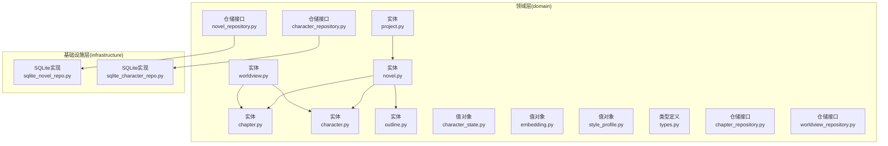
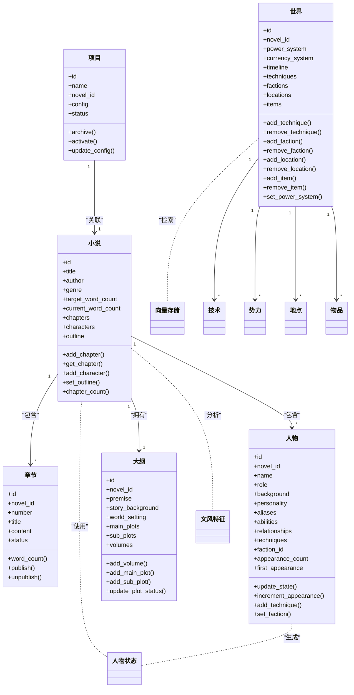
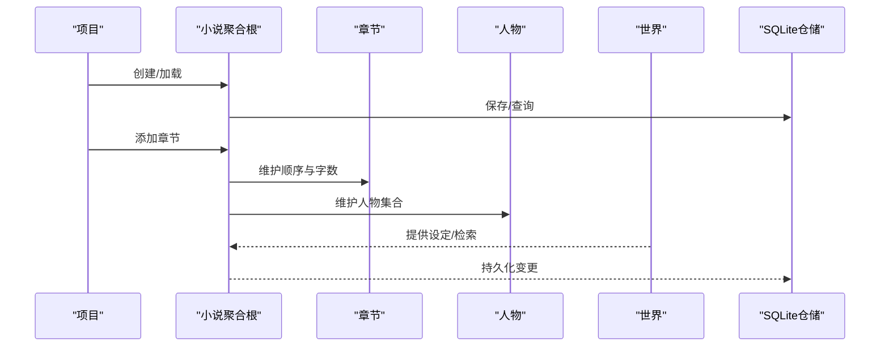
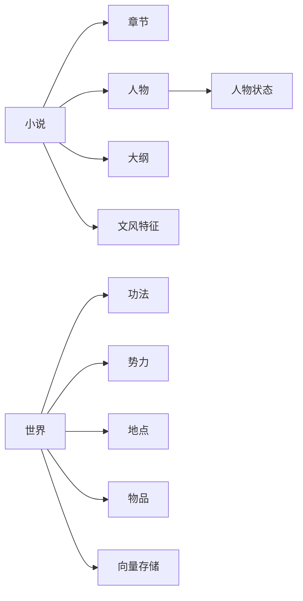

# 数据模型

<cite>
**本文引用的文件**
- [domain/entities/novel.py](file://domain/entities/novel.py)
- [domain/entities/chapter.py](file://domain/entities/chapter.py)
- [domain/entities/character.py](file://domain/entities/character.py)
- [domain/entities/worldview.py](file://domain/entities/worldview.py)
- [domain/entities/outline.py](file://domain/entities/outline.py)
- [domain/entities/project.py](file://domain/entities/project.py)
- [domain/value_objects/character_state.py](file://domain/value_objects/character_state.py)
- [domain/value_objects/embedding.py](file://domain/value_objects/embedding.py)
- [domain/value_objects/style_profile.py](file://domain/value_objects/style_profile.py)
- [domain/repositories/novel_repository.py](file://domain/repositories/novel_repository.py)
- [domain/repositories/chapter_repository.py](file://domain/repositories/chapter_repository.py)
- [domain/repositories/character_repository.py](file://domain/repositories/character_repository.py)
- [domain/repositories/worldview_repository.py](file://domain/repositories/worldview_repository.py)
- [domain/types.py](file://domain/types.py)
- [infrastructure/persistence/sqlite_novel_repo.py](file://infrastructure/persistence/sqlite_novel_repo.py)
- [infrastructure/persistence/sqlite_character_repo.py](file://infrastructure/persistence/sqlite_character_repo.py)
</cite>

## 目录
1. [简介](#简介)
2. [项目结构](#项目结构)
3. [核心组件](#核心组件)
4. [架构总览](#架构总览)
5. [详细组件分析](#详细组件分析)
6. [依赖分析](#依赖分析)
7. [性能考虑](#性能考虑)
8. [故障排查指南](#故障排查指南)
9. [结论](#结论)
10. [附录](#附录)

## 简介
本文件面向InkTrace项目的数据库与领域建模，系统化阐述实体模型与值对象设计、仓储接口与实现策略、数据库表结构与索引约束、数据流与业务规则，并提供实体关系图与数据流图，帮助数据库开发者与架构师完成设计与实现。

## 项目结构
InkTrace采用分层架构，数据模型位于领域层（domain），基础设施层（infrastructure）提供持久化实现。核心模型围绕“小说”这一聚合根展开，关联“章节”、“人物”、“大纲”、“项目”以及“世界观”等子聚合；同时通过值对象表达不可变的领域概念，如人物状态、嵌入向量元数据、文风特征等。

图表来源
- [domain/entities/novel.py:1-178](file://domain/entities/novel.py#L1-L178)
- [domain/entities/chapter.py:1-109](file://domain/entities/chapter.py#L1-L109)
- [domain/entities/character.py:1-273](file://domain/entities/character.py#L1-L273)
- [domain/entities/worldview.py:1-154](file://domain/entities/worldview.py#L1-L154)
- [domain/entities/outline.py:1-257](file://domain/entities/outline.py#L1-L257)
- [domain/entities/project.py:1-112](file://domain/entities/project.py#L1-L112)
- [domain/value_objects/character_state.py:1-33](file://domain/value_objects/character_state.py#L1-L33)
- [domain/value_objects/embedding.py:1-79](file://domain/value_objects/embedding.py#L1-L79)
- [domain/value_objects/style_profile.py:1-30](file://domain/value_objects/style_profile.py#L1-L30)
- [domain/repositories/novel_repository.py:1-70](file://domain/repositories/novel_repository.py#L1-L70)
- [domain/repositories/chapter_repository.py:1-89](file://domain/repositories/chapter_repository.py#L1-L89)
- [domain/repositories/character_repository.py:1-73](file://domain/repositories/character_repository.py#L1-L73)
- [domain/repositories/worldview_repository.py:1-147](file://domain/repositories/worldview_repository.py#L1-L147)
- [domain/types.py:1-284](file://domain/types.py#L1-L284)
- [infrastructure/persistence/sqlite_novel_repo.py:1-126](file://infrastructure/persistence/sqlite_novel_repo.py#L1-L126)
- [infrastructure/persistence/sqlite_character_repo.py:1-162](file://infrastructure/persistence/sqlite_character_repo.py#L1-L162)

章节来源
- [domain/entities/novel.py:1-178](file://domain/entities/novel.py#L1-L178)
- [domain/entities/chapter.py:1-109](file://domain/entities/chapter.py#L1-L109)
- [domain/entities/character.py:1-273](file://domain/entities/character.py#L1-L273)
- [domain/entities/worldview.py:1-154](file://domain/entities/worldview.py#L1-L154)
- [domain/entities/outline.py:1-257](file://domain/entities/outline.py#L1-L257)
- [domain/entities/project.py:1-112](file://domain/entities/project.py#L1-L112)
- [domain/value_objects/character_state.py:1-33](file://domain/value_objects/character_state.py#L1-L33)
- [domain/value_objects/embedding.py:1-79](file://domain/value_objects/embedding.py#L1-L79)
- [domain/value_objects/style_profile.py:1-30](file://domain/value_objects/style_profile.py#L1-L30)
- [domain/repositories/novel_repository.py:1-70](file://domain/repositories/novel_repository.py#L1-L70)
- [domain/repositories/chapter_repository.py:1-89](file://domain/repositories/chapter_repository.py#L1-L89)
- [domain/repositories/character_repository.py:1-73](file://domain/repositories/character_repository.py#L1-L73)
- [domain/repositories/worldview_repository.py:1-147](file://domain/repositories/worldview_repository.py#L1-L147)
- [domain/types.py:1-284](file://domain/types.py#L1-L284)
- [infrastructure/persistence/sqlite_novel_repo.py:1-126](file://infrastructure/persistence/sqlite_novel_repo.py#L1-L126)
- [infrastructure/persistence/sqlite_character_repo.py:1-162](file://infrastructure/persistence/sqlite_character_repo.py#L1-L162)

## 核心组件
- 聚合根与实体
  - 小说（聚合根）：管理章节、人物、大纲集合，维护字数统计与更新时间。
  - 章节：表示单章内容、标题、状态与参与人物。
  - 人物：包含角色、背景、能力、关系、状态历史、出场信息等。
  - 世界：聚合功法、势力、地点、物品，支持力量体系与时间线等设定。
  - 大纲：包含主线/支线剧情节点、分卷大纲与状态管理。
  - 项目：项目配置与状态，驱动写作流程。
- 值对象
  - 人物状态：某时刻的人物快照（位置、境界、健康、情感、持有物、目标等）。
  - 向量存储：嵌入元数据、搜索结果、向量存储配置。
  - 文风特征：词汇、句式、修辞统计与示例。
- 类型系统
  - 统一的标识类型（小说、章节、人物、大纲、项目、技术、势力、地点、物品、世界）与枚举（状态、角色、题材、关系、物品类型等）。
- 仓储接口
  - 小说、章节、人物、世界：定义保存、查询、删除与批量查询等方法。
- 持久化实现
  - SQLite：基于JSON序列化复杂字段，外键约束关联小说与人物。

章节来源
- [domain/entities/novel.py:20-178](file://domain/entities/novel.py#L20-L178)
- [domain/entities/chapter.py:18-109](file://domain/entities/chapter.py#L18-L109)
- [domain/entities/character.py:64-273](file://domain/entities/character.py#L64-L273)
- [domain/entities/worldview.py:44-154](file://domain/entities/worldview.py#L44-L154)
- [domain/entities/outline.py:66-257](file://domain/entities/outline.py#L66-L257)
- [domain/entities/project.py:50-112](file://domain/entities/project.py#L50-L112)
- [domain/value_objects/character_state.py:16-33](file://domain/value_objects/character_state.py#L16-L33)
- [domain/value_objects/embedding.py:14-79](file://domain/value_objects/embedding.py#L14-L79)
- [domain/value_objects/style_profile.py:14-30](file://domain/value_objects/style_profile.py#L14-L30)
- [domain/types.py:15-284](file://domain/types.py#L15-L284)
- [domain/repositories/novel_repository.py:17-70](file://domain/repositories/novel_repository.py#L17-L70)
- [domain/repositories/chapter_repository.py:17-89](file://domain/repositories/chapter_repository.py#L17-L89)
- [domain/repositories/character_repository.py:17-73](file://domain/repositories/character_repository.py#L17-L73)
- [domain/repositories/worldview_repository.py:21-147](file://domain/repositories/worldview_repository.py#L21-L147)
- [infrastructure/persistence/sqlite_novel_repo.py:20-126](file://infrastructure/persistence/sqlite_novel_repo.py#L20-L126)
- [infrastructure/persistence/sqlite_character_repo.py:20-162](file://infrastructure/persistence/sqlite_character_repo.py#L20-L162)

## 架构总览
下图展示领域模型与仓储实现的交互关系，体现“聚合根—实体—值对象”的层次化设计与“接口—实现”的解耦。

图表来源
- [domain/entities/novel.py:20-178](file://domain/entities/novel.py#L20-L178)
- [domain/entities/chapter.py:18-109](file://domain/entities/chapter.py#L18-L109)
- [domain/entities/character.py:64-273](file://domain/entities/character.py#L64-L273)
- [domain/entities/worldview.py:44-154](file://domain/entities/worldview.py#L44-L154)
- [domain/entities/outline.py:66-257](file://domain/entities/outline.py#L66-L257)
- [domain/entities/project.py:50-112](file://domain/entities/project.py#L50-L112)
- [domain/value_objects/character_state.py:16-33](file://domain/value_objects/character_state.py#L16-L33)
- [domain/value_objects/embedding.py:14-79](file://domain/value_objects/embedding.py#L14-L79)
- [domain/value_objects/style_profile.py:14-30](file://domain/value_objects/style_profile.py#L14-L30)

## 详细组件分析

### 实体：小说（聚合根）
- 责任边界：聚合根，负责章节与人物的增删改排序、字数统计与更新时间维护。
- 关键行为：添加/获取章节、添加/获取人物、设置大纲、获取最新章节、重新计算字数。
- 与值对象/实体关系：维护章节与人物列表，与大纲形成聚合关系。

章节来源
- [domain/entities/novel.py:20-178](file://domain/entities/novel.py#L20-L178)

### 实体：章节
- 属性：编号、标题、内容、状态、摘要、参与人物列表。
- 行为：计算字数、发布/取消发布、更新标题/内容。
- 业务规则：状态机（草稿/已发布），重复发布/取消发布需抛出异常。

章节来源
- [domain/entities/chapter.py:18-109](file://domain/entities/chapter.py#L18-L109)

### 实体：人物
- 属性：角色（主角/反派/配角）、别名、能力、关系、状态历史、出场次数与首次出场章节。
- 扩展属性：功法列表、所属势力、详细关系、年龄/性别/头衔等。
- 行为：添加别名/能力、更新状态、增加出场次数、添加/移除功法、设置势力、添加/获取/移除详细关系。
- 与关系：支持两类关系值对象（兼容与详细），用于表达多维关系。

章节来源
- [domain/entities/character.py:64-273](file://domain/entities/character.py#L64-L273)

### 实体：世界（世界观聚合）
- 聚合内容：力量体系、货币系统、时间线、功法、势力、地点、物品。
- 行为：增删查功法/势力/地点/物品，设置力量体系，维护更新时间。

章节来源
- [domain/entities/worldview.py:44-154](file://domain/entities/worldview.py#L44-L154)

### 实体：大纲
- 结构：核心设定、故事背景、世界设定、主线/支线剧情节点、分卷大纲。
- 行为：更新核心设定/背景/世界设定，添加/更新剧情节点状态，按卷号管理分卷。

章节来源
- [domain/entities/outline.py:66-257](file://domain/entities/outline.py#L66-L257)

### 实体：项目
- 配置：题材、目标字数、单章字数、文风强度、一致性检查、记忆参数。
- 状态：激活/归档，提供切换与校验。
- 与小说：一对一关联，驱动写作流程。

章节来源
- [domain/entities/project.py:50-112](file://domain/entities/project.py#L50-L112)

### 值对象：人物状态
- 描述：人物在特定章节的状态快照，包含位置、修炼等级、健康、情绪、持有物、目标等。
- 设计原则：不可变、可序列化，便于跨模块传递与持久化。

章节来源
- [domain/value_objects/character_state.py:16-33](file://domain/value_objects/character_state.py#L16-L33)

### 值对象：嵌入向量与检索
- 元数据：来源类型、来源ID、小说ID、块索引、内容预览。
- 搜索结果：ID、内容、相似度分数、元数据。
- 配置：集合名、嵌入模型、分块大小与重叠、距离度量。
- 使用场景：RAG检索、内容召回、向量索引管理。

章节来源
- [domain/value_objects/embedding.py:14-79](file://domain/value_objects/embedding.py#L14-L79)

### 值对象：文风特征
- 描述：词汇统计、句式模式、修辞统计、对话语气、叙述视角、节奏、示例句子。
- 使用场景：风格一致性分析、写作建议、模板匹配。

章节来源
- [domain/value_objects/style_profile.py:14-30](file://domain/value_objects/style_profile.py#L14-L30)

### 仓储接口与实现策略
- 接口职责：定义保存、查询、删除与批量查询方法，确保领域逻辑与数据访问解耦。
- 实现策略：
  - SQLite实现：使用JSON序列化复杂字段（如列表、关系、配置），通过外键约束维护引用完整性。
  - 事务与并发：建议在应用层控制事务边界，避免长事务；读写分离或只读副本用于报表/导出场景。
  - 缓存：热点实体（如最近小说、活跃项目）可引入内存缓存，结合失效策略。

章节来源
- [domain/repositories/novel_repository.py:17-70](file://domain/repositories/novel_repository.py#L17-L70)
- [domain/repositories/chapter_repository.py:17-89](file://domain/repositories/chapter_repository.py#L17-L89)
- [domain/repositories/character_repository.py:17-73](file://domain/repositories/character_repository.py#L17-L73)
- [domain/repositories/worldview_repository.py:21-147](file://domain/repositories/worldview_repository.py#L21-L147)
- [infrastructure/persistence/sqlite_novel_repo.py:20-126](file://infrastructure/persistence/sqlite_novel_repo.py#L20-L126)
- [infrastructure/persistence/sqlite_character_repo.py:20-162](file://infrastructure/persistence/sqlite_character_repo.py#L20-L162)

### 数据库表结构与约束
- 小说表（novels）
  - 主键：id
  - 字段：title、author、genre、target_word_count、current_word_count、status、created_at、updated_at
  - 约束：主键唯一
- 人物表（characters）
  - 主键：id
  - 外键：novel_id → novels(id)
  - JSON字段：aliases、abilities、relationships
  - 约束：外键引用、非空约束于必要字段
- 章节表（chapters）
  - 主键：id
  - 外键：novel_id → novels(id)
  - JSON字段：characters_involved
  - 约束：外键引用
- 世界表（worldviews）
  - 主键：id
  - 外键：novel_id → novels(id)
  - JSON字段：power_system、currency_system、timeline、techniques、factions、locations、items
  - 约束：外键引用
- 大纲表（outlines）
  - 主键：id
  - 外键：novel_id → novels(id)
  - JSON字段：main_plots、sub_plots、volumes
  - 约束：外键引用
- 项目表（projects）
  - 主键：id
  - 外键：novel_id → novels(id)
  - JSON字段：config
  - 约束：外键引用

章节来源
- [infrastructure/persistence/sqlite_novel_repo.py:35-58](file://infrastructure/persistence/sqlite_novel_repo.py#L35-L58)
- [infrastructure/persistence/sqlite_character_repo.py:35-58](file://infrastructure/persistence/sqlite_character_repo.py#L35-L58)

### 数据流与业务规则
- 写作流程（概要）
  - 项目启动后，依据项目配置生成/加载小说与大纲。
  - 小说聚合根维护章节与人物集合，章节状态机控制发布流程。
  - 人物状态由章节推进与事件触发生成，供上下文构建与一致性检查使用。
  - 世界聚合根承载设定，支撑RAG检索与风格分析。

图表来源
- [domain/entities/project.py:50-112](file://domain/entities/project.py#L50-L112)
- [domain/entities/novel.py:46-178](file://domain/entities/novel.py#L46-L178)
- [domain/entities/chapter.py:50-109](file://domain/entities/chapter.py#L50-L109)
- [domain/entities/character.py:105-207](file://domain/entities/character.py#L105-L207)
- [domain/entities/worldview.py:62-121](file://domain/entities/worldview.py#L62-L121)
- [infrastructure/persistence/sqlite_novel_repo.py:54-126](file://infrastructure/persistence/sqlite_novel_repo.py#L54-L126)
- [infrastructure/persistence/sqlite_character_repo.py:60-162](file://infrastructure/persistence/sqlite_character_repo.py#L60-L162)

## 依赖分析
- 聚合内依赖
  - 小说聚合根依赖章节、人物、大纲实体，形成强聚合边界。
  - 世界聚合根依赖功法、势力、地点、物品实体。
- 值对象依赖
  - 人物状态依赖人物与章节标识，用于快照生成。
  - 向量存储依赖来源元数据，用于检索定位。
  - 文风特征独立于实体，作为分析输出。
- 仓储依赖
  - SQLite实现依赖领域实体与值对象，进行序列化/反序列化与外键约束。

图表来源
- [domain/entities/novel.py:37-39](file://domain/entities/novel.py#L37-L39)
- [domain/entities/worldview.py:55-58](file://domain/entities/worldview.py#L55-L58)
- [domain/value_objects/character_state.py:25-32](file://domain/value_objects/character_state.py#L25-L32)
- [domain/value_objects/embedding.py:48-51](file://domain/value_objects/embedding.py#L48-L51)
- [domain/value_objects/style_profile.py:23-29](file://domain/value_objects/style_profile.py#L23-L29)

## 性能考虑
- 序列化成本
  - JSON字段（aliases、abilities、relationships、config等）在频繁读写时带来序列化开销，建议批量更新与缓存热点字段。
- 外键与索引
  - 建议在外键字段（novel_id、chapter_id）建立索引以提升查询性能。
  - 对常用过滤字段（author、genre、status、created_at）建立复合索引以优化报表与筛选。
- 事务与锁
  - 写入密集场景建议批量提交，减少锁竞争；读写分离降低阻塞。
- 缓存策略
  - 最近小说、活跃项目、热门人物/章节可引入LRU缓存，结合TTL与失效策略。
- 向量检索
  - 向量索引按集合名分区，分块大小与重叠需平衡召回率与检索速度。

## 故障排查指南
- 章节状态异常
  - 现象：重复发布/取消发布抛出异常。
  - 排查：确认当前状态与幂等性处理，避免并发重复调用。
- 外键约束失败
  - 现象：插入人物/章节时报外键错误。
  - 排查：确认小说ID存在且一致，检查JSON字段格式。
- JSON解析异常
  - 现象：读取人物/项目配置失败。
  - 排查：检查序列化兼容性与默认值填充，确保字段存在性。
- 性能问题
  - 现象：查询缓慢。
  - 排查：确认索引是否存在、SQL执行计划、是否需要分页或缓存。

章节来源
- [domain/entities/chapter.py:86-109](file://domain/entities/chapter.py#L86-L109)
- [infrastructure/persistence/sqlite_character_repo.py:121-162](file://infrastructure/persistence/sqlite_character_repo.py#L121-L162)
- [infrastructure/persistence/sqlite_novel_repo.py:74-126](file://infrastructure/persistence/sqlite_novel_repo.py#L74-L126)

## 结论
InkTrace的数据模型以领域驱动为核心，通过聚合根与值对象清晰划分职责，仓储接口与SQLite实现解耦业务与数据访问。建议在生产环境中完善索引、缓存与事务策略，持续演进向量检索与风格分析能力，保障大规模数据下的稳定性与性能。

## 附录
- 数据验证与业务规则清单
  - 章节状态机：草稿/已发布，禁止重复发布/取消发布。
  - 人物状态变更：历史记录追加，当前状态更新。
  - 小说字数统计：章节内容变化后自动重算。
  - 项目名称非空校验：更新前校验。
  - 外键约束：人物/章节/世界必须归属有效小说。
- 迁移策略建议
  - 新增字段：采用可选字段与默认值，保证向前兼容。
  - JSON字段演进：提供版本化结构与迁移脚本。
  - 索引变更：使用在线DDL或离峰窗口，避免锁表。
  - 向量索引：按集合名重建，保留元数据映射。