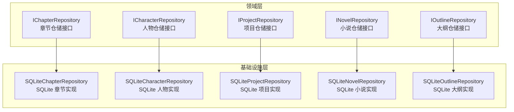
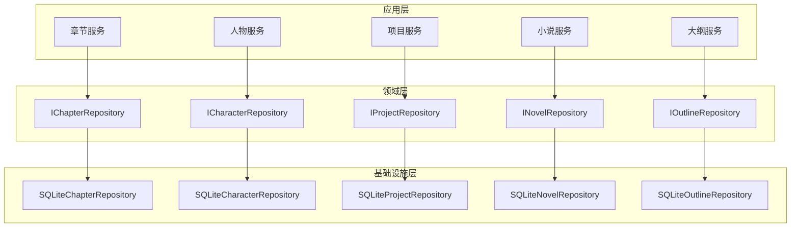
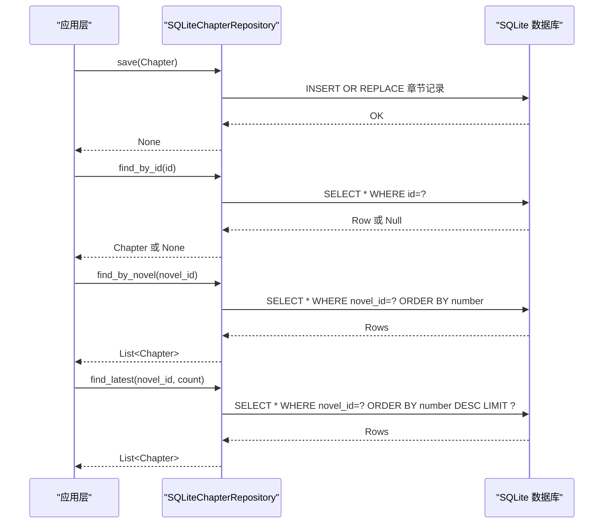
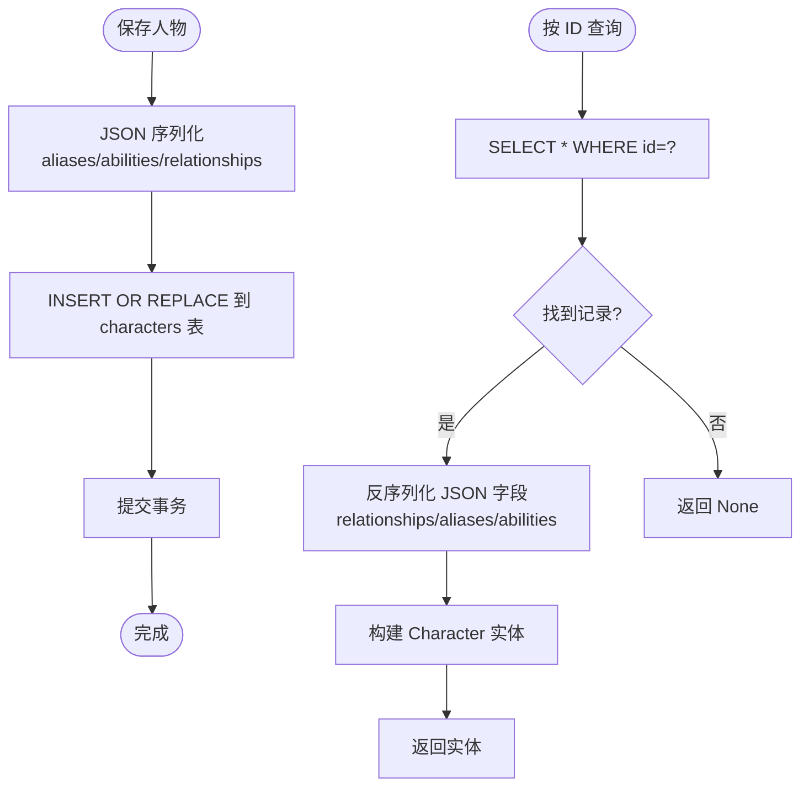
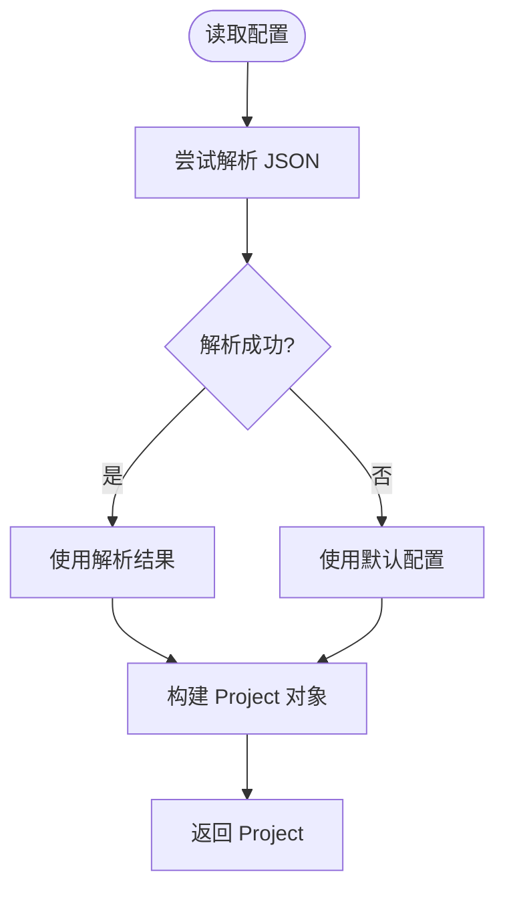
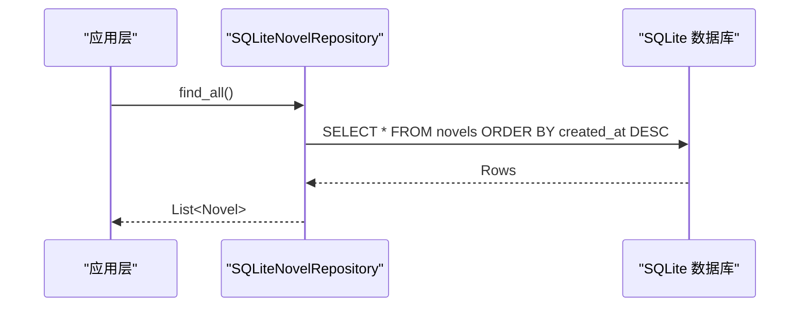
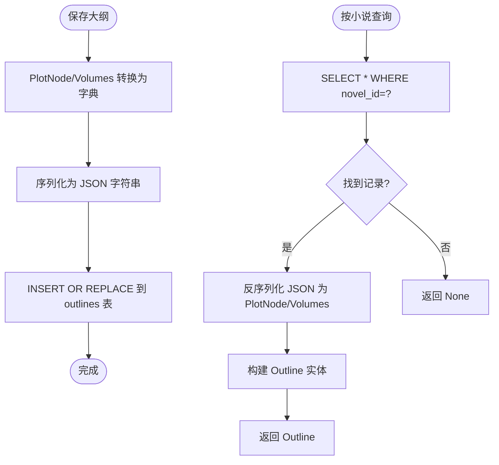

# 仓储接口与实现

<cite>
**本文引用的文件**
- [domain/repositories/__init__.py](file://domain/repositories/__init__.py)
- [infrastructure/persistence/__init__.py](file://infrastructure/persistence/__init__.py)
- [domain/repositories/chapter_repository.py](file://domain/repositories/chapter_repository.py)
- [domain/repositories/character_repository.py](file://domain/repositories/character_repository.py)
- [domain/repositories/project_repository.py](file://domain/repositories/project_repository.py)
- [domain/repositories/novel_repository.py](file://domain/repositories/novel_repository.py)
- [domain/repositories/outline_repository.py](file://domain/repositories/outline_repository.py)
- [infrastructure/persistence/sqlite_chapter_repo.py](file://infrastructure/persistence/sqlite_chapter_repo.py)
- [infrastructure/persistence/sqlite_character_repo.py](file://infrastructure/persistence/sqlite_character_repo.py)
- [infrastructure/persistence/sqlite_project_repo.py](file://infrastructure/persistence/sqlite_project_repo.py)
- [infrastructure/persistence/sqlite_novel_repo.py](file://infrastructure/persistence/sqlite_novel_repo.py)
- [infrastructure/persistence/sqlite_outline_repo.py](file://infrastructure/persistence/sqlite_outline_repo.py)
- [domain/entities/__init__.py](file://domain/entities/__init__.py)
- [domain/types.py](file://domain/types.py)
- [tests/unit/test_repositories.py](file://tests/unit/test_repositories.py)
</cite>

## 目录
1. [简介](#简介)
2. [项目结构](#项目结构)
3. [核心组件](#核心组件)
4. [架构总览](#架构总览)
5. [详细组件分析](#详细组件分析)
6. [依赖分析](#依赖分析)
7. [性能考虑](#性能考虑)
8. [故障排查指南](#故障排查指南)
9. [结论](#结论)
10. [附录](#附录)

## 简介
本文件系统性梳理 InkTrace 项目的仓储接口与实现，重点围绕 Clean Architecture 中的仓储模式展开，阐述其设计原则、在领域层与基础设施层的职责划分、SQLite 持久化实现细节（含 SQL 语句、ORM 映射思路、连接与事务管理）、查询优化策略（索引、批量、序列化）、依赖注入与单元测试策略，以及异常处理与错误恢复机制，并总结仓储在领域服务中的使用方式与最佳实践。

## 项目结构
仓储相关代码主要分布在以下位置：
- 领域层接口：domain/repositories/*.py
- 基础设施层实现：infrastructure/persistence/*.py
- 领域实体与类型：domain/entities/*.py、domain/types.py
- 单元测试：tests/unit/test_repositories.py

图表来源
- [domain/repositories/chapter_repository.py:17-89](file://domain/repositories/chapter_repository.py#L17-L89)
- [domain/repositories/character_repository.py:17-73](file://domain/repositories/character_repository.py#L17-L73)
- [domain/repositories/project_repository.py:17-55](file://domain/repositories/project_repository.py#L17-L55)
- [domain/repositories/novel_repository.py:17-70](file://domain/repositories/novel_repository.py#L17-L70)
- [domain/repositories/outline_repository.py:17-73](file://domain/repositories/outline_repository.py#L17-L73)
- [infrastructure/persistence/sqlite_chapter_repo.py:19-125](file://infrastructure/persistence/sqlite_chapter_repo.py#L19-L125)
- [infrastructure/persistence/sqlite_character_repo.py:20-150](file://infrastructure/persistence/sqlite_character_repo.py#L20-L150)
- [infrastructure/persistence/sqlite_project_repo.py:21-137](file://infrastructure/persistence/sqlite_project_repo.py#L21-L137)
- [infrastructure/persistence/sqlite_novel_repo.py:20-116](file://infrastructure/persistence/sqlite_novel_repo.py#L20-L116)
- [infrastructure/persistence/sqlite_outline_repo.py:20-182](file://infrastructure/persistence/sqlite_outline_repo.py#L20-L182)

章节来源
- [domain/repositories/__init__.py:11-21](file://domain/repositories/__init__.py#L11-L21)
- [infrastructure/persistence/__init__.py:11-21](file://infrastructure/persistence/__init__.py#L11-L21)

## 核心组件
- 领域仓储接口：定义各实体的 CRUD 与业务查询方法，确保领域逻辑与数据访问解耦。
- 基础设施仓储实现：以 SQLite 为存储介质，提供具体的数据持久化能力。
- 领域实体与类型：承载业务语义，如 ID 值对象、枚举状态等。
- 测试用例：覆盖典型 CRUD 场景与边界条件。

章节来源
- [domain/repositories/chapter_repository.py:17-89](file://domain/repositories/chapter_repository.py#L17-L89)
- [domain/repositories/character_repository.py:17-73](file://domain/repositories/character_repository.py#L17-L73)
- [domain/repositories/project_repository.py:17-55](file://domain/repositories/project_repository.py#L17-L55)
- [domain/repositories/novel_repository.py:17-70](file://domain/repositories/novel_repository.py#L17-L70)
- [domain/repositories/outline_repository.py:17-73](file://domain/repositories/outline_repository.py#L17-L73)
- [infrastructure/persistence/sqlite_chapter_repo.py:19-125](file://infrastructure/persistence/sqlite_chapter_repo.py#L19-L125)
- [infrastructure/persistence/sqlite_character_repo.py:20-150](file://infrastructure/persistence/sqlite_character_repo.py#L20-L150)
- [infrastructure/persistence/sqlite_project_repo.py:21-137](file://infrastructure/persistence/sqlite_project_repo.py#L21-L137)
- [infrastructure/persistence/sqlite_novel_repo.py:20-116](file://infrastructure/persistence/sqlite_novel_repo.py#L20-L116)
- [infrastructure/persistence/sqlite_outline_repo.py:20-182](file://infrastructure/persistence/sqlite_outline_repo.py#L20-L182)
- [domain/entities/__init__.py:11-24](file://domain/entities/__init__.py#L11-L24)
- [domain/types.py:15-284](file://domain/types.py#L15-L284)

## 架构总览
仓储模式在 Clean Architecture 中承担“数据映射器”角色，向上对接应用层的服务编排，向下屏蔽具体存储实现细节。接口位于领域层，实现位于基础设施层，通过依赖倒置原则实现解耦。

图表来源
- [domain/repositories/chapter_repository.py:17-89](file://domain/repositories/chapter_repository.py#L17-L89)
- [domain/repositories/character_repository.py:17-73](file://domain/repositories/character_repository.py#L17-L73)
- [domain/repositories/project_repository.py:17-55](file://domain/repositories/project_repository.py#L17-L55)
- [domain/repositories/novel_repository.py:17-70](file://domain/repositories/novel_repository.py#L17-L70)
- [domain/repositories/outline_repository.py:17-73](file://domain/repositories/outline_repository.py#L17-L73)
- [infrastructure/persistence/sqlite_chapter_repo.py:19-125](file://infrastructure/persistence/sqlite_chapter_repo.py#L19-L125)
- [infrastructure/persistence/sqlite_character_repo.py:20-150](file://infrastructure/persistence/sqlite_character_repo.py#L20-L150)
- [infrastructure/persistence/sqlite_project_repo.py:21-137](file://infrastructure/persistence/sqlite_project_repo.py#L21-L137)
- [infrastructure/persistence/sqlite_novel_repo.py:20-116](file://infrastructure/persistence/sqlite_novel_repo.py#L20-L116)
- [infrastructure/persistence/sqlite_outline_repo.py:20-182](file://infrastructure/persistence/sqlite_outline_repo.py#L20-L182)

## 详细组件分析

### 章节仓储（IChapterRepository 与 SQLiteChapterRepository）
- 接口职责
  - 保存、按 ID 查询、按小说查询、查询最新 N 条、删除。
  - 支持按章节号排序与限制条数的业务查询。
- 实现要点
  - 使用 SQLite 表存储章节，主键为 id，外键关联 novels。
  - 采用 INSERT OR REPLACE 实现幂等写入；使用 row_factory 统一行访问。
  - 查询按 number 排序或倒序，LIMIT 控制返回数量。
- 关键流程（保存与查询）

图表来源
- [infrastructure/persistence/sqlite_chapter_repo.py:51-105](file://infrastructure/persistence/sqlite_chapter_repo.py#L51-L105)

章节来源
- [domain/repositories/chapter_repository.py:17-89](file://domain/repositories/chapter_repository.py#L17-L89)
- [infrastructure/persistence/sqlite_chapter_repo.py:19-125](file://infrastructure/persistence/sqlite_chapter_repo.py#L19-L125)

### 人物仓储（ICharacterRepository 与 SQLiteCharacterRepository）
- 接口职责
  - 保存、按 ID 查询、按小说查询、删除。
- 实现要点
  - relationships、aliases、abilities 等复杂字段通过 JSON 序列化存储。
  - first_appearance 可为空，对应外键可选。
- 关键流程（保存与反序列化）

图表来源
- [infrastructure/persistence/sqlite_character_repo.py:56-79](file://infrastructure/persistence/sqlite_character_repo.py#L56-L79)
- [infrastructure/persistence/sqlite_character_repo.py:111-141](file://infrastructure/persistence/sqlite_character_repo.py#L111-L141)

章节来源
- [domain/repositories/character_repository.py:17-73](file://domain/repositories/character_repository.py#L17-L73)
- [infrastructure/persistence/sqlite_character_repo.py:20-150](file://infrastructure/persistence/sqlite_character_repo.py#L20-L150)

### 项目仓储（IProjectRepository 与 SQLiteProjectRepository）
- 接口职责
  - 按 ID/小说 ID 查询、查询全部（支持按状态过滤）、保存、删除、计数。
- 实现要点
  - config 字段 JSON 存储，异常回退到默认配置。
  - 状态枚举异常时回退为默认状态。
  - 保证数据库目录存在，初始化表。
- 关键流程（配置反序列化与回退）

图表来源
- [infrastructure/persistence/sqlite_project_repo.py:115-137](file://infrastructure/persistence/sqlite_project_repo.py#L115-L137)

章节来源
- [domain/repositories/project_repository.py:17-55](file://domain/repositories/project_repository.py#L17-L55)
- [infrastructure/persistence/sqlite_project_repo.py:21-137](file://infrastructure/persistence/sqlite_project_repo.py#L21-L137)

### 小说仓储（INovelRepository 与 SQLiteNovelRepository）
- 接口职责
  - 保存、按 ID 查询、查询全部、删除。
- 实现要点
  - 按创建时间倒序查询，便于最近项目展示。
- 关键流程（查询全部）

图表来源
- [infrastructure/persistence/sqlite_novel_repo.py:91-110](file://infrastructure/persistence/sqlite_novel_repo.py#L91-L110)

章节来源
- [domain/repositories/novel_repository.py:17-70](file://domain/repositories/novel_repository.py#L17-L70)
- [infrastructure/persistence/sqlite_novel_repo.py:20-116](file://infrastructure/persistence/sqlite_novel_repo.py#L20-L116)

### 大纲仓储（IOutlineRepository 与 SQLiteOutlineRepository）
- 接口职责
  - 保存、按 ID 查询、按小说查询、删除。
- 实现要点
  - main_plots/sub_plots/volumes 等复杂结构 JSON 存储与反序列化。
  - novel_id 唯一约束，确保每部小说仅有一个大纲。
- 关键流程（保存与反序列化）

图表来源
- [infrastructure/persistence/sqlite_outline_repo.py:52-70](file://infrastructure/persistence/sqlite_outline_repo.py#L52-L70)
- [infrastructure/persistence/sqlite_outline_repo.py:105-133](file://infrastructure/persistence/sqlite_outline_repo.py#L105-L133)

章节来源
- [domain/repositories/outline_repository.py:17-73](file://domain/repositories/outline_repository.py#L17-L73)
- [infrastructure/persistence/sqlite_outline_repo.py:20-182](file://infrastructure/persistence/sqlite_outline_repo.py#L20-L182)

## 依赖分析
- 依赖倒置：应用层仅依赖领域接口，不关心具体实现。
- 接口聚合：domain/repositories/__init__.py 导出常用接口，infrastructure/persistence/__init__.py 导出实现类，便于上层统一注入。
- 类型与实体：domain/types.py 提供 ID 值对象与枚举，domain/entities/__init__.py 聚合实体类型，确保仓储实现与领域模型一致。

图表来源
- [domain/types.py:15-284](file://domain/types.py#L15-L284)
- [domain/entities/__init__.py:11-24](file://domain/entities/__init__.py#L11-L24)
- [domain/repositories/__init__.py:11-21](file://domain/repositories/__init__.py#L11-L21)
- [infrastructure/persistence/__init__.py:11-21](file://infrastructure/persistence/__init__.py#L11-L21)
- [tests/unit/test_repositories.py:15-24](file://tests/unit/test_repositories.py#L15-L24)

章节来源
- [domain/repositories/__init__.py:11-21](file://domain/repositories/__init__.py#L11-L21)
- [infrastructure/persistence/__init__.py:11-21](file://infrastructure/persistence/__init__.py#L11-L21)
- [domain/types.py:15-284](file://domain/types.py#L15-L284)
- [domain/entities/__init__.py:11-24](file://domain/entities/__init__.py#L11-L24)
- [tests/unit/test_repositories.py:15-24](file://tests/unit/test_repositories.py#L15-L24)

## 性能考虑
- 索引设计建议
  - 章节：按 novel_id + number 的复合查询频繁，可在 novels(id) 与 chapters(novel_id) 上建立索引以提升 JOIN 与排序效率。
  - 人物：按 novel_id 查询为主，建议在 characters(novel_id) 建立索引。
  - 大纲：按 novel_id 唯一查询，当前已通过唯一约束保障，可结合查询计划评估是否需要额外索引。
- 批量操作
  - 保存/更新：当前实现逐条执行，建议在批量导入场景下使用事务包裹，减少提交次数。
  - 查询：find_by_novel/find_all 已使用 ORDER/LIMIT 控制结果集大小，避免全表扫描。
- 序列化与反序列化
  - 人物与大纲的 JSON 字段在读写时进行序列化/反序列化，建议在实体构造阶段做一次转换，避免重复处理。
- 连接与事务
  - 当前实现每次操作新建连接，适合小规模应用；高并发场景建议引入连接池与显式事务控制，确保一致性与性能平衡。

## 故障排查指南
- JSON 解析失败
  - 现象：config/relationships/plot/volumes 等字段反序列化异常导致配置丢失。
  - 处理：实现中对异常进行捕获并回退到默认值，确保系统可用。
- 外键约束
  - 章节与人物均引用 novels(id)，若父记录不存在会触发约束错误；应先创建小说再创建子实体。
- 时间格式
  - 日期时间统一使用 ISO 字符串存储，读取时转换为 datetime 对象；注意时区与格式一致性。
- 单元测试验证
  - 测试覆盖保存、查询、删除等基本流程；建议补充边界条件（空集合、重复保存、跨小说查询隔离）。

章节来源
- [infrastructure/persistence/sqlite_project_repo.py:115-137](file://infrastructure/persistence/sqlite_project_repo.py#L115-L137)
- [infrastructure/persistence/sqlite_character_repo.py:111-141](file://infrastructure/persistence/sqlite_character_repo.py#L111-L141)
- [infrastructure/persistence/sqlite_outline_repo.py:105-133](file://infrastructure/persistence/sqlite_outline_repo.py#L105-L133)
- [tests/unit/test_repositories.py:26-310](file://tests/unit/test_repositories.py#L26-L310)

## 结论
InkTrace 的仓储实现遵循 Clean Architecture 的依赖倒置原则，以 SQLite 为持久化载体，提供了稳定可靠的 CRUD 与业务查询能力。通过接口抽象与实现分离，系统具备良好的可测试性与扩展性。后续可在索引优化、批量操作、连接池与事务管理方面进一步提升性能与可靠性。

## 附录

### 仓储接口与实现对照表
- 章节：IChapterRepository ↔ SQLiteChapterRepository
- 人物：ICharacterRepository ↔ SQLiteCharacterRepository
- 项目：IProjectRepository ↔ SQLiteProjectRepository
- 小说：INovelRepository ↔ SQLiteNovelRepository
- 大纲：IOutlineRepository ↔ SQLiteOutlineRepository

章节来源
- [domain/repositories/chapter_repository.py:17-89](file://domain/repositories/chapter_repository.py#L17-L89)
- [domain/repositories/character_repository.py:17-73](file://domain/repositories/character_repository.py#L17-L73)
- [domain/repositories/project_repository.py:17-55](file://domain/repositories/project_repository.py#L17-L55)
- [domain/repositories/novel_repository.py:17-70](file://domain/repositories/novel_repository.py#L17-L70)
- [domain/repositories/outline_repository.py:17-73](file://domain/repositories/outline_repository.py#L17-L73)
- [infrastructure/persistence/sqlite_chapter_repo.py:19-125](file://infrastructure/persistence/sqlite_chapter_repo.py#L19-L125)
- [infrastructure/persistence/sqlite_character_repo.py:20-150](file://infrastructure/persistence/sqlite_character_repo.py#L20-L150)
- [infrastructure/persistence/sqlite_project_repo.py:21-137](file://infrastructure/persistence/sqlite_project_repo.py#L21-L137)
- [infrastructure/persistence/sqlite_novel_repo.py:20-116](file://infrastructure/persistence/sqlite_novel_repo.py#L20-L116)
- [infrastructure/persistence/sqlite_outline_repo.py:20-182](file://infrastructure/persistence/sqlite_outline_repo.py#L20-L182)

### 依赖注入与单元测试策略
- 依赖注入
  - 在应用层或 API 层注入 SQLite*Repository 实例，通过 __init__.py 统一导出，便于容器注册。
- 单元测试
  - 使用临时数据库文件与 setUp/tearDown 清理，覆盖保存、查询、删除等场景。
  - 建议增加：批量导入、跨实体关联查询、异常路径（外键缺失、JSON 解析失败）。

章节来源
- [infrastructure/persistence/__init__.py:11-21](file://infrastructure/persistence/__init__.py#L11-L21)
- [tests/unit/test_repositories.py:26-310](file://tests/unit/test_repositories.py#L26-L310)