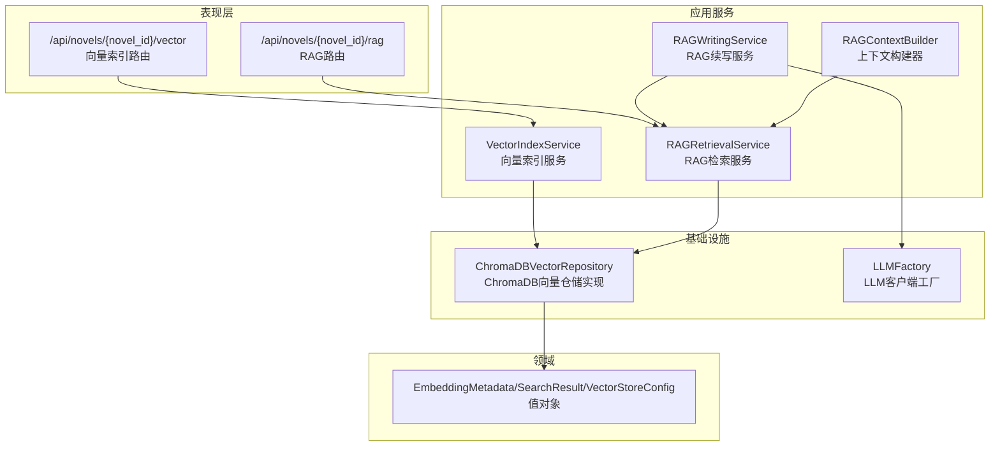
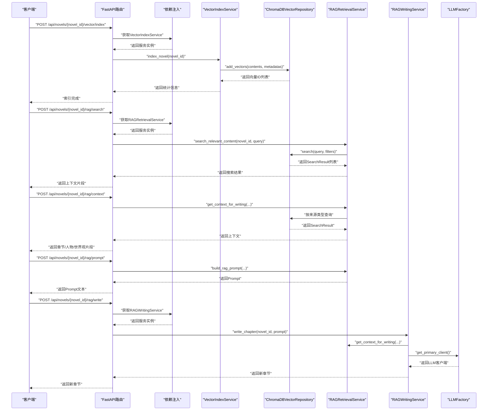
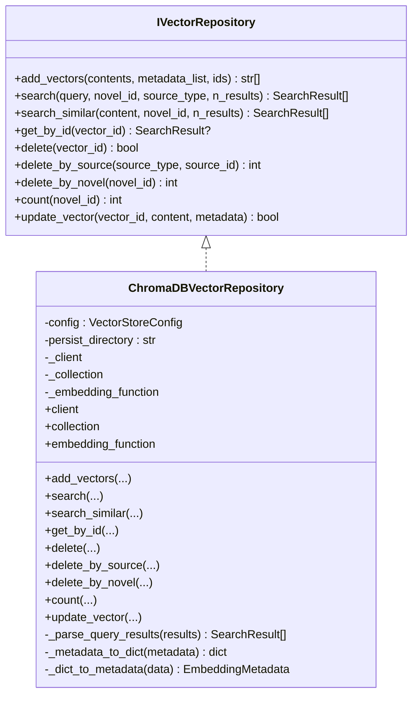
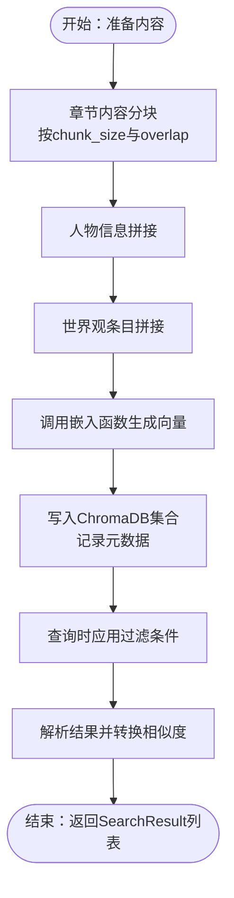
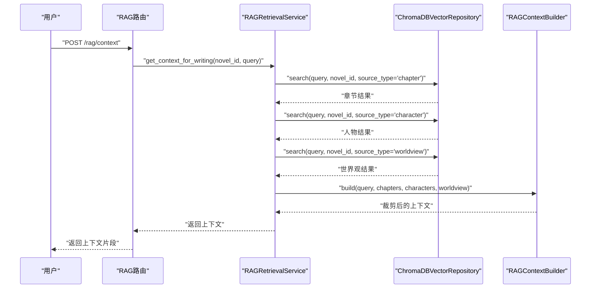
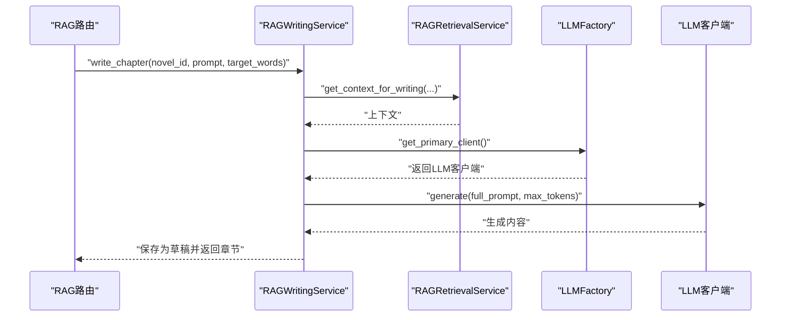
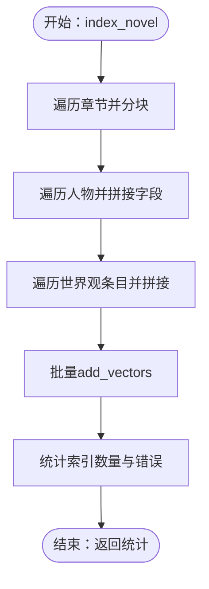
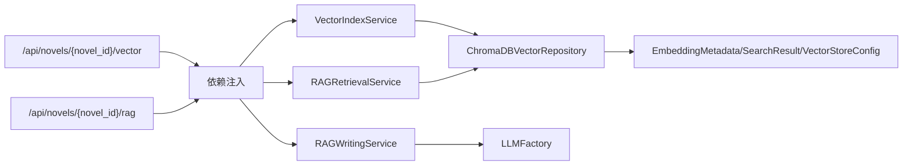

# 向量存储与RAG

<cite>
**本文引用的文件**
- [domain/repositories/vector_repository.py](file://domain/repositories/vector_repository.py)
- [infrastructure/persistence/chromadb_vector_repo.py](file://infrastructure/persistence/chromadb_vector_repo.py)
- [domain/value_objects/embedding.py](file://domain/value_objects/embedding.py)
- [application/services/vector_index_service.py](file://application/services/vector_index_service.py)
- [application/services/rag_retrieval_service.py](file://application/services/rag_retrieval_service.py)
- [application/services/rag_writing_service.py](file://application/services/rag_writing_service.py)
- [domain/services/rag_context_builder.py](file://domain/services/rag_context_builder.py)
- [presentation/api/routers/vector.py](file://presentation/api/routers/vector.py)
- [presentation/api/routers/rag.py](file://presentation/api/routers/rag.py)
- [presentation/api/dependencies.py](file://presentation/api/dependencies.py)
- [infrastructure/llm/llm_factory.py](file://infrastructure/llm/llm_factory.py)
- [tests/unit/test_vector_index_service.py](file://tests/unit/test_vector_index_service.py)
- [tests/unit/test_rag_retrieval_service.py](file://tests/unit/test_rag_retrieval_service.py)
</cite>

## 目录
1. [简介](#简介)
2. [项目结构](#项目结构)
3. [核心组件](#核心组件)
4. [架构总览](#架构总览)
5. [详细组件分析](#详细组件分析)
6. [依赖分析](#依赖分析)
7. [性能考虑](#性能考虑)
8. [故障排查指南](#故障排查指南)
9. [结论](#结论)
10. [附录](#附录)

## 简介
本文件面向InkTrace项目的向量存储与RAG系统，围绕ChromaDB向量数据库的选择与配置、嵌入向量的生成与存储、RAG检索与续写流程、向量索引的创建与管理、检索服务的实现与优化、性能与可靠性保障，以及在AI写作中的应用与评估展开。文档同时提供可视化图示与可操作的实践建议，帮助开发者与产品人员快速理解并落地该系统。

## 项目结构
InkTrace采用分层架构，向量与RAG相关代码主要分布在以下层次：
- 值对象与领域服务：定义向量元数据、搜索结果、上下文构建等核心概念与逻辑
- 应用服务：封装索引构建、RAG检索与续写等业务流程
- 基础设施：ChromaDB持久化实现与LLM客户端工厂
- 表现层：FastAPI路由与依赖注入，提供REST接口

图表来源
- [presentation/api/routers/vector.py:18-77](file://presentation/api/routers/vector.py#L18-L77)
- [presentation/api/routers/rag.py:18-112](file://presentation/api/routers/rag.py#L18-L112)
- [application/services/vector_index_service.py:21-206](file://application/services/vector_index_service.py#L21-L206)
- [application/services/rag_retrieval_service.py:20-156](file://application/services/rag_retrieval_service.py#L20-L156)
- [application/services/rag_writing_service.py:25-146](file://application/services/rag_writing_service.py#L25-L146)
- [domain/services/rag_context_builder.py:69-126](file://domain/services/rag_context_builder.py#L69-L126)
- [infrastructure/persistence/chromadb_vector_repo.py:19-270](file://infrastructure/persistence/chromadb_vector_repo.py#L19-L270)
- [domain/value_objects/embedding.py:14-79](file://domain/value_objects/embedding.py#L14-L79)
- [infrastructure/llm/llm_factory.py:31-121](file://infrastructure/llm/llm_factory.py#L31-L121)

章节来源
- [presentation/api/routers/vector.py:18-77](file://presentation/api/routers/vector.py#L18-L77)
- [presentation/api/routers/rag.py:18-112](file://presentation/api/routers/rag.py#L18-L112)
- [presentation/api/dependencies.py:92-178](file://presentation/api/dependencies.py#L92-L178)

## 核心组件
- 向量仓储接口与实现
  - 接口定义了添加、搜索、相似搜索、按ID获取、删除、计数、更新等能力
  - ChromaDB实现负责延迟初始化客户端、集合与嵌入函数，支持过滤条件查询与结果解析
- 值对象
  - EmbeddingMetadata：向量元数据，包含来源类型、来源ID、小说ID、分块索引、内容预览
  - SearchResult：搜索结果，包含ID、内容、相似度分数、元数据
  - VectorStoreConfig：向量存储配置，如集合名、嵌入模型、分块大小与重叠、距离度量
- 应用服务
  - VectorIndexService：对章节、人物、世界观进行内容分块与向量化，批量写入向量库
  - RAGRetrievalService：按来源类型检索章节/人物/世界观，组装RAG上下文并构建Prompt
  - RAGWritingService：结合LLM生成新章节内容，并保存为草稿
  - RAGContextBuilder：按Token上限裁剪上下文，确保提示长度合理
- 路由与依赖注入
  - FastAPI路由提供索引构建、状态查询、删除索引、RAG搜索、上下文与Prompt构建
  - 依赖注入模块统一管理仓储与服务实例，支持环境变量配置

章节来源
- [domain/repositories/vector_repository.py:17-95](file://domain/repositories/vector_repository.py#L17-L95)
- [infrastructure/persistence/chromadb_vector_repo.py:19-270](file://infrastructure/persistence/chromadb_vector_repo.py#L19-L270)
- [domain/value_objects/embedding.py:14-79](file://domain/value_objects/embedding.py#L14-L79)
- [application/services/vector_index_service.py:21-206](file://application/services/vector_index_service.py#L21-L206)
- [application/services/rag_retrieval_service.py:20-156](file://application/services/rag_retrieval_service.py#L20-L156)
- [application/services/rag_writing_service.py:25-146](file://application/services/rag_writing_service.py#L25-L146)
- [domain/services/rag_context_builder.py:69-126](file://domain/services/rag_context_builder.py#L69-L126)
- [presentation/api/routers/vector.py:18-77](file://presentation/api/routers/vector.py#L18-L77)
- [presentation/api/routers/rag.py:18-112](file://presentation/api/routers/rag.py#L18-L112)
- [presentation/api/dependencies.py:92-178](file://presentation/api/dependencies.py#L92-L178)

## 架构总览
下图展示从API到向量库与LLM的端到端流程，涵盖索引构建、RAG检索与续写。

图表来源
- [presentation/api/routers/vector.py:39-77](file://presentation/api/routers/vector.py#L39-L77)
- [presentation/api/routers/rag.py:46-112](file://presentation/api/routers/rag.py#L46-L112)
- [presentation/api/dependencies.py:163-178](file://presentation/api/dependencies.py#L163-L178)
- [application/services/vector_index_service.py:38-53](file://application/services/vector_index_service.py#L38-L53)
- [application/services/rag_retrieval_service.py:33-121](file://application/services/rag_retrieval_service.py#L33-L121)
- [application/services/rag_writing_service.py:42-88](file://application/services/rag_writing_service.py#L42-L88)
- [infrastructure/persistence/chromadb_vector_repo.py:74-131](file://infrastructure/persistence/chromadb_vector_repo.py#L74-L131)
- [infrastructure/llm/llm_factory.py:78-95](file://infrastructure/llm/llm_factory.py#L78-L95)

## 详细组件分析

### 向量仓储接口与ChromaDB实现
- 接口职责
  - 批量添加向量、按条件搜索、相似内容搜索、按ID获取、删除、按来源删除、按小说删除、计数、更新
- ChromaDB实现要点
  - 延迟初始化：客户端、集合、嵌入函数均按需创建，减少启动开销
  - 过滤查询：支持基于小说ID与来源类型的组合过滤
  - 结果解析：将距离转换为相似度分数，构造SearchResult
  - 元数据映射：EmbeddingMetadata与字典双向转换，保证序列化一致性

图表来源
- [domain/repositories/vector_repository.py:17-95](file://domain/repositories/vector_repository.py#L17-L95)
- [infrastructure/persistence/chromadb_vector_repo.py:19-270](file://infrastructure/persistence/chromadb_vector_repo.py#L19-L270)

章节来源
- [domain/repositories/vector_repository.py:17-95](file://domain/repositories/vector_repository.py#L17-L95)
- [infrastructure/persistence/chromadb_vector_repo.py:19-270](file://infrastructure/persistence/chromadb_vector_repo.py#L19-L270)

### 嵌入向量生成与存储机制
- 文本预处理
  - 章节内容按配置的分块大小与重叠进行切分，确保上下文连续性
  - 人物信息按字段拼接为结构化文本，便于语义表达
- 向量维度与嵌入函数
  - 使用SentenceTransformer嵌入函数，模型名称为“shibing624/text2vec-base-chinese”，适合中文语料
  - 集合元数据设置空间度量为余弦距离，提升中文相似度匹配效果
- 存储与检索
  - 批量写入时生成唯一ID，记录元数据（来源类型、来源ID、小说ID、分块索引、内容预览）
  - 查询时支持多条件过滤与结果解析，相似度由距离转换而来

图表来源
- [application/services/vector_index_service.py:55-177](file://application/services/vector_index_service.py#L55-L177)
- [infrastructure/persistence/chromadb_vector_repo.py:74-131](file://infrastructure/persistence/chromadb_vector_repo.py#L74-L131)
- [domain/value_objects/embedding.py:14-79](file://domain/value_objects/embedding.py#L14-L79)

章节来源
- [application/services/vector_index_service.py:55-177](file://application/services/vector_index_service.py#L55-L177)
- [infrastructure/persistence/chromadb_vector_repo.py:74-131](file://infrastructure/persistence/chromadb_vector_repo.py#L74-L131)
- [domain/value_objects/embedding.py:14-79](file://domain/value_objects/embedding.py#L14-L79)

### RAG检索与上下文构建
- 检索策略
  - 支持按来源类型（章节/人物/世界观）分别检索，便于定向召回
  - 支持按小说ID过滤，确保跨来源的一致性
- 上下文构建
  - RAGRetrievalService聚合三类结果，形成续写上下文
  - RAGContextBuilder按Token上限裁剪，优先保留章节与人物信息
- Prompt构建
  - 将上下文与用户创作要求拼接，控制输出长度与风格一致性

图表来源
- [application/services/rag_retrieval_service.py:92-121](file://application/services/rag_retrieval_service.py#L92-L121)
- [domain/services/rag_context_builder.py:75-116](file://domain/services/rag_context_builder.py#L75-L116)
- [infrastructure/persistence/chromadb_vector_repo.py:97-131](file://infrastructure/persistence/chromadb_vector_repo.py#L97-L131)

章节来源
- [application/services/rag_retrieval_service.py:92-156](file://application/services/rag_retrieval_service.py#L92-L156)
- [domain/services/rag_context_builder.py:69-126](file://domain/services/rag_context_builder.py#L69-L126)

### RAG续写服务与LLM集成
- 续写流程
  - 获取最新章节与RAG上下文，构建续写Prompt
  - 通过LLMFactory选择主备模型，调用生成接口
  - 保存新章节为草稿，供后续审阅与发布
- Token与长度控制
  - 通过目标字数与最大上下文长度控制生成长度，避免超出模型上下文

图表来源
- [application/services/rag_writing_service.py:42-88](file://application/services/rag_writing_service.py#L42-L88)
- [infrastructure/llm/llm_factory.py:78-95](file://infrastructure/llm/llm_factory.py#L78-L95)

章节来源
- [application/services/rag_writing_service.py:25-146](file://application/services/rag_writing_service.py#L25-L146)
- [infrastructure/llm/llm_factory.py:31-121](file://infrastructure/llm/llm_factory.py#L31-L121)

### 向量索引的创建与管理
- 创建流程
  - 索引小说内容：遍历章节、人物、世界观条目，分块后批量写入
  - 记录统计信息：章节/人物/世界观索引数量与错误列表
- 删除与状态
  - 支持按来源删除与按小说删除，便于增量维护
  - 提供索引状态查询，判断是否已建立索引

图表来源
- [application/services/vector_index_service.py:38-53](file://application/services/vector_index_service.py#L38-L53)
- [application/services/vector_index_service.py:55-153](file://application/services/vector_index_service.py#L55-L153)

章节来源
- [application/services/vector_index_service.py:21-206](file://application/services/vector_index_service.py#L21-L206)
- [presentation/api/routers/vector.py:39-77](file://presentation/api/routers/vector.py#L39-L77)

## 依赖分析
- 组件耦合
  - 应用服务依赖仓储接口，便于替换底层实现
  - 路由依赖依赖注入模块，集中管理服务与仓储实例
- 外部依赖
  - ChromaDB作为向量数据库，提供持久化与近似最近邻检索
  - SentenceTransformer嵌入函数，适配中文语料
  - LLMFactory提供主备模型切换，增强可用性

图表来源
- [presentation/api/dependencies.py:163-178](file://presentation/api/dependencies.py#L163-L178)
- [presentation/api/routers/vector.py:34-36](file://presentation/api/routers/vector.py#L34-L36)
- [presentation/api/routers/rag.py:41-43](file://presentation/api/routers/rag.py#L41-L43)

章节来源
- [presentation/api/dependencies.py:92-178](file://presentation/api/dependencies.py#L92-L178)

## 性能考虑
- 内存与磁盘
  - ChromaDB采用持久化客户端，避免重复加载；延迟初始化减少常驻内存占用
  - 分块大小与重叠参数影响向量数量与召回质量，需权衡检索速度与上下文完整性
- 查询加速
  - 使用余弦距离与合适的集合元数据，有助于提升检索效率
  - 过滤条件尽量包含小说ID，缩小搜索空间
- 缓存机制
  - 依赖注入层使用LRU缓存，复用仓储与服务实例，降低重复创建成本
- Token与上下文控制
  - RAGContextBuilder按Token上限裁剪，避免超限导致的错误或性能退化
- 并发与稳定性
  - LLMFactory支持主备模型切换，提高生成服务可用性

章节来源
- [infrastructure/persistence/chromadb_vector_repo.py:35-72](file://infrastructure/persistence/chromadb_vector_repo.py#L35-L72)
- [domain/services/rag_context_builder.py:118-126](file://domain/services/rag_context_builder.py#L118-L126)
- [presentation/api/dependencies.py:50-96](file://presentation/api/dependencies.py#L50-L96)
- [infrastructure/llm/llm_factory.py:78-121](file://infrastructure/llm/llm_factory.py#L78-L121)

## 故障排查指南
- 向量检索为空
  - 检查是否已完成索引构建与分块
  - 确认过滤条件（小说ID、来源类型）是否正确
- 相似度异常
  - 确认集合距离度量为余弦
  - 检查嵌入函数是否成功初始化
- LLM生成失败
  - 切换备用模型或检查主模型可用性
  - 控制Prompt长度，避免超出上下文限制
- 索引状态不一致
  - 使用状态查询接口确认向量数量
  - 必要时执行按来源或按小说删除后重建索引

章节来源
- [tests/unit/test_rag_retrieval_service.py:225-278](file://tests/unit/test_rag_retrieval_service.py#L225-L278)
- [tests/unit/test_vector_index_service.py:241-272](file://tests/unit/test_vector_index_service.py#L241-L272)
- [infrastructure/llm/llm_factory.py:78-121](file://infrastructure/llm/llm_factory.py#L78-L121)

## 结论
InkTrace的向量存储与RAG系统以ChromaDB为核心，结合中文嵌入模型与结构化元数据，实现了面向中文小说写作的高效检索与续写。通过分层架构与依赖注入，系统具备良好的可扩展性与可维护性；通过上下文裁剪与模型切换，兼顾了性能与稳定性。建议在生产环境中持续监控索引规模、查询延迟与生成质量，并根据业务反馈迭代分块策略与检索参数。

## 附录
- API端点概览
  - 索引管理：POST /api/novels/{novel_id}/vector/index、GET /api/novels/{novel_id}/vector/status、DELETE /api/novels/{novel_id}/vector/index
  - RAG检索：POST /api/novels/{novel_id}/rag/search、POST /api/novels/{novel_id}/rag/context、POST /api/novels/{novel_id}/rag/prompt
- 关键配置项
  - 向量存储配置：集合名、嵌入模型、分块大小、重叠、距离度量
  - LLM配置：主备模型API密钥、基础URL与模型名称
- 测试覆盖
  - 单元测试覆盖索引服务、RAG检索服务的关键分支与边界情况，建议在新增功能时同步补充

章节来源
- [presentation/api/routers/vector.py:39-77](file://presentation/api/routers/vector.py#L39-L77)
- [presentation/api/routers/rag.py:46-112](file://presentation/api/routers/rag.py#L46-L112)
- [domain/value_objects/embedding.py:71-79](file://domain/value_objects/embedding.py#L71-L79)
- [infrastructure/llm/llm_factory.py:19-29](file://infrastructure/llm/llm_factory.py#L19-L29)
- [tests/unit/test_vector_index_service.py:1-318](file://tests/unit/test_vector_index_service.py#L1-L318)
- [tests/unit/test_rag_retrieval_service.py:1-278](file://tests/unit/test_rag_retrieval_service.py#L1-L278)