# 数据库集成

<cite>
**本文引用的文件**
- [dependencies.py](file://presentation/api/dependencies.py)
- [sqlite_novel_repo.py](file://infrastructure/persistence/sqlite_novel_repo.py)
- [sqlite_chapter_repo.py](file://infrastructure/persistence/sqlite_chapter_repo.py)
- [sqlite_character_repo.py](file://infrastructure/persistence/sqlite_character_repo.py)
- [sqlite_outline_repo.py](file://infrastructure/persistence/sqlite_outline_repo.py)
- [sqlite_project_repo.py](file://infrastructure/persistence/sqlite_project_repo.py)
- [sqlite_template_repo.py](file://infrastructure/persistence/sqlite_template_repo.py)
- [sqlite_worldview_repo.py](file://infrastructure/persistence/sqlite_worldview_repo.py)
- [sqlite_foreshadow_repo.py](file://infrastructure/persistence/sqlite_foreshadow_repo.py)
- [novel.py](file://domain/entities/novel.py)
- [chapter.py](file://domain/entities/chapter.py)
- [character.py](file://domain/entities/character.py)
- [outline.py](file://domain/entities/outline.py)
- [types.py](file://domain/types.py)
- [requirements.txt](file://requirements.txt)
</cite>

## 目录
1. [简介](#简介)
2. [项目结构](#项目结构)
3. [核心组件](#核心组件)
4. [架构总览](#架构总览)
5. [详细组件分析](#详细组件分析)
6. [依赖分析](#依赖分析)
7. [性能考虑](#性能考虑)
8. [故障排查指南](#故障排查指南)
9. [结论](#结论)
10. [附录](#附录)

## 简介
本文件面向InkTrace项目的数据库集成，系统性阐述SQLite作为默认持久化方案的选择理由、配置策略、实体表Schema设计、仓储层实现与查询优化，并补充事务管理、并发控制、备份与监控等运维要点。当前代码库采用原生SQLite与自定义仓储实现，未引入SQLAlchemy ORM，因此本文重点围绕SQLite原生SQL与仓储模式展开。

## 项目结构
InkTrace的数据库相关代码主要分布在以下位置：
- 领域层：实体与值对象定义，统一使用强类型的ID值对象与枚举，便于仓储映射与查询条件构造。
- 基础设施层：各实体的SQLite仓储实现，负责建表、CRUD、JSON序列化以及外键约束。
- 表现层：依赖注入模块集中管理仓储实例与环境变量，提供统一的数据库路径与向量存储目录。

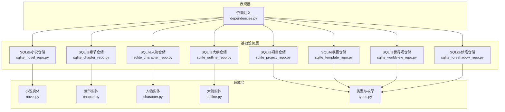

**图表来源**
- [dependencies.py:1-178](file://presentation/api/dependencies.py#L1-L178)
- [sqlite_novel_repo.py:1-51](file://infrastructure/persistence/sqlite_novel_repo.py#L1-L51)
- [sqlite_chapter_repo.py:1-125](file://infrastructure/persistence/sqlite_chapter_repo.py#L1-L125)
- [sqlite_character_repo.py:1-150](file://infrastructure/persistence/sqlite_character_repo.py#L1-L150)
- [sqlite_outline_repo.py:1-182](file://infrastructure/persistence/sqlite_outline_repo.py#L1-L182)
- [sqlite_project_repo.py:1-46](file://infrastructure/persistence/sqlite_project_repo.py#L1-L46)
- [sqlite_template_repo.py:1-165](file://infrastructure/persistence/sqlite_template_repo.py#L1-L165)
- [sqlite_worldview_repo.py:1-325](file://infrastructure/persistence/sqlite_worldview_repo.py#L1-L325)
- [sqlite_foreshadow_repo.py:1-138](file://infrastructure/persistence/sqlite_foreshadow_repo.py#L1-L138)
- [novel.py:1-178](file://domain/entities/novel.py#L1-L178)
- [chapter.py:1-109](file://domain/entities/chapter.py#L1-L109)
- [character.py:1-273](file://domain/entities/character.py#L1-L273)
- [outline.py:1-257](file://domain/entities/outline.py#L1-L257)
- [types.py:1-284](file://domain/types.py#L1-L284)

**章节来源**
- [dependencies.py:1-178](file://presentation/api/dependencies.py#L1-L178)

## 核心组件
- 依赖注入与数据库路径
  - 通过环境变量统一管理数据库文件路径与向量库目录，避免硬编码，便于部署与测试隔离。
  - 使用LRU缓存函数在请求范围内复用仓储实例，降低连接开销并保持一致性。
- 实体与类型
  - 所有实体均以强类型ID值对象承载标识，配合枚举保证状态与类型安全，便于仓储层参数绑定与查询过滤。
- 仓储层
  - 每个实体对应独立仓储类，负责建表、CRUD、JSON序列化（用于复杂字段）与外键约束声明。
  - 统一使用原生SQLite连接，部分仓储启用Row工厂以简化结果集访问。

**章节来源**
- [dependencies.py:45-101](file://presentation/api/dependencies.py#L45-L101)
- [types.py:15-284](file://domain/types.py#L15-L284)

## 架构总览
下图展示API依赖注入到仓储再到实体的数据流与职责边界：

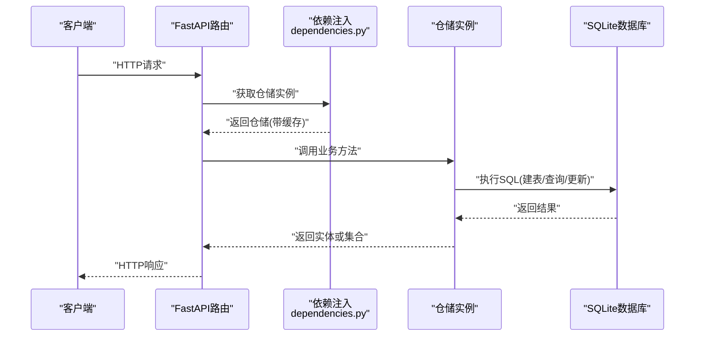

**图表来源**
- [dependencies.py:50-101](file://presentation/api/dependencies.py#L50-L101)
- [sqlite_novel_repo.py:33-51](file://infrastructure/persistence/sqlite_novel_repo.py#L33-L51)
- [sqlite_chapter_repo.py:32-125](file://infrastructure/persistence/sqlite_chapter_repo.py#L32-L125)
- [sqlite_character_repo.py:33-150](file://infrastructure/persistence/sqlite_character_repo.py#L33-L150)
- [sqlite_outline_repo.py:33-182](file://infrastructure/persistence/sqlite_outline_repo.py#L33-L182)

## 详细组件分析

### 小说表（novels）
- 设计要点
  - 主键：id（文本）
  - 字段：标题、作者、题材、目标字数、当前字数、状态、时间戳
  - 索引建议：按需对author、genre、status建立索引；对created_at、updated_at建立索引以支持排序与范围查询
- 仓储行为
  - 初始化建表、保存（INSERT OR REPLACE）、按ID查询、全量查询、删除
- 关系映射
  - 章节、人物、大纲、项目等均通过novel_id外键关联至novels.id

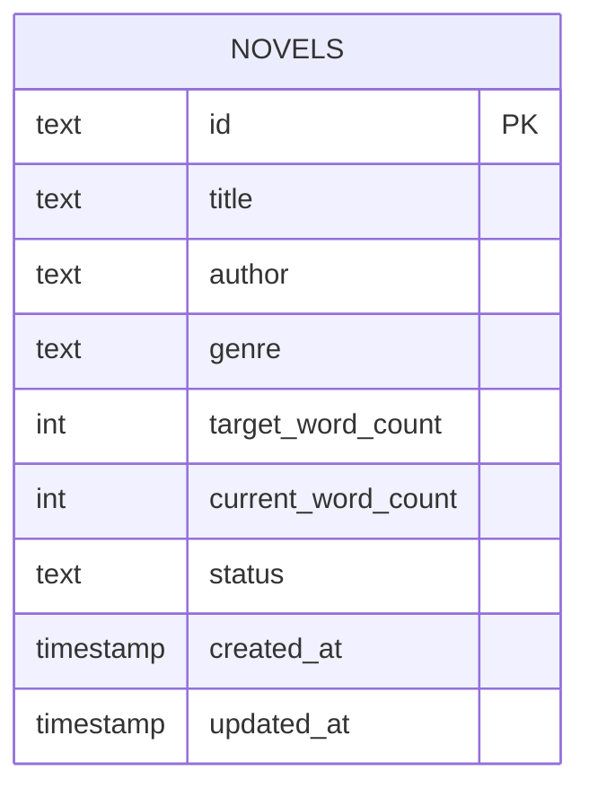

**图表来源**
- [sqlite_novel_repo.py:36-48](file://infrastructure/persistence/sqlite_novel_repo.py#L36-L48)

**章节来源**
- [sqlite_novel_repo.py:20-51](file://infrastructure/persistence/sqlite_novel_repo.py#L20-L51)
- [novel.py:20-178](file://domain/entities/novel.py#L20-L178)

### 章节表（chapters）
- 设计要点
  - 主键：id（文本）
  - 外键：novel_id → novels.id
  - 字段：编号、标题、内容、字数、摘要、状态、时间戳
  - 索引建议：按novel_id+number组合索引以加速章节顺序查询；按status建立二级索引
- 仓储行为
  - 保存、按ID查询、按novel_id查询、查询最新N条、删除

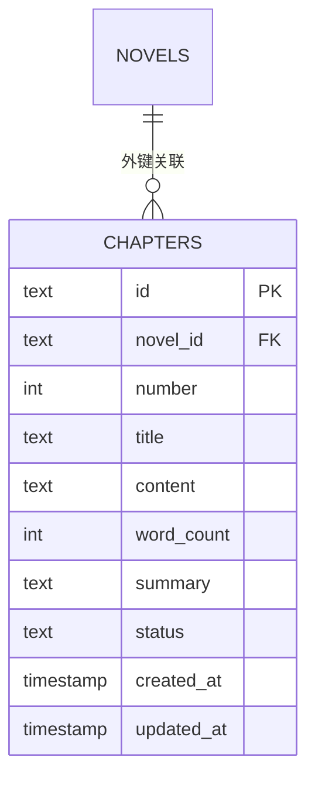

**图表来源**
- [sqlite_chapter_repo.py:35-49](file://infrastructure/persistence/sqlite_chapter_repo.py#L35-L49)

**章节来源**
- [sqlite_chapter_repo.py:19-125](file://infrastructure/persistence/sqlite_chapter_repo.py#L19-L125)
- [chapter.py:18-109](file://domain/entities/chapter.py#L18-L109)

### 人物表（characters）
- 设计要点
  - 主键：id（文本）
  - 外键：novel_id → novels.id
  - 字段：姓名、角色、背景、个性、别名、能力、关系、当前状态、出场次数、首次出场章节、时间戳
  - JSON字段：别名、能力、关系（兼容两期）
  - 索引建议：按novel_id建立索引；按first_appearance建立索引以支持出场统计
- 仓储行为
  - 保存（JSON序列化）、按ID查询、按novel_id查询、删除

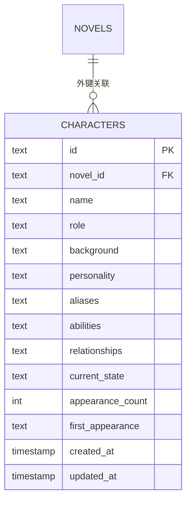

**图表来源**
- [sqlite_character_repo.py:35-54](file://infrastructure/persistence/sqlite_character_repo.py#L35-L54)

**章节来源**
- [sqlite_character_repo.py:20-150](file://infrastructure/persistence/sqlite_character_repo.py#L20-L150)
- [character.py:18-273](file://domain/entities/character.py#L18-L273)

### 大纲表（outlines）
- 设计要点
  - 主键：id（文本），novel_id唯一约束
  - 外键：novel_id → novels.id
  - JSON字段：主线、副线、分卷
  - 索引建议：按novel_id建立索引
- 仓储行为
  - 保存（JSON序列化）、按ID查询、按novel_id查询、删除

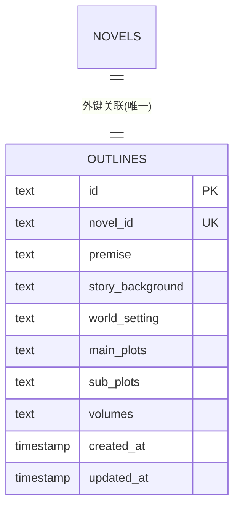

**图表来源**
- [sqlite_outline_repo.py:35-50](file://infrastructure/persistence/sqlite_outline_repo.py#L35-L50)

**章节来源**
- [sqlite_outline_repo.py:20-182](file://infrastructure/persistence/sqlite_outline_repo.py#L20-L182)
- [outline.py:17-257](file://domain/entities/outline.py#L17-L257)

### 项目表（projects）
- 设计要点
  - 主键：id（文本）
  - 外键：novel_id → novels.id
  - 字段：名称、novel_id、配置JSON、状态、时间戳
  - 索引建议：按novel_id建立索引
- 仓储行为
  - 初始化建表、保存、查询、删除

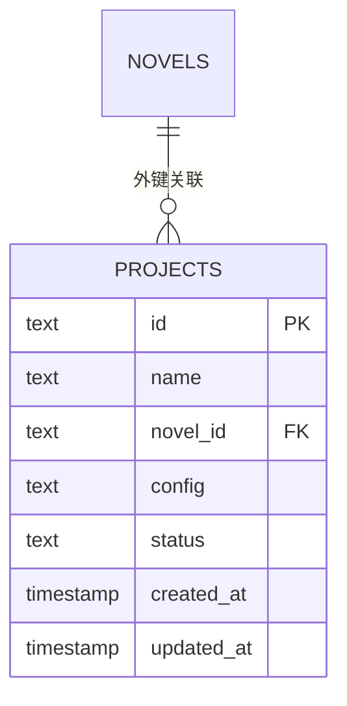

**图表来源**
- [sqlite_project_repo.py:33-44](file://infrastructure/persistence/sqlite_project_repo.py#L33-L44)

**章节来源**
- [sqlite_project_repo.py:21-46](file://infrastructure/persistence/sqlite_project_repo.py#L21-L46)

### 模板表（templates）
- 设计要点
  - 主键：id（文本）
  - 字段：名称、题材、描述、世界观框架、人物模板、剧情模板、风格参考、是否内置、时间戳
  - JSON字段：多处JSON数组/对象
  - 索引建议：按genre建立索引；按is_builtin建立索引
- 仓储行为
  - 初始化建表、保存（JSON序列化）、按ID/题材/内置/自定义查询、删除

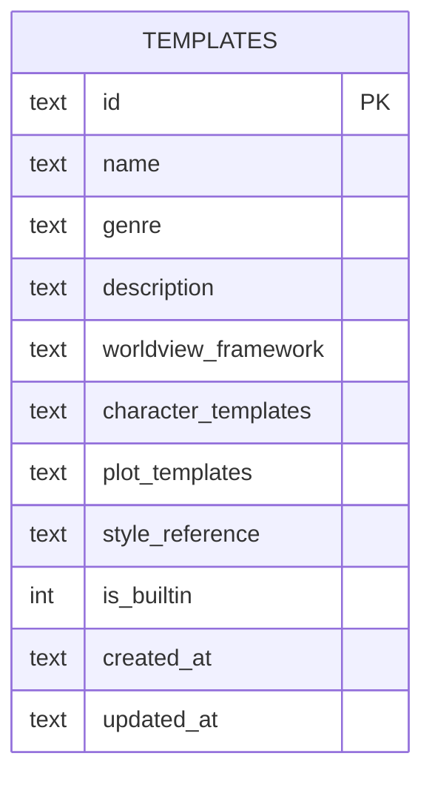

**图表来源**
- [sqlite_template_repo.py:32-48](file://infrastructure/persistence/sqlite_template_repo.py#L32-L48)

**章节来源**
- [sqlite_template_repo.py:21-165](file://infrastructure/persistence/sqlite_template_repo.py#L21-L165)

### 世界观表族（worldviews及子表）
- 设计要点
  - 主表：worldviews（id、novel_id、名称、体系JSON、时间戳）
  - 子表：techniques、factions、locations、items（均含novel_id与created_at/updated_at）
  - 外键：各子表novel_id → novels.id
  - JSON字段：power_system、currency_system、timeline、level、relations等
  - 索引建议：按novel_id建立索引；按technique.level、faction.level等复合索引
- 仓储行为
  - 初始化多表、保存/删除（INSERT OR REPLACE）、批量写入（事务内）

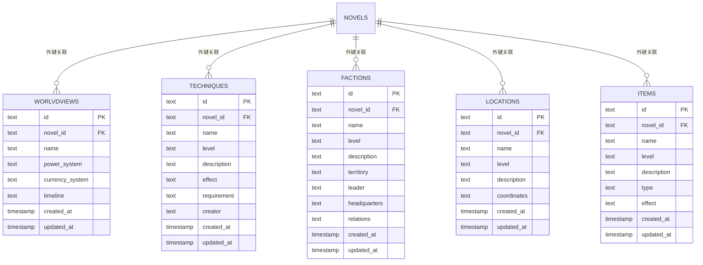

**图表来源**
- [sqlite_worldview_repo.py:33-299](file://infrastructure/persistence/sqlite_worldview_repo.py#L33-L299)

**章节来源**
- [sqlite_worldview_repo.py:24-325](file://infrastructure/persistence/sqlite_worldview_repo.py#L24-L325)

### 伏笔表（foreshadows）
- 设计要点
  - 主键：id（文本）
  - 外键：novel_id → novels.id，chapter_id → chapters.id
  - 字段：内容、类型、状态、解析章节、时间戳
  - 索引建议：按novel_id、chapter_id、status建立索引
- 仓储行为
  - 初始化建表、按ID/小说/待处理/章节查询、保存、删除、解析状态更新、计数

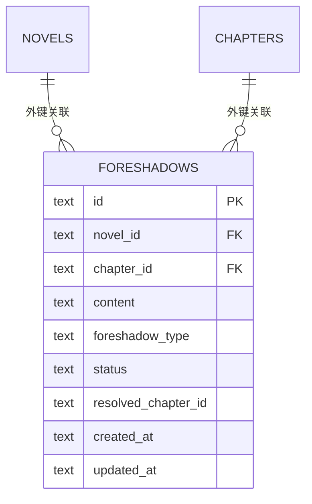

**图表来源**
- [sqlite_foreshadow_repo.py:27-45](file://infrastructure/persistence/sqlite_foreshadow_repo.py#L27-L45)

**章节来源**
- [sqlite_foreshadow_repo.py:19-138](file://infrastructure/persistence/sqlite_foreshadow_repo.py#L19-L138)

### LLM配置表（llm_config）
- 设计要点
  - 自增主键：id（整型）
  - 字段：DeepSeek与Kimi API Key、加密Key哈希、时间戳
  - 索引建议：按created_at/updated_at建立索引
- 仓储行为
  - 初始化建表、保存、查询

**章节来源**
- [sqlite_llm_config_repo.py:18-46](file://infrastructure/persistence/sqlite_llm_config_repo.py#L18-L46)

## 依赖分析
- 外部依赖
  - FastAPI、Uvicorn、Pydantic、httpx、chromadb、sentence-transformers、pytest等
  - 当前未使用SQLAlchemy ORM，仓储直接基于sqlite3
- 内部依赖
  - 依赖注入模块集中管理仓储实例，避免循环导入与重复初始化
  - 类型系统（types.py）为仓储层提供强类型参数绑定与查询条件构造基础

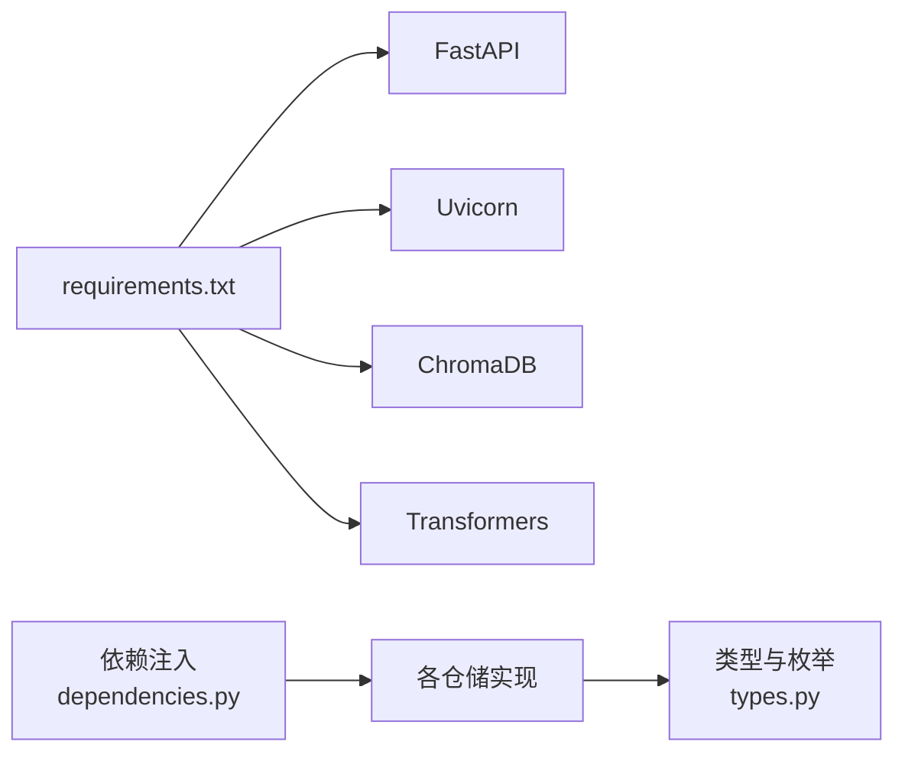

**图表来源**
- [requirements.txt:1-10](file://requirements.txt#L1-L10)
- [dependencies.py:11-31](file://presentation/api/dependencies.py#L11-L31)

**章节来源**
- [requirements.txt:1-10](file://requirements.txt#L1-L10)
- [dependencies.py:11-31](file://presentation/api/dependencies.py#L11-L31)

## 性能考虑
- 连接与并发
  - 当前仓储逐次创建连接并执行SQL，适合单进程/轻量并发场景。若并发较高，建议引入连接池（如sqlite3的apilevel=2连接池或第三方库）与事务批处理。
- 索引策略
  - 常用查询条件字段（如novel_id、chapter_id、status、author、genre、created_at）应建立索引，避免全表扫描。
  - 对JSON字段进行检索时，建议将高频过滤字段拆分到独立列或建立虚拟列+索引。
- 查询优化
  - 使用LIMIT限制结果集大小；对排序字段建立复合索引；避免SELECT *，仅选择必要列。
  - 对JSON序列化的字段（如人物关系、大纲节点）尽量减少深度查询，必要时在入库时做冗余字段。
- 事务与锁
  - 批量写入（如批量保存章节/人物/世界设定）应在单事务内完成，减少锁竞争与回滚成本。
- I/O与磁盘
  - 将数据库文件置于SSD可显著提升随机读写性能；定期VACUUM整理碎片。
- 监控与诊断
  - 记录慢查询日志（PRAGMA temp_store=MEMORY; PRAGMA journal_mode=WAL;）；对关键仓储方法埋点统计耗时与QPS。

## 故障排查指南
- 常见问题
  - 外键约束失败：确认父表记录存在后再插入子表；检查novel_id/ chapter_id格式与类型一致。
  - JSON反序列化异常：入库前确保JSON序列化正确；查询后对缺失字段提供默认值。
  - 并发写入冲突：在高并发场景下，将多个INSERT合并为事务；避免长事务持有写锁。
- 排查步骤
  - 启用WAL模式与内存临时存储以减少锁等待。
  - 使用EXPLAIN QUERY PLAN分析复杂查询的执行路径，识别缺失索引或不合理的连接顺序。
  - 对频繁更新的表定期执行VACUUM与ANALYZE（SQLite在较新版本支持ANALYZE）。
- 日志与观测
  - 在依赖注入模块与仓储层增加统一的日志记录，区分错误级别与上下文信息。
  - 对关键业务（如章节发布、人物关系变更、大纲更新）记录审计轨迹。

## 结论
InkTrace当前采用原生SQLite与仓储模式实现数据持久化，结构清晰、易于维护。通过强类型ID与枚举保障了数据一致性，JSON字段满足灵活扩展需求。建议在后续迭代中引入连接池、索引优化与事务批处理，以进一步提升并发与性能；同时完善备份与监控机制，确保生产环境稳定运行。

## 附录
- 数据库初始化与迁移
  - 初始化：仓储构造时自动建表，确保首次运行即具备完整Schema。
  - 迁移：当前未实现版本化迁移脚本。建议引入轻量迁移工具或在仓储初始化中增加版本检查与增量ALTER语句。
- 备份与恢复
  - 建议定期导出数据库文件；生产环境可结合WAL模式与只读副本实现热备。
- 安全与合规
  - 对敏感配置（如LLM API Key）建议加密存储与访问控制；对JSON字段进行输入校验与长度限制。