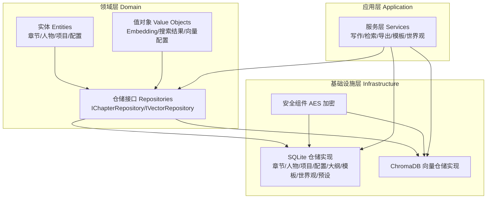
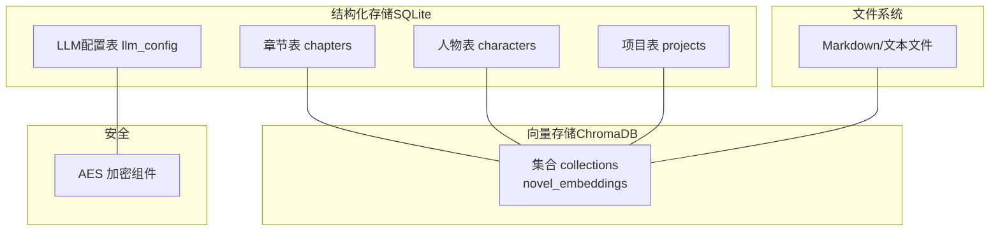
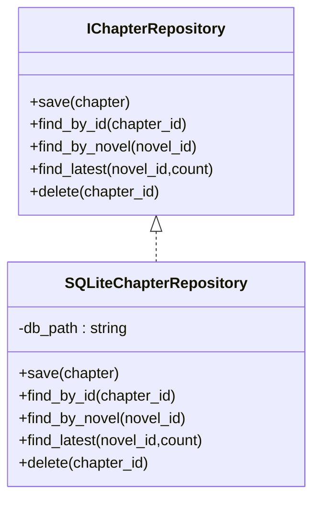
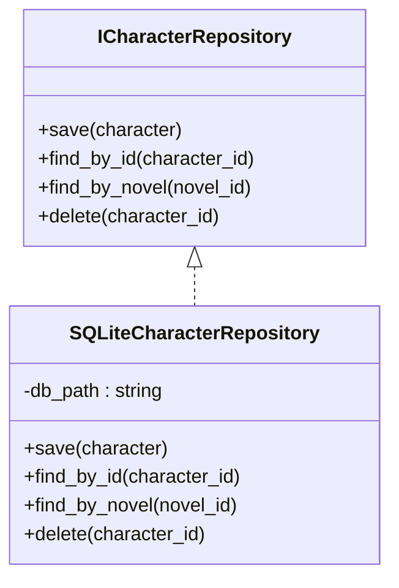
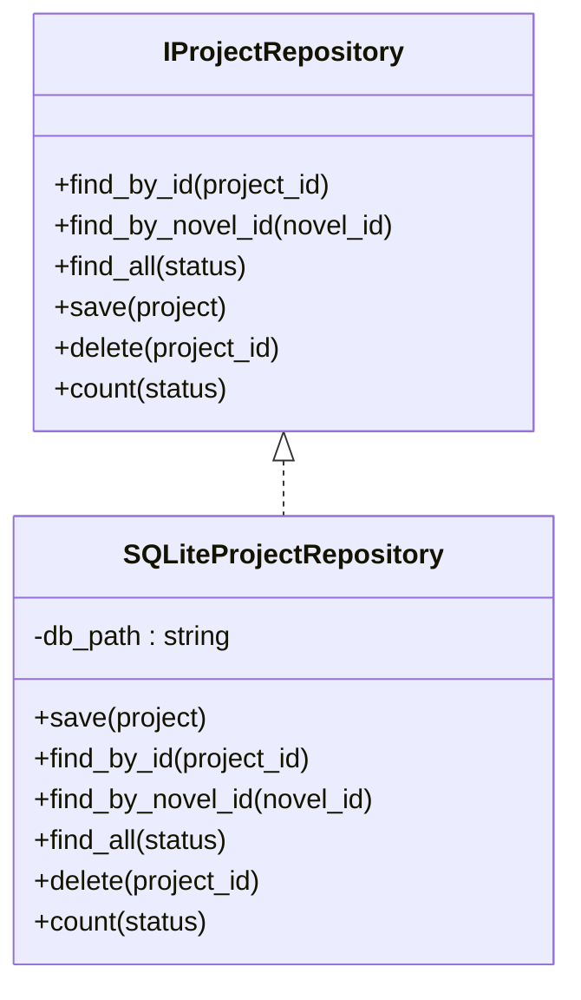
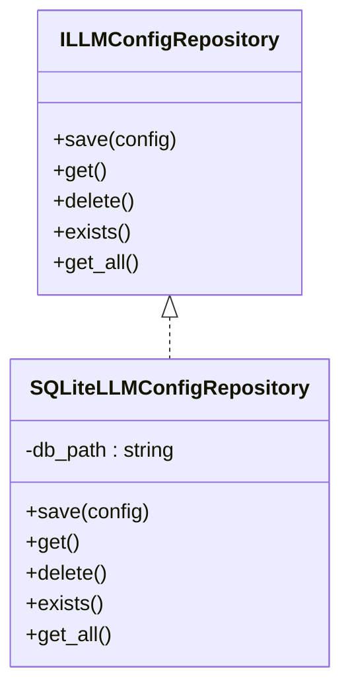
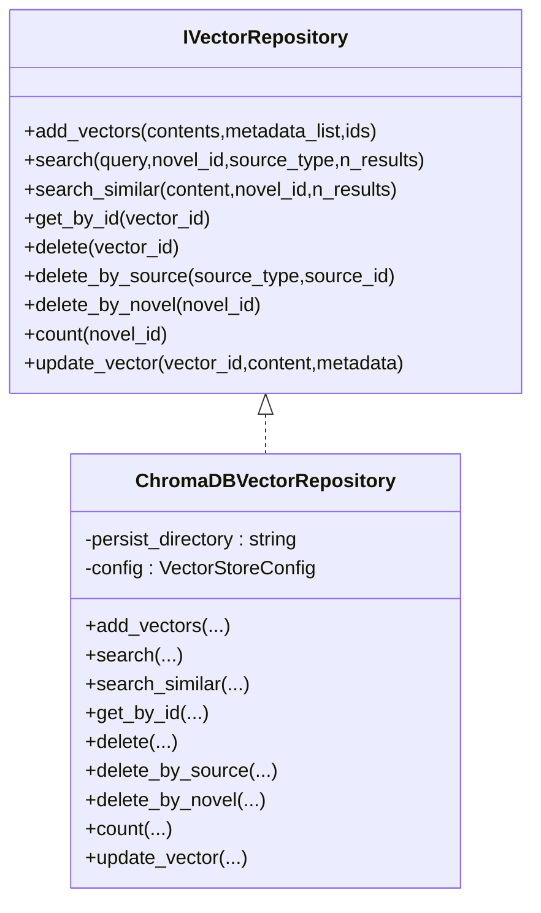
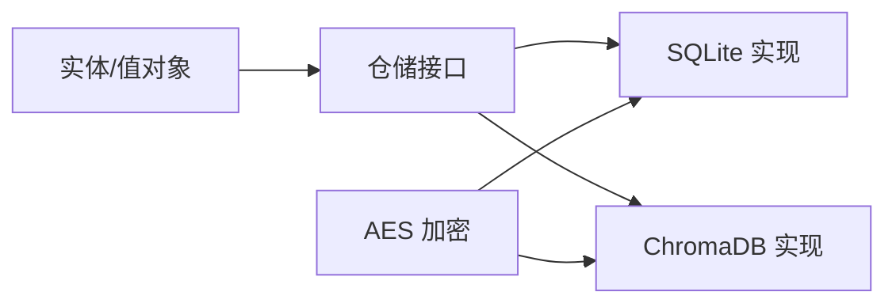

# 数据持久化策略

<cite>
**本文引用的文件**
- [sqlite_chapter_repo.py](file://infrastructure/persistence/sqlite_chapter_repo.py)
- [sqlite_character_repo.py](file://infrastructure/persistence/sqlite_character_repo.py)
- [sqlite_llm_config_repo.py](file://infrastructure/persistence/sqlite_llm_config_repo.py)
- [sqlite_project_repo.py](file://infrastructure/persistence/sqlite_project_repo.py)
- [chromadb_vector_repo.py](file://infrastructure/persistence/chromadb_vector_repo.py)
- [chapter_repository.py](file://domain/repositories/chapter_repository.py)
- [vector_repository.py](file://domain/repositories/vector_repository.py)
- [embedding.py](file://domain/value_objects/embedding.py)
- [chapter.py](file://domain/entities/chapter.py)
- [character.py](file://domain/entities/character.py)
- [llm_config.py](file://domain/entities/llm_config.py)
- [llm_config_repository.py](file://domain/repositories/llm_config_repository.py)
- [aes_encryption.py](file://infrastructure/security/aes_encryption.py)
- [sqlite_novel_repo.py](file://infrastructure/persistence/sqlite_novel_repo.py)
- [sqlite_outline_repo.py](file://infrastructure/persistence/sqlite_outline_repo.py)
- [sqlite_template_repo.py](file://infrastructure/persistence/sqlite_template_repo.py)
- [sqlite_worldview_repo.py](file://infrastructure/persistence/sqlite_worldview_repo.py)
- [sqlite_foreshadow_repo.py](file://infrastructure/persistence/sqlite_foreshadow_repo.py)
- [sqlite_llm_config_schema.sql](file://infrastructure/persistence/llm_config_schema.sql)
- [sqlite_config_schema.sql](file://infrastructure/persistence/sqlite_config_schema.sql)
</cite>

## 目录
1. [引言](#引言)
2. [项目结构](#项目结构)
3. [核心组件](#核心组件)
4. [架构总览](#架构总览)
5. [详细组件分析](#详细组件分析)
6. [依赖分析](#依赖分析)
7. [性能考虑](#性能考虑)
8. [故障排查指南](#故障排查指南)
9. [结论](#结论)
10. [附录](#附录)

## 引言
本文件面向InkTrace项目的“数据持久化策略”，系统性梳理并说明以下方面：
- 整体架构与策略选择：以SQLite作为结构化数据主存储，结合ChromaDB向量数据库进行语义检索；文件系统用于非结构化内容导出与导入。
- 不同数据类型的持久化方案：结构化数据（章节、人物、项目、配置等）与非结构化数据（向量索引、Markdown/文本文件）。
- 一致性保障：SQLite事务与约束、向量存储的原子性操作、应用层幂等设计。
- 缓存策略：读写缓存、缓存失效、缓存穿透防护建议。
- 序列化与反序列化：JSON与二进制格式的选择与边界。
- 迁移与版本兼容：模式演进与历史配置管理。
- 备份、恢复与灾备：基于文件系统的可复制性与可移植性。
- 安全与隐私：数据加密、访问控制、审计日志。

## 项目结构
InkTrace的数据持久化由三层构成：
- 领域层（Domain）：定义实体、值对象与仓储接口，确保业务不变式与抽象。
- 基础设施层（Infrastructure）：提供具体仓储实现（SQLite、ChromaDB），以及安全组件（AES）。
- 应用服务层（Application）：通过仓储接口与服务编排业务流程。

图表来源
- [chapter_repository.py:17-89](file://domain/repositories/chapter_repository.py#L17-L89)
- [vector_repository.py:17-95](file://domain/repositories/vector_repository.py#L17-L95)
- [sqlite_chapter_repo.py:19-125](file://infrastructure/persistence/sqlite_chapter_repo.py#L19-L125)
- [chromadb_vector_repo.py:19-270](file://infrastructure/persistence/chromadb_vector_repo.py#L19-L270)
- [aes_encryption.py:19-106](file://infrastructure/security/aes_encryption.py#L19-L106)

章节来源
- [chapter_repository.py:17-89](file://domain/repositories/chapter_repository.py#L17-L89)
- [vector_repository.py:17-95](file://domain/repositories/vector_repository.py#L17-L95)
- [sqlite_chapter_repo.py:19-125](file://infrastructure/persistence/sqlite_chapter_repo.py#L19-L125)
- [chromadb_vector_repo.py:19-270](file://infrastructure/persistence/chromadb_vector_repo.py#L19-L270)
- [aes_encryption.py:19-106](file://infrastructure/security/aes_encryption.py#L19-L106)

## 核心组件
- 结构化数据仓储（SQLite）
  - 章节仓储：支持保存、查询、删除、分页与最新章节查询。
  - 人物仓储：支持保存、查询、删除；复杂字段采用JSON序列化。
  - 项目仓储：支持保存、查询、删除、计数与状态过滤。
  - LLM配置仓储：支持保存、获取、删除、存在性检查与历史版本查询。
- 非结构化数据仓储（ChromaDB）
  - 向量仓储：支持批量添加、语义检索、相似内容检索、按来源/小说删除、更新与统计。
- 值对象与实体
  - EmbeddingMetadata/SearchResult/VectorStoreConfig：封装向量元数据、搜索结果与配置。
  - Chapter/Character：承载业务数据与行为，提供序列化/反序列化方法。
- 安全组件（AES）
  - 提供密钥派生、加解密、密钥生成与校验、端到端测试。

章节来源
- [sqlite_chapter_repo.py:19-125](file://infrastructure/persistence/sqlite_chapter_repo.py#L19-L125)
- [sqlite_character_repo.py:20-150](file://infrastructure/persistence/sqlite_character_repo.py#L20-L150)
- [sqlite_project_repo.py:21-137](file://infrastructure/persistence/sqlite_project_repo.py#L21-L137)
- [sqlite_llm_config_repo.py:18-134](file://infrastructure/persistence/sqlite_llm_config_repo.py#L18-L134)
- [chromadb_vector_repo.py:19-270](file://infrastructure/persistence/chromadb_vector_repo.py#L19-L270)
- [embedding.py:14-79](file://domain/value_objects/embedding.py#L14-L79)
- [chapter.py:18-109](file://domain/entities/chapter.py#L18-L109)
- [character.py:18-273](file://domain/entities/character.py#L18-L273)
- [aes_encryption.py:19-106](file://infrastructure/security/aes_encryption.py#L19-L106)

## 架构总览
InkTrace采用“结构化+向量”的混合持久化架构：
- 结构化数据（章节、人物、项目、配置等）使用SQLite，具备ACID事务、外键约束与SQL查询能力。
- 非结构化数据（文本片段向量）使用ChromaDB，具备高效的语义检索与元数据过滤能力。
- 文件系统用于非结构化内容的导入/导出（如Markdown/文本文件），便于跨平台与外部工具协作。
- 安全组件对敏感配置（如API Key）进行端到端加密存储。

图表来源
- [sqlite_chapter_repo.py:35-49](file://infrastructure/persistence/sqlite_chapter_repo.py#L35-L49)
- [sqlite_character_repo.py:35-54](file://infrastructure/persistence/sqlite_character_repo.py#L35-L54)
- [sqlite_project_repo.py:33-44](file://infrastructure/persistence/sqlite_project_repo.py#L33-L44)
- [sqlite_llm_config_repo.py:35-44](file://infrastructure/persistence/sqlite_llm_config_repo.py#L35-L44)
- [chromadb_vector_repo.py:53-56](file://infrastructure/persistence/chromadb_vector_repo.py#L53-L56)
- [aes_encryption.py:19-106](file://infrastructure/security/aes_encryption.py#L19-L106)

## 详细组件分析

### 结构化数据仓储（SQLite）

#### 章节仓储（SQLiteChapterRepository）
- 职责：提供章节的增删改查与分页查询。
- 关键点：
  - 使用INSERT OR REPLACE实现幂等保存。
  - 查询使用row_factory=sqlite3.Row，统一映射到领域实体。
  - 支持按小说ID排序查询与最新N条查询。
- 事务与一致性：单条SQL执行在连接作用域内，遵循SQLite ACID特性。

图表来源
- [chapter_repository.py:17-89](file://domain/repositories/chapter_repository.py#L17-L89)
- [sqlite_chapter_repo.py:19-125](file://infrastructure/persistence/sqlite_chapter_repo.py#L19-L125)

章节来源
- [sqlite_chapter_repo.py:19-125](file://infrastructure/persistence/sqlite_chapter_repo.py#L19-L125)
- [chapter_repository.py:17-89](file://domain/repositories/chapter_repository.py#L17-L89)
- [chapter.py:18-109](file://domain/entities/chapter.py#L18-L109)

#### 人物仓储（SQLiteCharacterRepository）
- 职责：提供人物的增删改查与复杂字段JSON序列化。
- 关键点：
  - relationships、aliases、abilities等复杂字段使用JSON序列化。
  - first_appearance使用ChapterId类型，保持类型安全。
  - 提供关系去重与更新时间戳维护。

图表来源
- [character.py:64-273](file://domain/entities/character.py#L64-L273)
- [sqlite_character_repo.py:20-150](file://infrastructure/persistence/sqlite_character_repo.py#L20-L150)

章节来源
- [sqlite_character_repo.py:20-150](file://infrastructure/persistence/sqlite_character_repo.py#L20-L150)
- [character.py:64-273](file://domain/entities/character.py#L64-L273)

#### 项目仓储（SQLiteProjectRepository）
- 职责：提供项目实体的保存、查询、删除、计数与状态过滤。
- 关键点：
  - config字段使用JSON序列化，支持动态配置结构。
  - 状态枚举使用ProjectStatus，异常回退至默认ACTIVE。

图表来源
- [sqlite_project_repo.py:21-137](file://infrastructure/persistence/sqlite_project_repo.py#L21-L137)

章节来源
- [sqlite_project_repo.py:21-137](file://infrastructure/persistence/sqlite_project_repo.py#L21-L137)

#### LLM配置仓储（SQLiteLLMConfigRepository）
- 职责：提供LLM配置的保存、获取、删除、存在性检查与历史版本查询。
- 关键点：
  - 自动维护created_at/updated_at时间戳。
  - 支持插入与更新两种路径，保证幂等。
  - 历史版本查询用于审计与回滚。

图表来源
- [llm_config_repository.py:16-68](file://domain/repositories/llm_config_repository.py#L16-L68)
- [sqlite_llm_config_repo.py:18-134](file://infrastructure/persistence/sqlite_llm_config_repo.py#L18-L134)

章节来源
- [sqlite_llm_config_repo.py:18-134](file://infrastructure/persistence/sqlite_llm_config_repo.py#L18-L134)
- [llm_config.py:15-54](file://domain/entities/llm_config.py#L15-L54)
- [llm_config_repository.py:16-68](file://domain/repositories/llm_config_repository.py#L16-L68)

### 非结构化数据仓储（ChromaDB）

#### 向量仓储（ChromaDBVectorRepository）
- 职责：提供向量的添加、查询、相似检索、按来源/小说删除、更新与统计。
- 关键点：
  - 延迟初始化客户端、集合与嵌入函数，降低启动成本。
  - 元数据包含source_type/source_id/novel_id/chunk_index/content_preview，支持多维过滤。
  - 查询结果包含距离与归一化得分，便于后续排序与阈值筛选。

图表来源
- [vector_repository.py:17-95](file://domain/repositories/vector_repository.py#L17-L95)
- [chromadb_vector_repo.py:19-270](file://infrastructure/persistence/chromadb_vector_repo.py#L19-L270)
- [embedding.py:14-79](file://domain/value_objects/embedding.py#L14-L79)

章节来源
- [chromadb_vector_repo.py:19-270](file://infrastructure/persistence/chromadb_vector_repo.py#L19-L270)
- [vector_repository.py:17-95](file://domain/repositories/vector_repository.py#L17-L95)
- [embedding.py:14-79](file://domain/value_objects/embedding.py#L14-L79)

### 数据一致性保障

#### 结构化数据（SQLite）
- ACID事务：每个仓储方法在独立连接上执行SQL，单条语句具备原子性；批量操作建议在调用方聚合后一次性提交。
- 外键约束：章节表对novels表的外键约束，确保引用完整性。
- 幂等写入：INSERT OR REPLACE用于保存，避免重复键冲突。

章节来源
- [sqlite_chapter_repo.py:35-49](file://infrastructure/persistence/sqlite_chapter_repo.py#L35-L49)
- [sqlite_chapter_repo.py:54-69](file://infrastructure/persistence/sqlite_chapter_repo.py#L54-L69)

#### 非结构化数据（ChromaDB）
- 原子性：add/query/update/delete均通过集合API完成，失败会抛出异常，调用方可进行重试或降级。
- 多维过滤：支持按novel_id与source_type组合过滤，减少无效检索。

章节来源
- [chromadb_vector_repo.py:89-95](file://infrastructure/persistence/chromadb_vector_repo.py#L89-L95)
- [chromadb_vector_repo.py:120-128](file://infrastructure/persistence/chromadb_vector_repo.py#L120-L128)

### 缓存策略设计
- 读缓存：对高频查询（如最近章节、人物列表）引入进程内缓存，结合实体ID与时间戳版本号。
- 写缓存：写入成功后再更新缓存，避免脏读。
- 缓存失效：基于实体更新事件触发失效，或设置TTL定期刷新。
- 缓存穿透防护：对空结果也做短时缓存，防止恶意/异常请求打穿数据库。

（本节为通用设计建议，不直接对应特定源码文件）

### 序列化与反序列化机制
- JSON序列化：人物关系、别名、能力、项目配置等复杂字段采用JSON存储，便于灵活扩展。
- 字符串/时间序列化：章节与人物实体提供to_dict/from_dict，便于跨层传输与持久化。
- 二进制格式：当前未见二进制序列化实现，建议对超大字段或敏感字段在传输层加密。

章节来源
- [sqlite_character_repo.py:71-73](file://infrastructure/persistence/sqlite_character_repo.py#L71-L73)
- [sqlite_project_repo.py:93-94](file://infrastructure/persistence/sqlite_project_repo.py#L93-L94)
- [character.py:208-238](file://domain/entities/character.py#L208-L238)
- [character.py:240-272](file://domain/entities/character.py#L240-L272)

### 数据迁移与版本兼容
- 模式演进：通过CREATE TABLE IF NOT EXISTS确保幂等；新增字段建议默认值与NOT NULL约束分离。
- 历史配置：LLM配置仓储支持历史版本查询，便于审计与回滚。
- 版本标记：建议在schema中加入版本号字段，配合升级脚本进行迁移。

章节来源
- [sqlite_llm_config_repo.py:35-44](file://infrastructure/persistence/sqlite_llm_config_repo.py#L35-L44)
- [sqlite_llm_config_repo.py:117-133](file://infrastructure/persistence/sqlite_llm_config_repo.py#L117-L133)

### 备份、恢复与灾难恢复
- SQLite文件：可直接复制.db文件进行备份；生产环境建议定期快照与异地存放。
- ChromaDB目录：data/chroma为持久化目录，需连同整个目录进行备份。
- 文件系统：Markdown/文本文件可作为独立备份单元，便于版本控制与增量同步。
- 恢复流程：停止服务 -> 恢复.db与data/chroma -> 启动服务 -> 校验一致性。

章节来源
- [chromadb_vector_repo.py:24-29](file://infrastructure/persistence/chromadb_vector_repo.py#L24-L29)

### 数据安全与隐私保护
- 加密存储：敏感配置（如API Key）通过AES-GCM进行端到端加密，密钥派生使用PBKDF2。
- 访问控制：数据库文件权限最小化，仅授予运行用户读写权限。
- 审计日志：建议在服务层记录关键写操作（新增/更新/删除）与异常事件，便于追踪。

章节来源
- [aes_encryption.py:28-36](file://infrastructure/security/aes_encryption.py#L28-L36)
- [aes_encryption.py:38-59](file://infrastructure/security/aes_encryption.py#L38-L59)
- [llm_config.py:39-54](file://domain/entities/llm_config.py#L39-L54)

## 依赖分析
- 仓储接口与实现解耦：领域层仅依赖接口，基础设施层提供具体实现，提升可测试性与可替换性。
- 向量存储依赖：ChromaDB客户端与SentenceTransformer嵌入函数，需注意网络与模型下载依赖。
- 复杂字段依赖：JSON序列化依赖标准库，确保跨语言/跨平台兼容。

图表来源
- [chapter_repository.py:17-89](file://domain/repositories/chapter_repository.py#L17-L89)
- [vector_repository.py:17-95](file://domain/repositories/vector_repository.py#L17-L95)
- [sqlite_chapter_repo.py:19-125](file://infrastructure/persistence/sqlite_chapter_repo.py#L19-L125)
- [chromadb_vector_repo.py:19-270](file://infrastructure/persistence/chromadb_vector_repo.py#L19-L270)
- [aes_encryption.py:19-106](file://infrastructure/security/aes_encryption.py#L19-L106)

章节来源
- [chapter_repository.py:17-89](file://domain/repositories/chapter_repository.py#L17-L89)
- [vector_repository.py:17-95](file://domain/repositories/vector_repository.py#L17-L95)
- [sqlite_chapter_repo.py:19-125](file://infrastructure/persistence/sqlite_chapter_repo.py#L19-L125)
- [chromadb_vector_repo.py:19-270](file://infrastructure/persistence/chromadb_vector_repo.py#L19-L270)
- [aes_encryption.py:19-106](file://infrastructure/security/aes_encryption.py#L19-L106)

## 性能考虑
- SQLite
  - 合理使用索引：对常用查询字段（如novel_id、created_at）建立索引。
  - 批量写入：合并多次INSERT为事务块，减少磁盘IO。
  - 分页查询：对大量记录使用LIMIT/OFFSET或游标分页。
- ChromaDB
  - 集合命名与距离度量：合理设置collection名称与cosine/space参数。
  - 查询过滤：尽量组合精确过滤条件，减少扫描范围。
  - 嵌入模型：模型越大越耗时，建议在批量入库时异步化处理。
- 缓存
  - 对热点数据引入LRU缓存，设置合理的TTL与失效策略。
  - 写后读一致性：写入成功后再更新缓存，避免脏读。

（本节为通用性能建议，不直接对应特定源码文件）

## 故障排查指南
- SQLite常见问题
  - 锁竞争：避免长时间持有连接，及时释放资源。
  - 外键约束错误：检查关联实体是否存在，必要时先创建父实体。
- ChromaDB常见问题
  - 客户端未初始化：确认persist_directory存在且有写权限。
  - 嵌入函数加载失败：检查模型名称与网络环境，必要时降级为None并提示。
- 加密问题
  - 解密失败：核对密钥与盐值，确保Base64编码正确。
  - 密钥长度错误：AES-256要求32字节密钥。

章节来源
- [chromadb_vector_repo.py:40-47](file://infrastructure/persistence/chromadb_vector_repo.py#L40-L47)
- [chromadb_vector_repo.py:64-72](file://infrastructure/persistence/chromadb_vector_repo.py#L64-L72)
- [aes_encryption.py:61-84](file://infrastructure/security/aes_encryption.py#L61-L84)

## 结论
InkTrace采用“结构化+向量”的混合持久化策略，既满足传统关系型查询需求，又提供高效的语义检索能力。通过SQLite的ACID事务与ChromaDB的原子操作，结合AES加密与文件系统备份，形成完整的一致性、安全性与可运维性闭环。建议在生产环境中进一步完善缓存策略、监控与告警体系，并持续优化向量检索与批处理性能。

## 附录
- 其他相关仓储（按需扩展）
  - 小说、大纲、模板、世界观、预设等仓储位于基础设施层，遵循相同模式（接口定义于领域层，实现于基础设施层）。
- 模式文件
  - SQLite配置模式与LLM配置模式文件位于基础设施层，用于初始化与迁移。

章节来源
- [sqlite_novel_repo.py](file://infrastructure/persistence/sqlite_novel_repo.py)
- [sqlite_outline_repo.py](file://infrastructure/persistence/sqlite_outline_repo.py)
- [sqlite_template_repo.py](file://infrastructure/persistence/sqlite_template_repo.py)
- [sqlite_worldview_repo.py](file://infrastructure/persistence/sqlite_worldview_repo.py)
- [sqlite_foreshadow_repo.py](file://infrastructure/persistence/sqlite_foreshadow_repo.py)
- [sqlite_llm_config_schema.sql](file://infrastructure/persistence/llm_config_schema.sql)
- [sqlite_config_schema.sql](file://infrastructure/persistence/sqlite_config_schema.sql)