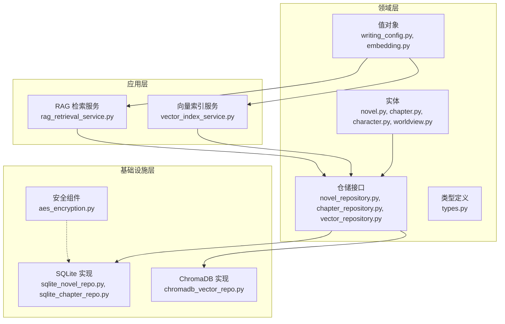
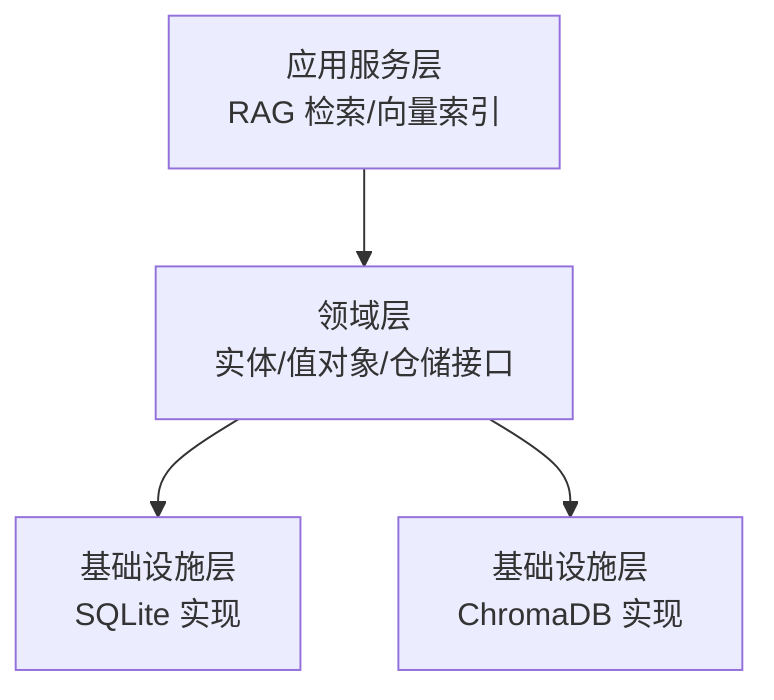
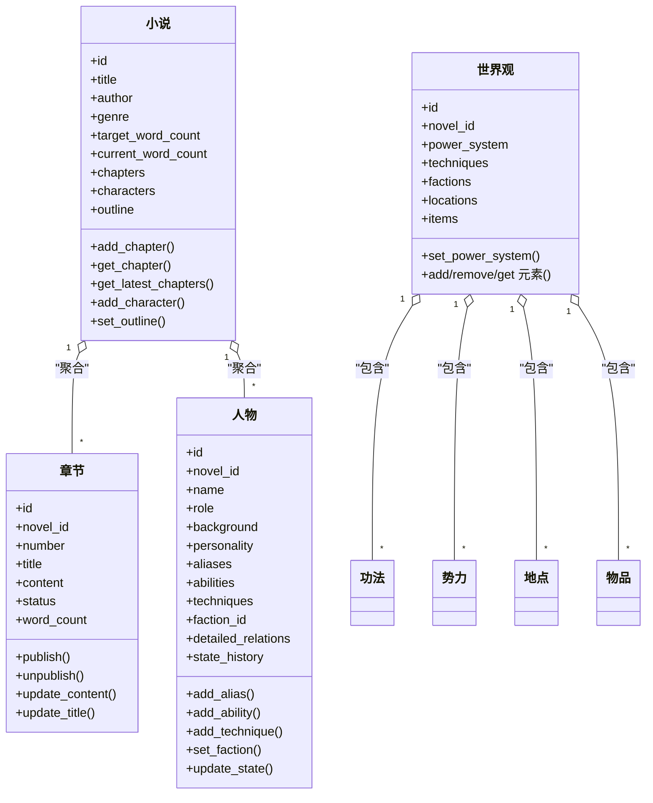
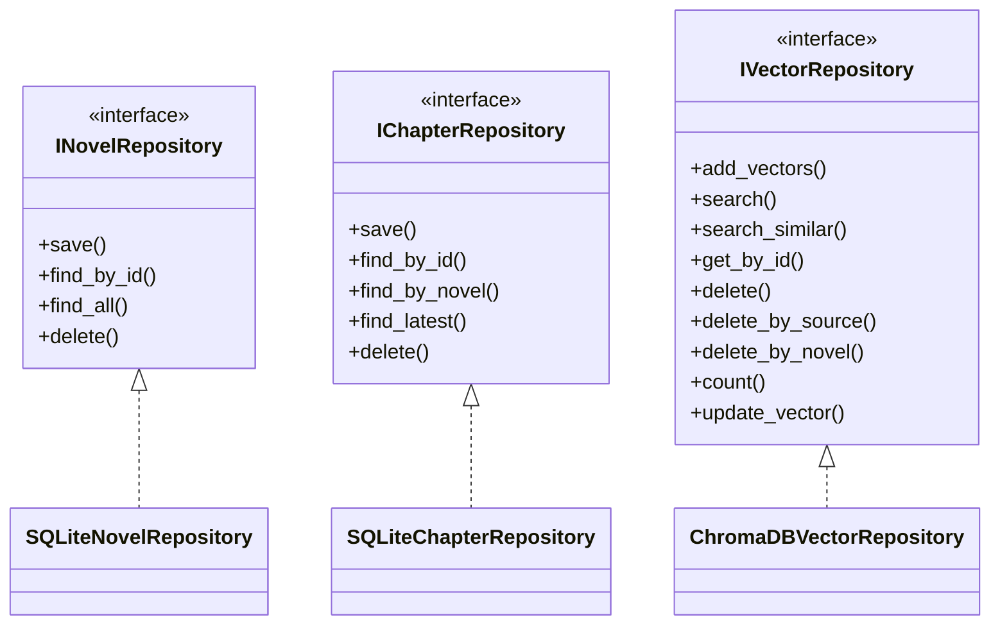
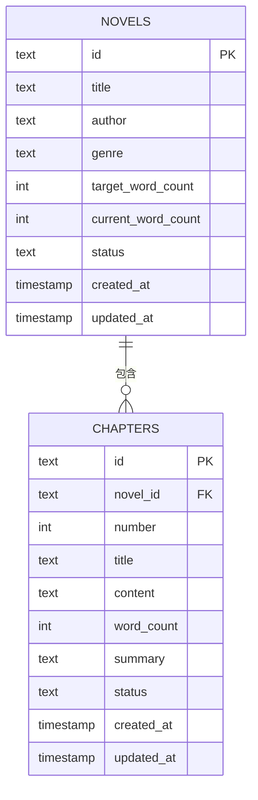
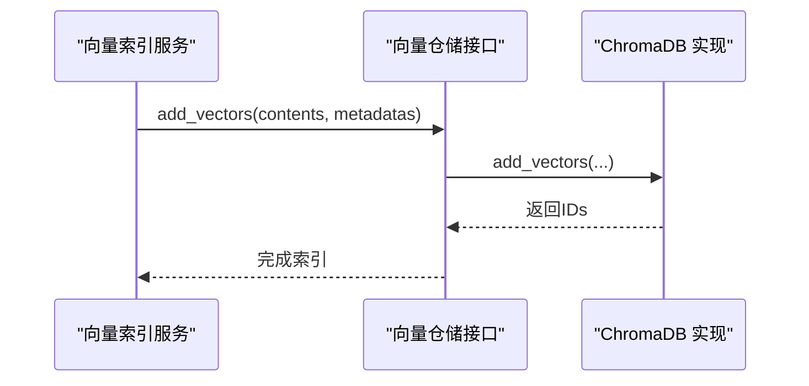
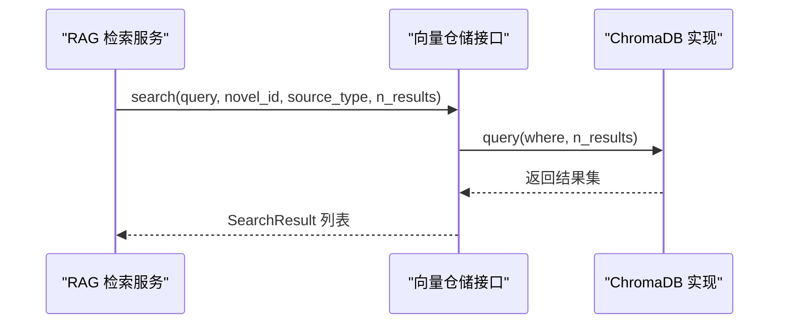
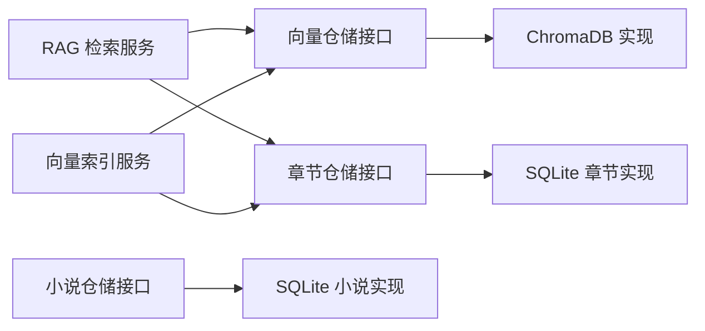

# 数据管理

<cite>
**本文引用的文件**
- [domain/entities/novel.py](file://domain/entities/novel.py)
- [domain/entities/chapter.py](file://domain/entities/chapter.py)
- [domain/entities/character.py](file://domain/entities/character.py)
- [domain/entities/worldview.py](file://domain/entities/worldview.py)
- [domain/value_objects/writing_config.py](file://domain/value_objects/writing_config.py)
- [domain/value_objects/embedding.py](file://domain/value_objects/embedding.py)
- [domain/repositories/novel_repository.py](file://domain/repositories/novel_repository.py)
- [domain/repositories/chapter_repository.py](file://domain/repositories/chapter_repository.py)
- [domain/repositories/vector_repository.py](file://domain/repositories/vector_repository.py)
- [domain/tokens.py](file://domain/tokens.py)
- [infrastructure/persistence/sqlite_novel_repo.py](file://infrastructure/persistence/sqlite_novel_repo.py)
- [infrastructure/persistence/sqlite_chapter_repo.py](file://infrastructure/persistence/sqlite_chapter_repo.py)
- [infrastructure/persistence/chromadb_vector_repo.py](file://infrastructure/persistence/chromadb_vector_repo.py)
- [application/services/rag_retrieval_service.py](file://application/services/rag_retrieval_service.py)
- [application/services/vector_index_service.py](file://application/services/vector_index_service.py)
- [infrastructure/security/aes_encryption.py](file://infrastructure/security/aes_encryption.py)
</cite>

## 目录
1. [简介](#简介)
2. [项目结构](#项目结构)
3. [核心组件](#核心组件)
4. [架构总览](#架构总览)
5. [详细组件分析](#详细组件分析)
6. [依赖关系分析](#依赖关系分析)
7. [性能考量](#性能考量)
8. [故障排查指南](#故障排查指南)
9. [结论](#结论)
10. [附录](#附录)

## 简介
本文件系统性梳理 InkTrace 的数据管理设计与实现，覆盖领域模型（小说、章节、人物、世界观等聚合与值对象）、仓储接口与实现策略、SQLite 持久化映射、ChromaDB 向量检索、数据持久化与缓存策略、ER 关系图与类图、数据迁移与版本管理建议、以及数据安全与备份恢复方案。目标是帮助开发者与产品人员快速理解并高效维护数据层。

## 项目结构
数据管理相关代码主要分布在以下层次：
- 领域层：实体、值对象、仓储接口、类型定义
- 基础设施层：SQLite 仓储实现、ChromaDB 向量仓储实现、安全组件
- 应用层：RAG 检索与向量索引服务

图表来源
- [domain/entities/novel.py:21-178](file://domain/entities/novel.py#L21-L178)
- [domain/entities/chapter.py:18-109](file://domain/entities/chapter.py#L18-L109)
- [domain/entities/character.py:64-273](file://domain/entities/character.py#L64-L273)
- [domain/entities/worldview.py:44-154](file://domain/entities/worldview.py#L44-L154)
- [domain/value_objects/writing_config.py:13-28](file://domain/value_objects/writing_config.py#L13-L28)
- [domain/value_objects/embedding.py:14-79](file://domain/value_objects/embedding.py#L14-L79)
- [domain/repositories/novel_repository.py:17-70](file://domain/repositories/novel_repository.py#L17-L70)
- [domain/repositories/chapter_repository.py:17-89](file://domain/repositories/chapter_repository.py#L17-L89)
- [domain/repositories/vector_repository.py:17-95](file://domain/repositories/vector_repository.py#L17-L95)
- [infrastructure/persistence/sqlite_novel_repo.py:20-126](file://infrastructure/persistence/sqlite_novel_repo.py#L20-L126)
- [infrastructure/persistence/sqlite_chapter_repo.py:19-137](file://infrastructure/persistence/sqlite_chapter_repo.py#L19-L137)
- [infrastructure/persistence/chromadb_vector_repo.py:19-270](file://infrastructure/persistence/chromadb_vector_repo.py#L19-L270)
- [application/services/rag_retrieval_service.py:20-156](file://application/services/rag_retrieval_service.py#L20-L156)
- [application/services/vector_index_service.py:21-206](file://application/services/vector_index_service.py#L21-L206)
- [infrastructure/security/aes_encryption.py:19-106](file://infrastructure/security/aes_encryption.py#L19-L106)

章节来源
- [domain/entities/novel.py:10-178](file://domain/entities/novel.py#L10-L178)
- [domain/entities/chapter.py:10-109](file://domain/entities/chapter.py#L10-L109)
- [domain/entities/character.py:10-273](file://domain/entities/character.py#L10-L273)
- [domain/entities/worldview.py:10-154](file://domain/entities/worldview.py#L10-L154)
- [domain/value_objects/writing_config.py:10-28](file://domain/value_objects/writing_config.py#L10-L28)
- [domain/value_objects/embedding.py:10-79](file://domain/value_objects/embedding.py#L10-L79)
- [domain/repositories/novel_repository.py:10-70](file://domain/repositories/novel_repository.py#L10-L70)
- [domain/repositories/chapter_repository.py:10-89](file://domain/repositories/chapter_repository.py#L10-L89)
- [domain/repositories/vector_repository.py:10-95](file://domain/repositories/vector_repository.py#L10-L95)
- [infrastructure/persistence/sqlite_novel_repo.py:10-126](file://infrastructure/persistence/sqlite_novel_repo.py#L10-L126)
- [infrastructure/persistence/sqlite_chapter_repo.py:10-137](file://infrastructure/persistence/sqlite_chapter_repo.py#L10-L137)
- [infrastructure/persistence/chromadb_vector_repo.py:10-270](file://infrastructure/persistence/chromadb_vector_repo.py#L10-L270)
- [application/services/rag_retrieval_service.py:10-156](file://application/services/rag_retrieval_service.py#L10-L156)
- [application/services/vector_index_service.py:10-206](file://application/services/vector_index_service.py#L10-L206)
- [infrastructure/security/aes_encryption.py:10-106](file://infrastructure/security/aes_encryption.py#L10-L106)

## 核心组件
- 聚合根与实体
  - 小说（聚合根）：聚合章节、人物、大纲，负责字数统计与子对象管理
  - 章节（实体）：包含标题、内容、状态、字数统计、角色参与等
  - 人物（实体）：包含角色、背景、能力、关系、状态历史、门派、功法等
  - 世界观（聚合根）：包含功法、势力、地点、物品、时间线、货币体系等
- 值对象
  - 写作配置（WritingConfig）：续写参数（目标字数、风格强度、温度、上下文章节数、一致性检查、风格模仿）
  - 嵌入向量（Embedding）：嵌入元数据（来源类型、来源ID、小说ID、分片索引、内容预览）、搜索结果、向量存储配置
- 仓储接口与实现
  - 小说/章节仓储接口定义标准 CRUD 与查询方法
  - SQLite 实现：基于 sqlite3 的 ORM 映射（插入/替换、查询、删除）
  - ChromaDB 实现：基于 PersistentClient 的向量增删改查、过滤查询、统计与更新
- 应用服务
  - RAG 检索服务：按来源类型检索章节/人物/世界观，构建续写提示词
  - 向量索引服务：对章节内容分块、对人物/世界观内容拼装后入库；支持删除索引与统计

章节来源
- [domain/entities/novel.py:21-178](file://domain/entities/novel.py#L21-L178)
- [domain/entities/chapter.py:18-109](file://domain/entities/chapter.py#L18-L109)
- [domain/entities/character.py:64-273](file://domain/entities/character.py#L64-L273)
- [domain/entities/worldview.py:44-154](file://domain/entities/worldview.py#L44-L154)
- [domain/value_objects/writing_config.py:13-28](file://domain/value_objects/writing_config.py#L13-L28)
- [domain/value_objects/embedding.py:14-79](file://domain/value_objects/embedding.py#L14-L79)
- [domain/repositories/novel_repository.py:17-70](file://domain/repositories/novel_repository.py#L17-L70)
- [domain/repositories/chapter_repository.py:17-89](file://domain/repositories/chapter_repository.py#L17-L89)
- [domain/repositories/vector_repository.py:17-95](file://domain/repositories/vector_repository.py#L17-L95)
- [infrastructure/persistence/sqlite_novel_repo.py:20-126](file://infrastructure/persistence/sqlite_novel_repo.py#L20-L126)
- [infrastructure/persistence/sqlite_chapter_repo.py:19-137](file://infrastructure/persistence/sqlite_chapter_repo.py#L19-L137)
- [infrastructure/persistence/chromadb_vector_repo.py:19-270](file://infrastructure/persistence/chromadb_vector_repo.py#L19-L270)
- [application/services/rag_retrieval_service.py:20-156](file://application/services/rag_retrieval_service.py#L20-L156)
- [application/services/vector_index_service.py:21-206](file://application/services/vector_index_service.py#L21-L206)

## 架构总览
数据层采用“领域驱动设计”分层：
- 领域层：以实体与值对象表达业务概念，仓储接口隔离外部存储细节
- 基础设施层：提供具体实现（SQLite、ChromaDB），封装持久化细节
- 应用层：组合仓储与值对象，完成 RAG 检索与向量索引等业务流程

图表来源
- [application/services/rag_retrieval_service.py:20-156](file://application/services/rag_retrieval_service.py#L20-L156)
- [application/services/vector_index_service.py:21-206](file://application/services/vector_index_service.py#L21-L206)
- [infrastructure/persistence/sqlite_novel_repo.py:20-126](file://infrastructure/persistence/sqlite_novel_repo.py#L20-L126)
- [infrastructure/persistence/sqlite_chapter_repo.py:19-137](file://infrastructure/persistence/sqlite_chapter_repo.py#L19-L137)
- [infrastructure/persistence/chromadb_vector_repo.py:19-270](file://infrastructure/persistence/chromadb_vector_repo.py#L19-L270)

## 详细组件分析

### 领域模型与值对象
- 小说（聚合根）
  - 负责章节与人物的聚合管理、字数统计、最新章节获取
  - 提供添加/获取章节与人物、设置大纲、计算总字数等方法
- 章节（实体）
  - 包含编号、标题、内容、状态、摘要、参与角色等
  - 支持发布/取消发布、字数计算、内容/标题更新
- 人物（实体）
  - 包含角色、背景、个性、别名、能力、关系、状态历史、首次出场、门派、功法等
  - 支持别名/能力增删、关系增删改、状态变更、门派设置、功法增删
- 世界观（聚合根）
  - 包含功法、势力、地点、物品、时间线、货币体系等
  - 支持增删改查各类元素，并可设置力量体系
- 值对象
  - 写作配置：控制续写行为的关键参数
  - 嵌入向量：统一承载元数据、搜索结果与向量存储配置

图表来源
- [domain/entities/novel.py:21-178](file://domain/entities/novel.py#L21-L178)
- [domain/entities/chapter.py:18-109](file://domain/entities/chapter.py#L18-L109)
- [domain/entities/character.py:64-273](file://domain/entities/character.py#L64-L273)
- [domain/entities/worldview.py:44-154](file://domain/entities/worldview.py#L44-L154)

章节来源
- [domain/entities/novel.py:21-178](file://domain/entities/novel.py#L21-L178)
- [domain/entities/chapter.py:18-109](file://domain/entities/chapter.py#L18-L109)
- [domain/entities/character.py:64-273](file://domain/entities/character.py#L64-L273)
- [domain/entities/worldview.py:44-154](file://domain/entities/worldview.py#L44-L154)

### 仓储接口与实现策略
- 接口职责
  - 小说/章节仓储：保存、按ID查找、按小说查找、最新章节、删除
  - 向量仓储：批量添加、语义搜索、相似内容搜索、按ID/来源/小说删除、统计、更新
- 实现策略
  - SQLite 实现：使用 INSERT OR REPLACE 进行幂等保存；Row 工厂读取；外键约束关联小说与章节
  - ChromaDB 实现：延迟初始化客户端/集合/嵌入函数；支持 where 条件过滤；统一元数据字典化；解析距离为相似度分数

图表来源
- [domain/repositories/novel_repository.py:17-70](file://domain/repositories/novel_repository.py#L17-L70)
- [domain/repositories/chapter_repository.py:17-89](file://domain/repositories/chapter_repository.py#L17-L89)
- [domain/repositories/vector_repository.py:17-95](file://domain/repositories/vector_repository.py#L17-L95)
- [infrastructure/persistence/sqlite_novel_repo.py:20-126](file://infrastructure/persistence/sqlite_novel_repo.py#L20-L126)
- [infrastructure/persistence/sqlite_chapter_repo.py:19-137](file://infrastructure/persistence/sqlite_chapter_repo.py#L19-L137)
- [infrastructure/persistence/chromadb_vector_repo.py:19-270](file://infrastructure/persistence/chromadb_vector_repo.py#L19-L270)

章节来源
- [domain/repositories/novel_repository.py:17-70](file://domain/repositories/novel_repository.py#L17-L70)
- [domain/repositories/chapter_repository.py:17-89](file://domain/repositories/chapter_repository.py#L17-L89)
- [domain/repositories/vector_repository.py:17-95](file://domain/repositories/vector_repository.py#L17-L95)
- [infrastructure/persistence/sqlite_novel_repo.py:20-126](file://infrastructure/persistence/sqlite_novel_repo.py#L20-L126)
- [infrastructure/persistence/sqlite_chapter_repo.py:19-137](file://infrastructure/persistence/sqlite_chapter_repo.py#L19-L137)
- [infrastructure/persistence/chromadb_vector_repo.py:19-270](file://infrastructure/persistence/chromadb_vector_repo.py#L19-L270)

### SQLite 数据库映射与关系
- 表结构要点
  - novels：主键 id，字段包含标题、作者、题材、目标字数、当前字数、状态、时间戳
  - chapters：主键 id，外键 novel_id 引用 novels.id，字段包含编号、标题、内容、摘要、状态、时间戳
- 映射关系
  - 章节通过 novel_id 与小说建立一对多关系
  - 查询按编号排序，最新章节按编号倒序限制返回

图表来源
- [infrastructure/persistence/sqlite_novel_repo.py:40-52](file://infrastructure/persistence/sqlite_novel_repo.py#L40-L52)
- [infrastructure/persistence/sqlite_chapter_repo.py:38-53](file://infrastructure/persistence/sqlite_chapter_repo.py#L38-L53)

章节来源
- [infrastructure/persistence/sqlite_novel_repo.py:35-72](file://infrastructure/persistence/sqlite_novel_repo.py#L35-L72)
- [infrastructure/persistence/sqlite_chapter_repo.py:34-75](file://infrastructure/persistence/sqlite_chapter_repo.py#L34-L75)

### 向量数据库（ChromaDB）与 RAG 检索
- 向量索引流程
  - 章节：按配置分块（大小与重叠），为每块生成唯一 ID 并携带元数据（来源类型=chapter、来源ID=章节ID、小说ID、分片索引、内容预览）
  - 人物/世界观：拼装人物与世界元素描述，作为单条向量入库
- 检索流程
  - 支持按小说ID与来源类型过滤；相似度由距离换算
  - 续写提示词构建：按来源类型分别取若干结果，拼接成上下文提示

图表来源
- [application/services/vector_index_service.py:38-79](file://application/services/vector_index_service.py#L38-L79)
- [infrastructure/persistence/chromadb_vector_repo.py:74-95](file://infrastructure/persistence/chromadb_vector_repo.py#L74-L95)

图表来源
- [application/services/rag_retrieval_service.py:33-90](file://application/services/rag_retrieval_service.py#L33-L90)
- [infrastructure/persistence/chromadb_vector_repo.py:97-130](file://infrastructure/persistence/chromadb_vector_repo.py#L97-L130)

### 数据持久化策略与缓存机制
- SQLite
  - 使用 INSERT OR REPLACE 实现幂等保存；按需使用 row_factory 读取
  - 外键约束保证章节与小说的引用完整性
- 向量存储
  - ChromaDB 本地持久化目录，延迟初始化客户端/集合/嵌入函数
  - 通过元数据 where 条件实现按来源与小说维度的过滤与清理
- 缓存
  - 当前实现未见显式应用层缓存；可在应用层对热点查询（如最新章节、索引统计）做短期缓存以降低重复查询成本

章节来源
- [infrastructure/persistence/sqlite_novel_repo.py:54-72](file://infrastructure/persistence/sqlite_novel_repo.py#L54-L72)
- [infrastructure/persistence/sqlite_chapter_repo.py:55-75](file://infrastructure/persistence/sqlite_chapter_repo.py#L55-L75)
- [infrastructure/persistence/chromadb_vector_repo.py:35-72](file://infrastructure/persistence/chromadb_vector_repo.py#L35-L72)
- [application/services/vector_index_service.py:193-205](file://application/services/vector_index_service.py#L193-L205)

### 数据迁移与版本管理
- 建议策略
  - SQLite：采用迁移脚本或轻量迁移工具，记录版本号与迁移方向；对新增列使用默认值与可空策略，避免破坏现有数据
  - ChromaDB：集合名称与元数据结构变更需配套升级逻辑；提供数据导出/导入流程（如 JSON/CSV）以便回滚
  - 版本号：在应用启动时检查并执行必要的迁移步骤
- 注意事项
  - 章节外键依赖小说存在性，迁移时需先迁移主表
  - 向量元数据字段扩展需兼容旧数据解析

（本小节为通用实践建议，不直接分析具体文件）

### 数据安全与备份恢复
- 加密与密钥
  - AES-GCM 对称加密组件：支持从口令派生密钥、随机 IV、认证标签保护、Base64 编码输出
  - 建议用于敏感配置（如 LLM API Key）的存储与传输
- 备份与恢复
  - SQLite：定期复制数据库文件；生产环境建议 WAL 模式与归档策略
  - ChromaDB：备份持久化目录；恢复时确保集合元数据与嵌入函数一致
- 最佳实践
  - 严格最小权限访问数据库与向量目录
  - 对备份数据进行加密存储
  - 定期验证备份可用性与解密正确性

章节来源
- [infrastructure/security/aes_encryption.py:19-106](file://infrastructure/security/aes_encryption.py#L19-L106)

## 依赖关系分析
- 组件耦合
  - 应用服务依赖仓储接口，避免直接依赖具体实现
  - 向量仓储接口被 SQLite 与 ChromaDB 实现共同满足
- 外部依赖
  - SQLite：标准库 sqlite3
  - ChromaDB：PersistentClient、SentenceTransformerEmbeddingFunction
  - 加密：cryptography.hazmat.primitives

图表来源
- [application/services/rag_retrieval_service.py:20-31](file://application/services/rag_retrieval_service.py#L20-L31)
- [application/services/vector_index_service.py:21-36](file://application/services/vector_index_service.py#L21-L36)
- [infrastructure/persistence/chromadb_vector_repo.py:19-33](file://infrastructure/persistence/chromadb_vector_repo.py#L19-L33)
- [infrastructure/persistence/sqlite_chapter_repo.py:19-32](file://infrastructure/persistence/sqlite_chapter_repo.py#L19-L32)
- [infrastructure/persistence/sqlite_novel_repo.py:20-33](file://infrastructure/persistence/sqlite_novel_repo.py#L20-L33)

章节来源
- [application/services/rag_retrieval_service.py:20-31](file://application/services/rag_retrieval_service.py#L20-L31)
- [application/services/vector_index_service.py:21-36](file://application/services/vector_index_service.py#L21-L36)
- [infrastructure/persistence/chromadb_vector_repo.py:19-33](file://infrastructure/persistence/chromadb_vector_repo.py#L19-L33)
- [infrastructure/persistence/sqlite_chapter_repo.py:19-32](file://infrastructure/persistence/sqlite_chapter_repo.py#L19-L32)
- [infrastructure/persistence/sqlite_novel_repo.py:20-33](file://infrastructure/persistence/sqlite_novel_repo.py#L20-L33)

## 性能考量
- 向量检索
  - 使用集合元数据 where 条件过滤可显著减少候选集；合理设置 n_results 控制返回数量
  - 相似度由距离换算，建议结合阈值过滤低质量结果
- 章节分块
  - chunk_size 与 chunk_overlap 影响召回与上下文连贯性；需权衡检索性能与精度
- SQLite
  - 外键查询按编号排序，建议在高频查询列上保持索引（如 novel_id、number）
  - 批量写入使用事务（当前实现为单条 INSERT OR REPLACE，可考虑批量事务优化）

（本小节提供通用指导，不直接分析具体文件）

## 故障排查指南
- ChromaDB 初始化失败
  - 检查持久化目录权限与磁盘空间；确认 SentenceTransformer 模型可用
- 查询无结果
  - 确认索引是否已建立；核对 novel_id 与 source_type 是否匹配
- SQLite 保存异常
  - 检查主键冲突与外键约束；确认时间戳格式
- 加密解密错误
  - 核对密钥长度与派生过程；确认 Base64 编码/解码链路

章节来源
- [infrastructure/persistence/chromadb_vector_repo.py:35-72](file://infrastructure/persistence/chromadb_vector_repo.py#L35-L72)
- [application/services/vector_index_service.py:38-53](file://application/services/vector_index_service.py#L38-L53)
- [infrastructure/persistence/sqlite_novel_repo.py:54-72](file://infrastructure/persistence/sqlite_novel_repo.py#L54-L72)
- [infrastructure/security/aes_encryption.py:61-84](file://infrastructure/security/aes_encryption.py#L61-L84)

## 结论
InkTrace 的数据管理以 DDD 为核心，通过清晰的实体与值对象表达业务语义，借助仓储接口隔离存储细节，实现了 SQLite 与 ChromaDB 的双栈持久化。应用层的服务将检索与索引流程化，配合合理的分块与过滤策略，支撑 RAG 场景下的高效检索。建议后续在应用层引入缓存、完善迁移与版本管理，并强化数据安全与备份策略。

## 附录
- 类型与枚举
  - ID 值对象：NovelId、ChapterId、CharacterId、OutlineId、TechniqueId、FactionId、LocationId、ItemId、WorldviewId、ProjectId、TemplateId
  - 枚举：ChapterStatus、PlotType、PlotStatus、CharacterRole、ProjectStatus、GenreType、RelationType、ItemType
- 值对象
  - 写作配置：目标字数、风格强度、温度、上下文章节数、一致性检查开关、风格模仿开关
  - 嵌入向量：元数据、搜索结果、向量存储配置

章节来源
- [domain/tokens.py:1-284](file://domain/tokens.py#L1-L284)
- [domain/value_objects/writing_config.py:13-28](file://domain/value_objects/writing_config.py#L13-L28)
- [domain/value_objects/embedding.py:14-79](file://domain/value_objects/embedding.py#L14-L79)