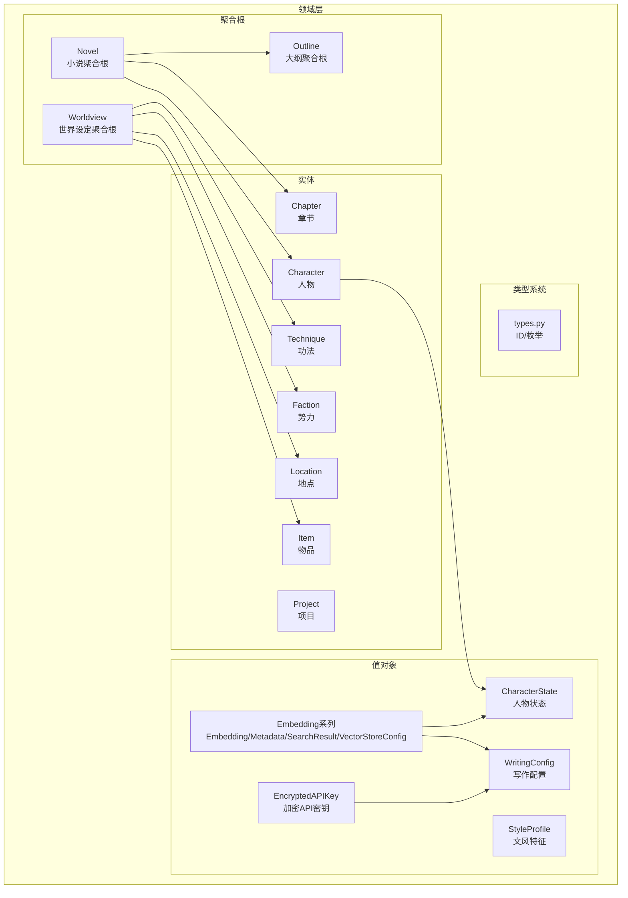
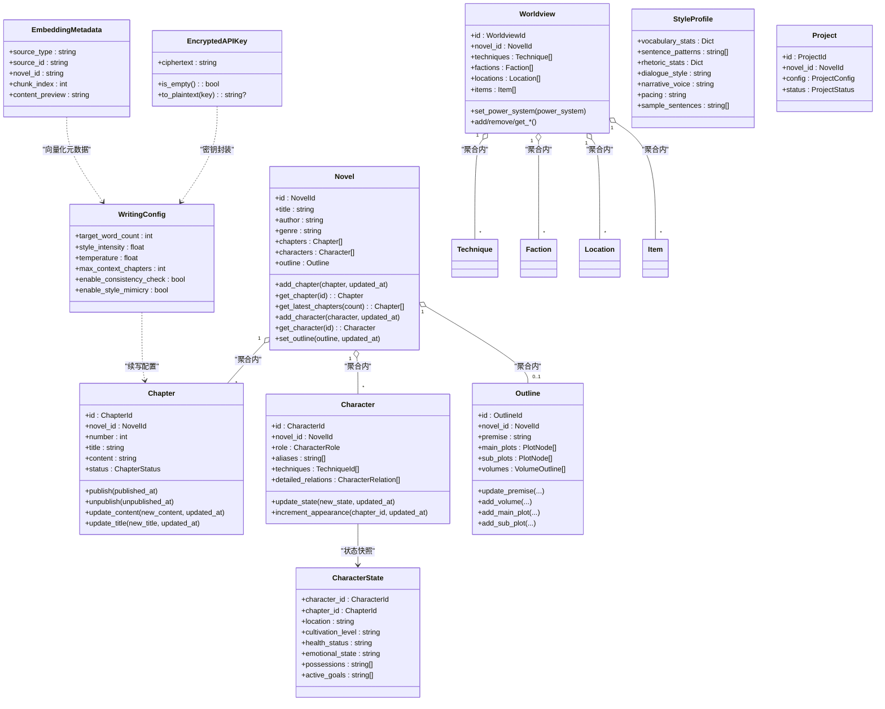
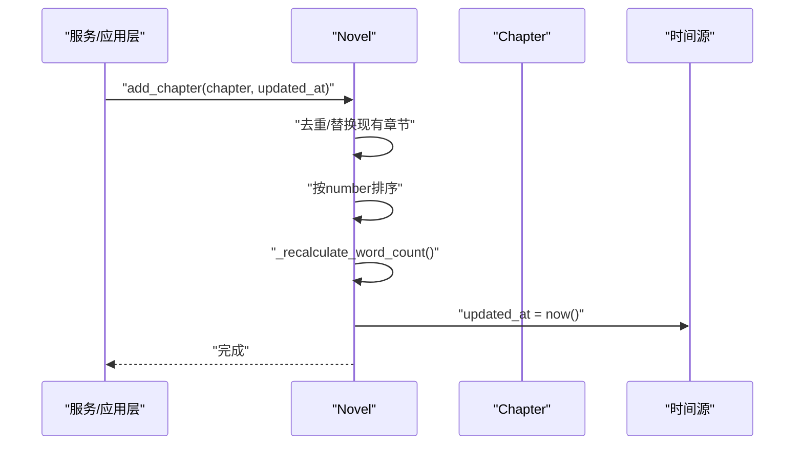
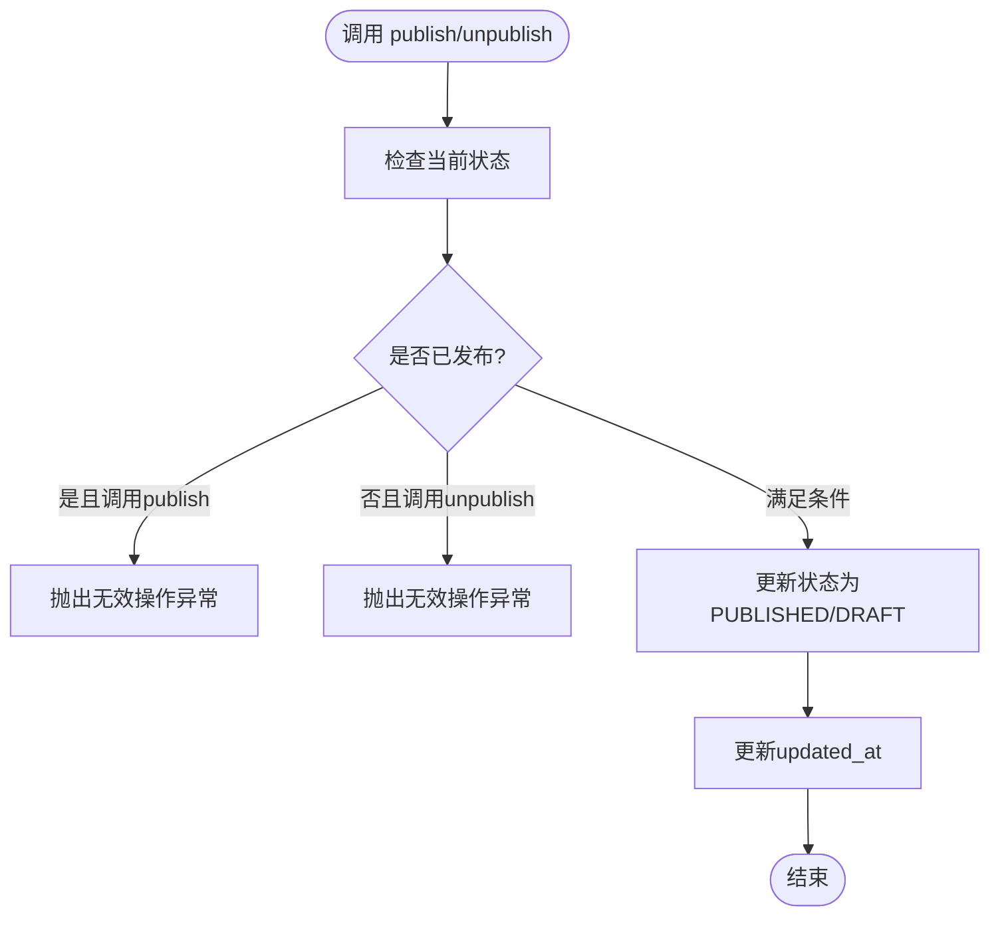
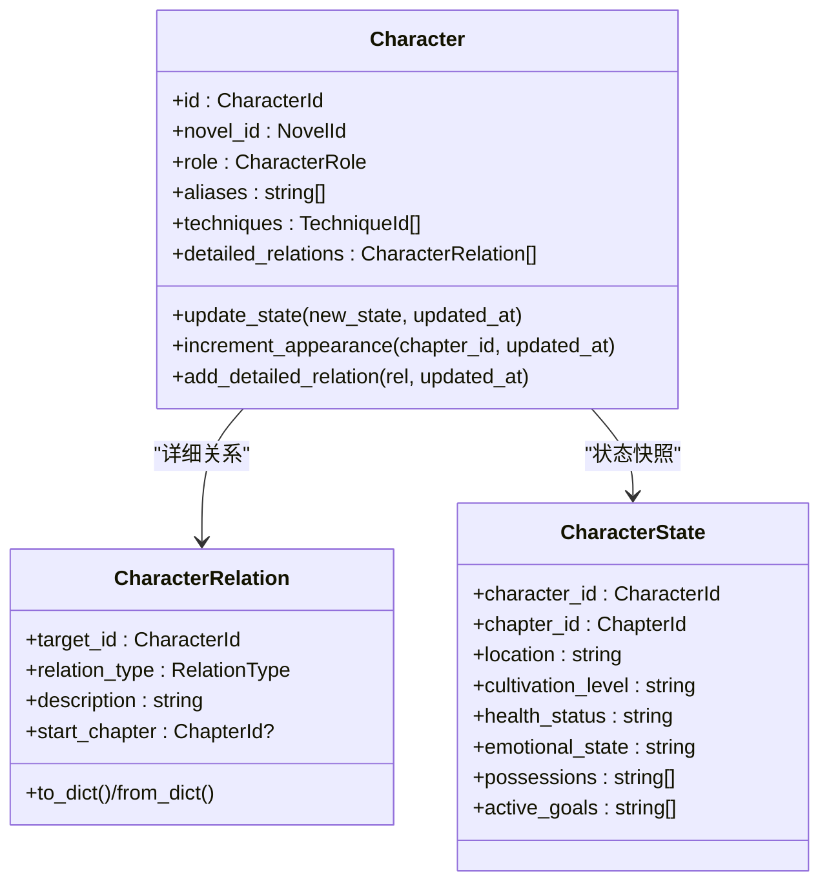
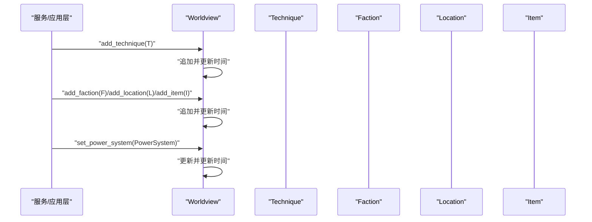
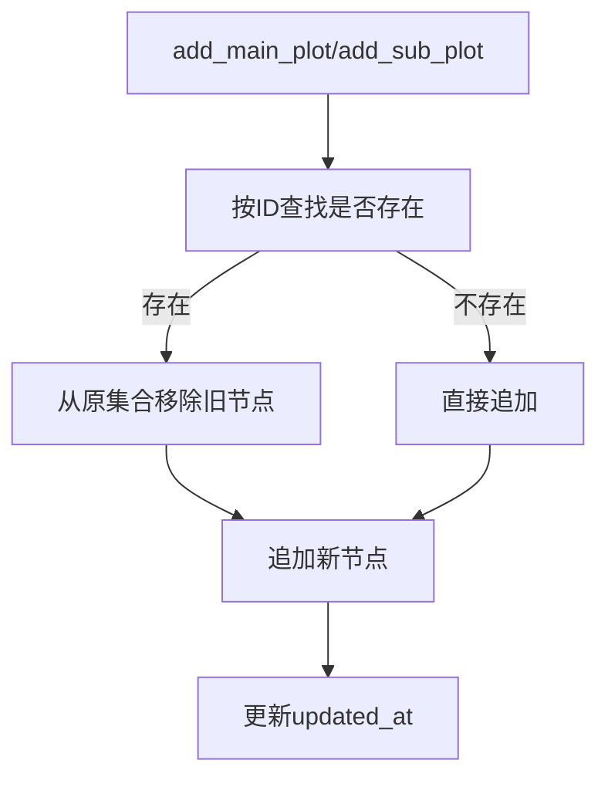
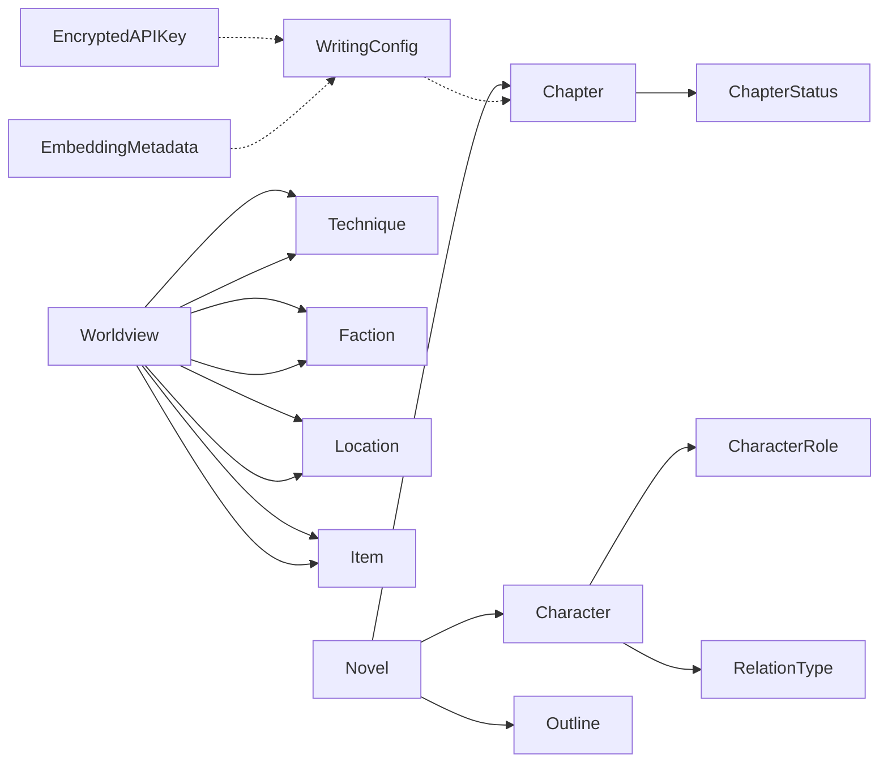

# 领域模型设计

<cite>
**本文引用的文件**
- [domain/entities/novel.py](file://domain/entities/novel.py)
- [domain/entities/chapter.py](file://domain/entities/chapter.py)
- [domain/entities/character.py](file://domain/entities/character.py)
- [domain/entities/worldview.py](file://domain/entities/worldview.py)
- [domain/entities/outline.py](file://domain/entities/outline.py)
- [domain/entities/faction.py](file://domain/entities/faction.py)
- [domain/entities/location.py](file://domain/entities/location.py)
- [domain/entities/item.py](file://domain/entities/item.py)
- [domain/entities/technique.py](file://domain/entities/technique.py)
- [domain/entities/project.py](file://domain/entities/project.py)
- [domain/value_objects/writing_config.py](file://domain/value_objects/writing_config.py)
- [domain/value_objects/embedding.py](file://domain/value_objects/embedding.py)
- [domain/value_objects/encrypted_api_key.py](file://domain/value_objects/encrypted_api_key.py)
- [domain/value_objects/character_state.py](file://domain/value_objects/character_state.py)
- [domain/value_objects/style_profile.py](file://domain/value_objects/style_profile.py)
- [domain/types.py](file://domain/types.py)
</cite>

## 目录
1. [引言](#引言)
2. [项目结构](#项目结构)
3. [核心组件](#核心组件)
4. [架构概览](#架构概览)
5. [详细组件分析](#详细组件分析)
6. [依赖分析](#依赖分析)
7. [性能考虑](#性能考虑)
8. [故障排查指南](#故障排查指南)
9. [结论](#结论)
10. [附录](#附录)

## 引言
本文件面向InkTrace项目的领域建模，聚焦于核心聚合根与值对象的设计理念与实现细节。重点覆盖以下方面：
- 聚合根：小说（Novel）、世界（Worldview）、大纲（Outline）
- 聚合内实体：章节（Chapter）、人物（Character）、势力（Faction）、地点（Location）、物品（Item）、功法（Technique）、项目（Project）
- 值对象：写作配置（WritingConfig）、嵌入向量（Embedding系列）、加密API密钥（EncryptedAPIKey）、人物状态（CharacterState）、文风特征（StyleProfile）
- 类型系统：各类ID的强类型约束与枚举
- 实体关系图与UML类图：聚合边界、依赖关系与协作方式
- 领域事件与业务规则：通过方法语义与异常表达

## 项目结构
领域层采用“按实体/值对象/类型/服务”分层组织，核心文件分布如下：
- 聚合根与实体：domain/entities/*
- 值对象：domain/value_objects/*
- 类型系统：domain/types.py
- 领域服务：domain/services/*（用于跨聚合的业务逻辑）

图表来源
- [domain/entities/novel.py:21-40](file://domain/entities/novel.py#L21-L40)
- [domain/entities/worldview.py:45-60](file://domain/entities/worldview.py#L45-L60)
- [domain/entities/outline.py:66-83](file://domain/entities/outline.py#L66-L83)
- [domain/entities/chapter.py:19-36](file://domain/entities/chapter.py#L19-L36)
- [domain/entities/character.py:65-98](file://domain/entities/character.py#L65-L98)
- [domain/entities/faction.py:41-56](file://domain/entities/faction.py#L41-L56)
- [domain/entities/location.py:19-30](file://domain/entities/location.py#L19-L30)
- [domain/entities/item.py:19-31](file://domain/entities/item.py#L19-L31)
- [domain/entities/technique.py:44-58](file://domain/entities/technique.py#L44-L58)
- [domain/entities/project.py:50-60](file://domain/entities/project.py#L50-L60)
- [domain/value_objects/writing_config.py:14-27](file://domain/value_objects/writing_config.py#L14-L27)
- [domain/value_objects/embedding.py:14-79](file://domain/value_objects/embedding.py#L14-L79)
- [domain/value_objects/encrypted_api_key.py:14-68](file://domain/value_objects/encrypted_api_key.py#L14-L68)
- [domain/value_objects/character_state.py:17-32](file://domain/value_objects/character_state.py#L17-L32)
- [domain/value_objects/style_profile.py:15-29](file://domain/value_objects/style_profile.py#L15-L29)
- [domain/types.py:15-284](file://domain/types.py#L15-L284)

章节来源
- [domain/entities/novel.py:21-178](file://domain/entities/novel.py#L21-L178)
- [domain/entities/worldview.py:45-154](file://domain/entities/worldview.py#L45-L154)
- [domain/entities/outline.py:66-257](file://domain/entities/outline.py#L66-L257)
- [domain/entities/chapter.py:19-109](file://domain/entities/chapter.py#L19-L109)
- [domain/entities/character.py:65-273](file://domain/entities/character.py#L65-L273)
- [domain/entities/faction.py:41-113](file://domain/entities/faction.py#L41-L113)
- [domain/entities/location.py:19-82](file://domain/entities/location.py#L19-L82)
- [domain/entities/item.py:19-79](file://domain/entities/item.py#L19-L79)
- [domain/entities/technique.py:44-106](file://domain/entities/technique.py#L44-L106)
- [domain/entities/project.py:50-112](file://domain/entities/project.py#L50-L112)
- [domain/value_objects/writing_config.py:14-28](file://domain/value_objects/writing_config.py#L14-L28)
- [domain/value_objects/embedding.py:14-79](file://domain/value_objects/embedding.py#L14-L79)
- [domain/value_objects/encrypted_api_key.py:14-68](file://domain/value_objects/encrypted_api_key.py#L14-L68)
- [domain/value_objects/character_state.py:17-33](file://domain/value_objects/character_state.py#L17-L33)
- [domain/value_objects/style_profile.py:15-30](file://domain/value_objects/style_profile.py#L15-L30)
- [domain/types.py:15-284](file://domain/types.py#L15-L284)

## 核心组件
- 小说（Novel）：聚合根，聚合章节、人物、大纲；负责章节排序、字数统计、最新章节检索、主角查找、大纲设置等。
- 章节（Chapter）：实体，包含编号、标题、内容、状态、关联人物等；支持发布/取消发布、内容/标题更新、字数计算。
- 人物（Character）：实体，包含角色、别名、能力、关系、状态历史、出场信息、功法、势力等；支持状态变更、关系维护、技巧增删、势力设置。
- 世界（Worldview）：聚合根，包含功法、势力、地点、物品、力量体系、货币与时间线等；支持增删查改子项并维护更新时间。
- 大纲（Outline）：聚合根，包含前提、背景、设定、主线/支线剧情节点、分卷大纲；支持更新设定、添加/更新剧情、按卷检索。
- 其他实体：势力（Faction）、地点（Location）、物品（Item）、功法（Technique）、项目（Project）。

章节来源
- [domain/entities/novel.py:21-178](file://domain/entities/novel.py#L21-L178)
- [domain/entities/chapter.py:19-109](file://domain/entities/chapter.py#L19-L109)
- [domain/entities/character.py:65-273](file://domain/entities/character.py#L65-L273)
- [domain/entities/worldview.py:45-154](file://domain/entities/worldview.py#L45-L154)
- [domain/entities/outline.py:66-257](file://domain/entities/outline.py#L66-L257)
- [domain/entities/faction.py:41-113](file://domain/entities/faction.py#L41-L113)
- [domain/entities/location.py:19-82](file://domain/entities/location.py#L19-L82)
- [domain/entities/item.py:19-79](file://domain/entities/item.py#L19-L79)
- [domain/entities/technique.py:44-106](file://domain/entities/technique.py#L44-L106)
- [domain/entities/project.py:50-112](file://domain/entities/project.py#L50-L112)

## 架构概览
领域模型遵循DDD聚合与值对象分离原则：
- 聚合根负责一致性边界与业务规则；实体在聚合内协作；值对象用于承载不变或可变属性。
- 类型系统通过强类型ID与枚举确保编译期安全与运行期清晰语义。
- 值对象普遍冻结（frozen），强调不可变性与可共享性。

图表来源
- [domain/entities/novel.py:21-178](file://domain/entities/novel.py#L21-L178)
- [domain/entities/chapter.py:19-109](file://domain/entities/chapter.py#L19-L109)
- [domain/entities/character.py:65-273](file://domain/entities/character.py#L65-L273)
- [domain/entities/worldview.py:45-154](file://domain/entities/worldview.py#L45-L154)
- [domain/entities/outline.py:66-257](file://domain/entities/outline.py#L66-L257)
- [domain/value_objects/writing_config.py:14-28](file://domain/value_objects/writing_config.py#L14-L28)
- [domain/value_objects/encrypted_api_key.py:14-68](file://domain/value_objects/encrypted_api_key.py#L14-L68)
- [domain/value_objects/embedding.py:14-79](file://domain/value_objects/embedding.py#L14-L79)
- [domain/value_objects/character_state.py:17-33](file://domain/value_objects/character_state.py#L17-L33)
- [domain/value_objects/style_profile.py:15-30](file://domain/value_objects/style_profile.py#L15-L30)
- [domain/entities/project.py:50-112](file://domain/entities/project.py#L50-L112)

## 详细组件分析

### 小说（Novel）聚合根
- 职责与边界
  - 维护章节集合的有序性与去重；提供按编号/ID检索；计算总字数；维护最新章节视图；设置/更新大纲；聚合内人物管理。
- 关键行为
  - 添加/替换章节并排序；按章节号取最新N章；添加人物并去重；查找主角；设置大纲并更新时间戳。
- 业务规则
  - 章节按number升序；字数由所有章节字数累加；更新操作需传入updated_at以保持时间线一致。

图表来源
- [domain/entities/novel.py:46-62](file://domain/entities/novel.py#L46-L62)
- [domain/entities/novel.py:173-178](file://domain/entities/novel.py#L173-L178)

章节来源
- [domain/entities/novel.py:21-178](file://domain/entities/novel.py#L21-L178)

### 章节（Chapter）实体
- 属性与生命周期
  - 编号、标题、内容、状态（草稿/发布）、摘要、涉及人物列表；支持发布/取消发布；内容/标题更新；字数计算；发布状态查询。
- 业务规则
  - 已发布章节禁止再次发布；未发布章节禁止取消发布；字数计算去除空白字符。
- 错误处理
  - 发布/取消发布时抛出无效操作异常。

图表来源
- [domain/entities/chapter.py:76-109](file://domain/entities/chapter.py#L76-L109)

章节来源
- [domain/entities/chapter.py:19-109](file://domain/entities/chapter.py#L19-L109)

### 人物（Character）实体与关系建模
- 状态管理
  - 当前状态与历史记录；出场次数与首次出场章节；状态变更追加到历史。
- 关系建模
  - 一期关系（兼容）与二期详细关系（含起始章节）；支持增删改查。
- 技能与势力
  - 技能集合去重；势力ID设置；年龄/性别/头衔等扩展字段。
- 不可变性
  - 关系值对象冻结，保证关系快照稳定。

图表来源
- [domain/entities/character.py:65-273](file://domain/entities/character.py#L65-L273)
- [domain/value_objects/character_state.py:17-33](file://domain/value_objects/character_state.py#L17-L33)

章节来源
- [domain/entities/character.py:65-273](file://domain/entities/character.py#L65-L273)
- [domain/value_objects/character_state.py:17-33](file://domain/value_objects/character_state.py#L17-L33)

### 世界（Worldview）聚合根与设定系统
- 设定组成
  - 功法、势力、地点、物品集合；力量体系（名称、等级、描述）；货币与时间线；创建/更新时间。
- 操作接口
  - 增删改查子项；设置/更新力量体系；序列化/反序列化。
- 业务规则
  - 子项按ID字符串匹配；更新时刷新updated_at。

图表来源
- [domain/entities/worldview.py:62-120](file://domain/entities/worldview.py#L62-L120)

章节来源
- [domain/entities/worldview.py:45-154](file://domain/entities/worldview.py#L45-L154)

### 大纲（Outline）聚合根
- 结构
  - 前提、背景、世界设定；主线/支线剧情节点；分卷大纲（卷号、目标字数、剧情节点）。
- 操作
  - 更新设定；添加/更新剧情节点；按卷检索；根据ID定位剧情节点。
- 业务规则
  - 同一ID的剧情节点在主/副线中互斥替换；分卷按卷号排序。

图表来源
- [domain/entities/outline.py:166-202](file://domain/entities/outline.py#L166-L202)

章节来源
- [domain/entities/outline.py:66-257](file://domain/entities/outline.py#L66-L257)

### 值对象设计模式
- 写作配置（WritingConfig）
  - 不可变（frozen），承载续写参数（目标字数、风格强度、温度、上下文章节数、一致性检查、风格模仿）。
- 嵌入向量（Embedding系列）
  - 元数据（EmbeddingMetadata）、搜索结果（SearchResult）、向量存储配置（VectorStoreConfig）均不可变，便于缓存与跨模块传递。
- 加密API密钥（EncryptedAPIKey）
  - 不可变，提供空值检测、明文/密文转换、安全比较；依赖加密服务进行加解密。
- 人物状态（CharacterState）
  - 不可变，记录角色在特定章节的状态快照（位置、境界、健康、情绪、物品、目标）。
- 文风特征（StyleProfile）
  - 不可变，承载词汇、句式、修辞、对白风格、叙述口吻、节奏与样例句子等。

章节来源
- [domain/value_objects/writing_config.py:14-28](file://domain/value_objects/writing_config.py#L14-L28)
- [domain/value_objects/embedding.py:14-79](file://domain/value_objects/embedding.py#L14-L79)
- [domain/value_objects/encrypted_api_key.py:14-68](file://domain/value_objects/encrypted_api_key.py#L14-L68)
- [domain/value_objects/character_state.py:17-33](file://domain/value_objects/character_state.py#L17-L33)
- [domain/value_objects/style_profile.py:15-30](file://domain/value_objects/style_profile.py#L15-L30)

### 类型系统与ID约束
- 强类型ID
  - NovelId、ChapterId、CharacterId、OutlineId、ProjectId、TemplateId、TechniqueId、FactionId、LocationId、ItemId、WorldviewId，均不可变，提供字符串化、哈希与相等比较。
- 枚举
  - 章节状态（ChapterStatus）、剧情类型（PlotType）、剧情状态（PlotStatus）、角色类型（CharacterRole）、项目状态（ProjectStatus）、题材类型（GenreType）、关系类型（RelationType）、物品类型（ItemType）。
- 使用场景
  - 所有实体/值对象的标识字段均使用对应ID类型，避免ID混淆；枚举用于状态机与策略分支。

章节来源
- [domain/types.py:15-284](file://domain/types.py#L15-L284)

### 领域事件与业务规则示例
- 发布流程（章节）
  - 发布前检查状态；若已发布则抛出异常；否则更新状态与时间戳。
- 字数统计（小说）
  - 章节变更后触发重算；基于章节内容长度累加。
- 人物状态演进
  - 状态变更时将旧状态写入历史；首次出场记录章节ID。
- 世界设定更新
  - 子项增删查改后统一刷新updated_at，保证版本一致性。

章节来源
- [domain/entities/chapter.py:76-109](file://domain/entities/chapter.py#L76-L109)
- [domain/entities/novel.py:173-178](file://domain/entities/novel.py#L173-L178)
- [domain/entities/character.py:143-161](file://domain/entities/character.py#L143-L161)
- [domain/entities/worldview.py:62-120](file://domain/entities/worldview.py#L62-L120)

## 依赖分析
- 聚合内依赖
  - Novel聚合内包含Chapter、Character、Outline；Worldview聚合内包含Technique、Faction、Location、Item。
- 跨聚合依赖
  - Chapter依赖ChapterStatus；Character依赖CharacterRole、RelationType；Worldview依赖Technique、Faction、Location、Item。
- 值对象依赖
  - WritingConfig被续写引擎使用；EncryptedAPIKey封装密钥；Embedding系列支撑RAG检索；CharacterState/StyleProfile用于分析与生成。

图表来源
- [domain/entities/novel.py:21-178](file://domain/entities/novel.py#L21-L178)
- [domain/entities/worldview.py:45-154](file://domain/entities/worldview.py#L45-L154)
- [domain/entities/chapter.py:19-109](file://domain/entities/chapter.py#L19-L109)
- [domain/entities/character.py:65-273](file://domain/entities/character.py#L65-L273)
- [domain/entities/outline.py:66-257](file://domain/entities/outline.py#L66-L257)
- [domain/value_objects/writing_config.py:14-28](file://domain/value_objects/writing_config.py#L14-L28)
- [domain/value_objects/encrypted_api_key.py:14-68](file://domain/value_objects/encrypted_api_key.py#L14-L68)
- [domain/value_objects/embedding.py:14-79](file://domain/value_objects/embedding.py#L14-L79)
- [domain/types.py:87-284](file://domain/types.py#L87-L284)

章节来源
- [domain/entities/novel.py:21-178](file://domain/entities/novel.py#L21-L178)
- [domain/entities/worldview.py:45-154](file://domain/entities/worldview.py#L45-L154)
- [domain/entities/chapter.py:19-109](file://domain/entities/chapter.py#L19-L109)
- [domain/entities/character.py:65-273](file://domain/entities/character.py#L65-L273)
- [domain/entities/outline.py:66-257](file://domain/entities/outline.py#L66-L257)
- [domain/value_objects/writing_config.py:14-28](file://domain/value_objects/writing_config.py#L14-L28)
- [domain/value_objects/encrypted_api_key.py:14-68](file://domain/value_objects/encrypted_api_key.py#L14-L68)
- [domain/value_objects/embedding.py:14-79](file://domain/value_objects/embedding.py#L14-L79)
- [domain/types.py:87-284](file://domain/types.py#L87-L284)

## 性能考虑
- 不可变值对象
  - 减少并发修改风险，利于缓存与跨线程共享；但频繁构造可能带来GC压力，建议在批量处理时复用或池化。
- 排序与查找
  - Novel对章节按number排序；Outline对分卷按number排序；建议在聚合内维护有序列表，避免每次读取时重复排序。
- 字数计算
  - 章节字数计算去除空白字符；在大量章节场景下，建议延迟计算或增量更新。
- ID比较
  - 所有ID类型提供哈希与相等比较，适合用作字典/集合键；注意避免混用不同ID类型。

## 故障排查指南
- 发布异常
  - 若章节已发布仍尝试发布，或未发布尝试取消发布，将触发无效操作异常。请先检查状态再执行发布/取消发布。
- 密钥解密失败
  - 解密API密钥时若抛出异常，通常为密钥格式错误或密钥不匹配。请确认密钥来源与加密密钥一致。
- 章节/人物重复
  - 添加章节/人物时会去重替换；若出现顺序错乱，请检查传入的ID与时间戳是否正确。
- 世界设定更新未生效
  - 子项增删查改后会刷新updated_at；若前端未更新，请检查序列化/反序列化流程。

章节来源
- [domain/entities/chapter.py:88-107](file://domain/entities/chapter.py#L88-L107)
- [domain/value_objects/encrypted_api_key.py:57-68](file://domain/value_objects/encrypted_api_key.py#L57-L68)
- [domain/entities/novel.py:56-62](file://domain/entities/novel.py#L56-L62)
- [domain/entities/worldview.py:62-120](file://domain/entities/worldview.py#L62-L120)

## 结论
InkTrace的领域模型以聚合根为核心，围绕小说、世界、大纲三大聚合构建了清晰的边界与协作关系。通过强类型ID与枚举确保类型安全，值对象强调不可变性与可复用性，实体承担状态与行为，辅以明确的业务规则与异常处理，形成高内聚、低耦合的领域设计。该模型为后续的RAG检索、续写引擎与一致性检查提供了坚实基础。

## 附录
- 术语
  - 聚合根：对一致性边界内的实体与值对象拥有唯一创建点与业务规则控制权的对象。
  - 值对象：仅有属性与行为、无标识的对象，强调不可变性与相等性判断。
  - 强类型ID：以不可变值对象封装的标识符，避免ID混淆与运行时错误。
- 最佳实践
  - 在聚合内维护有序集合，减少外部排序成本。
  - 对外暴露只读视图，内部通过受控方法修改状态。
  - 使用值对象承载不变属性，提升可测试性与可维护性。