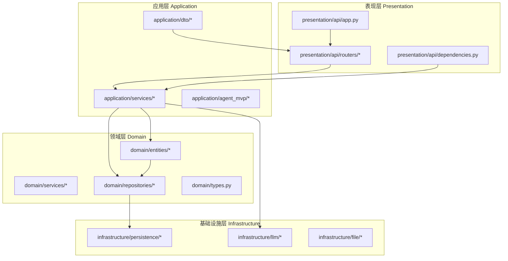
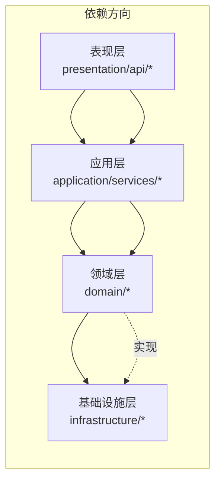
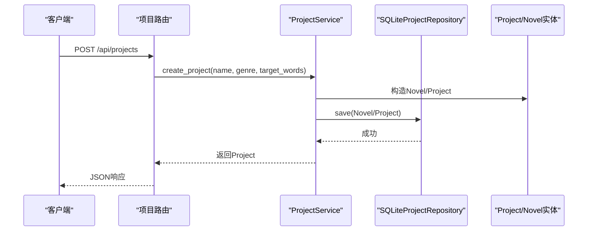
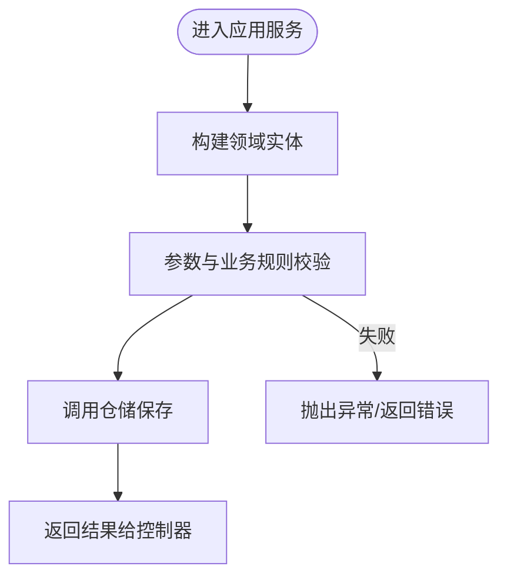
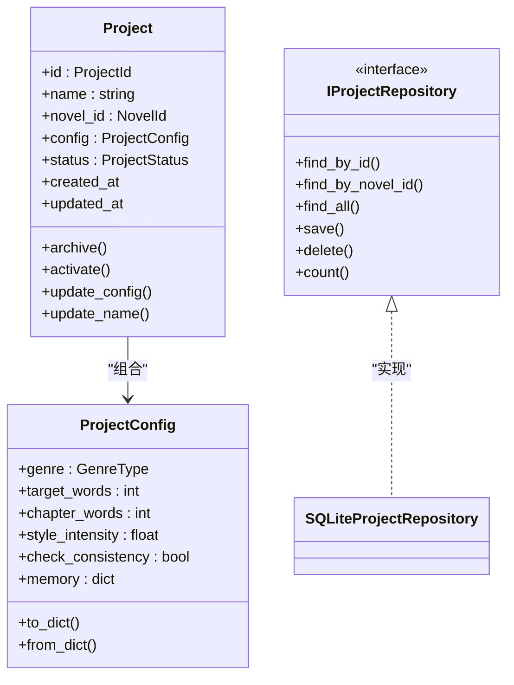
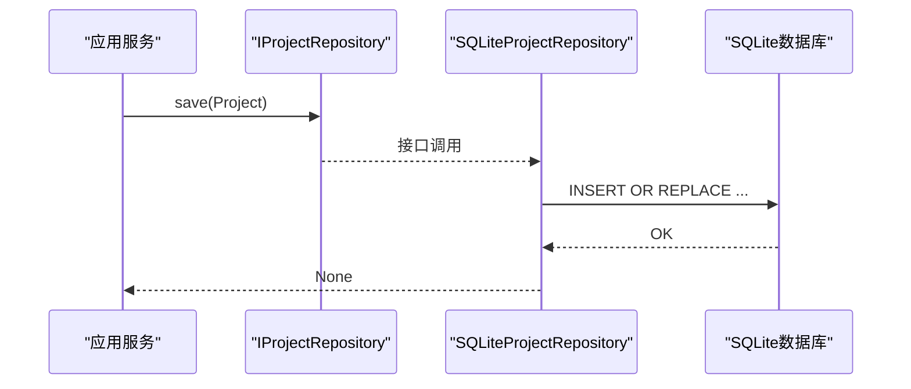
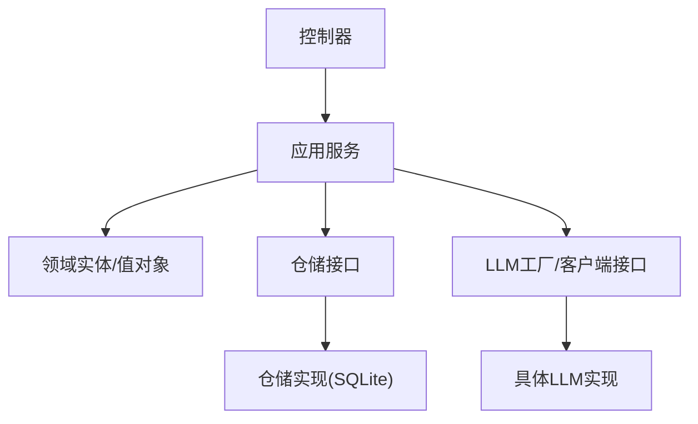

# Clean Architecture分层设计

<cite>
**本文引用的文件**
- [main.py](file://main.py)
- [presentation/api/app.py](file://presentation/api/app.py)
- [presentation/api/routers/project.py](file://presentation/api/routers/project.py)
- [presentation/api/dependencies.py](file://presentation/api/dependencies.py)
- [application/services/project_service.py](file://application/services/project_service.py)
- [domain/entities/project.py](file://domain/entities/project.py)
- [domain/entities/novel.py](file://domain/entities/novel.py)
- [domain/tokens.py](file://domain/types.py)
- [domain/repositories/project_repository.py](file://domain/repositories/project_repository.py)
- [infrastructure/persistence/sqlite_project_repo.py](file://infrastructure/persistence/sqlite_project_repo.py)
- [infrastructure/persistence/sqlite_novel_repo.py](file://infrastructure/persistence/sqlite_novel_repo.py)
- [infrastructure/llm/base_client.py](file://infrastructure/llm/base_client.py)
- [application/dto/request_dto.py](file://application/dto/request_dto.py)
- [application/agent_mvp/orchestrator.py](file://application/agent_mvp/orchestrator.py)
- [README.md](file://README.md)
</cite>

## 目录
1. [引言](#引言)
2. [项目结构](#项目结构)
3. [核心组件](#核心组件)
4. [架构总览](#架构总览)
5. [详细组件分析](#详细组件分析)
6. [依赖分析](#依赖分析)
7. [性能考虑](#性能考虑)
8. [故障排查指南](#故障排查指南)
9. [结论](#结论)
10. [附录](#附录)

## 引言
本文件面向InkTrace项目，系统化阐述其采用的Clean Architecture（整洁架构）分层设计。通过明确表现层(Presentation)、应用层(Application)、领域层(Domain)、基础设施层(Infrastructure)的职责边界与交互规则，帮助开发者快速理解并正确实施该架构。文档还解释了为何选择Clean Architecture以解决传统MVC架构中的常见问题，提供了层间依赖关系图与数据流向图，并总结了每层的典型实现模式与最佳实践。

## 项目结构
InkTrace遵循Clean Architecture的分层组织方式，代码按层划分为四个主要目录：
- domain：领域层，包含实体、值对象、领域服务与仓储接口，是业务规则与不变量的核心。
- application：应用层，包含应用服务与DTO，负责协调用例与编排业务流程。
- infrastructure：基础设施层，包含持久化、外部服务适配器（如LLM客户端）、文件处理等。
- presentation：表现层，包含API路由与依赖注入，对外暴露HTTP接口并调用应用服务。

图表来源
- [presentation/api/app.py:19-66](file://presentation/api/app.py#L19-L66)
- [presentation/api/routers/project.py:1-290](file://presentation/api/routers/project.py#L1-L290)
- [presentation/api/dependencies.py:1-178](file://presentation/api/dependencies.py#L1-L178)
- [application/services/project_service.py:1-203](file://application/services/project_service.py#L1-L203)
- [domain/entities/project.py:1-112](file://domain/entities/project.py#L1-L112)
- [domain/repositories/project_repository.py:1-55](file://domain/repositories/project_repository.py#L1-L55)
- [infrastructure/persistence/sqlite_project_repo.py:1-125](file://infrastructure/persistence/sqlite_project_repo.py#L1-L125)
- [infrastructure/llm/base_client.py:1-83](file://infrastructure/llm/base_client.py#L1-L83)

章节来源
- [README.md:72-106](file://README.md#L72-L106)

## 核心组件
- 表现层
  - FastAPI应用与路由：负责HTTP请求接入、CORS中间件、路由注册与健康检查。
  - 依赖注入：集中提供仓储、服务与工厂实例，确保上层仅依赖抽象。
- 应用层
  - 应用服务：封装业务用例，协调领域实体与仓储，保证用例的事务边界与业务规则。
  - DTO：统一请求/响应的数据结构，便于验证与跨层传递。
  - 代理编排器：用于多工具协作、策略终止与幂等控制。
- 领域层
  - 实体与值对象：封装业务不变量与行为，如Project/Novel及其ID类型与状态枚举。
  - 仓储接口：定义数据访问契约，隔离具体存储实现。
- 基础设施层
  - 持久化：SQLite实现的仓储，负责实体的序列化/反序列化与SQL操作。
  - LLM客户端：抽象大模型接口，支持主备切换与可用性检查。

章节来源
- [presentation/api/app.py:19-66](file://presentation/api/app.py#L19-L66)
- [presentation/api/dependencies.py:1-178](file://presentation/api/dependencies.py#L1-L178)
- [application/services/project_service.py:1-203](file://application/services/project_service.py#L1-L203)
- [domain/entities/project.py:1-112](file://domain/entities/project.py#L1-L112)
- [domain/entities/novel.py:1-178](file://domain/entities/novel.py#L1-L178)
- [domain/tokens.py:1-284](file://domain/types.py#L1-L284)
- [domain/repositories/project_repository.py:1-55](file://domain/repositories/project_repository.py#L1-L55)
- [infrastructure/persistence/sqlite_project_repo.py:1-125](file://infrastructure/persistence/sqlite_project_repo.py#L1-L125)
- [infrastructure/persistence/sqlite_novel_repo.py:1-126](file://infrastructure/persistence/sqlite_novel_repo.py#L1-L126)
- [infrastructure/llm/base_client.py:1-83](file://infrastructure/llm/base_client.py#L1-L83)

## 架构总览
Clean Architecture的核心思想是“依赖倒置”：高层策略（应用层）不依赖底层细节（基础设施），而是依赖抽象；底层实现向高层“可见”，但高层不可见底层。InkTrace通过以下方式实现：
- 表现层只依赖应用层接口，不直接使用仓储或外部服务。
- 应用层依赖领域抽象（实体、仓储接口、领域服务），不关心具体实现。
- 领域层不依赖任何其他层，保持纯粹的业务规则。
- 基础设施层实现仓储接口与外部服务，向上提供抽象能力。

图表来源
- [presentation/api/app.py:19-66](file://presentation/api/app.py#L19-L66)
- [presentation/api/dependencies.py:1-178](file://presentation/api/dependencies.py#L1-L178)
- [application/services/project_service.py:1-203](file://application/services/project_service.py#L1-L203)
- [domain/repositories/project_repository.py:1-55](file://domain/repositories/project_repository.py#L1-L55)
- [infrastructure/persistence/sqlite_project_repo.py:1-125](file://infrastructure/persistence/sqlite_project_repo.py#L1-L125)

## 详细组件分析

### 表现层（Presentation）
- 职责
  - 提供HTTP接口，注册路由与中间件。
  - 通过依赖注入获取应用服务与基础设施组件。
  - 控制器层仅做参数绑定、错误转换与响应封装。
- 典型实现
  - FastAPI应用创建与路由注册：[presentation/api/app.py:19-66](file://presentation/api/app.py#L19-L66)
  - 项目相关路由与控制器：[presentation/api/routers/project.py:1-290](file://presentation/api/routers/project.py#L1-L290)
  - 依赖注入容器：[presentation/api/dependencies.py:1-178](file://presentation/api/dependencies.py#L1-L178)
- 交互模式
  - 控制器接收请求，调用应用服务；应用服务完成业务编排后返回领域实体或值对象；控制器再映射为响应DTO。

图表来源
- [presentation/api/routers/project.py:91-181](file://presentation/api/routers/project.py#L91-L181)
- [application/services/project_service.py:32-67](file://application/services/project_service.py#L32-L67)
- [infrastructure/persistence/sqlite_project_repo.py:81-98](file://infrastructure/persistence/sqlite_project_repo.py#L81-L98)
- [domain/entities/project.py:49-112](file://domain/entities/project.py#L49-L112)

章节来源
- [presentation/api/app.py:19-66](file://presentation/api/app.py#L19-L66)
- [presentation/api/routers/project.py:1-290](file://presentation/api/routers/project.py#L1-L290)
- [presentation/api/dependencies.py:1-178](file://presentation/api/dependencies.py#L1-L178)

### 应用层（Application）
- 职责
  - 编排业务流程，协调多个领域实体与仓储。
  - 保证用例的原子性与一致性，进行必要的校验与转换。
- 典型实现
  - 项目管理服务：[application/services/project_service.py:1-203](file://application/services/project_service.py#L1-L203)
  - 请求DTO定义：[application/dto/request_dto.py:1-97](file://application/dto/request_dto.py#L1-L97)
  - 代理编排器（MVP）：[application/agent_mvp/orchestrator.py:1-212](file://application/agent_mvp/orchestrator.py#L1-L212)
- 交互模式
  - 应用服务接收DTO，构造领域实体，调用仓储持久化；必要时调用LLM或其他基础设施能力。

图表来源
- [application/services/project_service.py:32-67](file://application/services/project_service.py#L32-L67)
- [application/dto/request_dto.py:21-28](file://application/dto/request_dto.py#L21-L28)

章节来源
- [application/services/project_service.py:1-203](file://application/services/project_service.py#L1-L203)
- [application/dto/request_dto.py:1-97](file://application/dto/request_dto.py#L1-L97)
- [application/agent_mvp/orchestrator.py:1-212](file://application/agent_mvp/orchestrator.py#L1-L212)

### 领域层（Domain）
- 职责
  - 定义业务不变量、状态与行为，提供强类型的ID与枚举。
  - 通过仓储接口抽象数据访问，避免上层感知实现细节。
- 典型实现
  - 项目与小说实体：[domain/entities/project.py:1-112](file://domain/entities/project.py#L1-L112), [domain/entities/novel.py:1-178](file://domain/entities/novel.py#L1-L178)
  - 类型与枚举：[domain/tokens.py:1-284](file://domain/types.py#L1-L284)
  - 仓储接口：[domain/repositories/project_repository.py:1-55](file://domain/repositories/project_repository.py#L1-L55)
- 交互模式
  - 领域实体承载业务逻辑；应用服务通过仓储接口读写数据；基础设施层提供具体实现。

图表来源
- [domain/entities/project.py:49-112](file://domain/entities/project.py#L49-L112)
- [domain/repositories/project_repository.py:17-55](file://domain/repositories/project_repository.py#L17-L55)
- [infrastructure/persistence/sqlite_project_repo.py:20-125](file://infrastructure/persistence/sqlite_project_repo.py#L20-L125)

章节来源
- [domain/entities/project.py:1-112](file://domain/entities/project.py#L1-L112)
- [domain/entities/novel.py:1-178](file://domain/entities/novel.py#L1-L178)
- [domain/tokens.py:1-284](file://domain/types.py#L1-L284)
- [domain/repositories/project_repository.py:1-55](file://domain/repositories/project_repository.py#L1-L55)

### 基础设施层（Infrastructure）
- 职责
  - 提供具体实现：数据库访问、文件处理、外部服务适配。
  - 通过接口向上层暴露能力，隐藏实现细节。
- 典型实现
  - SQLite仓储：[infrastructure/persistence/sqlite_project_repo.py:1-125](file://infrastructure/persistence/sqlite_project_repo.py#L1-L125), [infrastructure/persistence/sqlite_novel_repo.py:1-126](file://infrastructure/persistence/sqlite_novel_repo.py#L1-L126)
  - LLM客户端接口：[infrastructure/llm/base_client.py:1-83](file://infrastructure/llm/base_client.py#L1-L83)
- 交互模式
  - 应用服务通过仓储接口调用；基础设施层实现具体SQL/网络协议；返回领域实体或值对象。

图表来源
- [application/services/project_service.py:24-31](file://application/services/project_service.py#L24-L31)
- [infrastructure/persistence/sqlite_project_repo.py:81-98](file://infrastructure/persistence/sqlite_project_repo.py#L81-L98)

章节来源
- [infrastructure/persistence/sqlite_project_repo.py:1-125](file://infrastructure/persistence/sqlite_project_repo.py#L1-L125)
- [infrastructure/persistence/sqlite_novel_repo.py:1-126](file://infrastructure/persistence/sqlite_novel_repo.py#L1-L126)
- [infrastructure/llm/base_client.py:1-83](file://infrastructure/llm/base_client.py#L1-L83)

### 为什么选择Clean Architecture
- 解决传统MVC的痛点
  - MVC中控制器可能承担过多业务逻辑，导致耦合度高、难以测试与演进。
  - Clean Architecture通过“依赖倒置”将业务规则集中在领域层，表现层与基础设施层围绕领域抽象构建，降低耦合、提升内聚。
- 明确职责边界
  - 表现层只关注“如何呈现”，应用层只关注“如何编排”，领域层只关注“业务规则”，基础设施层只关注“技术实现”。
- 易于测试与扩展
  - 可通过Mock仓储接口对应用服务进行单元测试；新增外部服务或替换存储只需实现对应接口。
- 适合AI+内容创作场景
  - InkTrace涉及LLM、向量检索、文件导入等多类外部能力，Clean Architecture便于将这些能力以接口形式注入，保持核心业务稳定。

## 依赖分析
- 层间依赖方向
  - 表现层 → 应用层：控制器依赖应用服务接口。
  - 应用层 → 领域层：应用服务依赖实体、仓储接口与领域服务。
  - 领域层 ← 基础设施层：仓储接口由具体实现提供。
- 关键依赖点
  - 依赖注入容器集中提供仓储与服务实例，避免控制器直接依赖具体实现。
  - 应用服务通过仓储接口与LLM工厂等抽象交互，不直接依赖具体实现。

图表来源
- [presentation/api/dependencies.py:122-178](file://presentation/api/dependencies.py#L122-L178)
- [application/services/project_service.py:24-31](file://application/services/project_service.py#L24-L31)
- [infrastructure/persistence/sqlite_project_repo.py:20-25](file://infrastructure/persistence/sqlite_project_repo.py#L20-L25)
- [infrastructure/llm/base_client.py:14-83](file://infrastructure/llm/base_client.py#L14-L83)

章节来源
- [presentation/api/dependencies.py:1-178](file://presentation/api/dependencies.py#L1-L178)
- [application/services/project_service.py:1-203](file://application/services/project_service.py#L1-L203)

## 性能考虑
- 仓储层
  - 使用批量插入与索引优化查询；对JSON字段进行序列化/反序列化时注意开销。
- 应用层
  - 合理拆分事务，避免长事务锁表；对频繁调用的查询使用缓存或分页。
- 表现层
  - 控制器尽量轻量化，避免在路由中执行复杂逻辑；将耗时任务异步化。
- 基础设施层
  - LLM调用应设置超时与重试策略；对向量检索设置合理上下文窗口与召回条数。

## 故障排查指南
- 常见问题
  - 404/400错误：检查路由前缀与参数类型，确认DTO校验与状态枚举转换。
  - 500错误：检查应用服务中的异常分支与仓储保存是否成功。
  - LLM不可用：检查环境变量与客户端可用性检测。
- 排查步骤
  - 在控制器捕获异常并记录日志，返回标准错误响应。
  - 在应用服务中对关键流程添加断言与日志，定位实体状态与仓储调用。
  - 在基础设施层增加健康检查端点与可用性探测。

章节来源
- [presentation/api/routers/project.py:100-123](file://presentation/api/routers/project.py#L100-L123)
- [presentation/api/routers/project.py:248-253](file://presentation/api/routers/project.py#L248-L253)
- [infrastructure/llm/base_client.py:79-83](file://infrastructure/llm/base_client.py#L79-L83)

## 结论
InkTrace通过Clean Architecture实现了清晰的职责分离与稳定的依赖方向，使表现层、应用层、领域层与基础设施层各司其职、相互解耦。该架构有助于应对AI+内容创作场景下的复杂性与不确定性，便于持续演进与团队协作。建议在后续开发中坚持“接口优先”的原则，持续完善领域建模与测试覆盖。

## 附录
- 启动入口与运行方式
  - 后端启动入口：[main.py:15-21](file://main.py#L15-L21)
  - 项目结构与技术栈概览：[README.md:72-106](file://README.md#L72-L106), [README.md:172-186](file://README.md#L172-L186)