# DDD领域建模

<cite>
**本文引用的文件**
- [domain/entities/__init__.py](file://domain/entities/__init__.py)
- [domain/value_objects/__init__.py](file://domain/value_objects/__init__.py)
- [domain/repositories/__init__.py](file://domain/repositories/__init__.py)
- [domain/services/__init__.py](file://domain/services/__init__.py)
- [domain/types.py](file://domain/types.py)
- [domain/utils.py](file://domain/utils.py)
- [domain/entities/novel.py](file://domain/entities/novel.py)
- [domain/entities/chapter.py](file://domain/entities/chapter.py)
- [domain/entities/character.py](file://domain/entities/character.py)
- [domain/entities/outline.py](file://domain/entities/outline.py)
- [domain/value_objects/style_profile.py](file://domain/value_objects/style_profile.py)
- [domain/value_objects/writing_config.py](file://domain/value_objects/writing_config.py)
- [domain/repositories/novel_repository.py](file://domain/repositories/novel_repository.py)
- [domain/repositories/chapter_repository.py](file://domain/repositories/chapter_repository.py)
- [domain/repositories/character_repository.py](file://domain/repositories/character_repository.py)
- [domain/repositories/outline_repository.py](file://domain/repositories/outline_repository.py)
- [domain/services/consistency_checker.py](file://domain/services/consistency_checker.py)
- [domain/services/writing_engine.py](file://domain/services/writing_engine.py)
</cite>

## 目录
1. [引言](#引言)
2. [项目结构](#项目结构)
3. [核心组件](#核心组件)
4. [架构总览](#架构总览)
5. [详细组件分析](#详细组件分析)
6. [依赖分析](#依赖分析)
7. [性能考虑](#性能考虑)
8. [故障排查指南](#故障排查指南)
9. [结论](#结论)
10. [附录](#附录)

## 引言
本文件面向InkTrace项目的领域建模，系统阐述领域驱动设计（DDD）的核心理念与在本项目中的落地实践。重点覆盖：
- 实体（Entity）、值对象（Value Object）、聚合根（Aggregate Root）的设计原则与实现形态
- 仓储接口（Repository Interface）的抽象与职责边界
- 领域服务（Domain Service）的作用与实现策略
- 完整的实体关系图与UML类图
- 典型流程的时序图与算法流程图
- 如何识别业务边界并设计合理的领域模型
- 开发者最佳实践与常见问题排查

## 项目结构
InkTrace采用分层清晰的Python项目组织，其中domain层承载DDD核心模型与规则，application层编排业务用例，infrastructure层提供基础设施实现（如持久化、LLM客户端等），presentation层负责API入口。

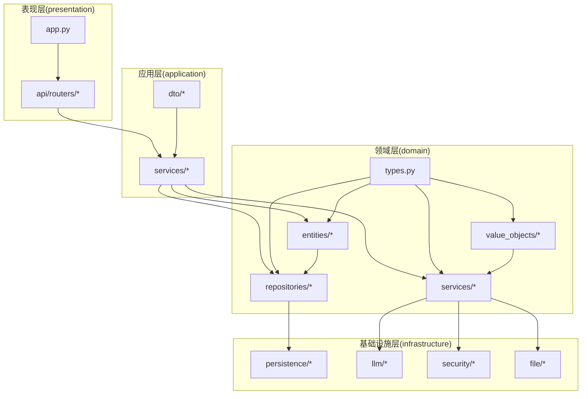

**图表来源**
- [domain/entities/__init__.py](file://domain/entities/__init__.py)
- [domain/value_objects/__init__.py](file://domain/value_objects/__init__.py)
- [domain/repositories/__init__.py](file://domain/repositories/__init__.py)
- [domain/services/__init__.py](file://domain/services/__init__.py)
- [domain/types.py](file://domain/types.py)
- [domain/utils.py](file://domain/utils.py)

**章节来源**
- [domain/entities/__init__.py](file://domain/entities/__init__.py)
- [domain/value_objects/__init__.py](file://domain/value_objects/__init__.py)
- [domain/repositories/__init__.py](file://domain/repositories/__init__.py)
- [domain/services/__init__.py](file://domain/services/__init__.py)
- [domain/types.py](file://domain/types.py)
- [domain/utils.py](file://domain/utils.py)

## 核心组件
- 实体与聚合根
  - 小说（聚合根）：聚合章节、人物、大纲，维护字数统计与变更时间
  - 章节（实体）：包含状态、字数计算、发布/取消发布操作
  - 人物（实体）：包含角色、关系、状态历史、功法、势力等
  - 大纲（聚合根）：包含主线/支线剧情节点、分卷大纲、世界设定
- 值对象
  - ID值对象：NovelId、ChapterId、CharacterId、OutlineId等
  - 枚举：ChapterStatus、PlotType、PlotStatus、CharacterRole、RelationType、GenreType等
  - 文风特征、写作配置等行为无关的数据载体
- 仓储接口
  - INovelRepository、IChapterRepository、ICharacterRepository、IOutlineRepository
  - 统一抽象数据访问契约，屏蔽存储细节
- 领域服务
  - 连贯性检查服务：跨实体的规则校验
  - 写作引擎服务：结合大纲、风格与LLM生成内容

**章节来源**
- [domain/entities/novel.py](file://domain/entities/novel.py)
- [domain/entities/chapter.py](file://domain/entities/chapter.py)
- [domain/entities/character.py](file://domain/entities/character.py)
- [domain/entities/outline.py](file://domain/entities/outline.py)
- [domain/value_objects/style_profile.py](file://domain/value_objects/style_profile.py)
- [domain/value_objects/writing_config.py](file://domain/value_objects/writing_config.py)
- [domain/repositories/novel_repository.py](file://domain/repositories/novel_repository.py)
- [domain/repositories/chapter_repository.py](file://domain/repositories/chapter_repository.py)
- [domain/repositories/character_repository.py](file://domain/repositories/character_repository.py)
- [domain/repositories/outline_repository.py](file://domain/repositories/outline_repository.py)
- [domain/services/consistency_checker.py](file://domain/services/consistency_checker.py)
- [domain/services/writing_engine.py](file://domain/services/writing_engine.py)

## 架构总览
下图展示领域模型与基础设施层的交互关系，体现“以领域为中心”的分层与解耦。

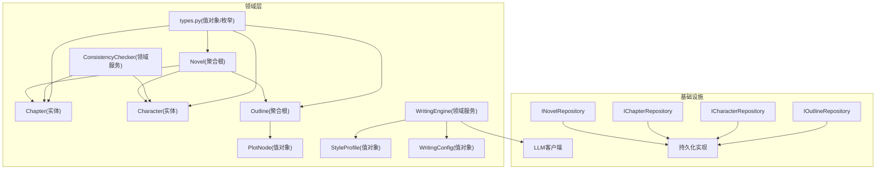

**图表来源**
- [domain/entities/novel.py](file://domain/entities/novel.py)
- [domain/entities/chapter.py](file://domain/entities/chapter.py)
- [domain/entities/character.py](file://domain/entities/character.py)
- [domain/entities/outline.py](file://domain/entities/outline.py)
- [domain/value_objects/style_profile.py](file://domain/value_objects/style_profile.py)
- [domain/value_objects/writing_config.py](file://domain/value_objects/writing_config.py)
- [domain/services/consistency_checker.py](file://domain/services/consistency_checker.py)
- [domain/services/writing_engine.py](file://domain/services/writing_engine.py)
- [domain/types.py](file://domain/types.py)
- [domain/repositories/novel_repository.py](file://domain/repositories/novel_repository.py)
- [domain/repositories/chapter_repository.py](file://domain/repositories/chapter_repository.py)
- [domain/repositories/character_repository.py](file://domain/repositories/character_repository.py)
- [domain/repositories/outline_repository.py](file://domain/repositories/outline_repository.py)

## 详细组件分析

### 实体与聚合根：小说（聚合根）
- 设计要点
  - 聚合边界：围绕“小说”组织章节、人物、大纲，保证整体一致性
  - 变更追踪：统一更新时间，便于审计与排序
  - 聚合内操作：新增/替换章节、新增/替换人物、设置大纲；内部维护字数统计
- 关键方法
  - 新增/替换章节：按编号排序并重算字数
  - 获取最新章节：按编号倒序取前N条
  - 获取指定角色：快速定位主角
  - 设置大纲：更新关联实体的更新时间
- 复杂度
  - 章节/人物查找：线性扫描，适合中等规模；若需高频查询可引入索引字段或仓储缓存

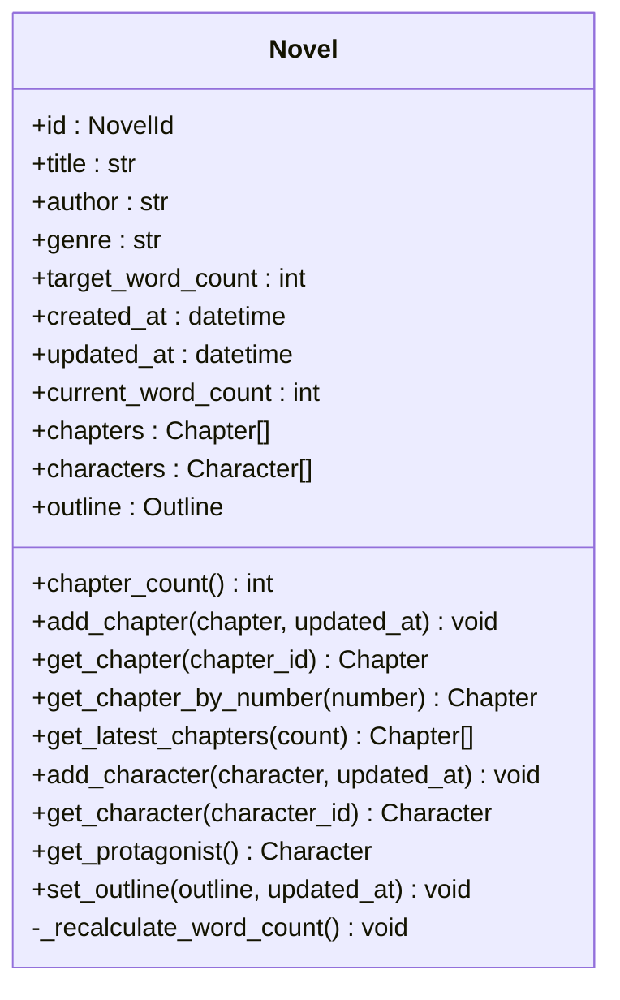

**图表来源**
- [domain/entities/novel.py](file://domain/entities/novel.py)

**章节来源**
- [domain/entities/novel.py](file://domain/entities/novel.py)

### 实体：章节
- 设计要点
  - 状态机：草稿/已发布，发布/取消发布前进行有效性检查
  - 字数计算：去除空白字符后统计长度
  - 关联性：属于某部小说，可记录涉及人物
- 错误处理
  - 重复发布/未发布状态下取消发布会抛出领域异常

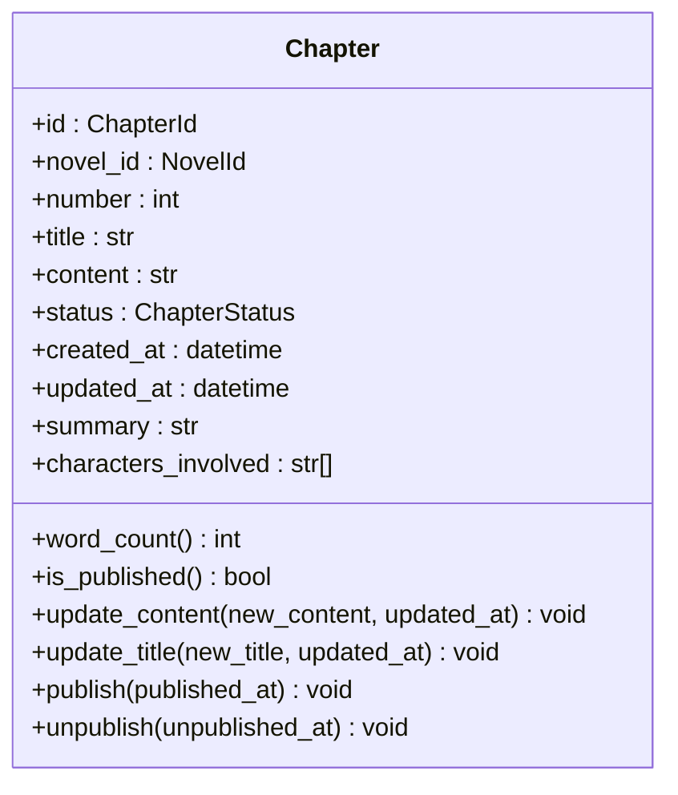

**图表来源**
- [domain/entities/chapter.py](file://domain/entities/chapter.py)

**章节来源**
- [domain/entities/chapter.py](file://domain/entities/chapter.py)

### 实体：人物
- 设计要点
  - 角色分类：主角、反派、配角
  - 关系建模：支持简版与详细版关系，含关系类型、起始章节等
  - 状态演进：当前状态与历史状态分离，便于回溯
  - 能力与势力：功法列表、所属势力ID
- 序列化/反序列化：提供to_dict/from_dict，便于跨层传输

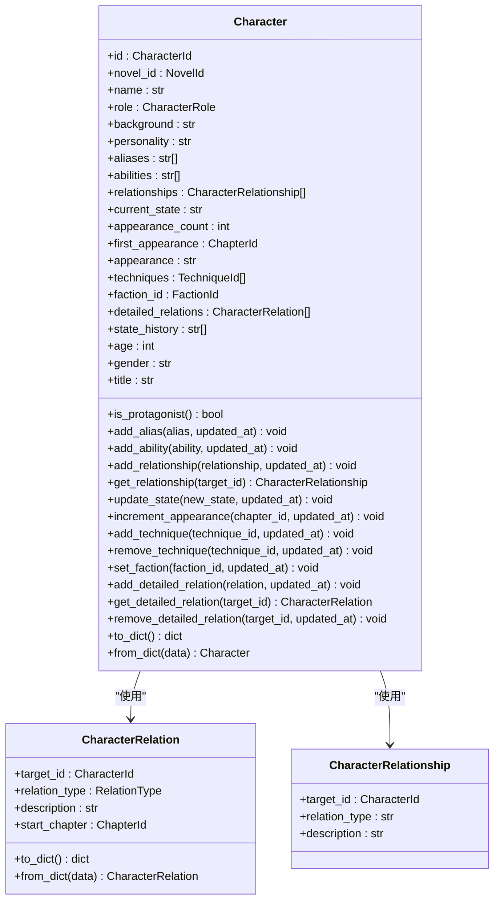

**图表来源**
- [domain/entities/character.py](file://domain/entities/character.py)

**章节来源**
- [domain/entities/character.py](file://domain/entities/character.py)

### 聚合根：大纲
- 设计要点
  - 结构化剧情：主线/支线剧情节点，支持状态流转
  - 分卷管理：按卷号排序，支持新增/替换
  - 查询便捷：按ID快速定位剧情节点
- 状态迁移：通过构造新的值对象替换旧节点，确保不可变性

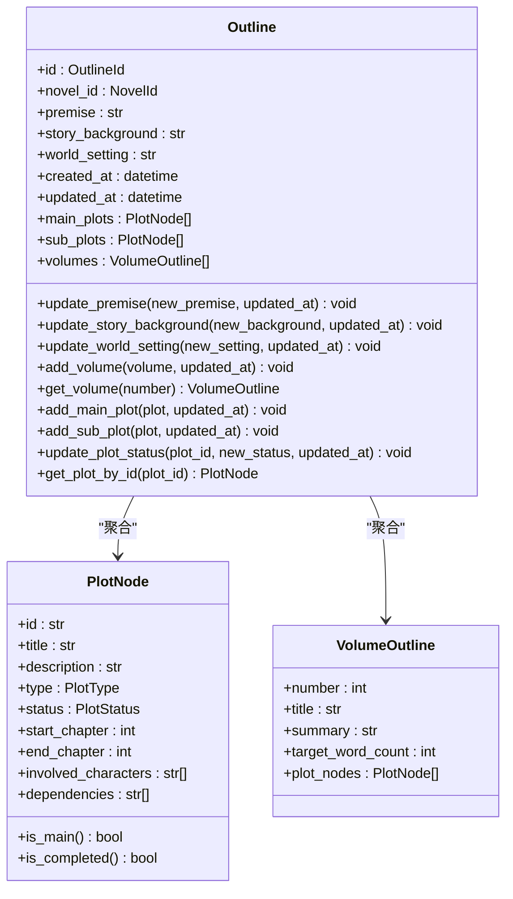

**图表来源**
- [domain/entities/outline.py](file://domain/entities/outline.py)

**章节来源**
- [domain/entities/outline.py](file://domain/entities/outline.py)

### 值对象与类型系统
- 值对象
  - StyleProfile：文风统计、对话风格、叙述语态、节奏等
  - WritingConfig：目标字数、风格强度、温度、上下文章节数、一致性检查开关、风格模拟开关
- 类型系统
  - ID值对象：NovelId、ChapterId、CharacterId、OutlineId、ProjectId、TemplateId、TechniqueId、FactionId、LocationId、ItemId、WorldviewId
  - 枚举：ChapterStatus、PlotType、PlotStatus、CharacterRole、RelationType、GenreType、ItemType、ProjectStatus

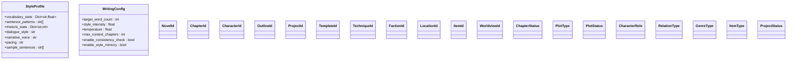

**图表来源**
- [domain/value_objects/style_profile.py](file://domain/value_objects/style_profile.py)
- [domain/value_objects/writing_config.py](file://domain/value_objects/writing_config.py)
- [domain/types.py](file://domain/types.py)

**章节来源**
- [domain/value_objects/style_profile.py](file://domain/value_objects/style_profile.py)
- [domain/value_objects/writing_config.py](file://domain/value_objects/writing_config.py)
- [domain/types.py](file://domain/types.py)

### 仓储接口：抽象与职责
- 抽象契约
  - INovelRepository：保存、按ID查找、全量查询、删除
  - IChapterRepository：保存、按ID/小说ID查找、最新章节查询、删除
  - ICharacterRepository：保存、按ID/小说ID查找、删除
  - IOutlineRepository：保存、按ID/小说ID查找、删除
- 设计原则
  - 以聚合为单位进行读写，避免跨聚合的事务
  - 返回值为领域实体，不暴露基础设施细节
  - 方法签名聚焦业务语义，而非数据库表结构

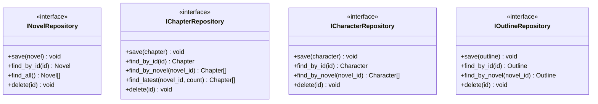

**图表来源**
- [domain/repositories/novel_repository.py](file://domain/repositories/novel_repository.py)
- [domain/repositories/chapter_repository.py](file://domain/repositories/chapter_repository.py)
- [domain/repositories/character_repository.py](file://domain/repositories/character_repository.py)
- [domain/repositories/outline_repository.py](file://domain/repositories/outline_repository.py)

**章节来源**
- [domain/repositories/novel_repository.py](file://domain/repositories/novel_repository.py)
- [domain/repositories/chapter_repository.py](file://domain/repositories/chapter_repository.py)
- [domain/repositories/character_repository.py](file://domain/repositories/character_repository.py)
- [domain/repositories/outline_repository.py](file://domain/repositories/outline_repository.py)

### 领域服务：连贯性检查与写作引擎
- 连贯性检查服务
  - 跨实体规则：人物境界一致性、时间线顺序、剧情连续性、伏笔回收
  - 输出：不一致项列表与警告，形成可执行的报告
- 写作引擎服务
  - 输入：写作上下文（小说标题、大纲摘要、前文、剧情方向、当前章号）、风格特征、写作配置
  - 流程：构建提示词 → LLM生成 → 可选风格应用 → 返回内容
  - 可扩展：支持异步/同步LLM客户端

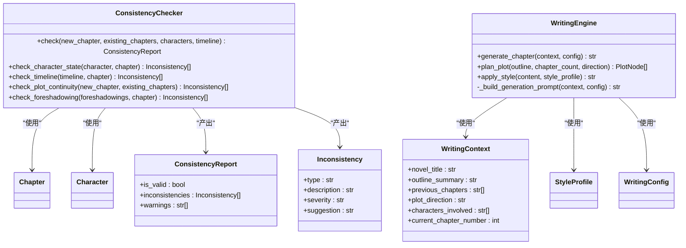

**图表来源**
- [domain/services/consistency_checker.py](file://domain/services/consistency_checker.py)
- [domain/services/writing_engine.py](file://domain/services/writing_engine.py)

**章节来源**
- [domain/services/consistency_checker.py](file://domain/services/consistency_checker.py)
- [domain/services/writing_engine.py](file://domain/services/writing_engine.py)

### 时序图：章节生成与一致性检查
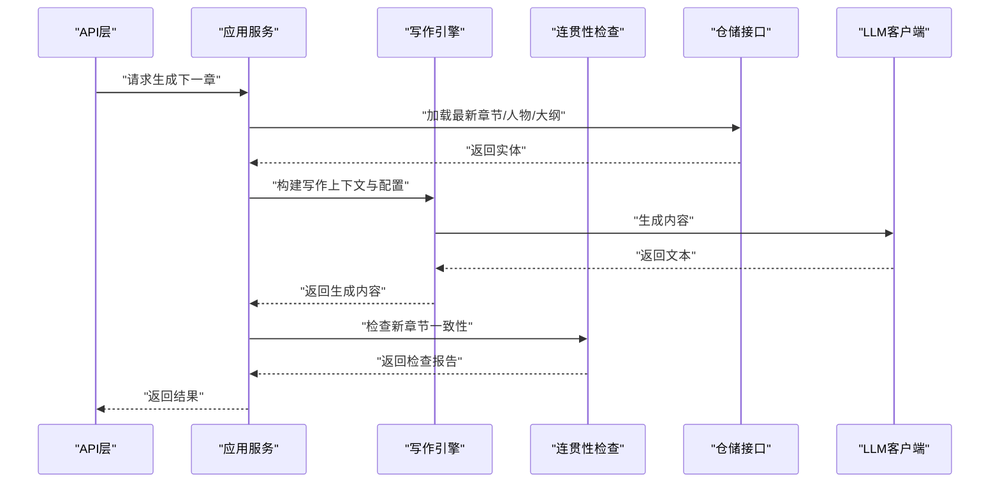

**图表来源**
- [domain/services/writing_engine.py](file://domain/services/writing_engine.py)
- [domain/services/consistency_checker.py](file://domain/services/consistency_checker.py)
- [domain/repositories/chapter_repository.py](file://domain/repositories/chapter_repository.py)
- [domain/repositories/character_repository.py](file://domain/repositories/character_repository.py)
- [domain/repositories/outline_repository.py](file://domain/repositories/outline_repository.py)

### 流程图：章节发布流程
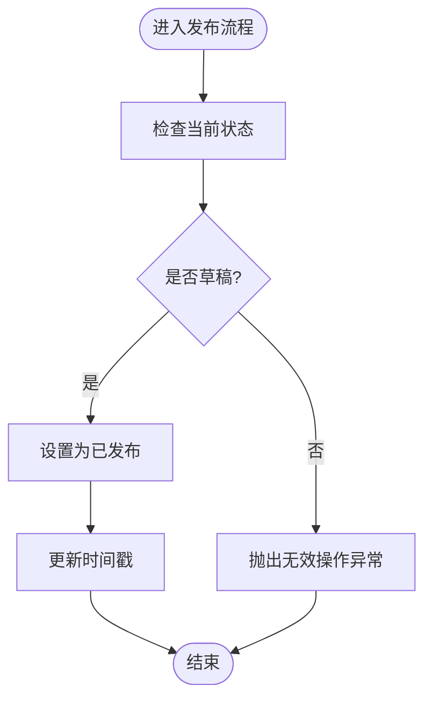

**图表来源**
- [domain/entities/chapter.py](file://domain/entities/chapter.py)

## 依赖分析
- 内聚性
  - 各聚合内聚度高：实体与值对象紧密围绕聚合根协作
- 耦合性
  - 领域服务对实体依赖强，但不依赖基础设施；仓储接口隔离了存储实现
- 可能的循环依赖
  - 当前模块间无循环导入；类型系统通过types.py集中定义，避免循环引用
- 外部依赖
  - LLM客户端、持久化实现通过接口注入，便于替换与测试

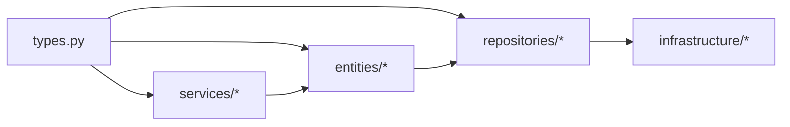

**图表来源**
- [domain/types.py](file://domain/types.py)
- [domain/entities/__init__.py](file://domain/entities/__init__.py)
- [domain/repositories/__init__.py](file://domain/repositories/__init__.py)
- [domain/services/__init__.py](file://domain/services/__init__.py)

**章节来源**
- [domain/types.py](file://domain/types.py)
- [domain/entities/__init__.py](file://domain/entities/__init__.py)
- [domain/repositories/__init__.py](file://domain/repositories/__init__.py)
- [domain/services/__init__.py](file://domain/services/__init__.py)

## 性能考虑
- 聚合内查找
  - 章节/人物列表遍历：适合中小规模；若章节量增长，建议在仓储层引入索引或分页查询
- 字数统计
  - 章节字数计算为O(n)字符串处理；可在聚合根外缓存或延迟计算
- LLM调用
  - 写作引擎异步生成；建议在应用层做并发控制与超时管理
- 数据序列化
  - 人物实体的字典转换开销可控；注意避免重复转换

## 故障排查指南
- 章节发布异常
  - 症状：重复发布或未发布状态下取消发布
  - 排查：确认状态枚举与条件分支，检查异常类型
  - 参考
    - [domain/entities/chapter.py](file://domain/entities/chapter.py)
- 连贯性检查误报/漏报
  - 症状：人物境界跳级未被检测或时间线顺序错误未提示
  - 排查：核对关键词匹配正则、时间线最后事件与章节号比较逻辑
  - 参考
    - [domain/services/consistency_checker.py](file://domain/services/consistency_checker.py)
- 写作上下文缺失
  - 症状：生成内容偏离主题或风格不符
  - 排查：检查大纲摘要、前文截取数量、写作配置参数
  - 参考
    - [domain/services/writing_engine.py](file://domain/services/writing_engine.py)

**章节来源**
- [domain/entities/chapter.py](file://domain/entities/chapter.py)
- [domain/services/consistency_checker.py](file://domain/services/consistency_checker.py)
- [domain/services/writing_engine.py](file://domain/services/writing_engine.py)

## 结论
InkTrace的领域建模遵循DDD核心思想：以聚合为核心，通过实体与值对象表达业务不变量，以仓储接口隔离基础设施，以领域服务承载跨实体的复杂规则。该设计提升了模型的可读性、可维护性与可测试性，为后续扩展（如向量检索、RAG增强）提供了清晰的边界与扩展点。

## 附录
- 最佳实践清单
  - 以聚合为单位进行读写，避免跨聚合事务
  - 使用值对象表达行为无关的数据，提升模型表达力
  - 在仓储接口上统一抽象，避免应用层感知存储细节
  - 将跨实体规则收敛到领域服务，保持实体的纯净性
  - 通过类型系统集中定义ID与枚举，减少歧义
  - 对关键流程绘制时序图与流程图，辅助沟通与评审