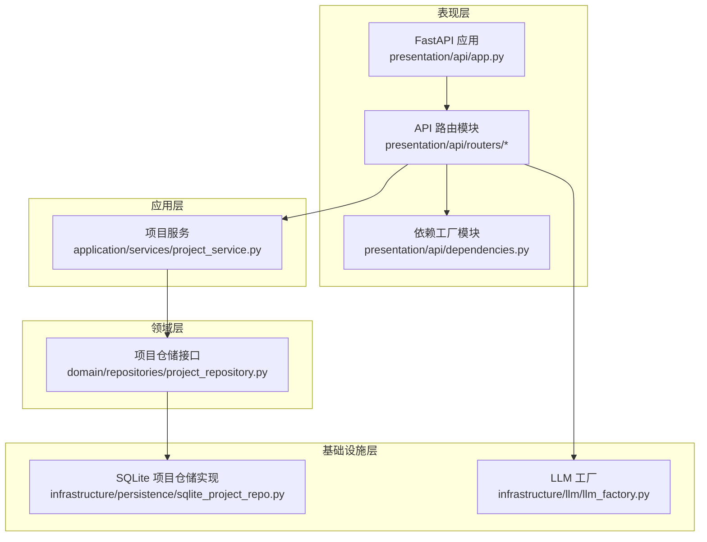
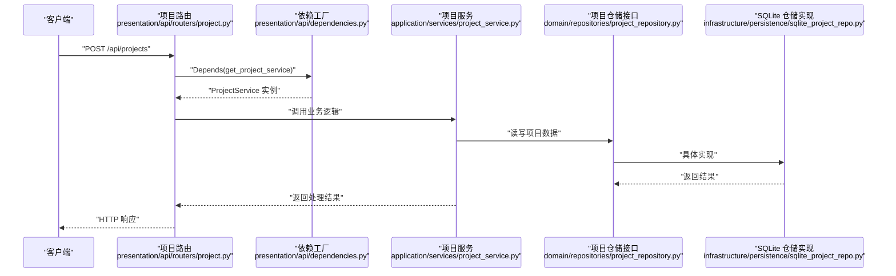
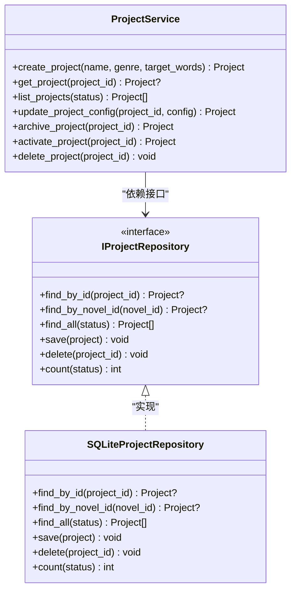
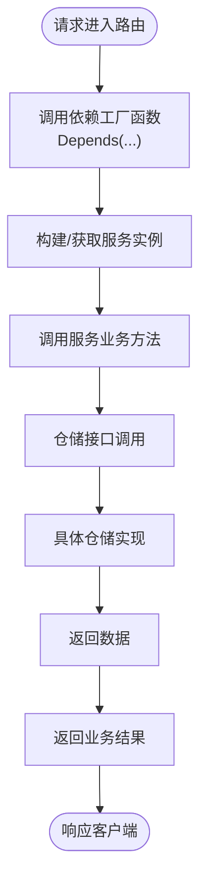
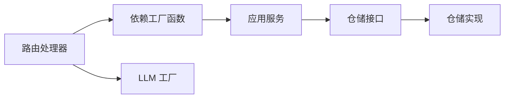

# 依赖注入实现

<cite>
**本文引用的文件**
- [presentation/api/dependencies.py](file://presentation/api/dependencies.py)
- [presentation/api/app.py](file://presentation/api/app.py)
- [presentation/api/routers/project.py](file://presentation/api/routers/project.py)
- [application/services/project_service.py](file://application/services/project_service.py)
- [domain/repositories/project_repository.py](file://domain/repositories/project_repository.py)
- [infrastructure/persistence/sqlite_project_repo.py](file://infrastructure/persistence/sqlite_project_repo.py)
- [infrastructure/llm/llm_factory.py](file://infrastructure/llm/llm_factory.py)
- [config.py](file://config.py)
- [main.py](file://main.py)
- [tests/unit/test_project_service.py](file://tests/unit/test_project_service.py)
</cite>

## 目录
1. [简介](#简介)
2. [项目结构](#项目结构)
3. [核心组件](#核心组件)
4. [架构总览](#架构总览)
5. [详细组件分析](#详细组件分析)
6. [依赖关系分析](#依赖关系分析)
7. [性能考虑](#性能考虑)
8. [故障排查指南](#故障排查指南)
9. [结论](#结论)
10. [附录](#附录)

## 简介
本文件系统性阐述 InkTrace 项目的依赖注入（DI）设计与实现，重点覆盖：
- 构造函数注入、属性注入与方法注入的使用场景与边界
- 依赖注入容器的配置与管理方式
- 在 FastAPI 中的依赖注入与生命周期管理
- 依赖关系图与注入流程图
- 具体代码示例路径与最佳实践建议
- 循环依赖的检测与解决方案
- 如何通过 DI 提升代码可测试性与可维护性

## 项目结构
InkTrace 采用分层架构，依赖注入主要集中在 presentation 层的 API 路由与依赖模块中，通过工厂函数与缓存机制实现“容器式”依赖提供。

图表来源
- [presentation/api/app.py:19-65](file://presentation/api/app.py#L19-L65)
- [presentation/api/dependencies.py:50-178](file://presentation/api/dependencies.py#L50-L178)
- [presentation/api/routers/project.py:71-89](file://presentation/api/routers/project.py#L71-L89)
- [application/services/project_service.py:21-31](file://application/services/project_service.py#L21-L31)
- [domain/repositories/project_repository.py:17-55](file://domain/repositories/project_repository.py#L17-L55)
- [infrastructure/persistence/sqlite_project_repo.py:20-26](file://infrastructure/persistence/sqlite_project_repo.py#L20-L26)
- [infrastructure/llm/llm_factory.py:31-95](file://infrastructure/llm/llm_factory.py#L31-L95)

章节来源
- [presentation/api/app.py:19-65](file://presentation/api/app.py#L19-L65)
- [presentation/api/dependencies.py:50-178](file://presentation/api/dependencies.py#L50-L178)
- [presentation/api/routers/project.py:71-89](file://presentation/api/routers/project.py#L71-L89)
- [application/services/project_service.py:21-31](file://application/services/project_service.py#L21-L31)
- [domain/repositories/project_repository.py:17-55](file://domain/repositories/project_repository.py#L17-L55)
- [infrastructure/persistence/sqlite_project_repo.py:20-26](file://infrastructure/persistence/sqlite_project_repo.py#L20-L26)
- [infrastructure/llm/llm_factory.py:31-95](file://infrastructure/llm/llm_factory.py#L31-L95)

## 核心组件
- 依赖工厂模块：集中定义依赖提供函数，使用缓存避免重复创建，统一管理外部资源（数据库、向量库、解析器等）。
- FastAPI 应用：注册路由并暴露健康检查端点，不直接管理业务依赖。
- 路由器：通过 Depends 注入服务与仓储实例，形成“按需拉取”的依赖消费模式。
- 应用服务：以构造函数注入方式接收仓储接口，便于替换实现与测试。
- 基础设施实现：仓储接口的具体实现，负责数据持久化细节。
- LLM 工厂：提供主备模型客户端选择与切换能力，支持异步可用性检测。

章节来源
- [presentation/api/dependencies.py:50-178](file://presentation/api/dependencies.py#L50-L178)
- [presentation/api/app.py:19-65](file://presentation/api/app.py#L19-L65)
- [presentation/api/routers/project.py:71-89](file://presentation/api/routers/project.py#L71-L89)
- [application/services/project_service.py:21-31](file://application/services/project_service.py#L21-L31)
- [infrastructure/persistence/sqlite_project_repo.py:20-26](file://infrastructure/persistence/sqlite_project_repo.py#L20-L26)
- [infrastructure/llm/llm_factory.py:31-95](file://infrastructure/llm/llm_factory.py#L31-L95)

## 架构总览
下图展示了从 FastAPI 路由到服务与仓储的依赖流向，以及依赖工厂在其中的角色。

图表来源
- [presentation/api/routers/project.py:91-181](file://presentation/api/routers/project.py#L91-L181)
- [presentation/api/dependencies.py:122-124](file://presentation/api/dependencies.py#L122-L124)
- [application/services/project_service.py:32-68](file://application/services/project_service.py#L32-L68)
- [domain/repositories/project_repository.py:20-49](file://domain/repositories/project_repository.py#L20-L49)
- [infrastructure/persistence/sqlite_project_repo.py:45-98](file://infrastructure/persistence/sqlite_project_repo.py#L45-L98)

## 详细组件分析

### 依赖工厂与容器式管理
- 作用：集中声明与创建依赖，统一管理外部资源路径与配置。
- 缓存策略：对部分工厂函数使用缓存装饰器，降低重复创建成本；对需要按请求变化的对象（如服务类工厂函数）未使用缓存，保证每次请求独立实例。
- 环境变量：数据库路径、模板目录、向量库目录等通过环境变量注入，便于部署时灵活配置。
- 返回类型：明确标注返回接口或具体实现，便于静态类型检查与 IDE 支持。

章节来源
- [presentation/api/dependencies.py:50-178](file://presentation/api/dependencies.py#L50-L178)
- [config.py:30-45](file://config.py#L30-L45)

### FastAPI 中的依赖注入与生命周期
- 应用创建：在应用工厂中注册路由与中间件，不直接在应用层管理依赖。
- 路由注入：在路由处理器中使用 Depends 引入依赖工厂函数，实现按需注入。
- 生命周期：依赖工厂函数在请求范围内被调用；缓存装饰器仅缓存单例对象；服务类工厂函数未缓存，确保每次请求隔离。
- 启动入口：通过主程序启动 Uvicorn 服务器，加载应用对象。

章节来源
- [presentation/api/app.py:19-65](file://presentation/api/app.py#L19-L65)
- [presentation/api/routers/project.py:71-89](file://presentation/api/routers/project.py#L71-L89)
- [main.py:15-21](file://main.py#L15-L21)

### 构造函数注入：应用服务与仓储
- 项目服务通过构造函数注入仓储接口，实现对底层存储的解耦。
- 测试友好：可通过 Mock 仓储接口进行单元测试，验证业务逻辑。
- 扩展性强：新增存储实现只需实现对应接口，并在依赖工厂中切换绑定。

图表来源
- [application/services/project_service.py:21-31](file://application/services/project_service.py#L21-L31)
- [domain/repositories/project_repository.py:17-55](file://domain/repositories/project_repository.py#L17-L55)
- [infrastructure/persistence/sqlite_project_repo.py:20-26](file://infrastructure/persistence/sqlite_project_repo.py#L20-L26)

章节来源
- [application/services/project_service.py:21-31](file://application/services/project_service.py#L21-L31)
- [domain/repositories/project_repository.py:17-55](file://domain/repositories/project_repository.py#L17-L55)
- [infrastructure/persistence/sqlite_project_repo.py:20-26](file://infrastructure/persistence/sqlite_project_repo.py#L20-L26)

### 属性注入与方法注入：在路由中的使用
- 属性注入：在路由处理器中通过 Depends 注入服务实例，属于典型的属性注入用法。
- 方法注入：在路由处理器内部调用工具类或服务的方法执行业务逻辑，例如项目初始化与首章生成。
- 注意事项：避免在路由中直接创建复杂依赖，保持路由职责单一，将业务逻辑下沉至服务层。

章节来源
- [presentation/api/routers/project.py:91-181](file://presentation/api/routers/project.py#L91-L181)

### LLM 工厂：动态客户端选择与切换
- 设计要点：封装主备模型客户端，支持异步可用性检测与手动切换。
- 使用场景：在路由中通过工厂函数获取客户端，用于 AI 写作与检索等场景。
- 生命周期：工厂对象在请求范围内持有客户端实例，必要时进行切换。

章节来源
- [infrastructure/llm/llm_factory.py:31-95](file://infrastructure/llm/llm_factory.py#L31-L95)
- [presentation/api/routers/project.py:110-111](file://presentation/api/routers/project.py#L110-L111)

### 依赖注入流程图（从路由到服务）

图表来源
- [presentation/api/routers/project.py:91-181](file://presentation/api/routers/project.py#L91-L181)
- [presentation/api/dependencies.py:122-124](file://presentation/api/dependencies.py#L122-L124)
- [application/services/project_service.py:32-68](file://application/services/project_service.py#L32-L68)

## 依赖关系分析
- 路由依赖工厂：路由通过 Depends 引入依赖工厂函数，形成“按需拉取”的依赖消费模式。
- 服务依赖接口：应用服务通过构造函数注入仓储接口，实现对底层实现的解耦。
- 接口与实现分离：仓储接口定义契约，具体实现负责数据访问细节。
- 外部资源集中管理：数据库、向量库、模板目录等通过环境变量与工厂函数统一配置。

图表来源
- [presentation/api/routers/project.py:71-89](file://presentation/api/routers/project.py#L71-L89)
- [presentation/api/dependencies.py:122-124](file://presentation/api/dependencies.py#L122-L124)
- [application/services/project_service.py:21-31](file://application/services/project_service.py#L21-L31)
- [infrastructure/persistence/sqlite_project_repo.py:20-26](file://infrastructure/persistence/sqlite_project_repo.py#L20-L26)
- [infrastructure/llm/llm_factory.py:31-95](file://infrastructure/llm/llm_factory.py#L31-L95)

章节来源
- [presentation/api/routers/project.py:71-89](file://presentation/api/routers/project.py#L71-L89)
- [presentation/api/dependencies.py:122-124](file://presentation/api/dependencies.py#L122-L124)
- [application/services/project_service.py:21-31](file://application/services/project_service.py#L21-L31)
- [infrastructure/persistence/sqlite_project_repo.py:20-26](file://infrastructure/persistence/sqlite_project_repo.py#L20-L26)
- [infrastructure/llm/llm_factory.py:31-95](file://infrastructure/llm/llm_factory.py#L31-L95)

## 性能考虑
- 缓存策略：对单例依赖（如仓储、解析器、向量库）使用缓存装饰器，减少重复初始化开销。
- 按需创建：对服务类工厂函数不使用缓存，确保每次请求隔离，避免状态污染。
- 异步可用性：LLM 工厂支持异步检测客户端可用性，提升容错与稳定性。
- 资源路径：数据库与向量库路径通过环境变量注入，便于在不同环境中优化 I/O 行为。

章节来源
- [presentation/api/dependencies.py:50-178](file://presentation/api/dependencies.py#L50-L178)
- [infrastructure/llm/llm_factory.py:78-95](file://infrastructure/llm/llm_factory.py#L78-L95)
- [config.py:30-45](file://config.py#L30-L45)

## 故障排查指南
- 依赖未找到：确认路由中使用的依赖工厂函数是否正确导入与注册。
- 单例与多例混淆：若出现状态共享问题，检查是否对服务类工厂函数错误使用了缓存。
- 环境变量缺失：数据库路径、API 密钥等未配置会导致初始化失败，需核对环境变量。
- 测试替身：单元测试中通过 Mock 替换仓储接口，验证服务逻辑正确性。

章节来源
- [presentation/api/routers/project.py:71-89](file://presentation/api/routers/project.py#L71-L89)
- [tests/unit/test_project_service.py:20-26](file://tests/unit/test_project_service.py#L20-L26)

## 结论
InkTrace 的依赖注入实现以“依赖工厂 + FastAPI 注入 + 构造函数注入”为核心，结合缓存与环境变量管理，实现了清晰的层次解耦与良好的可测试性。通过将路由职责限制在参数解析与调用服务，业务逻辑下沉至应用服务，仓储接口与实现分离，项目具备较强的扩展性与可维护性。

## 附录

### 依赖注入最佳实践
- 优先使用构造函数注入，保持服务对依赖的显式声明。
- 将外部资源集中管理并通过环境变量注入，便于部署与测试。
- 对单例对象使用缓存，对需要隔离的实例避免缓存。
- 保持路由职责单一，将复杂逻辑下沉至服务层。
- 使用接口抽象仓储与外部服务，便于替换与测试。

### 具体代码示例路径
- 依赖工厂与缓存使用：[presentation/api/dependencies.py:50-178](file://presentation/api/dependencies.py#L50-L178)
- FastAPI 应用与路由注册：[presentation/api/app.py:19-65](file://presentation/api/app.py#L19-L65)
- 路由注入与业务调用：[presentation/api/routers/project.py:91-181](file://presentation/api/routers/project.py#L91-L181)
- 服务构造函数注入：[application/services/project_service.py:21-31](file://application/services/project_service.py#L21-L31)
- 仓储接口与实现：[domain/repositories/project_repository.py:17-55](file://domain/repositories/project_repository.py#L17-L55), [infrastructure/persistence/sqlite_project_repo.py:20-26](file://infrastructure/persistence/sqlite_project_repo.py#L20-L26)
- LLM 工厂与客户端切换：[infrastructure/llm/llm_factory.py:31-95](file://infrastructure/llm/llm_factory.py#L31-L95)
- 启动入口与配置：[main.py:15-21](file://main.py#L15-L21), [config.py:30-45](file://config.py#L30-L45)
- 单元测试示例（Mock 仓储）：[tests/unit/test_project_service.py:20-26](file://tests/unit/test_project_service.py#L20-L26)