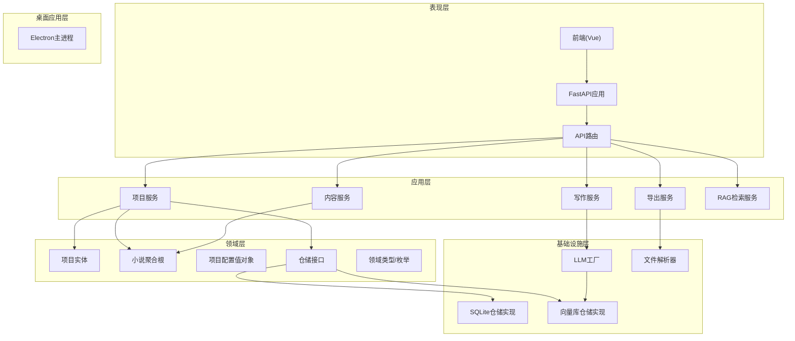
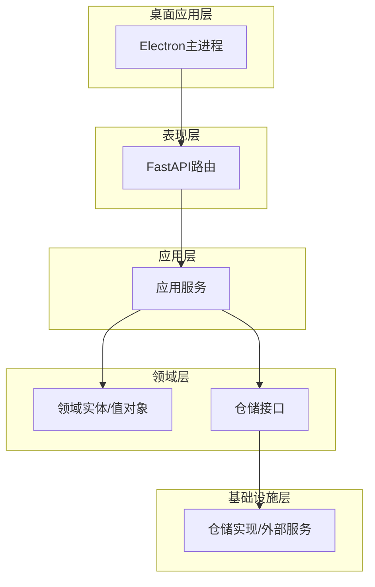
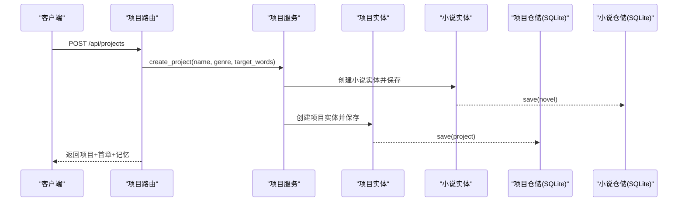
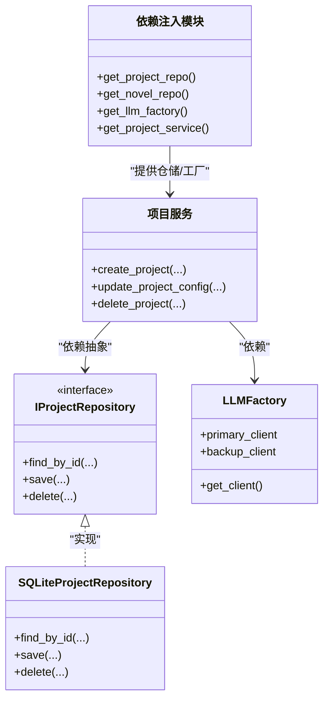
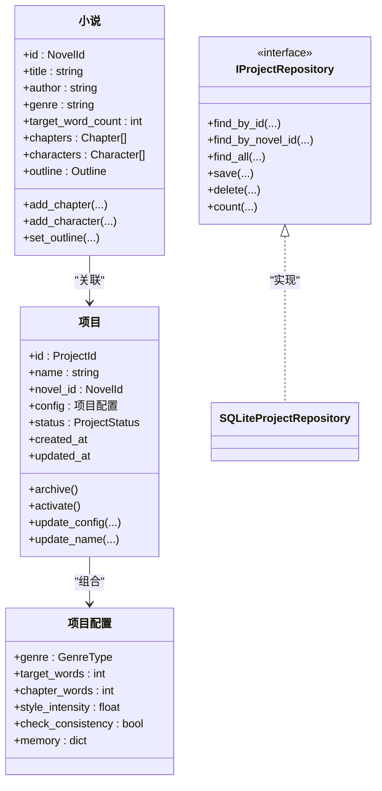
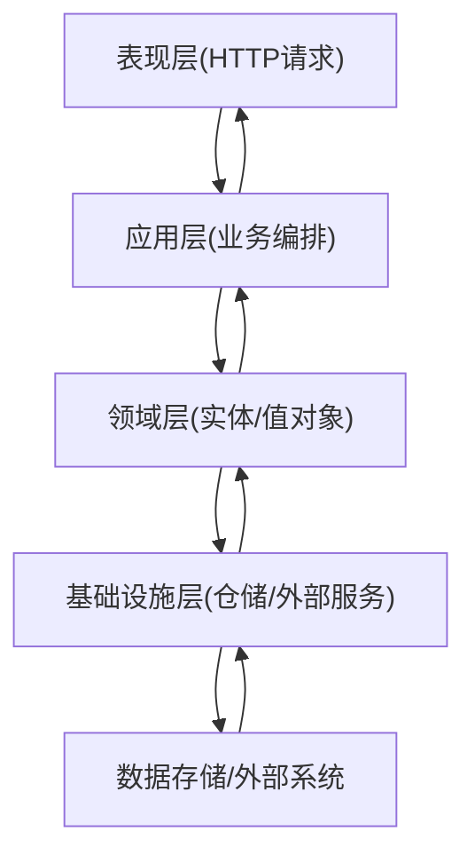
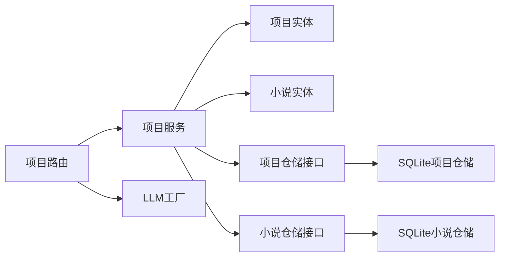

# 架构设计

<cite>
**本文引用的文件**
- [main.py](file://main.py)
- [presentation/api/app.py](file://presentation/api/app.py)
- [presentation/api/routers/project.py](file://presentation/api/routers/project.py)
- [presentation/api/dependencies.py](file://presentation/api/dependencies.py)
- [application/services/project_service.py](file://application/services/project_service.py)
- [domain/entities/project.py](file://domain/entities/project.py)
- [domain/entities/novel.py](file://domain/entities/novel.py)
- [domain/repositories/project_repository.py](file://domain/repositories/project_repository.py)
- [domain/tokens.py](file://domain/tokens.py)
- [domain/types.py](file://domain/types.py)
- [domain/value_objects/style_profile.py](file://domain/value_objects/style_profile.py)
- [infrastructure/persistence/sqlite_project_repo.py](file://infrastructure/persistence/sqlite_project_repo.py)
- [infrastructure/persistence/sqlite_novel_repo.py](file://infrastructure/persistence/sqlite_novel_repo.py)
- [infrastructure/llm/llm_factory.py](file://infrastructure/llm/llm_factory.py)
- [desktop/main.js](file://desktop/main.js)
- [application/dto/request_dto.py](file://application/dto/request_dto.py)
</cite>

## 目录
1. [引言](#引言)
2. [项目结构](#项目结构)
3. [核心组件](#核心组件)
4. [架构总览](#架构总览)
5. [详细组件分析](#详细组件分析)
6. [依赖分析](#依赖分析)
7. [性能考虑](#性能考虑)
8. [故障排查指南](#故障排查指南)
9. [结论](#结论)
10. [附录](#附录)

## 引言
本文件面向InkTrace项目的架构设计与实现，基于Clean Architecture分层架构进行系统化梳理。文档重点阐述五层架构（表现层、应用层、领域层、基础设施层、桌面应用层）的职责划分与相互关系；解释依赖注入模式的应用与实现；总结DDD在项目中的落地实践（实体、值对象、仓储接口）；给出系统边界、组件交互与数据流图；并讨论架构在可扩展性、可维护性、可测试性方面的设计取舍与演进建议。

## 项目结构
InkTrace采用典型的Clean Architecture布局，代码按层组织，各层之间通过抽象接口耦合，确保业务逻辑独立于外部技术细节。

- 表现层（Presentation Layer）
  - 提供HTTP API与桌面应用入口，负责请求接入、参数校验与响应封装。
  - 包含FastAPI应用与路由模块，以及Electron主进程入口。
- 应用层（Application Layer）
  - 聚合业务用例，编排领域实体与仓储，协调外部服务（如LLM）。
  - 包含各类服务类，如项目管理、内容管理、写作引擎等。
- 领域层（Domain Layer）
  - 定义核心实体、值对象、枚举与仓储接口，承载业务规则与不变量。
- 基础设施层（Infrastructure Layer）
  - 提供具体实现：持久化（SQLite/ChromaDB）、LLM客户端工厂、文件解析器等。
- 桌面应用层（Desktop Layer）
  - Electron主进程负责启动后端、管理窗口与托盘、IPC通信与进程生命周期。

图表来源
- [presentation/api/app.py:19-66](file://presentation/api/app.py#L19-L66)
- [presentation/api/routers/project.py:26-279](file://presentation/api/routers/project.py#L26-L279)
- [presentation/api/dependencies.py:112-178](file://presentation/api/dependencies.py#L112-L178)
- [application/services/project_service.py:21-203](file://application/services/project_service.py#L21-L203)
- [domain/entities/project.py:49-112](file://domain/entities/project.py#L49-L112)
- [domain/entities/novel.py:20-178](file://domain/entities/novel.py#L20-L178)
- [domain/repositories/project_repository.py:17-55](file://domain/repositories/project_repository.py#L17-L55)
- [infrastructure/persistence/sqlite_project_repo.py:20-125](file://infrastructure/persistence/sqlite_project_repo.py#L20-L125)
- [infrastructure/persistence/sqlite_novel_repo.py:20-126](file://infrastructure/persistence/sqlite_novel_repo.py#L20-L126)
- [infrastructure/llm/llm_factory.py:31-121](file://infrastructure/llm/llm_factory.py#L31-L121)
- [desktop/main.js:16-213](file://desktop/main.js#L16-L213)

章节来源
- [presentation/api/app.py:19-66](file://presentation/api/app.py#L19-L66)
- [presentation/api/routers/project.py:26-279](file://presentation/api/routers/project.py#L26-L279)
- [presentation/api/dependencies.py:112-178](file://presentation/api/dependencies.py#L112-L178)
- [application/services/project_service.py:21-203](file://application/services/project_service.py#L21-L203)
- [domain/entities/project.py:49-112](file://domain/entities/project.py#L49-L112)
- [domain/entities/novel.py:20-178](file://domain/entities/novel.py#L20-L178)
- [domain/repositories/project_repository.py:17-55](file://domain/repositories/project_repository.py#L17-L55)
- [infrastructure/persistence/sqlite_project_repo.py:20-125](file://infrastructure/persistence/sqlite_project_repo.py#L20-L125)
- [infrastructure/persistence/sqlite_novel_repo.py:20-126](file://infrastructure/persistence/sqlite_novel_repo.py#L20-L126)
- [infrastructure/llm/llm_factory.py:31-121](file://infrastructure/llm/llm_factory.py#L31-L121)
- [desktop/main.js:16-213](file://desktop/main.js#L16-L213)

## 核心组件
- 表现层
  - FastAPI应用与路由：集中注册路由、健康检查、跨域中间件。
  - 依赖注入：通过依赖函数提供仓储、服务与工具实例，支持缓存与环境变量配置。
- 应用层
  - 项目服务：封装项目生命周期管理、配置更新、与LLM协作生成首章。
  - 写作服务：结合LLM与领域实体，执行续写与内容生成。
  - 导出服务：基于文件导出器实现多种格式输出。
- 领域层
  - 实体与聚合根：项目、小说等承载业务不变量与行为。
  - 值对象：项目配置、风格特征等不可变数据载体。
  - 仓储接口：定义数据访问契约，隔离存储实现。
  - 领域类型：统一标识符类型与枚举，提升类型安全。
- 基础设施层
  - SQLite仓储：实现项目、小说等实体的持久化。
  - 向量库仓储：ChromaDB实现RAG索引与检索。
  - LLM工厂：统一管理主备模型客户端，支持自动切换。
- 桌面应用层
  - Electron主进程：启动后端、加载前端、托盘管理、IPC通信与进程生命周期控制。

章节来源
- [presentation/api/app.py:19-66](file://presentation/api/app.py#L19-L66)
- [presentation/api/dependencies.py:112-178](file://presentation/api/dependencies.py#L112-L178)
- [application/services/project_service.py:21-203](file://application/services/project_service.py#L21-L203)
- [domain/entities/project.py:49-112](file://domain/entities/project.py#L49-L112)
- [domain/entities/novel.py:20-178](file://domain/entities/novel.py#L20-L178)
- [domain/repositories/project_repository.py:17-55](file://domain/repositories/project_repository.py#L17-L55)
- [infrastructure/persistence/sqlite_project_repo.py:20-125](file://infrastructure/persistence/sqlite_project_repo.py#L20-L125)
- [infrastructure/persistence/sqlite_novel_repo.py:20-126](file://infrastructure/persistence/sqlite_novel_repo.py#L20-L126)
- [infrastructure/llm/llm_factory.py:31-121](file://infrastructure/llm/llm_factory.py#L31-L121)
- [desktop/main.js:16-213](file://desktop/main.js#L16-L213)

## 架构总览
Clean Architecture以“依赖倒置”为核心：上层调用下层抽象，下层实现上层抽象。InkTrace中：
- 表现层仅依赖应用层接口；
- 应用层仅依赖领域层接口（实体、值对象、仓储接口）；
- 基础设施层实现仓储接口与外部服务；
- 桌面应用层作为系统入口，协调后端与前端。

图表来源
- [presentation/api/routers/project.py:71-89](file://presentation/api/routers/project.py#L71-L89)
- [presentation/api/dependencies.py:112-178](file://presentation/api/dependencies.py#L112-L178)
- [application/services/project_service.py:21-31](file://application/services/project_service.py#L21-L31)
- [domain/repositories/project_repository.py:17-55](file://domain/repositories/project_repository.py#L17-L55)
- [infrastructure/persistence/sqlite_project_repo.py:20-25](file://infrastructure/persistence/sqlite_project_repo.py#L20-L25)
- [desktop/main.js:130-141](file://desktop/main.js#L130-L141)

## 详细组件分析

### 组件A：项目管理流程（API → 应用层 → 领域层 → 基础设施）
该流程展示Clean Architecture的典型调用链：表现层接收请求，应用层编排业务，领域层执行规则，基础设施层完成持久化与外部集成。

图表来源
- [presentation/api/routers/project.py:91-171](file://presentation/api/routers/project.py#L91-L171)
- [application/services/project_service.py:32-67](file://application/services/project_service.py#L32-L67)
- [domain/entities/project.py:49-112](file://domain/entities/project.py#L49-L112)
- [domain/entities/novel.py:20-178](file://domain/entities/novel.py#L20-L178)
- [infrastructure/persistence/sqlite_project_repo.py:81-98](file://infrastructure/persistence/sqlite_project_repo.py#L81-L98)
- [infrastructure/persistence/sqlite_novel_repo.py:54-73](file://infrastructure/persistence/sqlite_novel_repo.py#L54-L73)

章节来源
- [presentation/api/routers/project.py:91-171](file://presentation/api/routers/project.py#L91-L171)
- [application/services/project_service.py:32-67](file://application/services/project_service.py#L32-L67)
- [domain/entities/project.py:49-112](file://domain/entities/project.py#L49-L112)
- [domain/entities/novel.py:20-178](file://domain/entities/novel.py#L20-L178)
- [infrastructure/persistence/sqlite_project_repo.py:81-98](file://infrastructure/persistence/sqlite_project_repo.py#L81-L98)
- [infrastructure/persistence/sqlite_novel_repo.py:54-73](file://infrastructure/persistence/sqlite_novel_repo.py#L54-L73)

### 组件B：依赖注入与工厂模式
InkTrace通过依赖注入实现“上层只依赖抽象”，并通过工厂与缓存减少重复创建与环境耦合。

图表来源
- [presentation/api/dependencies.py:112-178](file://presentation/api/dependencies.py#L112-L178)
- [application/services/project_service.py:21-31](file://application/services/project_service.py#L21-L31)
- [domain/repositories/project_repository.py:17-55](file://domain/repositories/project_repository.py#L17-L55)
- [infrastructure/persistence/sqlite_project_repo.py:20-25](file://infrastructure/persistence/sqlite_project_repo.py#L20-L25)
- [infrastructure/llm/llm_factory.py:31-121](file://infrastructure/llm/llm_factory.py#L31-L121)

章节来源
- [presentation/api/dependencies.py:112-178](file://presentation/api/dependencies.py#L112-L178)
- [application/services/project_service.py:21-31](file://application/services/project_service.py#L21-L31)
- [domain/repositories/project_repository.py:17-55](file://domain/repositories/project_repository.py#L17-L55)
- [infrastructure/persistence/sqlite_project_repo.py:20-25](file://infrastructure/persistence/sqlite_project_repo.py#L20-L25)
- [infrastructure/llm/llm_factory.py:31-121](file://infrastructure/llm/llm_factory.py#L31-L121)

### 组件C：领域建模（实体、值对象、仓储接口）
- 实体与聚合根：项目、小说承载业务不变量与行为；小说聚合根管理章节、人物、大纲等子实体。
- 值对象：项目配置、风格特征等不可变数据载体，保证一致性与可测试性。
- 仓储接口：定义数据访问契约，隔离存储实现，便于替换与测试。

图表来源
- [domain/entities/project.py:49-112](file://domain/entities/project.py#L49-L112)
- [domain/entities/novel.py:20-178](file://domain/entities/novel.py#L20-L178)
- [domain/repositories/project_repository.py:17-55](file://domain/repositories/project_repository.py#L17-L55)
- [infrastructure/persistence/sqlite_project_repo.py:20-125](file://infrastructure/persistence/sqlite_project_repo.py#L20-L125)

章节来源
- [domain/entities/project.py:49-112](file://domain/entities/project.py#L49-L112)
- [domain/entities/novel.py:20-178](file://domain/entities/novel.py#L20-L178)
- [domain/repositories/project_repository.py:17-55](file://domain/repositories/project_repository.py#L17-L55)
- [infrastructure/persistence/sqlite_project_repo.py:20-125](file://infrastructure/persistence/sqlite_project_repo.py#L20-L125)

### 组件D：数据流与系统边界
- 系统边界：表现层暴露REST API；应用层编排业务；领域层承载规则；基础设施层提供实现；桌面应用层负责系统级交互。
- 数据流：请求自上而下进入应用层，应用层驱动领域实体与仓储，基础设施层完成持久化与外部集成，响应自下而上返回。

图表来源
- [presentation/api/routers/project.py:91-171](file://presentation/api/routers/project.py#L91-L171)
- [application/services/project_service.py:32-67](file://application/services/project_service.py#L32-L67)
- [domain/entities/project.py:49-112](file://domain/entities/project.py#L49-L112)
- [infrastructure/persistence/sqlite_project_repo.py:81-98](file://infrastructure/persistence/sqlite_project_repo.py#L81-L98)

章节来源
- [presentation/api/routers/project.py:91-171](file://presentation/api/routers/project.py#L91-L171)
- [application/services/project_service.py:32-67](file://application/services/project_service.py#L32-L67)
- [domain/entities/project.py:49-112](file://domain/entities/project.py#L49-L112)
- [infrastructure/persistence/sqlite_project_repo.py:81-98](file://infrastructure/persistence/sqlite_project_repo.py#L81-L98)

## 依赖分析
- 层间依赖方向
  - 表现层 → 应用层：通过依赖函数注入服务实例。
  - 应用层 → 领域层：依赖实体、值对象与仓储接口。
  - 基础设施层 → 领域层：实现仓储接口与外部服务。
- 关键依赖点
  - 项目路由依赖应用服务与LLM工厂。
  - 应用服务依赖仓储接口，避免对具体实现的耦合。
  - 依赖注入模块集中管理实例创建与缓存。

图表来源
- [presentation/api/routers/project.py:71-89](file://presentation/api/routers/project.py#L71-L89)
- [presentation/api/dependencies.py:122-124](file://presentation/api/dependencies.py#L122-L124)
- [application/services/project_service.py:21-31](file://application/services/project_service.py#L21-L31)
- [domain/repositories/project_repository.py:17-55](file://domain/repositories/project_repository.py#L17-L55)
- [infrastructure/persistence/sqlite_project_repo.py:20-25](file://infrastructure/persistence/sqlite_project_repo.py#L20-L25)
- [infrastructure/llm/llm_factory.py:31-121](file://infrastructure/llm/llm_factory.py#L31-L121)

章节来源
- [presentation/api/routers/project.py:71-89](file://presentation/api/routers/project.py#L71-L89)
- [presentation/api/dependencies.py:122-124](file://presentation/api/dependencies.py#L122-L124)
- [application/services/project_service.py:21-31](file://application/services/project_service.py#L21-L31)
- [domain/repositories/project_repository.py:17-55](file://domain/repositories/project_repository.py#L17-L55)
- [infrastructure/persistence/sqlite_project_repo.py:20-25](file://infrastructure/persistence/sqlite_project_repo.py#L20-L25)
- [infrastructure/llm/llm_factory.py:31-121](file://infrastructure/llm/llm_factory.py#L31-L121)

## 性能考虑
- 缓存与延迟初始化
  - 依赖注入模块使用缓存机制减少重复创建，降低启动与运行时开销。
- I/O优化
  - SQLite批量写入与事务提交，尽量合并操作以减少磁盘I/O。
- 外部服务降级
  - LLM工厂支持主备模型切换，提高可用性与稳定性。
- 前后端分离
  - 桌面应用层通过IPC与后端解耦，便于独立扩展与部署。

## 故障排查指南
- 启动失败
  - 检查后端进程是否成功启动与端口占用情况。
  - 确认前端静态资源路径与打包状态。
- API异常
  - 查看路由层参数校验与异常处理，定位业务异常或数据不一致。
- 数据持久化问题
  - 核对仓储实现与数据库初始化逻辑，确认表结构与字段映射。
- LLM调用失败
  - 检查API密钥、基础URL与模型配置，验证主备切换逻辑。

章节来源
- [desktop/main.js:130-141](file://desktop/main.js#L130-L141)
- [presentation/api/routers/project.py:91-171](file://presentation/api/routers/project.py#L91-L171)
- [infrastructure/persistence/sqlite_project_repo.py:27-43](file://infrastructure/persistence/sqlite_project_repo.py#L27-L43)
- [infrastructure/llm/llm_factory.py:78-121](file://infrastructure/llm/llm_factory.py#L78-L121)

## 结论
InkTrace遵循Clean Architecture分层思想，通过依赖注入与仓储接口实现“上层依赖抽象、下层实现抽象”的设计原则。DDD在项目中得到良好实践：实体与值对象承载业务不变量，仓储接口隔离实现细节。该架构在可扩展性、可维护性与可测试性方面具备良好基础，适合持续演进与功能扩展。

## 附录
- 架构演进与未来规划
  - 当前阶段：完成Clean Architecture分层与DDD建模，实现项目管理与写作流程。
  - 近期目标：完善RAG检索、向量索引与导出能力，增强测试覆盖率。
  - 中长期规划：引入事件驱动与CQRS，支持多用户与分布式部署；探索插件化与模块化扩展。