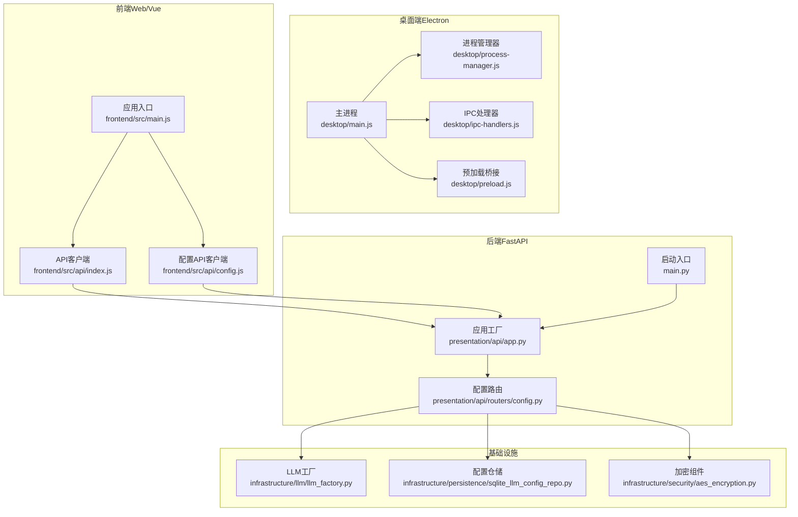
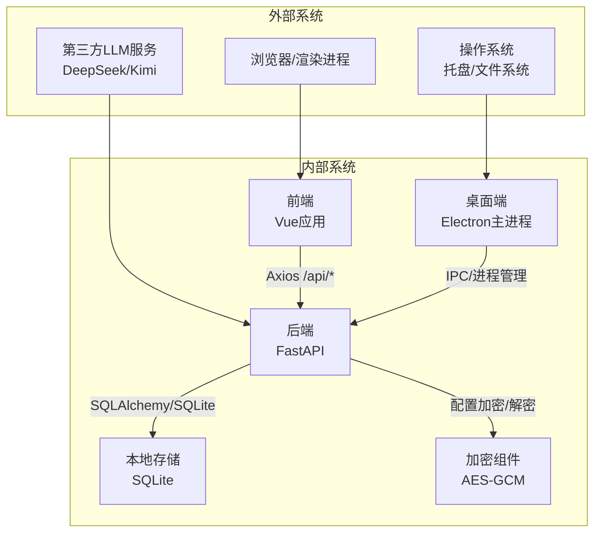
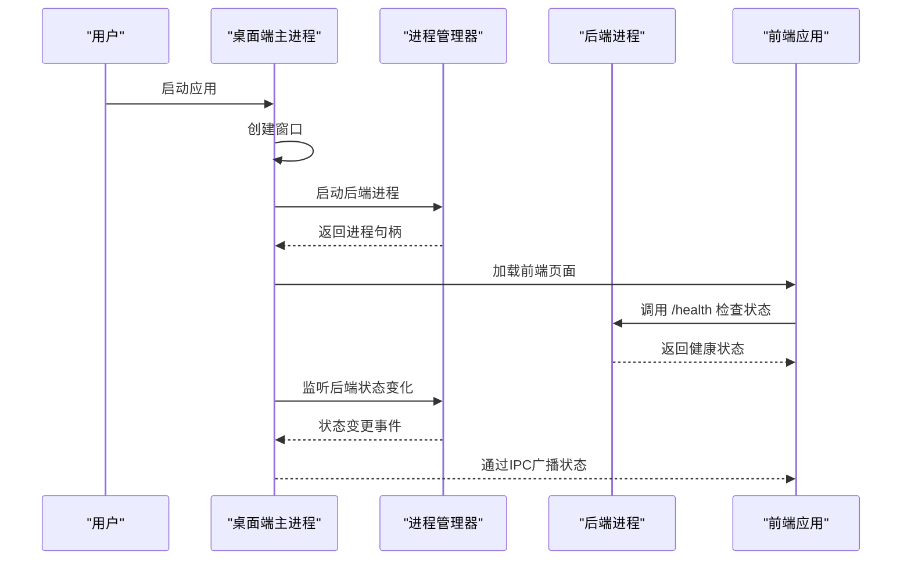
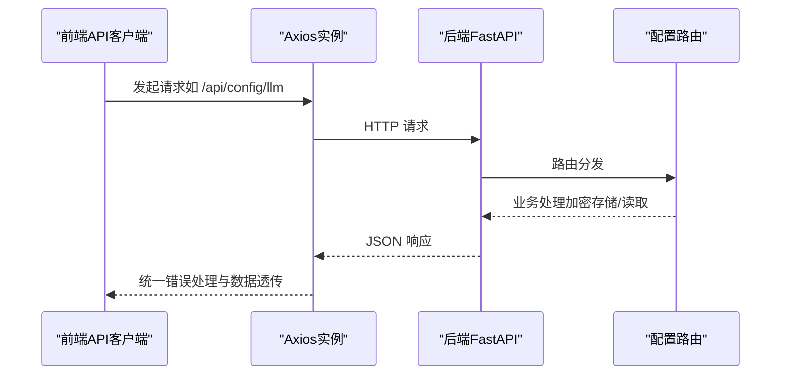
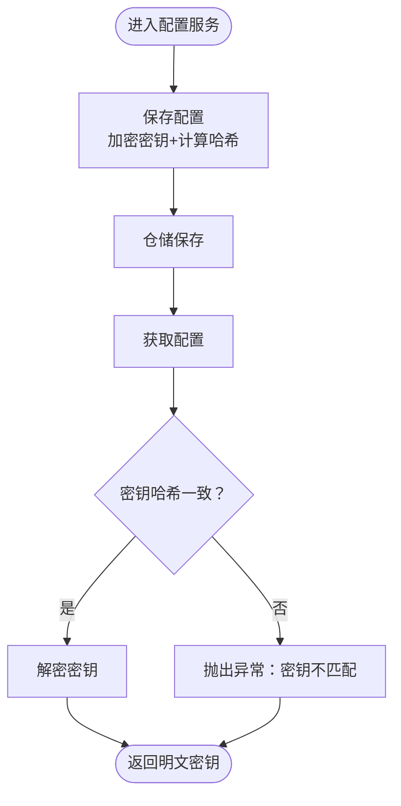
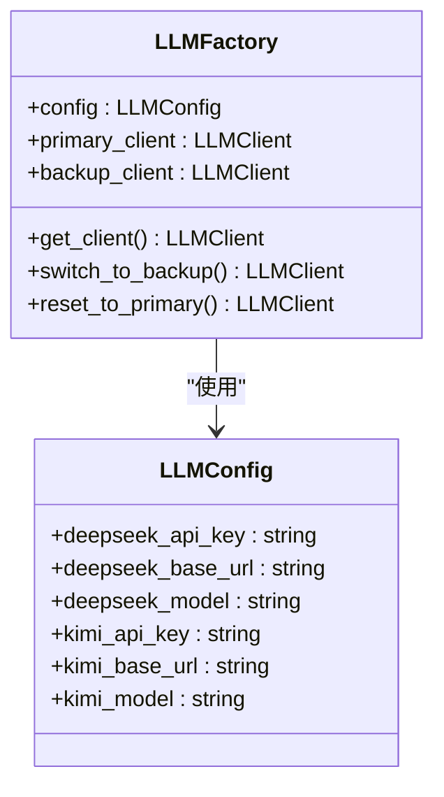
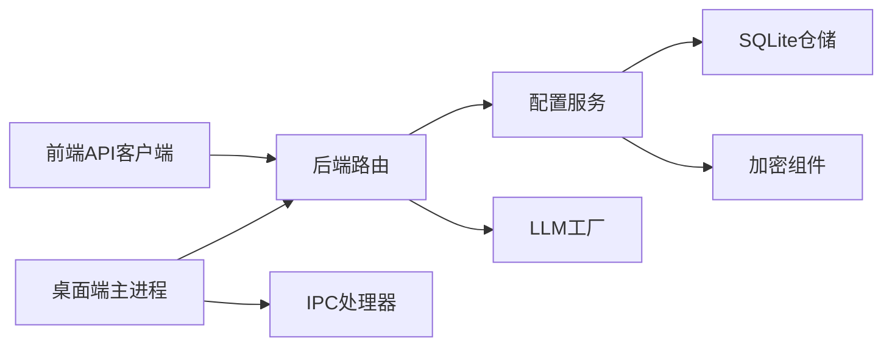

# 系统边界与集成

<cite>
**本文引用的文件**
- [main.py](file://main.py)
- [presentation/api/app.py](file://presentation/api/app.py)
- [desktop/main.js](file://desktop/main.js)
- [desktop/ipc-handlers.js](file://desktop/ipc-handlers.js)
- [desktop/preload.js](file://desktop/preload.js)
- [frontend/src/main.js](file://frontend/src/main.js)
- [frontend/src/api/index.js](file://frontend/src/api/index.js)
- [frontend/src/api/config.js](file://frontend/src/api/config.js)
- [config.py](file://config.py)
- [infrastructure/llm/llm_factory.py](file://infrastructure/llm/llm_factory.py)
- [infrastructure/persistence/sqlite_llm_config_repo.py](file://infrastructure/persistence/sqlite_llm_config_repo.py)
- [application/services/config_service.py](file://application/services/config_service.py)
- [domain/entities/llm_config.py](file://domain/entities/llm_config.py)
- [presentation/api/routers/config.py](file://presentation/api/routers/config.py)
- [infrastructure/security/aes_encryption.py](file://infrastructure/security/aes_encryption.py)
</cite>

## 目录
1. [引言](#引言)
2. [项目结构](#项目结构)
3. [核心组件](#核心组件)
4. [架构总览](#架构总览)
5. [详细组件分析](#详细组件分析)
6. [依赖分析](#依赖分析)
7. [性能考量](#性能考量)
8. [故障排查指南](#故障排查指南)
9. [结论](#结论)
10. [附录](#附录)

## 引言
本文件聚焦 InkTrace 项目的“系统边界与集成”，旨在：
- 明确系统边界定义原则与方法，划分内部系统与外部系统
- 设计 API 边界、数据库边界、文件系统边界
- 说明桌面应用（Electron）与 Web 应用的集成模式
- 提供系统架构图与集成关系图
- 给出具体集成示例与配置方法
- 解释第三方服务集成与 API 版本兼容性策略
- 说明安全边界与访问控制策略
- 为开发者提供系统集成的设计指导与最佳实践

## 项目结构
InkTrace 采用多层架构与前后端分离设计：
- 后端：基于 Python 的 FastAPI 应用，提供 REST API
- 桌面端：Electron 主进程负责窗口与系统交互，通过本地进程管理器启动后端
- 前端：Vue + Vite 构建的 Web 应用，通过 Axios 调用后端 API；在 Electron 环境下自动切换到本地后端地址
- 基础设施：LLM 客户端工厂、SQLite 仓储、加密组件等
- 领域模型：LLM 配置实体与相关服务

图表来源
- [desktop/main.js:1-213](file://desktop/main.js#L1-L213)
- [presentation/api/app.py:1-66](file://presentation/api/app.py#L1-L66)
- [frontend/src/main.js:1-23](file://frontend/src/main.js#L1-L23)
- [frontend/src/api/index.js:1-119](file://frontend/src/api/index.js#L1-L119)
- [frontend/src/api/config.js:1-192](file://frontend/src/api/config.js#L1-L192)
- [presentation/api/routers/config.py:1-173](file://presentation/api/routers/config.py#L1-L173)
- [infrastructure/llm/llm_factory.py:1-121](file://infrastructure/llm/llm_factory.py#L1-L121)
- [infrastructure/persistence/sqlite_llm_config_repo.py:1-145](file://infrastructure/persistence/sqlite_llm_config_repo.py#L1-L145)
- [infrastructure/security/aes_encryption.py:1-106](file://infrastructure/security/aes_encryption.py#L1-L106)
- [main.py:1-22](file://main.py#L1-L22)

章节来源
- [desktop/main.js:1-213](file://desktop/main.js#L1-L213)
- [presentation/api/app.py:1-66](file://presentation/api/app.py#L1-L66)
- [frontend/src/main.js:1-23](file://frontend/src/main.js#L1-L23)
- [frontend/src/api/index.js:1-119](file://frontend/src/api/index.js#L1-L119)
- [frontend/src/api/config.js:1-192](file://frontend/src/api/config.js#L1-L192)
- [presentation/api/routers/config.py:1-173](file://presentation/api/routers/config.py#L1-L173)
- [infrastructure/llm/llm_factory.py:1-121](file://infrastructure/llm/llm_factory.py#L1-L121)
- [infrastructure/persistence/sqlite_llm_config_repo.py:1-145](file://infrastructure/persistence/sqlite_llm_config_repo.py#L1-L145)
- [infrastructure/security/aes_encryption.py:1-106](file://infrastructure/security/aes_encryption.py#L1-L106)
- [main.py:1-22](file://main.py#L1-L22)

## 核心组件
- 桌面端主进程：负责窗口生命周期、加载前端、启动后端进程、系统托盘与 IPC 通信
- 进程管理器：统一管理后端进程的启动、重启与状态上报
- IPC 处理器：暴露后端状态查询、重启、打开外部链接、文件定位等能力
- 预加载桥接：在隔离上下文中向渲染进程暴露受控 API
- 后端应用：FastAPI 应用，注册路由、中间件与健康检查端点
- 配置管理 API：提供 LLM 配置的增删改查、测试与存在性检查
- 配置服务：封装加密存储、解密验证、配置校验与连接测试
- SQLite 仓储：持久化 LLM 配置，支持历史版本记录
- LLM 工厂：管理主备模型客户端，支持可用性检测与切换
- 加密组件：基于 AES-GCM 的密钥派生与加解密
- 前端 API 客户端：Axios 封装，自动识别 Electron/浏览器环境并设置 base-url

章节来源
- [desktop/main.js:1-213](file://desktop/main.js#L1-L213)
- [desktop/ipc-handlers.js:1-50](file://desktop/ipc-handlers.js#L1-L50)
- [desktop/preload.js:1-25](file://desktop/preload.js#L1-L25)
- [presentation/api/app.py:1-66](file://presentation/api/app.py#L1-L66)
- [presentation/api/routers/config.py:1-173](file://presentation/api/routers/config.py#L1-L173)
- [application/services/config_service.py:1-151](file://application/services/config_service.py#L1-L151)
- [infrastructure/persistence/sqlite_llm_config_repo.py:1-145](file://infrastructure/persistence/sqlite_llm_config_repo.py#L1-L145)
- [infrastructure/llm/llm_factory.py:1-121](file://infrastructure/llm/llm_factory.py#L1-L121)
- [infrastructure/security/aes_encryption.py:1-106](file://infrastructure/security/aes_encryption.py#L1-L106)
- [frontend/src/api/index.js:1-119](file://frontend/src/api/index.js#L1-L119)
- [frontend/src/api/config.js:1-192](file://frontend/src/api/config.js#L1-L192)

## 架构总览
InkTrace 的系统边界与集成遵循“桌面端 + 后端 + 前端”的三层协作模式：
- 内部系统：桌面端主进程、后端 FastAPI、领域与应用服务、基础设施组件
- 外部系统：浏览器/渲染进程、操作系统（托盘、文件系统）、第三方 LLM 服务（DeepSeek、Kimi）
- 边界类型：
  - API 边界：前端通过 Axios 调用后端 /api/* 路由
  - 数据库边界：后端通过 SQLite 仓储访问本地数据库
  - 文件系统边界：后端导出文件写入本地路径，前端通过 IPC 打开文件所在位置
  - 进程边界：桌面端通过进程管理器启动/重启后端本地进程
  - 安全边界：配置加密存储，密钥哈希校验，最小权限访问

图表来源
- [desktop/main.js:1-213](file://desktop/main.js#L1-L213)
- [presentation/api/app.py:1-66](file://presentation/api/app.py#L1-L66)
- [frontend/src/api/index.js:1-119](file://frontend/src/api/index.js#L1-L119)
- [infrastructure/security/aes_encryption.py:1-106](file://infrastructure/security/aes_encryption.py#L1-L106)
- [infrastructure/persistence/sqlite_llm_config_repo.py:1-145](file://infrastructure/persistence/sqlite_llm_config_repo.py#L1-L145)

## 详细组件分析

### 桌面端与后端集成
- 启动流程：桌面端主进程先创建窗口，再启动后端进程；后端监听本地端口并通过健康检查端点对外暴露状态
- 进程管理：统一启动/重启后端，上报状态并通过 IPC 广播给所有窗口
- IPC 能力：查询后端状态、重启后端、打开外部链接、在文件夹中显示项目文件
- 预加载桥接：在隔离上下文中暴露受控 API，避免直接注入全局对象

图表来源
- [desktop/main.js:130-180](file://desktop/main.js#L130-L180)
- [desktop/ipc-handlers.js:9-47](file://desktop/ipc-handlers.js#L9-L47)
- [presentation/api/app.py:54-61](file://presentation/api/app.py#L54-L61)

章节来源
- [desktop/main.js:1-213](file://desktop/main.js#L1-L213)
- [desktop/ipc-handlers.js:1-50](file://desktop/ipc-handlers.js#L1-L50)
- [desktop/preload.js:1-25](file://desktop/preload.js#L1-L25)
- [presentation/api/app.py:1-66](file://presentation/api/app.py#L1-L66)

### 前端与后端 API 集成
- 自动适配：前端根据运行环境（Electron/浏览器/file 协议）自动选择 base-url
- 统一拦截：Axios 拦截器统一处理响应错误并提示用户
- 功能覆盖：小说、内容、写作、导出、项目、模板、角色、世界观、向量索引、RAG、配置管理等路由

图表来源
- [frontend/src/api/index.js:1-119](file://frontend/src/api/index.js#L1-L119)
- [presentation/api/routers/config.py:1-173](file://presentation/api/routers/config.py#L1-L173)

章节来源
- [frontend/src/api/index.js:1-119](file://frontend/src/api/index.js#L1-L119)
- [frontend/src/api/config.js:1-192](file://frontend/src/api/config.js#L1-L192)
- [presentation/api/routers/config.py:1-173](file://presentation/api/routers/config.py#L1-L173)

### 配置管理与安全边界
- 配置实体：包含 DeepSeek/Kimi API 密钥、加密密钥哈希与时间戳
- 仓储：SQLite 表 llm_config，支持插入/更新/查询/删除/历史查询
- 服务：保存时加密密钥，读取时校验密钥哈希，提供连接测试与格式校验
- 加密：AES-GCM，PBKDF2 派生密钥，Base64 编码传输
- 安全策略：密钥哈希一致性校验，防止密钥迁移导致的解密失败；最小权限访问，仅在内存中进行解密

图表来源
- [application/services/config_service.py:19-88](file://application/services/config_service.py#L19-L88)
- [infrastructure/persistence/sqlite_llm_config_repo.py:18-110](file://infrastructure/persistence/sqlite_llm_config_repo.py#L18-L110)
- [domain/entities/llm_config.py:15-54](file://domain/entities/llm_config.py#L15-L54)
- [infrastructure/security/aes_encryption.py:19-106](file://infrastructure/security/aes_encryption.py#L19-L106)

章节来源
- [application/services/config_service.py:1-151](file://application/services/config_service.py#L1-L151)
- [infrastructure/persistence/sqlite_llm_config_repo.py:1-145](file://infrastructure/persistence/sqlite_llm_config_repo.py#L1-L145)
- [domain/entities/llm_config.py:1-54](file://domain/entities/llm_config.py#L1-L54)
- [infrastructure/security/aes_encryption.py:1-106](file://infrastructure/security/aes_encryption.py#L1-L106)

### 第三方服务集成与版本兼容
- LLM 工厂：封装主备客户端（DeepSeek/Kimi），支持可用性检测与自动切换
- 配置测试：提供连接测试接口，便于在不同版本/域名下验证可用性
- 版本兼容：通过配置项（base_url/model）隔离上游变更影响，路由层保持稳定

图表来源
- [infrastructure/llm/llm_factory.py:19-121](file://infrastructure/llm/llm_factory.py#L19-L121)

章节来源
- [infrastructure/llm/llm_factory.py:1-121](file://infrastructure/llm/llm_factory.py#L1-L121)
- [presentation/api/routers/config.py:120-148](file://presentation/api/routers/config.py#L120-L148)

## 依赖分析
- 桌面端对后端的依赖：进程管理、状态上报、IPC 通信
- 前端对后端的依赖：Axios 客户端、路由约定、错误码映射
- 后端对基础设施的依赖：仓储、加密、LLM 客户端工厂
- 领域模型对应用服务的依赖：配置实体与服务组合

图表来源
- [frontend/src/api/index.js:1-119](file://frontend/src/api/index.js#L1-L119)
- [presentation/api/routers/config.py:1-173](file://presentation/api/routers/config.py#L1-L173)
- [application/services/config_service.py:1-151](file://application/services/config_service.py#L1-L151)
- [infrastructure/persistence/sqlite_llm_config_repo.py:1-145](file://infrastructure/persistence/sqlite_llm_config_repo.py#L1-L145)
- [infrastructure/security/aes_encryption.py:1-106](file://infrastructure/security/aes_encryption.py#L1-L106)
- [infrastructure/llm/llm_factory.py:1-121](file://infrastructure/llm/llm_factory.py#L1-L121)
- [desktop/main.js:1-213](file://desktop/main.js#L1-L213)
- [desktop/ipc-handlers.js:1-50](file://desktop/ipc-handlers.js#L1-L50)

章节来源
- [frontend/src/api/index.js:1-119](file://frontend/src/api/index.js#L1-L119)
- [presentation/api/routers/config.py:1-173](file://presentation/api/routers/config.py#L1-L173)
- [application/services/config_service.py:1-151](file://application/services/config_service.py#L1-L151)
- [infrastructure/persistence/sqlite_llm_config_repo.py:1-145](file://infrastructure/persistence/sqlite_llm_config_repo.py#L1-L145)
- [infrastructure/security/aes_encryption.py:1-106](file://infrastructure/security/aes_encryption.py#L1-L106)
- [infrastructure/llm/llm_factory.py:1-121](file://infrastructure/llm/llm_factory.py#L1-L121)
- [desktop/main.js:1-213](file://desktop/main.js#L1-L213)
- [desktop/ipc-handlers.js:1-50](file://desktop/ipc-handlers.js#L1-L50)

## 性能考量
- 启动顺序优化：桌面端先创建窗口，再启动后端，减少用户等待时间
- 连接池与超时：前端 Axios 设置合理超时，避免长时间阻塞
- 数据库事务：仓储操作使用事务提交，保证一致性
- 加密成本：AES-GCM 在内存中完成，建议在批量操作时合并调用以降低开销
- LLM 客户端缓存：工厂按需创建客户端，避免重复初始化

## 故障排查指南
- 后端未启动：检查桌面端日志与健康检查端点；确认端口占用与进程状态
- 前端加载失败：开发模式检查本地前端服务，生产模式检查打包资源路径
- 配置解密失败：确认加密密钥哈希一致；检查密钥长度与格式
- API 调用错误：查看响应拦截器输出，结合后端日志定位问题
- 文件导出/打开失败：确认导出路径存在与权限；通过 IPC 在文件夹中定位文件

章节来源
- [desktop/main.js:76-128](file://desktop/main.js#L76-L128)
- [application/services/config_service.py:64-78](file://application/services/config_service.py#L64-L78)
- [frontend/src/api/index.js:28-41](file://frontend/src/api/index.js#L28-L41)

## 结论
InkTrace 通过明确的系统边界与清晰的集成层次，实现了桌面端、后端与前端的高效协同。系统在安全边界（加密存储与密钥校验）、API 边界（统一路由与错误处理）、数据库边界（本地 SQLite）与文件系统边界（导出与定位）上均提供了稳健的设计与实现。第三方服务集成通过工厂模式与配置测试保障了版本兼容与可用性。

## 附录

### 系统边界定义与划分
- 内部系统：桌面端主进程、后端 FastAPI、应用/领域服务、基础设施组件
- 外部系统：浏览器/渲染进程、操作系统（托盘/文件系统）、第三方 LLM 服务
- 边界类型：
  - API 边界：/api/* 路由，统一协议与错误码
  - 数据库边界：SQLite 本地文件，事务与行级工厂
  - 文件系统边界：导出目录与 IPC 打开文件夹
  - 进程边界：桌面端进程管理器
  - 安全边界：加密存储与密钥哈希校验

### 集成示例与配置方法
- 启动后端：桌面端主进程根据开发/生产模式加载前端与后端，后端通过 uvicorn 监听本地端口
- 配置管理：前端通过配置 API 客户端调用 /api/config/llm，后端路由解析请求并交由服务层处理
- 导出与打开：后端导出文件至本地路径，前端通过 IPC 在文件夹中显示文件

章节来源
- [main.py:15-21](file://main.py#L15-L21)
- [desktop/main.js:130-141](file://desktop/main.js#L130-L141)
- [presentation/api/routers/config.py:67-124](file://presentation/api/routers/config.py#L67-L124)
- [frontend/src/api/config.js:67-124](file://frontend/src/api/config.js#L67-L124)

### 第三方服务集成与 API 版本兼容
- 通过 LLM 工厂的配置项（base_url/model）隔离上游变更
- 提供连接测试接口，便于在不同版本/域名下验证可用性
- 路由层保持稳定，业务层通过工厂动态切换

章节来源
- [infrastructure/llm/llm_factory.py:19-121](file://infrastructure/llm/llm_factory.py#L19-L121)
- [presentation/api/routers/config.py:126-148](file://presentation/api/routers/config.py#L126-L148)

### 安全边界与访问控制策略
- 配置加密：AES-GCM，PBKDF2 派生密钥，Base64 编码
- 密钥哈希校验：保存与读取时校验加密密钥一致性
- 最小权限：仅在内存中解密，避免落盘
- CORS：开发阶段允许跨域，生产部署建议限制来源

章节来源
- [infrastructure/security/aes_encryption.py:19-106](file://infrastructure/security/aes_encryption.py#L19-L106)
- [application/services/config_service.py:49-78](file://application/services/config_service.py#L49-L78)
- [presentation/api/app.py:27-33](file://presentation/api/app.py#L27-L33)