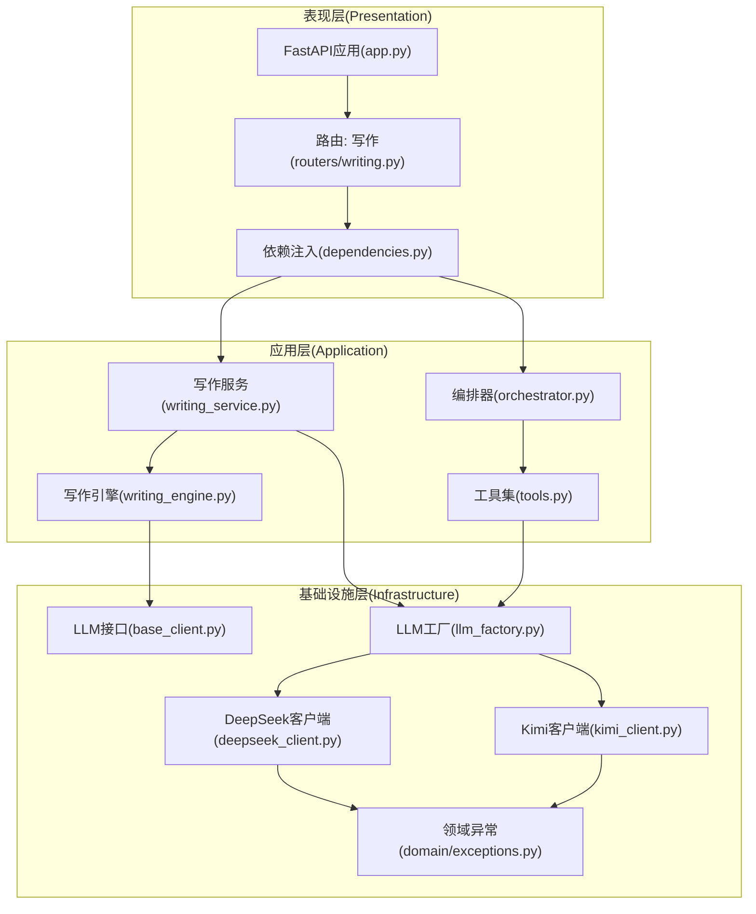
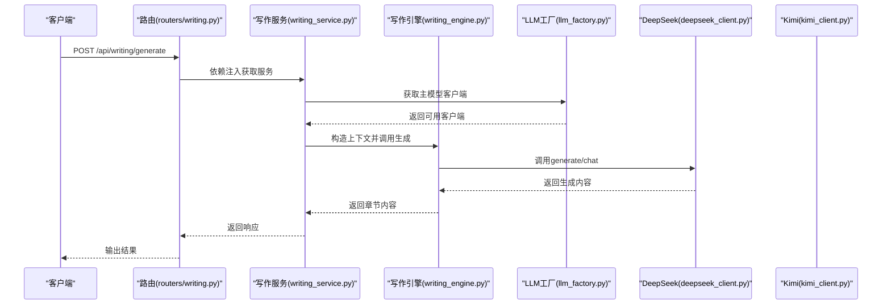
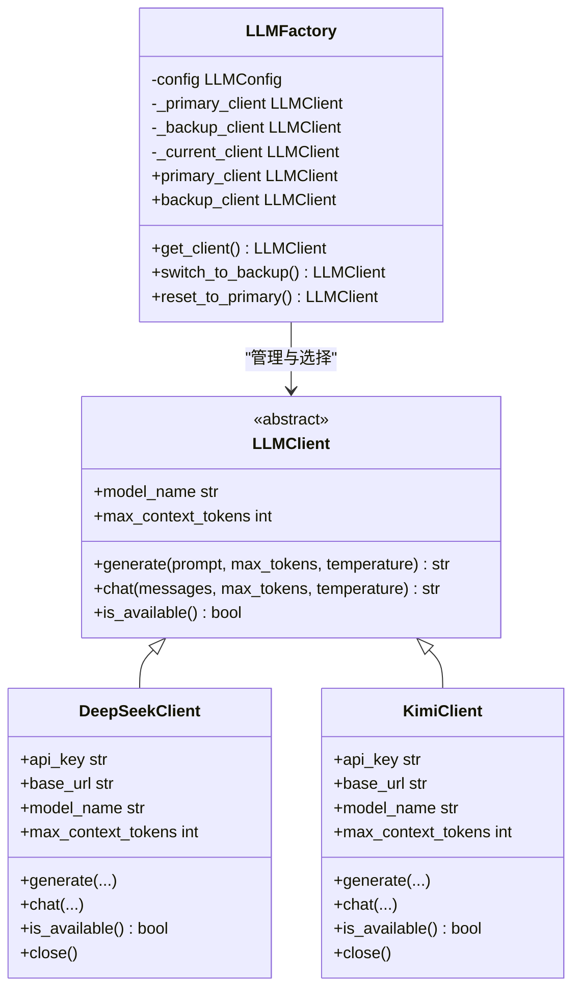
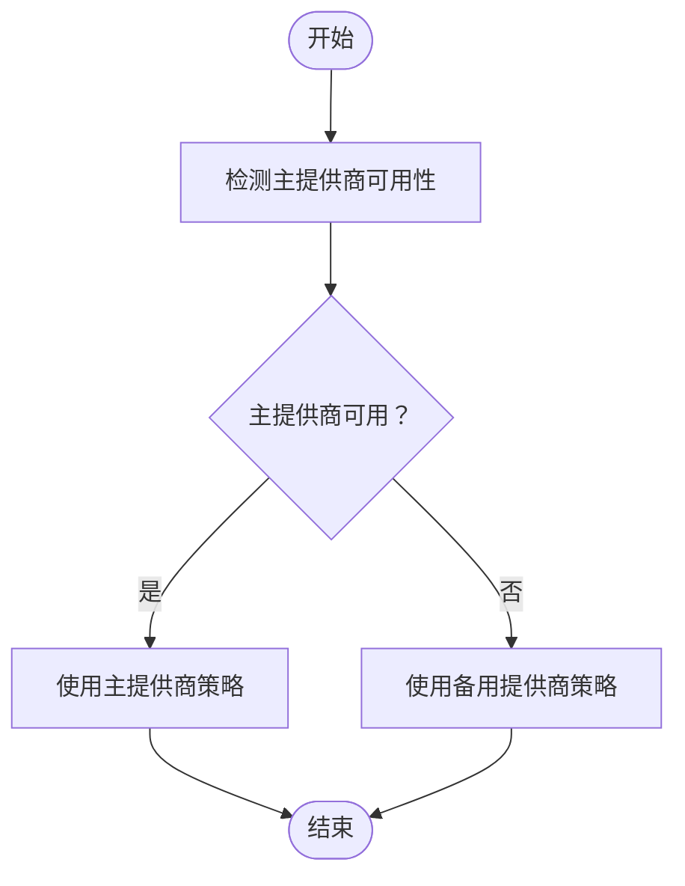
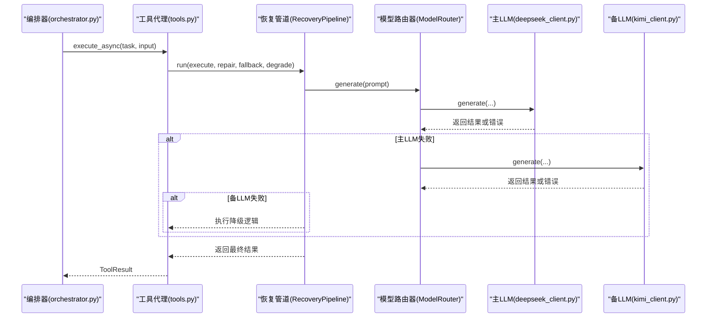
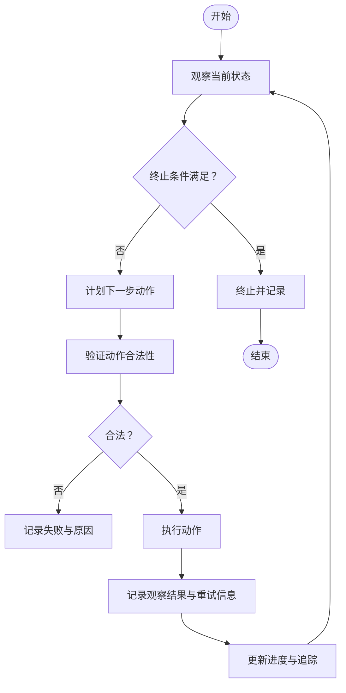
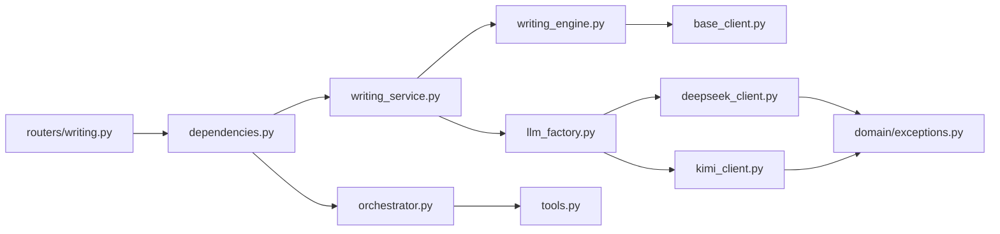

# 设计模式应用

<cite>
**本文引用的文件**
- [llm_factory.py](file://infrastructure/llm/llm_factory.py)
- [base_client.py](file://infrastructure/llm/base_client.py)
- [deepseek_client.py](file://infrastructure/llm/deepseek_client.py)
- [kimi_client.py](file://infrastructure/llm/kimi_client.py)
- [writing_service.py](file://application/services/writing_service.py)
- [writing_engine.py](file://domain/services/writing_engine.py)
- [app.py](file://presentation/api/app.py)
- [routers/writing.py](file://presentation/api/routers/writing.py)
- [dependencies.py](file://presentation/api/dependencies.py)
- [tools.py](file://application/agent_mvp/tools.py)
- [orchestrator.py](file://application/agent_mvp/orchestrator.py)
- [exceptions.py](file://domain/exceptions.py)
- [llm/__init__.py](file://infrastructure/llm/__init__.py)
- [test_llm_client.py](file://tests/unit/test_llm_client.py)
- [test_llm_client_improved.py](file://tests/unit/test_llm_client_improved.py)
</cite>

## 目录
1. [简介](#简介)
2. [项目结构](#项目结构)
3. [核心组件](#核心组件)
4. [架构总览](#架构总览)
5. [详细组件分析](#详细组件分析)
6. [依赖分析](#依赖分析)
7. [性能考量](#性能考量)
8. [故障排查指南](#故障排查指南)
9. [结论](#结论)
10. [附录](#附录)

## 简介
本文件聚焦于InkTrace项目中设计模式的应用与落地，重点覆盖以下模式：
- 工厂模式（Factory Pattern）：用于统一管理与动态选择LLM客户端，实现主备切换与按需懒加载。
- 策略模式（Strategy Pattern）：通过抽象接口与具体实现，支持多LLM提供商的可插拔替换与运行时策略切换。
- 代理模式（Proxy Pattern）：在服务编排中以工具代理封装LLM调用，提供降级、重试与幂等保障。
- 观察者模式（Observer Pattern）：在Agent编排流程中以追踪记录与步骤推进体现“观察—反馈—决策”的行为。

同时，文档给出每种模式的适用场景、收益与潜在问题，并提供模式选择的决策依据与最佳实践，帮助开发者在实际开发中正确应用这些设计思想。

## 项目结构
InkTrace采用分层架构，核心与LLM交互位于基础设施层（infrastructure），业务逻辑位于应用层（application），对外接口位于表现层（presentation）。与设计模式相关的关键模块包括：
- 基础设施层LLM子系统：抽象接口、具体实现、工厂与依赖注入。
- 应用层服务：面向业务的服务编排与工作流协调。
- 表现层API：路由与依赖注入，将服务暴露为REST接口。

图表来源
- [app.py:19-66](file://presentation/api/app.py#L19-L66)
- [routers/writing.py:37-52](file://presentation/api/routers/writing.py#L37-L52)
- [dependencies.py:103-141](file://presentation/api/dependencies.py#L103-L141)
- [writing_service.py:30-46](file://application/services/writing_service.py#L30-L46)
- [writing_engine.py:30-50](file://domain/services/writing_engine.py#L30-L50)
- [llm_factory.py:31-95](file://infrastructure/llm/llm_factory.py#L31-L95)
- [base_client.py:14-82](file://infrastructure/llm/base_client.py#L14-L82)
- [deepseek_client.py:25-82](file://infrastructure/llm/deepseek_client.py#L25-L82)
- [kimi_client.py:25-82](file://infrastructure/llm/kimi_client.py#L25-L82)
- [tools.py:13-22](file://application/agent_mvp/tools.py#L13-L22)
- [orchestrator.py:17-27](file://application/agent_mvp/orchestrator.py#L17-L27)
- [exceptions.py:51-99](file://domain/exceptions.py#L51-L99)

章节来源
- [app.py:19-66](file://presentation/api/app.py#L19-L66)
- [routers/writing.py:37-52](file://presentation/api/routers/writing.py#L37-L52)
- [dependencies.py:103-141](file://presentation/api/dependencies.py#L103-L141)

## 核心组件
- LLM接口与实现：抽象接口定义标准能力，具体实现屏蔽不同提供商差异。
- LLM工厂：集中管理主备客户端，提供可用性检测与动态切换。
- 写作服务与引擎：面向业务的编排与提示词构建，解耦LLM细节。
- 编排器与工具：以工具代理封装LLM调用，提供重试、降级与幂等保障。
- 依赖注入：统一装配仓库、服务与工厂，降低耦合。

章节来源
- [base_client.py:14-82](file://infrastructure/llm/base_client.py#L14-L82)
- [deepseek_client.py:25-82](file://infrastructure/llm/deepseek_client.py#L25-L82)
- [kimi_client.py:25-82](file://infrastructure/llm/kimi_client.py#L25-L82)
- [llm_factory.py:31-95](file://infrastructure/llm/llm_factory.py#L31-L95)
- [writing_service.py:30-46](file://application/services/writing_service.py#L30-L46)
- [writing_engine.py:30-50](file://domain/services/writing_engine.py#L30-L50)
- [tools.py:13-22](file://application/agent_mvp/tools.py#L13-L22)
- [orchestrator.py:17-27](file://application/agent_mvp/orchestrator.py#L17-L27)
- [dependencies.py:103-141](file://presentation/api/dependencies.py#L103-L141)

## 架构总览
InkTrace通过“表现层路由 → 应用层服务 → 领域引擎 → 基础设施LLM”的链路组织功能。其中：
- 表现层负责请求接入与依赖注入；
- 应用层服务负责业务编排与参数转换；
- 领域引擎负责提示词构造与LLM调用适配；
- 基础设施层负责具体LLM提供商的实现与工厂调度。

图表来源
- [routers/writing.py:111-171](file://presentation/api/routers/writing.py#L111-L171)
- [writing_service.py:91-165](file://application/services/writing_service.py#L91-L165)
- [writing_engine.py:52-80](file://domain/services/writing_engine.py#L52-L80)
- [llm_factory.py:78-95](file://infrastructure/llm/llm_factory.py#L78-L95)
- [deepseek_client.py:78-193](file://infrastructure/llm/deepseek_client.py#L78-L193)

## 详细组件分析

### 工厂模式（Factory Pattern）在LLM客户端统一管理中的应用
- 目标与动机
  - 统一LLM客户端的创建与生命周期管理；
  - 实现主备模型的自动切换与可用性检测；
  - 通过延迟初始化减少启动成本与资源占用。
- 关键实现
  - 抽象接口：定义generate/chat/is_available等标准能力。
  - 具体实现：DeepSeekClient/KimiClient分别封装不同提供商的API细节。
  - 工厂类：LLMFactory负责主备客户端实例化、可用性检测与当前客户端选择。
- 运行时流程
  - 首次访问主客户端，若可用则作为当前客户端；否则切换到备用客户端。
  - 提供显式切换与重置能力，便于运维与故障恢复。
- 类图

图表来源
- [base_client.py:14-82](file://infrastructure/llm/base_client.py#L14-L82)
- [deepseek_client.py:25-82](file://infrastructure/llm/deepseek_client.py#L25-L82)
- [kimi_client.py:25-82](file://infrastructure/llm/kimi_client.py#L25-L82)
- [llm_factory.py:31-121](file://infrastructure/llm/llm_factory.py#L31-L121)

- 优势
  - 解耦上层业务与具体LLM实现；
  - 支持主备自动切换，提升可用性；
  - 延迟初始化降低冷启动开销。
- 潜在问题
  - 工厂持有多个客户端实例，内存占用增加；
  - 切换策略需结合监控与健康检查，避免频繁抖动。
- 最佳实践
  - 在依赖注入处统一创建工厂实例；
  - 为工厂提供健康检查与手动切换接口；
  - 对客户端实现统一异常处理与日志埋点。

章节来源
- [llm_factory.py:31-121](file://infrastructure/llm/llm_factory.py#L31-L121)
- [base_client.py:14-82](file://infrastructure/llm/base_client.py#L14-L82)
- [deepseek_client.py:25-82](file://infrastructure/llm/deepseek_client.py#L25-L82)
- [kimi_client.py:25-82](file://infrastructure/llm/kimi_client.py#L25-L82)
- [dependencies.py:103-109](file://presentation/api/dependencies.py#L103-L109)
- [llm/__init__.py:11-22](file://infrastructure/llm/__init__.py#L11-L22)

### 策略模式（Strategy Pattern）在多LLM提供商切换中的实现
- 目标与动机
  - 通过统一接口屏蔽不同LLM提供商的差异；
  - 在运行时根据配置或策略选择合适的实现。
- 关键实现
  - 抽象接口LLMClient定义统一能力；
  - DeepSeekClient/KimiClient作为具体策略；
  - 工厂类LLMFactory充当“策略选择器”，决定当前使用哪个策略。
- 运行时流程
  - 优先使用主策略（主提供商），失败时切换到备用策略（备提供商）。
  - 可通过API或运维命令强制切换策略，便于灰度与故障演练。
- 流程图

图表来源
- [llm_factory.py:78-95](file://infrastructure/llm/llm_factory.py#L78-L95)
- [base_client.py:14-82](file://infrastructure/llm/base_client.py#L14-L82)
- [deepseek_client.py:213-220](file://infrastructure/llm/deepseek_client.py#L213-L220)
- [kimi_client.py:219-226](file://infrastructure/llm/kimi_client.py#L219-L226)

- 优势
  - 易于扩展新提供商，只需实现LLMClient接口；
  - 运行时可灵活切换，支持灰度发布与A/B测试。
- 潜在问题
  - 不同提供商的参数与行为差异较大，需在接口层做好抽象收敛；
  - 需要完善的错误分类与降级策略，避免策略切换导致的用户体验波动。
- 最佳实践
  - 在接口层统一参数命名与默认值；
  - 为每个策略提供独立的健康检查与限流策略；
  - 通过环境变量或配置中心动态切换策略。

章节来源
- [base_client.py:14-82](file://infrastructure/llm/base_client.py#L14-L82)
- [deepseek_client.py:25-82](file://infrastructure/llm/deepseek_client.py#L25-L82)
- [kimi_client.py:25-82](file://infrastructure/llm/kimi_client.py#L25-L82)
- [llm_factory.py:31-95](file://infrastructure/llm/llm_factory.py#L31-L95)

### 代理模式（Proxy Pattern）在服务编排中的作用
- 目标与动机
  - 在Agent编排中，以工具代理封装LLM调用，提供重试、降级与幂等保障；
  - 将复杂性封装在代理内部，简化编排器与工具的调用方式。
- 关键实现
  - AnalysisTool/ProjectInitTool/RAGSearchTool/WritingGenerateTool/ContinueWritingTool等工具代理；
  - RecoveryPipeline提供执行、修复、回退与降级的统一流程；
  - ModelRouter在主备之间进行策略选择与容错。
- 运行时流程
  - 工具代理根据输入参数构建提示词并调用LLM；
  - 若主LLM不可用，则回退到备用LLM；
  - 若仍失败，则执行降级逻辑（如基于规则的结构化输出）。
- 顺序图

图表来源
- [orchestrator.py:28-164](file://application/agent_mvp/orchestrator.py#L28-L164)
- [tools.py:23-81](file://application/agent_mvp/tools.py#L23-L81)
- [tools.py:149-201](file://application/agent_mvp/tools.py#L149-L201)
- [tools.py:307-340](file://application/agent_mvp/tools.py#L307-L340)
- [deepseek_client.py:78-193](file://infrastructure/llm/deepseek_client.py#L78-L193)
- [kimi_client.py:84-199](file://infrastructure/llm/kimi_client.py#L84-L199)

- 优势
  - 将错误处理、重试与降级逻辑集中在代理内，提高可维护性；
  - 通过幂等键避免重复写入，增强一致性。
- 潜在问题
  - 代理层可能引入额外的延迟与复杂度；
  - 幂等键设计不当可能导致数据不一致。
- 最佳实践
  - 明确区分只读与写入代理，仅对写入代理启用幂等；
  - 将可重试与不可重试错误清晰分离，避免无限重试；
  - 为代理设置超时与最大重试次数，防止雪崩。

章节来源
- [tools.py:13-22](file://application/agent_mvp/tools.py#L13-L22)
- [tools.py:35-81](file://application/agent_mvp/tools.py#L35-L81)
- [tools.py:155-201](file://application/agent_mvp/tools.py#L155-L201)
- [tools.py:307-340](file://application/agent_mvp/tools.py#L307-L340)
- [orchestrator.py:166-211](file://application/agent_mvp/orchestrator.py#L166-L211)

### 观察者模式（Observer Pattern）在事件处理中的应用
- 目标与动机
  - 在Agent编排过程中，以追踪记录与步骤推进体现“观察—反馈—决策”的闭环；
  - 通过记录中间状态，便于调试、审计与策略优化。
- 关键实现
  - TraceRecord记录每一步的动作、执行与观察结果；
  - TerminationPolicy与ActionValidator作为“观察者”，影响下一步动作；
  - 编排器在每次动作后更新进度与追踪信息。
- 流程图

图表来源
- [orchestrator.py:28-164](file://application/agent_mvp/orchestrator.py#L28-L164)
- [orchestrator.py:166-187](file://application/agent_mvp/orchestrator.py#L166-L187)

- 优势
  - 透明化编排过程，便于问题定位与性能分析；
  - 通过策略与验证器形成“观察—反馈—决策”的闭环。
- 潜在问题
  - 追踪信息过多可能带来存储与性能压力；
  - 需要设计合理的采样与归档策略。
- 最佳实践
  - 区分关键路径与普通路径的追踪粒度；
  - 将追踪数据与指标系统对接，支持实时告警。

章节来源
- [orchestrator.py:17-27](file://application/agent_mvp/orchestrator.py#L17-L27)
- [orchestrator.py:28-164](file://application/agent_mvp/orchestrator.py#L28-L164)

## 依赖分析
- 模块间依赖
  - 表现层路由依赖依赖注入模块，后者负责装配仓库、服务与工厂；
  - 应用层服务依赖仓库与工厂，通过工厂获取LLM客户端；
  - 领域引擎依赖LLM接口，屏蔽具体实现；
  - 工具代理依赖工厂提供的主备客户端与恢复管道。
- 依赖图

图表来源
- [routers/writing.py:34-35](file://presentation/api/routers/writing.py#L34-L35)
- [dependencies.py:136-141](file://presentation/api/dependencies.py#L136-L141)
- [writing_service.py:27-46](file://application/services/writing_service.py#L27-L46)
- [writing_engine.py:19-50](file://domain/services/writing_engine.py#L19-L50)
- [llm_factory.py:14-16](file://infrastructure/llm/llm_factory.py#L14-L16)
- [base_client.py:10-12](file://infrastructure/llm/base_client.py#L10-L12)
- [tools.py:8-11](file://application/agent_mvp/tools.py#L8-L11)
- [exceptions.py:51-99](file://domain/exceptions.py#L51-L99)

章节来源
- [dependencies.py:103-141](file://presentation/api/dependencies.py#L103-L141)
- [writing_service.py:30-46](file://application/services/writing_service.py#L30-L46)
- [writing_engine.py:30-50](file://domain/services/writing_engine.py#L30-L50)
- [llm_factory.py:31-95](file://infrastructure/llm/llm_factory.py#L31-L95)
- [tools.py:13-22](file://application/agent_mvp/tools.py#L13-L22)

## 性能考量
- 连接与并发
  - 客户端内部使用连接池与异步HTTP客户端，减少握手开销与提升吞吐；
  - 工具代理在异步上下文中执行，避免阻塞主线程。
- 资源管理
  - 客户端实现异步上下文管理器，确保资源及时释放；
  - 工厂与服务层通过依赖注入统一管理生命周期。
- 可观测性
  - 异常体系细化错误类型，便于快速定位与降级；
  - 编排器记录详细追踪，支持性能瓶颈分析与策略优化。

## 故障排查指南
- 常见错误与定位
  - API密钥错误：检查配置与提供商状态；
  - 限流错误：查看重试间隔与速率限制策略；
  - 网络错误：检查代理、DNS与防火墙；
  - Token超限：缩短输入或调整上下文窗口。
- 排查步骤
  - 通过工厂的可用性检测判断主备状态；
  - 查看编排器追踪记录，定位失败步骤；
  - 检查工具代理的重试与降级路径是否生效。
- 相关实现参考
  - 异常类型定义与错误语义；
  - 客户端的健康检查与错误处理；
  - 工具代理的恢复管道与降级逻辑。

章节来源
- [exceptions.py:58-99](file://domain/exceptions.py#L58-L99)
- [deepseek_client.py:155-193](file://infrastructure/llm/deepseek_client.py#L155-L193)
- [kimi_client.py:161-199](file://infrastructure/llm/kimi_client.py#L161-L199)
- [llm_factory.py:213-220](file://infrastructure/llm/llm_factory.py#L213-L220)
- [tools.py:35-81](file://application/agent_mvp/tools.py#L35-L81)
- [tools.py:149-201](file://application/agent_mvp/tools.py#L149-L201)

## 结论
InkTrace在LLM集成与服务编排中系统性地应用了工厂、策略、代理与观察者等设计模式：
- 工厂模式统一了LLM客户端的创建与切换；
- 策略模式实现了多提供商的可插拔与运行时切换；
- 代理模式封装了复杂性与可靠性保障；
- 观察者模式提供了可观测的闭环控制。

这些模式共同提升了系统的可扩展性、可维护性与稳定性。建议在后续迭代中进一步完善监控与灰度策略，持续优化错误分类与降级路径。

## 附录
- 单元测试参考
  - LLM客户端接口与工厂的单元测试，验证接口一致性与工厂行为；
  - 改进版客户端测试，覆盖输入截断、错误分类与资源释放。
- 相关文件
  - LLM模块导出清单，确保外部可见性与一致性。

章节来源
- [test_llm_client.py:19-133](file://tests/unit/test_llm_client.py#L19-L133)
- [test_llm_client_improved.py:25-51](file://tests/unit/test_llm_client_improved.py#L25-L51)
- [llm/__init__.py:11-22](file://infrastructure/llm/__init__.py#L11-L22)