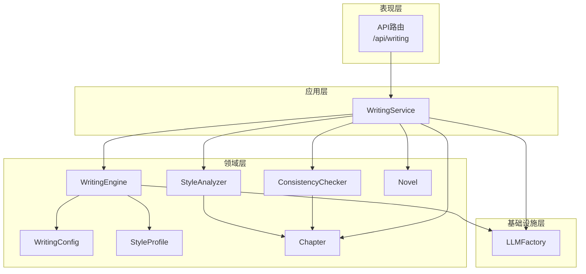
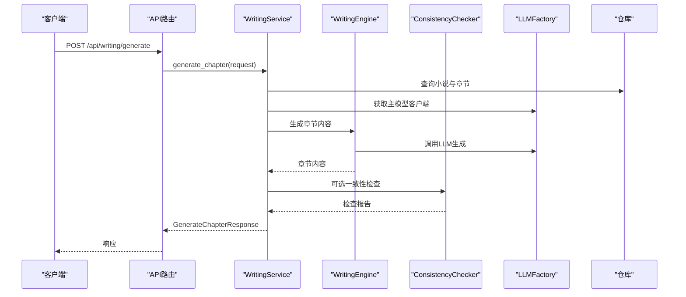
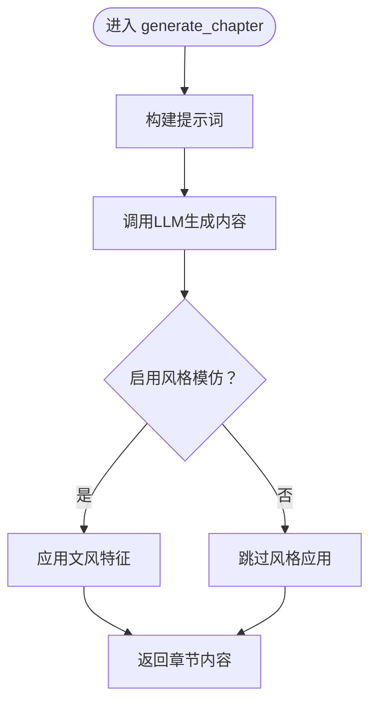
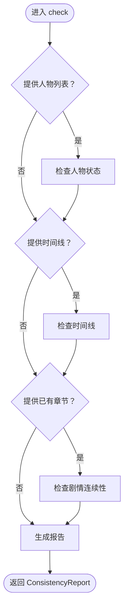
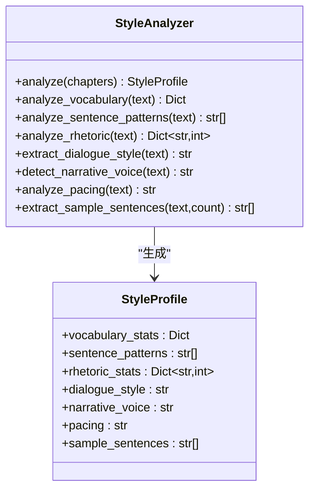
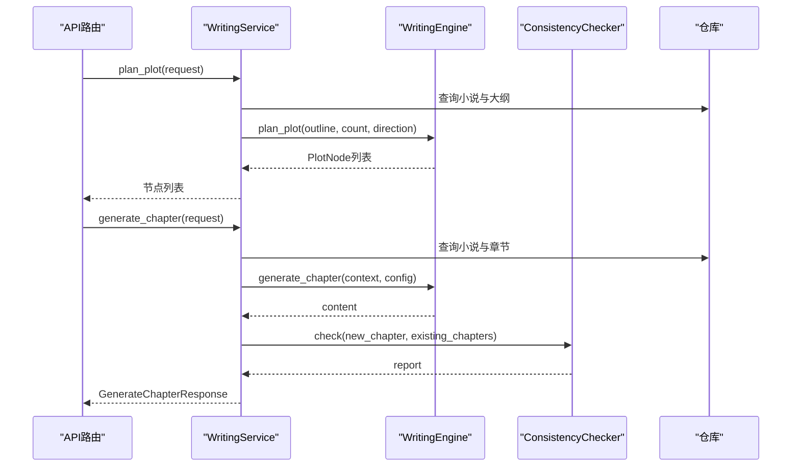
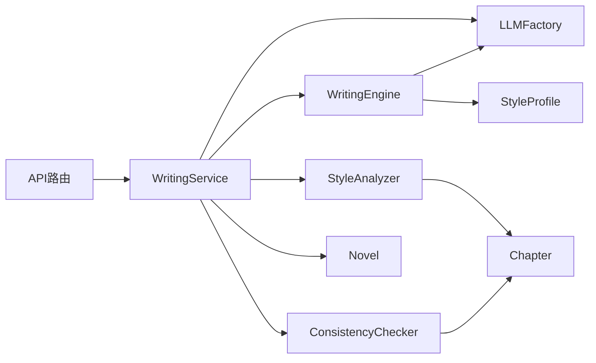

# AI写作引擎模块

<cite>
**本文引用的文件**
- [writing_engine.py](file://domain/services/writing_engine.py)
- [writing_config.py](file://domain/value_objects/writing_config.py)
- [consistency_checker.py](file://domain/services/consistency_checker.py)
- [writing_service.py](file://application/services/writing_service.py)
- [style_analyzer.py](file://domain/services/style_analyzer.py)
- [style_profile.py](file://domain/value_objects/style_profile.py)
- [writing.py](file://presentation/api/routers/writing.py)
- [llm_factory.py](file://infrastructure/llm/llm_factory.py)
- [chapter.py](file://domain/entities/chapter.py)
- [novel.py](file://domain/entities/novel.py)
- [request_dto.py](file://application/dto/request_dto.py)
- [response_dto.py](file://application/dto/response_dto.py)
- [test_writing_engine.py](file://tests/unit/test_writing_engine.py)
- [test_consistency_checker.py](file://tests/unit/test_consistency_checker.py)
</cite>

## 目录
1. [简介](#简介)
2. [项目结构](#项目结构)
3. [核心组件](#核心组件)
4. [架构总览](#架构总览)
5. [详细组件分析](#详细组件分析)
6. [依赖分析](#依赖分析)
7. [性能考虑](#性能考虑)
8. [故障排查指南](#故障排查指南)
9. [结论](#结论)
10. [附录](#附录)

## 简介
本技术文档面向AI写作引擎模块，系统性阐述其整体架构与工作流程，涵盖写作配置管理、文风模仿算法、剧情规划机制与章节生成过程。重点解析WritingEngine的核心算法实现（提示词构建、文风应用、剧情规划），ConsistencyChecker的检查机制（情节一致性、人物行为合理性、时间线准确性），WritingConfig值对象的设计理念与配置选项，以及WritingService中章节生成、风格模仿、连贯性检查等关键功能的实现细节。同时提供AI模型集成方式、参数调优建议与性能优化策略，并给出具体的使用示例与API调用方法。

## 项目结构
AI写作引擎模块位于领域层、应用层与基础设施层之间，采用清晰的分层设计：
- 领域层：WritingEngine、ConsistencyChecker、StyleAnalyzer、WritingConfig、StyleProfile、Chapter、Novel等核心领域服务与实体。
- 应用层：WritingService协调仓库与领域服务，负责业务编排；API路由暴露对外接口。
- 基础设施层：LLMFactory统一管理主备大模型客户端，支持可用性检测与自动切换。

图表来源
- [writing.py:37-278](file://presentation/api/routers/writing.py#L37-L278)
- [writing_service.py:30-180](file://application/services/writing_service.py#L30-L180)
- [writing_engine.py:30-184](file://domain/services/writing_engine.py#L30-L184)
- [consistency_checker.py:37-218](file://domain/services/consistency_checker.py#L37-L218)
- [style_analyzer.py:18-286](file://domain/services/style_analyzer.py#L18-L286)
- [llm_factory.py:31-121](file://infrastructure/llm/llm_factory.py#L31-L121)

章节来源
- [writing.py:37-278](file://presentation/api/routers/writing.py#L37-L278)
- [writing_service.py:30-180](file://application/services/writing_service.py#L30-L180)
- [writing_engine.py:30-184](file://domain/services/writing_engine.py#L30-L184)
- [consistency_checker.py:37-218](file://domain/services/consistency_checker.py#L37-L218)
- [style_analyzer.py:18-286](file://domain/services/style_analyzer.py#L18-L286)
- [llm_factory.py:31-121](file://infrastructure/llm/llm_factory.py#L31-L121)

## 核心组件
- WritingEngine：负责章节生成、剧情规划与文风应用。通过构建提示词驱动LLM生成内容，并可选应用文风特征。
- ConsistencyChecker：对新章节进行连贯性检查，覆盖人物状态、时间线与剧情连续性等维度。
- StyleAnalyzer：分析已有章节，提取文风特征（词汇、句式、修辞、对话风格、叙述视角、节奏、示例句子）形成StyleProfile。
- WritingService：应用层协调者，组合仓库、引擎与检查器，完成章节生成与连贯性验证。
- WritingConfig：不可变值对象，封装续写参数（目标字数、风格强度、温度、上下文章节数、一致性检查开关、风格模仿开关）。
- LLMFactory：统一管理主备LLM客户端，支持可用性检测与自动切换，保证服务稳定性。
- Chapter/Novel：领域实体，承载章节内容、状态与小说聚合信息。

章节来源
- [writing_engine.py:30-184](file://domain/services/writing_engine.py#L30-L184)
- [consistency_checker.py:37-218](file://domain/services/consistency_checker.py#L37-L218)
- [style_analyzer.py:18-286](file://domain/services/style_analyzer.py#L18-L286)
- [writing_service.py:30-180](file://application/services/writing_service.py#L30-L180)
- [writing_config.py:13-28](file://domain/value_objects/writing_config.py#L13-L28)
- [llm_factory.py:31-121](file://infrastructure/llm/llm_factory.py#L31-L121)
- [chapter.py:18-109](file://domain/entities/chapter.py#L18-L109)
- [novel.py:20-178](file://domain/entities/novel.py#L20-L178)

## 架构总览
AI写作引擎采用“应用层编排 + 领域服务执行 + 基础设施模型接入”的分层架构。WritingService作为入口，负责：
- 读取小说与章节数据，构建WritingContext与WritingConfig；
- 调用WritingEngine生成章节内容；
- 可选触发ConsistencyChecker进行一致性检查；
- 返回标准化响应（含元数据与连贯性报告）。

图表来源
- [writing.py:111-174](file://presentation/api/routers/writing.py#L111-L174)
- [writing_service.py:91-165](file://application/services/writing_service.py#L91-L165)
- [writing_engine.py:52-80](file://domain/services/writing_engine.py#L52-L80)
- [consistency_checker.py:44-87](file://domain/services/consistency_checker.py#L44-L87)
- [llm_factory.py:78-95](file://infrastructure/llm/llm_factory.py#L78-L95)

## 详细组件分析

### WritingEngine：章节生成与文风应用
- 提示词构建：基于WritingContext（小说标题、大纲摘要、前文摘要、剧情方向）与WritingConfig（目标字数、风格强度、温度等）拼装提示词，确保LLM生成符合预期长度与风格。
- 章节生成：调用LLM客户端生成内容；若启用风格模仿，则对生成内容应用StyleProfile特征。
- 剧情规划：根据大纲与方向生成固定数量的PlotNode节点，用于后续章节推进。

图表来源
- [writing_engine.py:52-80](file://domain/services/writing_engine.py#L52-L80)
- [writing_engine.py:139-183](file://domain/services/writing_engine.py#L139-L183)

章节来源
- [writing_engine.py:30-184](file://domain/services/writing_engine.py#L30-L184)

### ConsistencyChecker：连贯性检查机制
- 人物状态一致性：通过关键词匹配判断修为境界是否倒退或跳级，生成高/低严重度的不一致项。
- 时间线一致性：比较最新章节编号与时间线最后事件，确保章节顺序合理。
- 剧情连续性：预留扩展点，可结合已有章节进行逻辑一致性检查。
- 伏笔回收：预留扩展点，可用于检查伏笔是否在当前章节得到呼应。

图表来源
- [consistency_checker.py:44-87](file://domain/services/consistency_checker.py#L44-L87)
- [consistency_checker.py:89-140](file://domain/services/consistency_checker.py#L89-L140)
- [consistency_checker.py:142-170](file://domain/services/consistency_checker.py#L142-L170)
- [consistency_checker.py:172-196](file://domain/services/consistency_checker.py#L172-L196)
- [consistency_checker.py:198-217](file://domain/services/consistency_checker.py#L198-L217)

章节来源
- [consistency_checker.py:37-218](file://domain/services/consistency_checker.py#L37-L218)

### StyleAnalyzer：文风特征提取
- 词汇统计：高频词、平均词长、词汇丰富度、总词数、独立词数。
- 句式模式：抽取典型句式模板（如“主谓宾”、“逗号分段”等）。
- 修辞统计：统计比喻、拟人、排比、夸张等修辞手法出现次数。
- 对话风格：基于对话长度与语气标点判断风格（简洁/适中/详细，情感强烈/疑问较多/平和）。
- 叙述视角：统计第一/第三人称代词频率，判定叙述视角。
- 节奏特点：依据句子长度分布判断快/中/慢节奏。
- 示例句子：抽取若干代表性句子用于风格参考。

图表来源
- [style_analyzer.py:25-66](file://domain/services/style_analyzer.py#L25-L66)
- [style_profile.py:14-30](file://domain/value_objects/style_profile.py#L14-L30)

章节来源
- [style_analyzer.py:18-286](file://domain/services/style_analyzer.py#L18-L286)
- [style_profile.py:14-30](file://domain/value_objects/style_profile.py#L14-L30)

### WritingService：章节生成与一致性检查编排
- 规划剧情：读取小说与大纲，调用WritingEngine.plan_plot生成剧情节点。
- 生成章节：构建WritingContext与WritingConfig，调用WritingEngine生成内容；可选触发ConsistencyChecker生成报告。
- 数据持久化：创建Chapter实体并保存至仓库，更新Novel聚合计数。

图表来源
- [writing_service.py:50-89](file://application/services/writing_service.py#L50-L89)
- [writing_service.py:91-165](file://application/services/writing_service.py#L91-L165)

章节来源
- [writing_service.py:30-180](file://application/services/writing_service.py#L30-L180)

### WritingConfig：配置值对象设计理念
- 不可变性：使用frozen=True，确保配置在生命周期内稳定，避免意外修改。
- 关键字段：
  - 目标字数：控制生成内容长度。
  - 风格强度：保留扩展位，用于后续风格模仿强度调节。
  - 温度：保留扩展位，用于后续采样多样性控制。
  - 上下文章节数：限制历史章节上下文窗口大小。
  - 一致性检查开关：控制是否进行连贯性检查。
  - 风格模仿开关：控制是否应用文风特征。

章节来源
- [writing_config.py:13-28](file://domain/value_objects/writing_config.py#L13-L28)

### LLMFactory：模型集成与切换
- 主备模型：默认主模型为DeepSeek，备用模型为Kimi，支持异步可用性检测与自动切换。
- 客户端选择：优先使用可用主模型，失败时切换备用模型，必要时可重置为主模型。
- 异步支持：提供异步客户端获取与切换能力，提升并发性能。

章节来源
- [llm_factory.py:31-121](file://infrastructure/llm/llm_factory.py#L31-L121)

### API路由与DTO：对外接口与数据契约
- 路由：
  - POST /api/writing/plan：规划剧情节点。
  - POST /api/writing/generate：生成章节。
  - POST /api/writing/continue：基于工具链的续写（Agent MVP）。
- 请求DTO：GenerateChapterRequest、PlanPlotRequest、ContinueWritingRequest等，包含目标、约束、上下文摘要、章节数量、目标字数、选项等。
- 响应DTO：GenerateChapterResponse、ConsistencyCheckResponse、ContinueWritingResponse等，统一返回结构与元数据。

章节来源
- [writing.py:37-278](file://presentation/api/routers/writing.py#L37-L278)
- [request_dto.py:45-71](file://application/dto/request_dto.py#L45-L71)
- [response_dto.py:86-200](file://application/dto/response_dto.py#L86-L200)

## 依赖分析
- WritingEngine依赖LLMFactory提供的客户端与StyleProfile；通过提示词驱动生成，风格应用为可选步骤。
- WritingService依赖仓库接口（INovelRepository、IChapterRepository）、LLMFactory、WritingEngine与ConsistencyChecker；承担应用层编排职责。
- ConsistencyChecker依赖Chapter与Character实体；当前实现覆盖人物状态与时间线检查，剧情连续性与伏笔回收为扩展点。
- StyleAnalyzer依赖Chapter实体集合；输出StyleProfile供WritingEngine应用。
- API路由依赖WritingService与ProjectService，支持Agent链路与传统链路双通道。

图表来源
- [writing.py:37-278](file://presentation/api/routers/writing.py#L37-L278)
- [writing_service.py:30-180](file://application/services/writing_service.py#L30-L180)
- [writing_engine.py:39-50](file://domain/services/writing_engine.py#L39-L50)
- [style_analyzer.py:25-66](file://domain/services/style_analyzer.py#L25-L66)
- [consistency_checker.py:44-87](file://domain/services/consistency_checker.py#L44-L87)

章节来源
- [writing.py:37-278](file://presentation/api/routers/writing.py#L37-L278)
- [writing_service.py:30-180](file://application/services/writing_service.py#L30-L180)
- [writing_engine.py:39-50](file://domain/services/writing_engine.py#L39-L50)
- [style_analyzer.py:25-66](file://domain/services/style_analyzer.py#L25-L66)
- [consistency_checker.py:44-87](file://domain/services/consistency_checker.py#L44-L87)

## 性能考虑
- LLM调用异步化：WritingEngine在调用LLM客户端时使用异步运行，减少阻塞；LLMFactory提供异步客户端获取与切换，适合高并发场景。
- 上下文窗口控制：WritingConfig.max_context_chapters限制历史章节数量，降低提示词长度与推理成本。
- 缓存与复用：WritingService内部缓存StyleProfile，避免重复分析；可进一步引入LLM调用缓存与结果去重。
- 并发与限流：API路由可结合中间件实现请求限流与幂等处理，防止突发流量冲击。
- 模型切换：主备模型自动切换可提升可用性与稳定性，建议在高负载时预热主模型连接池。

章节来源
- [writing_engine.py:71-75](file://domain/services/writing_engine.py#L71-L75)
- [llm_factory.py:78-121](file://infrastructure/llm/llm_factory.py#L78-L121)
- [writing_service.py:167-179](file://application/services/writing_service.py#L167-L179)

## 故障排查指南
- 小说不存在或大纲缺失：WritingService在规划与生成前会校验小说与大纲存在性，抛出明确错误信息。
- 连贯性检查异常：ConsistencyChecker当前实现覆盖人物状态与时间线检查，若发现不一致项，返回高/低严重度的Inconsistency；建议结合业务规则细化检查逻辑。
- LLM调用失败：LLMFactory提供主备模型切换能力，可在主模型不可用时自动切换备用模型；建议记录调用日志与错误码以便定位问题。
- Agent链路异常：API路由支持灰度分流与Agent链路回退，若Agent未生成内容，将回退到传统链路并返回错误详情。

章节来源
- [writing_service.py:62-68](file://application/services/writing_service.py#L62-L68)
- [writing_service.py:103-105](file://application/services/writing_service.py#L103-L105)
- [consistency_checker.py:108-140](file://domain/services/consistency_checker.py#L108-L140)
- [writing.py:105-108](file://presentation/api/routers/writing.py#L105-L108)
- [writing.py:130-171](file://presentation/api/routers/writing.py#L130-L171)

## 结论
AI写作引擎模块通过清晰的分层设计与可扩展的领域服务，实现了从剧情规划、章节生成到连贯性检查的完整闭环。WritingEngine以提示词驱动LLM生成内容，并可选应用文风特征；ConsistencyChecker提供多维度的连贯性保障；WritingService承担应用层编排职责，结合LLMFactory实现稳定的模型集成。未来可在剧情连续性与伏笔回收方面进一步完善检查规则，在风格模仿环节引入更精细的特征映射与反馈迭代，持续提升生成质量与一致性。

## 附录

### 使用示例与API调用方法
- 规划剧情
  - 方法：POST /api/writing/plan
  - 请求体：包含小说ID、目标字数、章节数量、剧情方向等
  - 响应：剧情节点列表
- 生成章节
  - 方法：POST /api/writing/generate
  - 请求体：包含小说ID、目标字数、是否启用风格模仿、是否启用一致性检查、剧情方向等
  - 响应：章节ID、内容、字数、元数据与一致性检查报告
- 续写章节（Agent MVP）
  - 方法：POST /api/writing/continue
  - 请求体：包含小说ID、目标字数、目标与记忆上下文
  - 响应：章节内容、字数、元数据与项目绑定进度

章节来源
- [writing.py:88-174](file://presentation/api/routers/writing.py#L88-L174)
- [request_dto.py:45-71](file://application/dto/request_dto.py#L45-L71)
- [response_dto.py:86-200](file://application/dto/response_dto.py#L86-L200)

### 参数调优建议
- 目标字数：根据平台与阅读习惯设定，建议在2100字左右平衡阅读体验与生成效率。
- 风格强度与温度：当前版本为占位符，建议结合实际风格特征与用户偏好进行动态调整。
- 上下文章节数：建议控制在3-5章范围内，兼顾上下文连贯与提示词长度。
- 一致性检查：建议开启以保证长期创作的稳定性，结合业务规则逐步完善检查规则。

章节来源
- [writing_config.py:22-27](file://domain/value_objects/writing_config.py#L22-L27)
- [writing_service.py:124-128](file://application/services/writing_service.py#L124-L128)

### 单元测试要点
- WritingEngine：验证上下文创建、章节生成、剧情规划与风格应用。
- ConsistencyChecker：验证人物状态检查、时间线检查与报告生成。
- 测试文件路径参考：
  - [test_writing_engine.py:23-133](file://tests/unit/test_writing_engine.py#L23-L133)
  - [test_consistency_checker.py:19-153](file://tests/unit/test_consistency_checker.py#L19-L153)

章节来源
- [test_writing_engine.py:23-133](file://tests/unit/test_writing_engine.py#L23-L133)
- [test_consistency_checker.py:19-153](file://tests/unit/test_consistency_checker.py#L19-L153)