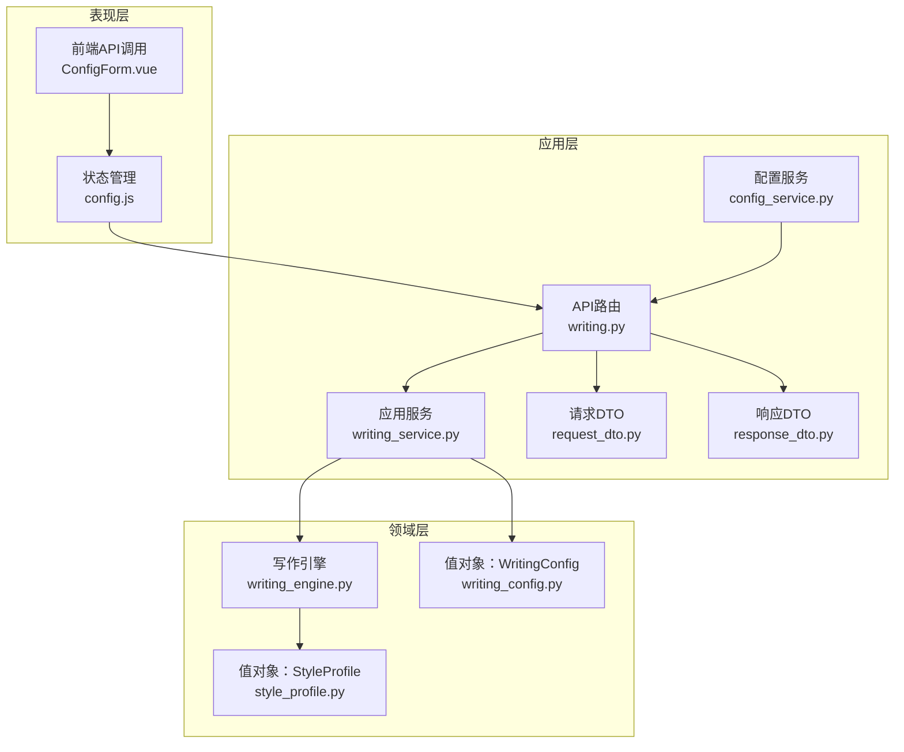
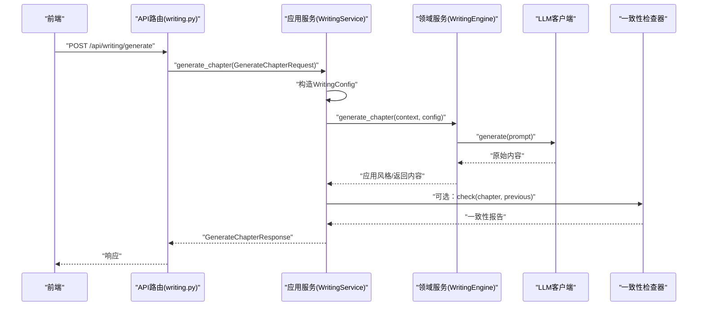
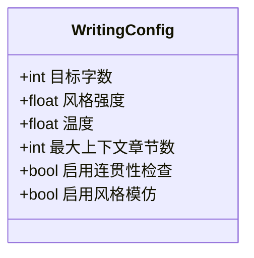
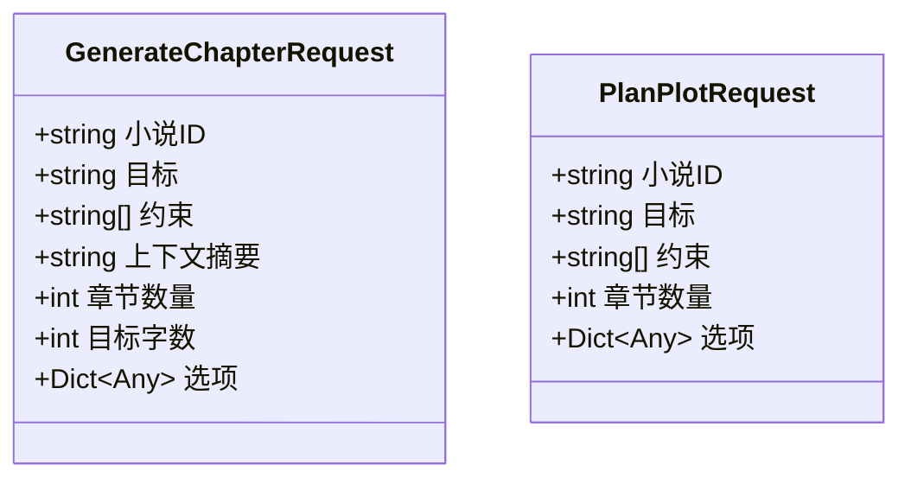
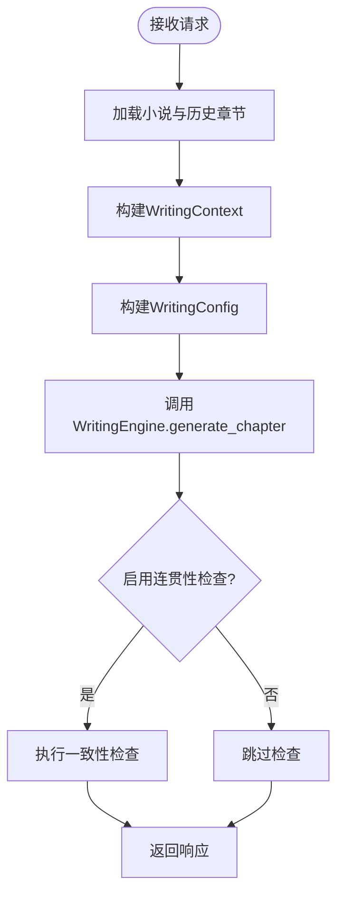
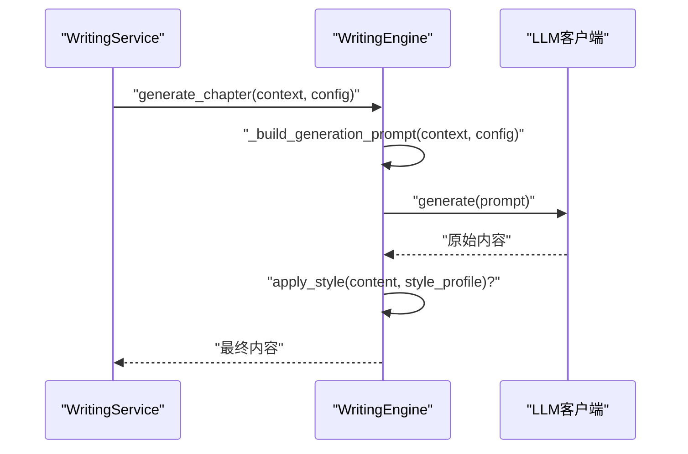
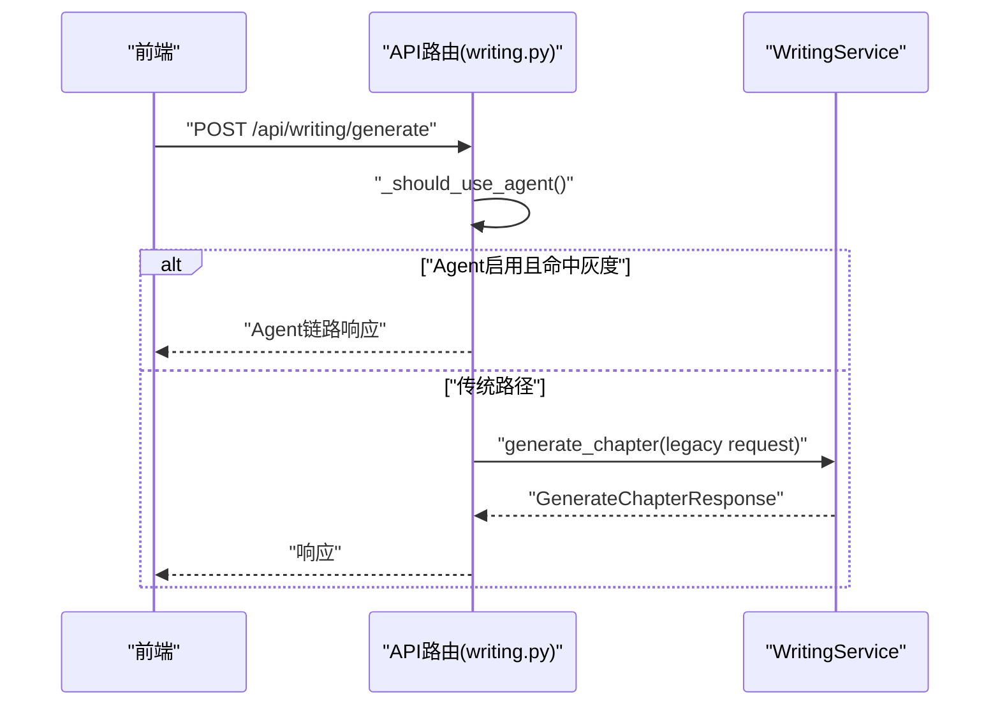
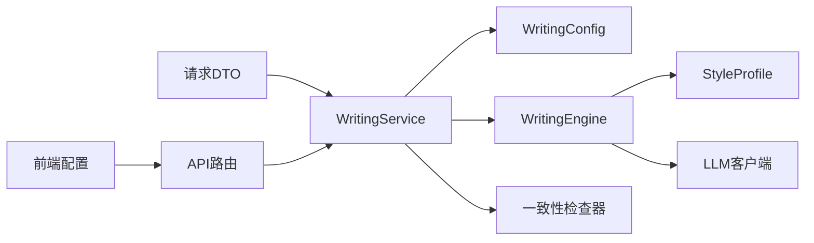

# 写作配置管理

<cite>
**本文引用的文件**
- [writing_config.py](file://domain/value_objects/writing_config.py)
- [request_dto.py](file://application/dto/request_dto.py)
- [response_dto.py](file://application/dto/response_dto.py)
- [writing_service.py](file://application/services/writing_service.py)
- [writing_engine.py](file://domain/services/writing_engine.py)
- [writing.py](file://presentation/api/routers/writing.py)
- [style_profile.py](file://domain/value_objects/style_profile.py)
- [llm_config.py](file://domain/entities/llm_config.py)
- [config_service.py](file://application/services/config_service.py)
- [xianxia.json](file://infrastructure/templates/xianxia.json)
- [kehuan.json](file://infrastructure/templates/kehuan.json)
- [ConfigForm.vue](file://frontend/src/views/config/components/ConfigForm.vue)
- [config.js](file://frontend/src/stores/config.js)
</cite>

## 目录
1. [简介](#简介)
2. [项目结构](#项目结构)
3. [核心组件](#核心组件)
4. [架构总览](#架构总览)
5. [详细组件分析](#详细组件分析)
6. [依赖分析](#依赖分析)
7. [性能考虑](#性能考虑)
8. [故障排查指南](#故障排查指南)
9. [结论](#结论)
10. [附录](#附录)

## 简介
本文件围绕“写作配置管理”主题，系统阐述WritingConfig值对象的设计理念与实现原理，并结合GenerateChapterRequest与PlanPlotRequest两类请求DTO，说明其字段定义、验证规则与使用场景。文档进一步解释配置参数对AI写作过程的影响，包括文风模仿强度、内容生成长度与质量控制等方面；并提供面向不同小说类型的最佳实践建议、具体配置示例与API调用方法，帮助开发者按需调整写作参数。

## 项目结构
写作配置管理涉及的代码分布在领域层、应用层与表现层：
- 领域层：WritingConfig值对象、StyleProfile值对象、WritingEngine领域服务
- 应用层：WritingService应用服务、请求/响应DTO、ConfigService配置管理服务
- 表现层：FastAPI路由、前端配置表单与状态管理

图表来源
- [writing.py:1-278](file://presentation/api/routers/writing.py#L1-L278)
- [writing_service.py:1-180](file://application/services/writing_service.py#L1-L180)
- [writing_engine.py:1-184](file://domain/services/writing_engine.py#L1-L184)
- [writing_config.py:1-28](file://domain/value_objects/writing_config.py#L1-L28)
- [style_profile.py:1-30](file://domain/value_objects/style_profile.py#L1-L30)
- [request_dto.py:1-97](file://application/dto/request_dto.py#L1-L97)
- [response_dto.py:1-200](file://application/dto/response_dto.py#L1-L200)
- [config_service.py:1-151](file://application/services/config_service.py#L1-L151)

章节来源
- [writing.py:1-278](file://presentation/api/routers/writing.py#L1-L278)
- [writing_service.py:1-180](file://application/services/writing_service.py#L1-L180)
- [writing_engine.py:1-184](file://domain/services/writing_engine.py#L1-L184)
- [writing_config.py:1-28](file://domain/value_objects/writing_config.py#L1-L28)
- [style_profile.py:1-30](file://domain/value_objects/style_profile.py#L1-L30)
- [request_dto.py:1-97](file://application/dto/request_dto.py#L1-L97)
- [response_dto.py:1-200](file://application/dto/response_dto.py#L1-L200)
- [config_service.py:1-151](file://application/services/config_service.py#L1-L151)

## 核心组件
- WritingConfig值对象：封装续写时的关键配置参数，包括目标字数、风格模仿开关、连贯性检查开关等，采用不可变设计以保证线程安全与一致性。
- GenerateChapterRequest与PlanPlotRequest：分别用于“生成章节”和“规划剧情”的请求DTO，包含字段验证规则与Agent友好格式，确保输入合法性与扩展性。
- WritingService应用服务：协调LLM客户端、写作引擎与一致性检查器，将请求转换为WritingConfig并驱动生成流程。
- WritingEngine领域服务：构建生成提示词、调用LLM生成内容，并在启用风格模仿时应用StyleProfile。
- StyleProfile值对象：承载文风特征，为风格模仿提供基础数据结构。
- API路由与前端：提供HTTP接口与可视化配置表单，支撑配置管理与写作流程。

章节来源
- [writing_config.py:13-28](file://domain/value_objects/writing_config.py#L13-L28)
- [request_dto.py:45-71](file://application/dto/request_dto.py#L45-L71)
- [writing_service.py:30-180](file://application/services/writing_service.py#L30-L180)
- [writing_engine.py:30-184](file://domain/services/writing_engine.py#L30-L184)
- [style_profile.py:14-30](file://domain/value_objects/style_profile.py#L14-L30)
- [writing.py:111-174](file://presentation/api/routers/writing.py#L111-L174)

## 架构总览
写作配置贯穿“表现层-应用层-领域层”的调用链路：前端通过API路由提交请求，应用服务解析为WritingConfig并交由写作引擎执行；生成完成后可选进行一致性检查并返回响应。

图表来源
- [writing.py:111-174](file://presentation/api/routers/writing.py#L111-L174)
- [writing_service.py:91-165](file://application/services/writing_service.py#L91-L165)
- [writing_engine.py:52-80](file://domain/services/writing_engine.py#L52-L80)

## 详细组件分析

### WritingConfig值对象
- 设计理念
  - 使用不可变数据类，确保配置在生命周期内稳定可靠，避免并发修改带来的副作用。
  - 作为领域服务的输入参数，统一传递给写作引擎，便于集中控制生成行为。
- 关键配置项
  - 目标字数：决定生成内容的长度目标，影响提示词中的字数约束与LLM输出长度。
  - 风格模仿开关：控制是否应用文风特征进行风格迁移。
  - 连贯性检查开关：控制是否对生成章节进行一致性校验。
  - 其他参数：如风格强度、温度、上下文章节数量等，用于更精细的生成控制（若在后续版本扩展）。
- 影响机制
  - 目标字数直接影响提示词中的长度约束，从而影响LLM的输出长度与节奏。
  - 风格模仿开关决定是否调用apply_style，进而影响输出的语言风格与叙述方式。
  - 连贯性检查开关决定是否执行一致性检查，保障章节与前文的逻辑与设定一致。

图表来源
- [writing_config.py:13-28](file://domain/value_objects/writing_config.py#L13-L28)

章节来源
- [writing_config.py:13-28](file://domain/value_objects/writing_config.py#L13-L28)
- [writing_engine.py:77-78](file://domain/services/writing_engine.py#L77-L78)
- [writing_service.py:124-128](file://application/services/writing_service.py#L124-L128)

### GenerateChapterRequest与PlanPlotRequest
- 字段定义与验证规则
  - GenerateChapterRequest：包含小说ID、目标（剧情方向）、章节数量、目标字数、可选约束与上下文摘要等；目标字数与章节数量均有限制范围，确保生成可控。
  - PlanPlotRequest：包含小说ID、目标（剧情方向）、章节数量与可选约束；用于生成剧情节点列表。
- 使用场景
  - GenerateChapterRequest：用于直接生成指定长度与风格的章节内容。
  - PlanPlotRequest：用于基于大纲与目标生成剧情节点，指导后续章节生成。
- Agent友好格式
  - 请求DTO提供options字段与Agent所需的结构化参数，便于智能体工具链集成。

图表来源
- [request_dto.py:45-71](file://application/dto/request_dto.py#L45-L71)

章节来源
- [request_dto.py:45-71](file://application/dto/request_dto.py#L45-L71)
- [writing.py:70-85](file://presentation/api/routers/writing.py#L70-L85)

### WritingService应用服务
- 职责
  - 解析请求为WritingContext与WritingConfig。
  - 协调LLM客户端与写作引擎生成内容。
  - 可选执行一致性检查并返回报告。
- 关键流程
  - 读取小说与历史章节，构建上下文。
  - 将请求映射为WritingConfig（目标字数、风格模仿、连贯性检查）。
  - 调用引擎生成内容，保存章节并返回响应。

图表来源
- [writing_service.py:91-165](file://application/services/writing_service.py#L91-L165)

章节来源
- [writing_service.py:91-165](file://application/services/writing_service.py#L91-L165)

### WritingEngine领域服务
- 职责
  - 构建生成提示词，调用LLM生成内容。
  - 在启用风格模仿时应用StyleProfile，实现文风迁移。
- 提示词构建
  - 包含小说信息、大纲摘要、剧情方向与前文摘要，以及目标字数约束。
- 风格应用
  - 当启用风格模仿时，对原始内容进行风格迁移处理。

图表来源
- [writing_engine.py:52-80](file://domain/services/writing_engine.py#L52-L80)
- [writing_engine.py:139-183](file://domain/services/writing_engine.py#L139-L183)

章节来源
- [writing_engine.py:52-80](file://domain/services/writing_engine.py#L52-L80)
- [writing_engine.py:139-183](file://domain/services/writing_engine.py#L139-L183)

### API路由与前端集成
- API路由
  - 提供“生成章节”“规划剧情”“续写”等端点，内部支持Agent灰度分流与兼容旧版请求。
- 前端配置
  - 提供LLM配置表单与状态管理，支持保存、测试连接与错误提示。

图表来源
- [writing.py:111-174](file://presentation/api/routers/writing.py#L111-L174)
- [writing.py:57-85](file://presentation/api/routers/writing.py#L57-L85)

章节来源
- [writing.py:111-174](file://presentation/api/routers/writing.py#L111-L174)
- [writing.py:57-85](file://presentation/api/routers/writing.py#L57-L85)
- [ConfigForm.vue:1-309](file://frontend/src/views/config/components/ConfigForm.vue#L1-L309)
- [config.js:1-240](file://frontend/src/stores/config.js#L1-L240)

## 依赖分析
- 写作配置对生成流程的影响
  - 目标字数：通过提示词约束影响输出长度，进而影响章节节奏与阅读体验。
  - 风格模仿开关：启用后调用apply_style，使生成内容与既有文风保持一致。
  - 连贯性检查开关：启用后对生成章节进行一致性校验，降低设定与逻辑矛盾风险。
- 与其他组件的关系
  - WritingService依赖WritingEngine与一致性检查器，将请求转换为领域服务可执行的参数。
  - WritingEngine依赖StyleProfile进行风格迁移，依赖LLM客户端生成内容。
  - API路由负责请求转发与Agent分流，前端负责配置与状态管理。

图表来源
- [writing_service.py:91-165](file://application/services/writing_service.py#L91-L165)
- [writing_engine.py:30-80](file://domain/services/writing_engine.py#L30-L80)
- [writing.py:111-174](file://presentation/api/routers/writing.py#L111-L174)

章节来源
- [writing_service.py:91-165](file://application/services/writing_service.py#L91-L165)
- [writing_engine.py:30-80](file://domain/services/writing_engine.py#L30-L80)
- [writing.py:111-174](file://presentation/api/routers/writing.py#L111-L174)

## 性能考虑
- 提示词长度控制：目标字数与上下文章节数量直接影响提示词长度，应平衡生成质量与延迟。
- 风格模仿成本：启用风格模仿会引入额外处理步骤，建议在需要时开启以减少不必要的开销。
- 一致性检查：仅在关键节点启用，避免频繁全量检查导致性能下降。
- Agent分流：通过灰度比例控制流量，避免Agent链路成为性能瓶颈。

## 故障排查指南
- 配置校验失败
  - 确认至少配置一个有效的API密钥，长度满足最小要求。
  - 检查加密密钥哈希是否匹配，避免解密失败。
- 写作请求异常
  - 检查GenerateChapterRequest与PlanPlotRequest的字段范围与必填项。
  - 确认小说存在且已建立项目记忆，避免续写失败。
- 一致性检查问题
  - 若启用连贯性检查，关注返回的不一致项与警告，及时修正设定或情节。

章节来源
- [config_service.py:89-151](file://application/services/config_service.py#L89-L151)
- [writing.py:176-278](file://presentation/api/routers/writing.py#L176-L278)
- [response_dto.py:79-84](file://application/dto/response_dto.py#L79-L84)

## 结论
WritingConfig值对象与相关请求DTO共同构成了写作配置管理的核心，通过明确的字段定义、严格的验证规则与清晰的调用链路，实现了对AI写作过程的可控化与可扩展化。结合风格模仿与一致性检查，能够在保证内容质量的同时，灵活适配不同小说类型与创作需求。

## 附录

### 配置参数对AI写作过程的影响
- 目标字数
  - 影响提示词中的长度约束，决定输出内容的体量与节奏。
- 风格模仿开关
  - 控制是否应用StyleProfile进行风格迁移，提升文风一致性。
- 连贯性检查开关
  - 控制是否对生成章节进行一致性校验，降低设定与逻辑矛盾风险。

章节来源
- [writing_engine.py:139-183](file://domain/services/writing_engine.py#L139-L183)
- [writing_service.py:144-158](file://application/services/writing_service.py#L144-L158)

### 不同小说类型的推荐配置参数
- 仙侠类（参考模板）
  - 建议启用风格模仿，目标字数适中，连贯性检查开启，以保持文风与设定一致性。
- 科幻类（参考模板）
  - 建议启用风格模仿，目标字数可略增，连贯性检查开启，以维持科技感与逻辑严谨性。

章节来源
- [xianxia.json:1-74](file://infrastructure/templates/xianxia.json#L1-L74)
- [kehuan.json:1-73](file://infrastructure/templates/kehuan.json#L1-L73)

### API调用方法与示例
- 生成章节
  - 端点：POST /api/writing/generate
  - 请求体：包含小说ID、目标（剧情方向）、目标字数、可选约束与上下文摘要
  - 响应：章节ID、内容、字数与可选一致性检查报告
- 规划剧情
  - 端点：POST /api/writing/plan
  - 请求体：包含小说ID、目标（剧情方向）、章节数量
  - 响应：剧情节点列表
- 续写章节
  - 端点：POST /api/writing/continue
  - 请求体：包含小说ID、目标、目标字数
  - 响应：章节内容、字数与元数据

章节来源
- [writing.py:88-174](file://presentation/api/routers/writing.py#L88-L174)
- [request_dto.py:45-71](file://application/dto/request_dto.py#L45-L71)
- [response_dto.py:86-99](file://application/dto/response_dto.py#L86-L99)

### 前端配置表单与状态管理
- 配置表单
  - 支持DeepSeek与Kimi API Key的输入、保存与连接测试。
- 状态管理
  - 提供加载、保存、测试、删除配置与状态查询的统一入口。

章节来源
- [ConfigForm.vue:1-309](file://frontend/src/views/config/components/ConfigForm.vue#L1-L309)
- [config.js:1-240](file://frontend/src/stores/config.js#L1-L240)