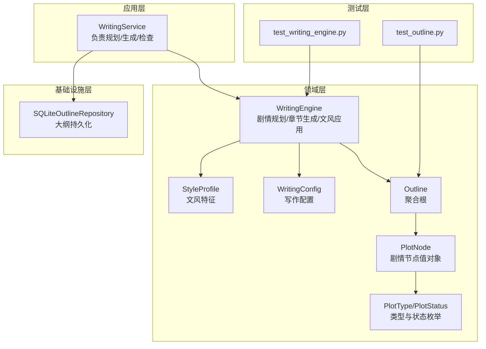
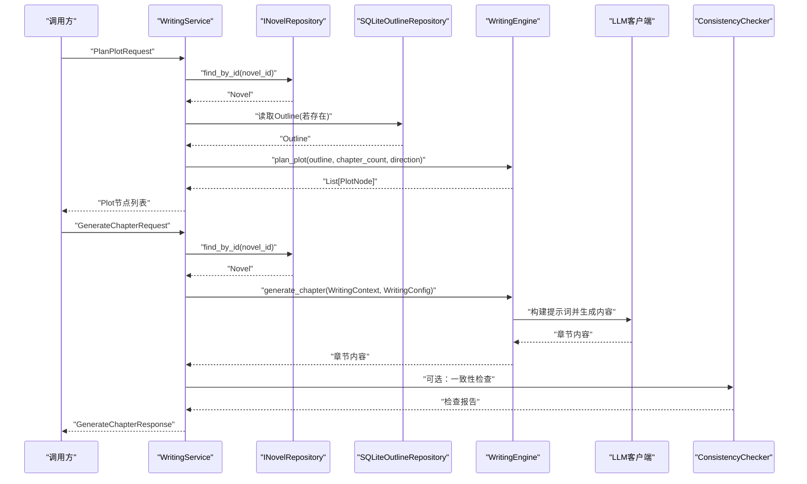
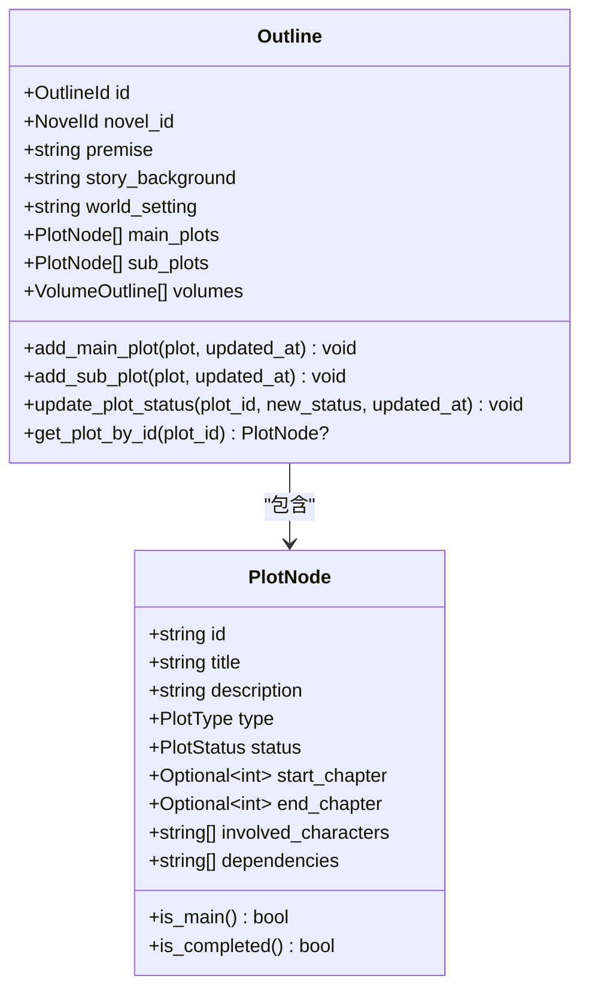
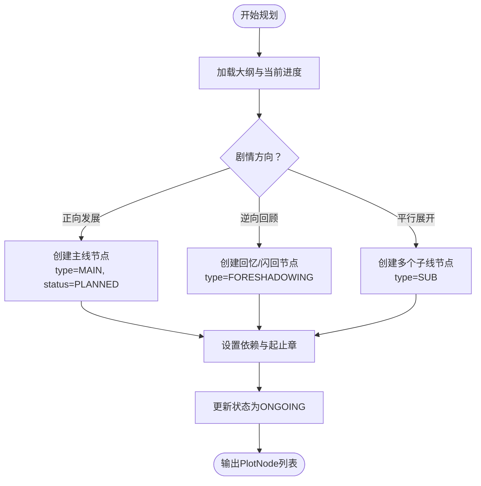
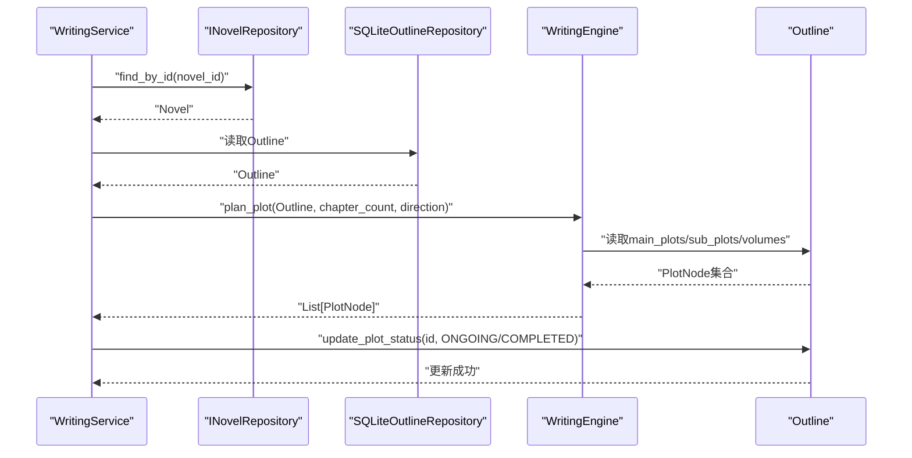
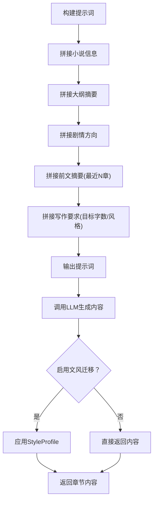
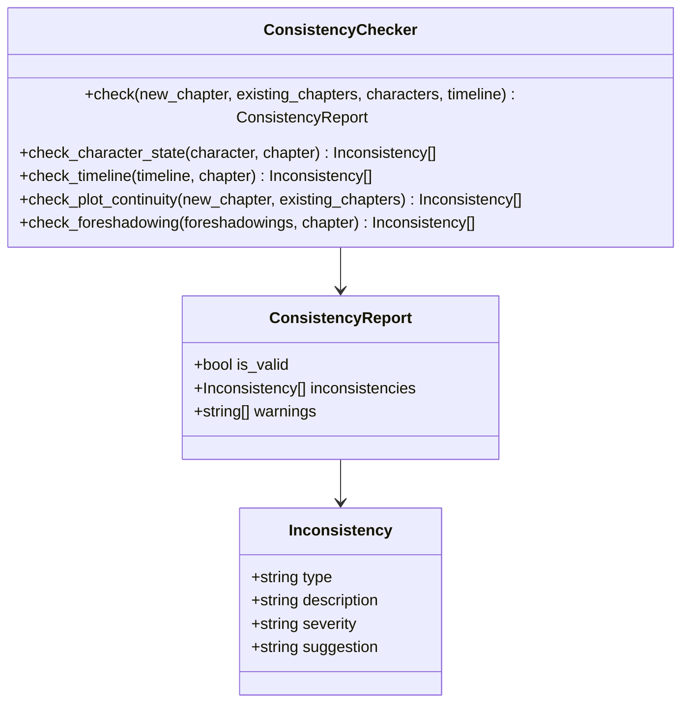
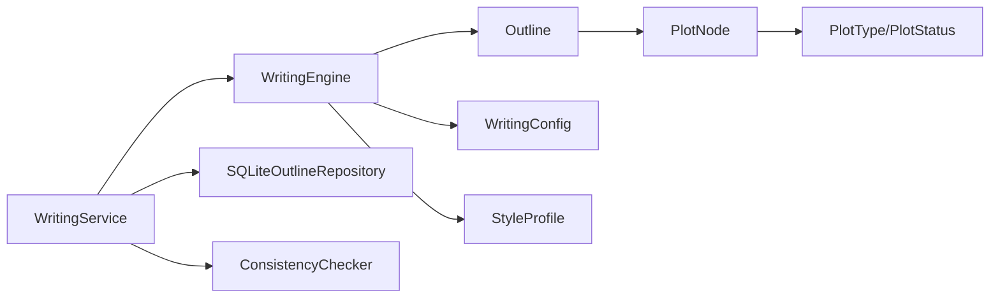

# 剧情规划机制

<cite>
**本文引用的文件**
- [writing_engine.py](file://domain/services/writing_engine.py)
- [outline.py](file://domain/entities/outline.py)
- [types.py](file://domain/types.py)
- [style_profile.py](file://domain/value_objects/style_profile.py)
- [writing_config.py](file://domain/value_objects/writing_config.py)
- [writing_service.py](file://application/services/writing_service.py)
- [request_dto.py](file://application/dto/request_dto.py)
- [response_dto.py](file://application/dto/response_dto.py)
- [consistency_checker.py](file://domain/services/consistency_checker.py)
- [sqlite_outline_repo.py](file://infrastructure/persistence/sqlite_outline_repo.py)
- [test_writing_engine.py](file://tests/unit/test_writing_engine.py)
- [test_outline.py](file://tests/unit/test_outline.py)
</cite>

## 目录
1. [简介](#简介)
2. [项目结构](#项目结构)
3. [核心组件](#核心组件)
4. [架构总览](#架构总览)
5. [详细组件分析](#详细组件分析)
6. [依赖分析](#依赖分析)
7. [性能考量](#性能考量)
8. [故障排查指南](#故障排查指南)
9. [结论](#结论)
10. [附录](#附录)

## 简介
本技术文档围绕 InkTrace 项目中的剧情规划机制展开，重点解析 WritingEngine 的剧情规划算法实现、PlotNode 数据结构设计、与 Outline 实体的交互方式、剧情方向控制策略（正向发展、逆向回顾、平行展开），以及质量评估标准与参数调优建议。文档旨在帮助开发者与产品人员快速理解并正确使用该机制。

## 项目结构
与剧情规划相关的关键模块分布于领域层、应用层与基础设施层：
- 领域层：PlotNode、Outline、PlotType/PlotStatus、WritingEngine、WritingContext、WritingConfig、StyleProfile
- 应用层：WritingService（协调仓库、引擎与检查器）
- 基础设施层：SQLiteOutlineRepository（大纲持久化）
- 测试层：覆盖 WritingEngine 与 Outline 的行为验证

图表来源
- [writing_service.py:30-180](file://application/services/writing_service.py#L30-L180)
- [writing_engine.py:30-184](file://domain/services/writing_engine.py#L30-L184)
- [outline.py:17-257](file://domain/entities/outline.py#L17-L257)
- [types.py:93-107](file://domain/types.py#L93-L107)
- [writing_config.py:13-28](file://domain/value_objects/writing_config.py#L13-L28)
- [style_profile.py:14-30](file://domain/value_objects/style_profile.py#L14-L30)
- [sqlite_outline_repo.py:20-143](file://infrastructure/persistence/sqlite_outline_repo.py#L20-L143)
- [test_writing_engine.py:23-133](file://tests/unit/test_writing_engine.py#L23-L133)
- [test_outline.py:123-286](file://tests/unit/test_outline.py#L123-L286)

章节来源
- [writing_service.py:30-180](file://application/services/writing_service.py#L30-L180)
- [writing_engine.py:30-184](file://domain/services/writing_engine.py#L30-L184)
- [outline.py:17-257](file://domain/entities/outline.py#L17-L257)
- [types.py:93-107](file://domain/types.py#L93-L107)
- [writing_config.py:13-28](file://domain/value_objects/writing_config.py#L13-L28)
- [style_profile.py:14-30](file://domain/value_objects/style_profile.py#L14-L30)
- [sqlite_outline_repo.py:20-143](file://infrastructure/persistence/sqlite_outline_repo.py#L20-L143)
- [test_writing_engine.py:23-133](file://tests/unit/test_writing_engine.py#L23-L133)
- [test_outline.py:123-286](file://tests/unit/test_outline.py#L123-L286)

## 核心组件
- PlotNode：剧情节点值对象，承载节点标识、标题、描述、类型（主线/支线/伏笔）、状态（已计划/进行中/已完成）及可选的起止章、涉及人物、依赖等扩展属性。
- Outline：小说大纲聚合根，包含核心设定、背景、世界观、主线/支线剧情节点与分卷大纲，并提供增删改查与状态更新能力。
- WritingEngine：领域服务，负责构建生成提示词、调用大模型生成章节内容、应用文风特征，以及基础的剧情节点规划（当前实现为占位）。
- WritingService：应用服务，协调仓库、引擎与一致性检查器，对外暴露规划与生成接口。
- WritingContext/WritingConfig/StyleProfile：上下文、配置与文风特征，用于驱动生成与风格迁移。

章节来源
- [outline.py:17-257](file://domain/entities/outline.py#L17-L257)
- [types.py:93-107](file://domain/types.py#L93-L107)
- [writing_engine.py:30-184](file://domain/services/writing_engine.py#L30-L184)
- [writing_service.py:30-180](file://application/services/writing_service.py#L30-L180)
- [style_profile.py:14-30](file://domain/value_objects/style_profile.py#L14-L30)
- [writing_config.py:13-28](file://domain/value_objects/writing_config.py#L13-L28)

## 架构总览
剧情规划与章节生成的整体流程如下：

图表来源
- [writing_service.py:50-165](file://application/services/writing_service.py#L50-L165)
- [writing_engine.py:52-183](file://domain/services/writing_engine.py#L52-L183)
- [sqlite_outline_repo.py:20-143](file://infrastructure/persistence/sqlite_outline_repo.py#L20-L143)
- [consistency_checker.py:37-87](file://domain/services/consistency_checker.py#L37-L87)

## 详细组件分析

### PlotNode 数据结构设计
PlotNode 是剧情规划的基础单元，其字段设计如下：
- id：节点唯一标识，便于与 Outline 的 main_plots/sub_plots 关联与更新。
- title：节点标题，用于呈现给用户或作为生成提示的一部分。
- description：节点描述，可承载剧情要点、冲突设置或推进方向。
- type：剧情类型（主线/支线/伏笔），决定节点在大纲中的优先级与组织方式。
- status：节点状态（已计划/进行中/已完成），支持动态流转与可视化追踪。
- start_chapter/end_chapter：可选的起止章编号，用于将剧情节点映射到具体章节范围。
- involved_characters：可选的参与人物列表，辅助角色动机一致性检查。
- dependencies：可选的依赖关系列表，用于表达节点间的先后顺序或触发条件。

图表来源
- [outline.py:17-257](file://domain/entities/outline.py#L17-L257)
- [types.py:93-107](file://domain/types.py#L93-L107)

章节来源
- [outline.py:17-257](file://domain/entities/outline.py#L17-L257)
- [types.py:93-107](file://domain/types.py#L93-L107)
- [test_outline.py:244-282](file://tests/unit/test_outline.py#L244-L282)

### 剧情方向控制机制
当前 WritingEngine 的 plan_plot 方法为占位实现，按传入的 chapter_count 与 direction 生成若干个默认节点。实际的剧情方向控制可通过以下方式扩展：
- 正向发展：以“主线推进”为目标，将首个节点标记为主线（type=MAIN），其余为支线（type=SUB），并设置合理的状态流转（PLANNED->ONGOING->COMPLETED）。
- 逆向回顾：通过在 Outline 中引入“回忆/闪回”类型的 PlotNode（如 type=FORESHADOWING），在生成章节时结合历史章节内容进行回溯式叙述。
- 平行展开：在同一阶段同时推进多条子线（sub_plots），通过 dependencies 明确各子线之间的触发与并行关系，避免逻辑冲突。

图表来源
- [writing_engine.py:82-113](file://domain/services/writing_engine.py#L82-L113)
- [outline.py:166-202](file://domain/entities/outline.py#L166-L202)
- [types.py:93-107](file://domain/types.py#L93-L107)

章节来源
- [writing_engine.py:82-113](file://domain/services/writing_engine.py#L82-L113)
- [outline.py:166-202](file://domain/entities/outline.py#L166-L202)
- [types.py:93-107](file://domain/types.py#L93-L107)

### 与 Outline 的交互方式
WritingService 在规划与生成过程中与 Outline 的交互要点：
- 规划阶段：从仓库读取 Novel 及其 Outline，调用 WritingEngine.plan_plot(outline, chapter_count, direction)，返回 PlotNode 列表供前端或工作流使用。
- 生成阶段：基于 Novel.outline.premise 构建 WritingContext，结合 previous_chapters 与 WritingConfig 生成章节内容。
- 状态维护：通过 Outline.update_plot_status 将节点状态从 PLANNED 推进至 ONGOING/COMPLETED，确保规划闭环。

图表来源
- [writing_service.py:62-89](file://application/services/writing_service.py#L62-L89)
- [outline.py:204-239](file://domain/entities/outline.py#L204-L239)
- [sqlite_outline_repo.py:107-143](file://infrastructure/persistence/sqlite_outline_repo.py#L107-L143)

章节来源
- [writing_service.py:62-89](file://application/services/writing_service.py#L62-L89)
- [outline.py:204-239](file://domain/entities/outline.py#L204-L239)
- [sqlite_outline_repo.py:107-143](file://infrastructure/persistence/sqlite_outline_repo.py#L107-L143)

### 生成提示词与章节生成
WritingEngine._build_generation_prompt 将小说信息、大纲摘要、剧情方向、前文摘要与写作要求拼接为提示词，交由 LLM 客户端生成内容。生成后可选地应用 StyleProfile 进行文风迁移。

图表来源
- [writing_engine.py:139-183](file://domain/services/writing_engine.py#L139-L183)
- [style_profile.py:14-30](file://domain/value_objects/style_profile.py#L14-L30)
- [writing_config.py:13-28](file://domain/value_objects/writing_config.py#L13-L28)

章节来源
- [writing_engine.py:139-183](file://domain/services/writing_engine.py#L139-L183)
- [style_profile.py:14-30](file://domain/value_objects/style_profile.py#L14-L30)
- [writing_config.py:13-28](file://domain/value_objects/writing_config.py#L13-L28)

### 质量评估标准与一致性检查
WritingService 在生成章节后可选执行一致性检查，ConsistencyChecker 提供角色状态、时间线与剧情连贯性的基础检查框架。质量评估建议维度：
- 情节推进合理性：检查新章节是否延续大纲主线与子线，避免偏离方向。
- 悬念设置有效性：检查是否存在未回收的伏笔（Foreshadowing）或过度暴露的信息。
- 角色动机一致性：检查角色状态变化是否符合其背景与当前情境，避免跳级或前后矛盾。
- 世界设定一致性：结合世界观检查器（如 WorldviewChecker）核对规则、等级与势力关系。

图表来源
- [consistency_checker.py:18-217](file://domain/services/consistency_checker.py#L18-L217)

章节来源
- [writing_service.py:144-165](file://application/services/writing_service.py#L144-L165)
- [consistency_checker.py:37-87](file://domain/services/consistency_checker.py#L37-L87)

### 参数调优建议
- 目标字数（target_word_count）：根据题材与平台要求调整，建议在 2100 字左右起步，逐步微调。
- 温度系数（temperature）：影响创造性，建议在 0.7 左右平衡创意与稳定性。
- 上下文章节数（max_context_chapters）：建议 3–5 章，兼顾上下文连贯与性能。
- 文风迁移强度（style_intensity）：建议 0.6–0.9，避免过度迁移导致风格失真。
- 启用一致性检查（enable_consistency_check）：建议开启以保证长期质量。
- 启用文风迁移（enable_style_mimicry）：建议开启以维持全文统一。

章节来源
- [writing_config.py:13-28](file://domain/value_objects/writing_config.py#L13-L28)
- [writing_service.py:124-128](file://application/services/writing_service.py#L124-L128)

## 依赖分析
- WritingEngine 依赖 Outline 与 PlotNode 的类型与状态枚举，用于构建规划节点与提示词。
- WritingService 依赖仓库接口读取 Novel 与 Outline，并协调引擎与一致性检查器。
- SQLiteOutlineRepository 负责 Outline 的序列化/反序列化，支撑持久化与跨会话复用。

图表来源
- [writing_engine.py:30-184](file://domain/services/writing_engine.py#L30-L184)
- [outline.py:17-257](file://domain/entities/outline.py#L17-L257)
- [types.py:93-107](file://domain/types.py#L93-L107)
- [writing_service.py:30-180](file://application/services/writing_service.py#L30-L180)
- [sqlite_outline_repo.py:20-143](file://infrastructure/persistence/sqlite_outline_repo.py#L20-L143)

章节来源
- [writing_engine.py:30-184](file://domain/services/writing_engine.py#L30-L184)
- [outline.py:17-257](file://domain/entities/outline.py#L17-L257)
- [types.py:93-107](file://domain/types.py#L93-L107)
- [writing_service.py:30-180](file://application/services/writing_service.py#L30-L180)
- [sqlite_outline_repo.py:20-143](file://infrastructure/persistence/sqlite_outline_repo.py#L20-L143)

## 性能考量
- 提示词长度控制：限制前文摘要数量与每章摘要长度，避免上下文过长导致延迟与截断。
- 批量生成优化：在一次请求中批量生成多章节时，复用 LLM 客户端连接与缓存策略。
- 文风迁移成本：StyleProfile 的样本句子与统计特征在生成后应用，注意避免重复计算。
- 一致性检查开销：仅在需要时启用，或对大型作品采用抽样检查策略。

## 故障排查指南
- 规划结果为空：确认 Novel 是否绑定 Outline，且 Outline 包含 main_plots 或 sub_plots。
- 节点状态未更新：检查 Outline.update_plot_status 的调用时机与 plot_id 是否匹配。
- 生成内容风格不符：检查 WritingConfig.enable_style_mimicry 与 StyleProfile 的填充情况。
- 一致性检查误报：核对角色状态、时间线与剧情连续性的边界条件，必要时放宽阈值或扩展检查规则。

章节来源
- [writing_service.py:62-89](file://application/services/writing_service.py#L62-L89)
- [outline.py:204-239](file://domain/entities/outline.py#L204-L239)
- [test_outline.py:149-170](file://tests/unit/test_outline.py#L149-L170)
- [test_writing_engine.py:58-75](file://tests/unit/test_writing_engine.py#L58-L75)

## 结论
当前系统提供了 PlotNode 与 Outline 的完整数据模型与基本的剧情规划占位实现。通过扩展 WritingEngine 的 plan_plot 算法、完善剧情方向控制策略与强化一致性检查，可显著提升剧情规划的智能化与质量保障水平。建议在后续迭代中引入更丰富的剧情生成规则、冲突驱动与角色动机一致性校验，以支撑复杂题材的自动化创作。

## 附录
- 请求与响应 DTO：用于规划与生成接口的参数与返回结构，便于前端与工作流对接。
- 测试用例：覆盖 WritingEngine 与 Outline 的关键行为，确保变更不会破坏现有功能。

章节来源
- [request_dto.py:64-71](file://application/dto/request_dto.py#L64-L71)
- [response_dto.py:86-100](file://application/dto/response_dto.py#L86-L100)
- [test_writing_engine.py:76-111](file://tests/unit/test_writing_engine.py#L76-L111)
- [test_outline.py:123-170](file://tests/unit/test_outline.py#L123-L170)