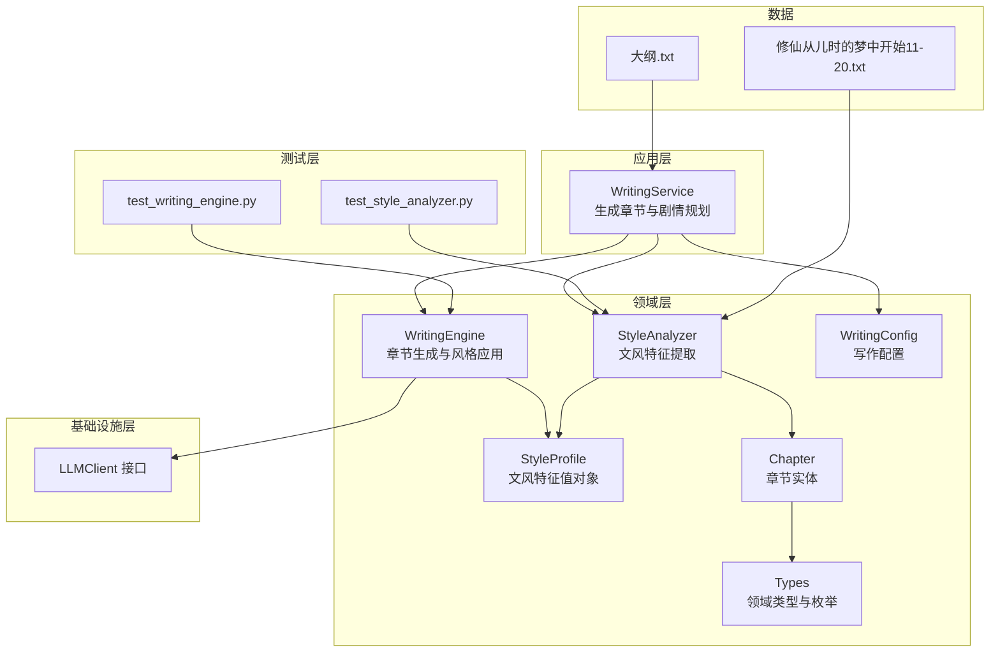
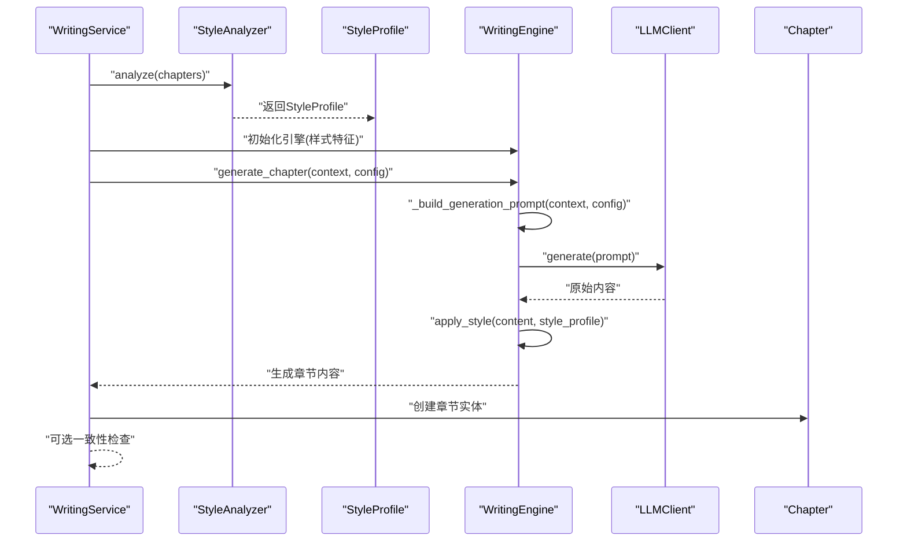
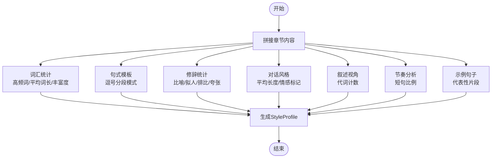
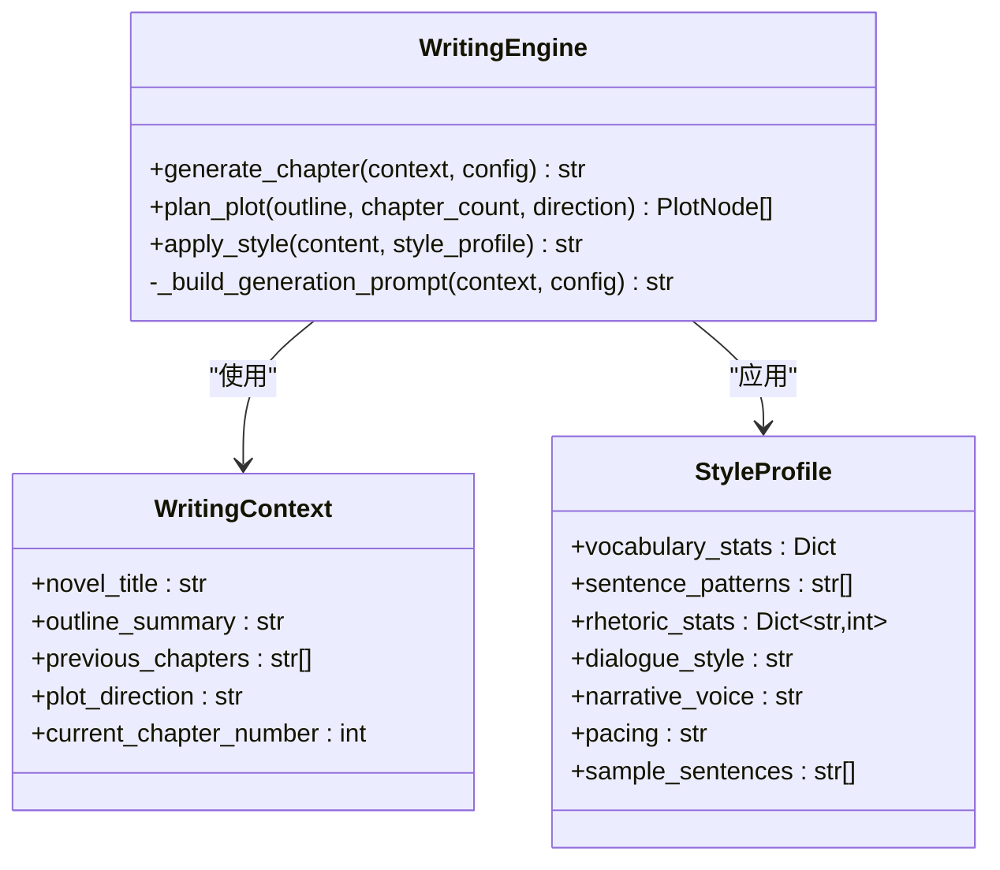
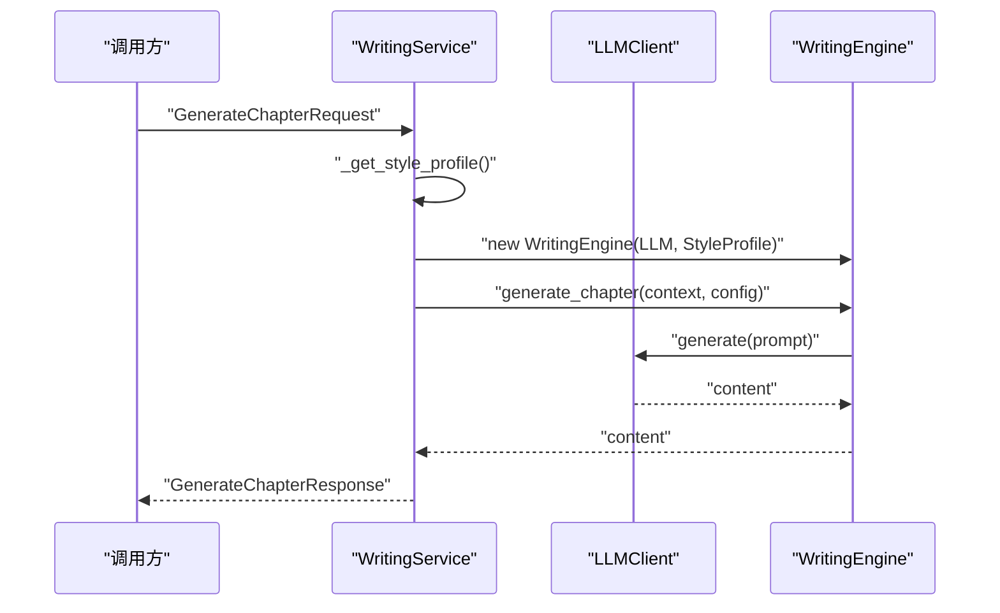
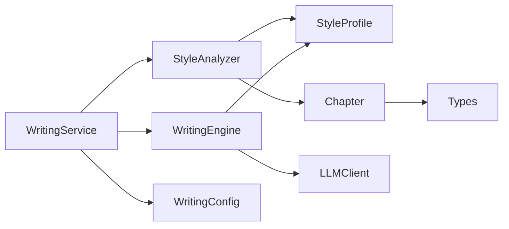

# 文风模仿算法

<cite>
**本文引用的文件**
- [style_profile.py](file://domain/value_objects/style_profile.py)
- [style_analyzer.py](file://domain/services/style_analyzer.py)
- [writing_engine.py](file://domain/services/writing_engine.py)
- [writing_config.py](file://domain/value_objects/writing_config.py)
- [chapter.py](file://domain/entities/chapter.py)
- [types.py](file://domain/types.py)
- [writing_service.py](file://application/services/writing_service.py)
- [base_client.py](file://infrastructure/llm/base_client.py)
- [test_style_analyzer.py](file://tests/unit/test_style_analyzer.py)
- [test_writing_engine.py](file://tests/unit/test_writing_engine.py)
- [大纲.txt](file://data/novel/大纲.txt)
- [修仙从儿时的梦中开始11-20.txt](file://data/novel/修仙从儿时的梦中开始11-20.txt)
</cite>

## 目录
1. [引言](#引言)
2. [项目结构](#项目结构)
3. [核心组件](#核心组件)
4. [架构总览](#架构总览)
5. [详细组件分析](#详细组件分析)
6. [依赖关系分析](#依赖关系分析)
7. [性能考量](#性能考量)
8. [故障排查指南](#故障排查指南)
9. [结论](#结论)
10. [附录](#附录)

## 引言
本技术文档围绕“文风模仿算法”展开，系统阐述如何从已有小说文本中提取风格特征，并将其转化为生成约束，从而在章节续写过程中保持与原文一致的写作风格。文档涵盖以下要点：
- StyleProfile值对象如何存储和表示小说的文风特征（词汇统计、句式模式、修辞手法、对话风格、叙述语调、节奏、示例句子）。
- StyleAnalyzer的分析算法与指标计算（词频分布、句长统计、修辞出现频率、对话风格、叙述视角、节奏）。
- WritingEngine中的文风模仿实现机制（如何将风格特征转化为生成约束，如何在章节生成过程中保持风格一致）。
- 文风分析的准确性和效果评估方法，以及针对不同类型小说的风格特征差异说明。

## 项目结构
本项目采用分层架构，领域层（domain）定义值对象、实体与服务；应用层（application）封装业务流程；基础设施层（infrastructure）提供大模型客户端接口；测试层（tests）验证算法与集成行为。

图表来源
- [writing_service.py:91-165](file://application/services/writing_service.py#L91-L165)
- [writing_engine.py:30-80](file://domain/services/writing_engine.py#L30-L80)
- [style_analyzer.py:25-66](file://domain/services/style_analyzer.py#L25-L66)
- [style_profile.py:14-30](file://domain/value_objects/style_profile.py#L14-L30)
- [writing_config.py:13-28](file://domain/value_objects/writing_config.py#L13-L28)
- [chapter.py:18-37](file://domain/entities/chapter.py#L18-L37)
- [types.py:15-107](file://domain/types.py#L15-L107)
- [base_client.py:14-83](file://infrastructure/llm/base_client.py#L14-L83)
- [test_style_analyzer.py:19-114](file://tests/unit/test_style_analyzer.py#L19-L114)
- [test_writing_engine.py:23-111](file://tests/unit/test_writing_engine.py#L23-L111)

章节来源
- [writing_service.py:91-165](file://application/services/writing_service.py#L91-L165)
- [writing_engine.py:30-80](file://domain/services/writing_engine.py#L30-L80)
- [style_analyzer.py:25-66](file://domain/services/style_analyzer.py#L25-L66)
- [style_profile.py:14-30](file://domain/value_objects/style_profile.py#L14-L30)
- [writing_config.py:13-28](file://domain/value_objects/writing_config.py#L13-L28)
- [chapter.py:18-37](file://domain/entities/chapter.py#L18-L37)
- [types.py:15-107](file://domain/types.py#L15-L107)
- [base_client.py:14-83](file://infrastructure/llm/base_client.py#L14-L83)
- [test_style_analyzer.py:19-114](file://tests/unit/test_style_analyzer.py#L19-L114)
- [test_writing_engine.py:23-111](file://tests/unit/test_writing_engine.py#L23-L111)

## 核心组件
- StyleProfile：不可变值对象，承载文风特征，包括词汇统计、句式模板、修辞统计、对话风格、叙述语调、节奏、示例句子等字段。
- StyleAnalyzer：领域服务，负责从章节文本中提取文风特征，产出StyleProfile。
- WritingEngine：领域服务，负责构建生成提示词、调用大模型生成内容，并在配置允许时应用文风约束。
- WritingConfig：不可变值对象，承载生成配置（目标字数、风格强度、温度、上下文章节数、一致性检查开关、风格模仿开关）。
- Chapter：实体，包含章节内容、状态、字数统计等属性。
- Types：领域类型与枚举（章节状态、剧情类型、剧情状态等），用于统一业务语义。

章节来源
- [style_profile.py:14-30](file://domain/value_objects/style_profile.py#L14-L30)
- [style_analyzer.py:18-66](file://domain/services/style_analyzer.py#L18-L66)
- [writing_engine.py:30-80](file://domain/services/writing_engine.py#L30-L80)
- [writing_config.py:13-28](file://domain/value_objects/writing_config.py#L13-L28)
- [chapter.py:18-42](file://domain/entities/chapter.py#L18-L42)
- [types.py:87-107](file://domain/types.py#L87-L107)

## 架构总览
文风模仿贯穿“分析—应用—生成”的闭环：
- 分析阶段：StyleAnalyzer基于章节集合提取词汇、句式、修辞、对话、叙述视角、节奏等特征，生成StyleProfile。
- 应用阶段：WritingEngine在生成提示词中注入风格约束，并在生成后根据配置对内容进行风格化处理。
- 生成阶段：通过LLMClient生成章节内容，WritingService协调仓库与一致性检查。

图表来源
- [writing_service.py:91-165](file://application/services/writing_service.py#L91-L165)
- [style_analyzer.py:25-66](file://domain/services/style_analyzer.py#L25-L66)
- [writing_engine.py:52-80](file://domain/services/writing_engine.py#L52-L80)
- [base_client.py:21-49](file://infrastructure/llm/base_client.py#L21-L49)

## 详细组件分析

### StyleProfile 值对象
- 字段说明
  - vocabulary_stats：词汇统计，包含高频词、平均词长、词汇丰富度、总词数、独立词数等。
  - sentence_patterns：句式模板，抽取具有代表性的句式组合模式。
  - rhetoric_stats：修辞统计，统计比喻、拟人、排比、夸张等修辞出现次数。
  - dialogue_style：对话风格，如“简洁/适中/详细，情感强烈/疑问较多/平和”。
  - narrative_voice：叙述语调，如“第一人称/第三人称/混合视角”。
  - pacing：节奏，如“快节奏/中等节奏/慢节奏”。
  - sample_sentences：示例句子，用于风格参考与一致性校验。
- 设计特性
  - 使用不可变数据类，保证风格特征在系统中可共享、可缓存、可比较。
  - 字段命名直观，便于前端与测试使用。

章节来源
- [style_profile.py:14-30](file://domain/value_objects/style_profile.py#L14-L30)

### StyleAnalyzer 分析算法
- 输入：章节列表（Chapter）
- 输出：StyleProfile
- 关键步骤
  - 词汇分析：提取中文词序列，统计高频词、平均词长、词汇丰富度、总词数、独立词数。
  - 句式分析：拆分句子，抽取包含逗号分段的典型句式模板（如“长度+逗号+长度+...”）。
  - 修辞分析：基于正则匹配统计比喻、拟人、排比、夸张等修辞出现次数。
  - 对话风格：统计引号内对话，计算平均长度与感叹号/问号比例，判定风格。
  - 叙述视角：统计“我/咱”与“他/她/它”出现次数，判定第一/第三人称倾向。
  - 节奏分析：按标点拆分句子，统计短句比例，判定快/中/慢节奏。
  - 示例句子：抽取若干代表性句子，用于风格参考。
- 边界与容错
  - 空章节列表返回默认值对象，避免空指针。
  - 正则匹配与统计均限定范围，避免过度消耗。

图表来源
- [style_analyzer.py:25-66](file://domain/services/style_analyzer.py#L25-L66)
- [style_analyzer.py:68-99](file://domain/services/style_analyzer.py#L68-L99)
- [style_analyzer.py:101-126](file://domain/services/style_analyzer.py#L101-L126)
- [style_analyzer.py:128-177](file://domain/services/style_analyzer.py#L128-L177)
- [style_analyzer.py:179-215](file://domain/services/style_analyzer.py#L179-L215)
- [style_analyzer.py:217-237](file://domain/services/style_analyzer.py#L217-L237)
- [style_analyzer.py:239-267](file://domain/services/style_analyzer.py#L239-L267)
- [style_analyzer.py:269-285](file://domain/services/style_analyzer.py#L269-L285)

章节来源
- [style_analyzer.py:25-66](file://domain/services/style_analyzer.py#L25-L66)
- [style_analyzer.py:68-99](file://domain/services/style_analyzer.py#L68-L99)
- [style_analyzer.py:101-126](file://domain/services/style_analyzer.py#L101-L126)
- [style_analyzer.py:128-177](file://domain/services/style_analyzer.py#L128-L177)
- [style_analyzer.py:179-215](file://domain/services/style_analyzer.py#L179-L215)
- [style_analyzer.py:217-237](file://domain/services/style_analyzer.py#L217-L237)
- [style_analyzer.py:239-267](file://domain/services/style_analyzer.py#L239-L267)
- [style_analyzer.py:269-285](file://domain/services/style_analyzer.py#L269-L285)

### WritingEngine 文风模仿实现
- 生成流程
  - 构建提示词：包含小说信息、大纲摘要、剧情方向、前文摘要、写作要求等。
  - 调用LLM：根据配置选择同步或异步生成。
  - 应用风格：在配置允许时，将StyleProfile中的特征转化为生成约束（当前实现预留，具体策略在后续版本完善）。
- 风格应用机制
  - 当前实现中，apply_style方法保留了对示例句子的引用入口，但未实现具体替换逻辑。
  - 建议在后续版本中引入“风格约束注入”策略：将高频词、句式模板、修辞统计、节奏偏好等映射为提示词约束或后处理规则。

图表来源
- [writing_engine.py:19-80](file://domain/services/writing_engine.py#L19-L80)
- [writing_engine.py:115-137](file://domain/services/writing_engine.py#L115-L137)
- [writing_engine.py:139-183](file://domain/services/writing_engine.py#L139-L183)

章节来源
- [writing_engine.py:30-80](file://domain/services/writing_engine.py#L30-L80)
- [writing_engine.py:115-137](file://domain/services/writing_engine.py#L115-L137)
- [writing_engine.py:139-183](file://domain/services/writing_engine.py#L139-L183)

### WritingService 与 LLM 客户端集成
- WritingService负责：
  - 读取小说与章节，构建WritingContext与WritingConfig。
  - 调用WritingEngine生成章节内容。
  - 可选执行一致性检查。
- LLMClient接口定义了标准的generate与chat方法，支持异步生成与可用性检测。

图表来源
- [writing_service.py:91-165](file://application/services/writing_service.py#L91-L165)
- [base_client.py:21-49](file://infrastructure/llm/base_client.py#L21-L49)

章节来源
- [writing_service.py:91-165](file://application/services/writing_service.py#L91-L165)
- [base_client.py:14-83](file://infrastructure/llm/base_client.py#L14-L83)

## 依赖关系分析
- 耦合与内聚
  - StyleAnalyzer与Chapter、StyleProfile耦合良好，职责单一，内聚度高。
  - WritingEngine依赖StyleProfile与LLMClient，通过配置控制风格应用，边界清晰。
  - WritingService协调仓库、引擎与一致性检查，处于应用层协调中枢。
- 外部依赖
  - LLMClient抽象屏蔽底层模型差异，便于替换与扩展。
  - 测试通过Mock验证引擎与分析器行为，降低集成成本。

图表来源
- [style_analyzer.py:14-16](file://domain/services/style_analyzer.py#L14-L16)
- [writing_engine.py:13-16](file://domain/services/writing_engine.py#L13-L16)
- [writing_service.py:19-24](file://application/services/writing_service.py#L19-L24)
- [chapter.py:14-16](file://domain/entities/chapter.py#L14-L16)
- [types.py:15-12](file://domain/types.py#L15-L12)

章节来源
- [style_analyzer.py:14-16](file://domain/services/style_analyzer.py#L14-L16)
- [writing_engine.py:13-16](file://domain/services/writing_engine.py#L13-L16)
- [writing_service.py:19-24](file://application/services/writing_service.py#L19-L24)
- [chapter.py:14-16](file://domain/entities/chapter.py#L14-L16)
- [types.py:15-12](file://domain/types.py#L15-L12)

## 性能考量
- 计算复杂度
  - 词汇统计：O(n)，n为词数；句式模板抽取O(m)，m为句子数；修辞统计O(k)，k为文本长度。
  - 正则匹配与计数为线性扫描，整体复杂度可控。
- 内存与缓存
  - StyleProfile为不可变值对象，适合缓存与复用。
  - WritingService内部缓存StyleProfile，减少重复分析。
- I/O与上下文
  - LLM调用受上下文长度限制，WritingService仅传递最近N章摘要，避免超限。
- 并发与异步
  - LLMClient支持异步generate，WritingEngine在调用时使用异步运行时，提升吞吐。

[本节为通用性能建议，无需特定文件引用]

## 故障排查指南
- 分析阶段
  - 空章节列表：StyleAnalyzer返回默认值对象，检查输入是否为空。
  - 无中文文本：词汇统计为空，需确认文本编码与分词策略。
- 生成阶段
  - LLM不可用：检查is_available与模型配置。
  - 上下文超限：减少previous_chapters数量或缩短提示词。
- 风格应用
  - apply_style未生效：确认enable_style_mimicry开关与后续实现是否完善。
- 单元测试
  - 使用测试用例验证分析器与引擎行为，定位边界条件与异常分支。

章节来源
- [test_style_analyzer.py:42-114](file://tests/unit/test_style_analyzer.py#L42-L114)
- [test_writing_engine.py:58-111](file://tests/unit/test_writing_engine.py#L58-L111)
- [writing_engine.py:77-79](file://domain/services/writing_engine.py#L77-L79)

## 结论
本项目通过StyleProfile与StyleAnalyzer实现了对小说文风的量化刻画，结合WritingEngine与WritingService完成了从风格提取到生成约束的应用闭环。当前实现已具备稳定的分析与生成能力，风格应用策略可在后续版本中进一步完善，以实现更精细的文风一致性控制与效果评估。

[本节为总结性内容，无需特定文件引用]

## 附录

### 文风分析指标与实现要点
- 词汇统计：高频词、平均词长、词汇丰富度、总词数、独立词数。
- 句式模式：逗号分段的典型句式模板，限制返回数量避免冗余。
- 修辞统计：比喻、拟人、排比、夸张的正则匹配与计数。
- 对话风格：引号内对话的平均长度与情感标记比例。
- 叙述语调：代词计数判定第一/第三人称倾向。
- 节奏：短句比例判定快/中/慢节奏。
- 示例句子：代表性片段，用于风格参考。

章节来源
- [style_analyzer.py:68-99](file://domain/services/style_analyzer.py#L68-L99)
- [style_analyzer.py:101-126](file://domain/services/style_analyzer.py#L101-L126)
- [style_analyzer.py:128-177](file://domain/services/style_analyzer.py#L128-L177)
- [style_analyzer.py:179-215](file://domain/services/style_analyzer.py#L179-L215)
- [style_analyzer.py:217-237](file://domain/services/style_analyzer.py#L217-L237)
- [style_analyzer.py:239-267](file://domain/services/style_analyzer.py#L239-L267)
- [style_analyzer.py:269-285](file://domain/services/style_analyzer.py#L269-L285)

### 不同类型小说的风格特征差异
- 依据大纲与示例文本，现代修真类作品常见特征：
  - 词汇：偏向现代口语与修真术语结合，高频词多与人物、场景、功法相关。
  - 句式：夹叙夹议，短句与长句交替，增强节奏感。
  - 修辞：比喻、拟人、夸张常见，强化画面感与情感渲染。
  - 对话：简洁或情感强烈，取决于角色与情境。
  - 叙述语调：第三人称为主，兼顾人物视角切换。
  - 节奏：快节奏推进主线，关键节点放缓。
- 其他题材（如历史、科幻、悬疑）可参考相应模板与示例文本，调整分析权重与阈值。

章节来源
- [大纲.txt:1-20](file://data/novel/大纲.txt#L1-L20)
- [修仙从儿时的梦中开始11-20.txt:1-30](file://data/novel/修仙从儿时的梦中开始11-20.txt#L1-L30)