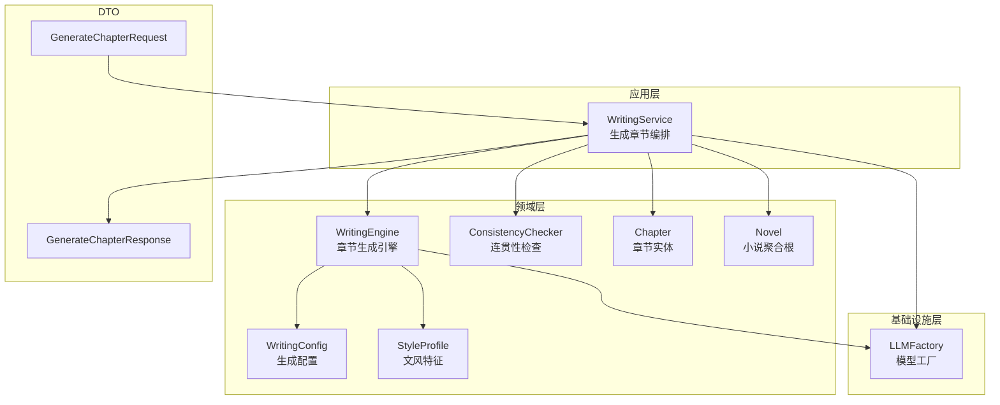
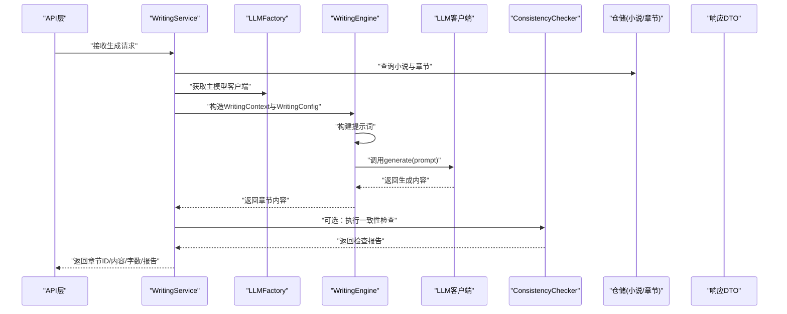
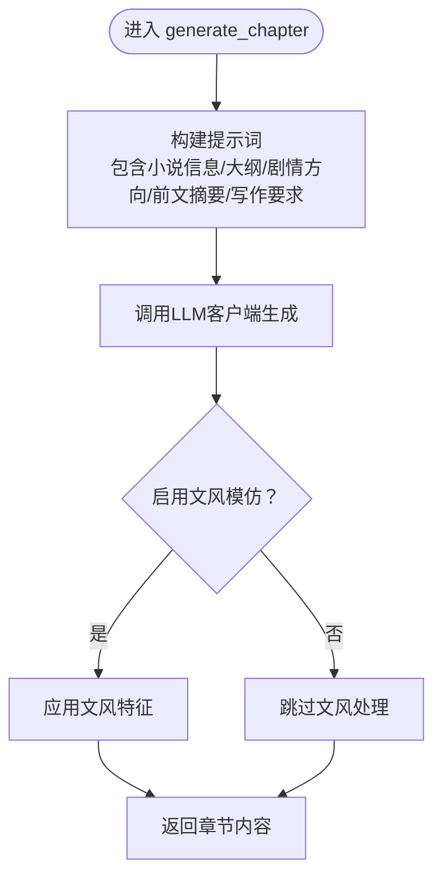
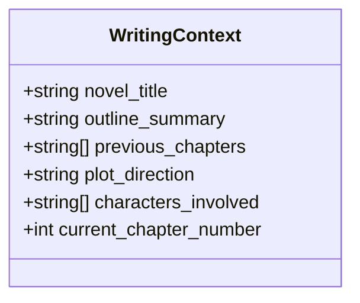
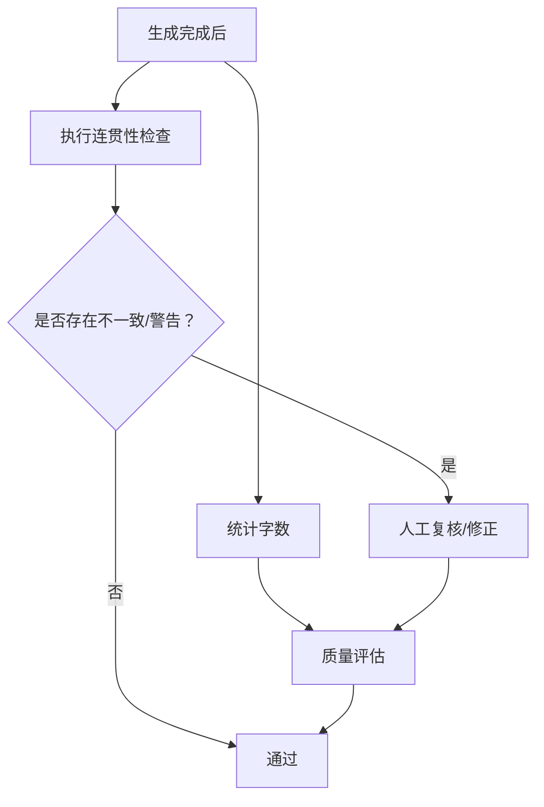
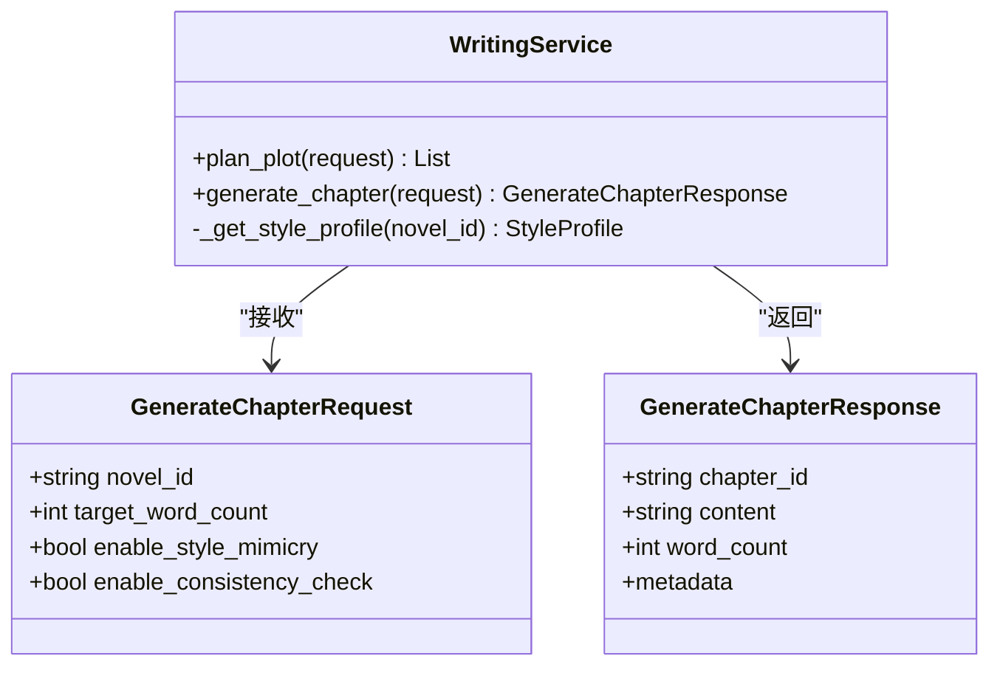
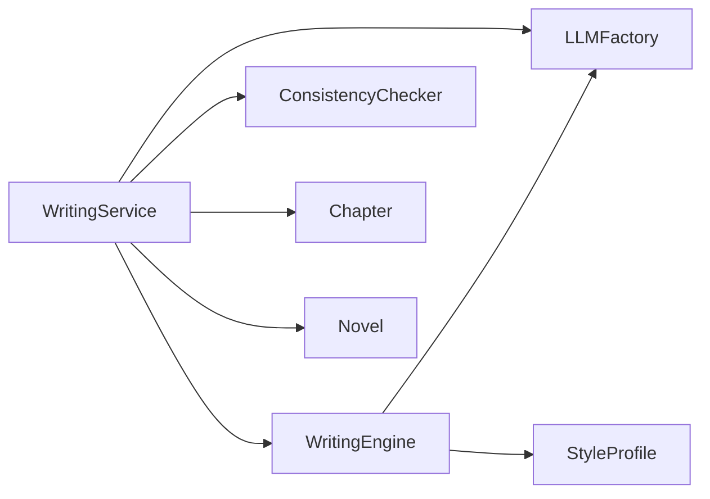

# 章节生成流程

<cite>
**本文引用的文件**
- [writing_engine.py](file://domain/services/writing_engine.py)
- [writing_service.py](file://application/services/writing_service.py)
- [writing_config.py](file://domain/value_objects/writing_config.py)
- [style_profile.py](file://domain/value_objects/style_profile.py)
- [chapter.py](file://domain/entities/chapter.py)
- [novel.py](file://domain/entities/novel.py)
- [llm_factory.py](file://infrastructure/llm/llm_factory.py)
- [consistency_checker.py](file://domain/services/consistency_checker.py)
- [request_dto.py](file://application/dto/request_dto.py)
- [response_dto.py](file://application/dto/response_dto.py)
- [test_writing_engine.py](file://tests/unit/test_writing_engine.py)
- [README.md](file://README.md)
</cite>

## 目录
1. [引言](#引言)
2. [项目结构](#项目结构)
3. [核心组件](#核心组件)
4. [架构总览](#架构总览)
5. [详细组件分析](#详细组件分析)
6. [依赖分析](#依赖分析)
7. [性能考虑](#性能考虑)
8. [故障排查指南](#故障排查指南)
9. [结论](#结论)
10. [附录](#附录)

## 引言
本技术文档围绕“章节生成流程”展开，聚焦于领域服务 WritingEngine 的 generate_chapter 方法，系统性阐述从 WritingContext 上下文构建、提示词工程、AI 模型调用、内容生成与后处理，到质量评估与常见问题的全流程。文档旨在帮助开发者与产品人员快速理解并高效迭代章节生成能力。

## 项目结构
InkTrace Novel AI 采用清洁架构分层组织：
- 领域层（domain）：实体、值对象、领域服务与仓库接口，承载业务语义与规则
- 应用层（application）：应用服务编排业务流程，协调领域与基础设施
- 基础设施层（infrastructure）：LLM 客户端、持久化、文件处理等
- 表现层（presentation）：API 路由与依赖注入
- 测试（tests）：覆盖核心流程与边界条件

图表来源
- [writing_service.py:91-165](file://application/services/writing_service.py#L91-L165)
- [writing_engine.py:30-80](file://domain/services/writing_engine.py#L30-L80)
- [writing_config.py:13-28](file://domain/value_objects/writing_config.py#L13-L28)
- [style_profile.py:14-30](file://domain/value_objects/style_profile.py#L14-L30)
- [consistency_checker.py:37-87](file://domain/services/consistency_checker.py#L37-L87)
- [llm_factory.py:31-121](file://infrastructure/llm/llm_factory.py#L31-L121)
- [request_dto.py:45-54](file://application/dto/request_dto.py#L45-L54)
- [response_dto.py:86-99](file://application/dto/response_dto.py#L86-L99)

章节来源
- [README.md:72-106](file://README.md#L72-L106)

## 核心组件
- WritingEngine：负责构建提示词、调用 LLM、应用文风、返回章节内容
- WritingContext：承载小说标题、大纲摘要、前文摘要、剧情方向等上下文
- WritingConfig：控制目标字数、风格强度、温度、上下文章节数量、一致性检查与文风模仿开关
- LLMFactory：主备模型切换与客户端获取
- ConsistencyChecker：生成后进行人物状态、时间线、剧情连贯性检查
- Chapter/Novel：章节与小说聚合根，用于字数统计与上下文提取

章节来源
- [writing_engine.py:19-80](file://domain/services/writing_engine.py#L19-L80)
- [writing_config.py:13-28](file://domain/value_objects/writing_config.py#L13-L28)
- [llm_factory.py:31-121](file://infrastructure/llm/llm_factory.py#L31-L121)
- [consistency_checker.py:37-87](file://domain/services/consistency_checker.py#L37-L87)
- [chapter.py:18-42](file://domain/entities/chapter.py#L18-L42)
- [novel.py:20-40](file://domain/entities/novel.py#L20-L40)

## 架构总览
章节生成的端到端流程如下：

图表来源
- [writing_service.py:91-165](file://application/services/writing_service.py#L91-L165)
- [writing_engine.py:52-80](file://domain/services/writing_engine.py#L52-L80)
- [llm_factory.py:78-95](file://infrastructure/llm/llm_factory.py#L78-L95)
- [consistency_checker.py:44-87](file://domain/services/consistency_checker.py#L44-L87)

## 详细组件分析

### WritingEngine.generate_chapter 完整实现
- 输入
  - context: WritingContext（包含小说标题、大纲摘要、前文摘要、剧情方向等）
  - config: WritingConfig（目标字数、温度、风格强度、上下文章节数、一致性检查、文风模仿）
- 步骤
  1) 构建提示词：调用内部方法生成结构化提示词，包含小说信息、大纲摘要、剧情方向、最近章节摘要、写作要求与输出指令
  2) 调用 LLM：根据客户端是否支持异步 generate 选择同步或异步调用
  3) 文风应用：若开启风格模仿，则调用 apply_style 应用文风特征（当前实现预留，具体映射逻辑可在后续完善）
  4) 返回内容：直接返回生成内容
- 关键点
  - 提示词工程：明确“字数约X字”“保持文风一致，延续剧情发展”，并要求直接输出正文
  - 上下文截断：最多取最近 N 章摘要，避免上下文过长
  - 温度与最大 token：当前实现未在引擎内直接设置，温度等参数建议通过 LLM 客户端或工厂配置传递

图表来源
- [writing_engine.py:52-80](file://domain/services/writing_engine.py#L52-L80)
- [writing_engine.py:139-183](file://domain/services/writing_engine.py#L139-L183)

章节来源
- [writing_engine.py:52-80](file://domain/services/writing_engine.py#L52-L80)
- [writing_engine.py:139-183](file://domain/services/writing_engine.py#L139-L183)

### WritingContext 上下文机制
- 字段作用
  - novel_title：决定提示词中的小说信息
  - outline_summary：提供故事背景与主线前提
  - previous_chapters：最近 N 章摘要，帮助维持连贯性
  - plot_direction：指导剧情发展方向
  - characters_involved/current_chapter_number：预留字段，便于后续角色与章节编号增强
- 影响
  - 上下文越丰富，生成内容与历史更一致，风格更稳定
  - 建议：在应用层根据小说与章节仓储提取最近 N 章摘要，避免一次性传入过多上下文导致 token 超限

图表来源
- [writing_engine.py:19-28](file://domain/services/writing_engine.py#L19-L28)

章节来源
- [writing_engine.py:19-28](file://domain/services/writing_engine.py#L19-L28)

### AI 模型调用与提示词工程
- 调用方式
  - 若客户端支持异步 generate，则使用 asyncio 运行；否则直接调用
- 提示词结构
  - 小说信息、大纲摘要、剧情方向、前文摘要、写作要求、章节内容输出指令
- 参数建议
  - 温度：0.6~0.8 平衡创造性与稳定性；过高易漂移，过低易刻板
  - 最大 token：结合上下文长度与目标字数估算，确保生成内容可达预期字数
  - 上下文章节数：默认取最近 3~5 章摘要，避免超长上下文
- 当前实现注意
  - 温度、最大 token 等参数未在引擎内硬编码，建议通过 LLM 客户端或工厂配置传递

章节来源
- [writing_engine.py:69-76](file://domain/services/writing_engine.py#L69-L76)
- [writing_engine.py:139-183](file://domain/services/writing_engine.py#L139-L183)
- [writing_service.py:124-128](file://application/services/writing_service.py#L124-L128)

### 生成内容的预处理与后处理
- 预处理
  - 上下文摘要：仅保留最近 N 章摘要，避免上下文冗余
  - 提示词规范化：统一标签与换行，确保模型解析稳定
- 后处理
  - 字数统计：章节实体提供字数属性，便于质量评估
  - 格式规范化：建议在应用层增加统一的段落与标点处理（当前引擎未实现，可在后续扩展）
  - 风格一致性：apply_style 作为占位，后续可接入样本句、句式模板、修辞统计等

章节来源
- [writing_engine.py:169-171](file://domain/services/writing_engine.py#L169-L171)
- [writing_engine.py:115-137](file://domain/services/writing_engine.py#L115-L137)
- [chapter.py:38-41](file://domain/entities/chapter.py#L38-L41)

### 连贯性检查与质量评估
- 连贯性检查
  - 人物状态：检查修为/境界是否存在倒退或跳级
  - 时间线：检查章节顺序与事件先后
  - 剧情连贯性：与已有章节对比，发现潜在矛盾
- 质量评估指标
  - 字数控制精度：目标字数 ±10% 以内视为合格
  - 内容相关性：与大纲摘要、剧情方向匹配度（可引入相似度评分）
  - 风格一致性：与文风特征的匹配程度（词汇、句式、修辞统计）
  - 逻辑一致性：人物状态、时间线、伏笔回收无冲突
- 响应结构
  - 返回章节 ID、内容、字数、可选的连贯性检查报告

图表来源
- [consistency_checker.py:44-87](file://domain/services/consistency_checker.py#L44-L87)
- [chapter.py:38-41](file://domain/entities/chapter.py#L38-L41)
- [writing_service.py:144-159](file://application/services/writing_service.py#L144-L159)

章节来源
- [consistency_checker.py:37-218](file://domain/services/consistency_checker.py#L37-L218)
- [writing_service.py:144-159](file://application/services/writing_service.py#L144-L159)

### 应用层编排与 DTO
- WritingService.generate_chapter
  - 读取小说与章节，构造 WritingContext 与 WritingConfig
  - 获取 LLM 客户端，调用 WritingEngine 生成内容
  - 可选执行一致性检查，组装响应 DTO
- 请求/响应 DTO
  - GenerateChapterRequest：包含小说ID、目标字数、是否启用风格模仿/一致性检查等
  - GenerateChapterResponse：包含章节ID、内容、字数、可选元数据

图表来源
- [writing_service.py:91-165](file://application/services/writing_service.py#L91-L165)
- [request_dto.py:45-54](file://application/dto/request_dto.py#L45-L54)
- [response_dto.py:86-99](file://application/dto/response_dto.py#L86-L99)

章节来源
- [writing_service.py:91-165](file://application/services/writing_service.py#L91-L165)
- [request_dto.py:45-54](file://application/dto/request_dto.py#L45-L54)
- [response_dto.py:86-99](file://application/dto/response_dto.py#L86-L99)

## 依赖分析
- 组件耦合
  - WritingEngine 依赖 LLM 客户端与 StyleProfile，关注点清晰
  - WritingService 负责上下文构建与流程编排，依赖仓储与工厂
  - ConsistencyChecker 与 Chapter/Novel 实体交互，形成稳定的领域规则
- 外部依赖
  - LLMFactory 提供主备模型切换，提升可用性
  - DTO 层隔离应用层与表现层的数据契约

图表来源
- [writing_service.py:37-46](file://application/services/writing_service.py#L37-L46)
- [writing_engine.py:39-50](file://domain/services/writing_engine.py#L39-L50)
- [llm_factory.py:31-121](file://infrastructure/llm/llm_factory.py#L31-L121)

章节来源
- [writing_service.py:37-46](file://application/services/writing_service.py#L37-L46)
- [writing_engine.py:39-50](file://domain/services/writing_engine.py#L39-L50)
- [llm_factory.py:31-121](file://infrastructure/llm/llm_factory.py#L31-L121)

## 性能考虑
- 上下文长度控制：限制最近 N 章摘要，避免 token 超限
- 模型切换：主模型不可用时快速切换备用模型，保障可用性
- 异步调用：当 LLM 客户端支持异步 generate 时，使用异步以提升吞吐
- 字数控制：通过提示词明确目标字数，减少二次修正成本

## 故障排查指南
- 生成内容为空或异常
  - 检查 LLM 客户端可用性与密钥配置
  - 确认提示词结构完整，特别是“章节内容”输出指令
- 字数偏差较大
  - 调整目标字数与最大 token，确保生成空间充足
  - 在应用层增加后处理以微调字数
- 风格不一致
  - 确认 StyleProfile 已正确加载
  - 适当提高风格强度参数
- 连贯性告警
  - 依据检查报告逐项复核人物状态、时间线与剧情节点
  - 必要时回滚并修正历史章节

章节来源
- [llm_factory.py:78-121](file://infrastructure/llm/llm_factory.py#L78-L121)
- [consistency_checker.py:44-87](file://domain/services/consistency_checker.py#L44-L87)
- [writing_engine.py:115-137](file://domain/services/writing_engine.py#L115-L137)

## 结论
章节生成流程以 WritingEngine 为核心，结合 WritingContext 与 WritingConfig 构建高质量提示词，通过 LLMFactory 提供的主备模型保障稳定性，并在应用层完成上下文构建与一致性检查。建议在后续迭代中完善 apply_style 的具体实现、增加格式后处理与质量评估指标，以进一步提升生成内容的稳定性与可读性。

## 附录
- 生成示例（概念性）
  - 输入：小说标题“修仙从逃出生天开始”、大纲摘要“现代都市背景下的修仙体系”、剧情方向“主角突破筑基期”、最近 3 章摘要、目标字数 2100
  - 输出：章节内容（直接正文），字数约 2100，风格与原文一致，通过连贯性检查
- 常见问题
  - 提示词过长导致 token 超限：减少最近章节摘要数量或缩短摘要长度
  - 生成内容偏离主题：强化“保持文风一致，延续剧情发展”的指令
  - 模型不稳定：利用 LLMFactory 的主备切换机制

章节来源
- [writing_engine.py:139-183](file://domain/services/writing_engine.py#L139-L183)
- [writing_service.py:117-122](file://application/services/writing_service.py#L117-L122)
- [llm_factory.py:78-121](file://infrastructure/llm/llm_factory.py#L78-L121)
- [test_writing_engine.py:58-75](file://tests/unit/test_writing_engine.py#L58-L75)