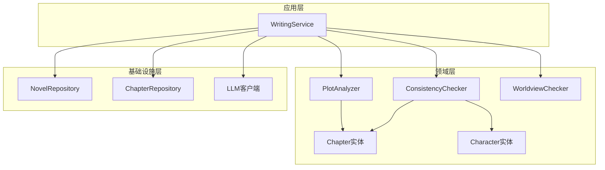
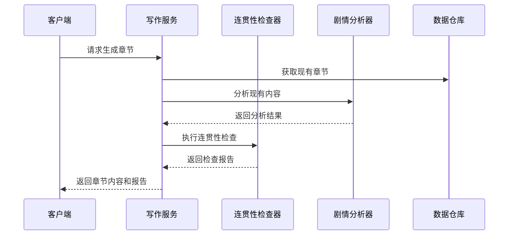
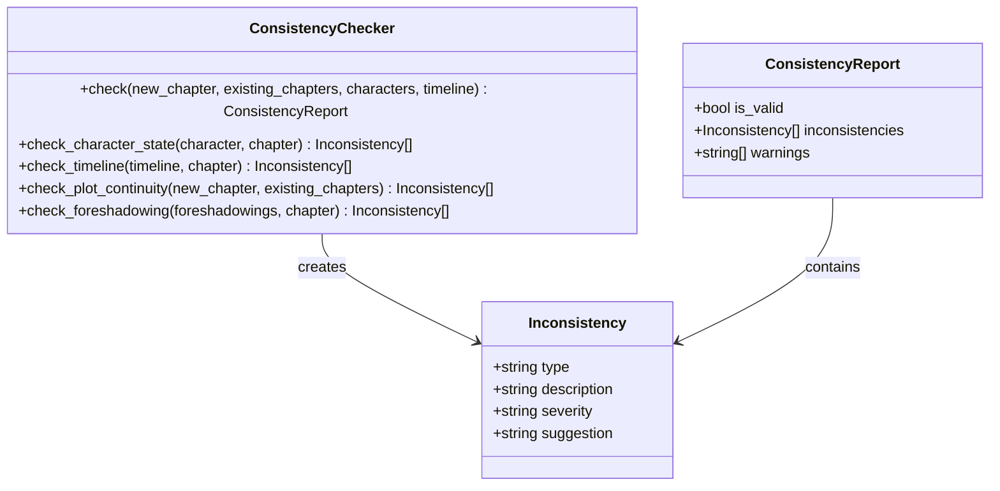
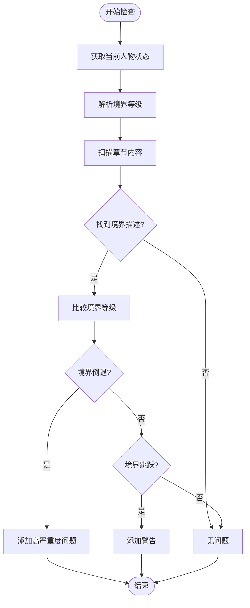
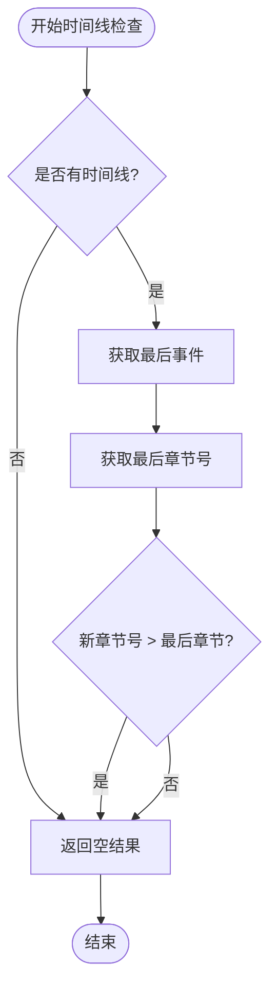
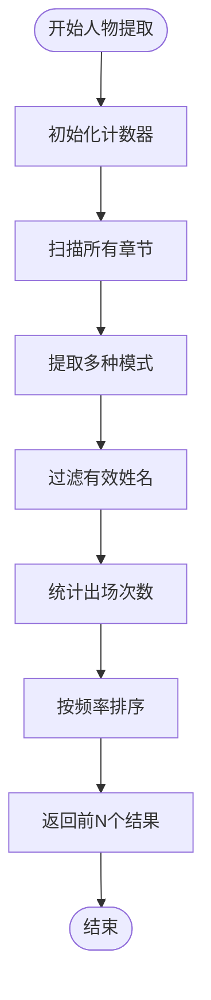
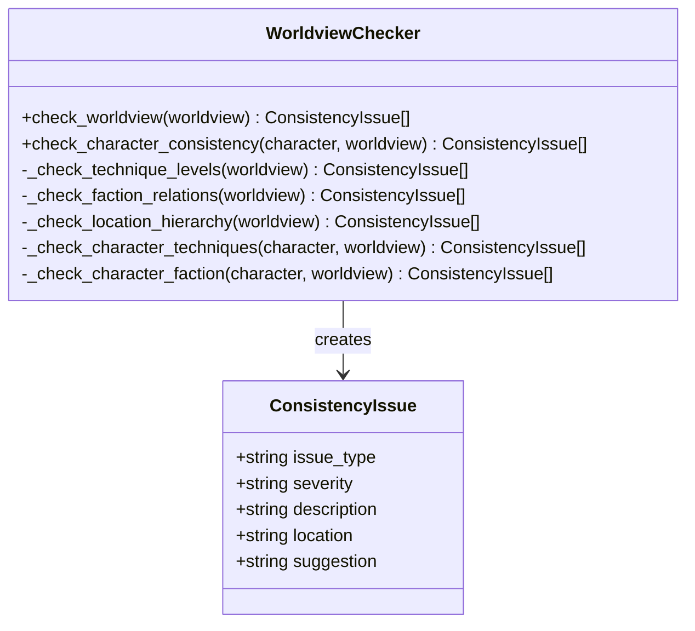
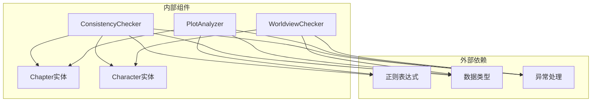
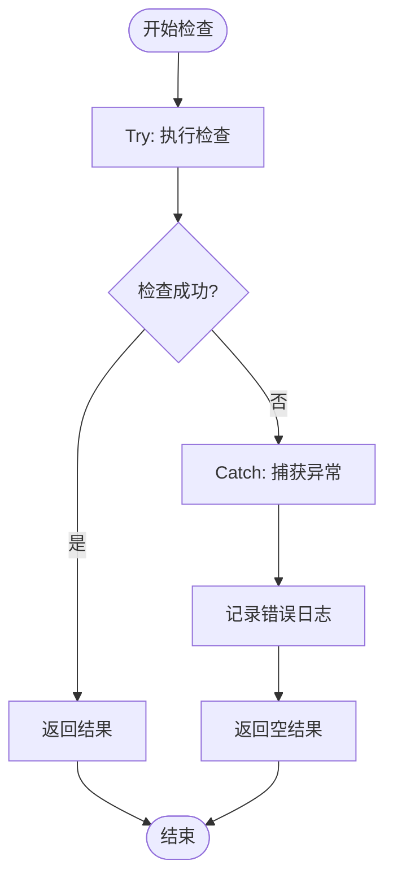

# 连贯性检查系统

<cite>
**本文档引用的文件**
- [consistency_checker.py](file://domain/services/consistency_checker.py)
- [test_consistency_checker.py](file://tests/unit/test_consistency_checker.py)
- [chapter.py](file://domain/entities/chapter.py)
- [character.py](file://domain/entities/character.py)
- [plot_analyzer.py](file://domain/services/plot_analyzer.py)
- [types.py](file://domain/types.py)
- [exceptions.py](file://domain/exceptions.py)
- [writing_service.py](file://application/services/writing_service.py)
- [worldview_checker.py](file://domain/services/worldview_checker.py)
</cite>

## 目录
1. [简介](#简介)
2. [项目结构](#项目结构)
3. [核心组件](#核心组件)
4. [架构概览](#架构概览)
5. [详细组件分析](#详细组件分析)
6. [依赖分析](#依赖分析)
7. [性能考虑](#性能考虑)
8. [故障排除指南](#故障排除指南)
9. [结论](#结论)
10. [附录](#附录)

## 简介
本系统是一个面向小说创作的连贯性检查领域服务，旨在帮助作者发现并修正创作过程中的逻辑矛盾、人物状态不一致、时间线混乱等问题。系统通过分析章节内容、人物状态、时间线和剧情连续性，提供结构化的检查报告和改进建议。

## 项目结构
系统采用分层架构设计，主要分为以下层次：
- 领域层：包含核心业务逻辑和数据模型
- 应用层：提供对外服务接口
- 基础设施层：处理外部依赖和存储

**图表来源**
- [writing_service.py:30-180](file://application/services/writing_service.py#L30-L180)
- [consistency_checker.py:37-218](file://domain/services/consistency_checker.py#L37-L218)
- [plot_analyzer.py:46-225](file://domain/services/plot_analyzer.py#L46-L225)

**章节来源**
- [writing_service.py:30-180](file://application/services/writing_service.py#L30-L180)
- [consistency_checker.py:37-218](file://domain/services/consistency_checker.py#L37-L218)

## 核心组件
系统的核心由三个主要组件构成：

### 1. 连贯性检查器 (ConsistencyChecker)
负责执行具体的连贯性检查任务，支持多种检查维度：
- 人物状态一致性检查
- 时间线准确性验证
- 剧情连续性分析
- 伏笔回收检查

### 2. 剧情分析器 (PlotAnalyzer)
从现有章节中提取关键信息：
- 人物识别和统计
- 时间线构建
- 伏笔提取

### 3. 世界观检查器 (WorldviewChecker)
验证小说世界观的内在一致性：
- 功法等级检查
- 势力关系验证
- 地点层级校验

**章节来源**
- [consistency_checker.py:37-218](file://domain/services/consistency_checker.py#L37-L218)
- [plot_analyzer.py:46-225](file://domain/services/plot_analyzer.py#L46-L225)
- [worldview_checker.py:29-160](file://domain/services/worldview_checker.py#L29-L160)

## 架构概览
系统采用服务导向架构，通过清晰的职责分离实现高内聚低耦合：

**图表来源**
- [writing_service.py:91-165](file://application/services/writing_service.py#L91-L165)
- [consistency_checker.py:44-87](file://domain/services/consistency_checker.py#L44-L87)
- [plot_analyzer.py:55-75](file://domain/services/plot_analyzer.py#L55-L75)

## 详细组件分析

### 连贯性检查器 (ConsistencyChecker)

#### 数据结构设计
系统使用数据类来封装检查结果，确保类型安全和清晰的接口定义：

**图表来源**
- [consistency_checker.py:18-35](file://domain/services/consistency_checker.py#L18-L35)
- [consistency_checker.py:37-218](file://domain/services/consistency_checker.py#L37-L218)

#### 检查算法实现

##### 人物状态一致性检查
系统实现了修真小说特有的境界检查机制：

**图表来源**
- [consistency_checker.py:89-140](file://domain/services/consistency_checker.py#L89-L140)

##### 时间线检查机制
系统通过章节编号验证时间线的逻辑顺序：

**图表来源**
- [consistency_checker.py:142-170](file://domain/services/consistency_checker.py#L142-L170)

#### 检查规则设计原理

##### 逻辑矛盾推断机制
系统通过模式匹配和正则表达式实现智能检查：
- 使用境界关键词模式识别人物修为变化
- 通过章节编号验证时间顺序
- 基于历史数据推断潜在矛盾

##### 人物性格一致性验证
虽然当前版本主要关注修为状态，但设计上预留了扩展空间：
- 支持自定义检查规则
- 可扩展到人物行为模式分析
- 支持多维度状态跟踪

##### 事件顺序验证
系统通过章节编号和时间标记验证事件发生的合理顺序：
- 自然顺序检查
- 时间标记验证
- 上下文关联分析

**章节来源**
- [consistency_checker.py:89-196](file://domain/services/consistency_checker.py#L89-L196)

### 剧情分析器 (PlotAnalyzer)

#### 人物提取算法
系统使用多种正则表达式模式提取人物信息：

**图表来源**
- [plot_analyzer.py:77-119](file://domain/services/plot_analyzer.py#L77-L119)

#### 时间线构建机制
系统通过时间词汇识别构建故事时间线：

| 时间模式 | 示例 | 用途 |
|---------|------|------|
| 数字+单位 | 第1天、第2月 | 具体时间点 |
| 相对时间 | 明天、后天 | 相对时间关系 |
| 今日概念 | 今天、昨天 | 日常时间表达 |
| 未来时间 | 3天后、1年后 | 时间跨度 |

**章节来源**
- [plot_analyzer.py:121-168](file://domain/services/plot_analyzer.py#L121-L168)

### 世界观检查器 (WorldviewChecker)

#### 一致性检查体系
系统提供多层次的世界观一致性检查：

**图表来源**
- [worldview_checker.py:19-160](file://domain/services/worldview_checker.py#L19-L160)

**章节来源**
- [worldview_checker.py:29-160](file://domain/services/worldview_checker.py#L29-L160)

## 依赖分析

### 组件间依赖关系
系统各组件之间保持清晰的依赖关系：

**图表来源**
- [consistency_checker.py:10-15](file://domain/services/consistency_checker.py#L10-L15)
- [plot_analyzer.py:10-16](file://domain/services/plot_analyzer.py#L10-L16)
- [worldview_checker.py:10-16](file://domain/services/worldview_checker.py#L10-L16)

### 数据类型依赖
系统使用强类型设计确保数据完整性：

| 类型 | 用途 | 关键字段 |
|------|------|----------|
| ChapterId | 章节标识 | 字符串值 |
| CharacterId | 人物标识 | 字符串值 |
| NovelId | 小说标识 | 字符串值 |
| ChapterStatus | 章节状态 | draft/published |
| CharacterRole | 人物角色 | protagonist/antagonist/supporting |

**章节来源**
- [types.py:15-116](file://domain/types.py#L15-L116)

## 性能考虑

### 算法复杂度分析
- **人物状态检查**：O(n*m)，其中n为章节数量，m为境界关键词数量
- **时间线检查**：O(k)，k为时间线事件数量
- **剧情分析**：O(p*q)，p为章节数量，q为每章平均字符数
- **正则表达式匹配**：取决于模式复杂度和文本长度

### 优化策略
1. **缓存机制**：对频繁使用的分析结果进行缓存
2. **增量更新**：只对新增或修改的内容进行检查
3. **并行处理**：利用多线程处理独立的检查任务
4. **内存管理**：及时释放不再使用的中间结果

## 故障排除指南

### 常见问题诊断

#### 检查结果不准确
**可能原因**：
- 正则表达式模式不够精确
- 章节内容格式不符合预期
- 人物状态描述不规范

**解决方法**：
- 调整正则表达式模式
- 标准化内容格式
- 提供更详细的检查规则

#### 性能问题
**症状**：检查过程耗时过长

**解决方案**：
- 实施分页检查
- 添加进度反馈
- 优化正则表达式性能

#### 异常处理
系统提供了完善的异常处理机制：

**图表来源**
- [exceptions.py:11-100](file://domain/exceptions.py#L11-L100)

**章节来源**
- [exceptions.py:11-100](file://domain/exceptions.py#L11-L100)

## 结论
连贯性检查系统通过模块化设计实现了小说创作质量保障的重要功能。系统具有以下特点：

### 优势
- **模块化设计**：职责清晰，易于维护和扩展
- **强类型支持**：编译时错误检测，提高代码质量
- **灵活的检查机制**：支持多种检查维度和自定义规则
- **完整的异常处理**：提供健壮的错误处理机制

### 局限性
- **规则覆盖范围有限**：当前主要关注修真小说特定场景
- **上下文理解不足**：缺乏深度语义分析能力
- **性能优化空间**：大规模文本处理需要进一步优化

### 改进建议
1. **增强语义理解**：集成自然语言处理技术
2. **扩展检查规则**：支持更多小说类型和风格
3. **优化性能**：实施增量检查和缓存机制
4. **增强可视化**：提供更直观的检查结果展示

## 附录

### 检查报告生成机制
系统通过统一的数据结构生成结构化的检查报告：

| 报告字段 | 类型 | 描述 |
|----------|------|------|
| is_valid | bool | 检查是否通过 |
| inconsistencies | List[Inconsistency] | 不一致项列表 |
| warnings | List[string] | 警告信息列表 |

### 不一致性分类体系
系统采用三层分类体系：

| 严重程度 | 描述 | 示例 | 处理建议 |
|----------|------|------|----------|
| 高 | 严重逻辑矛盾，影响故事完整性 | 修为倒退、关键事件缺失 | 立即修改，重新创作相关章节 |
| 中 | 重要但非致命的问题 | 人物状态不一致、时间线小冲突 | 评估影响，决定是否修改 |
| 低 | 轻微问题，不影响整体质量 | 用词不当、细节不完美 | 可选择性修改，提升阅读体验 |

### 检查示例
由于代码中包含单元测试示例，展示了典型的检查场景：

1. **人物状态检查**：验证修为境界的合理性
2. **时间线检查**：确认事件发生的逻辑顺序
3. **剧情连续性**：分析章节间的关联性

这些示例为实际使用提供了参考模板，帮助用户理解系统的检查能力和适用场景。