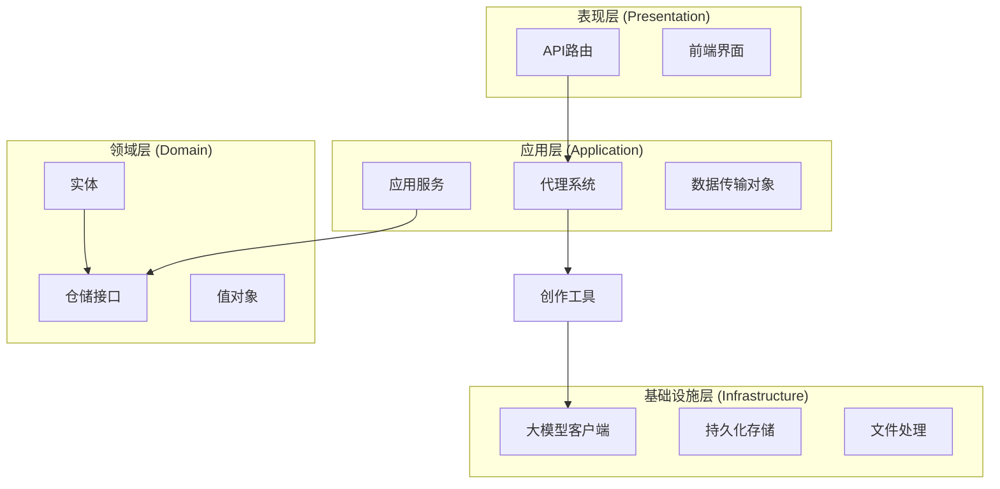
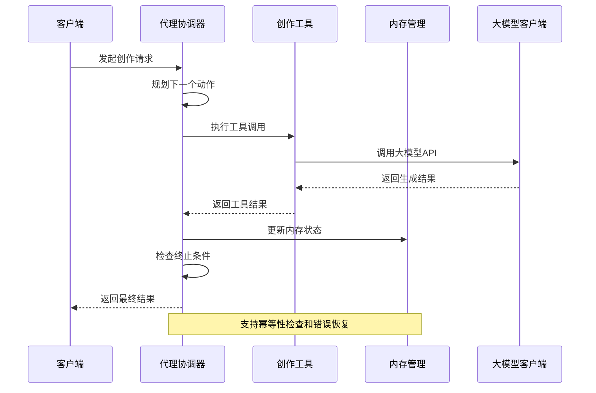
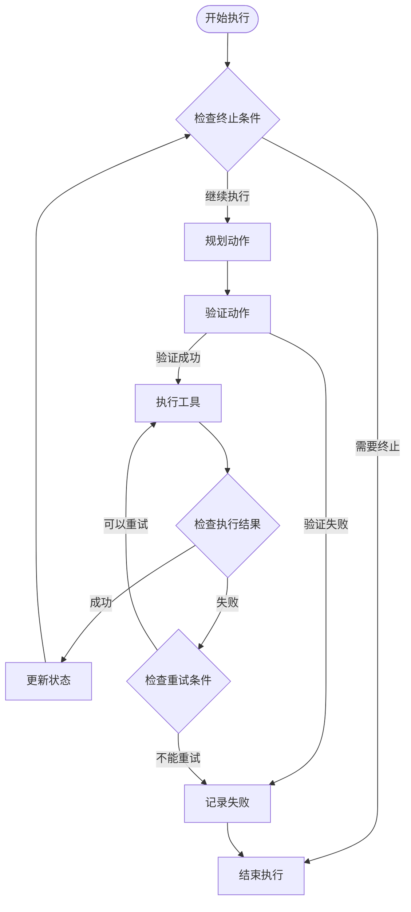
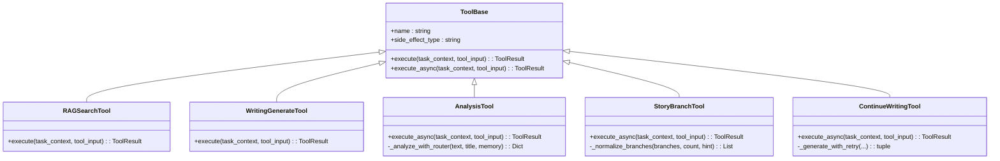
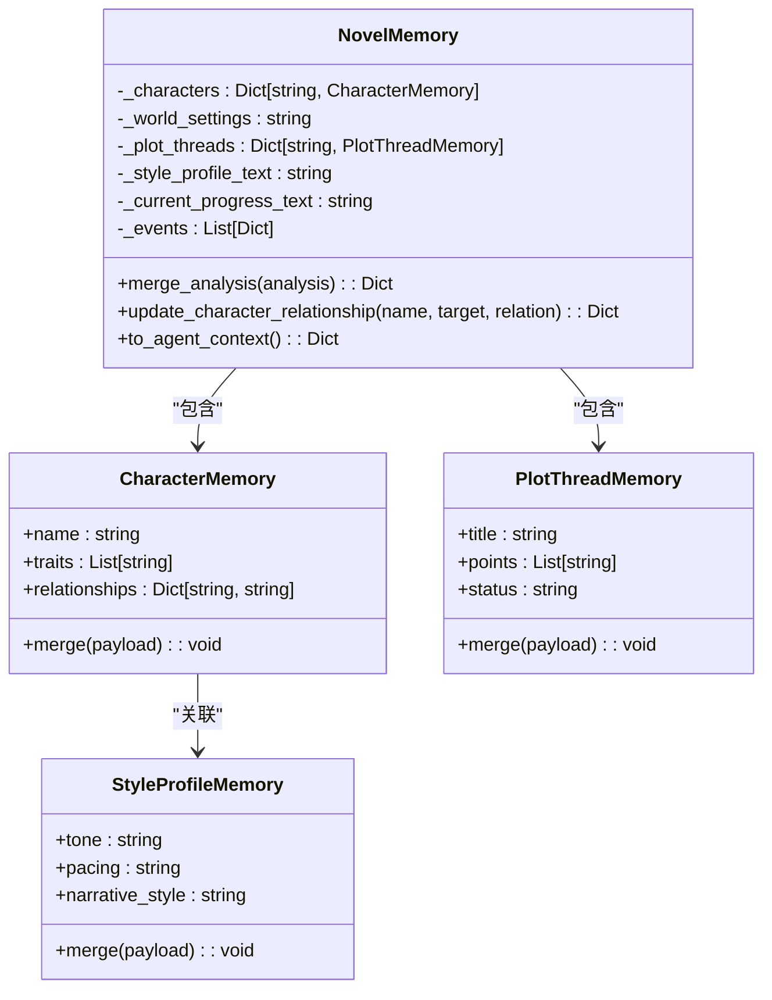
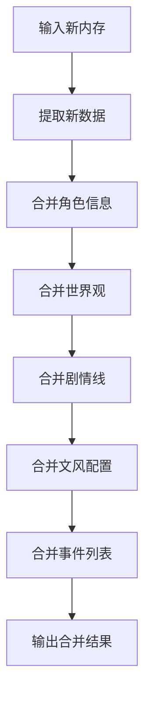
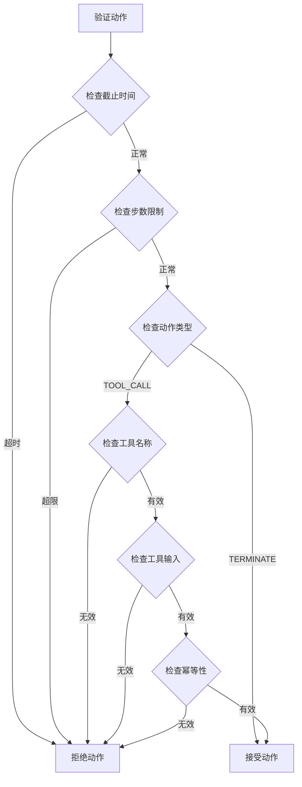
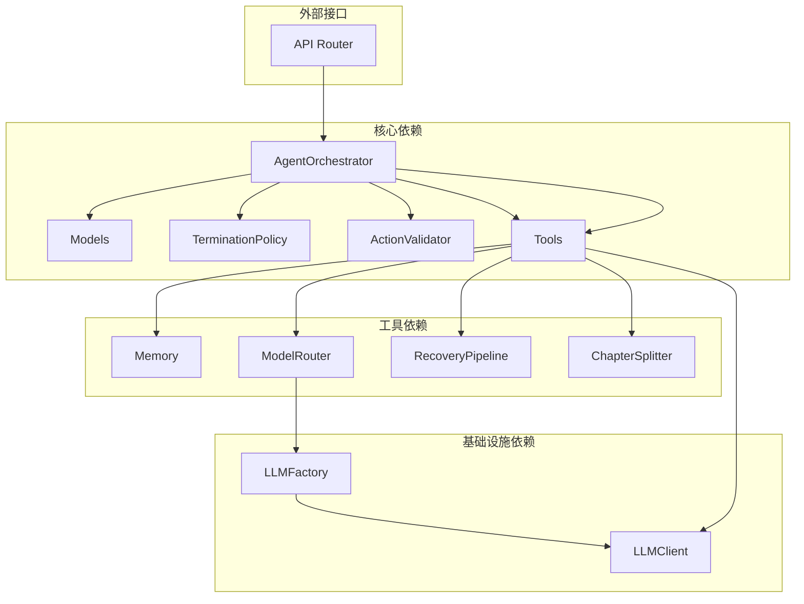

# MVP代理系统

<cite>
**本文档引用的文件**
- [orchestrator.py](file://application/agent_mvp/orchestrator.py)
- [models.py](file://application/agent_mvp/models.py)
- [memory.py](file://application/agent_mvp/memory.py)
- [tools.py](file://application/agent_mvp/tools.py)
- [policy.py](file://application/agent_mvp/policy.py)
- [validator.py](file://application/agent_mvp/validator.py)
- [chapter_splitter.py](file://application/agent_mvp/chapter_splitter.py)
- [recovery.py](file://application/agent_mvp/recovery.py)
- [model_router.py](file://application/agent_mvp/model_router.py)
- [run_agent_mvp.py](file://scripts/run_agent_mvp.py)
- [writing.py](file://presentation/api/routers/writing.py)
- [novel.py](file://domain/entities/novel.py)
- [llm_factory.py](file://infrastructure/llm/llm_factory.py)
- [README.md](file://README.md)
</cite>

## 目录
1. [简介](#简介)
2. [项目结构](#项目结构)
3. [核心组件](#核心组件)
4. [架构概览](#架构概览)
5. [详细组件分析](#详细组件分析)
6. [依赖关系分析](#依赖关系分析)
7. [性能考虑](#性能考虑)
8. [故障排除指南](#故障排除指南)
9. [结论](#结论)

## 简介

MVP代理系统是一个基于Python的智能小说创作助手，采用代理架构设计，能够自动分析小说内容、生成章节草稿并进行剧情分支规划。该系统通过多层架构分离关注点，实现了高度模块化的代码组织和清晰的职责划分。

系统的核心特点包括：
- **代理协调器**：统一调度和管理各种创作工具
- **内存管理系统**：维护和更新小说的全局状态
- **工具链集成**：支持RAG检索、写作生成、剧情分支等多种创作工具
- **容错恢复机制**：提供多级错误恢复和降级策略
- **幂等性保障**：确保写操作的幂等性和安全性

## 项目结构

项目采用经典的分层架构设计，严格按照领域驱动设计(DDD)原则组织代码：

**图表来源**
- [README.md:72-106](file://README.md#L72-L106)

**章节来源**
- [README.md:72-106](file://README.md#L72-L106)

## 核心组件

MVP代理系统由以下核心组件构成：

### 1. 代理协调器 (AgentOrchestrator)
负责协调整个代理流程，包括动作规划、执行控制和结果收集。

### 2. 工具系统 (Tools)
包含多种创作工具：
- **RAGSearchTool**：检索相关上下文信息
- **WritingGenerateTool**：生成章节内容
- **AnalysisTool**：分析小说结构
- **StoryBranchTool**：生成剧情分支
- **ContinueWritingTool**：继续创作

### 3. 内存管理 (Memory)
维护小说的全局状态，包括角色、世界观、剧情线等信息。

### 4. 控制策略 (Policy & Validator)
- **终止策略**：决定何时停止代理执行
- **动作验证器**：验证动作的有效性和安全性

**章节来源**
- [orchestrator.py:17-212](file://application/agent_mvp/orchestrator.py#L17-L212)
- [tools.py:583-1018](file://application/agent_mvp/tools.py#L583-L1018)
- [memory.py:61-284](file://application/agent_mvp/memory.py#L61-L284)

## 架构概览

系统采用代理-工具架构，通过协调器统一管理各个创作工具的执行：

**图表来源**
- [orchestrator.py:28-164](file://application/agent_mvp/orchestrator.py#L28-L164)
- [tools.py:159-424](file://application/agent_mvp/tools.py#L159-L424)

## 详细组件分析

### 代理协调器分析

代理协调器是整个系统的核心控制器，负责：

#### 主要职责
1. **动作规划**：根据当前状态决定下一步执行的动作
2. **执行控制**：管理工具调用和错误处理
3. **状态跟踪**：记录执行过程中的所有状态变化
4. **终止判断**：基于多种策略决定是否停止执行

#### 执行流程

**图表来源**
- [orchestrator.py:31-164](file://application/agent_mvp/orchestrator.py#L31-L164)

**章节来源**
- [orchestrator.py:17-212](file://application/agent_mvp/orchestrator.py#L17-L212)

### 工具系统分析

工具系统提供了多种创作能力，每个工具都有明确的职责和接口规范。

#### 工具分类

**图表来源**
- [tools.py:159-1018](file://application/agent_mvp/tools.py#L159-L1018)

#### 工具执行策略

每个工具都实现了统一的执行接口，但具有不同的实现策略：

| 工具类型 | 幂等性需求 | 异步支持 | 主要功能 |
|---------|-----------|---------|---------|
| RAGSearchTool | 否 | 否 | 上下文检索 |
| WritingGenerateTool | 是 | 否 | 章节生成 |
| AnalysisTool | 否 | 是 | 结构分析 |
| StoryBranchTool | 否 | 是 | 剧情分支 |
| ContinueWritingTool | 是 | 是 | 续写创作 |

**章节来源**
- [tools.py:583-1018](file://application/agent_mvp/tools.py#L583-L1018)

### 内存管理系统分析

内存管理系统负责维护小说的全局状态，支持增量更新和合并操作。

#### 内存结构

**图表来源**
- [memory.py:61-284](file://application/agent_mvp/memory.py#L61-L284)

#### 内存合并算法

内存合并采用增量更新策略，支持多源数据的去重和合并：

**图表来源**
- [memory.py:161-216](file://application/agent_mvp/memory.py#L161-L216)

**章节来源**
- [memory.py:61-284](file://application/agent_mvp/memory.py#L61-L284)

### 控制策略分析

系统实现了多层次的控制策略，确保代理执行的安全性和有效性。

#### 终止策略

终止策略基于多个维度判断是否应该停止代理执行：

| 策略类型 | 判断条件 | 停止原因 |
|---------|---------|---------|
| 成功完成 | 已生成最终输出 | 任务已完成 |
| 时间超限 | 超过截止时间 | 超过deadline |
| 步数限制 | 超过最大步数 | 超过最大步数 |
| 进展停滞 | 连续多次无进展 | 连续N次无进展 |
| 执行失败 | 工具执行失败且无进展 | 工具执行失败 |

#### 动作验证器

动作验证器确保每个动作都是有效和安全的：

**图表来源**
- [validator.py:15-46](file://application/agent_mvp/validator.py#L15-L46)

**章节来源**
- [policy.py:8-26](file://application/agent_mvp/policy.py#L8-L26)
- [validator.py:15-46](file://application/agent_mvp/validator.py#L15-L46)

## 依赖关系分析

系统采用松耦合的设计，各组件之间的依赖关系清晰明确：

**图表来源**
- [orchestrator.py:5-26](file://application/agent_mvp/orchestrator.py#L5-L26)
- [tools.py:9-15](file://application/agent_mvp/tools.py#L9-L15)
- [llm_factory.py:31-109](file://infrastructure/llm/llm_factory.py#L31-L109)

### 关键依赖特性

1. **弱循环依赖**：各模块间没有循环导入
2. **接口隔离**：通过抽象接口定义依赖契约
3. **可替换性**：工具和客户端都可以替换实现
4. **测试友好**：依赖注入使得单元测试易于编写

**章节来源**
- [orchestrator.py:5-26](file://application/agent_mvp/orchestrator.py#L5-L26)
- [writing.py:18-36](file://presentation/api/routers/writing.py#L18-L36)

## 性能考虑

MVP代理系统在设计时充分考虑了性能优化：

### 1. 异步处理
- 所有大模型调用都采用异步模式
- 支持并发执行多个工具
- 减少I/O等待时间

### 2. 缓存策略
- 内存状态缓存避免重复计算
- 工具结果缓存减少重复调用
- 上下文块缓存提升检索效率

### 3. 资源管理
- 连接池管理大模型连接
- 内存使用监控防止溢出
- 超时控制避免长时间阻塞

### 4. 扩展性设计
- 插件化工具架构
- 可配置的执行参数
- 模块化的服务设计

## 故障排除指南

### 常见问题及解决方案

#### 1. 大模型API错误
**症状**：工具执行失败，返回API错误
**解决方法**：
- 检查API密钥配置
- 验证网络连接
- 查看备用模型配置

#### 2. 内存不足
**症状**：系统运行缓慢或崩溃
**解决方法**：
- 清理不必要的内存数据
- 调整内存使用策略
- 增加系统内存

#### 3. 工具执行超时
**症状**：工具调用超过预期时间
**解决方法**：
- 调整超时参数
- 优化工具实现
- 检查外部服务状态

#### 4. 幂等性冲突
**症状**：写操作重复执行
**解决方法**：
- 检查幂等性键生成逻辑
- 验证数据库唯一约束
- 查看重复提交处理

**章节来源**
- [recovery.py:15-51](file://application/agent_mvp/recovery.py#L15-L51)
- [model_router.py:13-54](file://application/agent_mvp/model_router.py#L13-L54)

## 结论

MVP代理系统展现了优秀的软件架构设计，通过清晰的分层结构和模块化设计，实现了高度的可维护性和扩展性。系统的主要优势包括：

1. **架构清晰**：严格的分层设计使得代码职责明确
2. **扩展性强**：插件化工具架构支持功能扩展
3. **可靠性高**：多级错误处理和恢复机制
4. **性能优秀**：异步处理和缓存策略优化

未来可以考虑的改进方向：
- 增加更多的创作工具类型
- 优化内存使用策略
- 提供更丰富的配置选项
- 增强监控和日志功能

该系统为小说自动创作提供了一个坚实的技术基础，具备良好的应用前景和发展潜力。