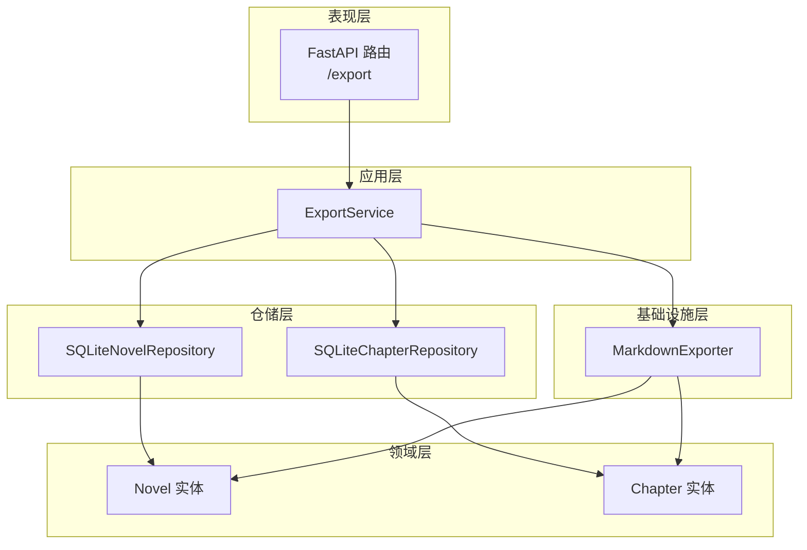
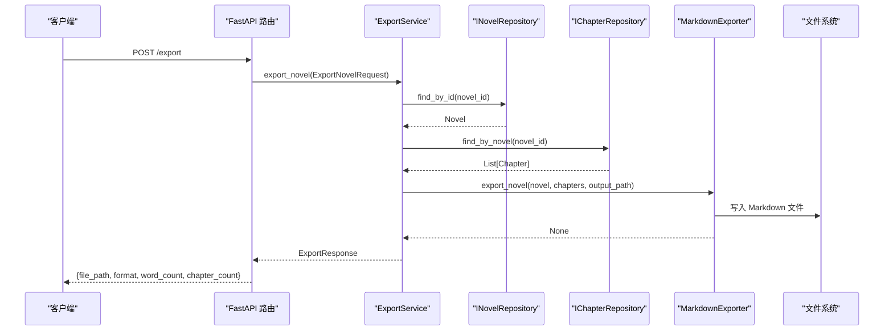
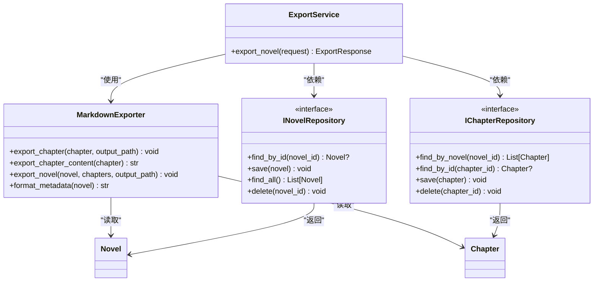

# 导出功能模块

<cite>
**本文引用的文件**
- [application/services/export_service.py](file://application/services/export_service.py)
- [infrastructure/file/markdown_exporter.py](file://infrastructure/file/markdown_exporter.py)
- [presentation/api/routers/export.py](file://presentation/api/routers/export.py)
- [domain/entities/novel.py](file://domain/entities/novel.py)
- [domain/entities/chapter.py](file://domain/entities/chapter.py)
- [domain/repositories/novel_repository.py](file://domain/repositories/novel_repository.py)
- [domain/repositories/chapter_repository.py](file://domain/repositories/chapter_repository.py)
- [application/dto/request_dto.py](file://application/dto/request_dto.py)
- [application/dto/response_dto.py](file://application/dto/response_dto.py)
- [presentation/api/dependencies.py](file://presentation/api/dependencies.py)
- [tests/unit/test_markdown_exporter.py](file://tests/unit/test_markdown_exporter.py)
- [infrastructure/persistence/sqlite_novel_repo.py](file://infrastructure/persistence/sqlite_novel_repo.py)
- [infrastructure/persistence/sqlite_chapter_repo.py](file://infrastructure/persistence/sqlite_chapter_repo.py)
</cite>

## 目录
1. [简介](#简介)
2. [项目结构](#项目结构)
3. [核心组件](#核心组件)
4. [架构概览](#架构概览)
5. [详细组件分析](#详细组件分析)
6. [依赖分析](#依赖分析)
7. [性能考虑](#性能考虑)
8. [故障排查指南](#故障排查指南)
9. [结论](#结论)
10. [附录](#附录)

## 简介
本技术文档围绕导出功能模块展开，重点介绍 ExportService 的导出机制与 MarkdownExporter 的转换算法，涵盖：
- 导出格式支持与配置项
- Markdown 格式的生成规则（标题层级、目录、章节内容）
- 数据准备流程（小说数据获取、章节排序、内容格式化）
- 使用示例与参数配置
- 文件命名规则、存储位置与文件管理策略
- 扩展自定义导出格式的方法、批量导出思路与性能优化建议
- 典型导出流程与结果示例

## 项目结构
导出功能涉及多层协作：
- 表现层：FastAPI 路由负责接收导出请求与下载导出文件
- 应用层：ExportService 负责业务编排与调用基础设施层导出器
- 基础设施层：MarkdownExporter 提供 Markdown 格式转换
- 领域层：Novel/Chapter 实体承载数据结构与行为
- 仓储层：SQLite 实现负责持久化读取小说与章节数据

图表来源
- [presentation/api/routers/export.py:21-103](file://presentation/api/routers/export.py#L21-L103)
- [application/services/export_service.py:23-70](file://application/services/export_service.py#L23-L70)
- [infrastructure/file/markdown_exporter.py:17-126](file://infrastructure/file/markdown_exporter.py#L17-L126)
- [domain/entities/novel.py:20-40](file://domain/entities/novel.py#L20-L40)
- [domain/entities/chapter.py:18-37](file://domain/entities/chapter.py#L18-L37)
- [infrastructure/persistence/sqlite_novel_repo.py:20-116](file://infrastructure/persistence/sqlite_novel_repo.py#L20-L116)
- [infrastructure/persistence/sqlite_chapter_repo.py:19-125](file://infrastructure/persistence/sqlite_chapter_repo.py#L19-L125)

章节来源
- [presentation/api/routers/export.py:21-103](file://presentation/api/routers/export.py#L21-L103)
- [application/services/export_service.py:23-70](file://application/services/export_service.py#L23-L70)
- [infrastructure/file/markdown_exporter.py:17-126](file://infrastructure/file/markdown_exporter.py#L17-L126)
- [domain/entities/novel.py:20-40](file://domain/entities/novel.py#L20-L40)
- [domain/entities/chapter.py:18-37](file://domain/entities/chapter.py#L18-L37)
- [infrastructure/persistence/sqlite_novel_repo.py:20-116](file://infrastructure/persistence/sqlite_novel_repo.py#L20-L116)
- [infrastructure/persistence/sqlite_chapter_repo.py:19-125](file://infrastructure/persistence/sqlite_chapter_repo.py#L19-L125)

## 核心组件
- ExportService：应用层导出编排器，负责获取小说与章节数据、选择导出器、生成导出响应
- MarkdownExporter：基础设施层导出器，负责将 Novel/Chapter 转换为 Markdown 文本并落盘
- FastAPI 路由：提供导出接口与文件下载接口，并进行路径安全校验
- DTO：ExportNovelRequest/ExportResponse 规范请求与响应结构
- 仓储实现：SQLite 实现负责从数据库读取小说与章节数据

章节来源
- [application/services/export_service.py:23-70](file://application/services/export_service.py#L23-L70)
- [infrastructure/file/markdown_exporter.py:17-126](file://infrastructure/file/markdown_exporter.py#L17-L126)
- [presentation/api/routers/export.py:21-103](file://presentation/api/routers/export.py#L21-L103)
- [application/dto/request_dto.py:73-79](file://application/dto/request_dto.py#L73-L79)
- [application/dto/response_dto.py:101-107](file://application/dto/response_dto.py#L101-L107)

## 架构概览
导出流程从 API 路由进入，经依赖注入获取 ExportService，再通过仓储读取数据，最后调用 MarkdownExporter 写入文件并返回导出结果。

图表来源
- [presentation/api/routers/export.py:60-81](file://presentation/api/routers/export.py#L60-L81)
- [application/services/export_service.py:39-69](file://application/services/export_service.py#L39-L69)
- [domain/repositories/novel_repository.py:32-45](file://domain/repositories/novel_repository.py#L32-L45)
- [domain/repositories/chapter_repository.py:47-60](file://domain/repositories/chapter_repository.py#L47-L60)
- [infrastructure/file/markdown_exporter.py:62-100](file://infrastructure/file/markdown_exporter.py#L62-L100)

## 详细组件分析

### ExportService 分析
- 职责：接收导出请求，加载小说与章节，选择导出器，写入目标路径，返回导出响应
- 关键点：
  - 仅支持 format=markdown；其他格式会抛出异常
  - 输出目录不存在时自动创建
  - 返回字段包含文件路径、格式、总字数与章节数

章节来源
- [application/services/export_service.py:23-70](file://application/services/export_service.py#L23-L70)

### MarkdownExporter 分析
- 职责：将小说与章节转换为 Markdown 文本并写入文件
- 核心方法：
  - export_chapter：输出单章 Markdown 文件
  - export_chapter_content：生成单章 Markdown 内容（含标题与正文）
  - export_novel：生成整部小说 Markdown（含元数据、目录、各章节内容）
  - format_metadata：生成小说元数据块（标题、作者、题材、字数）

Markdown 格式要点：
- 小说封面：主标题、作者、题材、字数统计
- 目录：基于章节标题生成链接（锚点与标题一致）
- 章节标题：使用“第N章 标题”的格式
- 正文：直接写入章节内容，保持原始文本

章节来源
- [infrastructure/file/markdown_exporter.py:17-126](file://infrastructure/file/markdown_exporter.py#L17-L126)

### FastAPI 路由与文件下载
- /export（POST）：接收 ExportNovelRequest，调用 ExportService 并返回 ExportResponse
- /export/download/{file_path}（GET）：安全下载 exports 目录下的文件
- 路径安全校验：限制在 exports 目录内，防止路径穿越

章节来源
- [presentation/api/routers/export.py:21-103](file://presentation/api/routers/export.py#L21-L103)

### DTO 与仓储接口
- ExportNovelRequest：包含 novel_id、output_path、format、options
- ExportResponse：包含 file_path、format、word_count、chapter_count
- 仓储接口：INovelRepository、IChapterRepository 定义了数据访问契约
- SQLite 实现：负责数据库建表、查询与映射

章节来源
- [application/dto/request_dto.py:73-79](file://application/dto/request_dto.py#L73-L79)
- [application/dto/response_dto.py:101-107](file://application/dto/response_dto.py#L101-L107)
- [domain/repositories/novel_repository.py:17-70](file://domain/repositories/novel_repository.py#L17-L70)
- [domain/repositories/chapter_repository.py:17-89](file://domain/repositories/chapter_repository.py#L17-L89)
- [infrastructure/persistence/sqlite_novel_repo.py:20-116](file://infrastructure/persistence/sqlite_novel_repo.py#L20-L116)
- [infrastructure/persistence/sqlite_chapter_repo.py:19-125](file://infrastructure/persistence/sqlite_chapter_repo.py#L19-L125)

### 数据准备流程
- 小说数据获取：通过 INovelRepository.find_by_id 加载 Novel
- 章节数据获取：通过 IChapterRepository.find_by_novel 按编号升序获取章节列表
- 内容格式化：MarkdownExporter 在 export_novel 中拼接元数据、目录与各章节内容
- 文件落盘：确保输出目录存在后写入 UTF-8 编码文件

章节来源
- [application/services/export_service.py:49-69](file://application/services/export_service.py#L49-L69)
- [infrastructure/file/markdown_exporter.py:62-100](file://infrastructure/file/markdown_exporter.py#L62-L100)

### 导出方法使用示例与参数配置
- 请求参数（ExportNovelRequest）：
  - novel_id：目标小说 ID
  - output_path：导出文件的完整路径（相对 exports 目录或绝对路径，需满足安全校验）
  - format：当前仅支持 "markdown"
  - options：可选扩展参数（当前未使用）
- 响应参数（ExportResponse）：
  - file_path：导出文件路径
  - format：导出格式
  - word_count：小说当前字数
  - chapter_count：章节数

章节来源
- [application/dto/request_dto.py:73-79](file://application/dto/request_dto.py#L73-L79)
- [application/dto/response_dto.py:101-107](file://application/dto/response_dto.py#L101-L107)
- [presentation/api/routers/export.py:60-81](file://presentation/api/routers/export.py#L60-L81)

### 文件命名规则、存储位置与文件管理策略
- 存储位置：exports 目录（路由中定义），下载接口限定在此目录内
- 命名规则：由调用方指定 output_path；建议以小说标题命名主文件，章节可单独导出
- 文件管理策略：
  - 自动创建输出目录（若不存在）
  - 写入 UTF-8 编码
  - 路径安全校验：拒绝越权访问与非文件路径

章节来源
- [presentation/api/routers/export.py:23-57](file://presentation/api/routers/export.py#L23-L57)
- [application/services/export_service.py:57-69](file://application/services/export_service.py#L57-L69)
- [infrastructure/file/markdown_exporter.py:36-39](file://infrastructure/file/markdown_exporter.py#L36-L39)
- [infrastructure/file/markdown_exporter.py:97-100](file://infrastructure/file/markdown_exporter.py#L97-L100)

### 自定义导出格式扩展方法
- 当前仅支持 Markdown；如需新增格式（如 TXT、HTML、EPUB），可在 ExportService 中增加分支逻辑并引入新的导出器
- 新增导出器建议遵循：
  - 输入：Novel + List[Chapter]
  - 输出：字符串或二进制流
  - 落盘：统一在 ExportService 中处理目录与编码
- 扩展步骤示意：
  1) 新建导出器类（如 HtmlExporter）
  2) 在 ExportService.export_novel 中增加 format 判断
  3) 在 DTO 中扩展 format 字段（如 "html"）
  4) 在路由层与前端对接新格式

章节来源
- [application/services/export_service.py:59-62](file://application/services/export_service.py#L59-L62)

### 批量导出功能
- 单次导出：一次请求导出一部小说的所有章节
- 批量思路：在 API 层循环遍历多个 novel_id，逐个调用 ExportService.export_novel
- 注意事项：控制并发与速率，避免磁盘与数据库压力过大

章节来源
- [presentation/api/routers/export.py:60-81](file://presentation/api/routers/export.py#L60-L81)
- [application/services/export_service.py:39-69](file://application/services/export_service.py#L39-L69)

### 性能优化建议
- I/O 优化：合并字符串拼接，减少多次写入（当前已一次性写入）
- 并发与限流：批量导出时限制并发数量，避免磁盘抖动
- 字数统计：Novel.current_word_count 由章节字数累加而来，避免重复计算
- 数据库索引：章节查询按 number 排序，确保 SQLite 查询效率

章节来源
- [domain/entities/novel.py:173-178](file://domain/entities/novel.py#L173-L178)
- [infrastructure/persistence/sqlite_chapter_repo.py:85-94](file://infrastructure/persistence/sqlite_chapter_repo.py#L85-L94)

### 导出流程与结果示例
- 典型流程：
  1) 客户端发送导出请求（POST /export）
  2) 服务端加载小说与章节
  3) MarkdownExporter 生成目录与章节内容
  4) 写入 Markdown 文件
  5) 返回导出响应
- 结果示例（概念性描述）：
  - 输出文件包含：封面元数据、目录、各章节正文
  - 目录项为章节标题链接，正文保留原始内容

章节来源
- [tests/unit/test_markdown_exporter.py:81-131](file://tests/unit/test_markdown_exporter.py#L81-L131)
- [infrastructure/file/markdown_exporter.py:62-100](file://infrastructure/file/markdown_exporter.py#L62-L100)

## 依赖分析
- 组件耦合：
  - ExportService 依赖仓储接口与 MarkdownExporter
  - MarkdownExporter 依赖领域实体（Novel/Chapter）
  - 路由依赖 ExportService（通过依赖注入）
- 外部依赖：
  - FastAPI（路由与响应）
  - SQLite（数据持久化）
  - Python 标准库（os、pathlib、datetime）

图表来源
- [application/services/export_service.py:23-70](file://application/services/export_service.py#L23-L70)
- [infrastructure/file/markdown_exporter.py:17-126](file://infrastructure/file/markdown_exporter.py#L17-L126)
- [domain/repositories/novel_repository.py:17-70](file://domain/repositories/novel_repository.py#L17-L70)
- [domain/repositories/chapter_repository.py:17-89](file://domain/repositories/chapter_repository.py#L17-L89)
- [domain/entities/novel.py:20-40](file://domain/entities/novel.py#L20-L40)
- [domain/entities/chapter.py:18-37](file://domain/entities/chapter.py#L18-L37)

## 性能考虑
- I/O 合并：MarkdownExporter 已一次性写入，避免多次打开/关闭文件
- 字符串拼接：使用列表收集行再 join，降低内存碎片
- 数据库查询：章节按 number 升序返回，避免额外排序
- 并发控制：批量导出时建议限制并发度，避免磁盘与数据库争用

章节来源
- [infrastructure/file/markdown_exporter.py:78-100](file://infrastructure/file/markdown_exporter.py#L78-L100)
- [infrastructure/persistence/sqlite_chapter_repo.py:85-94](file://infrastructure/persistence/sqlite_chapter_repo.py#L85-L94)

## 故障排查指南
- 不支持的导出格式：当 format 非 "markdown" 时抛出异常
- 小说不存在：根据 novel_id 无法找到小说时抛出异常
- 路径不安全：下载接口对 file_path 进行安全校验，非法路径会被拒绝
- 文件不存在：下载接口检查文件是否存在
- 编码问题：导出统一使用 UTF-8 编码写入

章节来源
- [application/services/export_service.py:52-53](file://application/services/export_service.py#L52-L53)
- [application/services/export_service.py:61-62](file://application/services/export_service.py#L61-L62)
- [presentation/api/routers/export.py:48-56](file://presentation/api/routers/export.py#L48-L56)
- [infrastructure/file/markdown_exporter.py:38-39](file://infrastructure/file/markdown_exporter.py#L38-L39)
- [infrastructure/file/markdown_exporter.py:99-100](file://infrastructure/file/markdown_exporter.py#L99-L100)

## 结论
导出功能模块采用清晰的分层设计：表现层提供 REST 接口，应用层编排业务，基础设施层负责具体导出算法，仓储层提供数据访问。当前实现专注于 Markdown 格式，具备良好的扩展性，可通过新增导出器与格式分支支持更多输出格式。建议在批量导出场景下加入并发控制与限速策略，以提升整体稳定性与性能。

## 附录
- 依赖注入与服务实例化：通过 presentation/api/dependencies.py 提供 ExportService 实例，确保仓储实现与外部资源的统一管理
- 单元测试参考：tests/unit/test_markdown_exporter.py 展示了章节与小说导出的断言方式，可用于验证导出结果

章节来源
- [presentation/api/dependencies.py:144-148](file://presentation/api/dependencies.py#L144-L148)
- [tests/unit/test_markdown_exporter.py:37-150](file://tests/unit/test_markdown_exporter.py#L37-L150)