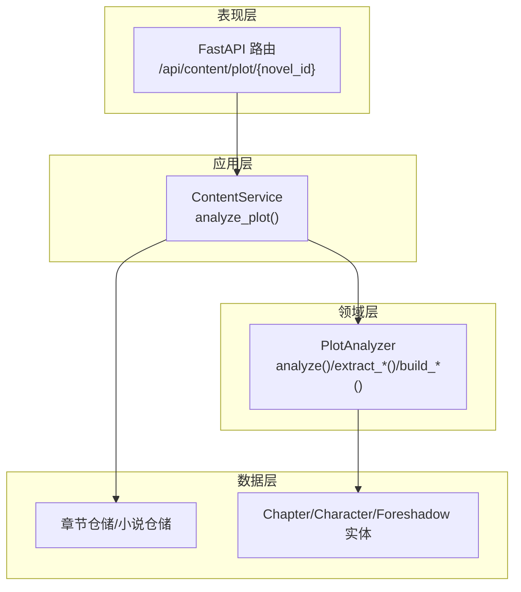
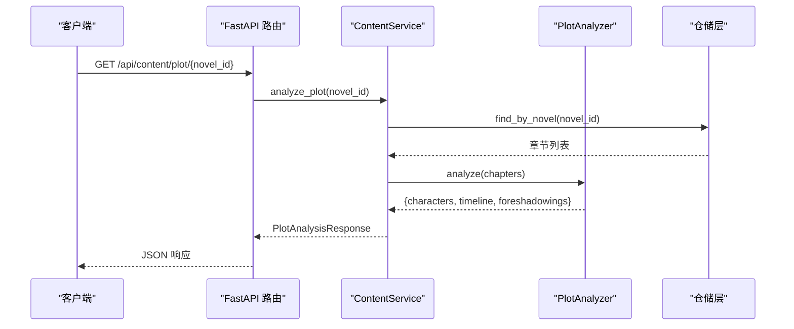
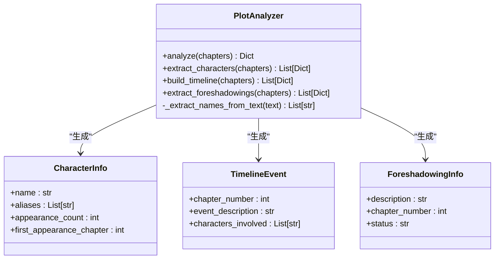
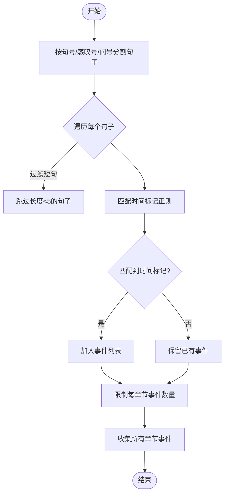
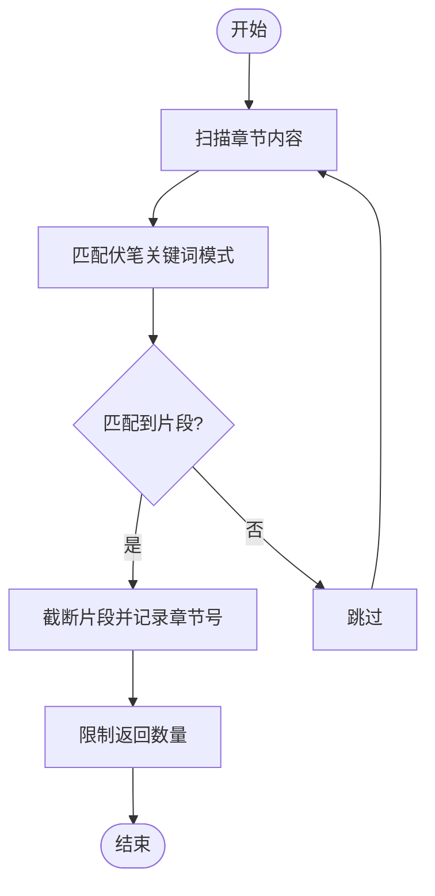
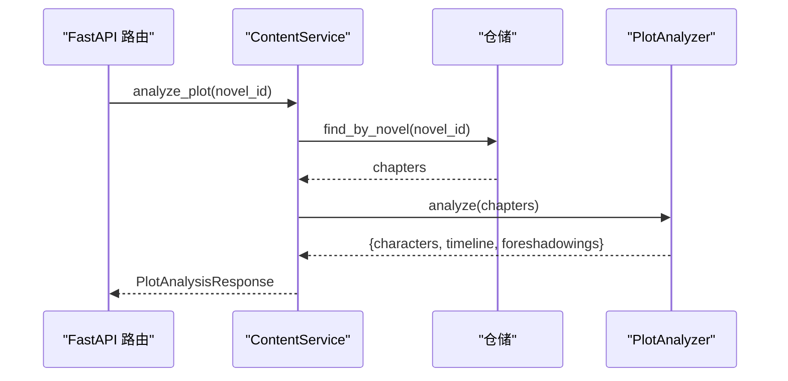
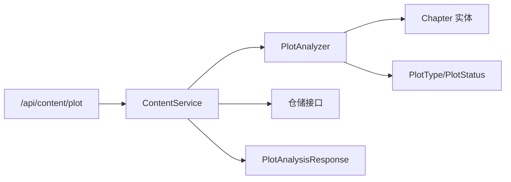

# 剧情分析功能

<cite>
**本文引用的文件**
- [domain/services/plot_analyzer.py](file://domain/services/plot_analyzer.py)
- [application/services/content_service.py](file://application/services/content_service.py)
- [domain/entities/character.py](file://domain/entities/character.py)
- [domain/entities/foreshadow.py](file://domain/entities/foreshadow.py)
- [domain/entities/chapter.py](file://domain/entities/chapter.py)
- [application/dto/response_dto.py](file://application/dto/response_dto.py)
- [presentation/api/routers/content.py](file://presentation/api/routers/content.py)
- [tests/unit/test_plot_analyzer.py](file://tests/unit/test_plot_analyzer.py)
- [domain/types.py](file://domain/types.py)
- [data/novel/大纲.txt](file://data/novel/大纲.txt)
</cite>

## 目录
1. [简介](#简介)
2. [项目结构](#项目结构)
3. [核心组件](#核心组件)
4. [架构总览](#架构总览)
5. [详细组件分析](#详细组件分析)
6. [依赖关系分析](#依赖关系分析)
7. [性能考量](#性能考量)
8. [故障排查指南](#故障排查指南)
9. [结论](#结论)
10. [附录](#附录)

## 简介
本技术文档围绕剧情分析功能展开，重点解释 PlotAnalyzer 类的实现原理与分析算法，覆盖人物关系提取、时间线构建、伏笔识别等核心能力；并详述 ContentService.analyze_plot 方法的工作流程，包括小说数据获取、章节内容分析、剧情模式识别、关系网络构建等步骤。文档同时给出剧情分析输出结构说明（characters、timeline、foreshadowings），以及调用接口示例、可视化展示方式、算法细节与优化建议。

## 项目结构
剧情分析功能位于领域层与应用层之间，采用清晰的分层架构：
- 领域层：PlotAnalyzer 负责剧情结构抽取与模式识别
- 应用层：ContentService 协调数据访问与服务编排
- DTO 层：PlotAnalysisResponse 定义统一输出结构
- API 层：FastAPI 路由暴露分析接口
- 测试层：单元测试验证算法正确性

图表来源
- [presentation/api/routers/content.py:150-171](file://presentation/api/routers/content.py#L150-L171)
- [application/services/content_service.py:123-147](file://application/services/content_service.py#L123-L147)
- [domain/services/plot_analyzer.py:55-75](file://domain/services/plot_analyzer.py#L55-L75)

章节来源
- [presentation/api/routers/content.py:150-171](file://presentation/api/routers/content.py#L150-L171)
- [application/services/content_service.py:123-147](file://application/services/content_service.py#L123-L147)
- [domain/services/plot_analyzer.py:55-75](file://domain/services/plot_analyzer.py#L55-L75)

## 核心组件
- PlotAnalyzer：剧情分析领域服务，负责从章节集合中抽取人物、时间线与伏笔
- ContentService：应用服务，协调仓储与分析器，封装为统一响应
- PlotAnalysisResponse：剧情分析输出 DTO，包含 characters、timeline、foreshadowings
- Chapter/Character/Foreshadow：领域实体，承载剧情分析所需的数据结构

章节来源
- [domain/services/plot_analyzer.py:46-225](file://domain/services/plot_analyzer.py#L46-L225)
- [application/services/content_service.py:29-169](file://application/services/content_service.py#L29-L169)
- [application/dto/response_dto.py:72-77](file://application/dto/response_dto.py#L72-L77)
- [domain/entities/chapter.py:18-109](file://domain/entities/chapter.py#L18-L109)
- [domain/entities/character.py:64-273](file://domain/entities/character.py#L64-L273)
- [domain/entities/foreshadow.py:24-79](file://domain/entities/foreshadow.py#L24-L79)

## 架构总览
剧情分析的端到端流程如下：
- 客户端调用 /api/content/plot/{novel_id}
- FastAPI 路由接收请求并注入 ContentService
- ContentService 查询小说与章节，调用 PlotAnalyzer.analyze
- PlotAnalyzer 对章节进行人物提取、时间线构建、伏笔提取
- ContentService 将结果封装为 PlotAnalysisResponse 返回

图表来源
- [presentation/api/routers/content.py:150-171](file://presentation/api/routers/content.py#L150-L171)
- [application/services/content_service.py:123-147](file://application/services/content_service.py#L123-L147)
- [domain/services/plot_analyzer.py:55-75](file://domain/services/plot_analyzer.py#L55-L75)

## 详细组件分析

### PlotAnalyzer 类与分析算法
PlotAnalyzer 是剧情分析的核心，提供以下能力：
- 人物信息提取：基于中文姓名模式匹配与出现频次统计，筛选常见角色
- 时间线构建：识别含时间标记的句子，按章节聚合事件
- 伏笔提取：基于关键词模式匹配，抽取潜在伏笔片段

图表来源
- [domain/services/plot_analyzer.py:19-44](file://domain/services/plot_analyzer.py#L19-L44)
- [domain/services/plot_analyzer.py:46-225](file://domain/services/plot_analyzer.py#L46-L225)

章节来源
- [domain/services/plot_analyzer.py:55-225](file://domain/services/plot_analyzer.py#L55-L225)

#### 人物关系提取（当前实现）
- 当前实现聚焦“角色出现频率统计”与“首次出场章节”，并通过正则模式匹配提取候选人名
- 未实现“角色交互矩阵”与“关系强度计算”，仅返回基础统计字段
- 若需扩展，可在现有基础上引入共现窗口统计、角色交互句提取与关系类型标注

章节来源
- [domain/services/plot_analyzer.py:77-119](file://domain/services/plot_analyzer.py#L77-L119)
- [domain/services/plot_analyzer.py:204-224](file://domain/services/plot_analyzer.py#L204-L224)

#### 时间线构建机制
- 使用时间标记正则（如“第X天/日/年”、“今/明/后/昨/前+天/日/年”、“X天/年后”）识别事件
- 将含时间标记的句子作为事件，限制每章节最多保留若干事件，避免噪声
- 事件包含章节号、简短描述与涉及人物列表

图表来源
- [domain/services/plot_analyzer.py:121-168](file://domain/services/plot_analyzer.py#L121-L168)

章节来源
- [domain/services/plot_analyzer.py:121-168](file://domain/services/plot_analyzer.py#L121-L168)

#### 伏笔识别算法
- 基于关键词模式（神秘/奇怪/未知/隐约/仿佛/似乎/好像、等待/时机/觉醒/秘密/真相、伏笔/埋下/暗示）
- 匹配到的片段会被截断并记录章节号与状态（默认“未回收”）
- 限制返回数量，避免噪声干扰

图表来源
- [domain/services/plot_analyzer.py:170-202](file://domain/services/plot_analyzer.py#L170-L202)

章节来源
- [domain/services/plot_analyzer.py:170-202](file://domain/services/plot_analyzer.py#L170-L202)

### ContentService.analyze_plot 工作流程
- 输入：novel_id
- 步骤：
  1) 校验小说存在
  2) 查询该小说的所有章节
  3) 调用 PlotAnalyzer.analyze 获取分析结果
  4) 封装为 PlotAnalysisResponse 返回

图表来源
- [application/services/content_service.py:123-147](file://application/services/content_service.py#L123-L147)
- [presentation/api/routers/content.py:150-171](file://presentation/api/routers/content.py#L150-L171)

章节来源
- [application/services/content_service.py:123-147](file://application/services/content_service.py#L123-L147)
- [presentation/api/routers/content.py:150-171](file://presentation/api/routers/content.py#L150-L171)

### 输出结构说明
PlotAnalysisResponse 的字段定义如下：
- characters: 角色列表，包含 name、aliases、appearance_count、first_appearance_chapter 等
- timeline: 时间线事件列表，包含 chapter_number、event_description、characters_involved
- foreshadowings: 伏笔列表，包含 description、chapter_number、status

章节来源
- [application/dto/response_dto.py:72-77](file://application/dto/response_dto.py#L72-L77)

### 调用接口与示例
- 接口：GET /api/content/plot/{novel_id}
- 请求参数：novel_id（路径参数）
- 成功响应：PlotAnalysisResponse
- 错误处理：HTTP 404/400，返回错误详情

章节来源
- [presentation/api/routers/content.py:150-171](file://presentation/api/routers/content.py#L150-L171)

### 可视化展示
前端页面中，剧情分析结果以标签页形式展示：
- 角色：表格显示出场次数与首次出场章节
- 时间线：时间轴展示事件与章节关联
- 伏笔：表格展示描述、章节与状态

章节来源
- [frontend/src/views/novel/NovelDetail.vue:157-182](file://frontend/src/views/novel/NovelDetail.vue#L157-L182)

## 依赖关系分析
- PlotAnalyzer 依赖 Chapter 实体与领域类型（PlotType、PlotStatus）
- ContentService 依赖仓储接口与 PlotAnalyzer
- API 路由依赖 ContentService 与 DTO

图表来源
- [presentation/api/routers/content.py:150-171](file://presentation/api/routers/content.py#L150-L171)
- [application/services/content_service.py:123-147](file://application/services/content_service.py#L123-L147)
- [domain/services/plot_analyzer.py:15-16](file://domain/services/plot_analyzer.py#L15-L16)
- [domain/types.py:93-107](file://domain/types.py#L93-L107)

章节来源
- [domain/types.py:93-107](file://domain/types.py#L93-L107)
- [domain/entities/chapter.py:18-36](file://domain/entities/chapter.py#L18-L36)

## 性能考量
- 正则匹配复杂度：时间线与伏笔识别均使用多条正则，建议：
  - 合并常用模式，减少重复扫描
  - 对长文本分段处理，避免单次匹配耗时过长
- 数据规模：章节越多，正则匹配与事件聚合成本越高
  - 可考虑分批处理或缓存中间结果
- 字段截断：事件描述与伏笔描述均有限制长度，有助于控制响应体积

章节来源
- [domain/services/plot_analyzer.py:135-141](file://domain/services/plot_analyzer.py#L135-L141)
- [domain/services/plot_analyzer.py:190-199](file://domain/services/plot_analyzer.py#L190-L199)

## 故障排查指南
- 小说不存在：抛出 ValueError，API 层转换为 HTTP 404
- 章节为空：analyze_plot 返回空结果，前端需做好空态渲染
- 正则未命中：时间线与伏笔可能为空，属正常现象
- 单元测试参考：包含空章节列表、人物提取、时间线构建、伏笔提取等用例

章节来源
- [application/services/content_service.py:135-138](file://application/services/content_service.py#L135-L138)
- [tests/unit/test_plot_analyzer.py:82-103](file://tests/unit/test_plot_analyzer.py#L82-L103)

## 结论
PlotAnalyzer 当前实现了基础的剧情结构抽取：角色出现统计、时间线事件提取与伏笔片段识别。ContentService 将其无缝集成到 API 中，输出标准化的 PlotAnalysisResponse。为进一步提升分析质量，建议扩展角色交互矩阵与关系强度计算、增强时间标记识别鲁棒性、完善伏笔语义标注与回收闭环。

## 附录

### 代码示例（调用与结果）
- 调用接口：GET /api/content/plot/{novel_id}
- 返回字段：characters、timeline、foreshadowings
- 前端展示：标签页分别呈现角色、时间线、伏笔

章节来源
- [presentation/api/routers/content.py:150-171](file://presentation/api/routers/content.py#L150-L171)
- [application/dto/response_dto.py:72-77](file://application/dto/response_dto.py#L72-L77)
- [frontend/src/views/novel/NovelDetail.vue:157-182](file://frontend/src/views/novel/NovelDetail.vue#L157-L182)

### 算法扩展建议
- 人物关系网络
  - 统计角色共现窗口（如连续 N 句内同时出现）
  - 计算关系强度（共现频次、距离权重、情感倾向）
  - 标注关系类型（亲友/敌对/师徒/盟友等）
- 时间线增强
  - 支持相对时间（“三日后”）、绝对时间（“2025-01-01”）
  - 事件因果链与转折点识别
- 伏笔闭环
  - 引入 Foreshadow 实体与状态（待处理/已解决）
  - 建立伏笔回收与验证机制

章节来源
- [domain/entities/foreshadow.py:24-79](file://domain/entities/foreshadow.py#L24-L79)
- [domain/types.py:93-107](file://domain/types.py#L93-L107)