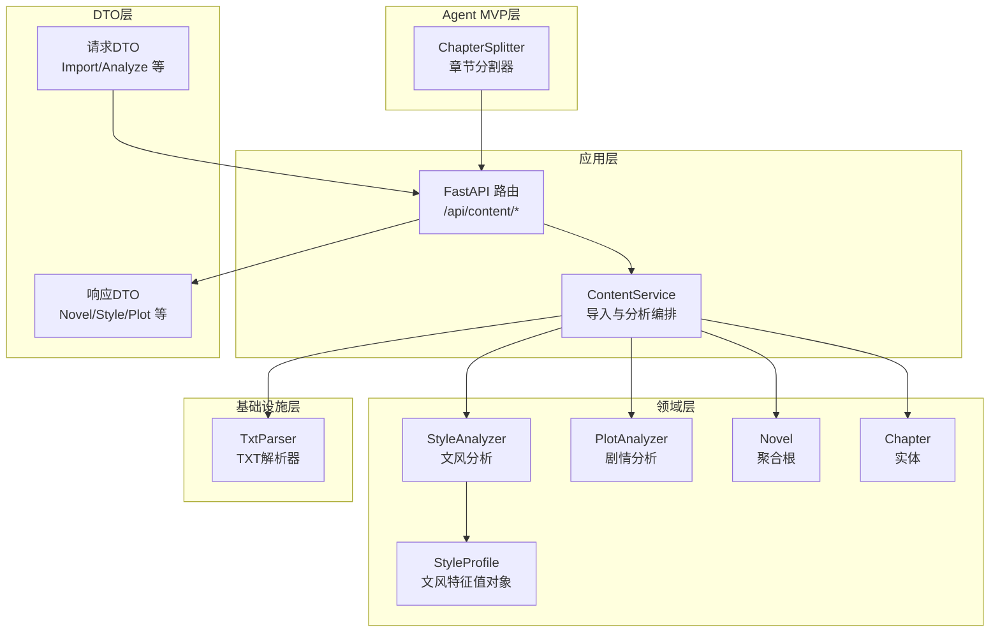
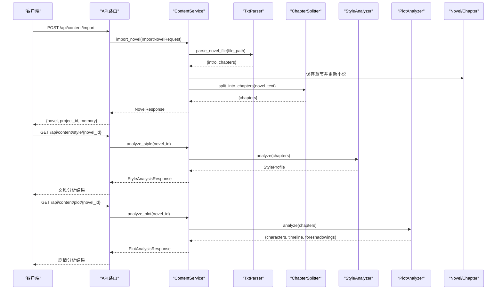
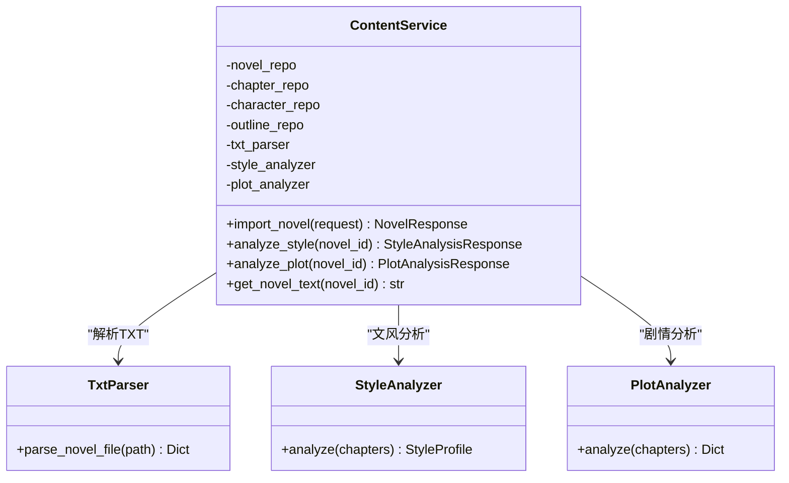
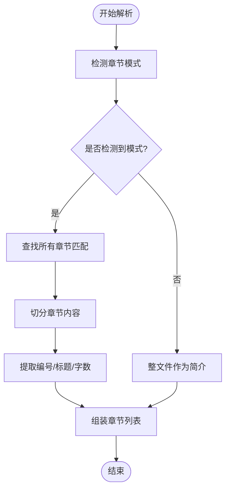
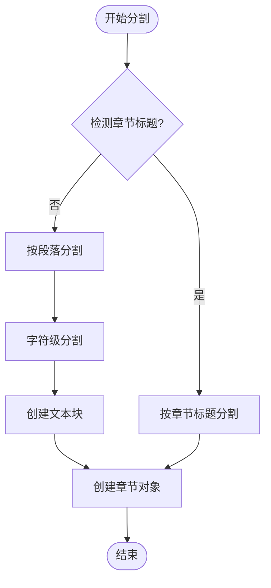
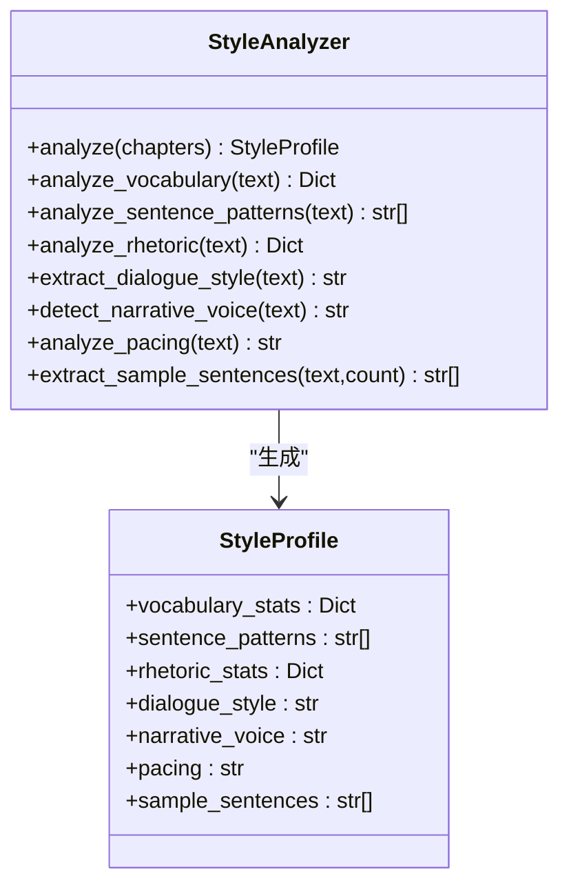
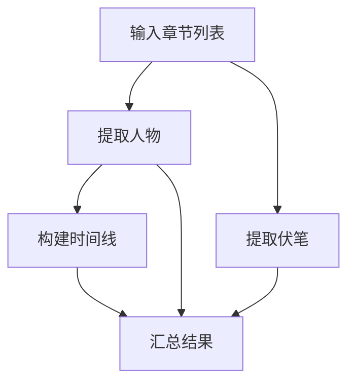
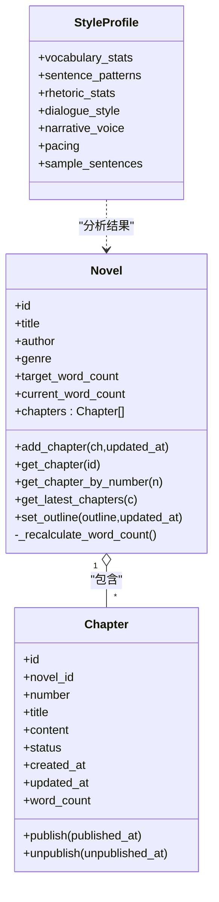
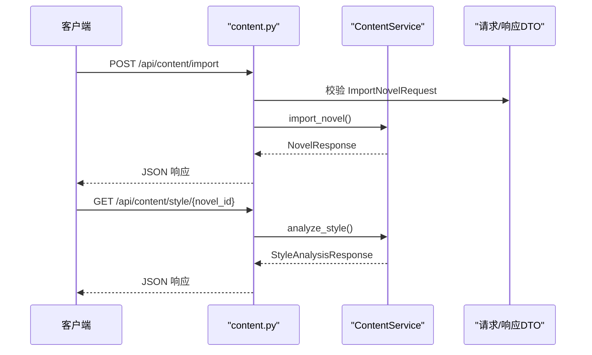
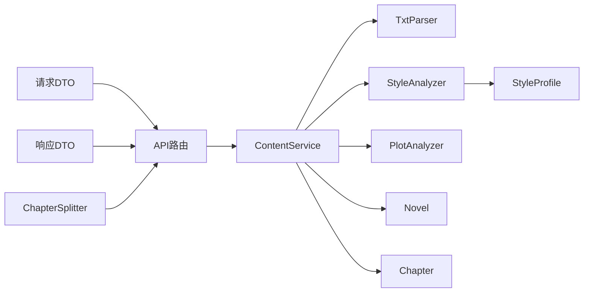

# 小说导入与分析模块

<cite>
**本文引用的文件**
- [content_service.py](file://application/services/content_service.py)
- [txt_parser.py](file://infrastructure/file/txt_parser.py)
- [style_analyzer.py](file://domain/services/style_analyzer.py)
- [plot_analyzer.py](file://domain/services/plot_analyzer.py)
- [style_profile.py](file://domain/value_objects/style_profile.py)
- [novel.py](file://domain/entities/novel.py)
- [chapter.py](file://domain/entities/chapter.py)
- [request_dto.py](file://application/dto/request_dto.py)
- [response_dto.py](file://application/dto/response_dto.py)
- [content.py](file://presentation/api/routers/content.py)
- [types.py](file://domain/types.py)
- [exceptions.py](file://domain/exceptions.py)
- [test_txt_parser.py](file://tests/unit/test_txt_parser.py)
- [test_style_analyzer.py](file://tests/unit/test_style_analyzer.py)
- [test_plot_analyzer.py](file://tests/unit/test_plot_analyzer.py)
- [test_import_three_stage.py](file://tests/unit/test_import_three_stage.py)
- [chapter_splitter.py](file://application/agent_mvp/chapter_splitter.py)
</cite>

## 目录
1. [引言](#引言)
2. [项目结构](#项目结构)
3. [核心组件](#核心组件)
4. [架构总览](#架构总览)
5. [详细组件分析](#详细组件分析)
6. [依赖分析](#依赖分析)
7. [性能考虑](#性能考虑)
8. [故障排查指南](#故障排查指南)
9. [结论](#结论)
10. [附录](#附录)

## 引言
本技术文档聚焦"小说导入与分析模块"，系统化阐述以下能力：
- 小说导入流程：TXT文件解析、章节结构识别、数据验证与持久化。
- 文风分析：词汇统计、句式模式、修辞手法、对话风格、叙述语调与节奏分析。
- 剧情分析：人物关系提取、时间线构建、伏笔识别。
- **新增章节分割功能**：字符级分割算法，支持稳健的文本处理能力。
- 使用示例：如何通过TxtParser解析小说文件；如何调用StyleAnalyzer与PlotAnalyzer进行分析；ContentService中import_novel、analyze_style、analyze_plot等关键方法的实现与参数配置。
- 错误处理、性能优化与最佳实践。

## 项目结构
该模块横跨应用层、领域层与基础设施层，采用分层清晰的架构设计：
- 应用层：ContentService协调导入与分析；API路由提供HTTP接口。
- 领域层：StyleAnalyzer与PlotAnalyzer负责文风与剧情分析；StyleProfile为只读值对象承载分析结果；Novel与Chapter为聚合根与实体。
- 基础设施层：TxtParser负责TXT文件解析与章节识别。
- **新增Agent MVP层**：ChapterSplitter提供字符级章节分割功能，增强文本处理能力。
- DTO层：统一请求/响应数据结构。
- 测试层：覆盖解析器、分析器与集成流程。

**图表来源**
- [content_service.py:29-169](file://application/services/content_service.py#L29-L169)
- [txt_parser.py:25-316](file://infrastructure/file/txt_parser.py#L25-L316)
- [style_analyzer.py:18-286](file://domain/services/style_analyzer.py#L18-L286)
- [plot_analyzer.py:46-225](file://domain/services/plot_analyzer.py#L46-L225)
- [style_profile.py:14-30](file://domain/value_objects/style_profile.py#L14-L30)
- [novel.py:20-178](file://domain/entities/novel.py#L20-L178)
- [chapter.py:18-109](file://domain/entities/chapter.py#L18-L109)
- [content.py:23-214](file://presentation/api/routers/content.py#L23-L214)
- [request_dto.py:14-97](file://application/dto/request_dto.py#L14-L97)
- [response_dto.py:15-200](file://application/dto/response_dto.py#L15-L200)
- [chapter_splitter.py:25-82](file://application/agent_mvp/chapter_splitter.py#L25-L82)

**章节来源**
- [content_service.py:29-169](file://application/services/content_service.py#L29-L169)
- [txt_parser.py:25-316](file://infrastructure/file/txt_parser.py#L25-L316)
- [style_analyzer.py:18-286](file://domain/services/style_analyzer.py#L18-L286)
- [plot_analyzer.py:46-225](file://domain/services/plot_analyzer.py#L46-L225)
- [style_profile.py:14-30](file://domain/value_objects/style_profile.py#L14-L30)
- [novel.py:20-178](file://domain/entities/novel.py#L20-L178)
- [chapter.py:18-109](file://domain/entities/chapter.py#L18-L109)
- [content.py:23-214](file://presentation/api/routers/content.py#L23-L214)
- [request_dto.py:14-97](file://application/dto/request_dto.py#L14-L97)
- [response_dto.py:15-200](file://application/dto/response_dto.py#L15-L200)
- [chapter_splitter.py:25-82](file://application/agent_mvp/chapter_splitter.py#L25-L82)

## 核心组件
- ContentService：导入入口，负责校验、解析、入库与分析编排，并提供文风与剧情分析接口。
- TxtParser：TXT文件解析器，自动识别章节标题模式、切分章节、统计字数、解析大纲等。
- StyleAnalyzer：文风分析器，输出词汇统计、句式模板、修辞统计、对话风格、叙述语调、节奏与示例句。
- PlotAnalyzer：剧情分析器，提取人物、构建时间线、识别伏笔。
- **ChapterSplitter**：章节分割器，提供字符级分割算法，支持稳健的文本处理能力。
- DTO层：ImportNovelRequest、StyleAnalysisResponse、PlotAnalysisResponse等，统一请求/响应结构。
- 实体与值对象：Novel、Chapter、StyleProfile等，承载业务状态与分析结果。

**章节来源**
- [content_service.py:29-169](file://application/services/content_service.py#L29-L169)
- [txt_parser.py:25-316](file://infrastructure/file/txt_parser.py#L25-L316)
- [style_analyzer.py:18-286](file://domain/services/style_analyzer.py#L18-L286)
- [plot_analyzer.py:46-225](file://domain/services/plot_analyzer.py#L46-L225)
- [style_profile.py:14-30](file://domain/value_objects/style_profile.py#L14-L30)
- [novel.py:20-178](file://domain/entities/novel.py#L20-L178)
- [chapter.py:18-109](file://domain/entities/chapter.py#L18-L109)
- [request_dto.py:14-97](file://application/dto/request_dto.py#L14-L97)
- [response_dto.py:15-200](file://application/dto/response_dto.py#L15-L200)
- [chapter_splitter.py:25-82](file://application/agent_mvp/chapter_splitter.py#L25-L82)

## 架构总览
导入与分析的端到端流程如下：

**图表来源**
- [content.py:88-171](file://presentation/api/routers/content.py#L88-L171)
- [content_service.py:52-147](file://application/services/content_service.py#L52-L147)
- [txt_parser.py:108-139](file://infrastructure/file/txt_parser.py#L108-L139)
- [style_analyzer.py:25-66](file://domain/services/style_analyzer.py#L25-L66)
- [plot_analyzer.py:55-75](file://domain/services/plot_analyzer.py#L55-L75)
- [chapter_splitter.py:53-82](file://application/agent_mvp/chapter_splitter.py#L53-L82)

## 详细组件分析

### 组件A：ContentService（导入与分析编排）
职责与关键点：
- import_novel：校验小说存在与文件存在，调用TxtParser解析，批量保存章节并更新小说。
- analyze_style：聚合章节内容，调用StyleAnalyzer生成StyleProfile并映射为响应。
- analyze_plot：聚合章节内容，调用PlotAnalyzer生成人物、时间线、伏笔并映射为响应。
- get_novel_text：拼接所有章节内容，供后续智能分析使用。

**图表来源**
- [content_service.py:29-169](file://application/services/content_service.py#L29-L169)
- [style_analyzer.py:18-286](file://domain/services/style_analyzer.py#L18-L286)
- [plot_analyzer.py:46-225](file://domain/services/plot_analyzer.py#L46-L225)
- [txt_parser.py:25-316](file://infrastructure/file/txt_parser.py#L25-L316)

**章节来源**
- [content_service.py:52-147](file://application/services/content_service.py#L52-L147)

### 组件B：TxtParser（TXT文件解析）
职责与关键点：
- detect_chapter_pattern：检测章节标题模式（支持中文数字、阿拉伯数字、英文Chapter等）。
- parse_chapters：基于匹配模式切分章节，提取编号、标题、内容与字数。
- parse_novel_file：解析小说文件，分离简介与章节。
- parse_outline_file：解析大纲文件，抽取题材、背景、字数等字段。
- extract_sections/count_words：辅助章节切分与字数统计。

**图表来源**
- [txt_parser.py:45-139](file://infrastructure/file/txt_parser.py#L45-L139)

**章节来源**
- [txt_parser.py:45-139](file://infrastructure/file/txt_parser.py#L45-L139)

### 组件C：ChapterSplitter（章节分割器）
**新增功能**：提供字符级章节分割算法，增强文本处理能力。

职责与关键点：
- split_into_chunks_by_chars：基于字符数进行稳健的文本分割，支持重叠窗口。
- split_into_chapters：智能章节分割，优先识别章节标题，否则使用字符分割作为回退方案。
- 支持中英文章节标题识别，提供灵活的文本处理策略。

**图表来源**
- [chapter_splitter.py:53-82](file://application/agent_mvp/chapter_splitter.py#L53-L82)

**章节来源**
- [chapter_splitter.py:25-82](file://application/agent_mvp/chapter_splitter.py#L25-L82)

### 组件D：StyleAnalyzer（文风分析）
职责与关键点：
- analyze：聚合章节内容，依次执行词汇、句式、修辞、对话风格、叙述语调、节奏与示例句提取。
- analyze_vocabulary：高频词、平均词长、词汇丰富度、总词数、独立词数。
- analyze_sentence_patterns：基于逗号分割的句式模板归纳。
- analyze_rhetoric：统计比喻、拟人、排比、夸张等修辞次数。
- extract_dialogue_style：基于引号内对话长度与语气标点判断风格。
- detect_narrative_voice：基于"我/他"等代词频次判断视角。
- analyze_pacing：基于短句比例判断节奏快慢。
- extract_sample_sentences：抽取若干示例句。

**图表来源**
- [style_analyzer.py:18-286](file://domain/services/style_analyzer.py#L18-L286)
- [style_profile.py:14-30](file://domain/value_objects/style_profile.py#L14-L30)

**章节来源**
- [style_analyzer.py:25-286](file://domain/services/style_analyzer.py#L25-L286)
- [style_profile.py:14-30](file://domain/value_objects/style_profile.py#L14-L30)

### 组件E：PlotAnalyzer（剧情分析）
职责与关键点：
- analyze：整合人物、时间线、伏笔三部分分析结果。
- extract_characters：基于命名模式与上下文提取人物，统计出场次数与首次出现章节。
- build_timeline：识别时间词（天/日/年/前后/后等），抽取事件描述与涉及人物。
- extract_foreshadowings：识别"神秘/奇怪/未知/等待/时机/觉醒/秘密/真相/伏笔/埋下/暗示"等关键词句。
- _extract_names_from_text：辅助从句子中抽取人名。

**图表来源**
- [plot_analyzer.py:55-225](file://domain/services/plot_analyzer.py#L55-L225)

**章节来源**
- [plot_analyzer.py:55-225](file://domain/services/plot_analyzer.py#L55-L225)

### 组件F：实体与值对象
- Novel：聚合根，维护章节、人物、大纲与字数统计。
- Chapter：实体，包含章节编号、标题、内容、状态与字数属性。
- StyleProfile：只读值对象，承载文风分析结果。

**图表来源**
- [novel.py:20-178](file://domain/entities/novel.py#L20-L178)
- [chapter.py:18-109](file://domain/entities/chapter.py#L18-L109)
- [style_profile.py:14-30](file://domain/value_objects/style_profile.py#L14-L30)

**章节来源**
- [novel.py:20-178](file://domain/entities/novel.py#L20-L178)
- [chapter.py:18-109](file://domain/entities/chapter.py#L18-L109)
- [style_profile.py:14-30](file://domain/value_objects/style_profile.py#L14-L30)

### 组件G：API路由与DTO
- 路由：/api/content/import（导入）、/api/content/style/{novel_id}（文风分析）、/api/content/plot/{novel_id}（剧情分析）、/api/content/organize/{novel_id}（故事结构整理）。
- 请求DTO：ImportNovelRequest、AnalyzeNovelRequest等。
- 响应DTO：NovelResponse、StyleAnalysisResponse、PlotAnalysisResponse等。

**图表来源**
- [content.py:88-171](file://presentation/api/routers/content.py#L88-L171)
- [request_dto.py:30-42](file://application/dto/request_dto.py#L30-L42)
- [response_dto.py:22-77](file://application/dto/response_dto.py#L22-L77)

**章节来源**
- [content.py:88-171](file://presentation/api/routers/content.py#L88-L171)
- [request_dto.py:30-42](file://application/dto/request_dto.py#L30-L42)
- [response_dto.py:22-77](file://application/dto/response_dto.py#L22-L77)

## 依赖分析
- ContentService依赖TxtParser、StyleAnalyzer、PlotAnalyzer以及各仓储接口。
- StyleAnalyzer与PlotAnalyzer仅依赖领域实体与值对象。
- DTO层为纯数据载体，不引入业务逻辑。
- 类型与异常定义位于domain层，为上层提供强类型约束与错误语义。
- **新增ChapterSplitter依赖于正则表达式和logging模块，提供字符级文本分割功能。**

**图表来源**
- [content_service.py:29-169](file://application/services/content_service.py#L29-L169)
- [txt_parser.py:25-316](file://infrastructure/file/txt_parser.py#L25-L316)
- [style_analyzer.py:18-286](file://domain/services/style_analyzer.py#L18-L286)
- [plot_analyzer.py:46-225](file://domain/services/plot_analyzer.py#L46-L225)
- [style_profile.py:14-30](file://domain/value_objects/style_profile.py#L14-L30)
- [novel.py:20-178](file://domain/entities/novel.py#L20-L178)
- [chapter.py:18-109](file://domain/entities/chapter.py#L18-L109)
- [content.py:23-214](file://presentation/api/routers/content.py#L23-L214)
- [request_dto.py:14-97](file://application/dto/request_dto.py#L14-L97)
- [response_dto.py:15-200](file://application/dto/response_dto.py#L15-L200)
- [chapter_splitter.py:25-82](file://application/agent_mvp/chapter_splitter.py#L25-L82)

**章节来源**
- [content_service.py:29-169](file://application/services/content_service.py#L29-L169)
- [content.py:23-214](file://presentation/api/routers/content.py#L23-L214)
- [chapter_splitter.py:25-82](file://application/agent_mvp/chapter_splitter.py#L25-L82)

## 性能考虑
- 解析阶段
  - detect_chapter_pattern一次性扫描文件，匹配数量阈值确保模式可靠性。
  - parse_chapters按匹配顺序切分，避免全量正则回溯。
- 分析阶段
  - StyleAnalyzer对全文做一次拼接，再分步统计，适合小至中等体量文本。
  - PlotAnalyzer对每章进行扫描，注意章节过多时的正则匹配成本。
- **新增章节分割性能**
  - split_into_chunks_by_chars使用滑动窗口算法，chunk_size和overlap参数可调，平衡内存使用与分割精度。
  - 支持最大5000字符的chunk_size和2500字符的overlap上限，确保处理效率。
- I/O与内存
  - ContentService批量保存章节，减少数据库往返。
  - get_novel_text拼接所有章节内容，建议在需要时才调用，避免不必要的内存占用。
- 并发与缓存
  - 可在应用层增加分析结果缓存（如Redis）以复用文风/剧情分析结果。
  - 对于大规模文本，可考虑分块处理与异步任务队列。

## 故障排查指南
常见错误与定位要点：
- 小说不存在/文件不存在
  - 触发位置：ContentService.import_novel、analyze_style、analyze_plot。
  - 处理方式：API路由捕获并返回404/400。
- 章节标题模式未识别
  - 触发位置：TxtParser.detect_chapter_pattern。
  - 处理方式：确认TXT格式是否符合预设模式（中文数字/阿拉伯数字/英文Chapter等）。
- **章节分割失败**
  - 触发位置：ChapterSplitter.split_into_chapters。
  - 处理方式：检查文本编码、章节标题格式，或使用字符分割作为回退方案。
- 分析结果为空
  - 触发位置：StyleAnalyzer/PlotAnalyzer对空章节列表的默认返回。
  - 处理方式：检查导入是否成功、章节是否被正确切分。
- LLM相关错误（集成分析）
  - 触发位置：/api/content/organize/{novel_id}的三阶段分析流程。
  - 处理方式：检查LLM客户端配置、Token限额与网络状况。

**章节来源**
- [content_service.py:64-69](file://application/services/content_service.py#L64-L69)
- [content.py:121-125](file://presentation/api/routers/content.py#L121-L125)
- [content.py:167-170](file://presentation/api/routers/content.py#L167-L170)
- [style_analyzer.py:37-46](file://domain/services/style_analyzer.py#L37-L46)
- [plot_analyzer.py:77-88](file://domain/services/plot_analyzer.py#L77-L88)
- [exceptions.py:51-100](file://domain/exceptions.py#L51-L100)
- [chapter_splitter.py:53-82](file://application/agent_mvp/chapter_splitter.py#L53-L82)

## 结论
本模块以清晰的分层设计实现了从TXT导入到文风与剧情分析的完整链路。TxtParser承担了高可靠性的章节识别，ContentService提供统一的导入与分析编排，StyleAnalyzer与PlotAnalyzer分别从语言特征与叙事结构两个维度提供洞察。**新增的ChapterSplitter模块通过字符级分割算法，显著增强了文本处理的稳健性和灵活性，为后续智能分析（如Agent三阶段组织）提供了更强大的基础。**

## 附录

### 使用示例与最佳实践
- 使用TxtParser解析小说文件
  - 调用路径参考：[txt_parser.py:108-139](file://infrastructure/file/txt_parser.py#L108-L139)
  - 关键步骤：detect_chapter_pattern → parse_chapters → 组装章节列表
- **使用ChapterSplitter进行章节分割**
  - 调用路径参考：[chapter_splitter.py:53-82](file://application/agent_mvp/chapter_splitter.py#L53-L82)
  - 关键步骤：split_into_chapters → 智能检测章节标题 → 字符分割回退
- 调用StyleAnalyzer进行文风分析
  - 调用路径参考：[style_analyzer.py:25-66](file://domain/services/style_analyzer.py#L25-L66)
  - 参数：章节列表（Chapter[]）
  - 输出：StyleProfile（映射为StyleAnalysisResponse）
- 调用PlotAnalyzer进行剧情分析
  - 调用路径参考：[plot_analyzer.py:55-75](file://domain/services/plot_analyzer.py#L55-L75)
  - 参数：章节列表（Chapter[]）
  - 输出：字典（包含characters、timeline、foreshadowings）
- ContentService关键方法
  - 导入：[content_service.py:52-91](file://application/services/content_service.py#L52-L91)
  - 文风分析：[content_service.py:93-121](file://application/services/content_service.py#L93-L121)
  - 剧情分析：[content_service.py:123-147](file://application/services/content_service.py#L123-L147)
  - 获取文本：[content_service.py:149-154](file://application/services/content_service.py#L149-L154)

### 数据模型与类型
- 类型定义：NovelId、ChapterId、ChapterStatus、PlotType、PlotStatus等
  - 参考：[types.py:15-284](file://domain/types.py#L15-L284)
- 异常定义：DomainException、EntityNotFoundError、InvalidOperationError、LLM相关异常等
  - 参考：[exceptions.py:11-100](file://domain/exceptions.py#L11-L100)

### 单元测试参考
- TXT解析器测试：章节检测、章节切分、大纲解析、字数统计
  - 参考：[test_txt_parser.py:17-229](file://tests/unit/test_txt_parser.py#L17-L229)
- **章节分割测试**：多模式支持与回退机制
  - 参考：[test_import_three_stage.py:47-58](file://tests/unit/test_import_three_stage.py#L47-L58)
- 文风分析测试：空章节、单章、词汇、句式、修辞、对话风格、多章
  - 参考：[test_style_analyzer.py:19-140](file://tests/unit/test_style_analyzer.py#L19-L140)
- 剧情分析测试：人物提取、时间线、伏笔、多章
  - 参考：[test_plot_analyzer.py:19-158](file://tests/unit/test_plot_analyzer.py#L19-L158)
- 集成测试（三阶段组织）：章节拆分、增量分析、全局收敛、进度更新
  - 参考：[test_import_three_stage.py:87-106](file://tests/unit/test_import_three_stage.py#L87-L106)