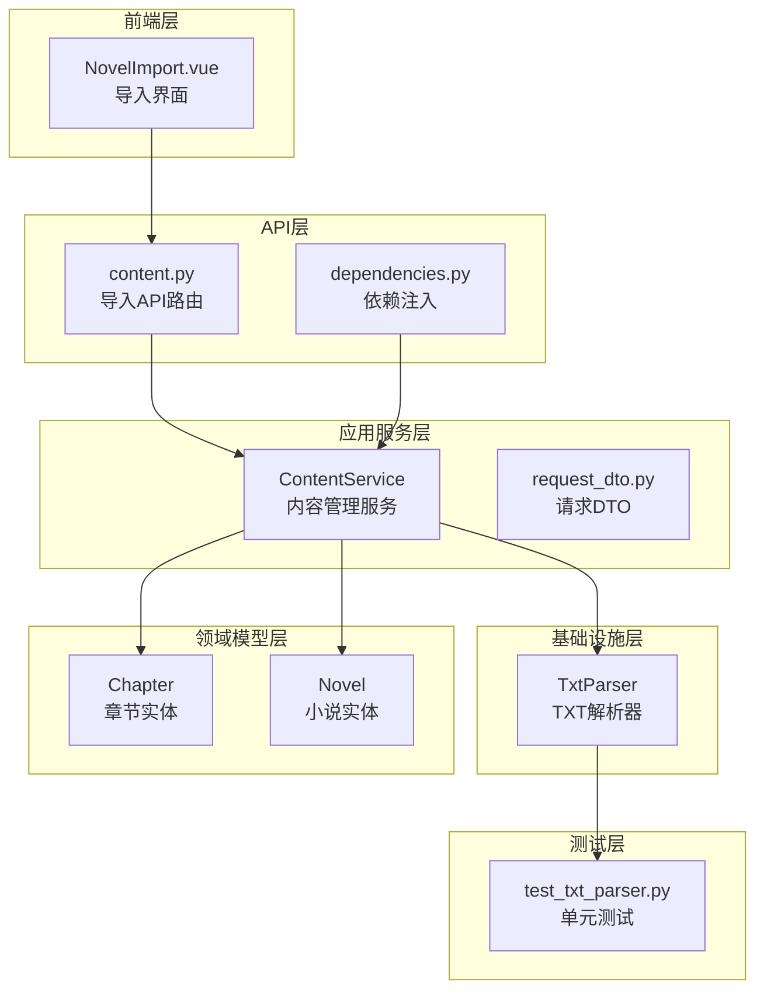
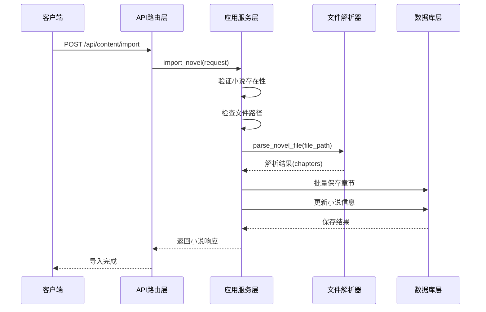
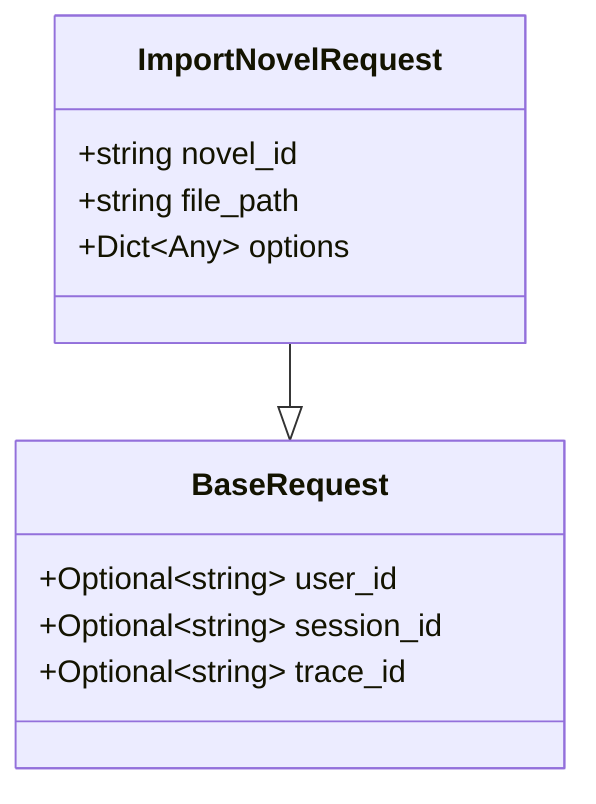
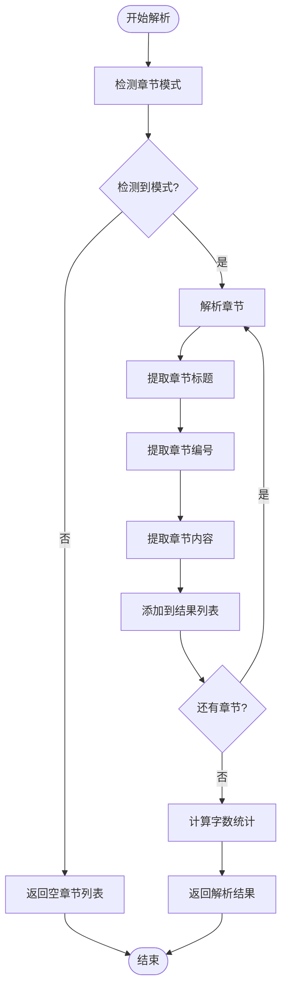
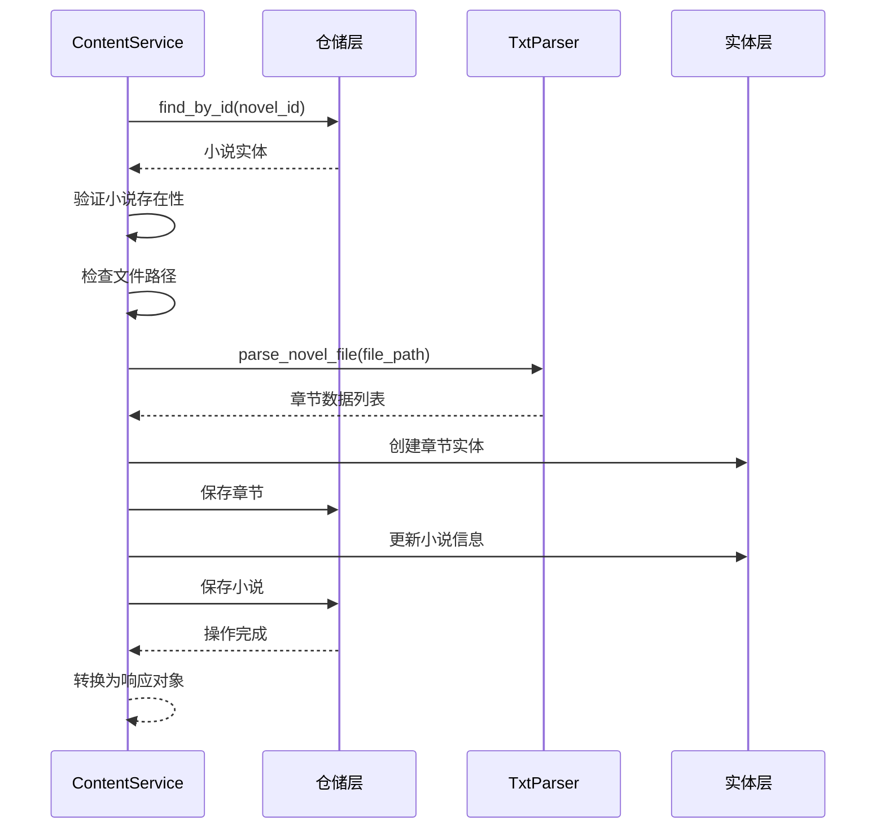
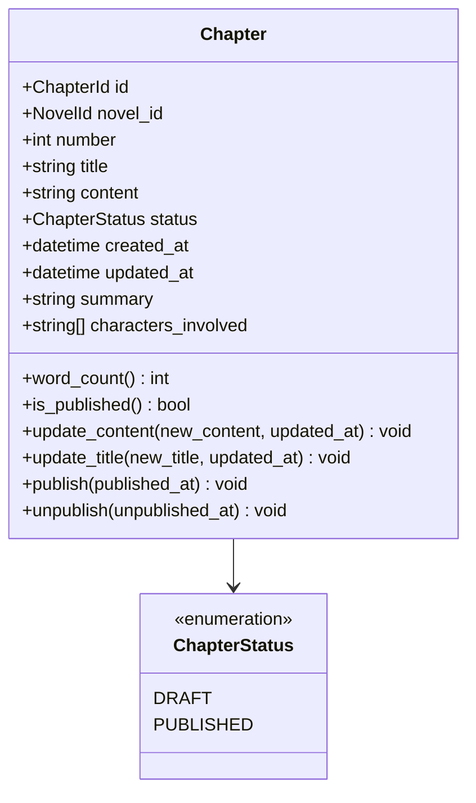
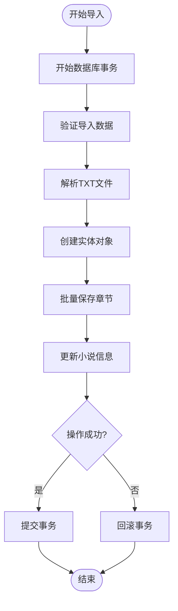
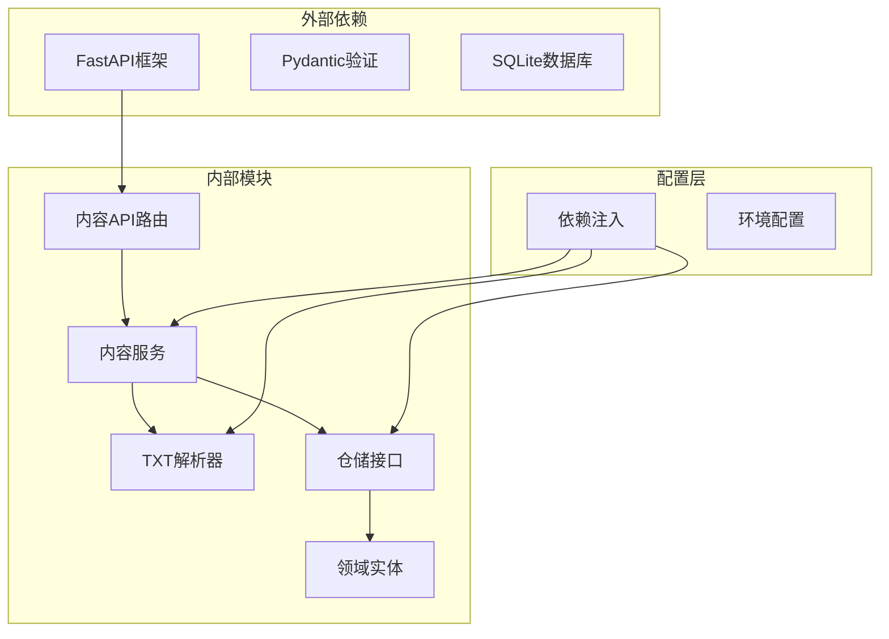
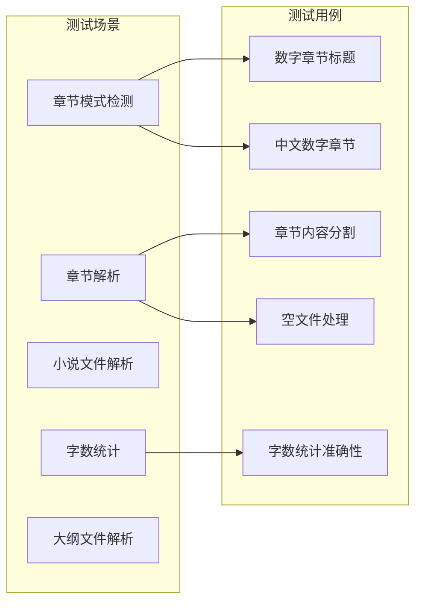

# 小说导入功能

<cite>
**本文档引用的文件**
- [presentation/api/routers/content.py](file://presentation/api/routers/content.py)
- [application/services/content_service.py](file://application/services/content_service.py)
- [infrastructure/file/txt_parser.py](file://infrastructure/file/txt_parser.py)
- [domain/entities/chapter.py](file://domain/entities/chapter.py)
- [domain/entities/novel.py](file://domain/entities/novel.py)
- [application/dto/request_dto.py](file://application/dto/request_dto.py)
- [presentation/api/dependencies.py](file://presentation/api/dependencies.py)
- [tests/unit/test_txt_parser.py](file://tests/unit/test_txt_parser.py)
- [frontend/src/views/novel/NovelImport.vue](file://frontend/src/views/novel/NovelImport.vue)
</cite>

## 目录
1. [简介](#简介)
2. [项目结构](#项目结构)
3. [核心组件](#核心组件)
4. [架构概览](#架构概览)
5. [详细组件分析](#详细组件分析)
6. [依赖关系分析](#依赖关系分析)
7. [性能考虑](#性能考虑)
8. [故障排除指南](#故障排除指南)
9. [结论](#结论)
10. [附录](#附录)

## 简介

小说导入功能是 InkTrace 小说自动编写助手的核心特性之一，允许用户将现有的 TXT 格式小说文件导入到系统中。该功能通过智能解析 TXT 文件的章节结构，自动识别章节标题、分割章节内容，并将解析结果持久化到数据库中。

本功能采用分层架构设计，包括前端用户界面、API 路由层、应用服务层、基础设施层和领域模型层。整个导入流程涵盖了请求参数验证、文件路径检查、TXT 文件解析、数据库事务处理等多个关键环节。

## 项目结构

小说导入功能涉及以下关键文件和目录：



**图表来源**
- [presentation/api/routers/content.py:1-214](file://presentation/api/routers/content.py#L1-L214)
- [application/services/content_service.py:1-169](file://application/services/content_service.py#L1-L169)
- [infrastructure/file/txt_parser.py:1-316](file://infrastructure/file/txt_parser.py#L1-L316)

**章节来源**
- [presentation/api/routers/content.py:1-214](file://presentation/api/routers/content.py#L1-L214)
- [application/services/content_service.py:1-169](file://application/services/content_service.py#L1-L169)
- [infrastructure/file/txt_parser.py:1-316](file://infrastructure/file/txt_parser.py#L1-L316)

## 核心组件

小说导入功能由以下核心组件构成：

### 1. 导入请求DTO
负责验证导入请求参数，确保请求数据的有效性。

### 2. ContentService
应用服务层的核心组件，负责协调整个导入流程。

### 3. TxtParser
基础设施层的文件解析器，专门处理 TXT 文件的章节识别和内容分割。

### 4. 章节实体
领域模型中的章节实体，包含章节的基本信息和状态管理。

### 5. 小说实体
领域模型中的聚合根，负责维护章节集合和字数统计。

**章节来源**
- [application/dto/request_dto.py:30-35](file://application/dto/request_dto.py#L30-L35)
- [application/services/content_service.py:29-51](file://application/services/content_service.py#L29-L51)
- [infrastructure/file/txt_parser.py:25-33](file://infrastructure/file/txt_parser.py#L25-L33)
- [domain/entities/chapter.py:18-37](file://domain/entities/chapter.py#L18-L37)
- [domain/entities/novel.py:20-40](file://domain/entities/novel.py#L20-L40)

## 架构概览

小说导入功能采用经典的分层架构，各层职责明确，耦合度低：



**图表来源**
- [presentation/api/routers/content.py:88-125](file://presentation/api/routers/content.py#L88-L125)
- [application/services/content_service.py:52-91](file://application/services/content_service.py#L52-L91)
- [infrastructure/file/txt_parser.py:108-139](file://infrastructure/file/txt_parser.py#L108-L139)

## 详细组件分析

### 导入请求参数验证

导入请求参数验证通过 Pydantic 的 BaseModel 实现，确保数据的完整性和有效性：



**图表来源**
- [application/dto/request_dto.py:30-35](file://application/dto/request_dto.py#L30-L35)
- [application/dto/request_dto.py:14-19](file://application/dto/request_dto.py#L14-L19)

验证规则包括：
- `novel_id`: 必填字段，长度至少为1
- `file_path`: 必填字段，长度至少为1
- 支持可选的 `options` 参数

**章节来源**
- [application/dto/request_dto.py:30-35](file://application/dto/request_dto.py#L30-L35)

### TXT文件解析过程

TxtParser 类实现了智能的 TXT 文件解析功能，能够自动识别多种格式的章节标题：

#### 章节标题识别算法



**图表来源**
- [infrastructure/file/txt_parser.py:67-106](file://infrastructure/file/txt_parser.py#L67-L106)
- [infrastructure/file/txt_parser.py:258-315](file://infrastructure/file/txt_parser.py#L258-L315)

#### 支持的章节格式

解析器支持以下多种章节标题格式：

| 格式类型 | 示例 | 正则表达式 |
|---------|------|-----------|
| 中文数字章节 | 第一章、第十二章 | `第[一二三四五六七八九十百千万零\d]+章\s+[^\n]+` |
| 数字章节 | 第1章、第123章 | `第[一二三四五六七八九十百千万零\d]+章\s+[^\n]+` |
| 英文章节 | Chapter 1, Chapter 12 | `Chapter\s*\d+[:\s]*[^\n]*` |
| 简体中文标点 | 一、标题，二、标题 | `[一二三四五六七八九十]+[、.．]\s*[^\n]+` |

**章节来源**
- [infrastructure/file/txt_parser.py:34-43](file://infrastructure/file/txt_parser.py#L34-L43)
- [infrastructure/file/txt_parser.py:67-106](file://infrastructure/file/txt_parser.py#L67-L106)

### ContentService.import_novel 方法

ContentService 是导入功能的核心协调者，负责整个导入流程的编排：

#### 导入流程详解



**图表来源**
- [application/services/content_service.py:52-91](file://application/services/content_service.py#L52-L91)

#### 关键实现细节

1. **小说存在性验证**: 确保目标小说已经存在
2. **文件路径检查**: 验证文件是否存在且可访问
3. **章节批量保存**: 使用循环逐个保存章节
4. **小说信息更新**: 更新小说的章节数量和字数统计

**章节来源**
- [application/services/content_service.py:52-91](file://application/services/content_service.py#L52-L91)

### 章节实体创建过程

章节实体的创建遵循领域驱动设计原则，包含完整的状态管理和业务逻辑：



**图表来源**
- [domain/entities/chapter.py:18-109](file://domain/entities/chapter.py#L18-L109)

#### 章节ID生成策略

章节ID使用 UUIDv4 算法生成，确保全局唯一性：
- 使用 `uuid.uuid4()` 生成随机ID
- 包装为 `ChapterId` 类型安全封装
- ID格式为字符串形式

#### 状态管理

章节状态采用枚举类型管理：
- `DRAFT`: 草稿状态（默认）
- `PUBLISHED`: 已发布状态
- 提供状态转换的业务规则验证

**章节来源**
- [domain/entities/chapter.py:27-37](file://domain/entities/chapter.py#L27-L37)
- [domain/entities/chapter.py:76-109](file://domain/entities/chapter.py#L76-L109)

### 数据库事务处理

虽然当前实现没有显式的事务管理，但可以通过以下方式改进：



## 依赖关系分析

小说导入功能的依赖关系清晰明确，遵循依赖倒置原则：



**图表来源**
- [presentation/api/dependencies.py:122-133](file://presentation/api/dependencies.py#L122-L133)
- [presentation/api/routers/content.py:88-125](file://presentation/api/routers/content.py#L88-L125)

### 关键依赖注入配置

依赖注入容器负责管理所有服务实例的生命周期：

| 服务名称 | 实现类 | 缓存策略 |
|---------|--------|----------|
| get_novel_repo | SQLiteNovelRepository | LRU缓存 |
| get_chapter_repo | SQLiteChapterRepository | LRU缓存 |
| get_character_repo | SQLiteCharacterRepository | LRU缓存 |
| get_outline_repo | SQLiteOutlineRepository | LRU缓存 |
| get_txt_parser | TxtParser | LRU缓存 |
| get_content_service | ContentService | LRU缓存 |

**章节来源**
- [presentation/api/dependencies.py:50-100](file://presentation/api/dependencies.py#L50-L100)
- [presentation/api/dependencies.py:122-133](file://presentation/api/dependencies.py#L122-L133)

## 性能考虑

### 文件解析性能优化

1. **正则表达式优化**: 使用预编译的正则表达式避免重复编译
2. **文件读取优化**: 一次性读取整个文件内容，减少I/O操作
3. **内存管理**: 对于大文件，考虑分块读取策略

### 数据库操作优化

1. **批量插入**: 使用批量操作减少数据库往返次数
2. **连接池**: 利用SQLite的连接池机制
3. **索引优化**: 确保必要的数据库索引

### 缓存策略

1. **LRU缓存**: 对频繁使用的仓储实例使用LRU缓存
2. **解析结果缓存**: 对解析过的文件内容进行缓存
3. **配置缓存**: 对环境配置进行缓存

## 故障排除指南

### 常见错误类型及解决方案

| 错误类型 | 触发条件 | 解决方案 |
|---------|----------|----------|
| 文件不存在 | `FileNotFoundError` | 检查文件路径是否正确，确认文件权限 |
| 小说不存在 | `ValueError` | 确认小说ID有效，检查数据库连接 |
| 解析失败 | `IndexError` | 检查TXT文件格式，确认章节标题格式正确 |
| 数据库错误 | `sqlite3.Error` | 检查数据库文件完整性，确认表结构正确 |

### 调试技巧

1. **日志记录**: 在关键节点添加详细的日志信息
2. **单元测试**: 使用测试用例验证各个组件的功能
3. **边界测试**: 测试各种异常情况和边界条件

**章节来源**
- [tests/unit/test_txt_parser.py:17-229](file://tests/unit/test_txt_parser.py#L17-L229)

### 单元测试覆盖

测试套件覆盖了主要的功能场景：



**图表来源**
- [tests/unit/test_txt_parser.py:41-105](file://tests/unit/test_txt_parser.py#L41-L105)
- [tests/unit/test_txt_parser.py:170-177](file://tests/unit/test_txt_parser.py#L170-L177)

**章节来源**
- [tests/unit/test_txt_parser.py:17-229](file://tests/unit/test_txt_parser.py#L17-L229)

## 结论

小说导入功能通过精心设计的分层架构和完善的错误处理机制，为用户提供了稳定可靠的小说导入体验。该功能的主要优势包括：

1. **智能解析**: 支持多种章节格式的自动识别
2. **数据验证**: 严格的请求参数验证和文件检查
3. **错误处理**: 完善的异常处理和用户友好的错误信息
4. **扩展性**: 清晰的架构设计便于功能扩展和维护

未来可以考虑的改进方向：
- 添加数据库事务支持
- 实现文件上传功能而非仅支持路径
- 增加进度反馈机制
- 支持更多文件格式

## 附录

### API使用示例

#### 前端调用示例

```javascript
// 创建小说项目
const novel = await novelApi.create({
  title: "修仙从逃出生天开始",
  author: "作者名",
  genre: "仙侠",
  target_word_count: 800000
});

// 导入小说文件
const result = await contentApi.import({
  novel_id: novel.id,
  file_path: "D:\\小说\\修仙从逃出生天开始.txt"
});
```

#### 后端接口定义

| 接口 | 方法 | 路径 | 功能描述 |
|------|------|------|----------|
| 导入小说 | POST | `/api/content/import` | 导入TXT格式小说文件 |
| 创建小说 | POST | `/api/novels/` | 创建新的小说项目 |
| 列出小说 | GET | `/api/novels/` | 获取小说列表 |
| 获取小说详情 | GET | `/api/novels/{novel_id}` | 获取小说详细信息 |

### 文件格式要求

1. **编码格式**: UTF-8 编码
2. **文件扩展名**: `.txt`
3. **章节格式**: 支持中文数字和阿拉伯数字章节标题
4. **内容格式**: 纯文本格式，支持中文标点符号

### 异常处理机制

系统提供了多层次的异常处理：

1. **HTTP异常**: 404 文件不存在，400 参数错误
2. **业务异常**: 小说不存在、解析失败等
3. **系统异常**: 数据库连接失败、磁盘空间不足等