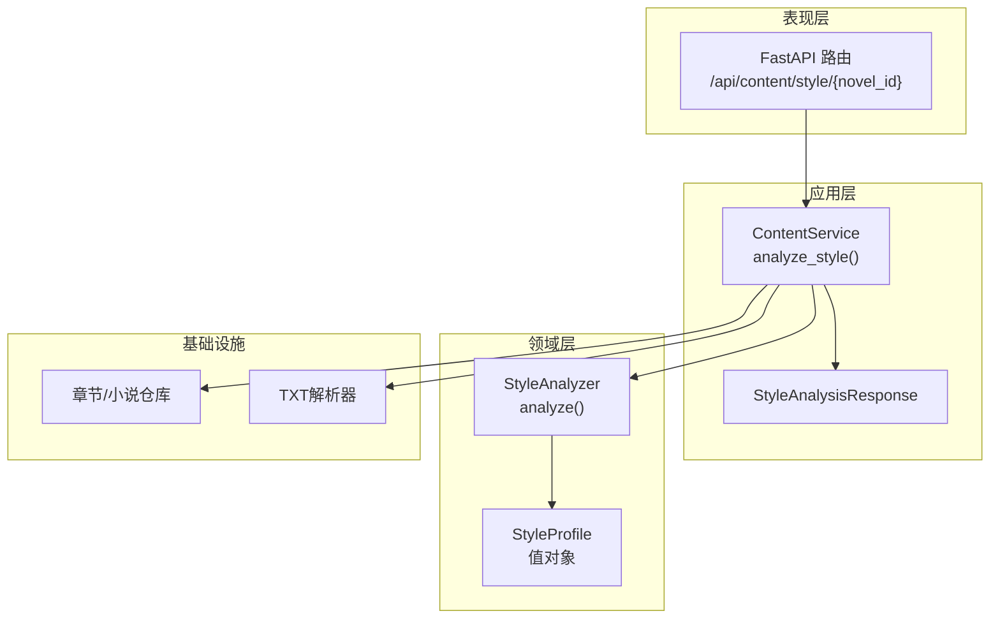
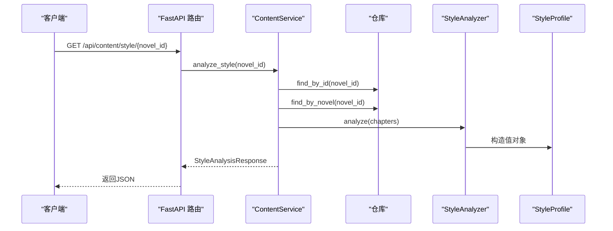
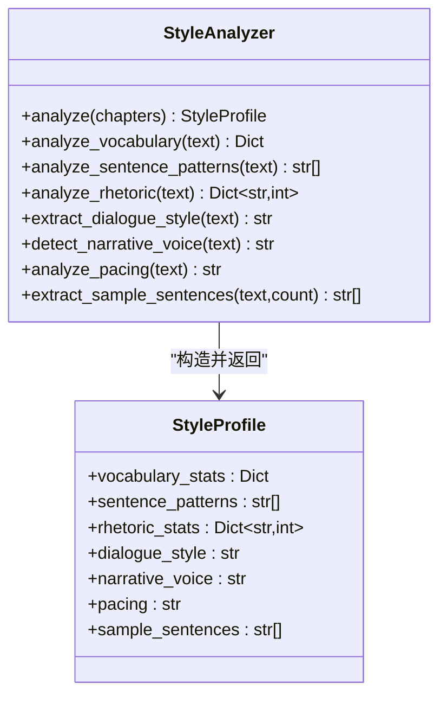
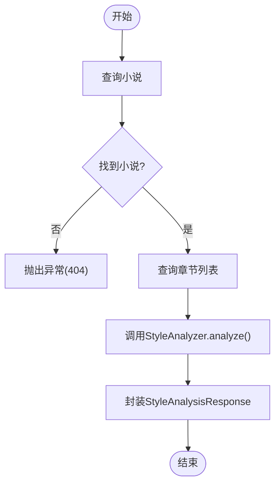
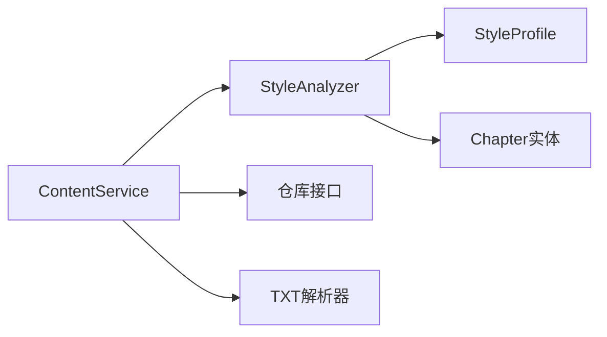

# 文风分析功能

<cite>
**本文引用的文件**
- [style_analyzer.py](file://domain/services/style_analyzer.py)
- [style_profile.py](file://domain/value_objects/style_profile.py)
- [content_service.py](file://application/services/content_service.py)
- [response_dto.py](file://application/dto/response_dto.py)
- [chapter.py](file://domain/entities/chapter.py)
- [novel.py](file://domain/entities/novel.py)
- [content.py](file://presentation/api/routers/content.py)
- [test_style_analyzer.py](file://tests/unit/test_style_analyzer.py)
- [大纲.txt](file://data/novel/大纲.txt)
- [修仙从儿时的梦中开始11-20.txt](file://data/novel/修仙从儿时的梦中开始11-20.txt)
</cite>

## 目录
1. [简介](#简介)
2. [项目结构](#项目结构)
3. [核心组件](#核心组件)
4. [架构总览](#架构总览)
5. [详细组件分析](#详细组件分析)
6. [依赖关系分析](#依赖关系分析)
7. [性能考量](#性能考量)
8. [故障排查指南](#故障排查指南)
9. [结论](#结论)
10. [附录](#附录)

## 简介
本技术文档围绕文风分析功能展开，系统性阐述StyleAnalyzer领域服务的实现原理与分析算法，覆盖词汇统计分析、句式模式识别、修辞手法检测、对话风格分析、叙述语调评估与节奏分析等维度。同时，详细说明StyleProfile值对象的数据结构与字段含义，梳理ContentService.analyze_style方法的工作流程，包括小说查询、章节获取、风格分析执行与结果封装。文档提供调用接口的示例路径与参数配置说明，并总结算法实现要点、精度优化策略与性能考虑，以及实际应用场景建议。

## 项目结构
文风分析功能位于领域层与应用层之间，采用清晰的分层架构：
- 领域层：StyleAnalyzer负责文本特征抽取与统计；StyleProfile为不可变值对象承载分析结果。
- 应用层：ContentService协调仓库与解析器，驱动StyleAnalyzer执行分析，并将结果封装为响应DTO。
- 表现层：FastAPI路由提供REST接口，调用ContentService完成文风分析。

图表来源
- [content.py:127-147](file://presentation/api/routers/content.py#L127-L147)
- [content_service.py:93-121](file://application/services/content_service.py#L93-L121)
- [style_analyzer.py:25-66](file://domain/services/style_analyzer.py#L25-L66)
- [style_profile.py:14-29](file://domain/value_objects/style_profile.py#L14-L29)

章节来源
- [content.py:127-147](file://presentation/api/routers/content.py#L127-L147)
- [content_service.py:93-121](file://application/services/content_service.py#L93-L121)
- [style_analyzer.py:25-66](file://domain/services/style_analyzer.py#L25-L66)
- [style_profile.py:14-29](file://domain/value_objects/style_profile.py#L14-L29)

## 核心组件
- StyleAnalyzer：领域服务，负责对章节文本集合进行文风特征抽取与统计，输出StyleProfile。
- StyleProfile：值对象，不可变，承载词汇统计、句式模式、修辞统计、对话风格、叙述语调、节奏与示例句子等字段。
- ContentService：应用服务，负责业务编排，查询小说与章节，调用StyleAnalyzer执行分析，并封装为响应DTO。
- FastAPI路由：对外提供HTTP接口，接收novel_id，调用ContentService.analyze_style并返回结果。

章节来源
- [style_analyzer.py:18-66](file://domain/services/style_analyzer.py#L18-L66)
- [style_profile.py:14-29](file://domain/value_objects/style_profile.py#L14-L29)
- [content_service.py:93-121](file://application/services/content_service.py#L93-L121)
- [response_dto.py:61-69](file://application/dto/response_dto.py#L61-L69)

## 架构总览
文风分析的端到端流程如下：
- 输入：小说ID
- 查询：通过小说仓库定位小说，通过章节仓库获取该小说的所有章节
- 组织：将章节内容拼接为统一文本
- 分析：StyleAnalyzer执行多项特征抽取
- 结果：封装为StyleAnalysisResponse返回

图表来源
- [content.py:127-147](file://presentation/api/routers/content.py#L127-L147)
- [content_service.py:93-121](file://application/services/content_service.py#L93-L121)
- [style_analyzer.py:25-66](file://domain/services/style_analyzer.py#L25-L66)

## 详细组件分析

### StyleAnalyzer 类
- 职责：对章节文本集合进行文风特征抽取，返回StyleProfile值对象。
- 关键方法：
  - analyze：入口方法，汇总各项分析结果
  - analyze_vocabulary：词汇统计（高频词、平均词长、词汇丰富度、总词数、独立词数）
  - analyze_sentence_patterns：句式模板识别（基于逗号分割的复合句片段）
  - analyze_rhetoric：修辞统计（比喻、拟人、排比、夸张）
  - extract_dialogue_style：对话风格（长度风格与情感倾向）
  - detect_narrative_voice：叙述视角（第一人称/第三人称/混合）
  - analyze_pacing：节奏（快/中等/慢）
  - extract_sample_sentences：提取示例句子

图表来源
- [style_analyzer.py:25-286](file://domain/services/style_analyzer.py#L25-L286)
- [style_profile.py:14-29](file://domain/value_objects/style_profile.py#L14-L29)

章节来源
- [style_analyzer.py:25-286](file://domain/services/style_analyzer.py#L25-L286)
- [style_profile.py:14-29](file://domain/value_objects/style_profile.py#L14-L29)

#### 词汇统计分析
- 算法要点
  - 使用中文字符匹配提取词语序列
  - Counter统计词频，取Top N高频词
  - 计算平均词长与词汇丰富度（唯一词数/总词数）
  - 输出字段：高频词、平均词长、词汇丰富度、总词数、独立词数
- 复杂度
  - 时间复杂度：O(n)，n为词数
  - 空间复杂度：O(k)，k为唯一词数

章节来源
- [style_analyzer.py:68-99](file://domain/services/style_analyzer.py#L68-L99)

#### 句式模式识别
- 算法要点
  - 以中文标点与换行分割句子
  - 在前若干句中查找逗号分隔的复合句片段，抽象为“长度+逗号+长度+...”模板
  - 去重并限制返回数量
- 复杂度
  - 时间复杂度：O(m)，m为样本句数
  - 空间复杂度：O(p)，p为模板数量

章节来源
- [style_analyzer.py:101-126](file://domain/services/style_analyzer.py#L101-L126)

#### 修辞手法检测
- 算法要点
  - 比喻：基于“如/像/仿佛+修饰”的模式计数
  - 拟人：基于“代词+动词/名词”的模式计数
  - 排比：基于“逗号+逗号”结构计数
  - 夸张：基于特定成语/词汇集合计数
- 复杂度
  - 时间复杂度：O(t)，t为文本长度×模式数
  - 空间复杂度：O(1)

章节来源
- [style_analyzer.py:128-177](file://domain/services/style_analyzer.py#L128-L177)

#### 对话风格分析
- 算法要点
  - 基于引号提取对话片段
  - 计算平均长度与感叹号/问号比例，划分长度风格与情感倾向
  - 输出组合风格描述
- 复杂度
  - 时间复杂度：O(d)，d为对话片段数
  - 空间复杂度：O(1)

章节来源
- [style_analyzer.py:179-215](file://domain/services/style_analyzer.py#L179-L215)

#### 叙述语调评估
- 算法要点
  - 基于“我/咱”与“他/她/它”出现次数比较，判定第一人称/第三人称/混合视角
- 复杂度
  - 时间复杂度：O(c)，c为字符数
  - 空间复杂度：O(1)

章节来源
- [style_analyzer.py:217-237](file://domain/services/style_analyzer.py#L217-L237)

#### 节奏分析
- 算法要点
  - 以中文标点分割句子，计算平均句长与短句比例，划分快/中等/慢节奏
- 复杂度
  - 时间复杂度：O(s)，s为句子数
  - 空间复杂度：O(1)

章节来源
- [style_analyzer.py:239-267](file://domain/services/style_analyzer.py#L239-L267)

#### 示例句子提取
- 算法要点
  - 以中文标点分割句子，过滤过短句子，返回前N句
- 复杂度
  - 时间复杂度：O(s)
  - 空间复杂度：O(N)

章节来源
- [style_analyzer.py:269-285](file://domain/services/style_analyzer.py#L269-L285)

### StyleProfile 值对象
- 字段说明
  - vocabulary_stats：词汇统计字典
  - sentence_patterns：句式模板列表
  - rhetoric_stats：修辞统计字典
  - dialogue_style：对话风格描述
  - narrative_voice：叙述视角描述
  - pacing：节奏描述
  - sample_sentences：示例句子列表
- 设计特性
  - 不可变数据类，便于跨层传递与缓存

章节来源
- [style_profile.py:14-29](file://domain/value_objects/style_profile.py#L14-L29)

### ContentService.analyze_style 方法
- 工作流程
  - 根据novel_id查询小说实体
  - 查询该小说的所有章节
  - 调用StyleAnalyzer.analyze(chapters)获取StyleProfile
  - 将StyleProfile字段映射到StyleAnalysisResponse并返回
- 错误处理
  - 小说不存在时抛出业务异常，由路由层转换为HTTP 404

图表来源
- [content_service.py:93-121](file://application/services/content_service.py#L93-L121)

章节来源
- [content_service.py:93-121](file://application/services/content_service.py#L93-L121)

### API 调用示例与参数配置
- 接口定义
  - 方法：GET
  - 路径：/api/content/style/{novel_id}
  - 响应类型：StyleAnalysisResponse
- 参数配置
  - 路径参数：novel_id（字符串）
- 响应字段
  - vocabulary_stats：词汇统计字典
  - sentence_patterns：句式模板列表
  - rhetoric_stats：修辞统计字典
  - dialogue_style：对话风格
  - narrative_voice：叙述语调
  - pacing：节奏
  - sample_sentences：示例句子列表
- 示例调用路径
  - [调用示例路径:127-147](file://presentation/api/routers/content.py#L127-L147)

章节来源
- [content.py:127-147](file://presentation/api/routers/content.py#L127-L147)
- [response_dto.py:61-69](file://application/dto/response_dto.py#L61-L69)

### 数据模型与实体
- Chapter实体
  - 字段：id、novel_id、number、title、content、status、created_at、updated_at、summary、characters_involved
  - 方法：word_count、is_published、update_content、update_title、publish、unpublish
- Novel聚合根
  - 字段：id、title、author、genre、target_word_count、created_at、updated_at、current_word_count、chapters、characters、outline
  - 方法：add_chapter、get_chapter、get_chapter_by_number、get_latest_chapters、add_character、get_character、get_protagonist、set_outline、_recalculate_word_count

章节来源
- [chapter.py:18-109](file://domain/entities/chapter.py#L18-L109)
- [novel.py:20-178](file://domain/entities/novel.py#L20-L178)

## 依赖关系分析
- 组件耦合
  - ContentService依赖仓库接口与StyleAnalyzer，耦合度低，便于替换与测试
  - StyleAnalyzer仅依赖章节实体与值对象，无外部依赖，内聚性高
- 外部依赖
  - 正则表达式用于文本分割与模式匹配
  - Python内置Counter用于词频统计
- 循环依赖
  - 未发现循环依赖

图表来源
- [content_service.py:22-49](file://application/services/content_service.py#L22-L49)
- [style_analyzer.py:14-15](file://domain/services/style_analyzer.py#L14-L15)

章节来源
- [content_service.py:22-49](file://application/services/content_service.py#L22-L49)
- [style_analyzer.py:14-15](file://domain/services/style_analyzer.py#L14-L15)

## 性能考量
- 时间复杂度
  - 词汇统计：O(n)
  - 句式模式：O(m)
  - 修辞检测：O(t)
  - 对话风格：O(d)
  - 叙述语调：O(c)
  - 节奏分析：O(s)
  - 示例句子：O(s)
- 空间复杂度
  - 词频统计：O(k)
  - 句式模板：O(p)
  - 其他：O(1)
- 优化建议
  - 批量处理：对多章节文本进行一次性拼接，减少多次I/O
  - 缓存策略：对高频分析结果进行短期缓存，降低重复计算
  - 并行化：在多核环境下对不同章节的分析任务进行并发执行
  - 正则优化：复用编译后的正则表达式，减少重复编译开销
  - 分页与采样：对超长文本采用分页或采样策略，控制内存占用

## 故障排查指南
- 常见问题
  - 小说不存在：ContentService在查询不到小说时抛出异常，路由层返回404
  - 章节为空：StyleAnalyzer对空章节返回默认值对象，确保接口稳定
  - 文本编码：确保TXT解析器正确处理编码，避免中文字符识别异常
- 单元测试参考
  - 测试用例覆盖空章节、单章节、多章节、词汇分析、句式分析、修辞分析、对话风格提取等场景
- 排查路径
  - [单元测试入口:19-115](file://tests/unit/test_style_analyzer.py#L19-L115)

章节来源
- [content_service.py:105-107](file://application/services/content_service.py#L105-L107)
- [style_analyzer.py:37-46](file://domain/services/style_analyzer.py#L37-L46)
- [test_style_analyzer.py:42-114](file://tests/unit/test_style_analyzer.py#L42-L114)

## 结论
文风分析功能通过StyleAnalyzer对文本进行多维度特征抽取，结合StyleProfile值对象与ContentService的业务编排，实现了从数据到洞察的闭环。该实现具备良好的可扩展性与可测试性，适合在小说写作、风格一致性评估与创作辅助等场景中应用。建议在生产环境中引入缓存与并行化策略，以进一步提升性能与稳定性。

## 附录
- 示例数据
  - [大纲.txt](file://data/novel/大纲.txt)
  - [修仙从儿时的梦中开始11-20.txt](file://data/novel/修仙从儿时的梦中开始11-20.txt)
- 相关实现文件
  - [style_analyzer.py](file://domain/services/style_analyzer.py)
  - [style_profile.py](file://domain/value_objects/style_profile.py)
  - [content_service.py](file://application/services/content_service.py)
  - [response_dto.py](file://application/dto/response_dto.py)
  - [chapter.py](file://domain/entities/chapter.py)
  - [novel.py](file://domain/entities/novel.py)
  - [content.py](file://presentation/api/routers/content.py)
  - [test_style_analyzer.py](file://tests/unit/test_style_analyzer.py)