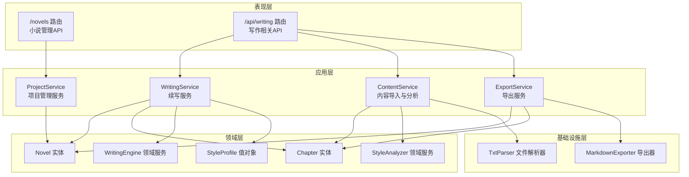
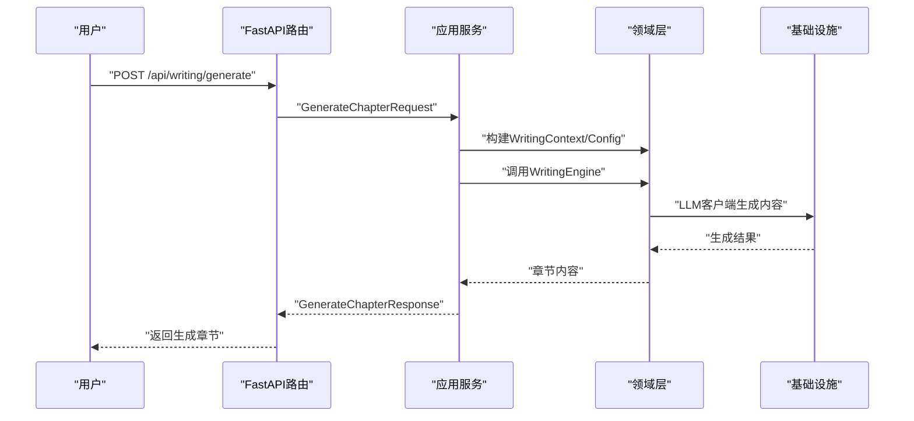
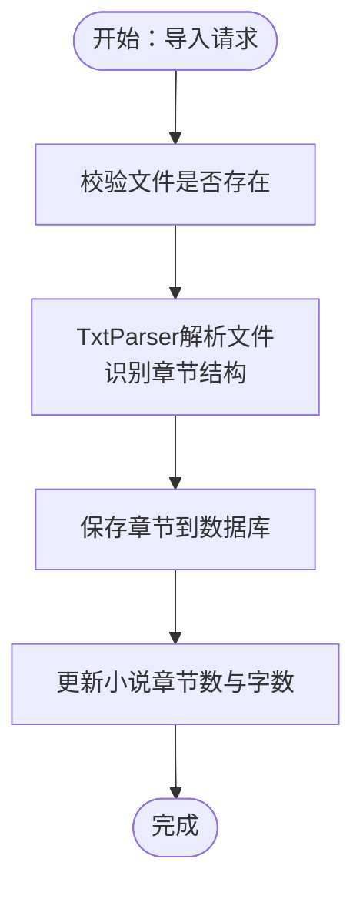
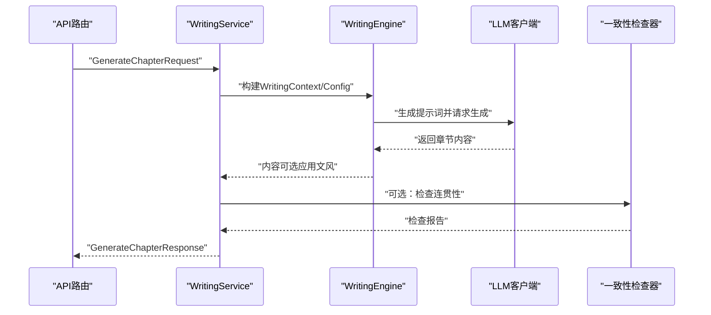
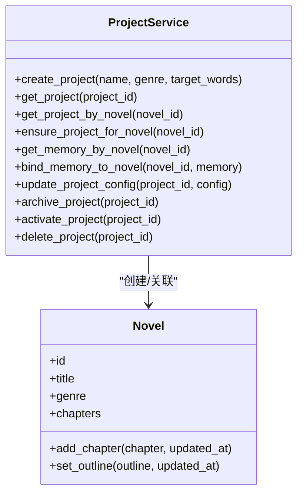
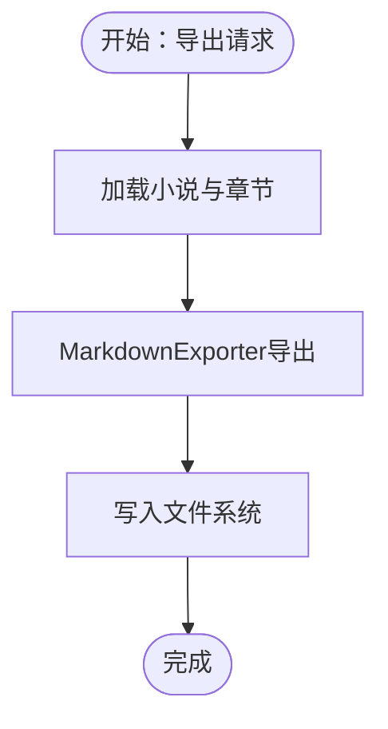
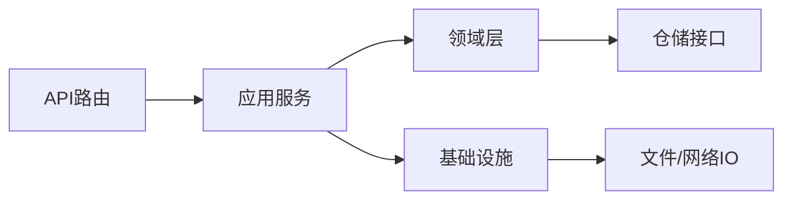

# 核心功能模块

<cite>
**本文引用的文件**
- [project_service.py](file://application/services/project_service.py)
- [writing_service.py](file://application/services/writing_service.py)
- [content_service.py](file://application/services/content_service.py)
- [export_service.py](file://application/services/export_service.py)
- [style_analyzer.py](file://domain/services/style_analyzer.py)
- [writing_engine.py](file://domain/services/writing_engine.py)
- [novel.py](file://domain/entities/novel.py)
- [chapter.py](file://domain/entities/chapter.py)
- [txt_parser.py](file://infrastructure/file/txt_parser.py)
- [markdown_exporter.py](file://infrastructure/file/markdown_exporter.py)
- [request_dto.py](file://application/dto/request_dto.py)
- [response_dto.py](file://application/dto/response_dto.py)
- [novel.py（API路由）](file://presentation/api/routers/novel.py)
- [writing.py（API路由）](file://presentation/api/routers/writing.py)
- [style_profile.py](file://domain/value_objects/style_profile.py)
</cite>

## 目录
1. [引言](#引言)
2. [项目结构](#项目结构)
3. [核心组件](#核心组件)
4. [架构总览](#架构总览)
5. [详细组件分析](#详细组件分析)
6. [依赖分析](#依赖分析)
7. [性能考虑](#性能考虑)
8. [故障排查指南](#故障排查指南)
9. [结论](#结论)
10. [附录](#附录)

## 引言
本文件面向InkTrace项目的使用者与开发者，系统梳理四大核心功能模块：小说导入与分析、AI写作引擎、项目管理、导出功能。文档从架构设计、业务逻辑、技术实现与用户交互流程入手，解释各模块职责边界、数据流转与协作关系，并提供使用示例与最佳实践建议。

## 项目结构
InkTrace采用分层架构：表现层(Presentation)通过FastAPI路由暴露REST接口；应用层(Application)封装业务用例与服务编排；领域层(Domain)定义实体、值对象与领域服务；基础设施层(Infrastructure)提供文件解析、导出与LLM客户端等能力。

图表来源
- [novel.py（API路由）:21-162](file://presentation/api/routers/novel.py#L21-L162)
- [writing.py（API路由）:37-278](file://presentation/api/routers/writing.py#L37-L278)
- [project_service.py:21-203](file://application/services/project_service.py#L21-L203)
- [writing_service.py:30-180](file://application/services/writing_service.py#L30-L180)
- [content_service.py:29-169](file://application/services/content_service.py#L29-L169)
- [export_service.py:23-70](file://application/services/export_service.py#L23-L70)
- [novel.py:20-178](file://domain/entities/novel.py#L20-L178)
- [chapter.py:18-109](file://domain/entities/chapter.py#L18-L109)
- [style_profile.py:14-30](file://domain/value_objects/style_profile.py#L14-L30)
- [writing_engine.py:30-184](file://domain/services/writing_engine.py#L30-L184)
- [style_analyzer.py:18-286](file://domain/services/style_analyzer.py#L18-L286)
- [txt_parser.py:25-316](file://infrastructure/file/txt_parser.py#L25-L316)
- [markdown_exporter.py:17-126](file://infrastructure/file/markdown_exporter.py#L17-L126)

章节来源
- [novel.py（API路由）:21-162](file://presentation/api/routers/novel.py#L21-L162)
- [writing.py（API路由）:37-278](file://presentation/api/routers/writing.py#L37-L278)

## 核心组件
- 小说导入与分析：负责TXT文件解析、章节结构识别、数据验证与入库，同时提供文风与剧情分析能力。
- AI写作引擎：基于提示工程与文风特征，生成符合大纲与上下文的章节内容，并可选进行连贯性检查。
- 项目管理：围绕“小说-项目”映射，提供创建、查询、配置更新、归档与删除等生命周期管理。
- 导出功能：支持将整部小说或章节导出为Markdown格式，便于外部编辑与发布。

章节来源
- [content_service.py:29-169](file://application/services/content_service.py#L29-L169)
- [writing_service.py:30-180](file://application/services/writing_service.py#L30-L180)
- [project_service.py:21-203](file://application/services/project_service.py#L21-L203)
- [export_service.py:23-70](file://application/services/export_service.py#L23-L70)

## 架构总览
四大模块在应用层通过服务编排协同工作，领域层提供稳定的实体与值对象，基础设施层提供文件解析与导出能力。API路由作为入口，将HTTP请求转换为DTO并调用相应服务。

图表来源
- [writing.py（API路由）:111-174](file://presentation/api/routers/writing.py#L111-L174)
- [writing_service.py:91-165](file://application/services/writing_service.py#L91-L165)
- [writing_engine.py:52-80](file://domain/services/writing_engine.py#L52-L80)

## 详细组件分析

### 小说导入与分析模块
- 功能职责
  - 导入TXT文件，解析简介与章节，校验文件存在性与小说存在性后入库。
  - 提供文风分析（词汇、句式、修辞、对话风格、叙述视角、节奏）与剧情分析（角色、时间线、伏笔）。
- 关键实现
  - TXT解析器：自动检测章节标题模式，提取章节标题、编号与正文，支持中文数字转阿拉伯数字。
  - 文风分析器：统计高频词、平均词长、词汇丰富度、句式模板、修辞手法、对话风格、叙述视角、节奏与示例句子。
  - 内容服务：将解析后的章节保存至数据库，更新小说的章节数与总字数。
- 数据流
  - 请求DTO → 内容服务 → TXT解析器 → 章节实体 → 章节仓库 → 小说实体更新。
- 用户交互
  - 选择TXT文件 → 触发导入 → 显示导入进度与结果 → 可选触发文风/剧情分析。

图表来源
- [content_service.py:52-91](file://application/services/content_service.py#L52-L91)
- [txt_parser.py:108-139](file://infrastructure/file/txt_parser.py#L108-L139)
- [novel.py:46-62](file://domain/entities/novel.py#L46-L62)

章节来源
- [content_service.py:29-169](file://application/services/content_service.py#L29-L169)
- [txt_parser.py:25-316](file://infrastructure/file/txt_parser.py#L25-L316)
- [style_analyzer.py:18-286](file://domain/services/style_analyzer.py#L18-L286)
- [novel.py:20-178](file://domain/entities/novel.py#L20-L178)

### AI写作引擎模块
- 功能职责
  - 基于大纲与上下文生成章节内容，支持文风模拟与连贯性检查。
  - 支持剧情规划（生成剧情节点），并与续写服务配合实现“继续写下一章”的工具链。
- 关键实现
  - 写作引擎：构建生成提示词，调用LLM客户端生成内容，可选应用文风特征。
  - 连贯性检查：对新生成章节与历史章节进行一致性校验，输出不一致项与警告。
  - 续写服务：组装上下文与配置，调用引擎生成章节并持久化。
- 数据流
  - DTO → 续写服务 → 写作引擎 → LLM客户端 → 返回内容 → 可选一致性检查 → 响应DTO。

图表来源
- [writing.py（API路由）:111-174](file://presentation/api/routers/writing.py#L111-L174)
- [writing_service.py:91-165](file://application/services/writing_service.py#L91-L165)
- [writing_engine.py:52-80](file://domain/services/writing_engine.py#L52-L80)

章节来源
- [writing_service.py:30-180](file://application/services/writing_service.py#L30-L180)
- [writing_engine.py:30-184](file://domain/services/writing_engine.py#L30-L184)
- [style_profile.py:14-30](file://domain/value_objects/style_profile.py#L14-L30)

### 项目管理模块
- 功能职责
  - 创建/查询/更新/归档/删除小说项目，维护“小说-项目”映射关系。
  - 项目配置包含题材、目标字数与记忆（memory）等。
- 关键实现
  - 项目服务：创建项目时同步创建对应小说实体，确保项目存在性，支持读取/绑定记忆。
  - 小说实体：聚合章节、人物、大纲，维护章节数与总字数。
- 数据流
  - DTO → 项目服务 → 小说/项目仓库 → 返回项目信息。

图表来源
- [project_service.py:21-203](file://application/services/project_service.py#L21-L203)
- [novel.py:20-178](file://domain/entities/novel.py#L20-L178)

章节来源
- [project_service.py:21-203](file://application/services/project_service.py#L21-L203)
- [novel.py:20-178](file://domain/entities/novel.py#L20-L178)

### 导出功能模块
- 功能职责
  - 将整部小说与章节导出为Markdown格式，包含元数据与目录。
- 关键实现
  - 导出服务：读取小说与章节，调用Markdown导出器生成文件。
  - Markdown导出器：格式化元数据、目录与章节内容。
- 数据流
  - DTO → 导出服务 → Markdown导出器 → 文件系统。

图表来源
- [export_service.py:39-69](file://application/services/export_service.py#L39-L69)
- [markdown_exporter.py:62-100](file://infrastructure/file/markdown_exporter.py#L62-L100)

章节来源
- [export_service.py:23-70](file://application/services/export_service.py#L23-L70)
- [markdown_exporter.py:17-126](file://infrastructure/file/markdown_exporter.py#L17-L126)

## 依赖分析
- 组件耦合
  - 应用服务之间低耦合：导入/分析、写作、导出分别由独立服务承担职责。
  - 领域层高内聚：实体与值对象封装不变量，避免跨模块污染。
  - 基础设施层可替换：文件解析与导出策略可扩展。
- 外部依赖
  - LLM客户端：通过工厂注入，便于切换不同模型供应商。
  - FastAPI路由：统一处理请求/响应与异常。

图表来源
- [writing.py（API路由）:37-278](file://presentation/api/routers/writing.py#L37-L278)
- [writing_service.py:30-180](file://application/services/writing_service.py#L30-L180)
- [content_service.py:29-169](file://application/services/content_service.py#L29-L169)
- [export_service.py:23-70](file://application/services/export_service.py#L23-L70)

章节来源
- [writing.py（API路由）:37-278](file://presentation/api/routers/writing.py#L37-L278)
- [writing_service.py:30-180](file://application/services/writing_service.py#L30-L180)

## 性能考虑
- 文风分析与导出
  - 文风分析对全文扫描，建议限制分析范围或缓存分析结果。
  - 导出时一次性写入，注意磁盘IO与大文件内存占用。
- 写作生成
  - LLM调用成本较高，建议启用灰度分流与缓存热点提示词。
  - 连贯性检查复杂度随历史章节数量增长，建议限制检查窗口大小。
- 并发与幂等
  - 续写接口通过幂等键避免重复生成，结合任务队列提升稳定性。

## 故障排查指南
- 常见错误与定位
  - 小说/项目不存在：检查ID有效性与项目绑定关系。
  - 文件不存在：确认文件路径与权限。
  - 导出格式不支持：当前仅支持Markdown。
  - 续写失败：检查memory是否为空、目标字数是否合理。
- 建议
  - 使用响应DTO中的trace_id进行问题追踪。
  - 在API路由层捕获并记录异常，返回标准化错误响应。

章节来源
- [writing.py（API路由）:176-278](file://presentation/api/routers/writing.py#L176-L278)
- [export_service.py:39-69](file://application/services/export_service.py#L39-L69)

## 结论
InkTrace通过清晰的分层架构与职责分离，实现了从内容导入、文风与剧情分析，到AI驱动的章节生成与导出的完整闭环。项目管理模块贯穿始终，确保“小说-项目”的一致性与可追溯性。建议在生产环境中结合灰度策略、缓存与任务队列，持续优化生成质量与性能。

## 附录
- 使用示例（步骤）
  - 创建项目：POST /novels，传入标题、题材与目标字数。
  - 导入TXT：调用导入服务，选择文件并提交请求。
  - 触发文风/剧情分析：调用分析接口，查看统计结果。
  - 生成章节：POST /api/writing/generate，设置目标字数与是否启用文风模拟。
  - 继续写下一章：POST /api/writing/continue，传入目标与记忆。
  - 导出小说：POST /api/export，选择输出路径与格式（当前为markdown）。
- 最佳实践
  - 先导入再分析，再生成，最后导出。
  - 合理设置目标字数，避免过大导致LLM超时。
  - 定期清理历史章节，控制连检查窗口大小。
  - 使用memory记录创作进度，便于继续写下一章。