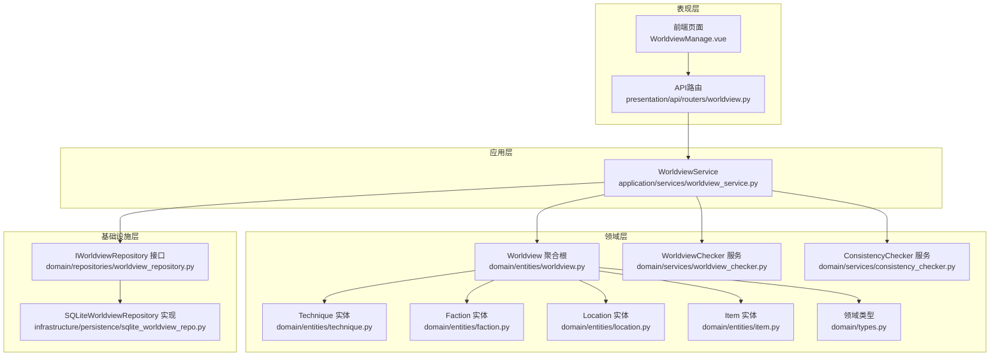
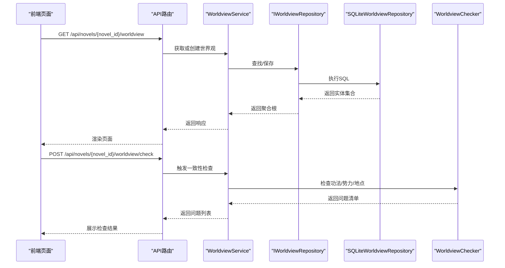
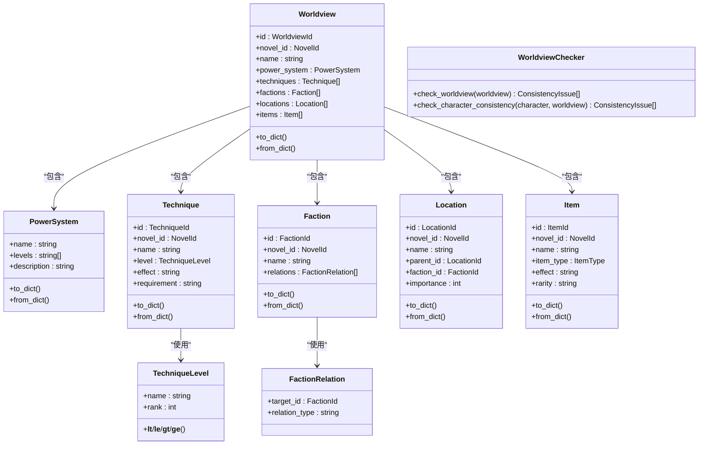
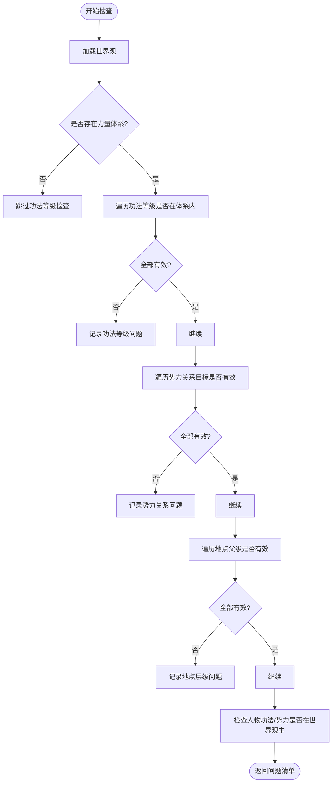
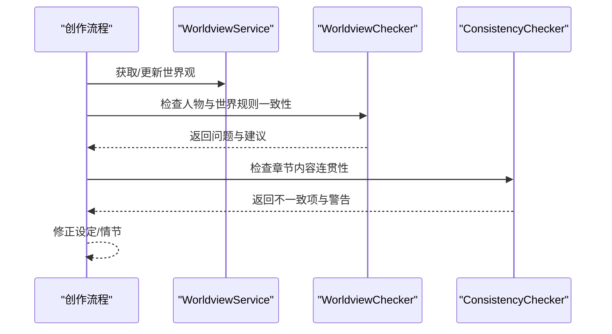
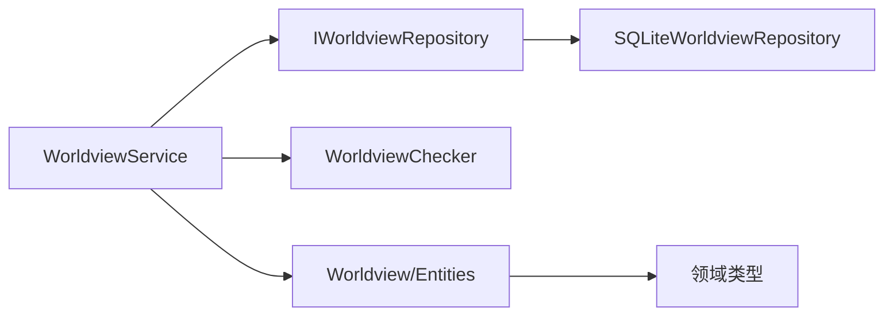

# 世界观管理服务

<cite>
**本文档引用的文件**
- [application/services/worldview_service.py](file://application/services/worldview_service.py)
- [domain/entities/worldview.py](file://domain/entities/worldview.py)
- [domain/entities/technique.py](file://domain/entities/technique.py)
- [domain/entities/faction.py](file://domain/entities/faction.py)
- [domain/entities/location.py](file://domain/entities/location.py)
- [domain/entities/item.py](file://domain/entities/item.py)
- [domain/repositories/worldview_repository.py](file://domain/repositories/worldview_repository.py)
- [domain/services/worldview_checker.py](file://domain/services/worldview_checker.py)
- [domain/services/consistency_checker.py](file://domain/services/consistency_checker.py)
- [domain/types.py](file://domain/types.py)
- [infrastructure/persistence/sqlite_worldview_repo.py](file://infrastructure/persistence/sqlite_worldview_repo.py)
- [presentation/api/routers/worldview.py](file://presentation/api/routers/worldview.py)
- [frontend/src/views/worldview/WorldviewManage.vue](file://frontend/src/views/worldview/WorldviewManage.vue)
- [tests/unit/test_worldview.py](file://tests/unit/test_worldview.py)
</cite>

## 目录
1. [简介](#简介)
2. [项目结构](#项目结构)
3. [核心组件](#核心组件)
4. [架构总览](#架构总览)
5. [详细组件分析](#详细组件分析)
6. [依赖分析](#依赖分析)
7. [性能考虑](#性能考虑)
8. [故障排查指南](#故障排查指南)
9. [结论](#结论)
10. [附录](#附录)

## 简介
本文件面向“世界观管理服务”的使用者与维护者，系统化阐述其在小说创作中的定位与能力边界：围绕“世界观配置管理、设定规则定义、世界规则构建与一致性检查”四大核心主题，给出数据模型设计、一致性检查算法、与创作流程的集成方式、版本与变更追踪策略，以及复杂规则系统的实现与性能优化建议。文档同时提供可操作的使用示例与可视化图示，帮助不同技术背景的读者快速上手并深入理解。

## 项目结构
该服务采用分层架构（表现层、应用层、领域层、基础设施层），围绕“世界观聚合根”组织数据与业务逻辑，并通过仓储接口解耦持久化实现。前端通过API路由暴露REST接口，支持用户在界面上完成世界观的创建、编辑与一致性检查。

**图表来源**
- [presentation/api/routers/worldview.py:1-375](file://presentation/api/routers/worldview.py#L1-L375)
- [application/services/worldview_service.py:1-235](file://application/services/worldview_service.py#L1-L235)
- [domain/repositories/worldview_repository.py:1-147](file://domain/repositories/worldview_repository.py#L1-L147)
- [infrastructure/persistence/sqlite_worldview_repo.py:1-455](file://infrastructure/persistence/sqlite_worldview_repo.py#L1-L455)
- [domain/entities/worldview.py:1-154](file://domain/entities/worldview.py#L1-L154)
- [domain/entities/technique.py:1-106](file://domain/entities/technique.py#L1-L106)
- [domain/entities/faction.py:1-113](file://domain/entities/faction.py#L1-L113)
- [domain/entities/location.py:1-82](file://domain/entities/location.py#L1-L82)
- [domain/entities/item.py:1-79](file://domain/entities/item.py#L1-L79)
- [domain/services/worldview_checker.py:1-161](file://domain/services/worldview_checker.py#L1-L161)
- [domain/services/consistency_checker.py:1-218](file://domain/services/consistency_checker.py#L1-L218)
- [domain/types.py:1-284](file://domain/types.py#L1-L284)

**章节来源**
- [presentation/api/routers/worldview.py:1-375](file://presentation/api/routers/worldview.py#L1-L375)
- [application/services/worldview_service.py:1-235](file://application/services/worldview_service.py#L1-L235)
- [domain/repositories/worldview_repository.py:1-147](file://domain/repositories/worldview_repository.py#L1-L147)
- [infrastructure/persistence/sqlite_worldview_repo.py:1-455](file://infrastructure/persistence/sqlite_worldview_repo.py#L1-L455)

## 核心组件
- 世界聚合根：承载“力量体系、功法、势力、地点、物品”等子域集合，并提供序列化/反序列化与增删改查辅助方法。
- 应用服务：封装业务用例（创建/查询/删除、更新力量体系、一致性检查）。
- 仓储接口与实现：抽象持久化契约，当前以SQLite实现。
- 一致性检查服务：对功法等级、势力关系、地点层级进行规则校验；另有一个更广泛的“连贯性检查”服务用于章节内容一致性校验。
- 前端视图：提供可视化编辑与一致性检查入口。

**章节来源**
- [domain/entities/worldview.py:44-154](file://domain/entities/worldview.py#L44-L154)
- [application/services/worldview_service.py:25-235](file://application/services/worldview_service.py#L25-L235)
- [domain/repositories/worldview_repository.py:21-147](file://domain/repositories/worldview_repository.py#L21-L147)
- [domain/services/worldview_checker.py:29-161](file://domain/services/worldview_checker.py#L29-L161)
- [domain/services/consistency_checker.py:37-218](file://domain/services/consistency_checker.py#L37-L218)
- [frontend/src/views/worldview/WorldviewManage.vue:1-463](file://frontend/src/views/worldview/WorldviewManage.vue#L1-L463)

## 架构总览
下图展示了从前端到后端、再到持久化的完整调用链路与职责分工：

**图表来源**
- [presentation/api/routers/worldview.py:119-158](file://presentation/api/routers/worldview.py#L119-L158)
- [application/services/worldview_service.py:36-57](file://application/services/worldview_service.py#L36-L57)
- [application/services/worldview_service.py:227-235](file://application/services/worldview_service.py#L227-L235)
- [domain/repositories/worldview_repository.py:24-46](file://domain/repositories/worldview_repository.py#L24-L46)
- [infrastructure/persistence/sqlite_worldview_repo.py:124-177](file://infrastructure/persistence/sqlite_worldview_repo.py#L124-L177)
- [domain/services/worldview_checker.py:32-40](file://domain/services/worldview_checker.py#L32-L40)

## 详细组件分析

### 数据模型设计
- 世界聚合根（Worldview）
  - 关键字段：id、novel_id、name、power_system、currency_system、timeline、techniques、factions、locations、items、时间戳。
  - 方法：添加/移除/查询子实体，设置力量体系，序列化/反序列化。
- 力量体系（PowerSystem）
  - 字段：name、levels（字符串列表）、description。
  - 方法：to_dict/from_dict。
- 功法（Technique）
  - 关键字段：id、novel_id、name、level（TechniqueLevel）、description、effect、requirement、creator、techniques（关联其他功法）、时间戳。
  - 方法：更新等级/描述/效果/要求，序列化/反序列化。
- 势力（Faction）
  - 关键字段：id、novel_id、name、level、description、territory、leader、headquarters、relations（FactionRelation）、members_count、时间戳。
  - 方法：添加/移除/查询关系，设置总部，序列化/反序列化。
- 地点（Location）
  - 关键字段：id、novel_id、name、description、parent_id、faction_id、children、importance、时间戳。
  - 方法：设置父子关系、设置势力、设置重要度，序列化/反序列化。
- 物品（Item）
  - 关键字段：id、novel_id、name、item_type（枚举）、description、effect、rarity、owner、origin、时间戳。
  - 方法：更新类型/描述/效果/拥有者，序列化/反序列化。
- 领域类型（Types）
  - ID值对象：WorldviewId、TechniqueId、FactionId、LocationId、ItemId、NovelId。
  - 枚举：ItemType、GenreType、RelationType、ChapterStatus、PlotType、PlotStatus、CharacterRole。
- 一致性问题（ConsistencyIssue）
  - 字段：issue_type、severity、description、location、suggestion。

**图表来源**
- [domain/entities/worldview.py:44-154](file://domain/entities/worldview.py#L44-L154)
- [domain/entities/technique.py:17-106](file://domain/entities/technique.py#L17-L106)
- [domain/entities/faction.py:17-113](file://domain/entities/faction.py#L17-L113)
- [domain/entities/location.py:18-82](file://domain/entities/location.py#L18-L82)
- [domain/entities/item.py:18-79](file://domain/entities/item.py#L18-L79)
- [domain/services/worldview_checker.py:29-161](file://domain/services/worldview_checker.py#L29-L161)
- [domain/types.py:15-284](file://domain/types.py#L15-L284)

**章节来源**
- [domain/entities/worldview.py:44-154](file://domain/entities/worldview.py#L44-L154)
- [domain/entities/technique.py:17-106](file://domain/entities/technique.py#L17-L106)
- [domain/entities/faction.py:17-113](file://domain/entities/faction.py#L17-L113)
- [domain/entities/location.py:18-82](file://domain/entities/location.py#L18-L82)
- [domain/entities/item.py:18-79](file://domain/entities/item.py#L18-L79)
- [domain/types.py:15-284](file://domain/types.py#L15-L284)

### 一致性检查算法
- 功法等级一致性：若功法等级不在力量体系的levels范围内，则标记警告。
- 势力关系一致性：若势力关系的目标ID不存在于当前势力集合，则标记错误。
- 地点层级一致性：若地点的父级ID不存在于地点集合，则标记警告。
- 人物与世界观一致性：检查人物所持功法与所属势力是否存在于世界观中，否则标记警告。
- 章节内容一致性（连贯性检查）：基于章节内容与人物状态、时间线、已有章节进行一致性判断（当前实现保留扩展点）。

**图表来源**
- [domain/services/worldview_checker.py:32-115](file://domain/services/worldview_checker.py#L32-L115)
- [domain/services/worldview_checker.py:117-160](file://domain/services/worldview_checker.py#L117-L160)

**章节来源**
- [domain/services/worldview_checker.py:29-161](file://domain/services/worldview_checker.py#L29-L161)

### 与小说创作的集成方式
- 世界规则构建：通过前端界面定义“力量体系”、“功法”、“势力”、“地点”、“物品”，由应用服务写入仓储，形成稳定的规则基线。
- 章节生成与人物行为：在章节生成与人物行为决策阶段，可调用“人物与世界观一致性检查”确保人物设定与世界规则一致。
- 连贯性检查：章节内容生成后，可调用“连贯性检查”服务，结合人物状态、时间线与已有章节，识别潜在逻辑跳跃或前后矛盾。

**图表来源**
- [application/services/worldview_service.py:227-235](file://application/services/worldview_service.py#L227-L235)
- [domain/services/worldview_checker.py:42-55](file://domain/services/worldview_checker.py#L42-L55)
- [domain/services/consistency_checker.py:44-87](file://domain/services/consistency_checker.py#L44-L87)

**章节来源**
- [application/services/worldview_service.py:227-235](file://application/services/worldview_service.py#L227-L235)
- [domain/services/worldview_checker.py:42-55](file://domain/services/worldview_checker.py#L42-L55)
- [domain/services/consistency_checker.py:37-218](file://domain/services/consistency_checker.py#L37-L218)

### 具体操作示例
- 创建/更新力量体系
  - 前端：在“力量体系”标签页填写体系名称与等级列表，点击保存。
  - 后端：API路由接收请求，应用服务更新Worldview.power_system并持久化。
- 定义功法/势力/地点/物品
  - 前端：在对应标签页点击“添加”，填写表单后提交。
  - 后端：API路由解析请求体，应用服务创建实体并保存。
- 检查一致性
  - 前端：点击“检查一致性”，展示问题列表与建议。
  - 后端：API路由触发应用服务，应用服务委托一致性检查服务返回问题清单。
- 应用到创作流程
  - 在章节生成前，先执行“人物与世界观一致性检查”；在章节完成后，执行“章节内容连贯性检查”。

**章节来源**
- [presentation/api/routers/worldview.py:126-158](file://presentation/api/routers/worldview.py#L126-L158)
- [frontend/src/views/worldview/WorldviewManage.vue:321-436](file://frontend/src/views/worldview/WorldviewManage.vue#L321-L436)
- [application/services/worldview_service.py:59-110](file://application/services/worldview_service.py#L59-L110)
- [application/services/worldview_service.py:227-235](file://application/services/worldview_service.py#L227-L235)

### 版本管理与变更追踪
- 版本控制建议
  - 使用Git分支管理不同版本的世界观配置，每次重大规则调整创建新分支并合并主干。
  - 对关键规则（如力量体系等级）变更建立“变更说明”文档，记录影响范围与迁移步骤。
- 变更追踪
  - 利用实体的created_at/updated_at字段记录每次修改时间；在前端展示“最后更新时间”。
  - 对重要修改（如新增/删除功法、势力关系调整）在日志中记录操作人与操作详情。
- 回滚策略
  - 当出现严重逻辑矛盾时，回退至上一个稳定版本；必要时重置某一分支的规则集。

**章节来源**
- [domain/entities/worldview.py:59-60](file://domain/entities/worldview.py#L59-L60)
- [domain/entities/technique.py:57-58](file://domain/entities/technique.py#L57-L58)
- [domain/entities/faction.py:55-56](file://domain/entities/faction.py#L55-L56)
- [domain/entities/location.py:29-30](file://domain/entities/location.py#L29-L30)
- [domain/entities/item.py:30-31](file://domain/entities/item.py#L30-L31)

## 依赖分析
- 组件耦合
  - 应用服务依赖仓储接口与一致性检查服务，保持领域逻辑与外部细节解耦。
  - 仓储接口与实现分离，便于替换存储介质（如迁移到PostgreSQL）。
- 外部依赖
  - FastAPI作为API框架，Element UI作为前端组件库。
  - SQLite用于本地开发与演示，生产环境可替换为关系型数据库。
- 循环依赖
  - 未发现循环导入；各层职责清晰，接口契约明确。

**图表来源**
- [application/services/worldview_service.py:25-34](file://application/services/worldview_service.py#L25-L34)
- [domain/repositories/worldview_repository.py:21-46](file://domain/repositories/worldview_repository.py#L21-L46)
- [infrastructure/persistence/sqlite_worldview_repo.py:24-29](file://infrastructure/persistence/sqlite_worldview_repo.py#L24-L29)
- [domain/types.py:15-284](file://domain/types.py#L15-L284)

**章节来源**
- [application/services/worldview_service.py:25-34](file://application/services/worldview_service.py#L25-L34)
- [domain/repositories/worldview_repository.py:21-46](file://domain/repositories/worldview_repository.py#L21-L46)
- [infrastructure/persistence/sqlite_worldview_repo.py:24-29](file://infrastructure/persistence/sqlite_worldview_repo.py#L24-L29)

## 性能考虑
- 查询优化
  - 对常用查询（按novel_id查找）建立索引，避免全表扫描。
  - 分页加载大量功法/势力/地点/物品列表，减少一次性传输的数据量。
- 写入优化
  - 批量保存时复用数据库连接，减少事务开销。
  - 将JSON字段（如power_system、relations、timeline）尽量精简，避免冗余信息。
- 缓存策略
  - 对热点数据（如当前小说的世界观）进行内存缓存，降低数据库压力。
- 并发控制
  - 在高并发场景下，为写操作增加乐观锁或唯一约束，防止脏写。
- 前端体验
  - 对一致性检查设置加载态与防抖，避免频繁触发导致卡顿。

## 故障排查指南
- 常见问题
  - 功法等级不在体系内：检查力量体系的levels是否包含该等级，或修正功法等级。
  - 势力关系目标不存在：确认关系目标ID是否存在于当前势力列表。
  - 地点父级不存在：检查父级ID是否拼写正确且存在于地点列表。
  - 人物功法/势力不在世界观中：将人物的功法或势力加入到世界设定中。
- 日志与监控
  - 记录API请求参数与返回码，定位异常请求。
  - 对一致性检查结果进行统计，识别高频问题类型并优化规则。
- 单元测试
  - 使用测试用例覆盖实体构造、序列化/反序列化、一致性检查逻辑，确保回归质量。

**章节来源**
- [tests/unit/test_worldview.py:270-328](file://tests/unit/test_worldview.py#L270-L328)
- [domain/services/worldview_checker.py:57-115](file://domain/services/worldview_checker.py#L57-L115)

## 结论
世界观管理服务以“聚合根+仓储+一致性检查”为核心，提供了从规则定义到创作集成的闭环能力。通过清晰的分层与接口设计，既保证了扩展性，也便于在生产环境中演进。建议在实际落地中完善版本管理与变更追踪机制，并持续优化性能与用户体验。

## 附录
- API端点概览
  - 获取/更新力量体系：PUT /api/novels/{novel_id}/worldview/power-system
  - 一致性检查：POST /api/novels/{novel_id}/worldview/check
  - 功法：POST/GET/DELETE /api/novels/{novel_id}/worldview/techniques
  - 势力：POST/GET/DELETE /api/novels/{novel_id}/worldview/factions
  - 地点：POST/GET/DELETE /api/novels/{novel_id}/worldview/locations
  - 物品：POST/GET/DELETE /api/novels/{novel_id}/worldview/items

**章节来源**
- [presentation/api/routers/worldview.py:119-324](file://presentation/api/routers/worldview.py#L119-L324)