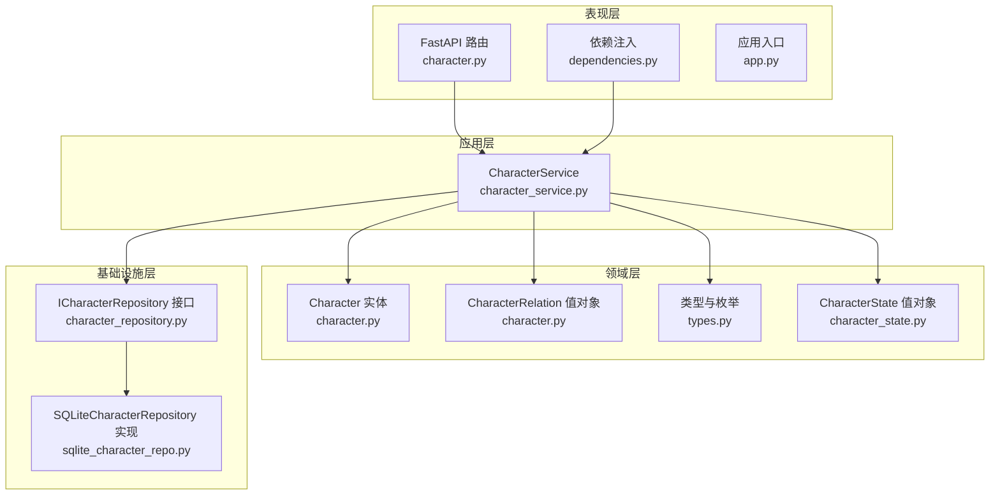
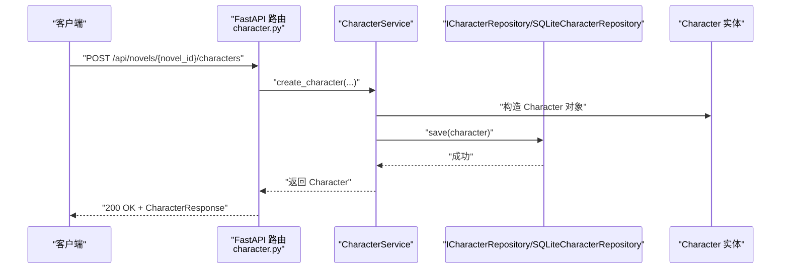
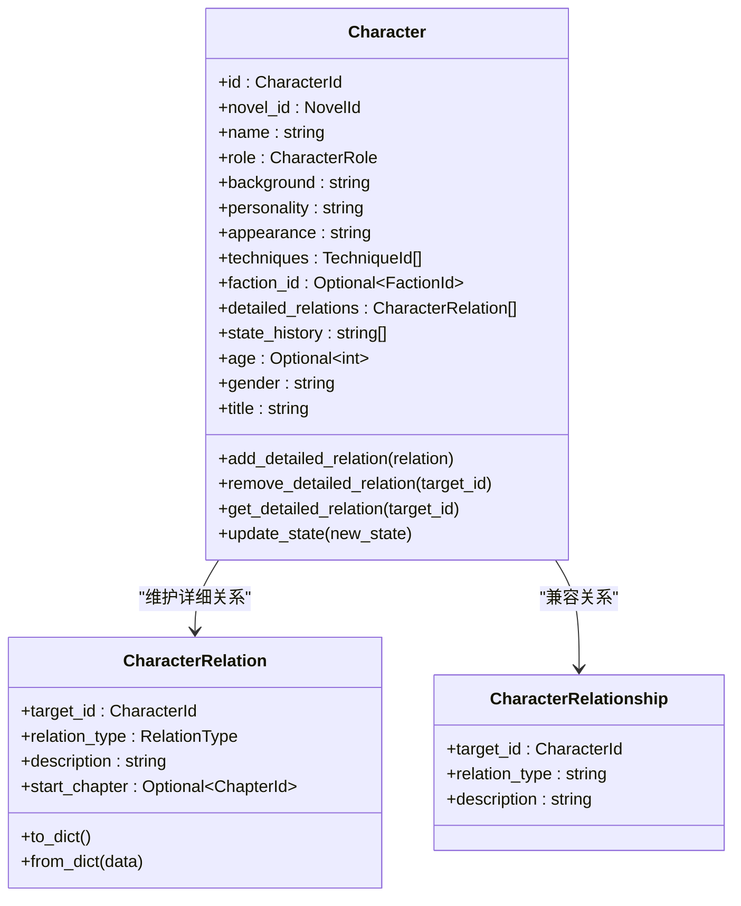
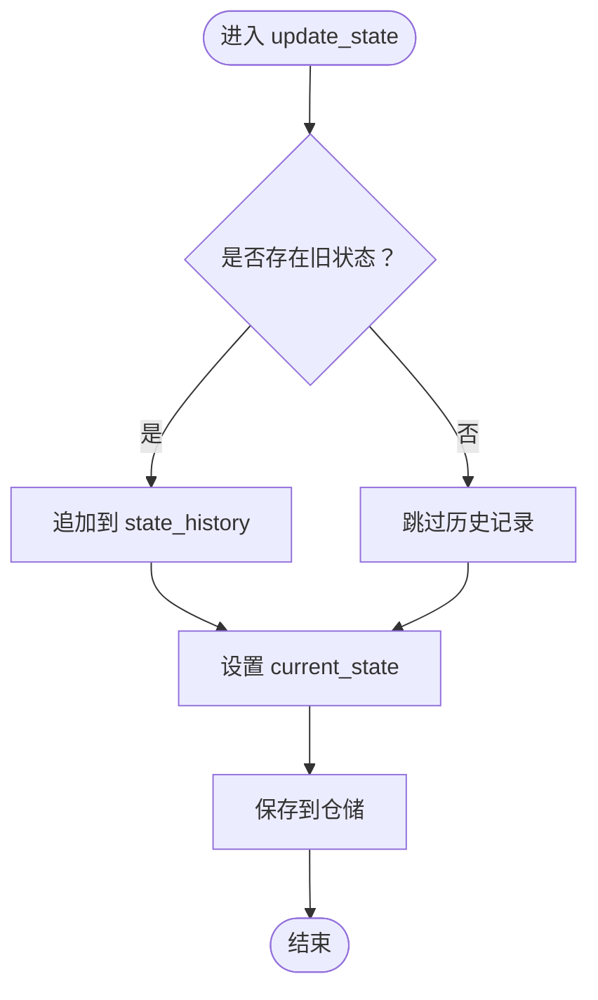
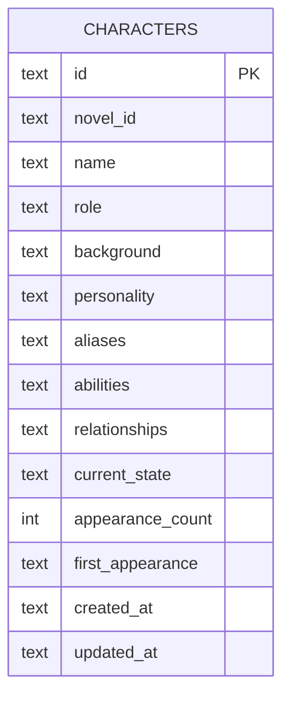
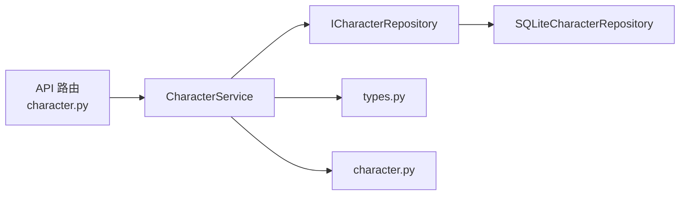

# 人物管理服务

<cite>
**本文档引用的文件**
- [character_service.py](file://application/services/character_service.py)
- [character.py](file://domain/entities/character.py)
- [character_repository.py](file://domain/repositories/character_repository.py)
- [sqlite_character_repo.py](file://infrastructure/persistence/sqlite_character_repo.py)
- [types.py](file://domain/types.py)
- [character.py](file://presentation/api/routers/character.py)
- [dependencies.py](file://presentation/api/dependencies.py)
- [app.py](file://presentation/api/app.py)
- [test_character.py](file://tests/unit/test_character.py)
- [test_character_extended.py](file://tests/unit/test_character_extended.py)
- [character_state.py](file://domain/value_objects/character_state.py)
</cite>

## 目录
1. [简介](#简介)
2. [项目结构](#项目结构)
3. [核心组件](#核心组件)
4. [架构总览](#架构总览)
5. [详细组件分析](#详细组件分析)
6. [依赖关系分析](#依赖关系分析)
7. [性能考虑](#性能考虑)
8. [故障排除指南](#故障排除指南)
9. [结论](#结论)
10. [附录](#附录)

## 简介
本文件为“人物管理服务”的技术文档，围绕 CharacterService 的业务实现进行深入解析，涵盖人物的创建、查询、更新、删除全流程；人物关系建模机制（关系类型、关系强度与关系图谱）；角色状态跟踪系统（状态变更记录、历史追踪与一致性保证）；人物数据持久化策略（基础信息、背景故事、性格特征、技能属性等模型设计）；以及与小说内容、章节生成等模块的集成方式。同时提供操作示例与数据验证规则、业务约束条件说明，帮助开发者快速理解与使用该服务。

## 项目结构
人物管理服务位于应用层，采用分层架构：
- 应用层：CharacterService 提供业务逻辑编排
- 领域层：Character 实体、关系值对象、角色枚举、类型定义
- 基础设施层：SQLite 仓储实现，负责数据持久化
- 表现层：FastAPI 路由与依赖注入，暴露 REST 接口

图表来源
- [character.py:64-273](file://domain/entities/character.py#L64-L273)
- [character_service.py:18-213](file://application/services/character_service.py#L18-L213)
- [character_repository.py:17-73](file://domain/repositories/character_repository.py#L17-L73)
- [sqlite_character_repo.py:20-150](file://infrastructure/persistence/sqlite_character_repo.py#L20-L150)
- [types.py:52-275](file://domain/types.py#L52-L275)
- [character.py:19-280](file://presentation/api/routers/character.py#L19-L280)
- [dependencies.py:155-156](file://presentation/api/dependencies.py#L155-L156)
- [app.py:19-53](file://presentation/api/app.py#L19-L53)

章节来源
- [character_service.py:18-213](file://application/services/character_service.py#L18-L213)
- [character.py:64-273](file://domain/entities/character.py#L64-L273)
- [character_repository.py:17-73](file://domain/repositories/character_repository.py#L17-L73)
- [sqlite_character_repo.py:20-150](file://infrastructure/persistence/sqlite_character_repo.py#L20-L150)
- [types.py:52-275](file://domain/types.py#L52-L275)
- [character.py:19-280](file://presentation/api/routers/character.py#L19-L280)
- [dependencies.py:155-156](file://presentation/api/dependencies.py#L155-L156)
- [app.py:19-53](file://presentation/api/app.py#L19-L53)

## 核心组件
- CharacterService：应用服务，封装人物 CRUD、关系管理、状态管理与检索功能
- Character 实体：承载人物全部属性与行为，支持基础与扩展字段
- CharacterRelation/CharacterRelationship：关系建模值对象，支持详细关系与兼容关系
- ICharacterRepository/SQLiteCharacterRepository：仓储接口与 SQLite 实现
- 类型与枚举：CharacterId、NovelId、CharacterRole、RelationType 等
- FastAPI 路由与依赖注入：对外暴露 REST 接口，注入 CharacterService

章节来源
- [character_service.py:18-213](file://application/services/character_service.py#L18-L213)
- [character.py:64-273](file://domain/entities/character.py#L64-L273)
- [character_repository.py:17-73](file://domain/repositories/character_repository.py#L17-L73)
- [sqlite_character_repo.py:20-150](file://infrastructure/persistence/sqlite_character_repo.py#L20-L150)
- [types.py:52-275](file://domain/types.py#L52-L275)
- [character.py:19-280](file://presentation/api/routers/character.py#L19-L280)
- [dependencies.py:155-156](file://presentation/api/dependencies.py#L155-L156)

## 架构总览
人物管理服务遵循 Clean Architecture 分层，通过依赖倒置原则解耦应用与基础设施：
- 应用服务依赖领域实体与仓储接口，不直接依赖具体存储实现
- 仓储接口由 SQLite 实现类提供，负责 JSON 序列化/反序列化与数据库交互
- 表现层通过依赖注入获取 CharacterService，并映射到 API 请求/响应模型

图表来源
- [character.py:76-105](file://presentation/api/routers/character.py#L76-L105)
- [character_service.py:24-46](file://application/services/character_service.py#L24-L46)
- [sqlite_character_repo.py:56-79](file://infrastructure/persistence/sqlite_character_repo.py#L56-L79)

## 详细组件分析

### CharacterService 业务实现
- 创建人物：生成唯一 ID，填充基础字段，调用仓储保存
- 查询人物：按 ID 或小说 ID 获取人物，支持按角色类型过滤
- 更新人物：可选字段更新，统一更新时间戳，保存入库
- 删除人物：按 ID 删除
- 关系管理：添加/移除/查询详细关系，基于 RelationType 枚举
- 状态管理：更新当前状态并记录历史，支持查询历史
- 检索：关键词搜索人物（名称/背景/性格）

章节来源
- [character_service.py:24-213](file://application/services/character_service.py#L24-L213)

### 人物关系建模机制
- 关系值对象：CharacterRelation 支持目标人物 ID、关系类型、描述、起始章节等
- 兼容关系：CharacterRelationship 保留一期关系结构
- 关系强度：通过 RelationType 枚举定义关系类别（家庭、朋友、敌人、恋人、师徒、盟友、对手、其他）
- 关系图谱：通过 detailed_relations 列表维护人物间多维关系，支持双向/单向关系表达

图表来源
- [character.py:18-273](file://domain/entities/character.py#L18-L273)
- [types.py:263-275](file://domain/types.py#L263-L275)

章节来源
- [character.py:18-273](file://domain/entities/character.py#L18-L273)
- [types.py:263-275](file://domain/types.py#L263-L275)

### 角色状态跟踪系统
- 当前状态：current_state 字段记录人物最新状态
- 状态历史：state_history 记录状态变更历史
- 变更流程：更新状态时，先将旧状态写入历史，再设置新状态
- 一致性保证：状态变更与实体更新在同一事务内完成（仓储层以单条 INSERT OR REPLACE 完成）

图表来源
- [character.py:143-151](file://domain/entities/character.py#L143-L151)
- [character_service.py:157-169](file://application/services/character_service.py#L157-L169)

章节来源
- [character.py:143-151](file://domain/entities/character.py#L143-L151)
- [character_service.py:157-169](file://application/services/character_service.py#L157-L169)

### 人物数据持久化策略
- 存储介质：SQLite
- 表结构：characters 表，包含基础字段与 JSON 序列化的数组/对象字段
- 序列化策略：relationships 使用兼容关系结构；detailed_relations 使用 CharacterRelation 的字典表示
- 读取映射：从数据库行反序列化为 Character 实体，确保类型安全

图表来源
- [sqlite_character_repo.py:36-54](file://infrastructure/persistence/sqlite_character_repo.py#L36-L54)

章节来源
- [sqlite_character_repo.py:33-150](file://infrastructure/persistence/sqlite_character_repo.py#L33-L150)

### API 集成与操作示例
- 创建人物：POST /api/novels/{novel_id}/characters
- 获取人物列表：GET /api/novels/{novel_id}/characters?role={角色}&keyword={关键词}
- 获取人物详情：GET /api/novels/{novel_id}/characters/{character_id}
- 更新人物：PUT /api/novels/{novel_id}/characters/{character_id}
- 删除人物：DELETE /api/novels/{novel_id}/characters/{character_id}
- 添加关系：POST /api/novels/{novel_id}/characters/{character_id}/relations
- 获取关系：GET /api/novels/{novel_id}/characters/{character_id}/relations
- 移除关系：DELETE /api/novels/{novel_id}/characters/{character_id}/relations/{target_id}
- 更新状态：POST /api/novels/{novel_id}/characters/{character_id}/state
- 获取状态历史：GET /api/novels/{novel_id}/characters/{character_id}/states

章节来源
- [character.py:76-254](file://presentation/api/routers/character.py#L76-L254)
- [dependencies.py:155-156](file://presentation/api/dependencies.py#L155-L156)
- [app.py:44-45](file://presentation/api/app.py#L44-L45)

## 依赖关系分析
- 应用服务依赖仓储接口，避免与具体存储耦合
- 路由层通过依赖注入获取 CharacterService，实现松耦合
- 类型与枚举集中定义，确保跨层一致

图表来源
- [character.py:14-16](file://presentation/api/routers/character.py#L14-L16)
- [dependencies.py:155-156](file://presentation/api/dependencies.py#L155-L156)
- [character_service.py:21-22](file://application/services/character_service.py#L21-L22)
- [character_repository.py:17-73](file://domain/repositories/character_repository.py#L17-L73)
- [sqlite_character_repo.py:20-31](file://infrastructure/persistence/sqlite_character_repo.py#L20-L31)
- [types.py:52-275](file://domain/types.py#L52-L275)
- [character.py:64-273](file://domain/entities/character.py#L64-L273)

章节来源
- [character.py:14-16](file://presentation/api/routers/character.py#L14-L16)
- [dependencies.py:155-156](file://presentation/api/dependencies.py#L155-L156)
- [character_service.py:21-22](file://application/services/character_service.py#L21-L22)
- [character_repository.py:17-73](file://domain/repositories/character_repository.py#L17-L73)
- [sqlite_character_repo.py:20-31](file://infrastructure/persistence/sqlite_character_repo.py#L20-L31)
- [types.py:52-275](file://domain/types.py#L52-L275)
- [character.py:64-273](file://domain/entities/character.py#L64-L273)

## 性能考虑
- 单条 INSERT OR REPLACE：保存人物时一次性写入所有字段，减少往返
- JSON 序列化：relationships 与 detailed_relations 采用 JSON 存储，便于扩展但需注意查询限制
- 列表去重：添加别名、能力、功法时检查重复，避免冗余数据
- 时间戳：统一更新时间戳，便于排序与审计

## 故障排除指南
- 人物不存在：更新/删除/关系操作前会校验人物存在性，不存在时抛出错误
- 关系类型非法：API 层对 RelationType 进行枚举校验，非法值返回 400
- 角色类型非法：API 层对 CharacterRole 进行枚举校验，非法值返回 400
- 数据库连接：仓储层使用上下文管理器确保连接正确关闭

章节来源
- [character_service.py:81-84](file://application/services/character_service.py#L81-L84)
- [character.py:84-86](file://presentation/api/routers/character.py#L84-L86)
- [character.py:120-124](file://presentation/api/routers/character.py#L120-L124)
- [character.py:188-191](file://presentation/api/routers/character.py#L188-L191)
- [sqlite_character_repo.py:56-79](file://infrastructure/persistence/sqlite_character_repo.py#L56-L79)

## 结论
人物管理服务通过清晰的分层设计与强类型定义，提供了完整的人物生命周期管理能力。关系建模支持详细关系与兼容关系，状态跟踪具备历史记录与一致性保障，持久化策略兼顾灵活性与可扩展性。结合 API 路由与依赖注入，服务易于集成到小说写作工作流中，支撑从人物设定到章节生成的全链路需求。

## 附录

### 数据验证规则与业务约束
- 角色类型：必须为枚举值之一（主角、反派、配角）
- 关系类型：必须为枚举值之一（家庭、朋友、敌人、恋人、师徒、盟友、对手、其他）
- 人物 ID/小说 ID：使用值对象封装，确保类型安全与相等性比较
- 关键词搜索：大小写不敏感，匹配名称、背景或性格字段

章节来源
- [types.py:109-116](file://domain/types.py#L109-L116)
- [types.py:263-275](file://domain/types.py#L263-L275)
- [character_service.py:197-213](file://application/services/character_service.py#L197-L213)

### 与小说内容、章节生成的集成
- 人物出场：increment_appearance 记录首次出场章节与出现次数
- 功法与势力：add_technique/set_faction 维护人物成长路径与归属
- 状态驱动：update_state 驱动人物状态变化，影响情节走向
- 关系影响：detailed_relations 作为关系图谱，辅助剧情推进与冲突设计

章节来源
- [character.py:152-182](file://domain/entities/character.py#L152-L182)
- [character.py:184-207](file://domain/entities/character.py#L184-L207)
- [character.py:143-151](file://domain/entities/character.py#L143-L151)

### 测试要点
- 实体行为：别名、能力、关系、状态、出场次数等方法的正确性
- 扩展字段：外观、年龄、性别、头衔、功法、势力、详细关系、状态历史的序列化/反序列化
- 服务流程：创建、更新、删除、关系增删查、状态更新与历史查询

章节来源
- [test_character.py:29-245](file://tests/unit/test_character.py#L29-L245)
- [test_character_extended.py:17-226](file://tests/unit/test_character_extended.py#L17-L226)