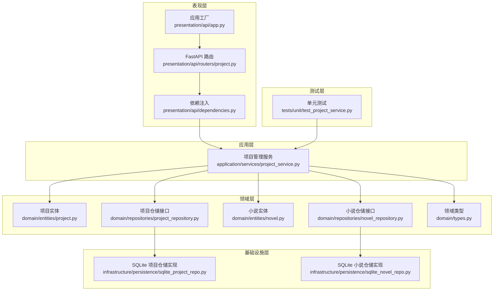
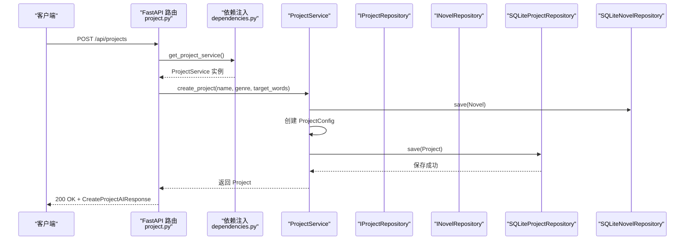
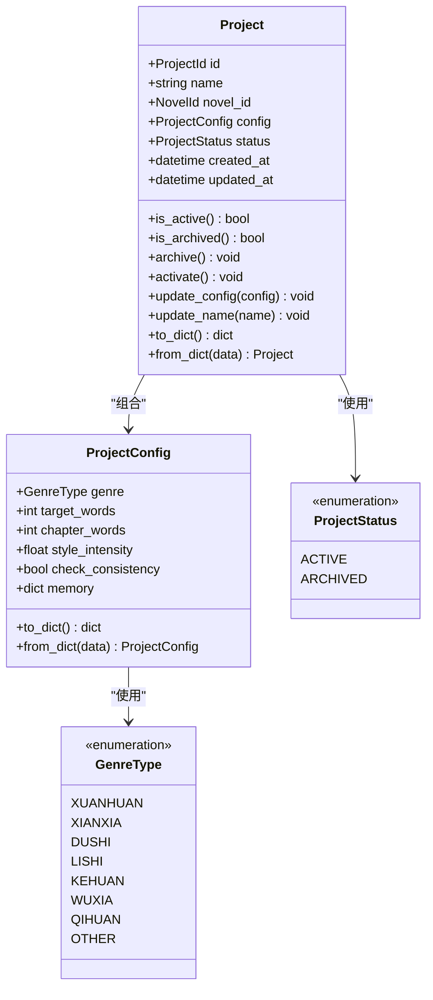
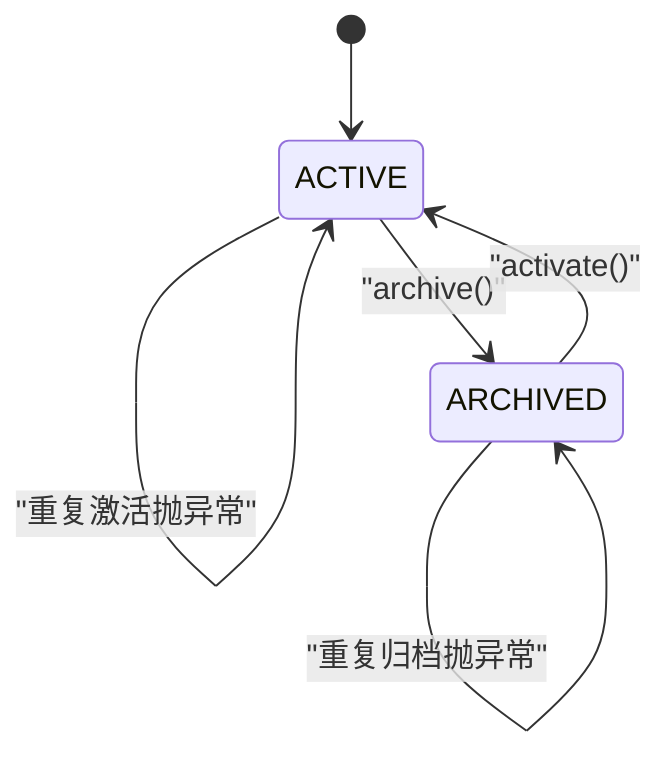
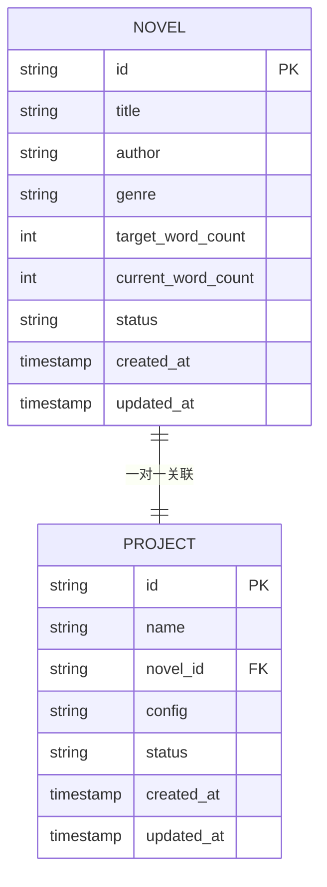
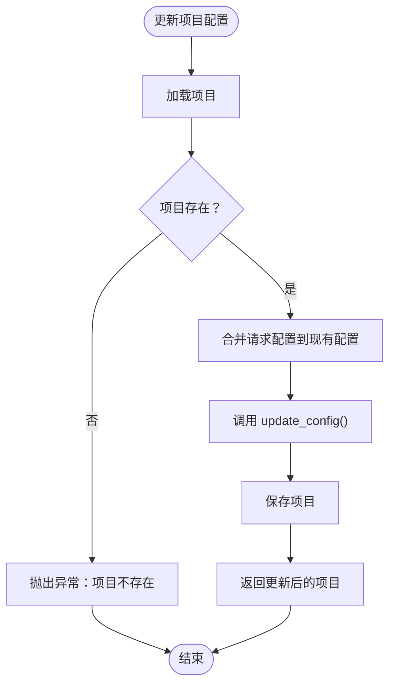
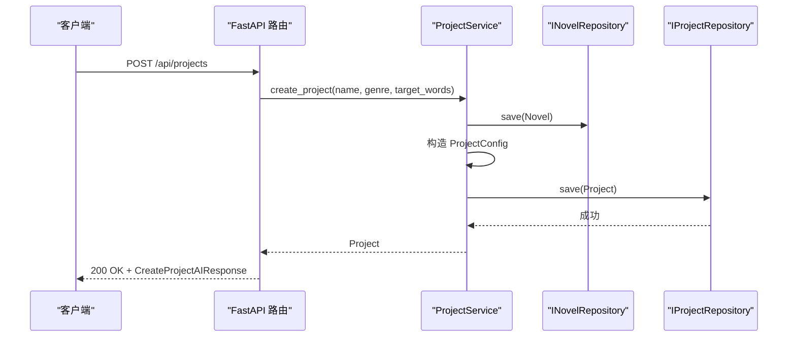
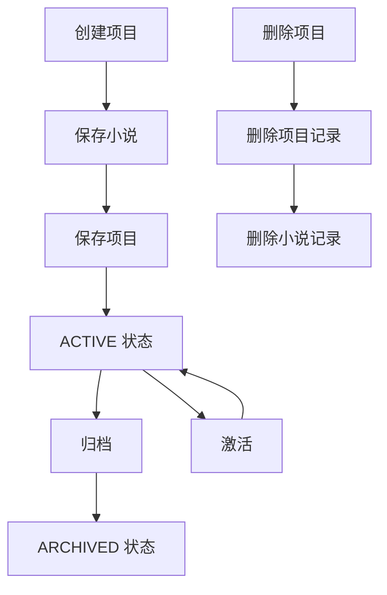
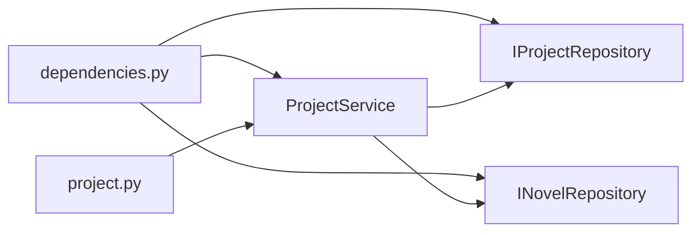

# 项目管理服务

<cite>
**本文引用的文件**
- [application/services/project_service.py](file://application/services/project_service.py)
- [domain/entities/project.py](file://domain/entities/project.py)
- [domain/entities/novel.py](file://domain/entities/novel.py)
- [domain/repositories/project_repository.py](file://domain/repositories/project_repository.py)
- [domain/repositories/novel_repository.py](file://domain/repositories/novel_repository.py)
- [domain/types.py](file://domain/types.py)
- [infrastructure/persistence/sqlite_project_repo.py](file://infrastructure/persistence/sqlite_project_repo.py)
- [infrastructure/persistence/sqlite_novel_repo.py](file://infrastructure/persistence/sqlite_novel_repo.py)
- [presentation/api/routers/project.py](file://presentation/api/routers/project.py)
- [presentation/api/dependencies.py](file://presentation/api/dependencies.py)
- [presentation/api/app.py](file://presentation/api/app.py)
- [tests/unit/test_project_service.py](file://tests/unit/test_project_service.py)
- [domain/exceptions.py](file://domain/exceptions.py)
</cite>

## 目录
1. [简介](#简介)
2. [项目结构](#项目结构)
3. [核心组件](#核心组件)
4. [架构概览](#架构概览)
5. [详细组件分析](#详细组件分析)
6. [依赖分析](#依赖分析)
7. [性能考虑](#性能考虑)
8. [故障排除指南](#故障排除指南)
9. [结论](#结论)
10. [附录](#附录)

## 简介
本文件为 InkTrace 小说自动编写助手项目的项目管理服务技术文档。该服务负责管理小说创作项目的核心业务逻辑，包括项目创建、查询、更新、归档和删除的完整流程；项目配置管理机制（ProjectConfig 的数据结构和配置项管理）；项目状态管理（ACTIVE、ARCHIVED）的实现原理和状态转换逻辑；项目与小说实体的关联关系及项目ID和小说ID的映射机制；以及项目数据生命周期管理和事务处理机制。文档还提供了具体的代码示例路径，展示如何创建新项目、获取项目信息、更新项目配置、激活/归档项目等操作，并包含错误处理策略和异常情况的处理方案。

## 项目结构
项目采用分层架构设计，主要分为以下层次：
- 表现层（Presentation Layer）：通过 FastAPI 提供 REST API 接口，路由位于 presentation/api/routers/ 下。
- 应用层（Application Layer）：包含业务服务，如 ProjectService，位于 application/services/ 下。
- 领域层（Domain Layer）：包含实体、值对象、仓储接口和领域类型，位于 domain/ 下。
- 基础设施层（Infrastructure Layer）：包含仓储的具体实现（SQLite），位于 infrastructure/persistence/ 下。
- 测试层（Tests）：单元测试位于 tests/unit/ 下。

**图表来源**
- [presentation/api/routers/project.py:1-290](file://presentation/api/routers/project.py#L1-L290)
- [presentation/api/dependencies.py:1-178](file://presentation/api/dependencies.py#L1-L178)
- [application/services/project_service.py:1-203](file://application/services/project_service.py#L1-L203)
- [domain/entities/project.py:1-112](file://domain/entities/project.py#L1-L112)
- [domain/entities/novel.py:1-178](file://domain/entities/novel.py#L1-L178)
- [domain/repositories/project_repository.py:1-55](file://domain/repositories/project_repository.py#L1-L55)
- [domain/repositories/novel_repository.py:1-70](file://domain/repositories/novel_repository.py#L1-L70)
- [domain/types.py:1-284](file://domain/types.py#L1-L284)
- [infrastructure/persistence/sqlite_project_repo.py:1-137](file://infrastructure/persistence/sqlite_project_repo.py#L1-L137)
- [infrastructure/persistence/sqlite_novel_repo.py:1-116](file://infrastructure/persistence/sqlite_novel_repo.py#L1-L116)
- [tests/unit/test_project_service.py:1-130](file://tests/unit/test_project_service.py#L1-L130)

**章节来源**
- [presentation/api/app.py:1-66](file://presentation/api/app.py#L1-L66)
- [presentation/api/dependencies.py:1-178](file://presentation/api/dependencies.py#L1-L178)
- [application/services/project_service.py:1-203](file://application/services/project_service.py#L1-L203)

## 核心组件
本节深入分析项目管理服务的核心组件，包括 ProjectService 的业务方法、Project 和 ProjectConfig 的数据结构、以及仓储接口与实现。

- ProjectService：封装项目管理的所有业务逻辑，包括创建、查询、更新、归档、激活、删除项目，以及项目与小说的绑定和内存管理。
- Project 实体：包含项目标识、名称、关联的小说ID、配置、状态、创建/更新时间等字段，并提供状态转换方法（archive/activate）和配置更新方法（update_config/update_name）。
- ProjectConfig 值对象：包含题材类型、目标字数、每章字数、风格强度、一致性检查开关、记忆（memory）等配置项，并提供序列化/反序列化方法。
- IProjectRepository 接口：定义项目仓储的抽象方法，包括按ID/小说ID查询、保存、删除、统计等。
- SQLiteProjectRepository 实现：基于 SQLite 的具体仓储实现，负责将 Project/ProjectConfig 持久化到数据库。
- INovelRepository 接口与 SQLiteNovelRepository 实现：管理小说实体的持久化，项目与小说存在一一对应关系（一个项目对应一个小说）。

**章节来源**
- [application/services/project_service.py:21-203](file://application/services/project_service.py#L21-L203)
- [domain/entities/project.py:17-112](file://domain/entities/project.py#L17-L112)
- [domain/entities/novel.py:20-178](file://domain/entities/novel.py#L20-L178)
- [domain/repositories/project_repository.py:17-55](file://domain/repositories/project_repository.py#L17-L55)
- [infrastructure/persistence/sqlite_project_repo.py:21-137](file://infrastructure/persistence/sqlite_project_repo.py#L21-L137)
- [domain/repositories/novel_repository.py:17-70](file://domain/repositories/novel_repository.py#L17-L70)
- [infrastructure/persistence/sqlite_novel_repo.py:20-116](file://infrastructure/persistence/sqlite_novel_repo.py#L20-L116)

## 架构概览
项目管理服务遵循 Clean Architecture 分层原则，通过依赖倒置实现关注点分离：
- 表现层通过依赖注入获取 ProjectService 实例，调用其业务方法。
- 应用层服务通过仓储接口访问领域实体，不直接依赖具体实现。
- 领域层定义实体、值对象和类型，确保业务规则集中于领域层。
- 基础设施层提供仓储的具体实现，支持多种存储后端（当前使用 SQLite）。

**图表来源**
- [presentation/api/routers/project.py:91-181](file://presentation/api/routers/project.py#L91-L181)
- [presentation/api/dependencies.py:122-123](file://presentation/api/dependencies.py#L122-L123)
- [application/services/project_service.py:32-67](file://application/services/project_service.py#L32-L67)
- [infrastructure/persistence/sqlite_project_repo.py:83-98](file://infrastructure/persistence/sqlite_project_repo.py#L83-L98)
- [infrastructure/persistence/sqlite_novel_repo.py:50-66](file://infrastructure/persistence/sqlite_novel_repo.py#L50-L66)

## 详细组件分析

### 项目实体与配置管理
- Project 实体字段与行为：
  - 标识：ProjectId
  - 名称：字符串，支持更新并进行非空校验
  - 关联小说：NovelId
  - 配置：ProjectConfig 值对象，默认工厂创建
  - 状态：ProjectStatus（默认 ACTIVE）
  - 时间戳：created_at/updated_at，默认工厂创建
  - 方法：is_active/is_archived 判断状态；archive/activate 状态转换；update_config/update_name 更新配置与名称；to_dict/from_dict 序列化/反序列化
- ProjectConfig 值对象字段与行为：
  - genre：题材类型，默认玄幻
  - target_words：目标字数，默认 8000000
  - chapter_words：每章字数，默认 2100
  - style_intensity：风格强度，默认 0.8
  - check_consistency：一致性检查开关，默认 True
  - memory：字典型记忆，默认空字典
  - 方法：to_dict/from_dict 序列化/反序列化

**图表来源**
- [domain/entities/project.py:49-112](file://domain/entities/project.py#L49-L112)
- [domain/types.py:243-261](file://domain/types.py#L243-L261)

**章节来源**
- [domain/entities/project.py:17-112](file://domain/entities/project.py#L17-L112)
- [domain/types.py:243-261](file://domain/types.py#L243-L261)

### 项目状态管理与转换逻辑
- 状态枚举：ProjectStatus 定义 ACTIVE 和 ARCHIVED 两种状态。
- 状态转换：
  - archive()：仅当当前状态为 ACTIVE 时可转换为 ARCHIVED，否则抛出异常；转换后更新 updated_at。
  - activate()：仅当当前状态为 ARCHIVED 时可转换为 ACTIVE，否则抛出异常；转换后更新 updated_at。
- 状态查询：is_active()/is_archived() 提供便捷判断。

**图表来源**
- [domain/entities/project.py:68-78](file://domain/entities/project.py#L68-L78)

**章节来源**
- [domain/entities/project.py:62-78](file://domain/entities/project.py#L62-L78)

### 项目与小说的关联关系与ID映射
- 关联关系：每个项目（Project）关联一个小说（Novel），通过 Project.novel_id 与 Novel.id 建立一对一映射。
- ID 类型：ProjectId 和 NovelId 均为值对象，确保类型安全和相等性比较。
- 映射机制：
  - 创建项目时，先创建 Novel 实体并保存，再创建 Project 并保存。
  - 通过 NovelId 可查询对应的 Project。
  - 删除项目时，同时删除关联的 Novel。

**图表来源**
- [domain/entities/novel.py:29-40](file://domain/entities/novel.py#L29-L40)
- [domain/entities/project.py:54-60](file://domain/entities/project.py#L54-L60)
- [infrastructure/persistence/sqlite_project_repo.py:34-44](file://infrastructure/persistence/sqlite_project_repo.py#L34-L44)
- [infrastructure/persistence/sqlite_novel_repo.py:36-48](file://infrastructure/persistence/sqlite_novel_repo.py#L36-L48)

**章节来源**
- [domain/entities/novel.py:20-40](file://domain/entities/novel.py#L20-L40)
- [domain/entities/project.py:49-60](file://domain/entities/project.py#L49-L60)
- [domain/types.py:15-30](file://domain/types.py#L15-L30)

### 项目配置管理机制
- 配置项管理：
  - 通过 Project.update_config() 替换整个 ProjectConfig。
  - 通过 API 层的更新请求动态修改配置项（genre、target_words、chapter_words、style_intensity），然后调用 Project.update_config()。
  - ProjectConfig 提供 to_dict/from_dict 支持 JSON 序列化与反序列化。
- 记忆（memory）管理：
  - ProjectService.get_memory_by_novel() 获取项目配置中的 memory 字典。
  - ProjectService.bind_memory_to_novel() 将传入的 memory 绑定到项目配置并保存。
  - memory 默认为空字典，类型校验确保为字典。

**图表来源**
- [application/services/project_service.py:137-151](file://application/services/project_service.py#L137-L151)
- [presentation/api/routers/project.py:212-242](file://presentation/api/routers/project.py#L212-L242)

**章节来源**
- [application/services/project_service.py:83-99](file://application/services/project_service.py#L83-L99)
- [application/services/project_service.py:137-151](file://application/services/project_service.py#L137-L151)
- [presentation/api/routers/project.py:38-44](file://presentation/api/routers/project.py#L38-L44)

### 业务流程详解

#### 创建新项目
- 步骤：
  1) 创建 Novel 实体并保存至小说仓储。
  2) 创建 ProjectConfig（包含题材、目标字数等）。
  3) 创建 Project 实体并保存至项目仓储。
- 返回：完整的 Project 对象。

**图表来源**
- [application/services/project_service.py:32-67](file://application/services/project_service.py#L32-L67)
- [presentation/api/routers/project.py:91-181](file://presentation/api/routers/project.py#L91-L181)

**章节来源**
- [application/services/project_service.py:32-67](file://application/services/project_service.py#L32-L67)
- [presentation/api/routers/project.py:91-181](file://presentation/api/routers/project.py#L91-L181)

#### 获取项目信息
- 查询方式：
  - 按项目ID：ProjectService.get_project()
  - 按小说ID：ProjectService.get_project_by_novel()
- 返回：Optional[Project]，未找到返回 None。

**章节来源**
- [application/services/project_service.py:69-81](file://application/services/project_service.py#L69-L81)

#### 更新项目配置
- API 层接收 UpdateProjectRequest，解析并更新 ProjectConfig 后调用 ProjectService.update_project_config()。
- 仅更新配置，不改变项目名称；若需要改名，单独调用 update_project_name()。

**章节来源**
- [presentation/api/routers/project.py:212-242](file://presentation/api/routers/project.py#L212-L242)
- [application/services/project_service.py:137-165](file://application/services/project_service.py#L137-L165)

#### 激活/归档项目
- 归档：ProjectService.archive_project()，内部调用 Project.archive()。
- 激活：ProjectService.activate_project()，内部调用 Project.activate()。
- 状态转换受状态机约束，非法状态转换会抛出异常。

**章节来源**
- [application/services/project_service.py:167-187](file://application/services/project_service.py#L167-L187)
- [domain/entities/project.py:68-78](file://domain/entities/project.py#L68-L78)

#### 删除项目
- ProjectService.delete_project()：
  - 先查询项目是否存在，不存在抛异常。
  - 存在则删除项目记录，并级联删除关联的小说记录。

**章节来源**
- [application/services/project_service.py:189-198](file://application/services/project_service.py#L189-L198)

### 项目数据生命周期管理与事务处理
- 生命周期：
  - 创建：Novel 先于 Project 保存，保证外键约束。
  - 查询：支持按 ID 和按小说 ID 查询。
  - 更新：支持配置更新和名称更新。
  - 删除：级联删除项目与小说。
- 事务处理：
  - SQLiteProjectRepository.save() 使用单次连接执行 INSERT OR REPLACE，确保项目保存的原子性。
  - SQLiteProjectRepository.delete() 执行 DELETE，确保删除的原子性。
  - 项目与小说的删除在应用层协调，先删项目再删小说，避免外键约束问题。

**图表来源**
- [infrastructure/persistence/sqlite_project_repo.py:83-103](file://infrastructure/persistence/sqlite_project_repo.py#L83-L103)
- [application/services/project_service.py:189-198](file://application/services/project_service.py#L189-L198)

**章节来源**
- [infrastructure/persistence/sqlite_project_repo.py:83-103](file://infrastructure/persistence/sqlite_project_repo.py#L83-L103)
- [application/services/project_service.py:189-198](file://application/services/project_service.py#L189-L198)

## 依赖分析
- 依赖注入：
  - 通过 presentation/api/dependencies.py 中的 get_project_service() 提供 ProjectService 实例。
  - 通过 get_project_repo() 和 get_novel_repo() 提供仓储实现。
- 仓储接口与实现：
  - IProjectRepository 与 SQLiteProjectRepository
  - INovelRepository 与 SQLiteNovelRepository
- API 路由依赖：
  - presentation/api/routers/project.py 通过 Depends(get_project_service) 注入服务实例。

**图表来源**
- [presentation/api/dependencies.py:122-123](file://presentation/api/dependencies.py#L122-L123)
- [presentation/api/routers/project.py:71-73](file://presentation/api/routers/project.py#L71-L73)

**章节来源**
- [presentation/api/dependencies.py:122-123](file://presentation/api/dependencies.py#L122-L123)
- [presentation/api/routers/project.py:71-73](file://presentation/api/routers/project.py#L71-L73)

## 性能考虑
- 查询优化：
  - SQLiteProjectRepository.find_all() 支持按状态过滤并按更新时间排序，适合分页和筛选场景。
  - find_by_novel_id() 通过外键索引快速定位项目。
- 序列化开销：
  - ProjectConfig.to_dict()/from_dict() 使用 JSON 序列化，建议在高频更新场景下避免频繁序列化。
- 连接复用：
  - 仓储实现使用单次连接执行 SQL，减少连接开销。
- 缓存：
  - 依赖注入层使用 @lru_cache() 缓存仓储实例，降低重复创建成本。

[本节为通用性能讨论，无需特定文件来源]

## 故障排除指南
- 常见异常与处理：
  - 项目不存在：在查询、更新、归档、激活、删除时，若项目不存在，抛出 ValueError 或返回 404/400 错误。
  - 状态非法：归档/激活时若状态不符合要求，抛出 ValueError 或返回 400 错误。
  - 配置无效：API 层对请求参数进行校验，无效参数返回 400 错误。
- 单元测试覆盖：
  - tests/unit/test_project_service.py 覆盖创建、查询、列表、删除、归档等关键场景。
- 建议排查步骤：
  - 确认项目ID/小说ID格式正确且存在。
  - 检查状态是否符合转换条件。
  - 验证请求参数是否满足枚举范围。
  - 查看日志与异常堆栈，定位具体失败环节。

**章节来源**
- [tests/unit/test_project_service.py:28-126](file://tests/unit/test_project_service.py#L28-L126)
- [presentation/api/routers/project.py:101-103](file://presentation/api/routers/project.py#L101-L103)
- [presentation/api/routers/project.py:245-264](file://presentation/api/routers/project.py#L245-L264)

## 结论
项目管理服务通过清晰的分层架构实现了项目全生命周期管理，包括创建、查询、更新、归档、激活与删除。ProjectConfig 提供了灵活的配置管理能力，结合 Project 的状态机确保了状态转换的正确性。项目与小说的一对一关联通过 ID 值对象实现强类型约束，仓储层采用 SQLite 实现，具备良好的可扩展性。API 层通过依赖注入与 DTO 校验，提供了稳定可靠的对外接口。单元测试覆盖关键业务流程，有助于持续维护与演进。

[本节为总结性内容，无需特定文件来源]

## 附录

### API 使用示例（代码示例路径）
- 创建新项目
  - 路由：POST /api/projects
  - 示例路径：[presentation/api/routers/project.py:91-181](file://presentation/api/routers/project.py#L91-L181)
- 获取项目信息
  - 路由：GET /api/projects/{project_id}
  - 示例路径：[presentation/api/routers/project.py:203-209](file://presentation/api/routers/project.py#L203-L209)
- 更新项目配置
  - 路由：PUT /api/projects/{project_id}
  - 示例路径：[presentation/api/routers/project.py:212-242](file://presentation/api/routers/project.py#L212-L242)
- 激活/归档项目
  - 路由：POST /api/projects/{project_id}/activate
  - 路由：POST /api/projects/{project_id}/archive
  - 示例路径：[presentation/api/routers/project.py:245-264](file://presentation/api/routers/project.py#L245-L264)
- 删除项目
  - 路由：DELETE /api/projects/{project_id}
  - 示例路径：[presentation/api/routers/project.py:267-274](file://presentation/api/routers/project.py#L267-L274)

### 代码示例路径
- 项目创建流程：[application/services/project_service.py:32-67](file://application/services/project_service.py#L32-L67)
- 项目状态转换：[domain/entities/project.py:68-78](file://domain/entities/project.py#L68-L78)
- 项目配置更新：[application/services/project_service.py:137-151](file://application/services/project_service.py#L137-L151)
- 项目与小说关联：[domain/entities/project.py:54-60](file://domain/entities/project.py#L54-L60)
- 仓储实现（保存/删除）：[infrastructure/persistence/sqlite_project_repo.py:83-103](file://infrastructure/persistence/sqlite_project_repo.py#L83-L103)