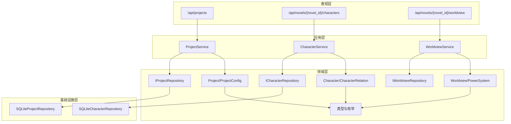
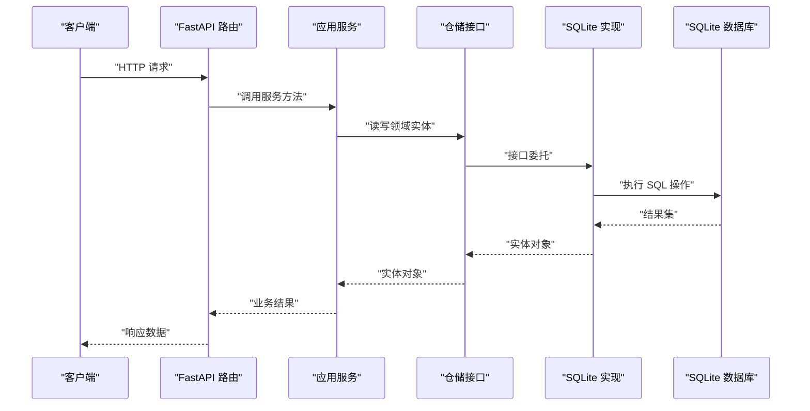
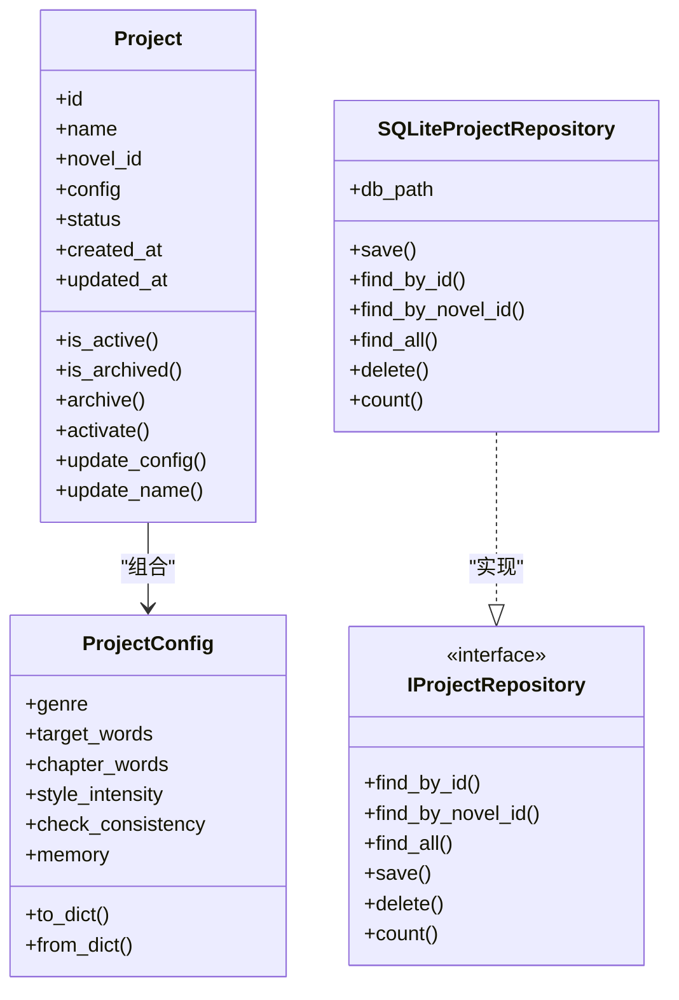
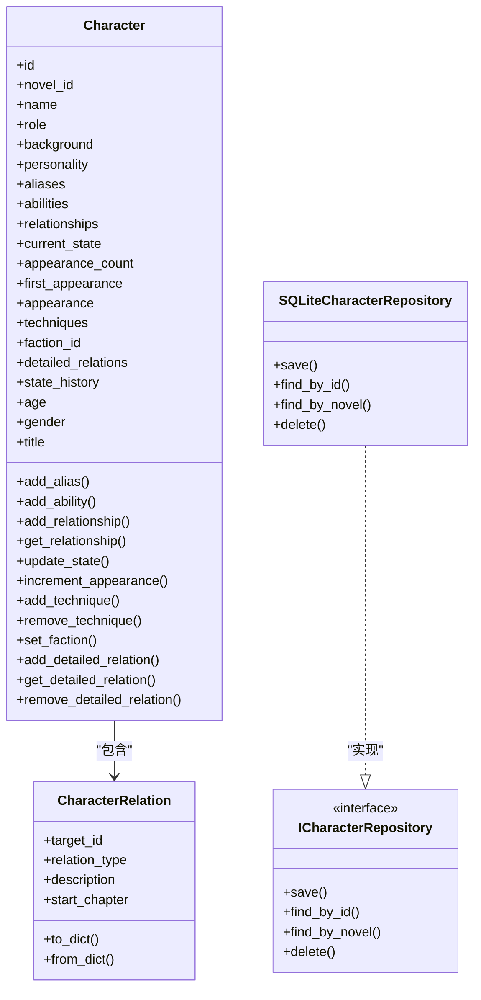
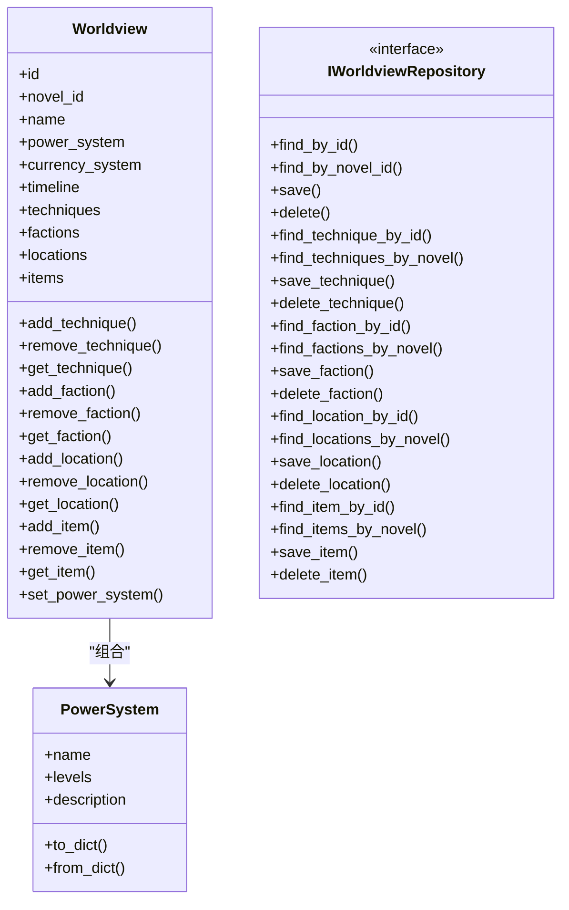
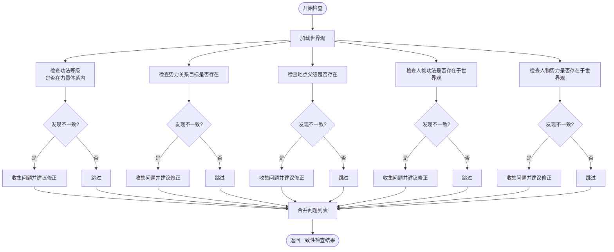
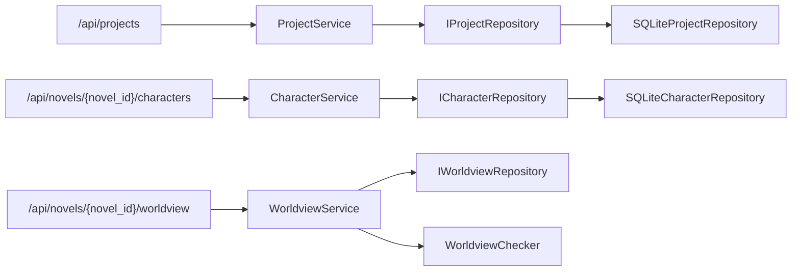

# 项目管理模块

<cite>
**本文引用的文件**
- [application/services/project_service.py](file://application/services/project_service.py)
- [application/services/character_service.py](file://application/services/character_service.py)
- [application/services/worldview_service.py](file://application/services/worldview_service.py)
- [domain/entities/project.py](file://domain/entities/project.py)
- [domain/entities/character.py](file://domain/entities/character.py)
- [domain/entities/worldview.py](file://domain/entities/worldview.py)
- [domain/repositories/project_repository.py](file://domain/repositories/project_repository.py)
- [domain/repositories/character_repository.py](file://domain/repositories/character_repository.py)
- [domain/repositories/worldview_repository.py](file://domain/repositories/worldview_repository.py)
- [domain/types.py](file://domain/types.py)
- [domain/services/worldview_checker.py](file://domain/services/worldview_checker.py)
- [infrastructure/persistence/sqlite_project_repo.py](file://infrastructure/persistence/sqlite_project_repo.py)
- [infrastructure/persistence/sqlite_character_repo.py](file://infrastructure/persistence/sqlite_character_repo.py)
- [presentation/api/routers/project.py](file://presentation/api/routers/project.py)
- [presentation/api/routers/character.py](file://presentation/api/routers/character.py)
- [presentation/api/routers/worldview.py](file://presentation/api/routers/worldview.py)
- [tests/unit/test_project_service.py](file://tests/unit/test_project_service.py)
- [tests/unit/test_character.py](file://tests/unit/test_character.py)
</cite>

## 目录
1. [简介](#简介)
2. [项目结构](#项目结构)
3. [核心组件](#核心组件)
4. [架构总览](#架构总览)
5. [详细组件分析](#详细组件分析)
6. [依赖关系分析](#依赖关系分析)
7. [性能考虑](#性能考虑)
8. [故障排查指南](#故障排查指南)
9. [结论](#结论)
10. [附录](#附录)

## 简介
本模块聚焦小说创作辅助系统的“项目管理”能力，围绕三大核心子系统展开：
- 项目管理：负责小说项目（Project）的创建、配置、状态管理与生命周期控制，关联底层小说（Novel）实体。
- 人物管理：负责人物（Character）的增删改查、关系建模、状态跟踪与能力管理。
- 世界观构建：负责功法（Technique）、势力（Faction）、地点（Location）、物品（Item）等设定的统一建模与一致性检查。

文档将系统性阐述各服务的业务逻辑、数据模型、仓储实现、API 路由与交互流程，并提供使用示例、最佳实践与常见问题处理建议。

## 项目结构
系统采用分层架构：
- 领域层（Domain）：定义实体、值对象、仓储接口与领域服务。
- 应用层（Application）：封装业务用例的服务类（如 ProjectService、CharacterService、WorldviewService）。
- 基础设施层（Infrastructure）：提供仓储的具体实现（如 SQLite 实现）。
- 表现层（Presentation）：FastAPI 路由暴露 REST 接口。
- 测试层（Tests）：对服务与实体进行单元测试验证。

图表来源
- [presentation/api/routers/project.py:26-290](file://presentation/api/routers/project.py#L26-L290)
- [presentation/api/routers/character.py:19-280](file://presentation/api/routers/character.py#L19-L280)
- [presentation/api/routers/worldview.py:25-375](file://presentation/api/routers/worldview.py#L25-L375)
- [application/services/project_service.py:21-203](file://application/services/project_service.py#L21-L203)
- [application/services/character_service.py:18-213](file://application/services/character_service.py#L18-L213)
- [application/services/worldview_service.py:25-235](file://application/services/worldview_service.py#L25-L235)
- [domain/repositories/project_repository.py:17-55](file://domain/repositories/project_repository.py#L17-L55)
- [domain/repositories/character_repository.py:17-73](file://domain/repositories/character_repository.py#L17-L73)
- [domain/repositories/worldview_repository.py:21-147](file://domain/repositories/worldview_repository.py#L21-L147)
- [infrastructure/persistence/sqlite_project_repo.py:21-137](file://infrastructure/persistence/sqlite_project_repo.py#L21-L137)
- [infrastructure/persistence/sqlite_character_repo.py:20-150](file://infrastructure/persistence/sqlite_character_repo.py#L20-L150)
- [domain/entities/project.py:17-112](file://domain/entities/project.py#L17-L112)
- [domain/entities/character.py:18-273](file://domain/entities/character.py#L18-L273)
- [domain/entities/worldview.py:21-154](file://domain/entities/worldview.py#L21-L154)
- [domain/types.py:15-284](file://domain/types.py#L15-L284)

章节来源
- [presentation/api/routers/project.py:26-290](file://presentation/api/routers/project.py#L26-L290)
- [presentation/api/routers/character.py:19-280](file://presentation/api/routers/character.py#L19-L280)
- [presentation/api/routers/worldview.py:25-375](file://presentation/api/routers/worldview.py#L25-L375)
- [application/services/project_service.py:21-203](file://application/services/project_service.py#L21-L203)
- [application/services/character_service.py:18-213](file://application/services/character_service.py#L18-L213)
- [application/services/worldview_service.py:25-235](file://application/services/worldview_service.py#L25-L235)
- [domain/repositories/project_repository.py:17-55](file://domain/repositories/project_repository.py#L17-L55)
- [domain/repositories/character_repository.py:17-73](file://domain/repositories/character_repository.py#L17-L73)
- [domain/repositories/worldview_repository.py:21-147](file://domain/repositories/worldview_repository.py#L21-L147)
- [infrastructure/persistence/sqlite_project_repo.py:21-137](file://infrastructure/persistence/sqlite_project_repo.py#L21-L137)
- [infrastructure/persistence/sqlite_character_repo.py:20-150](file://infrastructure/persistence/sqlite_character_repo.py#L20-L150)
- [domain/entities/project.py:17-112](file://domain/entities/project.py#L17-L112)
- [domain/entities/character.py:18-273](file://domain/entities/character.py#L18-L273)
- [domain/entities/worldview.py:21-154](file://domain/entities/worldview.py#L21-L154)
- [domain/types.py:15-284](file://domain/types.py#L15-L284)

## 核心组件
- ProjectService：负责项目创建、查询、配置更新、状态变更（激活/归档）、删除及数量统计；同时提供与小说实体的绑定与内存管理能力。
- CharacterService：负责人物创建、查询、更新、删除；支持人物关系（含详细关系）管理、状态历史记录与能力管理；提供按角色类型筛选与关键词检索。
- WorldviewService：负责获取/创建世界观、力量体系配置；管理功法、势力、地点、物品的增删改查；提供一致性检查（基于 WorldviewChecker）。

章节来源
- [application/services/project_service.py:21-203](file://application/services/project_service.py#L21-L203)
- [application/services/character_service.py:18-213](file://application/services/character_service.py#L18-L213)
- [application/services/worldview_service.py:25-235](file://application/services/worldview_service.py#L25-L235)

## 架构总览
下图展示了从前端 API 到应用服务、仓储再到数据库的完整调用链路与职责边界：

图表来源
- [presentation/api/routers/project.py:91-181](file://presentation/api/routers/project.py#L91-L181)
- [presentation/api/routers/character.py:76-104](file://presentation/api/routers/character.py#L76-L104)
- [presentation/api/routers/worldview.py:119-140](file://presentation/api/routers/worldview.py#L119-L140)
- [application/services/project_service.py:32-67](file://application/services/project_service.py#L32-L67)
- [application/services/character_service.py:24-46](file://application/services/character_service.py#L24-L46)
- [application/services/worldview_service.py:36-47](file://application/services/worldview_service.py#L36-L47)
- [infrastructure/persistence/sqlite_project_repo.py:47-98](file://infrastructure/persistence/sqlite_project_repo.py#L47-L98)
- [infrastructure/persistence/sqlite_character_repo.py:81-110](file://infrastructure/persistence/sqlite_character_repo.py#L81-L110)

## 详细组件分析

### 项目管理服务（ProjectService）
- 核心职责
  - 创建项目：先创建对应的小说（Novel），再创建项目（Project），并写入默认配置。
  - 查询与列表：按 ID、按小说 ID 查询；支持按状态过滤列表与计数。
  - 配置管理：更新项目名称与配置（含题材、目标字数、章节字数、风格强度等）。
  - 生命周期：激活/归档项目；删除项目（级联删除小说与其关联数据）。
  - 内存绑定：将 AI 分析得到的记忆（memory）绑定到小说，用于后续写作与检查。
- 关键数据模型
  - Project/ProjectConfig：项目实体与配置值对象，包含状态、时间戳、记忆字段等。
- 仓储接口
  - IProjectRepository：抽象出查找、保存、删除、计数等操作。
- 基础设施实现
  - SQLiteProjectRepository：以 JSON 存储配置，使用 SQLite 表 projects 进行持久化。

图表来源
- [domain/entities/project.py:49-112](file://domain/entities/project.py#L49-L112)
- [domain/repositories/project_repository.py:17-55](file://domain/repositories/project_repository.py#L17-L55)
- [infrastructure/persistence/sqlite_project_repo.py:21-137](file://infrastructure/persistence/sqlite_project_repo.py#L21-L137)

章节来源
- [application/services/project_service.py:21-203](file://application/services/project_service.py#L21-L203)
- [domain/entities/project.py:17-112](file://domain/entities/project.py#L17-L112)
- [domain/repositories/project_repository.py:17-55](file://domain/repositories/project_repository.py#L17-L55)
- [infrastructure/persistence/sqlite_project_repo.py:21-137](file://infrastructure/persistence/sqlite_project_repo.py#L21-L137)

### 人物管理服务（CharacterService）
- 核心职责
  - 人物 CRUD：创建、查询、更新、删除。
  - 角色与筛选：按角色类型筛选人物；支持关键词检索（姓名/背景/性格）。
  - 关系建模：支持“兼容一期”的关系与“二期详细关系”两类；可添加/删除/查询详细关系。
  - 状态与能力：更新人物状态（带历史记录）、添加能力；记录出场次数与首次出场章节。
- 关键数据模型
  - Character：包含基本信息、别名、能力、关系、状态、出场统计、详细关系、年龄/性别/头衔等。
  - CharacterRelation：详细关系值对象，支持描述与起始章节。
- 仓储接口与实现
  - ICharacterRepository：抽象保存、查询、删除等。
  - SQLiteCharacterRepository：JSON 存储关系与数组字段，映射 Character 实体。

图表来源
- [domain/entities/character.py:64-273](file://domain/entities/character.py#L64-L273)
- [domain/repositories/character_repository.py:17-73](file://domain/repositories/character_repository.py#L17-L73)
- [infrastructure/persistence/sqlite_character_repo.py:20-150](file://infrastructure/persistence/sqlite_character_repo.py#L20-L150)

章节来源
- [application/services/character_service.py:18-213](file://application/services/character_service.py#L18-L213)
- [domain/entities/character.py:18-273](file://domain/entities/character.py#L18-L273)
- [domain/repositories/character_repository.py:17-73](file://domain/repositories/character_repository.py#L17-L73)
- [infrastructure/persistence/sqlite_character_repo.py:20-150](file://infrastructure/persistence/sqlite_character_repo.py#L20-L150)

### 世界观构建服务（WorldviewService）
- 核心职责
  - 获取/创建世界观：按小说 ID 维度管理单一 Worldview。
  - 力量体系：设置名称与等级列表，作为一致性检查依据。
  - 设定管理：功法、势力、地点、物品的增删改查。
  - 一致性检查：通过 WorldviewChecker 对功法等级、势力关系、地点层级、人物功法/势力等进行检查，输出问题与建议。
- 关键数据模型
  - Worldview：聚合根，包含功法、势力、地点、物品集合与力量体系。
  - PowerSystem：力量体系值对象，包含名称、等级列表与描述。
  - 技能、势力、地点、物品：各自实体，支持基本 CRUD。
- 仓储接口与实现
  - IWorldviewRepository：抽象世界观及其子实体的读写。
  - 该模块在基础设施层未提供具体实现文件，但服务仍可直接依赖仓储接口进行操作。

图表来源
- [domain/entities/worldview.py:44-154](file://domain/entities/worldview.py#L44-L154)
- [domain/repositories/worldview_repository.py:21-147](file://domain/repositories/worldview_repository.py#L21-L147)

章节来源
- [application/services/worldview_service.py:25-235](file://application/services/worldview_service.py#L25-L235)
- [domain/entities/worldview.py:21-154](file://domain/entities/worldview.py#L21-L154)
- [domain/repositories/worldview_repository.py:21-147](file://domain/repositories/worldview_repository.py#L21-L147)
- [domain/services/worldview_checker.py:29-161](file://domain/services/worldview_checker.py#L29-L161)

### API 路由与使用示例
- 项目管理 API
  - 创建项目：POST /api/projects，返回项目、初始记忆与首章内容。
  - 列表/详情/更新/归档/激活/删除：GET/PUT/POST/DELETE 对应路径。
- 人物管理 API
  - 新增/查询/更新/删除人物：POST/GET/PUT/DELETE /api/novels/{novel_id}/characters/{character_id}
  - 添加/查询/删除关系：POST/GET/DELETE /api/novels/{novel_id}/characters/{character_id}/relations/{target_id}
  - 更新状态/查询历史：POST/GET /api/novels/{novel_id}/characters/{character_id}/state 与 /api/novels/{novel_id}/characters/{character_id}/states
- 世界观 API
  - 获取/更新力量体系：GET/PUT /api/novels/{novel_id}/worldview
  - 功法/势力/地点/物品：POST/GET/DELETE 对应 /techniques、/factions、/locations、/items
  - 一致性检查：POST /api/novels/{novel_id}/worldview/check

章节来源
- [presentation/api/routers/project.py:91-181](file://presentation/api/routers/project.py#L91-L181)
- [presentation/api/routers/character.py:76-241](file://presentation/api/routers/character.py#L76-L241)
- [presentation/api/routers/worldview.py:119-323](file://presentation/api/routers/worldview.py#L119-L323)

### 一致性检查流程

图表来源
- [domain/services/worldview_checker.py:32-160](file://domain/services/worldview_checker.py#L32-L160)

## 依赖关系分析
- 服务与仓储
  - ProjectService 依赖 IProjectRepository 与 INovelRepository。
  - CharacterService 依赖 ICharacterRepository。
  - WorldviewService 依赖 IWorldviewRepository 与 WorldviewChecker。
- 类型与枚举
  - 所有服务均使用 domain/types 中的 ID 值对象与枚举（如 ProjectStatus、GenreType、CharacterRole、RelationType、ItemType 等）。
- API 依赖注入
  - FastAPI 路由通过依赖函数注入应用服务实例，保证服务单例与可测试性。

图表来源
- [presentation/api/routers/project.py:71-89](file://presentation/api/routers/project.py#L71-L89)
- [presentation/api/routers/character.py:71-73](file://presentation/api/routers/character.py#L71-L73)
- [presentation/api/routers/worldview.py:114-116](file://presentation/api/routers/worldview.py#L114-L116)
- [application/services/project_service.py:24-30](file://application/services/project_service.py#L24-L30)
- [application/services/character_service.py:21-22](file://application/services/character_service.py#L21-L22)
- [application/services/worldview_service.py:30-34](file://application/services/worldview_service.py#L30-L34)
- [domain/repositories/project_repository.py:17-55](file://domain/repositories/project_repository.py#L17-L55)
- [domain/repositories/character_repository.py:17-73](file://domain/repositories/character_repository.py#L17-L73)
- [domain/repositories/worldview_repository.py:21-147](file://domain/repositories/worldview_repository.py#L21-L147)
- [infrastructure/persistence/sqlite_project_repo.py:21-137](file://infrastructure/persistence/sqlite_project_repo.py#L21-L137)
- [infrastructure/persistence/sqlite_character_repo.py:20-150](file://infrastructure/persistence/sqlite_character_repo.py#L20-L150)

章节来源
- [presentation/api/routers/project.py:71-89](file://presentation/api/routers/project.py#L71-L89)
- [presentation/api/routers/character.py:71-73](file://presentation/api/routers/character.py#L71-L73)
- [presentation/api/routers/worldview.py:114-116](file://presentation/api/routers/worldview.py#L114-L116)
- [application/services/project_service.py:24-30](file://application/services/project_service.py#L24-L30)
- [application/services/character_service.py:21-22](file://application/services/character_service.py#L21-L22)
- [application/services/worldview_service.py:30-34](file://application/services/worldview_service.py#L30-L34)
- [domain/repositories/project_repository.py:17-55](file://domain/repositories/project_repository.py#L17-L55)
- [domain/repositories/character_repository.py:17-73](file://domain/repositories/character_repository.py#L17-L73)
- [domain/repositories/worldview_repository.py:21-147](file://domain/repositories/worldview_repository.py#L21-L147)
- [infrastructure/persistence/sqlite_project_repo.py:21-137](file://infrastructure/persistence/sqlite_project_repo.py#L21-L137)
- [infrastructure/persistence/sqlite_character_repo.py:20-150](file://infrastructure/persistence/sqlite_character_repo.py#L20-L150)

## 性能考虑
- 数据序列化：项目配置与人物关系以 JSON 存储，注意字段规模与查询频率，必要时拆分字段或建立索引。
- 查询优化：按 novel_id 的查询在 SQLite 层应确保相关列具备索引（如 novels.id、projects.novel_id、characters.novel_id）。
- 批量操作：批量列出项目/人物/设定时，尽量限制返回字段与分页，避免一次性传输大量数据。
- 一致性检查：大规模设定数据的检查会遍历多项集合，建议在后台异步执行并缓存结果。

## 故障排查指南
- 项目不存在
  - 现象：更新/删除/归档项目时报错。
  - 处理：确认传入的项目 ID 是否正确；使用列表接口核对项目状态。
- 小说不存在
  - 现象：为小说绑定项目时报错。
  - 处理：确认小说 ID 是否存在；若不存在需先创建小说。
- 无效枚举值
  - 现象：创建/更新时题材、角色、关系、物品类型报错。
  - 处理：检查请求参数是否符合枚举取值范围。
- 一致性检查告警
  - 现象：检查返回 warning/error 级别问题。
  - 处理：根据建议修正功法等级、势力关系目标、地点层级或人物设定。

章节来源
- [application/services/project_service.py:101-125](file://application/services/project_service.py#L101-L125)
- [presentation/api/routers/project.py:101-103](file://presentation/api/routers/project.py#L101-L103)
- [presentation/api/routers/character.py:84-86](file://presentation/api/routers/character.py#L84-L86)
- [presentation/api/routers/worldview.py:291-293](file://presentation/api/routers/worldview.py#L291-L293)
- [domain/services/worldview_checker.py:67-74](file://domain/services/worldview_checker.py#L67-L74)

## 结论
本模块通过清晰的分层与接口设计，实现了项目、人物与世界观的全生命周期管理。应用服务承担业务编排，仓储接口隔离存储细节，API 路由提供稳定对外接口。配合一致性检查与内存绑定机制，为 AI 辅助写作提供了坚实的数据基础。

## 附录

### 使用示例（步骤说明）
- 创建项目
  - 调用 POST /api/projects，传入名称、题材、目标字数、风格与主角设定等参数，系统将自动生成首章并返回项目与初始记忆。
- 添加人物
  - 调用 POST /api/novels/{novel_id}/characters，填写姓名、角色、背景、个性等；随后可添加详细关系与状态。
- 构建世界观
  - 先调用 PUT /api/novels/{novel_id}/worldview/power-system 设置力量体系；
  - 再分别创建功法、势力、地点、物品；
  - 最后调用 POST /api/novels/{novel_id}/worldview/check 进行一致性检查。
- 管理模板
  - 可在前端模板页面进行模板选择与应用，结合项目配置调整章节字数与风格强度。

章节来源
- [presentation/api/routers/project.py:91-181](file://presentation/api/routers/project.py#L91-L181)
- [presentation/api/routers/character.py:76-104](file://presentation/api/routers/character.py#L76-L104)
- [presentation/api/routers/worldview.py:126-140](file://presentation/api/routers/worldview.py#L126-L140)

### 数据模型与类型
- ID 值对象与枚举：NovelId、ProjectId、CharacterId、TechniqueId、FactionId、LocationId、ItemId、WorldviewId；以及 ProjectStatus、GenreType、CharacterRole、RelationType、ItemType 等。
- 项目配置：包含题材、目标字数、章节字数、风格强度、一致性检查开关与记忆字段。
- 人物实体：包含基本信息、能力、关系、状态、出场统计与详细关系等。
- 世界观聚合：包含功法、势力、地点、物品与力量体系。

章节来源
- [domain/types.py:15-284](file://domain/types.py#L15-L284)
- [domain/entities/project.py:17-46](file://domain/entities/project.py#L17-L46)
- [domain/entities/character.py:64-98](file://domain/entities/character.py#L64-L98)
- [domain/entities/worldview.py:44-60](file://domain/entities/worldview.py#L44-L60)

### 测试要点
- 项目服务：覆盖创建、查询、列表、删除、归档等场景。
- 人物实体：覆盖创建、别名/能力添加、关系增删改查、状态更新与出场统计等。
- API 路由：验证错误码与响应结构，确保依赖注入与类型转换正确。

章节来源
- [tests/unit/test_project_service.py:17-129](file://tests/unit/test_project_service.py#L17-L129)
- [tests/unit/test_character.py:18-244](file://tests/unit/test_character.py#L18-L244)