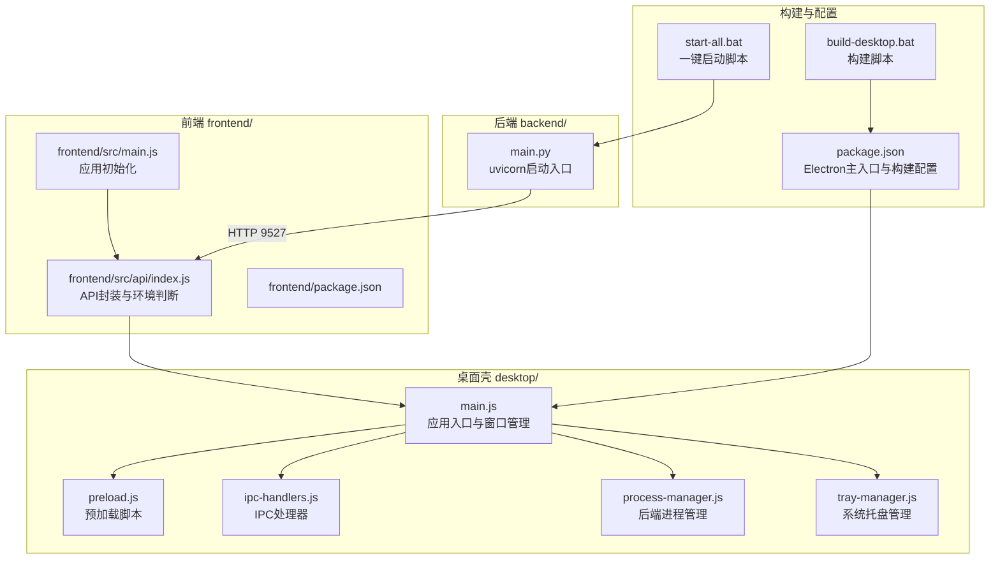
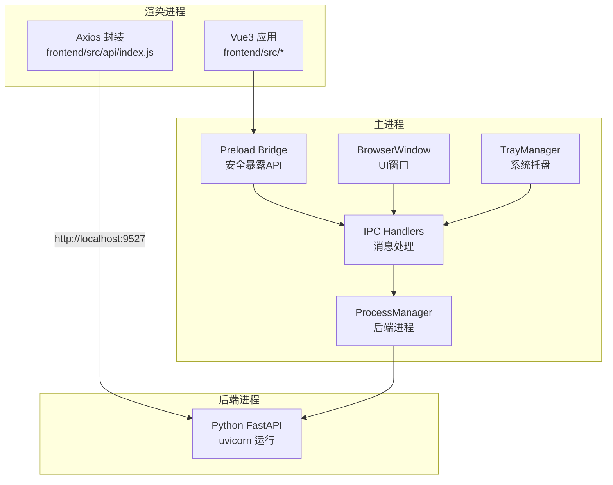
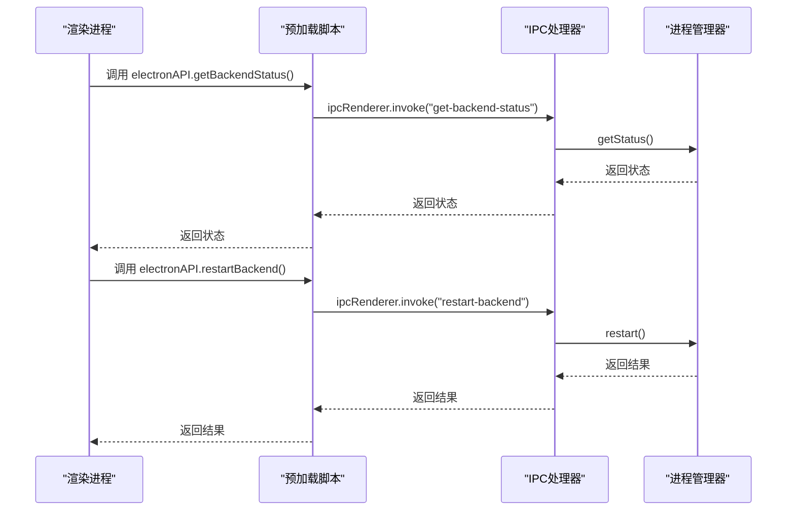
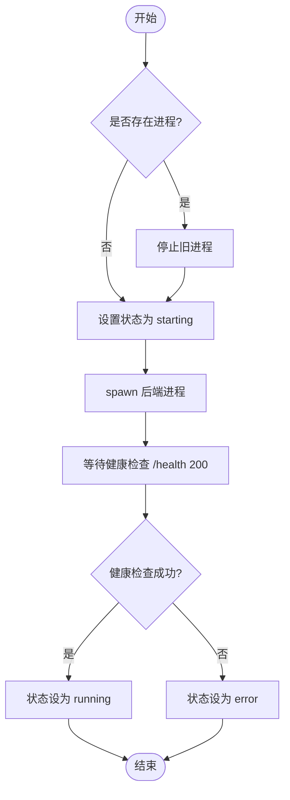
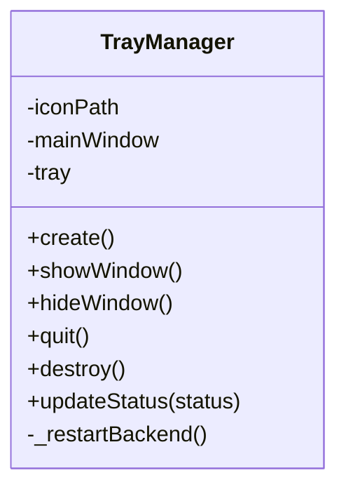
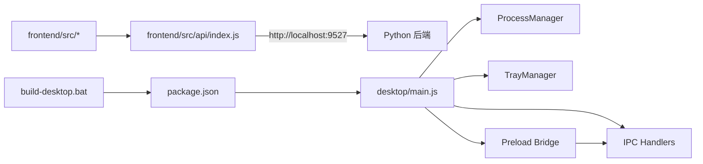

# 桌面应用

<cite>
**本文引用的文件**
- [desktop/main.js](file://desktop/main.js)
- [desktop/preload.js](file://desktop/preload.js)
- [desktop/ipc-handlers.js](file://desktop/ipc-handlers.js)
- [desktop/process-manager.js](file://desktop/process-manager.js)
- [desktop/tray-manager.js](file://desktop/tray-manager.js)
- [package.json](file://package.json)
- [build-desktop.bat](file://build-desktop.bat)
- [start-all.bat](file://start-all.bat)
- [main.py](file://main.py)
- [frontend/src/api/index.js](file://frontend/src/api/index.js)
- [frontend/src/main.js](file://frontend/src/main.js)
- [frontend/package.json](file://frontend/package.json)
- [README.md](file://README.md)
- [docs/STARTUP_GUIDE.md](file://docs/STARTUP_GUIDE.md)
</cite>

## 目录
1. [引言](#引言)
2. [项目结构](#项目结构)
3. [核心组件](#核心组件)
4. [架构总览](#架构总览)
5. [组件详解](#组件详解)
6. [依赖关系分析](#依赖关系分析)
7. [性能与稳定性](#性能与稳定性)
8. [故障排查指南](#故障排查指南)
9. [打包、分发与更新](#打包分发与更新)
10. [结论](#结论)
11. [附录](#附录)

## 引言
本技术文档面向InkTrace桌面应用的开发者与运维人员，系统阐述基于Electron的跨平台桌面应用架构设计与实现细节。文档覆盖主进程与渲染进程的职责划分、IPC通信机制、系统集成（系统托盘、文件管理、进程监控）、预加载脚本的安全策略、后端服务的启动与停止流程、托盘管理器的交互与状态管理、打包分发与更新策略，以及跨平台兼容与性能优化建议。目标是帮助读者快速理解并高效扩展该桌面应用。

## 项目结构
InkTrace采用前后端分离与桌面壳工程结合的组织方式：
- 桌面壳工程位于 desktop/，负责应用生命周期、系统集成与IPC桥接。
- 后端服务为独立的Python进程，通过uvicorn运行FastAPI应用。
- 前端为Vue3应用，通过Vite构建，运行在浏览器环境中。
- package.json定义了Electron主入口、构建脚本与electron-builder配置。

图表来源
- [desktop/main.js:1-213](file://desktop/main.js#L1-L213)
- [desktop/preload.js:1-25](file://desktop/preload.js#L1-L25)
- [desktop/ipc-handlers.js:1-50](file://desktop/ipc-handlers.js#L1-L50)
- [desktop/process-manager.js:1-207](file://desktop/process-manager.js#L1-L207)
- [desktop/tray-manager.js:1-96](file://desktop/tray-manager.js#L1-L96)
- [frontend/src/api/index.js:1-119](file://frontend/src/api/index.js#L1-L119)
- [frontend/src/main.js:1-23](file://frontend/src/main.js#L1-L23)
- [frontend/package.json:1-24](file://frontend/package.json#L1-L24)
- [package.json:1-81](file://package.json#L1-L81)
- [build-desktop.bat:1-35](file://build-desktop.bat#L1-L35)
- [start-all.bat:1-50](file://start-all.bat#L1-L50)
- [main.py:1-22](file://main.py#L1-L22)

章节来源
- [README.md:72-106](file://README.md#L72-L106)
- [package.json:1-81](file://package.json#L1-L81)

## 核心组件
- 主进程（desktop/main.js）
  - 负责创建BrowserWindow、加载前端页面、启动后端进程、注册系统托盘、监听应用事件与退出清理。
- 预加载脚本（desktop/preload.js）
  - 通过contextBridge安全地向渲染进程暴露有限的Electron能力，避免直接注入全局对象。
- IPC处理器（desktop/ipc-handlers.js）
  - 注册ipcMain.handle方法，处理来自渲染进程的调用；转发后端状态变更事件至渲染进程。
- 进程管理器（desktop/process-manager.js）
  - 管理Python后端进程的启动、停止、重启与健康检查，维护状态并通知订阅者。
- 托盘管理器（desktop/tray-manager.js）
  - 构建系统托盘菜单，提供显示/隐藏窗口、重启后端、退出应用等交互，并根据后端状态更新提示文本。
- 前端API封装（frontend/src/api/index.js）
  - 根据是否在Electron环境下动态选择后端地址，统一拦截错误并提示用户。
- 构建与打包（package.json、build-desktop.bat）
  - electron-builder配置与构建脚本，确保后端与前端产物被打包进最终安装包。

章节来源
- [desktop/main.js:1-213](file://desktop/main.js#L1-L213)
- [desktop/preload.js:1-25](file://desktop/preload.js#L1-L25)
- [desktop/ipc-handlers.js:1-50](file://desktop/ipc-handlers.js#L1-L50)
- [desktop/process-manager.js:1-207](file://desktop/process-manager.js#L1-L207)
- [desktop/tray-manager.js:1-96](file://desktop/tray-manager.js#L1-L96)
- [frontend/src/api/index.js:1-119](file://frontend/src/api/index.js#L1-L119)
- [package.json:1-81](file://package.json#L1-L81)
- [build-desktop.bat:1-35](file://build-desktop.bat#L1-L35)

## 架构总览
下图展示了桌面应用的总体架构：主进程协调窗口、托盘与后端进程；渲染进程通过预加载脚本与IPC与主进程通信；后端以独立进程运行并通过HTTP提供API。

图表来源
- [desktop/main.js:1-213](file://desktop/main.js#L1-L213)
- [desktop/preload.js:1-25](file://desktop/preload.js#L1-L25)
- [desktop/ipc-handlers.js:1-50](file://desktop/ipc-handlers.js#L1-L50)
- [desktop/process-manager.js:1-207](file://desktop/process-manager.js#L1-L207)
- [desktop/tray-manager.js:1-96](file://desktop/tray-manager.js#L1-L96)
- [frontend/src/api/index.js:1-119](file://frontend/src/api/index.js#L1-L119)
- [main.py:1-22](file://main.py#L1-L22)

## 组件详解

### 主进程与窗口管理
- 窗口创建与显示策略：在开发模式下加载本地Vite开发服务器，在生产模式下加载打包后的前端静态文件；直接显示窗口以减少白屏。
- 关闭行为：拦截窗口关闭事件，转为隐藏窗口，实现“最小化到托盘”的体验。
- 错误兜底：若前端加载失败，主进程加载内嵌的错误页面，展示调试信息与解决方案。
- 生命周期：在before-quit阶段停止后端进程与销毁托盘，确保资源释放。

章节来源
- [desktop/main.js:21-74](file://desktop/main.js#L21-L74)
- [desktop/main.js:76-128](file://desktop/main.js#L76-L128)
- [desktop/main.js:188-209](file://desktop/main.js#L188-L209)

### 预加载脚本与安全策略
- 通过contextBridge将受控API暴露给渲染进程，避免直接启用nodeIntegration与禁用contextIsolation带来的风险。
- 暴露的方法包括：查询后端状态、重启后端、打开外部链接、在文件管理器中定位文件、获取应用版本与路径，以及订阅后端状态变化事件。
- 渲染进程通过window.electronAPI访问上述能力，确保最小权限原则。

章节来源
- [desktop/preload.js:1-25](file://desktop/preload.js#L1-L25)
- [desktop/main.js:30-37](file://desktop/main.js#L30-L37)

### IPC通信与消息协议
- 渲染进程通过ipcRenderer.invoke调用主进程注册的ipcMain.handle方法，实现请求-响应式通信。
- 主进程通过processManager.onStatusChange回调，向所有BrowserWindow广播后端状态变更事件。
- 常用消息包括：获取后端状态、重启后端、打开外部链接、在文件管理器中定位文件、获取应用版本与路径。

图表来源
- [desktop/preload.js:9-24](file://desktop/preload.js#L9-L24)
- [desktop/ipc-handlers.js:9-47](file://desktop/ipc-handlers.js#L9-L47)
- [desktop/process-manager.js:120-129](file://desktop/process-manager.js#L120-L129)

章节来源
- [desktop/ipc-handlers.js:1-50](file://desktop/ipc-handlers.js#L1-L50)
- [desktop/process-manager.js:131-146](file://desktop/process-manager.js#L131-L146)

### 后端进程管理器
- 启动流程：根据开发/生产模式选择Python解释器或可执行文件，设置环境变量（编码与端口），异步等待后端健康检查（/health）返回200。
- 健康检查：定时轮询本地端口，超时则标记为错误。
- 停止流程：优先发送SIGTERM，超时后强制SIGKILL，触发exit事件后清理状态。
- 状态通知：内部维护状态机（stopped/starting/stopping/error/running），并向订阅者广播。

图表来源
- [desktop/process-manager.js:20-91](file://desktop/process-manager.js#L20-L91)
- [desktop/process-manager.js:162-203](file://desktop/process-manager.js#L162-L203)

章节来源
- [desktop/process-manager.js:1-207](file://desktop/process-manager.js#L1-L207)

### 系统托盘管理器
- 托盘图标与菜单：双击显示主窗口；右键菜单包含显示/隐藏窗口、重启后端、退出应用。
- 状态提示：根据后端状态动态更新工具提示文本。
- 交互联动：通过BrowserWindow.send向渲染进程发送“重启后端”请求，配合IPC处理器实现重启。

图表来源
- [desktop/tray-manager.js:9-96](file://desktop/tray-manager.js#L9-L96)

章节来源
- [desktop/tray-manager.js:1-96](file://desktop/tray-manager.js#L1-L96)

### 前端API封装与环境适配
- 环境判断：通过window.electronAPI存在性判断是否在Electron环境中，决定后端地址前缀（本地9527或同源代理）。
- 统一拦截：对后端返回的错误进行映射与用户友好提示，提升可用性。
- 依赖：Vue3、Element Plus、Axios、Pinia与路由。

章节来源
- [frontend/src/api/index.js:1-119](file://frontend/src/api/index.js#L1-L119)
- [frontend/src/main.js:1-23](file://frontend/src/main.js#L1-L23)
- [frontend/package.json:1-24](file://frontend/package.json#L1-L24)

## 依赖关系分析
- 桌面壳对后端：通过ProcessManager与uvicorn进程通信；通过IPC向渲染进程广播状态。
- 渲染进程对桌面壳：通过预加载脚本与IPC处理器交互，实现状态查询与后端重启。
- 构建系统：electron-builder将后端可执行文件与前端dist资源打包；构建脚本负责编译前端、打包后端与调用electron-builder。

图表来源
- [desktop/main.js:1-213](file://desktop/main.js#L1-L213)
- [desktop/process-manager.js:1-207](file://desktop/process-manager.js#L1-L207)
- [desktop/tray-manager.js:1-96](file://desktop/tray-manager.js#L1-L96)
- [desktop/ipc-handlers.js:1-50](file://desktop/ipc-handlers.js#L1-L50)
- [desktop/preload.js:1-25](file://desktop/preload.js#L1-L25)
- [frontend/src/api/index.js:1-119](file://frontend/src/api/index.js#L1-L119)
- [main.py:1-22](file://main.py#L1-L22)
- [package.json:1-81](file://package.json#L1-L81)
- [build-desktop.bat:1-35](file://build-desktop.bat#L1-L35)

章节来源
- [package.json:1-81](file://package.json#L1-L81)
- [build-desktop.bat:1-35](file://build-desktop.bat#L1-L35)

## 性能与稳定性
- 启动顺序优化：先创建窗口再启动后端，缩短用户感知的“黑屏/白屏”时间。
- 健康检查与超时：后端启动超时自动标记错误，避免长时间阻塞。
- 进程优雅退出：优先SIGTERM，超时后强制SIGKILL，确保资源回收。
- 窗口关闭策略：隐藏而非销毁，降低频繁创建/销毁窗口的开销。
- 网络请求超时：前端API设置较长超时，适配长耗时任务（如续写）。
- 跨平台兼容：通过electron-builder配置不同平台目标（NSIS、DMG、AppImage），并提供图标资源。

章节来源
- [desktop/main.js:162-186](file://desktop/main.js#L162-L186)
- [desktop/process-manager.js:72-118](file://desktop/process-manager.js#L72-L118)
- [frontend/src/api/index.js:10-16](file://frontend/src/api/index.js#L10-L16)
- [package.json:47-76](file://package.json#L47-L76)

## 故障排查指南
- 前端加载失败
  - 现象：应用启动但前端界面空白。
  - 排查：检查生产模式下前端静态文件是否存在；查看错误页面中的调试信息（资源路径、打包状态）。
- 后端启动失败
  - 现象：后端服务未就绪或异常退出。
  - 排查：查看后端stderr日志；确认端口未被占用；检查Python解释器与依赖；健康检查超时会记录错误。
- 托盘不可用或无响应
  - 现象：托盘菜单点击无效。
  - 排查：确认TrayManager已创建；检查双击显示窗口与重启后端的事件绑定。
- 窗口无法显示/隐藏
  - 现象：点击托盘菜单无反应。
  - 排查：确认BrowserWindow实例有效；检查最小化状态与focus调用。
- 构建产物缺失
  - 现象：安装包缺少后端或前端资源。
  - 排查：核对electron-builder extraResources与files配置；确认构建脚本按顺序执行。

章节来源
- [desktop/main.js:76-128](file://desktop/main.js#L76-L128)
- [desktop/process-manager.js:65-77](file://desktop/process-manager.js#L65-L77)
- [desktop/tray-manager.js:45-47](file://desktop/tray-manager.js#L45-L47)
- [package.json:26-46](file://package.json#L26-L46)
- [build-desktop.bat:10-27](file://build-desktop.bat#L10-L27)

## 打包、分发与更新
- 构建脚本
  - 自动安装前端依赖并构建dist；安装PyInstaller并打包后端；调用electron-builder进行多平台打包。
- 构建配置
  - appId、productName、输出目录、文件包含规则与额外资源（backend与frontend）均在package.json中配置。
  - 平台目标：Windows（NSIS）、macOS（DMG）、Linux（AppImage）。
- 一键启动
  - start-all.bat用于开发/测试环境，自动检查Python与Node版本并启动后端与前端。
- 更新机制
  - 当前仓库未提供内置自动更新实现。建议在CI/CD中集成electron-updater或使用GitHub Releases发布渠道，以实现应用自更新。

章节来源
- [build-desktop.bat:1-35](file://build-desktop.bat#L1-L35)
- [package.json:20-76](file://package.json#L20-L76)
- [start-all.bat:1-50](file://start-all.bat#L1-L50)

## 结论
InkTrace桌面应用通过清晰的主/渲染进程分工、严格的预加载安全策略、完善的IPC通信与系统托盘集成，实现了稳定的跨平台体验。后端进程管理器提供了可靠的启动、健康检查与优雅退出机制，前端API封装兼顾易用性与错误提示。结合electron-builder的多平台打包能力，开发者可以快速交付高质量的桌面应用。后续可在CI/CD中引入自动更新机制，进一步提升用户体验。

## 附录
- 快速启动与日常使用参考
  - 一键启动：start-all.bat
  - 停止服务：stop.bat
  - 后端端口与环境变量：INKTRACE_PORT、INKTRACE_HOST
- 技术栈概览
  - 桌面壳：Electron 28
  - 后端：Python 3.11+、FastAPI、uvicorn
  - 前端：Vue 3、Vite、Element Plus、Axios、Pinia、Vue Router

章节来源
- [README.md:23-70](file://README.md#L23-L70)
- [docs/STARTUP_GUIDE.md:57-92](file://docs/STARTUP_GUIDE.md#L57-L92)
- [docs/STARTUP_GUIDE.md:101-118](file://docs/STARTUP_GUIDE.md#L101-L118)