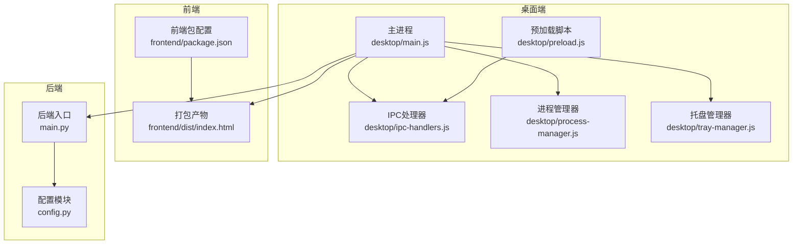
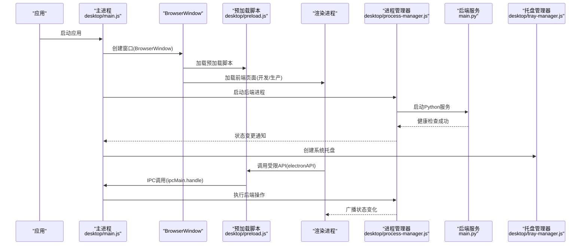
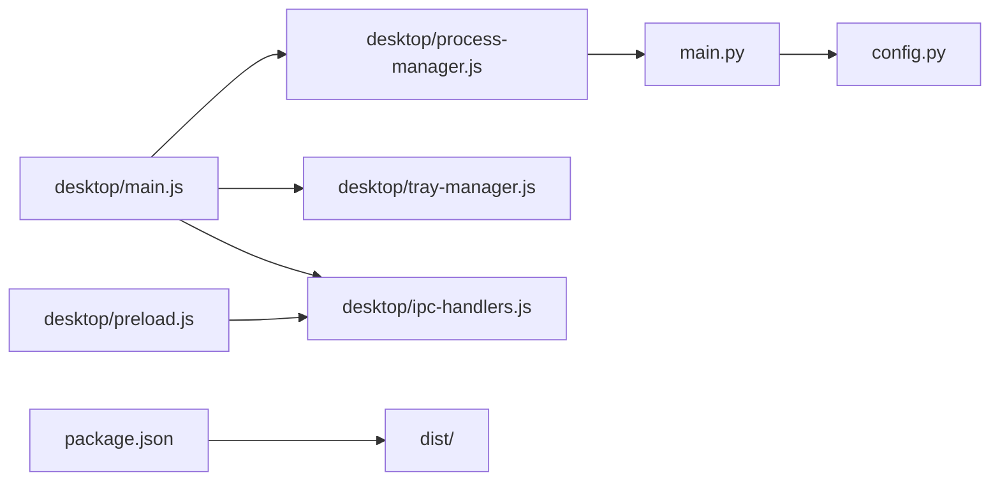

# Electron架构设计

<cite>
**本文引用的文件**
- [desktop/main.js](file://desktop/main.js)
- [desktop/preload.js](file://desktop/preload.js)
- [desktop/ipc-handlers.js](file://desktop/ipc-handlers.js)
- [desktop/process-manager.js](file://desktop/process-manager.js)
- [desktop/tray-manager.js](file://desktop/tray-manager.js)
- [package.json](file://package.json)
- [frontend/package.json](file://frontend/package.json)
- [build-desktop.bat](file://build-desktop.bat)
- [debug-desktop.js](file://debug-desktop.js)
- [start.bat](file://start.bat)
- [config.py](file://config.py)
- [main.py](file://main.py)
</cite>

## 目录
1. [引言](#引言)
2. [项目结构](#项目结构)
3. [核心组件](#核心组件)
4. [架构总览](#架构总览)
5. [详细组件分析](#详细组件分析)
6. [依赖关系分析](#依赖关系分析)
7. [性能考虑](#性能考虑)
8. [故障排查指南](#故障排查指南)
9. [结论](#结论)

## 引言
本文件面向InkTrace项目的Electron桌面端架构设计，系统性阐述主进程与渲染进程的职责分工与协作机制，详解BrowserWindow配置、安全策略（contextIsolation与nodeIntegration）、预加载脚本的作用与安全边界，说明开发/生产模式的加载策略差异，以及窗口生命周期管理、状态管理与用户体验优化最佳实践，并给出错误处理与降级策略的实现方案。

## 项目结构
InkTrace采用“前端Vue3 + 后端FastAPI + Electron主进程”的三层架构。桌面端通过Electron主进程承载应用生命周期与系统集成能力，渲染进程负责UI交互，后端Python服务提供业务逻辑与数据持久化。

图表来源
- [desktop/main.js:1-213](file://desktop/main.js#L1-L213)
- [desktop/preload.js:1-25](file://desktop/preload.js#L1-L25)
- [desktop/ipc-handlers.js:1-50](file://desktop/ipc-handlers.js#L1-L50)
- [desktop/process-manager.js:1-207](file://desktop/process-manager.js#L1-L207)
- [desktop/tray-manager.js:1-96](file://desktop/tray-manager.js#L1-L96)
- [frontend/package.json:1-24](file://frontend/package.json#L1-L24)
- [main.py:1-22](file://main.py#L1-L22)
- [config.py:1-46](file://config.py#L1-L46)

章节来源
- [desktop/main.js:1-213](file://desktop/main.js#L1-L213)
- [package.json:1-81](file://package.json#L1-L81)
- [frontend/package.json:1-24](file://frontend/package.json#L1-L24)

## 核心组件
- 主进程：负责应用生命周期、窗口创建与事件、系统托盘、后端进程管理、IPC通信注册与错误处理。
- 渲染进程：负责UI展示与用户交互，通过预加载脚本暴露受控的Electron API给前端代码。
- 预加载脚本：在隔离上下文中向渲染进程暴露有限的Electron能力，确保安全边界。
- 进程管理器：封装后端Python服务的启动、健康检查、重启与退出流程。
- 托盘管理器：提供系统托盘图标、菜单与窗口显示/隐藏控制。
- 构建与部署：使用electron-builder打包，按平台输出安装包或便携包。

章节来源
- [desktop/main.js:1-213](file://desktop/main.js#L1-L213)
- [desktop/preload.js:1-25](file://desktop/preload.js#L1-L25)
- [desktop/ipc-handlers.js:1-50](file://desktop/ipc-handlers.js#L1-L50)
- [desktop/process-manager.js:1-207](file://desktop/process-manager.js#L1-L207)
- [desktop/tray-manager.js:1-96](file://desktop/tray-manager.js#L1-L96)
- [package.json:1-81](file://package.json#L1-L81)

## 架构总览
下图展示了主进程、渲染进程、预加载脚本、后端服务与系统托盘之间的交互关系。

图表来源
- [desktop/main.js:161-213](file://desktop/main.js#L161-L213)
- [desktop/preload.js:9-24](file://desktop/preload.js#L9-L24)
- [desktop/ipc-handlers.js:9-47](file://desktop/ipc-handlers.js#L9-L47)
- [desktop/process-manager.js:20-91](file://desktop/process-manager.js#L20-L91)
- [main.py:15-22](file://main.py#L15-L22)

## 详细组件分析

### 主进程与BrowserWindow配置
- 窗口尺寸与最小化限制：窗口默认宽高与最小宽高限制保证了良好的初始体验与可用性。
- 标题与图标：设置窗口标题与图标，提升品牌识别度。
- webPreferences安全配置：禁用nodeIntegration，启用contextIsolation，并指定预加载脚本路径，形成安全边界。
- 显示策略：直接显示窗口，减少白屏时间；设置背景色避免闪烁。
- 关闭行为：拦截窗口关闭事件，改为隐藏窗口，支持托盘常驻。
- 生命周期事件：监听window-all-closed与activate事件，确保跨平台行为一致；before-quit阶段清理后端进程与托盘资源。

章节来源
- [desktop/main.js:21-74](file://desktop/main.js#L21-L74)
- [desktop/main.js:188-209](file://desktop/main.js#L188-L209)

### 预加载脚本与安全边界
- 作用：通过contextBridge在渲染进程的全局环境中暴露有限的API，使前端代码能够以安全的方式调用Electron能力。
- 暴露的API：后端状态查询、后端重启、打开外部链接、显示文件位置、获取应用版本与路径等。
- 安全策略：仅暴露必要方法，避免直接暴露完整Electron API；使用ipcRenderer.invoke进行请求-响应通信，避免直接共享全局对象。

章节来源
- [desktop/preload.js:1-25](file://desktop/preload.js#L1-L25)

### IPC通信与处理器
- 注册处理器：在主进程中注册各类IPC处理函数，包括后端状态查询、后端重启、打开外部链接、显示文件位置、获取应用版本与路径等。
- 状态广播：当后端状态发生变化时，主进程遍历所有窗口并向其发送状态变更事件，渲染进程通过预加载脚本接收并更新UI。
- 错误处理：处理器内部捕获异常并返回结构化的错误信息，便于前端统一处理。

章节来源
- [desktop/ipc-handlers.js:1-50](file://desktop/ipc-handlers.js#L1-L50)

### 进程管理器与后端服务
- 启动流程：根据开发/生产模式选择不同的启动方式；开发模式下通过Python解释器执行后端入口文件；生产模式下直接执行打包后的可执行文件。
- 健康检查：通过HTTP请求轮询后端健康接口，超时则标记为错误状态。
- 状态管理：维护启动中、运行中、停止中、错误、已停止等状态，并通过回调通知订阅者。
- 优雅停机：先发送SIGTERM，超时后强制SIGKILL；监听exit事件确保资源释放。
- 环境变量：设置Python编码与后端端口，确保日志与通信正常。

章节来源
- [desktop/process-manager.js:1-207](file://desktop/process-manager.js#L1-L207)
- [main.py:15-22](file://main.py#L15-L22)
- [config.py:14-46](file://config.py#L14-L46)

### 系统托盘管理
- 图标与菜单：使用应用图标创建托盘，提供显示/隐藏主窗口、重启后端服务、退出等菜单项。
- 事件处理：双击托盘显示主窗口；点击菜单项触发对应动作。
- 状态提示：根据后端状态动态更新托盘工具提示文本，直观反映服务状态。

章节来源
- [desktop/tray-manager.js:1-96](file://desktop/tray-manager.js#L1-L96)

### 开发模式与生产模式的加载策略
- 开发模式：主进程加载本地Vite开发服务器地址，自动打开开发者工具，便于前端调试。
- 生产模式：主进程从打包资源路径加载前端index.html；若文件不存在则降级到内置错误页面，包含调试信息与解决方案提示。
- 后端路径：开发模式指向Python源文件，生产模式指向打包后的可执行文件。

章节来源
- [desktop/main.js:52-74](file://desktop/main.js#L52-L74)
- [desktop/main.js:130-141](file://desktop/main.js#L130-L141)

### 窗口生命周期管理
- 创建：应用就绪时创建主窗口，设置webPreferences与事件监听。
- 关闭：拦截关闭事件，隐藏窗口而非销毁，支持托盘常驻。
- 激活：多窗口平台在激活时重建窗口，保持用户体验一致性。
- 退出：before-quit阶段标记退出标志，停止后端进程并销毁托盘。

章节来源
- [desktop/main.js:188-209](file://desktop/main.js#L188-L209)

### 窗口状态管理与用户体验优化
- 状态可视化：托盘提示文本随后端状态实时更新，帮助用户快速判断服务状态。
- 错误降级：生产模式下前端文件缺失时，显示内置错误页面，包含调试信息与解决方案，提升可诊断性。
- 白屏优化：设置窗口背景色与直接显示策略，减少白屏时间。
- 交互反馈：通过IPC广播状态变化，前端可即时更新UI状态与提示信息。

章节来源
- [desktop/main.js:76-128](file://desktop/main.js#L76-L128)
- [desktop/tray-manager.js:78-86](file://desktop/tray-manager.js#L78-L86)

## 依赖关系分析
- 主进程依赖：Electron核心API、进程管理器、托盘管理器、IPC处理器。
- 预加载脚本依赖：Electron的contextBridge与ipcRenderer。
- IPC处理器依赖：shell、app、BrowserWindow等Electron API。
- 进程管理器依赖：child_process、http、fs等Node原生模块。
- 构建配置依赖：electron-builder、平台目标与安装器配置。

图表来源
- [desktop/main.js:1-213](file://desktop/main.js#L1-L213)
- [desktop/process-manager.js:1-207](file://desktop/process-manager.js#L1-L207)
- [desktop/tray-manager.js:1-96](file://desktop/tray-manager.js#L1-L96)
- [desktop/ipc-handlers.js:1-50](file://desktop/ipc-handlers.js#L1-L50)
- [desktop/preload.js:1-25](file://desktop/preload.js#L1-L25)
- [main.py:1-22](file://main.py#L1-L22)
- [config.py:1-46](file://config.py#L1-L46)
- [package.json:1-81](file://package.json#L1-L81)

章节来源
- [package.json:1-81](file://package.json#L1-L81)

## 性能考虑
- 启动顺序：先创建窗口再启动后端，缩短用户等待时间；后端启动失败时及时反馈。
- 健康检查：通过HTTP轮询确保后端可用，避免无效请求导致的阻塞。
- 日志输出：后端标准输出与错误输出统一打印，便于定位问题。
- 资源释放：before-quit阶段清理进程与托盘，避免资源泄漏。
- 打包体积：electron-builder配置排除不必要的文件，减少安装包大小。

[本节为通用建议，无需特定文件引用]

## 故障排查指南
- 启动失败：检查后端可执行文件是否存在与可执行权限；确认端口占用与防火墙设置。
- 前端加载失败：开发模式检查Vite服务是否启动；生产模式检查打包产物路径与文件完整性。
- 托盘异常：确认图标路径正确与平台托盘支持；检查菜单项事件绑定。
- 状态不同步：确认IPC广播逻辑与渲染侧监听是否正确；检查预加载脚本暴露的API是否被正确调用。
- 构建问题：使用诊断脚本检查关键文件是否存在；核对构建脚本与依赖安装顺序。

章节来源
- [debug-desktop.js:1-56](file://debug-desktop.js#L1-L56)
- [build-desktop.bat:1-35](file://build-desktop.bat#L1-L35)
- [start.bat:1-40](file://start.bat#L1-L40)

## 结论
InkTrace的Electron架构通过清晰的职责划分与严格的安全边界，实现了稳定的桌面端体验。主进程负责系统集成与后端管理，渲染进程专注于UI交互，预加载脚本在隔离上下文中提供受控的桥接能力。开发/生产模式的差异化加载策略与完善的错误降级机制，提升了应用的可维护性与用户体验。建议在后续迭代中持续完善日志体系、监控告警与自动化测试，进一步增强系统的可靠性与可观测性。