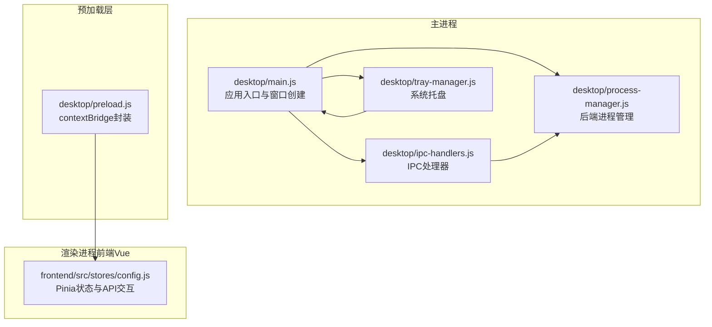
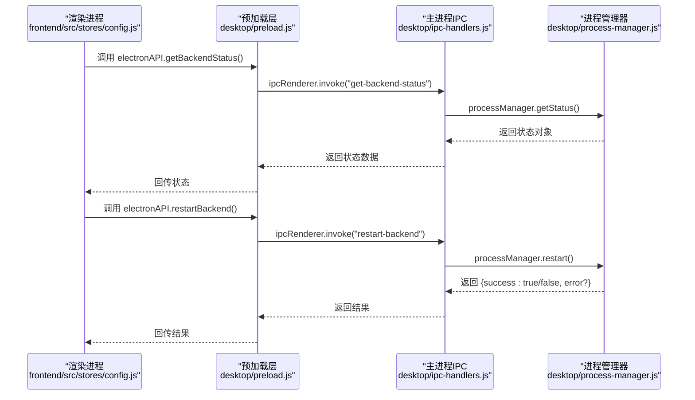
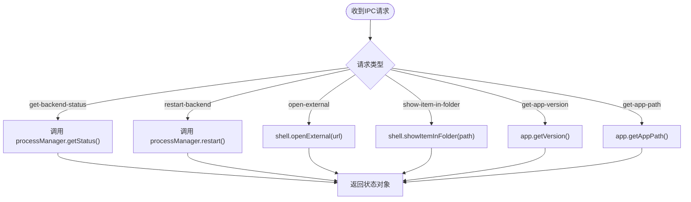
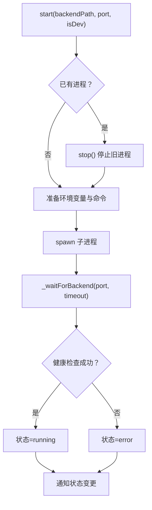
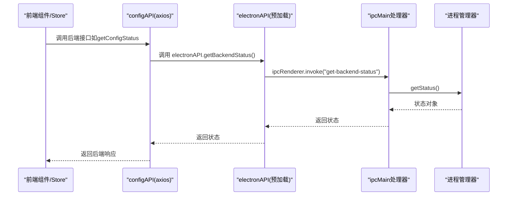
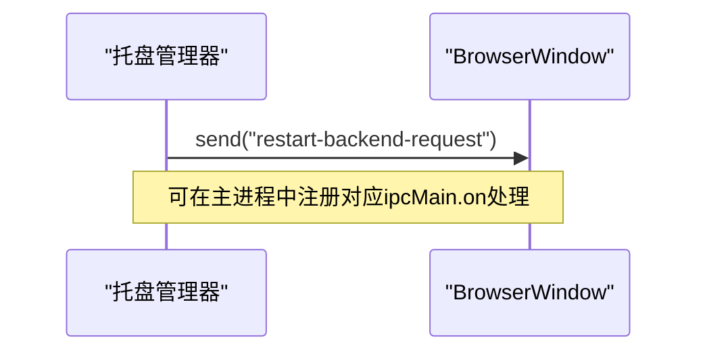
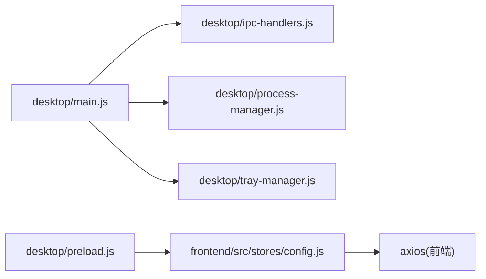

# IPC进程间通信

<cite>
**本文引用的文件**
- [desktop/main.js](file://desktop/main.js)
- [desktop/preload.js](file://desktop/preload.js)
- [desktop/ipc-handlers.js](file://desktop/ipc-handlers.js)
- [desktop/process-manager.js](file://desktop/process-manager.js)
- [desktop/tray-manager.js](file://desktop/tray-manager.js)
- [frontend/src/stores/config.js](file://frontend/src/stores/config.js)
- [frontend/package.json](file://frontend/package.json)
</cite>

## 目录
1. [简介](#简介)
2. [项目结构](#项目结构)
3. [核心组件](#核心组件)
4. [架构总览](#架构总览)
5. [详细组件分析](#详细组件分析)
6. [依赖关系分析](#依赖关系分析)
7. [性能考量](#性能考量)
8. [故障排查指南](#故障排查指南)
9. [结论](#结论)
10. [附录](#附录)

## 简介
本文件面向InkTrace项目的桌面端，系统性梳理Electron IPC（进程间通信）机制与实现，覆盖以下主题：
- ipcMain与ipcRenderer的使用模式与职责边界
- 消息处理函数的注册与调用流程
- 同步与异步消息传递的区别与适用场景
- 数据序列化与反序列化处理机制
- 错误处理与超时机制
- 常见通信模式示例（文件操作、配置读取、后端服务控制）
- 跨进程数据传输的安全考虑与最佳实践
- 调试IPC通信的方法与工具

## 项目结构
InkTrace桌面端采用标准Electron架构：主进程负责应用生命周期、系统托盘、后端进程管理与IPC路由；渲染进程（前端Vue应用）通过预加载脚本暴露受限API给页面使用。

图表来源
- [desktop/main.js:161-213](file://desktop/main.js#L161-L213)
- [desktop/ipc-handlers.js:9-47](file://desktop/ipc-handlers.js#L9-L47)
- [desktop/process-manager.js:13-218](file://desktop/process-manager.js#L13-L218)
- [desktop/preload.js:9-24](file://desktop/preload.js#L9-L24)
- [frontend/src/stores/config.js:14-240](file://frontend/src/stores/config.js#L14-L240)

章节来源
- [desktop/main.js:1-213](file://desktop/main.js#L1-213)
- [desktop/preload.js:1-25](file://desktop/preload.js#L1-L25)
- [desktop/ipc-handlers.js:1-50](file://desktop/ipc-handlers.js#L1-L50)
- [desktop/process-manager.js:1-218](file://desktop/process-manager.js#L1-L218)
- [desktop/tray-manager.js:1-96](file://desktop/tray-manager.js#L1-L96)
- [frontend/src/stores/config.js:1-240](file://frontend/src/stores/config.js#L1-L240)

## 核心组件
- 主进程入口与窗口管理：负责创建BrowserWindow、加载前端资源、启动后端进程、设置系统托盘与IPC处理器。
- 预加载脚本：通过contextBridge在window对象上安全暴露有限的electronAPI方法，供渲染进程调用。
- IPC处理器：集中注册ipcMain.handle与ipcMain.on，提供后端状态查询、重启、外部链接打开、文件定位、应用信息查询等能力，并向所有窗口广播后端状态变更事件。
- 进程管理器：封装Python后端进程的启动、停止、重启、健康检查与状态通知，内置超时与错误处理。
- 托盘管理器：提供托盘菜单与双击显示窗口，触发后端重启请求。
- 前端状态管理：通过Pinia store发起配置读取、保存、测试与删除等操作，间接通过electronAPI与主进程通信。

章节来源
- [desktop/main.js:161-213](file://desktop/main.js#L161-L213)
- [desktop/preload.js:9-24](file://desktop/preload.js#L9-L24)
- [desktop/ipc-handlers.js:9-47](file://desktop/ipc-handlers.js#L9-L47)
- [desktop/process-manager.js:13-218](file://desktop/process-manager.js#L13-L218)
- [desktop/tray-manager.js:16-92](file://desktop/tray-manager.js#L16-L92)
- [frontend/src/stores/config.js:14-240](file://frontend/src/stores/config.js#L14-L240)

## 架构总览
下图展示从渲染进程到主进程的关键通信链路与数据流。

图表来源
- [desktop/preload.js:9-14](file://desktop/preload.js#L9-L14)
- [desktop/ipc-handlers.js:10-21](file://desktop/ipc-handlers.js#L10-L21)
- [desktop/process-manager.js:131-140](file://desktop/process-manager.js#L131-L140)

## 详细组件分析

### 组件一：IPC处理器（ipc-handlers）
- 注册的处理函数
  - 查询后端状态：ipcMain.handle("get-backend-status")
  - 重启后端：ipcMain.handle("restart-backend")
  - 打开外部链接：ipcMain.handle("open-external")
  - 显示文件所在位置：ipcMain.handle("show-item-in-folder")
  - 获取应用版本与路径：ipcMain.handle("get-app-version", "get-app-path")
- 广播机制
  - 当进程管理器状态变化时，通过BrowserWindow集合向所有窗口发送"backend-status-changed"事件，供前端订阅。

图表来源
- [desktop/ipc-handlers.js:9-47](file://desktop/ipc-handlers.js#L9-L47)

章节来源
- [desktop/ipc-handlers.js:1-50](file://desktop/ipc-handlers.js#L1-L50)

### 组件二：进程管理器（process-manager）
- 启动后端
  - 设置环境变量（端口、数据库路径、调试开关等），区分开发/生产模式执行方式。
  - 监听stdout/stderr输出，捕获错误与退出事件。
  - 通过HTTP健康检查轮询等待后端就绪，带超时控制。
- 停止与重启
  - 发送SIGTERM优雅停止，超时后强制SIGKILL。
  - 重启时复用上次后端路径与端口。
- 状态通知
  - 内部维护状态队列与监听者回调，统一通知上层状态变更。

图表来源
- [desktop/process-manager.js:21-102](file://desktop/process-manager.js#L21-L102)
- [desktop/process-manager.js:173-214](file://desktop/process-manager.js#L173-L214)

章节来源
- [desktop/process-manager.js:1-218](file://desktop/process-manager.js#L1-L218)

### 组件三：预加载脚本与渲染进程桥接（preload + frontend store）
- 预加载脚本通过contextBridge.exposeInMainWorld暴露electronAPI，包含：
  - 异步invoke方法：getBackendStatus、restartBackend、openExternal、showItemInFolder、getAppVersion、getAppPath
  - 事件监听：onBackendStatusChanged、removeBackendStatusListener
- 前端store（Pinia）在组件挂载时调用initialize，内部通过configAPI访问后端接口，间接依赖electronAPI完成系统级能力（如打开外部链接、定位文件等）。

图表来源
- [desktop/preload.js:9-14](file://desktop/preload.js#L9-L14)
- [desktop/ipc-handlers.js:10-12](file://desktop/ipc-handlers.js#L10-L12)
- [frontend/src/stores/config.js:165-167](file://frontend/src/stores/config.js#L165-L167)

章节来源
- [desktop/preload.js:1-25](file://desktop/preload.js#L1-L25)
- [frontend/src/stores/config.js:14-240](file://frontend/src/stores/config.js#L1-L240)

### 组件四：系统托盘与IPC联动（tray-manager）
- 提供托盘菜单项“重启后端服务”，点击时通过webContents.send向主进程发送"restart-backend-request"事件。
- 主进程ipc-handlers.js中未直接注册该事件处理，但可扩展为统一的重启入口，便于后续维护。

图表来源
- [desktop/tray-manager.js:88-92](file://desktop/tray-manager.js#L88-L92)

章节来源
- [desktop/tray-manager.js:1-96](file://desktop/tray-manager.js#L1-L96)

## 依赖关系分析
- 主进程依赖
  - desktop/main.js依赖desktop/ipc-handlers.js进行IPC注册，依赖desktop/process-manager.js进行后端进程管理，依赖desktop/tray-manager.js进行托盘管理。
- 预加载与渲染
  - desktop/preload.js通过contextBridge暴露electronAPI，frontend/src/stores/config.js通过configAPI间接使用electronAPI。
- 外部依赖
  - 前端依赖axios进行HTTP请求，后端通过Python服务提供业务接口。

图表来源
- [desktop/main.js:11-178](file://desktop/main.js#L11-L178)
- [desktop/ipc-handlers.js:9-47](file://desktop/ipc-handlers.js#L9-L47)
- [desktop/process-manager.js:13-218](file://desktop/process-manager.js#L13-L218)
- [desktop/preload.js:9-24](file://desktop/preload.js#L9-L24)
- [frontend/src/stores/config.js:9,165-167](file://frontend/src/stores/config.js#L9,165-L167)
- [frontend/package.json:15](file://frontend/package.json#L15)

章节来源
- [desktop/main.js:1-213](file://desktop/main.js#L1-L213)
- [frontend/package.json:1-24](file://frontend/package.json#L1-L24)

## 性能考量
- 异步invoke优于同步send：渲染进程使用ipcRenderer.invoke进行请求-响应式通信，避免阻塞UI线程，适合频繁调用的系统能力（如后端状态查询）。
- 事件广播的节流：后端状态变更通过BrowserWindow集合广播，若状态变更过于频繁，可在主进程增加去抖策略，减少不必要的渲染进程更新。
- 健康检查轮询：进程管理器的健康检查间隔与超时时间需平衡启动速度与资源占用，避免过短轮询造成CPU压力。
- 数据序列化：ipcMain.handle返回的对象会被序列化传输，避免传递不可序列化字段（如函数、循环引用），确保稳定性和安全性。

## 故障排查指南
- 后端启动失败
  - 检查进程管理器的日志输出（stdout/stderr），确认环境变量是否正确设置（端口、数据库路径、调试开关）。
  - 确认健康检查路径与超时设置，必要时延长超时时间。
- IPC调用无响应
  - 确认预加载脚本已正确暴露electronAPI，且渲染进程通过window.electronAPI访问。
  - 使用Electron DevTools查看IPC调用链路，定位是主进程未注册handle还是渲染进程未正确invoke。
- 状态监听失效
  - 确认ipc-handlers.js中已向所有BrowserWindow发送"backend-status-changed"事件。
  - 在渲染侧使用removeAllListeners清理旧监听，避免内存泄漏。
- 超时与错误处理
  - 进程管理器对后端启动设置了超时与错误状态，IPC处理器对重启操作返回success/error，前端应根据返回值进行提示与重试。

章节来源
- [desktop/process-manager.js:68-88, 90-101, 173-214](file://desktop/process-manager.js#L68-L88,L90-L101,L173-L214)
- [desktop/ipc-handlers.js:14-21, 41-46](file://desktop/ipc-handlers.js#L14-L21,L41-L46)
- [desktop/preload.js:17-23](file://desktop/preload.js#L17-L23)

## 结论
InkTrace的IPC实现遵循Electron最佳实践：主进程集中处理系统能力与业务逻辑，预加载脚本提供受控API，渲染进程通过Pinia与axios进行业务交互。通过invoke/响应模式与事件广播机制，系统实现了稳定的前后端协作与系统级能力调用。建议后续在托盘重启入口与状态广播处增加去抖与错误回退策略，进一步提升用户体验与系统鲁棒性。

## 附录

### 常见通信模式示例（基于现有实现）
- 文件操作
  - 打开外部链接：通过electronAPI.openExternal调用，主进程使用shell.openExternal实现。
  - 显示文件所在位置：通过electronAPI.showItemInFolder调用，主进程使用shell.showItemInFolder实现。
- 配置读取
  - 前端通过Pinia store调用configAPI访问后端接口，间接使用electronAPI完成系统能力。
- 后端服务控制
  - 查询后端状态：electronAPI.getBackendStatus -> ipcMain.handle("get-backend-status") -> processManager.getStatus
  - 重启后端服务：electronAPI.restartBackend -> ipcMain.handle("restart-backend") -> processManager.restart

章节来源
- [desktop/preload.js:10-13](file://desktop/preload.js#L10-L13)
- [desktop/ipc-handlers.js:10-31](file://desktop/ipc-handlers.js#L10-L31)
- [desktop/process-manager.js:142-148](file://desktop/process-manager.js#L142-L148)
- [frontend/src/stores/config.js:165-167](file://frontend/src/stores/config.js#L165-L167)

### 安全与最佳实践
- 仅暴露必要的electronAPI方法，避免直接暴露原生模块。
- 对来自渲染进程的数据进行校验，避免注入风险。
- 使用invoke而非send进行请求-响应通信，便于错误传播与超时控制。
- 对于高频事件，考虑在主进程侧做去抖或批量处理，降低IPC压力。
- 在渲染侧及时移除事件监听，防止内存泄漏。

### 调试IPC通信的方法与工具
- 使用Electron DevTools查看主进程与渲染进程的IPC日志。
- 在预加载脚本与主进程处理器中添加日志，记录消息名称、参数与返回值。
- 利用浏览器网络面板观察后端HTTP请求（由前端axios发起），辅助定位IPC链路问题。