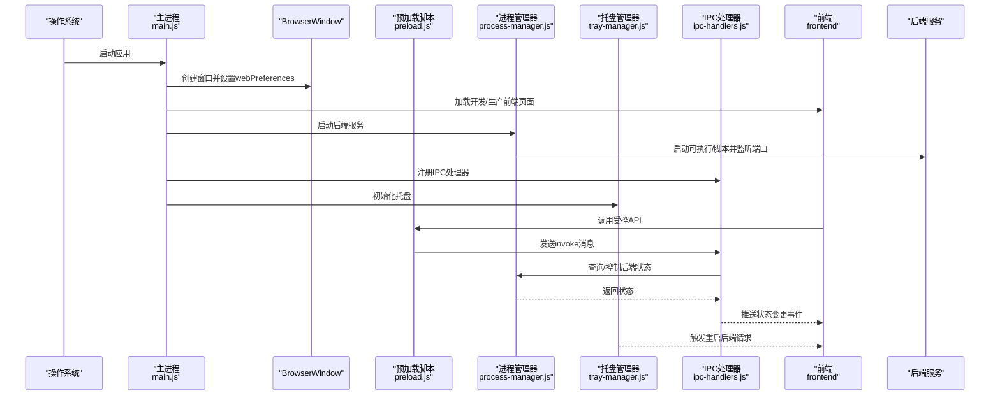
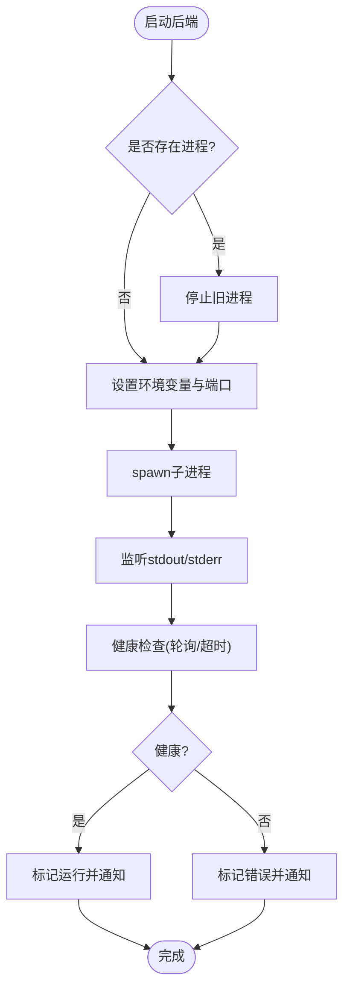
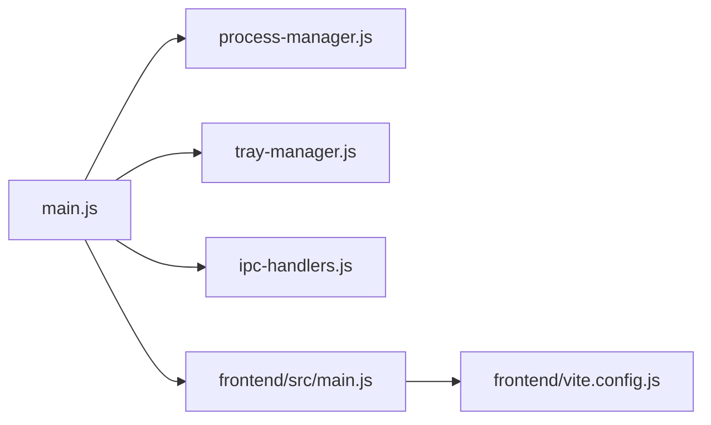

# 桌面应用开发

<cite>
**本文引用的文件**
- [desktop/main.js](file://desktop/main.js)
- [desktop/preload.js](file://desktop/preload.js)
- [desktop/ipc-handlers.js](file://desktop/ipc-handlers.js)
- [desktop/process-manager.js](file://desktop/process-manager.js)
- [desktop/tray-manager.js](file://desktop/tray-manager.js)
- [package.json](file://package.json)
- [build-desktop.bat](file://build-desktop.bat)
- [debug-desktop.js](file://debug-desktop.js)
- [start-all.bat](file://start-all.bat)
- [stop.bat](file://stop.bat)
- [frontend/vite.config.js](file://frontend/vite.config.js)
- [frontend/src/main.js](file://frontend/src/main.js)
</cite>

## 目录
1. [简介](#简介)
2. [项目结构](#项目结构)
3. [核心组件](#核心组件)
4. [架构总览](#架构总览)
5. [组件详解](#组件详解)
6. [依赖关系分析](#依赖关系分析)
7. [性能与稳定性](#性能与稳定性)
8. [调试与故障排除](#调试与故障排除)
9. [打包与分发](#打包与分发)
10. [结论](#结论)

## 简介
本文件面向InkTrace桌面应用的开发与维护，围绕基于Electron的应用架构进行系统化说明，重点覆盖以下方面：
- 主进程与渲染进程的职责划分与协作方式
- IPC（进程间通信）机制的实现与消息处理策略
- 系统托盘集成、菜单管理、窗口管理等UI与系统交互功能
- 进程管理器对后端服务的启动、停止与健康监控
- 预加载脚本的安全策略与API暴露机制
- 跨平台适配（Windows/macOS/Linux）的实现要点
- 打包与分发策略
- 调试方法与故障排除指南
- 权限管理与安全注意事项

## 项目结构
InkTrace桌面应用采用“前端（Vue）+ Electron主进程 + 后端（Python）”的三层架构。Electron负责应用生命周期、窗口与系统交互；前端通过Vite构建并由主进程加载；后端以独立可执行程序或Python脚本形式运行，通过HTTP提供服务。

```mermaid
graph TB
subgraph "桌面应用"
A["Electron主进程<br/>desktop/main.js"]
B["预加载脚本<br/>desktop/preload.js"]
C["IPC处理器<br/>desktop/ipc-handlers.js"]
D["进程管理器<br/>desktop/process-manager.js"]
E["系统托盘管理器<br/>desktop/tray-manager.js"]
F["前端Vue<br/>frontend/src/main.js"]
G["Vite配置<br/>frontend/vite.config.js"]
end
subgraph "后端服务"
H["Python后端<br/>main.py"]
end
A --> B
A --> C
A --> D
A --> E
A --> F
F --> G
A <- --> H
```

图表来源
- [desktop/main.js:1-213](file://desktop/main.js#L1-L213)
- [desktop/preload.js:1-25](file://desktop/preload.js#L1-L25)
- [desktop/ipc-handlers.js:1-50](file://desktop/ipc-handlers.js#L1-L50)
- [desktop/process-manager.js:1-207](file://desktop/process-manager.js#L1-L207)
- [desktop/tray-manager.js:1-96](file://desktop/tray-manager.js#L1-L96)
- [frontend/src/main.js:1-23](file://frontend/src/main.js#L1-L23)
- [frontend/vite.config.js:1-28](file://frontend/vite.config.js#L1-L28)

章节来源
- [desktop/main.js:1-213](file://desktop/main.js#L1-L213)
- [frontend/vite.config.js:1-28](file://frontend/vite.config.js#L1-L28)
- [frontend/src/main.js:1-23](file://frontend/src/main.js#L1-L23)

## 核心组件
- 主进程（desktop/main.js）
  - 负责创建BrowserWindow、加载前端页面、注册IPC处理器、启动后端进程、设置系统托盘、处理应用生命周期事件。
- 预加载脚本（desktop/preload.js）
  - 通过contextBridge在渲染进程中暴露受控API，仅暴露必要能力，确保安全隔离。
- IPC处理器（desktop/ipc-handlers.js）
  - 定义主进程侧的IPC接口，处理来自渲染进程的请求，并向渲染进程推送状态变更。
- 进程管理器（desktop/process-manager.js）
  - 管理后端服务的启动、停止、重启、健康检查与状态通知。
- 系统托盘管理器（desktop/tray-manager.js）
  - 提供托盘图标、上下文菜单、双击显示窗口、重启后端等能力。
- 前端（frontend）
  - Vue应用，使用Vite开发与构建，开发时通过代理转发到本地后端端口。

章节来源
- [desktop/main.js:1-213](file://desktop/main.js#L1-L213)
- [desktop/preload.js:1-25](file://desktop/preload.js#L1-L25)
- [desktop/ipc-handlers.js:1-50](file://desktop/ipc-handlers.js#L1-L50)
- [desktop/process-manager.js:1-207](file://desktop/process-manager.js#L1-L207)
- [desktop/tray-manager.js:1-96](file://desktop/tray-manager.js#L1-L96)
- [frontend/vite.config.js:1-28](file://frontend/vite.config.js#L1-L28)
- [frontend/src/main.js:1-23](file://frontend/src/main.js#L1-L23)

## 架构总览
下图展示桌面应用从启动到运行的关键流程：主进程创建窗口、加载前端、启动后端、建立IPC通道、托盘初始化与状态同步。



图表来源
- [desktop/main.js:161-213](file://desktop/main.js#L161-L213)
- [desktop/preload.js:9-24](file://desktop/preload.js#L9-L24)
- [desktop/ipc-handlers.js:9-47](file://desktop/ipc-handlers.js#L9-L47)
- [desktop/process-manager.js:20-91](file://desktop/process-manager.js#L20-L91)
- [desktop/tray-manager.js:16-48](file://desktop/tray-manager.js#L16-L48)

## 组件详解

### 主进程与窗口管理
- 窗口创建与安全配置
  - 关闭Node集成，启用上下文隔离，指定预加载脚本，避免在渲染进程中直接访问Node/Electron API。
  - 窗口最小尺寸与背景色优化首屏体验。
- 生命周期与事件
  - 应用就绪后先创建窗口再启动后端，保证用户可见反馈。
  - 窗口关闭事件改为隐藏而非销毁，配合托盘实现后台运行。
  - before-quit阶段统一停止后端与销毁托盘，确保资源释放。
- 前端加载策略
  - 开发模式：加载本地Vite开发服务器；生产模式：加载打包后的前端静态文件。
  - 若生产模式找不到前端文件，显示带调试信息的错误页，便于定位问题。

章节来源
- [desktop/main.js:21-74](file://desktop/main.js#L21-L74)
- [desktop/main.js:161-213](file://desktop/main.js#L161-L213)

### 预加载脚本与安全策略
- API暴露范围
  - 通过contextBridge将有限API暴露至window.electronAPI，包括后端状态查询、重启、打开外部链接、显示文件位置、获取版本与路径等。
- 事件监听与清理
  - 提供状态变更事件订阅与移除，避免内存泄漏。
- 安全原则
  - 渲染进程无法直接访问Node/Electron全局API，所有敏感操作均通过IPC与主进程协调。

章节来源
- [desktop/preload.js:9-24](file://desktop/preload.js#L9-L24)

### IPC通信与消息处理
- 请求-响应模型
  - 渲染进程使用ipcRenderer.invoke调用主进程注册的handle函数，主进程返回Promise结果。
- 主要消息
  - get-backend-status：查询后端状态（运行/启动中/停止中/错误/已停止）
  - restart-backend：重启后端服务
  - open-external：打开外部链接
  - show-item-in-folder：在文件管理器中显示文件
  - get-app-version、get-app-path：获取应用元数据
- 状态广播
  - 进程管理器状态变化时，主进程向所有窗口广播backend-status-changed事件，前端可实时更新UI。

章节来源
- [desktop/ipc-handlers.js:9-47](file://desktop/ipc-handlers.js#L9-L47)

### 进程管理器（后端服务）
- 启动流程
  - 支持开发模式（调用系统Python或打包内嵌Python）与生产模式（直接执行可执行文件）。
  - 设置环境变量（编码、端口），记录PID，捕获标准输出与错误日志。
- 健康检查
  - 通过轮询本地HTTP端口的健康接口判断后端可用性，超时则标记为错误。
- 停止与重启
  - 先发送SIGTERM优雅退出，超时后强制SIGKILL；支持按原路径与端口重启。
- 状态通知
  - 内部维护状态队列，对外提供getStatus与onStatusChange回调。



图表来源
- [desktop/process-manager.js:20-91](file://desktop/process-manager.js#L20-L91)
- [desktop/process-manager.js:162-203](file://desktop/process-manager.js#L162-L203)

章节来源
- [desktop/process-manager.js:12-146](file://desktop/process-manager.js#L12-L146)

### 系统托盘与菜单管理
- 功能
  - 显示/隐藏主窗口、重启后端服务、退出应用。
  - 双击托盘显示窗口。
  - 根据后端状态动态更新工具提示文本。
- 与主进程交互
  - 通过主进程向渲染进程发送重启请求事件，实现托盘触发的后端重启。

章节来源
- [desktop/tray-manager.js:16-92](file://desktop/tray-manager.js#L16-L92)
- [desktop/main.js:176-178](file://desktop/main.js#L176-L178)

### 前端与代理配置
- 开发代理
  - Vite开发服务器将/api前缀代理到本地后端端口，简化前后端联调。
- 构建产物
  - 输出到dist目录，主进程在生产模式下加载该静态文件。
- 应用入口
  - Vue应用挂载于#app，引入路由、状态管理与UI库。

章节来源
- [frontend/vite.config.js:13-27](file://frontend/vite.config.js#L13-L27)
- [frontend/src/main.js:12-22](file://frontend/src/main.js#L12-L22)

## 依赖关系分析
- 主进程依赖
  - 进程管理器：用于启动/停止/重启后端服务
  - 托盘管理器：提供系统托盘与菜单
  - IPC处理器：定义并注册IPC接口
- 预加载脚本依赖
  - 仅依赖ipcRenderer与contextBridge，暴露受控API
- 前端依赖
  - Vue生态与Element Plus，开发时通过Vite代理访问后端



图表来源
- [desktop/main.js:9-11](file://desktop/main.js#L9-L11)
- [desktop/ipc-handlers.js:7](file://desktop/ipc-handlers.js#L7)
- [desktop/process-manager.js:7-10](file://desktop/process-manager.js#L7-L10)
- [desktop/tray-manager.js:7](file://desktop/tray-manager.js#L7)
- [frontend/src/main.js:12-22](file://frontend/src/main.js#L12-L22)
- [frontend/vite.config.js:13-27](file://frontend/vite.config.js#L13-L27)

章节来源
- [desktop/main.js:9-11](file://desktop/main.js#L9-L11)
- [desktop/ipc-handlers.js:7](file://desktop/ipc-handlers.js#L7)
- [desktop/process-manager.js:7-10](file://desktop/process-manager.js#L7-L10)
- [desktop/tray-manager.js:7](file://desktop/tray-manager.js#L7)
- [frontend/src/main.js:12-22](file://frontend/src/main.js#L12-L22)
- [frontend/vite.config.js:13-27](file://frontend/vite.config.js#L13-L27)

## 性能与稳定性
- 首屏体验
  - 窗口创建即显示，减少白屏时间；生产模式下若前端文件缺失，快速降级为错误页并打印调试信息。
- 后端健康检查
  - 通过定时轮询与超时控制，避免长时间阻塞；错误状态及时上报，便于前端与托盘提示。
- 进程优雅退出
  - 先SIGTERM，超时后SIGKILL，防止僵尸进程；退出回调中重置状态与监听器。
- 资源释放
  - before-quit阶段统一停止后端与销毁托盘，避免资源泄露。

章节来源
- [desktop/main.js:21-74](file://desktop/main.js#L21-L74)
- [desktop/process-manager.js:93-118](file://desktop/process-manager.js#L93-L118)
- [desktop/process-manager.js:162-203](file://desktop/process-manager.js#L162-L203)
- [desktop/main.js:200-209](file://desktop/main.js#L200-L209)

## 调试与故障排除
- 诊断脚本
  - 检查关键文件是否存在、验证后端可执行文件是否可启动、短时运行后端进程以观察输出。
- 常见问题定位
  - 前端加载失败：查看生产模式下前端文件路径与存在性，关注错误页中的调试信息。
  - 后端启动失败：检查后端可执行文件路径、端口占用、Python环境与依赖。
  - 托盘无响应：确认托盘菜单项与事件绑定，以及主进程向渲染进程发送重启请求的通道。
- 手动启停
  - 使用批处理脚本一键启动/停止后端服务，便于独立排查后端问题。

章节来源
- [debug-desktop.js:10-56](file://debug-desktop.js#L10-L56)
- [start-all.bat:10-49](file://start-all.bat#L10-L49)
- [stop.bat:7-31](file://stop.bat#L7-L31)
- [desktop/main.js:176-178](file://desktop/main.js#L176-L178)

## 打包与分发
- 构建流程
  - 前端构建：在frontend目录执行npm run build生成dist。
  - 后端打包：使用PyInstaller将Python入口打包为单文件可执行程序。
  - Electron应用：使用electron-builder进行多平台打包。
- 配置要点
  - electron-builder配置了不同平台目标（Windows NSIS、macOS DMG、Linux AppImage），并声明额外资源（backend与frontend/dist）随应用一起分发。
  - Windows安装器选项允许自定义安装目录、创建桌面/开始菜单快捷方式。
- 批处理脚本
  - build-desktop.bat整合前端构建、后端打包与Electron打包的完整流程，输出至dist目录。

章节来源
- [package.json:8-81](file://package.json#L8-L81)
- [build-desktop.bat:10-35](file://build-desktop.bat#L10-L35)

## 结论
InkTrace桌面应用通过清晰的主/渲染进程分离、严格的预加载安全策略、完善的IPC通信与托盘交互、稳健的后端进程管理，实现了跨平台的稳定运行。结合完善的打包配置与诊断脚本，开发者可以高效地进行迭代与运维。建议在后续版本中进一步增强：
- 对异常状态的可视化提示与重试策略
- 更细粒度的日志采集与上报
- 平台特定的权限与沙箱配置（如macOS Gatekeeper、Windows SmartScreen）