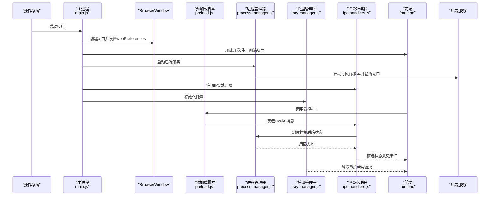
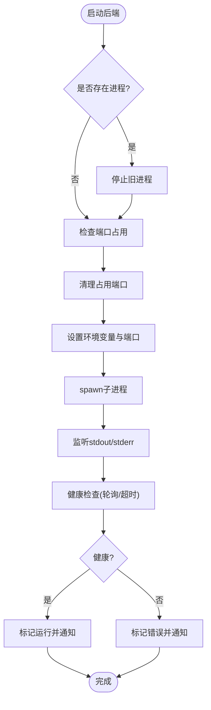
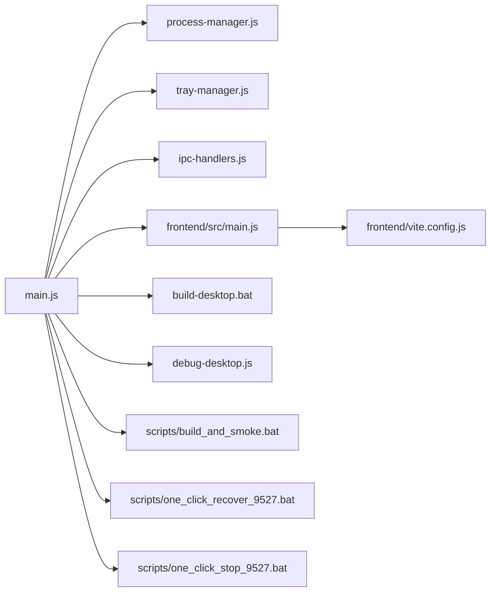

# 桌面应用开发

<cite>
**本文引用的文件**
- [desktop/main.js](file://desktop/main.js)
- [desktop/preload.js](file://desktop/preload.js)
- [desktop/ipc-handlers.js](file://desktop/ipc-handlers.js)
- [desktop/process-manager.js](file://desktop/process-manager.js)
- [desktop/tray-manager.js](file://desktop/tray-manager.js)
- [build-desktop.bat](file://build-desktop.bat)
- [debug-desktop.js](file://debug-desktop.js)
- [scripts/build_and_smoke.bat](file://scripts/build_and_smoke.bat)
- [scripts/one_click_recover_9527.bat](file://scripts/one_click_recover_9527.bat)
- [scripts/one_click_stop_9527.bat](file://scripts/one_click_stop_9527.bat)
- [package.json](file://package.json)
- [frontend/vite.config.js](file://frontend/vite.config.js)
- [frontend/package.json](file://frontend/package.json)
- [start-all.bat](file://start-all.bat)
- [stop.bat](file://stop.bat)
</cite>

## 更新摘要
**所做更改**
- 新增构建脚本自动化流程，包括一键打包和冒烟测试
- 增强进程管理器功能，支持端口冲突检测和自动清理
- 改进错误处理机制，增加前端加载失败的降级页面
- 完善开发工作流程，提供端口清理和健康检查工具
- 扩展IPC通信接口，新增文件选择对话框支持

## 目录
1. [简介](#简介)
2. [项目结构](#项目结构)
3. [核心组件](#核心组件)
4. [架构总览](#架构总览)
5. [组件详解](#组件详解)
6. [依赖关系分析](#依赖关系分析)
7. [性能与稳定性](#性能与稳定性)
8. [调试与故障排除](#调试与故障排除)
9. [打包与分发](#打包与分发)
10. [结论](#结论)

## 简介
本文件面向InkTrace桌面应用的开发与维护，围绕基于Electron的应用架构进行系统化说明，重点覆盖以下方面：
- 主进程与渲染进程的职责划分与协作方式
- IPC（进程间通信）机制的实现与消息处理策略
- 系统托盘集成、菜单管理、窗口管理等UI与系统交互功能
- 进程管理器对后端服务的启动、停止与健康监控
- 预加载脚本的安全策略与API暴露机制
- 跨平台适配（Windows/macOS/Linux）的实现要点
- 打包与分发策略
- 调试方法与故障排除指南
- 权限管理与安全注意事项

## 项目结构
InkTrace桌面应用采用"前端（Vue）+ Electron主进程 + 后端（Python）"的三层架构。Electron负责应用生命周期、窗口与系统交互；前端通过Vite构建并由主进程加载；后端以独立可执行程序或Python脚本形式运行，通过HTTP提供服务。

```mermaid
graph TB
subgraph "桌面应用"
A["Electron主进程<br/>desktop/main.js"]
B["预加载脚本<br/>desktop/preload.js"]
C["IPC处理器<br/>desktop/ipc-handlers.js"]
D["进程管理器<br/>desktop/process-manager.js"]
E["系统托盘管理器<br/>desktop/tray-manager.js"]
F["前端Vue<br/>frontend/src/main.js"]
G["Vite配置<br/>frontend/vite.config.js"]
end
subgraph "后端服务"
H["Python后端<br/>main.py"]
end
subgraph "构建与调试脚本"
I["构建脚本<br/>build-desktop.bat"]
J["诊断脚本<br/>debug-desktop.js"]
K["冒烟测试<br/>scripts/build_and_smoke.bat"]
L["端口恢复<br/>scripts/one_click_recover_9527.bat"]
M["端口清理<br/>scripts/one_click_stop_9527.bat"]
end
A --> B
A --> C
A --> D
A --> E
A --> F
F --> G
A <- --> H
A <- --> I
A <- --> J
A <- --> K
A <- --> L
A <- --> M
```

**图表来源**
- [desktop/main.js:1-222](file://desktop/main.js#L1-L222)
- [desktop/preload.js:1-27](file://desktop/preload.js#L1-L27)
- [desktop/ipc-handlers.js:1-69](file://desktop/ipc-handlers.js#L1-L69)
- [desktop/process-manager.js:1-286](file://desktop/process-manager.js#L1-L286)
- [desktop/tray-manager.js:1-96](file://desktop/tray-manager.js#L1-L96)
- [build-desktop.bat:1-35](file://build-desktop.bat#L1-L35)
- [debug-desktop.js:1-56](file://debug-desktop.js#L1-L56)
- [scripts/build_and_smoke.bat:1-35](file://scripts/build_and_smoke.bat#L1-L35)
- [scripts/one_click_recover_9527.bat:1-36](file://scripts/one_click_recover_9527.bat#L1-L36)
- [scripts/one_click_stop_9527.bat:1-12](file://scripts/one_click_stop_9527.bat#L1-L12)

**章节来源**
- [desktop/main.js:1-222](file://desktop/main.js#L1-L222)
- [frontend/vite.config.js:1-28](file://frontend/vite.config.js#L1-L28)
- [frontend/package.json:1-24](file://frontend/package.json#L1-L24)

## 核心组件
- 主进程（desktop/main.js）
  - 负责创建BrowserWindow、加载前端页面、注册IPC处理器、启动后端进程、设置系统托盘、处理应用生命周期事件
  - 新增前端加载失败降级页面和端口冲突检测功能
- 预加载脚本（desktop/preload.js）
  - 通过contextBridge在渲染进程中暴露受控API，仅暴露必要能力，确保安全隔离
  - 新增文件选择对话框API支持
- IPC处理器（desktop/ipc-handlers.js）
  - 定义主进程侧的IPC接口，处理来自渲染进程的请求，并向渲染进程推送状态变更
  - 新增文件选择对话框处理逻辑
- 进程管理器（desktop/process-manager.js）
  - 管理后端服务的启动、停止、重启、健康检查与状态通知
  - 增强端口冲突检测和自动清理功能，支持Windows平台的PID查找和进程终止
- 系统托盘管理器（desktop/tray-manager.js）
  - 提供托盘图标、上下文菜单、双击显示窗口、重启后端等能力
  - 支持动态状态文本更新
- 前端（frontend）
  - Vue应用，使用Vite开发与构建，开发时通过代理转发到本地后端端口
- 构建与调试脚本
  - 自动化构建脚本，支持一键打包和冒烟测试
  - 端口清理和恢复脚本，确保开发环境整洁

**章节来源**
- [desktop/main.js:1-222](file://desktop/main.js#L1-L222)
- [desktop/preload.js:1-27](file://desktop/preload.js#L1-L27)
- [desktop/ipc-handlers.js:1-69](file://desktop/ipc-handlers.js#L1-L69)
- [desktop/process-manager.js:1-286](file://desktop/process-manager.js#L1-L286)
- [desktop/tray-manager.js:1-96](file://desktop/tray-manager.js#L1-L96)
- [build-desktop.bat:1-35](file://build-desktop.bat#L1-L35)
- [debug-desktop.js:1-56](file://debug-desktop.js#L1-L56)
- [scripts/build_and_smoke.bat:1-35](file://scripts/build_and_smoke.bat#L1-L35)
- [scripts/one_click_recover_9527.bat:1-36](file://scripts/one_click_recover_9527.bat#L1-L36)
- [scripts/one_click_stop_9527.bat:1-12](file://scripts/one_click_stop_9527.bat#L1-L12)

## 架构总览
下图展示桌面应用从启动到运行的关键流程：主进程创建窗口、加载前端、启动后端、建立IPC通道、托盘初始化与状态同步。



**图表来源**
- [desktop/main.js:170-222](file://desktop/main.js#L170-L222)
- [desktop/preload.js:9-27](file://desktop/preload.js#L9-L27)
- [desktop/ipc-handlers.js:9-69](file://desktop/ipc-handlers.js#L9-L69)
- [desktop/process-manager.js:21-108](file://desktop/process-manager.js#L21-L108)
- [desktop/tray-manager.js:16-96](file://desktop/tray-manager.js#L16-L96)

## 组件详解

### 主进程与窗口管理
- 窗口创建与安全配置
  - 关闭Node集成，启用上下文隔离，指定预加载脚本，避免在渲染进程中直接访问Node/Electron API
  - 窗口最小尺寸与背景色优化首屏体验
- 生命周期与事件
  - 应用就绪后先创建窗口再启动后端，保证用户可见反馈
  - 窗口关闭事件改为隐藏而非销毁，配合托盘实现后台运行
  - before-quit阶段统一停止后端与销毁托盘，确保资源释放
- 前端加载策略
  - 开发模式：加载本地Vite开发服务器；生产模式：加载打包后的前端静态文件
  - 若生产模式找不到前端文件，显示带调试信息的错误页，便于定位问题
- 错误处理增强
  - 新增前端加载失败的降级页面，包含详细的调试信息和解决方案
  - 支持动态端口切换，主端口不可用时自动回退到备用端口

**章节来源**
- [desktop/main.js:23-76](file://desktop/main.js#L23-L76)
- [desktop/main.js:78-130](file://desktop/main.js#L78-L130)
- [desktop/main.js:132-150](file://desktop/main.js#L132-L150)
- [desktop/main.js:170-222](file://desktop/main.js#L170-L222)

### 预加载脚本与安全策略
- API暴露范围
  - 通过contextBridge将有限API暴露至window.electronAPI，包括后端状态查询、重启、打开外部链接、显示文件位置、获取版本与路径等
  - 新增文件选择对话框API：selectFile和selectFolder
- 事件监听与清理
  - 提供状态变更事件订阅与移除，避免内存泄漏
- 安全原则
  - 渲染进程无法直接访问Node/Electron全局API，所有敏感操作均通过IPC与主进程协调

**章节来源**
- [desktop/preload.js:9-27](file://desktop/preload.js#L9-L27)

### IPC通信与消息处理
- 请求-响应模型
  - 渲染进程使用ipcRenderer.invoke调用主进程注册的handle函数，主进程返回Promise结果
- 主要消息
  - get-backend-status：查询后端状态（运行/启动中/停止中/错误/已停止）
  - restart-backend：重启后端服务
  - open-external：打开外部链接
  - show-item-in-folder：在文件管理器中显示文件
  - get-app-version、get-app-path：获取应用元数据
  - select-file、select-folder：文件和文件夹选择对话框
- 状态广播
  - 进程管理器状态变化时，主进程向所有窗口广播backend-status-changed事件，前端可实时更新UI

**章节来源**
- [desktop/ipc-handlers.js:9-69](file://desktop/ipc-handlers.js#L9-L69)

### 进程管理器（后端服务）
- 启动流程
  - 支持开发模式（调用系统Python或打包内嵌Python）与生产模式（直接执行可执行文件）
  - 设置环境变量（编码、端口），记录PID，捕获标准输出与错误日志
  - 新增端口冲突检测和自动清理功能
- 健康检查
  - 通过轮询本地HTTP端口的健康接口判断后端可用性，超时则标记为错误
  - 增强超时控制和错误处理
- 停止与重启
  - 先发送SIGTERM优雅退出，超时后强制SIGKILL；支持按原路径与端口重启
- 状态通知
  - 内部维护状态队列，对外提供getStatus与onStatusChange回调
- 端口管理增强
  - Windows平台支持PID查找和进程终止
  - 自动清理占用端口的残留进程



**图表来源**
- [desktop/process-manager.js:21-108](file://desktop/process-manager.js#L21-L108)
- [desktop/process-manager.js:179-224](file://desktop/process-manager.js#L179-L224)
- [desktop/process-manager.js:226-264](file://desktop/process-manager.js#L226-L264)

**章节来源**
- [desktop/process-manager.js:13-286](file://desktop/process-manager.js#L13-L286)

### 系统托盘与菜单管理
- 功能
  - 显示/隐藏主窗口、重启后端服务、退出应用
  - 双击托盘显示窗口
  - 根据后端状态动态更新工具提示文本
- 与主进程交互
  - 通过主进程向渲染进程发送重启请求事件，实现托盘触发的后端重启

**章节来源**
- [desktop/tray-manager.js:16-96](file://desktop/tray-manager.js#L16-L96)

### 前端与代理配置
- 开发代理
  - Vite开发服务器将/api前缀代理到本地后端端口，简化前后端联调
- 构建产物
  - 输出到dist目录，主进程在生产模式下加载该静态文件
- 应用入口
  - Vue应用挂载于#app，引入路由、状态管理与UI库

**章节来源**
- [frontend/vite.config.js:13-27](file://frontend/vite.config.js#L13-L27)

### 构建与调试脚本
- 构建脚本（build-desktop.bat）
  - 自动化前端构建、后端打包和Electron应用打包流程
  - 支持Windows平台的完整构建链
- 诊断脚本（debug-desktop.js）
  - 检查关键文件存在性、验证后端可执行文件可启动
  - 短时运行后端进程观察输出
- 冒烟测试（scripts/build_and_smoke.bat）
  - 一键打包 + 冒烟检查，确保构建质量
  - 自动清理端口残留并验证后端接口
- 端口管理脚本
  - one_click_recover_9527.bat：清理端口、启动后端、健康检查
  - one_click_stop_9527.bat：清理端口9527残留进程

**章节来源**
- [build-desktop.bat:1-35](file://build-desktop.bat#L1-L35)
- [debug-desktop.js:1-56](file://debug-desktop.js#L1-L56)
- [scripts/build_and_smoke.bat:1-35](file://scripts/build_and_smoke.bat#L1-L35)
- [scripts/one_click_recover_9527.bat:1-36](file://scripts/one_click_recover_9527.bat#L1-L36)
- [scripts/one_click_stop_9527.bat:1-12](file://scripts/one_click_stop_9527.bat#L1-L12)

## 依赖关系分析
- 主进程依赖
  - 进程管理器：用于启动/停止/重启后端服务
  - 托盘管理器：提供系统托盘与菜单
  - IPC处理器：定义并注册IPC接口
- 预加载脚本依赖
  - 仅依赖ipcRenderer与contextBridge，暴露受控API
- 前端依赖
  - Vue生态与Element Plus，开发时通过Vite代理访问后端
- 脚本依赖
  - 构建脚本：npm、pyinstaller、electron-builder
  - 调试脚本：Node.js child_process模块



**图表来源**
- [desktop/main.js:7-11](file://desktop/main.js#L7-L11)
- [desktop/ipc-handlers.js:7](file://desktop/ipc-handlers.js#L7)
- [desktop/process-manager.js:7-11](file://desktop/process-manager.js#L7-L11)
- [desktop/tray-manager.js:7](file://desktop/tray-manager.js#L7)
- [frontend/src/main.js:12-22](file://frontend/src/main.js#L12-L22)
- [frontend/vite.config.js:13-27](file://frontend/vite.config.js#L13-L27)
- [build-desktop.bat:10-27](file://build-desktop.bat#L10-L27)
- [debug-desktop.js:6-8](file://debug-desktop.js#L6-L8)
- [scripts/build_and_smoke.bat:11-12](file://scripts/build_and_smoke.bat#L11-L12)
- [scripts/one_click_recover_9527.bat:21-22](file://scripts/one_click_recover_9527.bat#L21-L22)
- [scripts/one_click_stop_9527.bat:5-9](file://scripts/one_click_stop_9527.bat#L5-L9)

**章节来源**
- [desktop/main.js:7-11](file://desktop/main.js#L7-L11)
- [desktop/ipc-handlers.js:7](file://desktop/ipc-handlers.js#L7)
- [desktop/process-manager.js:7-11](file://desktop/process-manager.js#L7-L11)
- [desktop/tray-manager.js:7](file://desktop/tray-manager.js#L7)
- [frontend/src/main.js:12-22](file://frontend/src/main.js#L12-L22)
- [frontend/vite.config.js:13-27](file://frontend/vite.config.js#L13-L27)
- [build-desktop.bat:10-27](file://build-desktop.bat#L10-L27)
- [debug-desktop.js:6-8](file://debug-desktop.js#L6-L8)
- [scripts/build_and_smoke.bat:11-12](file://scripts/build_and_smoke.bat#L11-L12)
- [scripts/one_click_recover_9527.bat:21-22](file://scripts/one_click_recover_9527.bat#L21-L22)
- [scripts/one_click_stop_9527.bat:5-9](file://scripts/one_click_stop_9527.bat#L5-L9)

## 性能与稳定性
- 首屏体验
  - 窗口创建即显示，减少白屏时间；生产模式下若前端文件缺失，快速降级为错误页并打印调试信息
  - 新增动态端口切换机制，提高启动成功率
- 后端健康检查
  - 通过定时轮询与超时控制，避免长时间阻塞；错误状态及时上报，便于前端与托盘提示
  - 增强超时时间和错误处理逻辑
- 进程优雅退出
  - 先SIGTERM，超时后SIGKILL，防止僵尸进程；退出回调中重置状态与监听器
- 资源释放
  - before-quit阶段统一停止后端与销毁托盘，避免资源泄露
- 端口管理
  - Windows平台支持PID查找和进程终止，自动清理占用端口的残留进程
  - 端口冲突检测和回退机制

**章节来源**
- [desktop/main.js:23-76](file://desktop/main.js#L23-L76)
- [desktop/main.js:132-150](file://desktop/main.js#L132-L150)
- [desktop/process-manager.js:110-135](file://desktop/process-manager.js#L110-L135)
- [desktop/process-manager.js:179-224](file://desktop/process-manager.js#L179-L224)
- [desktop/process-manager.js:226-264](file://desktop/process-manager.js#L226-L264)
- [desktop/main.js:209-218](file://desktop/main.js#L209-L218)

## 调试与故障排除
- 诊断脚本
  - 检查关键文件是否存在、验证后端可执行文件是否可启动、短时运行后端进程以观察输出
  - 新增构建产物检查和后端可执行文件验证
- 常见问题定位
  - 前端加载失败：查看生产模式下前端文件路径与存在性，关注错误页中的调试信息
  - 后端启动失败：检查后端可执行文件路径、端口占用、Python环境与依赖
  - 托盘无响应：确认托盘菜单项与事件绑定，以及主进程向渲染进程发送重启请求的通道
  - 端口冲突：使用端口清理脚本解决残留进程占用问题
- 手动启停
  - 使用批处理脚本一键启动/停止后端服务，便于独立排查后端问题
  - start-all.bat：一键启动后端和前端服务
  - stop.bat：停止运行在9527端口的服务
- 冒烟测试
  - scripts/build_and_smoke.bat：完整的打包和健康检查流程
  - one_click_recover_9527.bat：端口清理、后端启动和接口验证

**章节来源**
- [debug-desktop.js:10-56](file://debug-desktop.js#L10-L56)
- [scripts/build_and_smoke.bat:1-35](file://scripts/build_and_smoke.bat#L1-L35)
- [scripts/one_click_recover_9527.bat:1-36](file://scripts/one_click_recover_9527.bat#L1-L36)
- [scripts/one_click_stop_9527.bat:1-12](file://scripts/one_click_stop_9527.bat#L1-L12)
- [start-all.bat:1-50](file://start-all.bat#L1-L50)
- [stop.bat:1-31](file://stop.bat#L1-L31)

## 打包与分发
- 构建流程
  - 前端构建：在frontend目录执行npm run build生成dist
  - 后端打包：使用PyInstaller将Python入口打包为单文件可执行程序
  - Electron应用：使用electron-builder进行多平台打包
- 配置要点
  - electron-builder配置了不同平台目标（Windows NSIS、macOS DMG、Linux AppImage），并声明额外资源（backend与frontend/dist）随应用一起分发
  - Windows安装器选项允许自定义安装目录、创建桌面/开始菜单快捷方式
  - 新增构建脚本自动化整个流程
- 批处理脚本
  - build-desktop.bat整合前端构建、后端打包与Electron打包的完整流程，输出至dist目录
  - scripts/build_and_smoke.bat：一键打包 + 冒烟测试，确保构建质量

**章节来源**
- [package.json:8-81](file://package.json#L8-L81)
- [build-desktop.bat:1-35](file://build-desktop.bat#L1-L35)
- [scripts/build_and_smoke.bat:1-35](file://scripts/build_and_smoke.bat#L1-L35)

## 结论
InkTrace桌面应用通过清晰的主/渲染进程分离、严格的预加载安全策略、完善的IPC通信与托盘交互、稳健的后端进程管理，实现了跨平台的稳定运行。新增的构建脚本和增强的进程管理功能进一步提升了开发效率和用户体验。

结合完善的打包配置、诊断脚本和端口管理工具，开发者可以高效地进行迭代与运维。建议在后续版本中进一步增强：
- 对异常状态的可视化提示与重试策略
- 更细粒度的日志采集与上报
- 平台特定的权限与沙箱配置（如macOS Gatekeeper、Windows SmartScreen）
- 自动化测试覆盖率和持续集成流程
- 更丰富的调试工具和性能监控功能

**章节来源**
- [desktop/main.js:1-222](file://desktop/main.js#L1-L222)
- [desktop/process-manager.js:1-286](file://desktop/process-manager.js#L1-L286)
- [build-desktop.bat:1-35](file://build-desktop.bat#L1-L35)
- [scripts/build_and_smoke.bat:1-35](file://scripts/build_and_smoke.bat#L1-L35)