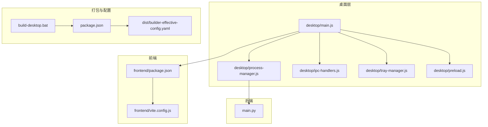
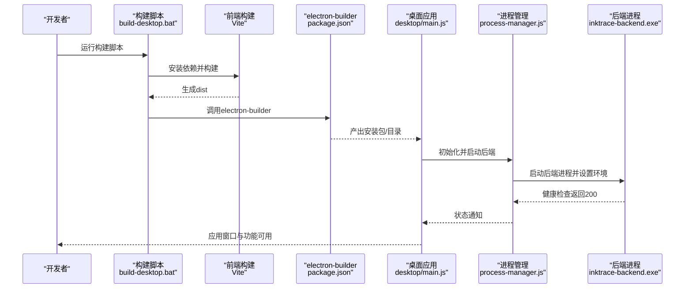
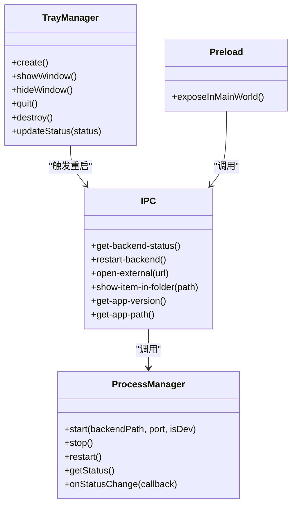
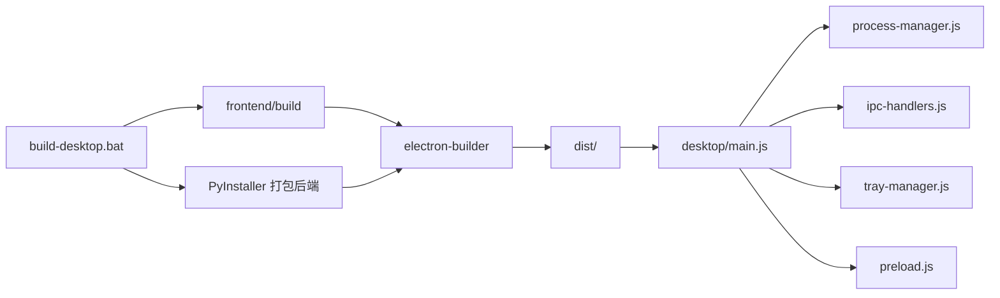

# 桌面应用打包

<cite>
**本文引用的文件**
- [package.json](file://package.json)
- [build-desktop.bat](file://build-desktop.bat)
- [debug-desktop.js](file://debug-desktop.js)
- [dist/builder-effective-config.yaml](file://dist/builder-effective-config.yaml)
- [desktop/main.js](file://desktop/main.js)
- [desktop/preload.js](file://desktop/preload.js)
- [desktop/process-manager.js](file://desktop/process-manager.js)
- [desktop/ipc-handlers.js](file://desktop/ipc-handlers.js)
- [desktop/tray-manager.js](file://desktop/tray-manager.js)
- [frontend/package.json](file://frontend/package.json)
- [frontend/vite.config.js](file://frontend/vite.config.js)
</cite>

## 目录
1. [简介](#简介)
2. [项目结构](#项目结构)
3. [核心组件](#核心组件)
4. [架构总览](#架构总览)
5. [详细组件分析](#详细组件分析)
6. [依赖关系分析](#依赖关系分析)
7. [性能与体积优化](#性能与体积优化)
8. [故障排查指南](#故障排查指南)
9. [结论](#结论)
10. [附录](#附录)

## 简介
本文件面向InkTrace桌面应用的打包与发布，围绕Electron应用的打包流程、配置项、跨平台构建命令、资源打包策略（含asar与额外资源）、签名与公证（macOS）、安装包体积优化、自动更新机制、CI/CD自动化打包、调试与发布版本差异、常见问题排查以及应用商店分发准备等主题进行系统化说明。文档以仓库现有配置与代码为依据，结合实际打包产物与运行时行为，提供可操作的实践建议。

## 项目结构
InkTrace采用前后端分离的桌面应用架构：前端使用Vite+Vue，后端为独立的Python可执行程序；桌面层通过Electron主进程启动后端进程、加载前端页面，并通过IPC进行交互。打包配置集中在根目录的package.json与electron-builder配置中，构建脚本位于build-desktop.bat。

图表来源
- [desktop/main.js:1-213](file://desktop/main.js#L1-L213)
- [desktop/process-manager.js:1-218](file://desktop/process-manager.js#L1-L218)
- [desktop/ipc-handlers.js:1-50](file://desktop/ipc-handlers.js#L1-L50)
- [desktop/tray-manager.js:1-96](file://desktop/tray-manager.js#L1-L96)
- [desktop/preload.js:1-25](file://desktop/preload.js#L1-L25)
- [frontend/package.json:1-24](file://frontend/package.json#L1-L24)
- [frontend/vite.config.js:1-28](file://frontend/vite.config.js#L1-L28)
- [package.json:1-81](file://package.json#L1-L81)
- [dist/builder-effective-config.yaml:1-42](file://dist/builder-effective-config.yaml#L1-L42)
- [build-desktop.bat:1-35](file://build-desktop.bat#L1-L35)

章节来源
- [package.json:1-81](file://package.json#L1-L81)
- [build-desktop.bat:1-35](file://build-desktop.bat#L1-L35)
- [frontend/package.json:1-24](file://frontend/package.json#L1-L24)
- [frontend/vite.config.js:1-28](file://frontend/vite.config.js#L1-L28)
- [desktop/main.js:1-213](file://desktop/main.js#L1-L213)
- [desktop/process-manager.js:1-218](file://desktop/process-manager.js#L1-L218)
- [desktop/ipc-handlers.js:1-50](file://desktop/ipc-handlers.js#L1-L50)
- [desktop/tray-manager.js:1-96](file://desktop/tray-manager.js#L1-L96)
- [desktop/preload.js:1-25](file://desktop/preload.js#L1-L25)
- [dist/builder-effective-config.yaml:1-42](file://dist/builder-effective-config.yaml#L1-L42)

## 核心组件
- 打包与构建脚本
  - 根package.json定义了electron-builder脚本与平台目标，以及files与extraResources等打包规则。
  - build-desktop.bat负责顺序执行：前端构建、依赖安装、PyInstaller打包后端、调用electron-builder进行桌面应用打包。
- 主进程与运行时
  - desktop/main.js负责创建窗口、加载前端、启动后端进程、托盘与IPC注册。
  - desktop/process-manager.js负责后端进程生命周期管理、环境变量注入、健康检查与超时控制。
  - desktop/ipc-handlers.js提供后端状态查询、重启、外部链接打开、文件夹定位等IPC接口。
  - desktop/preload.js通过contextBridge暴露受控API给渲染进程。
  - desktop/tray-manager.js提供系统托盘菜单与状态提示。
- 前端构建
  - frontend/package.json与frontend/vite.config.js定义了开发服务器、代理、构建输出目录等。

章节来源
- [package.json:8-15](file://package.json#L8-L15)
- [package.json:20-76](file://package.json#L20-L76)
- [build-desktop.bat:10-27](file://build-desktop.bat#L10-L27)
- [desktop/main.js:13-74](file://desktop/main.js#L13-L74)
- [desktop/process-manager.js:21-102](file://desktop/process-manager.js#L21-L102)
- [desktop/ipc-handlers.js:9-47](file://desktop/ipc-handlers.js#L9-L47)
- [desktop/preload.js:9-24](file://desktop/preload.js#L9-L24)
- [desktop/tray-manager.js:16-92](file://desktop/tray-manager.js#L16-L92)
- [frontend/package.json:6-10](file://frontend/package.json#L6-L10)
- [frontend/vite.config.js:5-27](file://frontend/vite.config.js#L5-L27)

## 架构总览
下图展示了从构建到运行的关键流程：前端构建产物被嵌入到桌面应用资源中；electron-builder根据配置复制后端二进制与模板数据；主进程在运行时加载前端页面并启动后端进程，二者通过HTTP与IPC交互。

图表来源
- [build-desktop.bat:10-27](file://build-desktop.bat#L10-L27)
- [frontend/vite.config.js:22-26](file://frontend/vite.config.js#L22-L26)
- [package.json:10-14](file://package.json#L10-L14)
- [desktop/main.js:130-141](file://desktop/main.js#L130-L141)
- [desktop/process-manager.js:30-101](file://desktop/process-manager.js#L30-L101)

## 详细组件分析

### 打包配置与平台目标
- appId与产品名：用于标识应用与安装目录命名。
- 输出目录：dist。
- 文件包含规则：desktop/**/*、data/**/*、infrastructure/templates/**/*。
- 额外资源：backend目录整体复制到resources/backend；frontend/dist复制到resources/frontend。
- 平台目标：
  - Windows：NSIS安装包（x64），启用桌面/开始菜单快捷方式。
  - macOS：DMG镜像。
  - Linux：AppImage。
- 图标：Windows使用ico，macOS使用icns，Linux使用目录图标集。

章节来源
- [package.json:20-76](file://package.json#L20-L76)
- [dist/builder-effective-config.yaml:1-42](file://dist/builder-effective-config.yaml#L1-L42)

### 跨平台构建命令与参数
- 统一构建：npm run build（调用electron-builder）。
- 指定平台：
  - Windows：npm run build:win
  - macOS：npm run build:mac
  - Linux：npm run build:linux
- 开发预览：npm run pack（输出到目录，便于本地验证）。

章节来源
- [package.json:8-15](file://package.json#L8-L15)

### asar打包格式选择与策略
- 当前配置未显式指定asar，因此默认使用asar打包（electron-builder默认行为）。asar会将应用资源打包为单一文件，提升加载性能并简化分发。
- 若需禁用asar，可在构建配置中添加相应字段（例如asar: false）。
- 对于需要频繁读写的动态数据或日志，建议将其放置在用户数据目录而非asar内，避免权限与更新问题。

章节来源
- [package.json:20-76](file://package.json#L20-L76)
- [dist/builder-effective-config.yaml:1-42](file://dist/builder-effective-config.yaml#L1-L42)

### 应用签名与公证（macOS）
- 当前仓库未提供macOS签名与公证配置片段。若要发布到Mac App Store或经公证的DMG，请在构建配置中补充以下要点：
  - entitlements.mac.plist与entitlements.common.plst（权限声明）。
  - hardened-runtime与signing-style。
  - 权限证书与团队ID配置。
- 注意：未完成签名与公证的应用在某些安全策略下可能无法正常运行或被系统拦截。

章节来源
- [package.json:68-71](file://package.json#L68-L71)

### 安装包体积优化与资源压缩
- 前端资源：Vite默认开启代码分割与压缩，确保生产构建开启。
- 后端二进制：PyInstaller已按单文件打包，减少体积与部署复杂度。
- 资源剔除：通过files与extraResources精确控制打包内容，避免冗余数据进入安装包。
- 可选策略：
  - 使用electron-builder的extraFiles或extraResources排除非必要模板或数据。
  - 在Windows上考虑使用7z压缩（需在构建配置中启用）。
  - 将大型资源移至首次启动时下载，降低首包体积。

章节来源
- [frontend/vite.config.js:22-26](file://frontend/vite.config.js#L22-L26)
- [build-desktop.bat:22-23](file://build-desktop.bat#L22-L23)
- [package.json:26-46](file://package.json#L26-L46)

### 自动更新机制实现与配置
- 仓库未提供自动更新相关配置或实现代码。若需集成自动更新，建议：
  - electron-updater或基于GitHub Releases/自建更新服务器。
  - 在构建配置中设置publish条目（如github、s3等）。
  - 在主进程中初始化更新逻辑并在UI中提示更新。
- 注意：自动更新需配合签名与版本号管理，确保安全与一致性。

章节来源
- [package.json:20-76](file://package.json#L20-L76)
- [desktop/main.js:161-186](file://desktop/main.js#L161-L186)

### CI/CD自动化打包方案
- 建议流水线步骤：
  - 安装Node与Python依赖。
  - 前端构建（Vite）。
  - PyInstaller打包后端。
  - electron-builder多平台构建（并行任务更优）。
  - 产物归档与上传（Artifacts/Release）。
- 平台特定注意事项：
  - Windows：确保有管理员权限与签名证书（如需）。
  - macOS：具备Developer ID证书与公证权限。
  - Linux：AppImage无需签名但建议校验完整性。

章节来源
- [build-desktop.bat:10-27](file://build-desktop.bat#L10-L27)
- [package.json:10-14](file://package.json#L10-L14)

### 调试版本与发布版本差异
- 开发模式判断：通过app.isPackaged与NODE_ENV判定。
- 开发模式：
  - 前端加载本地开发服务器（http://localhost:3000）。
  - 后端指向Python源文件。
- 发布模式：
  - 前端加载resourcesPath下的打包HTML。
  - 后端指向resources/backend下的可执行文件。
- 错误页：当发布模式下找不到前端资源时，主进程会加载内置错误页并输出调试信息。

章节来源
- [desktop/main.js:13-13](file://desktop/main.js#L13-L13)
- [desktop/main.js:53-73](file://desktop/main.js#L53-L73)
- [desktop/main.js:133-135](file://desktop/main.js#L133-L135)

### IPC与进程管理
- 预加载桥接：preload.js通过contextBridge暴露有限API，避免直接暴露Node能力。
- IPC处理器：提供后端状态查询、重启、外部链接打开、文件夹定位、应用版本与路径查询。
- 进程管理：ProcessManager负责后端进程启动、环境变量注入、健康检查与优雅停止，支持超时与错误通知。

图表来源
- [desktop/process-manager.js:13-218](file://desktop/process-manager.js#L13-L218)
- [desktop/tray-manager.js:9-96](file://desktop/tray-manager.js#L9-L96)
- [desktop/ipc-handlers.js:9-47](file://desktop/ipc-handlers.js#L9-L47)
- [desktop/preload.js:9-24](file://desktop/preload.js#L9-L24)

章节来源
- [desktop/ipc-handlers.js:9-47](file://desktop/ipc-handlers.js#L9-L47)
- [desktop/preload.js:9-24](file://desktop/preload.js#L9-L24)
- [desktop/process-manager.js:21-102](file://desktop/process-manager.js#L21-L102)
- [desktop/tray-manager.js:16-92](file://desktop/tray-manager.js#L16-L92)

## 依赖关系分析
- 构建链路：build-desktop.bat → 前端构建 → PyInstaller → electron-builder → 产物dist。
- 运行链路：desktop/main.js → preload.js → IPC → process-manager.js → 后端进程 → 健康检查 → 托盘与窗口交互。

图表来源
- [build-desktop.bat:10-27](file://build-desktop.bat#L10-L27)
- [frontend/vite.config.js:22-26](file://frontend/vite.config.js#L22-L26)
- [package.json:10-14](file://package.json#L10-L14)
- [desktop/main.js:130-141](file://desktop/main.js#L130-L141)

章节来源
- [build-desktop.bat:10-27](file://build-desktop.bat#L10-L27)
- [frontend/vite.config.js:22-26](file://frontend/vite.config.js#L22-L26)
- [package.json:10-14](file://package.json#L10-L14)
- [desktop/main.js:130-141](file://desktop/main.js#L130-L141)

## 性能与体积优化
- 前端构建：确保生产模式开启压缩与Tree-shaking。
- 后端二进制：单文件部署减少IO与路径问题。
- 资源打包：仅包含必要文件，避免模板与数据冗余。
- 运行时优化：主进程先创建窗口再启动后端，缩短用户等待时间；健康检查与超时控制保证稳定性。

章节来源
- [frontend/vite.config.js:22-26](file://frontend/vite.config.js#L22-L26)
- [build-desktop.bat:22-23](file://build-desktop.bat#L22-L23)
- [desktop/main.js:161-186](file://desktop/main.js#L161-L186)
- [desktop/process-manager.js:173-214](file://desktop/process-manager.js#L173-L214)

## 故障排查指南
- 常见问题与定位
  - 前端资源缺失：发布模式下找不到resourcesPath下的前端文件时，主进程会加载内置错误页并打印调试信息。可通过错误页中的路径与打包状态定位问题。
  - 后端启动失败：检查resources/backend下的可执行文件是否存在、权限是否正确、依赖库是否齐全。
  - 健康检查超时：后端进程启动慢或端口占用可能导致超时，可适当延长等待时间或检查日志。
- 诊断脚本
  - debug-desktop.js会检查关键文件是否存在，并尝试启动后端可执行文件以验证其可运行性。
- 建议排查步骤
  - 确认dist/win-unpacked中包含InkTrace.exe、app.asar与backend目录。
  - 在开发模式下确认前端本地服务可访问。
  - 查看主进程控制台与后端stderr输出。

章节来源
- [desktop/main.js:76-128](file://desktop/main.js#L76-L128)
- [desktop/main.js:130-141](file://desktop/main.js#L130-L141)
- [debug-desktop.js:12-54](file://debug-desktop.js#L12-L54)

## 结论
InkTrace桌面应用的打包体系以electron-builder为核心，结合Vite前端构建与PyInstaller后端打包，形成完整的跨平台发布流程。当前配置默认启用asar，平台目标覆盖Windows、macOS与Linux。为进一步完善发布质量，建议补充自动更新配置、macOS签名与公证、CI/CD流水线标准化以及应用商店分发所需的元数据与合规检查。

## 附录

### 平台构建命令速查
- Windows：npm run build:win
- macOS：npm run build:mac
- Linux：npm run build:linux
- 开发预览：npm run pack

章节来源
- [package.json:10-14](file://package.json#L10-L14)

### 关键配置清单
- 应用标识与名称：appId、productName
- 输出目录：directories.output
- 打包文件列表：files
- 额外资源：extraResources（backend、frontend）
- 平台目标与图标：win/mac/linux
- NSIS安装器参数：oneClick、快捷方式等

章节来源
- [package.json:20-76](file://package.json#L20-L76)
- [dist/builder-effective-config.yaml:1-42](file://dist/builder-effective-config.yaml#L1-L42)