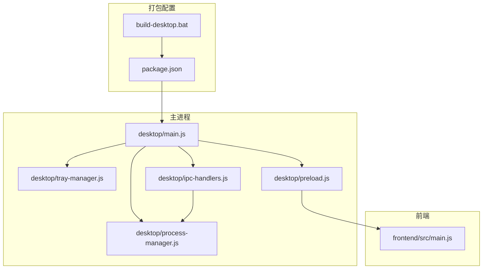
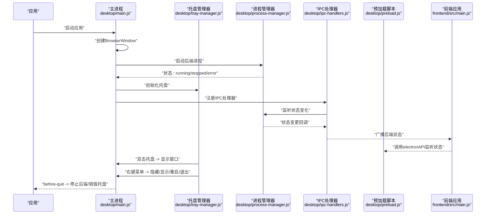
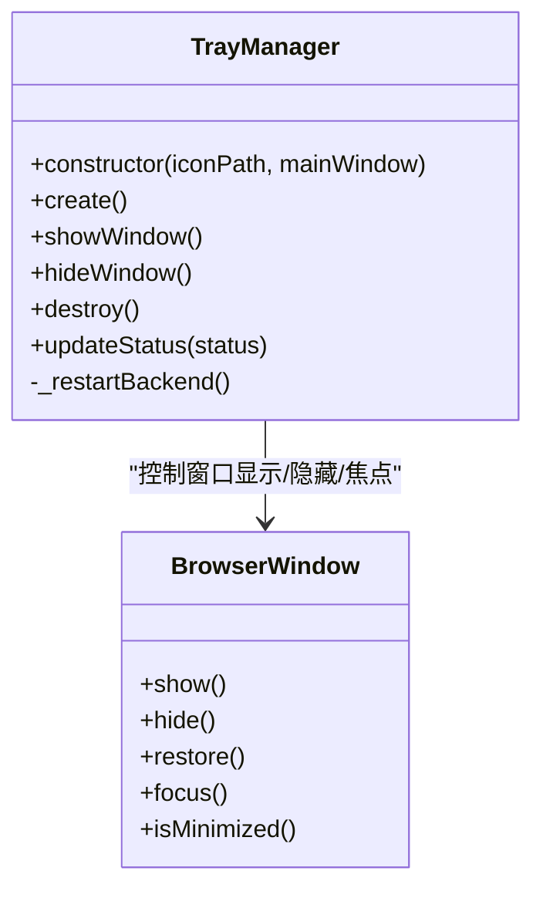
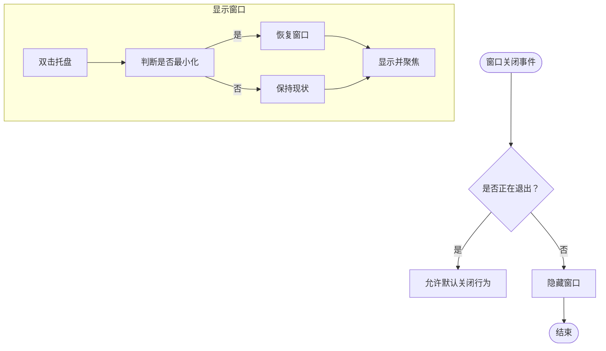
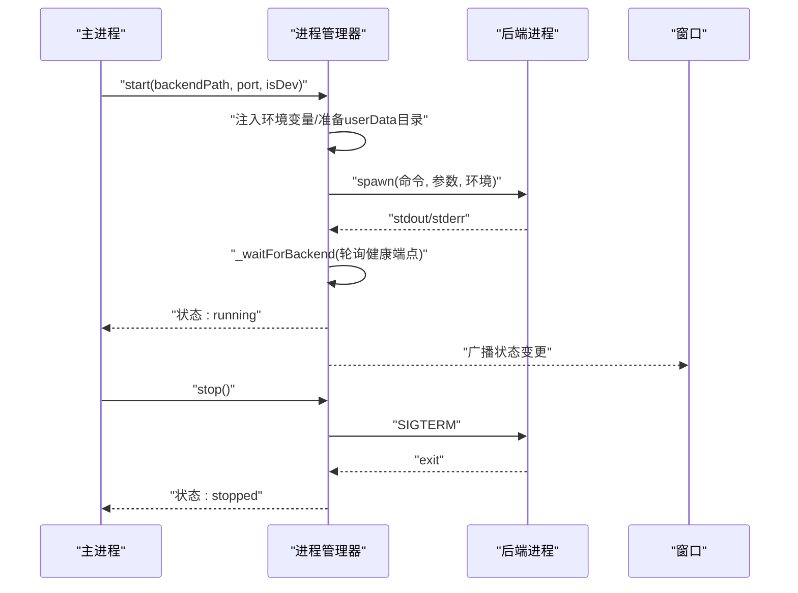
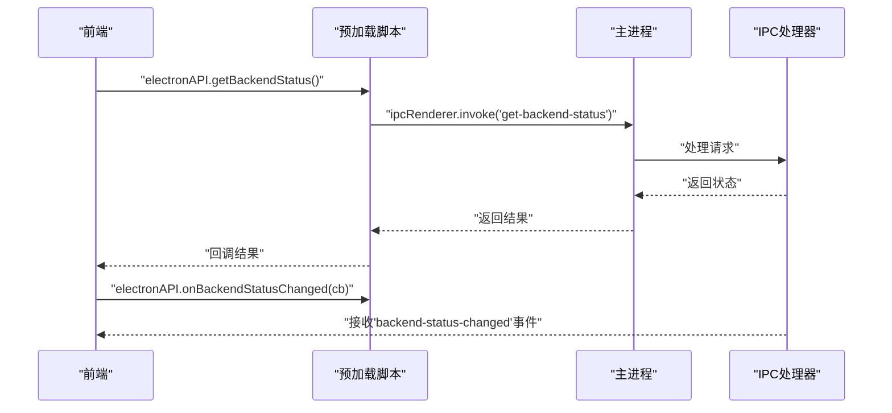
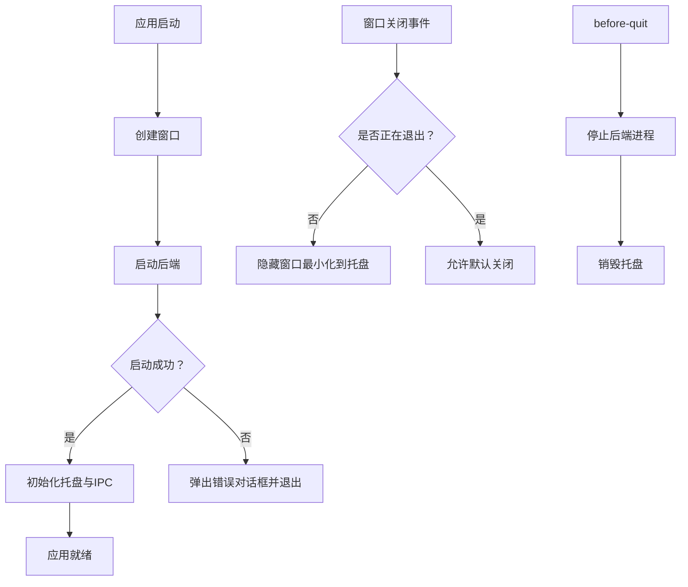
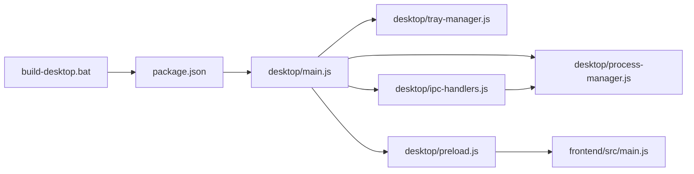

# 系统集成功能

<cite>
**本文引用的文件**
- [desktop/main.js](file://desktop/main.js)
- [desktop/tray-manager.js](file://desktop/tray-manager.js)
- [desktop/preload.js](file://desktop/preload.js)
- [desktop/ipc-handlers.js](file://desktop/ipc-handlers.js)
- [desktop/process-manager.js](file://desktop/process-manager.js)
- [package.json](file://package.json)
- [build-desktop.bat](file://build-desktop.bat)
- [frontend/src/main.js](file://frontend/src/main.js)
</cite>

## 目录
1. [简介](#简介)
2. [项目结构](#项目结构)
3. [核心组件](#核心组件)
4. [架构总览](#架构总览)
5. [详细组件分析](#详细组件分析)
6. [依赖关系分析](#依赖关系分析)
7. [性能考虑](#性能考虑)
8. [故障排查指南](#故障排查指南)
9. [结论](#结论)
10. [附录](#附录)

## 简介
本文件面向InkTrace项目的系统集成功能，聚焦桌面端（Electron）的系统托盘、窗口显示/隐藏控制、后端进程管理、IPC通信、以及跨平台打包与部署等关键能力。文档在不展示具体代码的前提下，通过源码路径定位与图示化方式，帮助开发者与非技术读者理解系统如何在不同平台上协同工作。

## 项目结构
InkTrace桌面端采用“主进程 + 预加载脚本 + 前端界面”的典型Electron架构：
- 主进程负责窗口创建、托盘初始化、后端进程生命周期管理、应用事件处理。
- 预加载脚本通过contextBridge向渲染进程暴露安全的API桥接。
- 渲染进程（前端Vue应用）通过IPC与主进程交互，实现状态同步与控制。

**图表来源**
- [desktop/main.js:1-213](file://desktop/main.js#L1-L213)
- [desktop/process-manager.js:1-218](file://desktop/process-manager.js#L1-L218)
- [desktop/tray-manager.js:1-96](file://desktop/tray-manager.js#L1-L96)
- [desktop/ipc-handlers.js:1-50](file://desktop/ipc-handlers.js#L1-L50)
- [desktop/preload.js:1-25](file://desktop/preload.js#L1-L25)
- [package.json:1-81](file://package.json#L1-L81)
- [build-desktop.bat:1-35](file://build-desktop.bat#L1-L35)
- [frontend/src/main.js:1-23](file://frontend/src/main.js#L1-L23)

**章节来源**
- [desktop/main.js:1-213](file://desktop/main.js#L1-L213)
- [package.json:1-81](file://package.json#L1-L81)
- [build-desktop.bat:1-35](file://build-desktop.bat#L1-L35)
- [frontend/src/main.js:1-23](file://frontend/src/main.js#L1-L23)

## 核心组件
- 主进程入口与窗口管理：负责创建BrowserWindow、窗口关闭事件拦截（最小化到托盘）、加载前端资源、错误页展示、应用生命周期事件。
- 托盘管理器：负责托盘图标、右键菜单、双击行为、状态提示文本更新、后端重启请求转发。
- 进程管理器：负责Python后端可执行程序的启动/停止/重启、健康检查、状态广播、环境变量注入。
- IPC处理器：提供后端状态查询、重启后端、打开外部链接、显示文件所在位置、获取应用版本/路径等接口，并在状态变化时广播给所有窗口。
- 预加载脚本：通过contextBridge暴露受控API给渲染进程，供前端调用并监听后端状态变更。
- 打包与跨平台：使用electron-builder进行多平台打包，配置NSIS（Windows）、DMG（macOS）、AppImage（Linux）目标及快捷方式。

**章节来源**
- [desktop/main.js:21-74](file://desktop/main.js#L21-L74)
- [desktop/main.js:143-149](file://desktop/main.js#L143-L149)
- [desktop/tray-manager.js:9-96](file://desktop/tray-manager.js#L9-L96)
- [desktop/process-manager.js:13-218](file://desktop/process-manager.js#L13-L218)
- [desktop/ipc-handlers.js:9-47](file://desktop/ipc-handlers.js#L9-L47)
- [desktop/preload.js:9-24](file://desktop/preload.js#L9-L24)
- [package.json:20-76](file://package.json#L20-L76)

## 架构总览
下图展示了从应用启动到托盘与后端交互的关键流程：

**图表来源**
- [desktop/main.js:161-209](file://desktop/main.js#L161-L209)
- [desktop/tray-manager.js:16-48](file://desktop/tray-manager.js#L16-L48)
- [desktop/process-manager.js:21-102](file://desktop/process-manager.js#L21-L102)
- [desktop/ipc-handlers.js:9-47](file://desktop/ipc-handlers.js#L9-L47)
- [desktop/preload.js:9-24](file://desktop/preload.js#L9-L24)
- [frontend/src/main.js:12-23](file://frontend/src/main.js#L12-L23)

## 详细组件分析

### 系统托盘实现
- 托盘图标与工具提示：使用本地图标文件创建托盘实例，并设置默认工具提示文本；根据后端状态动态更新提示文本。
- 右键菜单：包含“显示主窗口”“隐藏主窗口”“重启后端服务”“退出”等项；双击托盘默认显示主窗口。
- 状态同步：托盘状态文本随后端状态变化而更新，便于用户直观感知后端运行状况。

**图表来源**
- [desktop/tray-manager.js:9-96](file://desktop/tray-manager.js#L9-L96)
- [desktop/main.js:40-49](file://desktop/main.js#L40-L49)

**章节来源**
- [desktop/tray-manager.js:16-48](file://desktop/tray-manager.js#L16-L48)
- [desktop/tray-manager.js:78-86](file://desktop/tray-manager.js#L78-L86)

### 窗口显示/隐藏与最小化到托盘
- 关闭事件拦截：当用户尝试关闭窗口时，若非应用主动退出，则阻止默认关闭行为并隐藏窗口，实现“最小化到托盘”效果。
- 激活事件：在macOS等平台上，当无活动窗口时触发激活事件，重新创建窗口。
- 焦点管理：显示窗口时确保窗口处于前台并获得焦点。

**图表来源**
- [desktop/main.js:40-49](file://desktop/main.js#L40-L49)
- [desktop/tray-manager.js:50-58](file://desktop/tray-manager.js#L50-L58)

**章节来源**
- [desktop/main.js:40-49](file://desktop/main.js#L40-L49)
- [desktop/main.js:194-198](file://desktop/main.js#L194-L198)
- [desktop/tray-manager.js:50-58](file://desktop/tray-manager.js#L50-L58)

### 后端进程管理与健康检查
- 启动流程：根据开发/生产模式选择不同的后端可执行文件或Python入口；注入必要的环境变量（端口、数据库路径、日志开关等）；启动子进程并监听标准输出/错误。
- 健康检查：通过轮询HTTP健康端点确认后端可用；超时则标记为错误状态。
- 状态广播：状态变化时通过IPC广播给所有窗口，前端可据此更新UI与提示。
- 重启与停止：提供重启与优雅停止（SIGTERM + 超时强制终止）策略。

**图表来源**
- [desktop/process-manager.js:21-102](file://desktop/process-manager.js#L21-L102)
- [desktop/process-manager.js:173-214](file://desktop/process-manager.js#L173-L214)
- [desktop/ipc-handlers.js:41-46](file://desktop/ipc-handlers.js#L41-L46)

**章节来源**
- [desktop/process-manager.js:21-102](file://desktop/process-manager.js#L21-L102)
- [desktop/process-manager.js:173-214](file://desktop/process-manager.js#L173-L214)
- [desktop/ipc-handlers.js:41-46](file://desktop/ipc-handlers.js#L41-L46)

### IPC通信与前后端协作
- 主进程侧：注册多个IPC处理函数，包括后端状态查询、重启后端、打开外部链接、显示文件所在位置、获取应用版本/路径等；并在状态变化时广播消息。
- 预加载脚本：通过contextBridge暴露API给渲染进程，前端可通过invoke调用主进程方法，通过on监听状态变更。
- 前端侧：通过electronAPI监听后端状态变化，用于UI提示与交互反馈。

**图表来源**
- [desktop/preload.js:9-24](file://desktop/preload.js#L9-L24)
- [desktop/ipc-handlers.js:9-47](file://desktop/ipc-handlers.js#L9-L47)

**章节来源**
- [desktop/preload.js:9-24](file://desktop/preload.js#L9-L24)
- [desktop/ipc-handlers.js:9-47](file://desktop/ipc-handlers.js#L9-L47)

### 应用启动与错误处理
- 启动顺序：先创建窗口（直接显示），再启动后端，最后初始化托盘与IPC；异常时弹出错误对话框并退出。
- 错误页：当前端资源加载失败时，主进程加载内嵌HTML错误页，展示调试信息与解决方案。
- 退出流程：before-quit阶段设置退出标志、停止后端进程、销毁托盘，确保资源释放。

**图表来源**
- [desktop/main.js:161-209](file://desktop/main.js#L161-L209)
- [desktop/main.js:76-128](file://desktop/main.js#L76-L128)

**章节来源**
- [desktop/main.js:161-209](file://desktop/main.js#L161-L209)
- [desktop/main.js:76-128](file://desktop/main.js#L76-L128)

### 跨平台系统集成功能与差异处理
- Windows：NSIS安装器、桌面/开始菜单快捷方式、.ico图标；打包目标为nsis/x64。
- macOS：DMG镜像、.icns图标。
- Linux：AppImage、通用图标目录。
- 打包脚本：自动化构建前端、安装PyInstaller并打包后端、调用electron-builder进行平台化打包。

**章节来源**
- [package.json:47-76](file://package.json#L47-L76)
- [build-desktop.bat:10-27](file://build-desktop.bat#L10-L27)

### 系统通知与自定义
- 当前代码库未发现显式的系统通知API调用（如Notification）。若需扩展，可在主进程使用Electron的系统通知API，并通过IPC向渲染进程推送通知事件。

### 快捷键注册与处理
- 当前代码库未发现全局快捷键注册逻辑。若需实现，可在主进程使用Electron的globalShortcut模块，并通过IPC将快捷键事件传递至渲染进程。

### 文件关联与拖拽支持
- 当前代码库未发现文件关联（文件类型关联、协议处理）与拖拽（文件拖入窗口）的具体实现。若需扩展，可在主进程监听相关事件并通过IPC通知前端。

### 系统权限与用户授权
- 当前代码库未发现显式权限申请与授权流程。若涉及系统权限（如访问特定目录、麦克风/摄像头等），可在主进程使用相应Electron API，并通过IPC向前端展示授权引导。

### 系统主题适配与高DPI支持
- 当前代码库未发现显式的主题切换与高DPI适配逻辑。若需适配深浅主题与高DPI，可在主进程设置BrowserWindow的缩放与主题属性，并在渲染层通过CSS与Element Plus的主题能力进行适配。

## 依赖关系分析
- 组件耦合：主进程对托盘管理器与进程管理器存在直接依赖；IPC处理器依赖进程管理器的状态；预加载脚本依赖主进程提供的IPC处理函数。
- 外部依赖：electron、electron-builder、前端框架与UI库。
- 平台差异：打包配置针对Windows/macOS/Linux分别设置目标与图标；主进程根据平台处理窗口关闭与激活事件。

**图表来源**
- [desktop/main.js:1-13](file://desktop/main.js#L1-L13)
- [desktop/process-manager.js:1-12](file://desktop/process-manager.js#L1-L12)
- [desktop/tray-manager.js:1-7](file://desktop/tray-manager.js#L1-L7)
- [desktop/ipc-handlers.js:1-7](file://desktop/ipc-handlers.js#L1-L7)
- [desktop/preload.js:1-7](file://desktop/preload.js#L1-L7)
- [package.json:1-20](file://package.json#L1-L20)
- [build-desktop.bat:1-10](file://build-desktop.bat#L1-L10)

**章节来源**
- [desktop/main.js:1-13](file://desktop/main.js#L1-L13)
- [desktop/ipc-handlers.js:1-7](file://desktop/ipc-handlers.js#L1-L7)
- [package.json:1-20](file://package.json#L1-L20)

## 性能考虑
- 窗口直接显示：避免等待ready-to-show，减少首屏白屏时间。
- 健康检查轮询：合理设置轮询间隔与超时，避免频繁网络请求造成开销。
- 进程优雅停止：优先使用SIGTERM，缩短退出等待时间。
- 打包体积：通过electron-builder的files/extrasResources配置仅打包必要资源，减小安装包体积。

## 故障排查指南
- 前端资源加载失败：主进程会加载内嵌错误页，检查资源路径与打包产物是否存在。
- 后端启动失败：查看进程stderr输出与状态机转换；确认端口占用与环境变量设置。
- 托盘不可用：确认图标路径正确、平台支持情况；检查右键菜单与双击事件绑定。
- 退出异常：确认before-quit回调中已停止后端并销毁托盘。

**章节来源**
- [desktop/main.js:76-128](file://desktop/main.js#L76-L128)
- [desktop/process-manager.js:76-88](file://desktop/process-manager.js#L76-L88)
- [desktop/main.js:200-209](file://desktop/main.js#L200-L209)

## 结论
InkTrace桌面端通过清晰的主进程职责划分与IPC桥接，实现了稳定的窗口管理、托盘控制与后端进程生命周期管理。现有实现覆盖了最小化到托盘、状态同步、跨平台打包等核心系统集成需求。后续可在通知、快捷键、文件关联、权限与主题适配等方面进一步增强跨平台体验与用户交互。

## 附录
- 打包与构建：使用build-desktop.bat自动化完成前端构建、后端打包与应用打包。
- 应用清单：package.json中定义了多平台目标、图标与安装器选项。

**章节来源**
- [build-desktop.bat:10-27](file://build-desktop.bat#L10-L27)
- [package.json:20-76](file://package.json#L20-L76)