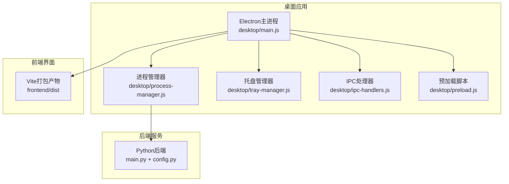
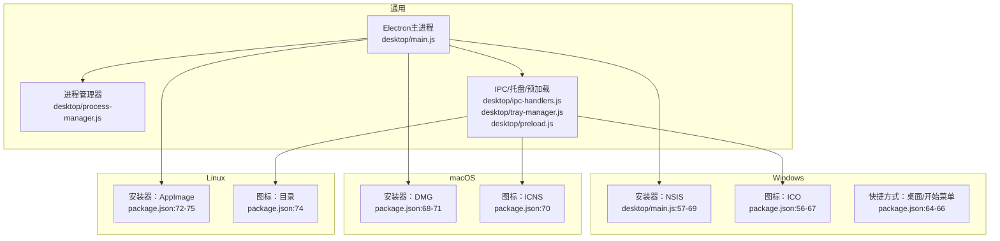
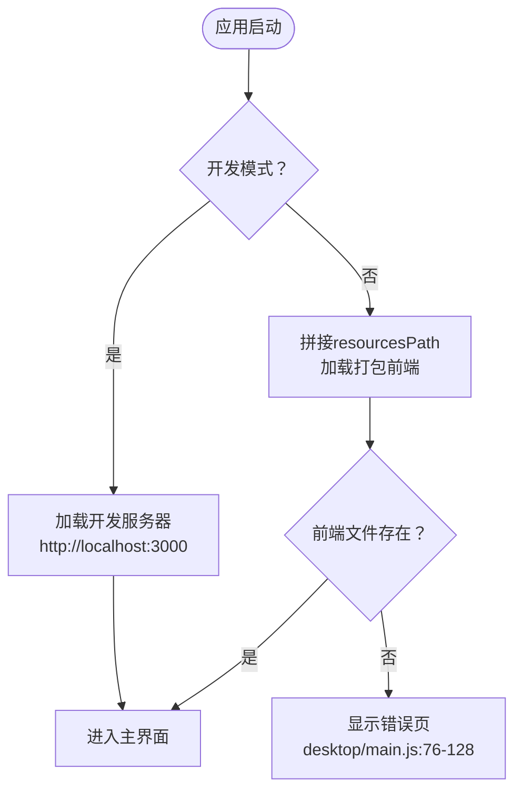
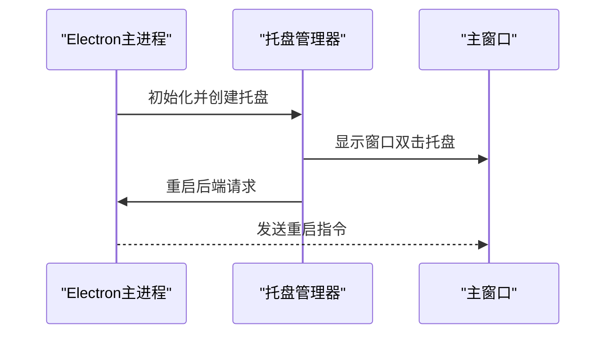
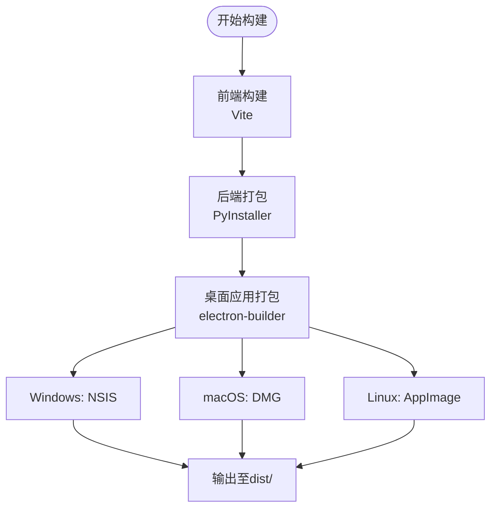
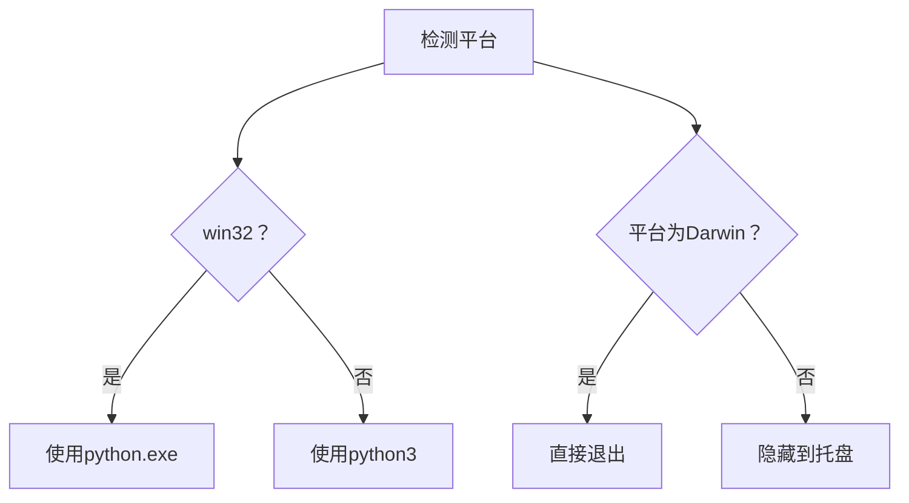
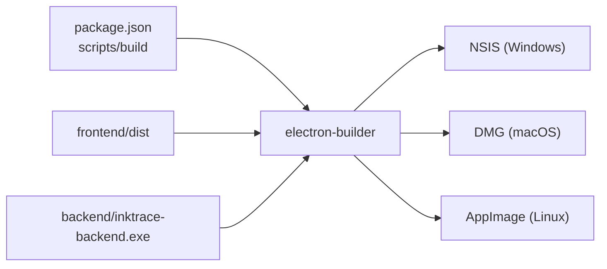

# 跨平台适配

<cite>
**本文引用的文件**
- [desktop/main.js](file://desktop/main.js)
- [desktop/preload.js](file://desktop/preload.js)
- [desktop/ipc-handlers.js](file://desktop/ipc-handlers.js)
- [desktop/tray-manager.js](file://desktop/tray-manager.js)
- [desktop/process-manager.js](file://desktop/process-manager.js)
- [package.json](file://package.json)
- [build-desktop.bat](file://build-desktop.bat)
- [config.py](file://config.py)
- [main.py](file://main.py)
- [README.md](file://README.md)
- [debug-desktop.js](file://debug-desktop.js)
</cite>

## 目录
1. [引言](#引言)
2. [项目结构](#项目结构)
3. [核心组件](#核心组件)
4. [架构总览](#架构总览)
5. [详细组件分析](#详细组件分析)
6. [依赖分析](#依赖分析)
7. [性能考量](#性能考量)
8. [故障排查指南](#故障排查指南)
9. [结论](#结论)
10. [附录](#附录)

## 引言
本文件面向InkTrace桌面版的跨平台适配与落地实践，聚焦Windows、macOS、Linux三大平台的差异与统一策略。内容涵盖：
- 平台特定的文件路径处理与资源加载机制
- 系统集成功能（托盘、图标、快捷方式）实现
- 打包与分发策略（NSIS、DMG、AppImage）
- 权限与安全注意事项
- UI与交互的平台差异与适配方案
- 平台检测与条件执行模式
- 测试与兼容性验证方法
- 持续集成中的跨平台构建配置与优化建议

## 项目结构
InkTrace桌面端采用Electron作为宿主，后端为独立的Python进程，前端为Vue3应用。跨平台适配的关键在于：
- Electron主进程对平台差异的处理（窗口、托盘、图标、快捷方式）
- 进程管理器对后端可执行文件的定位与启动
- 构建配置对三平台产物的差异化定义
- 前端资源在开发与打包模式下的加载策略

图示来源
- [desktop/main.js:1-213](file://desktop/main.js#L1-L213)
- [desktop/process-manager.js:1-218](file://desktop/process-manager.js#L1-L218)
- [desktop/tray-manager.js:1-96](file://desktop/tray-manager.js#L1-L96)
- [desktop/ipc-handlers.js:1-50](file://desktop/ipc-handlers.js#L1-L50)
- [desktop/preload.js:1-25](file://desktop/preload.js#L1-L25)
- [main.py:1-22](file://main.py#L1-L22)
- [config.py:1-46](file://config.py#L1-L46)

章节来源
- [desktop/main.js:1-213](file://desktop/main.js#L1-L213)
- [package.json:1-81](file://package.json#L1-L81)
- [README.md:1-208](file://README.md#L1-L208)

## 核心组件
- Electron主进程负责窗口生命周期、资源加载、事件绑定与系统集成功能。
- 进程管理器负责后端Python进程的启动、健康检查、状态通知与优雅停止。
- 托盘管理器提供跨平台托盘菜单与双击显示窗口能力。
- IPC处理器提供后端状态查询、重启、外部链接打开、文件夹定位等桥接能力。
- 预加载脚本通过contextBridge暴露受控API给渲染进程。

章节来源
- [desktop/main.js:1-213](file://desktop/main.js#L1-L213)
- [desktop/process-manager.js:1-218](file://desktop/process-manager.js#L1-L218)
- [desktop/tray-manager.js:1-96](file://desktop/tray-manager.js#L1-L96)
- [desktop/ipc-handlers.js:1-50](file://desktop/ipc-handlers.js#L1-L50)
- [desktop/preload.js:1-25](file://desktop/preload.js#L1-L25)

## 架构总览
下图展示桌面应用在三平台上的统一架构与关键差异点（图标、安装目标、打包产物类型）：

图示来源
- [desktop/main.js:57-69](file://desktop/main.js#L57-L69)
- [package.json:56-75](file://package.json#L56-L75)

## 详细组件分析

### 平台差异与适配策略
- 窗口与图标
  - Windows：使用ICO图标；开发/生产模式分别加载本地开发服务器或打包的前端文件。
  - macOS：使用ICNS图标；安装器为DMG。
  - Linux：使用目录图标；安装器为AppImage。
- 关闭行为
  - Windows/Linux：关闭窗口时隐藏至托盘；Darwin（macOS）遵循原生行为，关闭即退出。
- 托盘与系统集成功能
  - 统一提供“显示/隐藏窗口”、“重启后端服务”、“退出”等菜单项；双击托盘恢复窗口。
- 资源路径与加载
  - 开发模式：加载本地Vite开发服务器。
  - 生产模式：从resourcesPath下的打包目录加载前端与后端可执行文件。
- 后端可执行文件定位
  - 开发：直接调用系统Python解释器执行main.py。
  - 生产：优先使用打包内嵌的Python运行时，否则回退到系统Python；后端可执行文件在Windows上为独立exe。

章节来源
- [desktop/main.js:188-192](file://desktop/main.js#L188-L192)
- [desktop/main.js:57-69](file://desktop/main.js#L57-L69)
- [desktop/main.js:133-139](file://desktop/main.js#L133-L139)
- [desktop/process-manager.js:159-171](file://desktop/process-manager.js#L159-L171)
- [package.json:56-75](file://package.json#L56-L75)

### 文件路径处理与资源加载机制
- 前端加载策略
  - 开发：加载http://localhost:3000。
  - 生产：从process.resourcesPath拼接frontend/index.html路径加载。
- 后端可执行文件路径
  - 开发：指向项目根目录的main.py。
  - 生产：指向resourcesPath/backend/inktrace-backend.exe。
- 用户数据目录
  - 进程管理器在用户目录下创建应用专属数据目录，用于数据库与向量索引存储。

图示来源
- [desktop/main.js:52-74](file://desktop/main.js#L52-L74)

章节来源
- [desktop/main.js:52-74](file://desktop/main.js#L52-L74)
- [desktop/main.js:133-139](file://desktop/main.js#L133-L139)
- [desktop/process-manager.js:34-38](file://desktop/process-manager.js#L34-L38)

### 系统集成功能实现（托盘、图标、快捷方式）
- 托盘
  - 图标：使用assets/icon.ico；上下文菜单包含显示/隐藏窗口、重启后端、退出。
  - 双击托盘恢复窗口；根据后端状态更新工具提示。
- 图标
  - Windows：desktop/assets/icon.ico。
  - macOS：desktop/assets/icon.icns。
  - Linux：desktop/assets目录。
- 快捷方式
  - Windows：安装时创建桌面与开始菜单快捷方式。
- 通知中心
  - 当前未实现系统通知中心集成；可通过Electron的Notification API扩展。

图示来源
- [desktop/tray-manager.js:16-48](file://desktop/tray-manager.js#L16-L48)
- [desktop/tray-manager.js:88-92](file://desktop/tray-manager.js#L88-L92)

章节来源
- [desktop/tray-manager.js:16-96](file://desktop/tray-manager.js#L16-L96)
- [package.json:64-66](file://package.json#L64-L66)

### 打包与分发策略
- 构建脚本
  - 前端构建：npm run build（Vite）。
  - 后端打包：PyInstaller生成独立exe（Windows）。
  - 桌面应用打包：electron-builder按平台生成对应安装器。
- 平台配置
  - Windows：NSIS安装器，支持自定义安装目录与快捷方式。
  - macOS：DMG安装器，使用ICNS图标。
  - Linux：AppImage安装器，使用目录图标。
- 输出目录
  - electron-builder输出至dist目录。

图示来源
- [build-desktop.bat:10-27](file://build-desktop.bat#L10-L27)
- [package.json:8-14](file://package.json#L8-L14)
- [package.json:47-75](file://package.json#L47-L75)

章节来源
- [build-desktop.bat:1-35](file://build-desktop.bat#L1-L35)
- [package.json:1-81](file://package.json#L1-L81)

### 权限与安全考虑
- 进程权限
  - 后端以普通用户权限启动，避免提权风险。
- 资源访问
  - 严格限制从resourcesPath读取文件，避免路径穿越。
- 网络与外部链接
  - 通过IPC开放shell.openExternal，仅允许受控URL访问。
- 数据隔离
  - 用户数据目录位于用户主目录下，避免全局污染。

章节来源
- [desktop/process-manager.js:34-38](file://desktop/process-manager.js#L34-L38)
- [desktop/ipc-handlers.js:23-25](file://desktop/ipc-handlers.js#L23-L25)

### UI与交互的平台差异与适配
- 窗口行为
  - Windows/Linux：关闭按钮最小化到托盘，符合桌面应用习惯。
  - macOS：遵循原生关闭行为，避免破坏用户体验。
- 字体与主题
  - 通过CSS与Element Plus组件库保证跨平台视觉一致性。
- 菜单与快捷键
  - 使用Electron原生菜单与快捷键，确保平台一致性。

章节来源
- [desktop/main.js:188-192](file://desktop/main.js#L188-L192)

### 平台检测与条件执行模式
- 平台检测
  - 使用process.platform判断Windows/macOS/Linux。
- 条件执行
  - 托盘关闭行为：非Darwin平台关闭时退出。
  - 后端可执行文件选择：Windows使用python.exe，其他平台使用python3。
  - 资源路径拼接：Windows使用反斜杠，POSIX使用正斜杠（由path模块统一处理）。

图示来源
- [desktop/process-manager.js:159-171](file://desktop/process-manager.js#L159-L171)
- [desktop/main.js:188-192](file://desktop/main.js#L188-L192)

章节来源
- [desktop/process-manager.js:159-171](file://desktop/process-manager.js#L159-L171)
- [desktop/main.js:188-192](file://desktop/main.js#L188-L192)

### 测试与兼容性验证方法
- 诊断脚本
  - 检查关键产物是否存在（Windows exe、后端exe、asar包等）。
  - 启动后端exe进行短时健康验证。
- 手工验证清单
  - 各平台安装器安装后可启动。
  - 托盘功能可用（显示/隐藏、重启后端、退出）。
  - 前端在开发与生产模式均能正常加载。
- 自动化建议
  - 使用CI矩阵构建三平台产物并进行基本功能回归。

章节来源
- [debug-desktop.js:13-54](file://debug-desktop.js#L13-L54)

## 依赖分析
- 构建依赖
  - electron、electron-builder分别负责运行时与打包。
- 运行时依赖
  - 后端Python服务通过uvicorn提供API；前端通过Vite开发服务器提供界面。
- 资源依赖
  - 打包阶段将frontend/dist与backend/inktrace-backend.exe复制到resources目录。

图示来源
- [package.json:8-14](file://package.json#L8-L14)
- [package.json:31-46](file://package.json#L31-L46)
- [build-desktop.bat:21-23](file://build-desktop.bat#L21-L23)

章节来源
- [package.json:1-81](file://package.json#L1-L81)
- [build-desktop.bat:1-35](file://build-desktop.bat#L1-L35)

## 性能考量
- 启动时序
  - 先创建窗口，再启动后端，最后初始化托盘与IPC，减少用户等待。
- 健康检查
  - 后端启动后通过HTTP轮询检查/health端点，超时则标记错误。
- 进程管理
  - 优雅停止：先发送SIGTERM，超时后强制SIGKILL；避免僵尸进程。
- 资源加载
  - 生产模式直接从resourcesPath加载，避免磁盘扫描开销。

章节来源
- [desktop/main.js:161-186](file://desktop/main.js#L161-L186)
- [desktop/process-manager.js:90-101](file://desktop/process-manager.js#L90-L101)
- [desktop/process-manager.js:104-129](file://desktop/process-manager.js#L104-L129)

## 故障排查指南
- 前端加载失败
  - 检查生产模式下frontend/index.html是否存在；查看错误页提供的调试信息。
- 后端启动失败
  - 检查resourcesPath/backend/inktrace-backend.exe是否存在；查看诊断脚本输出。
  - 确认用户数据目录可写（APPDATA或用户主目录）。
- 托盘不可用
  - 确认assets/icon.ico存在；检查菜单注册与事件绑定。
- 安装器问题
  - Windows：检查NSIS安装参数与快捷方式创建；macOS：确认签名与权限；Linux：确认AppImage可执行位。

章节来源
- [desktop/main.js:76-128](file://desktop/main.js#L76-L128)
- [debug-desktop.js:13-54](file://debug-desktop.js#L13-L54)
- [desktop/process-manager.js:34-38](file://desktop/process-manager.js#L34-L38)

## 结论
InkTrace桌面端通过Electron实现了统一的跨平台体验，并在Windows、macOS、Linux上分别采用NSIS、DMG、AppImage进行分发。核心适配点包括：平台化的图标与安装器、窗口关闭行为差异、后端可执行文件的定位与启动策略、托盘与IPC桥接。配合严格的资源路径控制、健康检查与优雅停止机制，整体具备良好的稳定性与可维护性。后续可在macOS的通知中心与Linux桌面通知方面进一步增强系统集成功能。

## 附录
- 后端配置
  - 通过环境变量覆盖主机、端口、调试模式与数据库路径。
- 启动流程参考
  - README提供了完整的启动与使用说明，便于快速验证。

章节来源
- [config.py:30-42](file://config.py#L30-L42)
- [README.md:23-68](file://README.md#L23-L68)