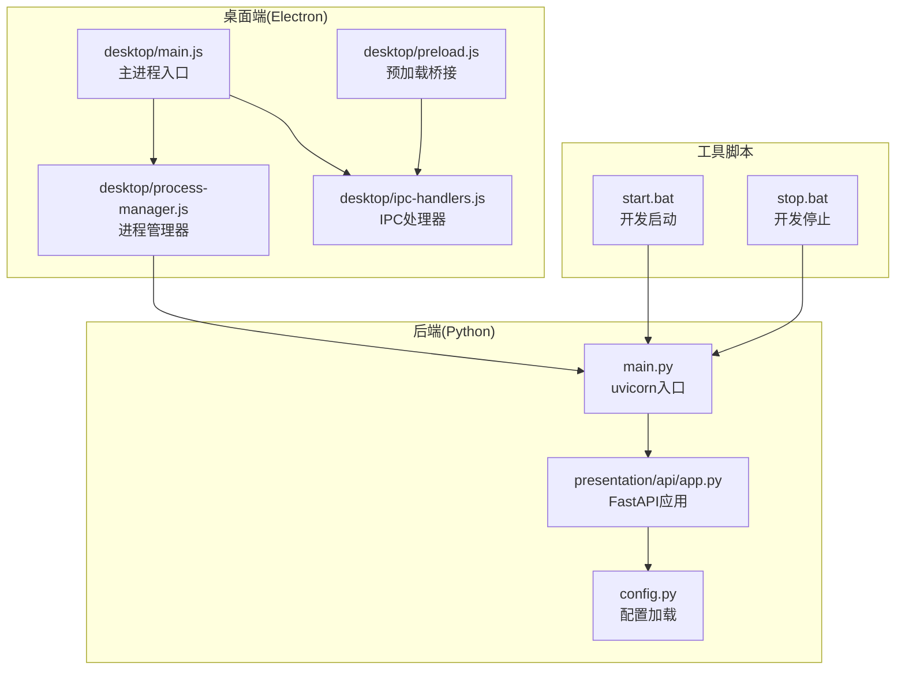
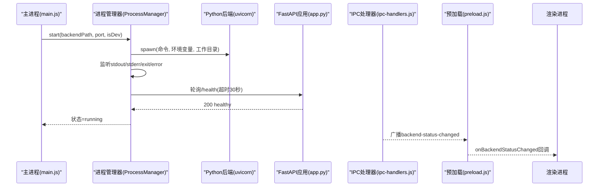
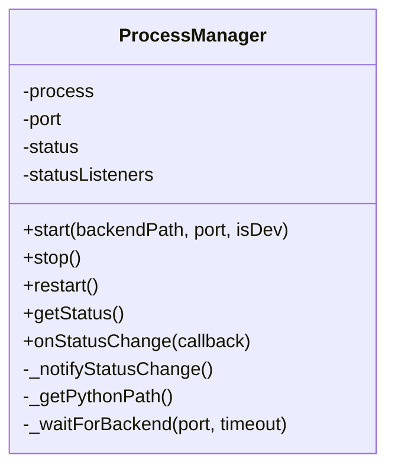
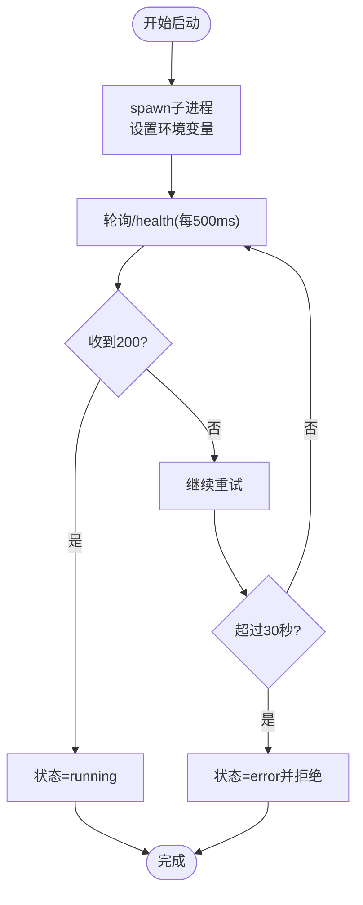
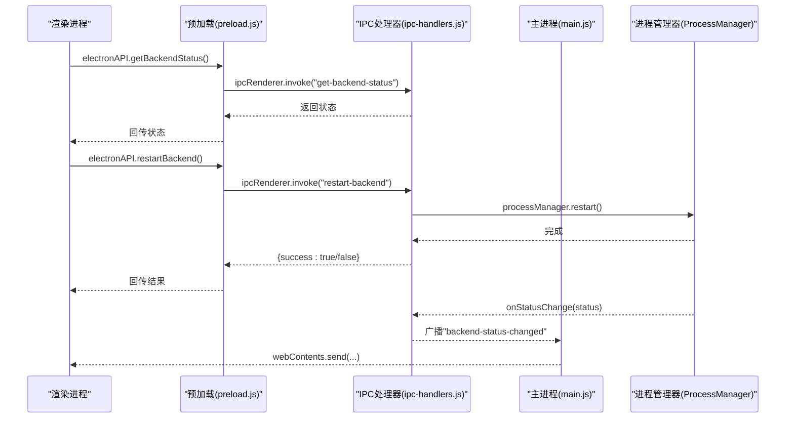
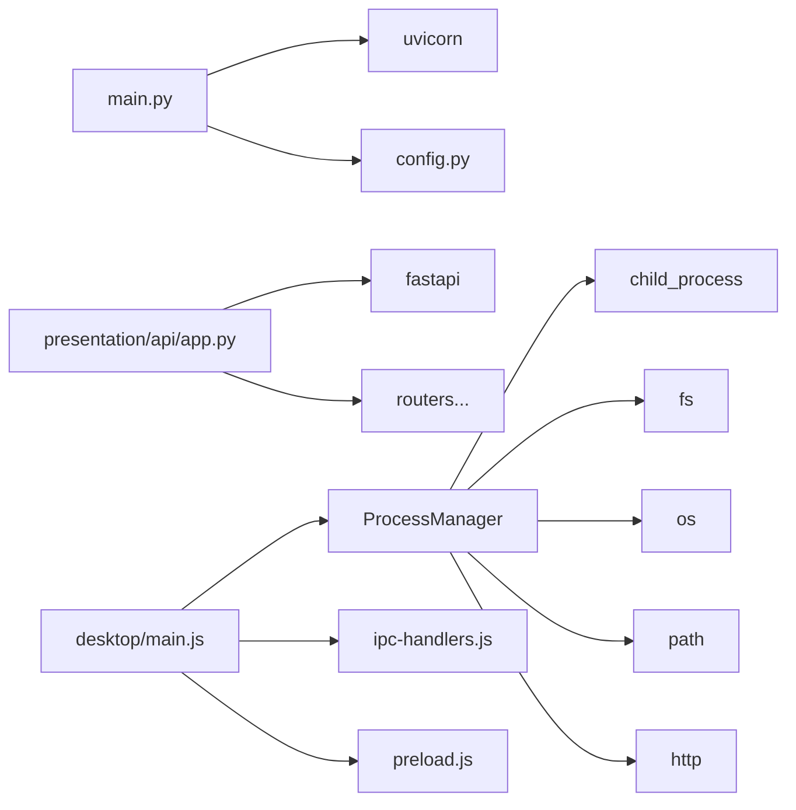
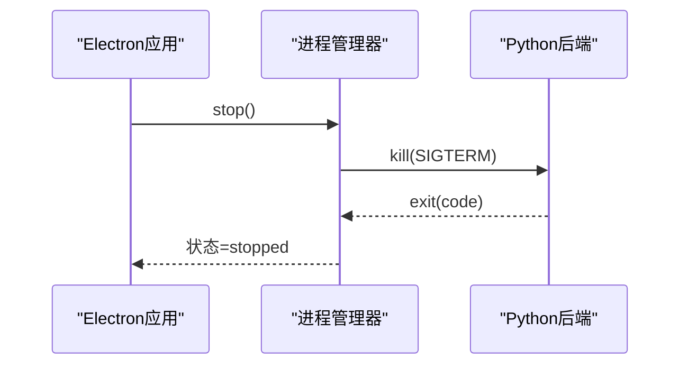

# 进程管理器

<cite>
**本文引用的文件**
- [desktop/process-manager.js](file://desktop/process-manager.js)
- [desktop/ipc-handlers.js](file://desktop/ipc-handlers.js)
- [desktop/main.js](file://desktop/main.js)
- [desktop/preload.js](file://desktop/preload.js)
- [presentation/api/app.py](file://presentation/api/app.py)
- [main.py](file://main.py)
- [config.py](file://config.py)
- [start.bat](file://start.bat)
- [stop.bat](file://stop.bat)
</cite>

## 目录
1. [简介](#简介)
2. [项目结构](#项目结构)
3. [核心组件](#核心组件)
4. [架构总览](#架构总览)
5. [详细组件分析](#详细组件分析)
6. [依赖关系分析](#依赖关系分析)
7. [性能与资源监控](#性能与资源监控)
8. [开发模式与生产模式差异](#开发模式与生产模式差异)
9. [退出信号与优雅关闭](#退出信号与优雅关闭)
10. [配置选项与扩展点](#配置选项与扩展点)
11. [故障排除与调试](#故障排除与调试)
12. [结论](#结论)

## 简介
本文件面向InkTrace项目的进程管理器，系统性梳理桌面端Electron主进程中的Python后端进程管理能力，覆盖启动、停止、重启流程；进程生命周期状态机与事件通知；前后端同步运行的IPC协调；健康检查与超时控制；以及开发/生产两种模式下的差异与扩展点。文档同时给出常见问题排查与调试建议，帮助开发者快速定位并解决问题。

## 项目结构
InkTrace采用Electron作为桌面壳，通过主进程启动并管理Python后端服务（uvicorn/FastAPI），前端通过IPC与主进程交互，获取后端状态、触发重启等操作。

**图表来源**
- [desktop/main.js:130-141](file://desktop/main.js#L130-L141)
- [desktop/process-manager.js:21-101](file://desktop/process-manager.js#L21-L101)
- [presentation/api/app.py:19-66](file://presentation/api/app.py#L19-L66)
- [main.py:15-21](file://main.py#L15-L21)
- [config.py:30-45](file://config.py#L30-L45)
- [start.bat:11-39](file://start.bat#L11-L39)
- [stop.bat:7-24](file://stop.bat#L7-L24)

**章节来源**
- [desktop/main.js:130-141](file://desktop/main.js#L130-L141)
- [desktop/process-manager.js:21-101](file://desktop/process-manager.js#L21-L101)
- [presentation/api/app.py:19-66](file://presentation/api/app.py#L19-L66)
- [main.py:15-21](file://main.py#L15-L21)
- [config.py:30-45](file://config.py#L30-L45)
- [start.bat:11-39](file://start.bat#L11-L39)
- [stop.bat:7-24](file://stop.bat#L7-L24)

## 核心组件
- 进程管理器(ProcessManager)
  - 职责：启动/停止/重启Python后端；监听子进程输出与退出；健康检查等待；状态广播。
  - 关键接口：start、stop、restart、getStatus、onStatusChange。
- IPC处理器(setupIpcHandlers)
  - 职责：注册IPC接口，转发后端状态变更事件到渲染进程。
- 主进程入口(desktop/main.js)
  - 职责：创建窗口、启动后端、设置托盘、注册IPC、处理应用生命周期事件。
- 预加载脚本(preload.js)
  - 职责：暴露安全的API给渲染进程调用。
- 后端应用(presentation/api/app.py)
  - 职责：构建FastAPI应用、挂载路由、提供健康检查端点。
- uvicorn入口(main.py)
  - 职责：根据配置运行后端服务。
- 配置(config.py)
  - 职责：从环境变量加载主机、端口、调试开关、数据库路径等。

**章节来源**
- [desktop/process-manager.js:13-19](file://desktop/process-manager.js#L13-L19)
- [desktop/ipc-handlers.js:9-47](file://desktop/ipc-handlers.js#L9-L47)
- [desktop/main.js:130-141](file://desktop/main.js#L130-L141)
- [desktop/preload.js:9-24](file://desktop/preload.js#L9-L24)
- [presentation/api/app.py:19-66](file://presentation/api/app.py#L19-L66)
- [main.py:15-21](file://main.py#L15-L21)
- [config.py:30-45](file://config.py#L30-L45)

## 架构总览
下面的序列图展示了从主进程启动到后端可用、再到前端获取状态的整体流程。

**图表来源**
- [desktop/main.js:130-141](file://desktop/main.js#L130-L141)
- [desktop/process-manager.js:21-101](file://desktop/process-manager.js#L21-L101)
- [presentation/api/app.py:58-60](file://presentation/api/app.py#L58-L60)
- [desktop/ipc-handlers.js:41-46](file://desktop/ipc-handlers.js#L41-L46)
- [desktop/preload.js:17-23](file://desktop/preload.js#L17-L23)

## 详细组件分析

### 进程管理器(ProcessManager)设计与实现
- 状态机
  - 初始：stopped
  - 启动中：starting
  - 运行中：running
  - 停止中：stopping
  - 错误：error
- 关键行为
  - 启动：根据isDev选择Python解释器或可执行文件；注入环境变量（端口、主机、调试、数据库路径、向量存储目录）；spawn子进程；监听标准输出/错误；等待/health健康检查；超时则标记为error。
  - 停止：发送SIGTERM，若5秒内未退出则强制SIGKILL；监听exit事件更新状态。
  - 重启：复用上次启动的后端路径与端口，先stop再start。
  - 状态通知：onStatusChange订阅者列表，状态变化时广播。
- 异常处理
  - 子进程error事件：记录错误并进入error状态。
  - 子进程exit事件：清理引用并进入stopped状态。
  - 健康检查超时：reject并进入error状态。
- 环境变量与用户数据
  - 自动创建用户数据目录与向量存储目录，保证后端持久化数据可用。

**图表来源**
- [desktop/process-manager.js:13-19](file://desktop/process-manager.js#L13-L19)
- [desktop/process-manager.js:21-101](file://desktop/process-manager.js#L21-L101)
- [desktop/process-manager.js:104-129](file://desktop/process-manager.js#L104-L129)
- [desktop/process-manager.js:131-140](file://desktop/process-manager.js#L131-L140)
- [desktop/process-manager.js:142-157](file://desktop/process-manager.js#L142-L157)
- [desktop/process-manager.js:159-171](file://desktop/process-manager.js#L159-L171)
- [desktop/process-manager.js:173-214](file://desktop/process-manager.js#L173-L214)

**章节来源**
- [desktop/process-manager.js:13-19](file://desktop/process-manager.js#L13-L19)
- [desktop/process-manager.js:21-101](file://desktop/process-manager.js#L21-L101)
- [desktop/process-manager.js:104-129](file://desktop/process-manager.js#L104-L129)
- [desktop/process-manager.js:131-140](file://desktop/process-manager.js#L131-L140)
- [desktop/process-manager.js:142-157](file://desktop/process-manager.js#L142-L157)
- [desktop/process-manager.js:159-171](file://desktop/process-manager.js#L159-L171)
- [desktop/process-manager.js:173-214](file://desktop/process-manager.js#L173-L214)

### 进程生命周期与健康检查
- 生命周期事件
  - stdout/stderr日志打印，便于调试。
  - error：启动失败。
  - exit：进程退出，清理引用并置stopped。
- 健康检查
  - 每500ms轮询/health，超时30秒。
  - 成功：状态切换为running。
  - 失败：状态切换为error并拒绝Promise。

**图表来源**
- [desktop/process-manager.js:21-101](file://desktop/process-manager.js#L21-L101)
- [desktop/process-manager.js:173-214](file://desktop/process-manager.js#L173-L214)
- [presentation/api/app.py:58-60](file://presentation/api/app.py#L58-L60)

**章节来源**
- [desktop/process-manager.js:21-101](file://desktop/process-manager.js#L21-L101)
- [desktop/process-manager.js:173-214](file://desktop/process-manager.js#L173-L214)
- [presentation/api/app.py:58-60](file://presentation/api/app.py#L58-L60)

### 进程间通信与同步运行
- IPC接口
  - 渲染进程通过preload暴露的electronAPI调用：
    - getBackendStatus：获取后端状态。
    - restartBackend：触发后端重启。
    - onBackendStatusChanged：订阅后端状态变更事件。
- 主进程侧
  - setupIpcHandlers注册handle接口，并在ProcessManager状态变化时广播事件到所有窗口。
- 前后端同步
  - 主进程先创建窗口，再启动后端；后端健康检查成功后，前端通过事件感知后端已就绪，确保UI与后端同步运行。

**图表来源**
- [desktop/preload.js:9-24](file://desktop/preload.js#L9-L24)
- [desktop/ipc-handlers.js:9-47](file://desktop/ipc-handlers.js#L9-L47)
- [desktop/main.js:178-178](file://desktop/main.js#L178-L178)

**章节来源**
- [desktop/preload.js:9-24](file://desktop/preload.js#L9-L24)
- [desktop/ipc-handlers.js:9-47](file://desktop/ipc-handlers.js#L9-L47)
- [desktop/main.js:178-178](file://desktop/main.js#L178-L178)

### 后端服务启动与配置
- uvicorn入口
  - 通过main.py运行presentation/api/app.py中的FastAPI应用，host/port来自config。
- FastAPI应用
  - 注册多期路由，提供根路径与/health健康检查。
- 配置加载
  - config.py支持从环境变量覆盖默认值，如INKTRACE_HOST、INKTRACE_PORT、INKTRACE_DEBUG、INKTRACE_DB_PATH等。

**章节来源**
- [main.py:15-21](file://main.py#L15-L21)
- [presentation/api/app.py:19-66](file://presentation/api/app.py#L19-L66)
- [config.py:30-45](file://config.py#L30-L45)

## 依赖关系分析
- 主进程依赖
  - desktop/main.js依赖ProcessManager、TrayManager、setupIpcHandlers。
  - ProcessManager依赖child_process、http、fs、os、path。
- 后端依赖
  - main.py依赖uvicorn与config。
  - presentation/api/app.py依赖FastAPI与各路由模块。
- 前端依赖
  - preload.js通过contextBridge暴露API供渲染进程使用。

**图表来源**
- [desktop/process-manager.js:7-11](file://desktop/process-manager.js#L7-L11)
- [main.py:11-12](file://main.py#L11-L12)
- [presentation/api/app.py:11-16](file://presentation/api/app.py#L11-L16)
- [desktop/main.js:7-11](file://desktop/main.js#L7-L11)

**章节来源**
- [desktop/process-manager.js:7-11](file://desktop/process-manager.js#L7-L11)
- [main.py:11-12](file://main.py#L11-L12)
- [presentation/api/app.py:11-16](file://presentation/api/app.py#L11-L16)
- [desktop/main.js:7-11](file://desktop/main.js#L7-L11)

## 性能与资源监控
- 当前实现重点在于进程生命周期与健康检查，未内置CPU/内存等系统级指标采集。
- 建议扩展方向
  - 在ProcessManager中增加定时任务，通过子进程标准输出解析或外部探针采集资源指标。
  - 将指标写入本地文件或上报至后端，结合前端可视化展示。
  - 对健康检查间隔与超时时间参数化，支持动态调整。

[本节为通用建议，无需特定文件引用]

## 开发模式与生产模式差异
- 启动路径
  - 开发模式：使用Python解释器执行main.py，便于热重载与调试。
  - 生产模式：使用打包后的可执行文件（如inktrace-backend.exe），减少依赖暴露。
- 环境变量
  - 开发模式：INKTRACE_DEBUG=true，启用reload与更详细的日志。
  - 生产模式：INKTRACE_DEBUG=false，禁用reload，优化运行时性能。
- 前端加载
  - 开发模式：加载本地Vite开发服务器。
  - 生产模式：加载打包后的静态页面。
- 健康检查与超时
  - 两者一致，均通过/health端点进行健康检查。

**章节来源**
- [desktop/main.js:133-135](file://desktop/main.js#L133-L135)
- [desktop/process-manager.js:52-58](file://desktop/process-manager.js#L52-L58)
- [config.py:30-42](file://config.py#L30-L42)
- [desktop/main.js:53-69](file://desktop/main.js#L53-L69)

## 退出信号与优雅关闭
- 优雅关闭流程
  - before-quit事件中，主进程调用ProcessManager.stop()，发送SIGTERM并等待退出。
  - 若5秒内未退出，强制SIGKILL，确保资源释放。
- 进程退出事件
  - 监听exit事件，清理引用并将状态置stopped，通知所有订阅者。
- 前端感知
  - 通过IPC广播状态变化，前端可据此更新UI提示。

**图表来源**
- [desktop/main.js:200-208](file://desktop/main.js#L200-L208)
- [desktop/process-manager.js:104-129](file://desktop/process-manager.js#L104-L129)

**章节来源**
- [desktop/main.js:200-208](file://desktop/main.js#L200-L208)
- [desktop/process-manager.js:104-129](file://desktop/process-manager.js#L104-L129)

## 配置选项与扩展点
- 可配置项（来自环境变量）
  - INKTRACE_HOST：后端绑定地址，默认127.0.0.1。
  - INKTRACE_PORT：后端监听端口，默认9527。
  - INKTRACE_DEBUG：是否启用调试与热重载。
  - INKTRACE_DB_PATH：SQLite数据库路径。
  - INKTRACE_CHROMA_DIR：向量数据库目录。
- 扩展点建议
  - 增加最大重启次数与退避策略，避免频繁重启导致抖动。
  - 增加健康检查端点自定义与超时参数化。
  - 增加日志级别与输出目标配置（文件/控制台）。
  - 支持多实例或多端口后端管理。

**章节来源**
- [config.py:30-42](file://config.py#L30-L42)
- [desktop/process-manager.js:40-49](file://desktop/process-manager.js#L40-L49)

## 故障排除与调试
- 启动失败
  - 现象：状态变为error，控制台输出错误信息。
  - 排查：检查Python解释器是否存在、依赖是否完整、端口是否被占用。
  - 参考：健康检查超时与error事件处理。
- 端口冲突
  - 现象：无法绑定端口或健康检查失败。
  - 排查：使用stop.bat终止旧进程，或修改端口。
- 健康检查超时
  - 现象：30秒后仍未收到200响应。
  - 排查：检查后端路由是否正确挂载/health端点。
- 前端无法获取状态
  - 现象：getBackendStatus返回空或状态不更新。
  - 排查：确认IPC通道是否注册、事件广播是否触发、预加载API是否暴露。
- 开发/生产差异
  - 现象：开发模式可热重载，生产模式不可。
  - 排查：核对环境变量与启动路径。

**章节来源**
- [desktop/process-manager.js:76-81](file://desktop/process-manager.js#L76-L81)
- [desktop/process-manager.js:96-100](file://desktop/process-manager.js#L96-L100)
- [start.bat:11-27](file://start.bat#L11-L27)
- [stop.bat:7-24](file://stop.bat#L7-L24)
- [presentation/api/app.py:58-60](file://presentation/api/app.py#L58-L60)
- [desktop/ipc-handlers.js:9-47](file://desktop/ipc-handlers.js#L9-L47)
- [desktop/preload.js:9-24](file://desktop/preload.js#L9-L24)

## 结论
InkTrace的进程管理器以简洁可靠为核心目标：通过明确的状态机、严格的健康检查与优雅关闭机制，保障了前后端协同运行的稳定性。开发与生产模式的差异化配置满足不同场景需求。未来可在资源监控、自动重启策略、日志与可观测性方面进一步增强，以提升整体运维体验。