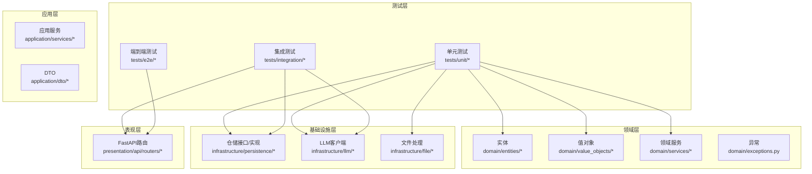
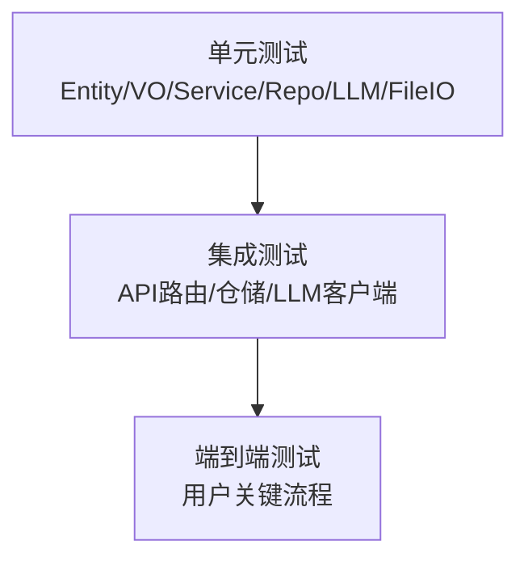

# 测试策略

<cite>
**本文引用的文件**
- [README.md](file://README.md)
- [requirements.txt](file://requirements.txt)
- [tests/__init__.py](file://tests/__init__.py)
- [tests/test_utils.py](file://tests/test_utils.py)
- [tests/unit/test_chapter.py](file://tests/unit/test_chapter.py)
- [tests/unit/test_character.py](file://tests/unit/test_character.py)
- [tests/unit/test_project.py](file://tests/unit/test_project.py)
- [tests/unit/test_novel.py](file://tests/unit/test_novel.py)
- [tests/unit/test_llm_client.py](file://tests/unit/test_llm_client.py)
- [tests/unit/test_markdown_exporter.py](file://tests/unit/test_markdown_exporter.py)
- [tests/unit/test_txt_parser.py](file://tests/unit/test_txt_parser.py)
- [tests/unit/test_repositories.py](file://tests/unit/test_repositories.py)
- [domain/utils.py](file://domain/utils.py)
</cite>

## 目录
1. [引言](#引言)
2. [项目结构](#项目结构)
3. [核心组件](#核心组件)
4. [架构总览](#架构总览)
5. [详细组件分析](#详细组件分析)
6. [依赖分析](#依赖分析)
7. [性能考虑](#性能考虑)
8. [故障排查指南](#故障排查指南)
9. [结论](#结论)
10. [附录](#附录)

## 引言
本测试策略文档面向InkTrace项目，系统化阐述测试金字塔与测试层次结构，明确单元测试设计原则与实现方法、集成测试覆盖范围与实施路径、测试工具链选择与配置（含PyTest与报告生成）、测试数据准备与管理策略、测试覆盖率与质量指标、持续集成与自动化测试配置，以及测试驱动开发（TDD）的最佳实践。目标是为测试工程师与开发者提供一套完整、可落地的质量保证方案。

## 项目结构
InkTrace采用分层架构：domain（领域层）、application（应用层）、infrastructure（基础设施层）、presentation（表现层）。测试主要集中在domain与infrastructure层，通过单元测试验证实体、值对象、仓储与基础设施组件的行为；通过集成测试覆盖API接口、数据流与端到端场景。



图表来源
- [tests/unit/test_chapter.py:1-227](file://tests/unit/test_chapter.py#L1-L227)
- [tests/unit/test_character.py:1-245](file://tests/unit/test_character.py#L1-L245)
- [tests/unit/test_project.py:1-173](file://tests/unit/test_project.py#L1-L173)
- [tests/unit/test_novel.py:1-345](file://tests/unit/test_novel.py#L1-L345)
- [tests/unit/test_llm_client.py:1-134](file://tests/unit/test_llm_client.py#L1-L134)
- [tests/unit/test_markdown_exporter.py:1-154](file://tests/unit/test_markdown_exporter.py#L1-L154)
- [tests/unit/test_txt_parser.py:1-229](file://tests/unit/test_txt_parser.py#L1-L229)
- [tests/unit/test_repositories.py:1-310](file://tests/unit/test_repositories.py#L1-L310)

章节来源
- [README.md:107-106](file://README.md#L107-L106)

## 核心组件
- 单元测试框架与运行方式：项目使用Python标准库unittest进行单元测试，并通过命令行运行discover扫描tests/unit目录。参考项目自述文件中的测试运行示例与覆盖率提示。
- 测试工具链：requirements.txt中声明了pytest≥7.0.0，表明具备使用PyTest的条件；建议在CI中启用PyTest以获得更丰富的报告与插件生态。
- 测试数据与工具：测试中广泛使用临时目录与临时文件进行文件IO与数据库操作隔离；部分测试通过mock或异步mock模拟外部依赖（如LLM API）。

章节来源
- [README.md:189-196](file://README.md#L189-L196)
- [requirements.txt:9](file://requirements.txt#L9)
- [tests/test_utils.py:10-44](file://tests/test_utils.py#L10-L44)

## 架构总览
下图展示测试金字塔在InkTrace中的映射：最底层为单元测试，覆盖实体、值对象、仓储与基础设施组件；中间层为集成测试，覆盖API路由、数据持久化与外部服务交互；顶层为端到端测试，覆盖用户关键流程。



## 详细组件分析

### 单元测试设计原则与实现方法
- 设计原则
  - 隔离性：通过setUp/tearDown或临时文件/数据库隔离副作用；对依赖外部系统的组件使用mock。
  - 可读性：测试命名清晰表达意图；断言明确指出期望结果。
  - 全面性：覆盖正常路径、边界条件与异常分支。
  - 可维护性：避免过度耦合业务细节，优先断言行为而非实现。
- 断言策略
  - 数值/字符串断言：使用assertEqual/assertIn等。
  - 浮点数断言：使用assertAlmostEqual并指定精度。
  - 异常断言：使用assertRaises验证异常类型。
  - 布尔断言：使用assertTrue/assertFalse。
- 示例要点
  - 领域工具函数：对add_numbers进行正数、负数、浮点数与零值断言。
  - 实体与值对象：验证构造参数、属性访问、状态变更与异常路径。
  - 仓储：验证CRUD、查询过滤与分页/最新记录查询。
  - 文件与导出：验证输出文件存在、内容片段与元数据格式。
  - LLM客户端：验证工厂创建、主备客户端选择与上下文token配置。

章节来源
- [tests/test_utils.py:14-41](file://tests/test_utils.py#L14-L41)
- [tests/unit/test_chapter.py:29-147](file://tests/unit/test_chapter.py#L29-L147)
- [tests/unit/test_character.py:29-223](file://tests/unit/test_character.py#L29-L223)
- [tests/unit/test_project.py:20-127](file://tests/unit/test_project.py#L20-L127)
- [tests/unit/test_novel.py:33-341](file://tests/unit/test_novel.py#L33-L341)
- [tests/unit/test_repositories.py:43-190](file://tests/unit/test_repositories.py#L43-L190)
- [tests/unit/test_markdown_exporter.py:37-150](file://tests/unit/test_markdown_exporter.py#L37-L150)
- [tests/unit/test_llm_client.py:43-117](file://tests/unit/test_llm_client.py#L43-L117)

### 集成测试覆盖范围与实施方法
- 覆盖范围
  - API接口测试：基于FastAPI路由与依赖注入，验证请求/响应结构、状态码与错误处理。
  - 数据流测试：验证从导入TXT到解析章节、入库、查询与导出的完整链路。
  - 端到端测试：覆盖“导入小说→文风/剧情分析→生成章节→导出小说”的用户关键路径。
- 实施方法
  - 使用HTTP客户端（如httpx或FastAPI内置测试客户端）发起请求，断言响应。
  - 对外部LLM服务使用mock或禁用真实调用，确保测试稳定与可重复。
  - 对文件导出与解析，断言生成文件内容与结构。
  - 对仓储层，断言数据一致性与查询正确性。

章节来源
- [README.md:139-155](file://README.md#L139-L155)
- [tests/unit/test_txt_parser.py:71-154](file://tests/unit/test_txt_parser.py#L71-L154)
- [tests/unit/test_markdown_exporter.py:81-131](file://tests/unit/test_markdown_exporter.py#L81-L131)

### 测试工具链选择与配置
- 当前工具链
  - 单元测试：unittest（项目自述文件提供discover运行方式）。
  - PyTest：requirements.txt声明pytest≥7.0.0，可用于增强报告与并行执行。
- 建议配置
  - 在CI中启用PyTest并配置覆盖率插件（如coverage.py），生成HTML报告。
  - 使用pytest.mark.parametrize组织参数化测试，提升可维护性。
  - 配置pytest.ini或pyproject.toml统一夹具与标记策略。

章节来源
- [requirements.txt:9](file://requirements.txt#L9)
- [README.md:189-196](file://README.md#L189-L196)

### 测试数据准备与管理策略
- 临时文件与目录
  - 使用tempfile创建临时目录，测试结束后清理，避免污染环境。
- 临时数据库
  - 使用内存数据库或临时文件数据库，确保测试隔离与快速回滚。
- Mock与Fake
  - 对外部API（LLM）使用AsyncMock/Mock，控制返回值与异常。
- 数据构造
  - 使用工厂模式或测试专用构造器，减少重复代码，提高可读性。

章节来源
- [tests/unit/test_markdown_exporter.py:24-36](file://tests/unit/test_markdown_exporter.py#L24-L36)
- [tests/unit/test_txt_parser.py:20-31](file://tests/unit/test_txt_parser.py#L20-L31)
- [tests/unit/test_repositories.py:29-42](file://tests/unit/test_repositories.py#L29-L42)
- [tests/unit/test_llm_client.py:19-38](file://tests/unit/test_llm_client.py#L19-L38)

### 测试覆盖率分析与质量指标
- 覆盖率现状：项目自述文件显示当前覆盖率约85%。
- 建议指标
  - 行覆盖率、分支覆盖率、函数/类覆盖率。
  - 关键路径覆盖率：实体状态转换、异常分支、外部依赖调用。
- 报告与可视化
  - 使用PyTest+coverage生成覆盖率报告，结合CI仪表板展示趋势。

章节来源
- [README.md:195](file://README.md#L195)

### 持续集成与自动化测试配置
- 建议流水线步骤
  - 安装依赖（Python/Node）。
  - 运行单元测试（推荐PyTest）。
  - 生成覆盖率报告并上传至CI覆盖率平台。
  - 运行集成测试（API/仓储/文件导出）。
  - 可选：运行端到端测试（UI或API级）。
- 触发策略
  - PR触发全量测试；主干推送触发关键模块回归。

[本节为通用实践建议，无需特定文件引用]

### 测试驱动开发（TDD）实践与最佳实践
- TDD循环
  - 编写失败的测试 → 编写最小实现 → 重构与优化 → 下一个测试。
- 最佳实践
  - 先写边界与异常测试，再写正常路径。
  - 使用小步快跑，频繁提交与运行测试。
  - 保持测试独立，避免共享状态与隐式依赖。

[本节为通用实践建议，无需特定文件引用]

## 依赖分析
下图展示测试文件与被测模块之间的依赖关系，体现测试金字塔的层次与耦合度。

```mermaid
graph TB
UT_Utils["tests/test_utils.py"]
UT_Chapter["tests/unit/test_chapter.py"]
UT_Character["tests/unit/test_character.py"]
UT_Project["tests/unit/test_project.py"]
UT_Novel["tests/unit/test_novel.py"]
UT_Repo["tests/unit/test_repositories.py"]
UT_LLM["tests/unit/test_llm_client.py"]
UT_Markdown["tests/unit/test_markdown_exporter.py"]
UT_TXT["tests/unit/test_txt_parser.py"]
Utils["domain/utils.py"]
UT_Utils --> Utils
UT_Chapter --> |"依赖"| "domain/entities/chapter.py"
UT_Character --> |"依赖"| "domain/entities/character.py"
UT_Project --> |"依赖"| "domain/entities/project.py"
UT_Novel --> |"依赖"| "domain/entities/novel.py"
UT_Repo --> |"依赖"| "infrastructure/persistence/*"
UT_LLM --> |"依赖"| "infrastructure/llm/*"
UT_Markdown --> |"依赖"| "infrastructure/file/markdown_exporter.py"
UT_TXT --> |"依赖"| "infrastructure/file/txt_parser.py"
```

图表来源
- [tests/test_utils.py:10-11](file://tests/test_utils.py#L10-L11)
- [tests/unit/test_chapter.py:13](file://tests/unit/test_chapter.py#L13)
- [tests/unit/test_character.py:13](file://tests/unit/test_character.py#L13)
- [tests/unit/test_project.py:13](file://tests/unit/test_project.py#L13)
- [tests/unit/test_novel.py:13](file://tests/unit/test_novel.py#L13)
- [tests/unit/test_repositories.py:20-23](file://tests/unit/test_repositories.py#L20-L23)
- [tests/unit/test_llm_client.py:13-16](file://tests/unit/test_llm_client.py#L13-L16)
- [tests/unit/test_markdown_exporter.py:16](file://tests/unit/test_markdown_exporter.py#L16)
- [tests/unit/test_txt_parser.py:14](file://tests/unit/test_txt_parser.py#L14)

## 性能考虑
- 测试执行性能
  - 使用PyTest并行执行（pytest-xdist）加速测试。
  - 对慢依赖（如网络请求）使用mock，避免真实调用。
- 覆盖率收集性能
  - 合理拆分测试套件，避免单次运行时间过长。
  - 在CI中缓存依赖安装，缩短构建时间。

[本节为通用指导，无需特定文件引用]

## 故障排查指南
- 常见问题
  - 测试失败与随机性：检查临时文件/数据库清理逻辑，确保setUp/tearDown完整。
  - 外部依赖不稳定：对外部API使用mock，或在本地禁用真实调用。
  - 路径与编码问题：统一使用UTF-8编码与绝对路径，避免跨平台差异。
- 排查步骤
  - 单独运行失败用例定位问题。
  - 打印关键中间状态（如生成文件内容、SQL语句）辅助诊断。
  - 回归测试：确认修复后不影响其他模块。

章节来源
- [tests/unit/test_markdown_exporter.py:32-36](file://tests/unit/test_markdown_exporter.py#L32-L36)
- [tests/unit/test_txt_parser.py:27-31](file://tests/unit/test_txt_parser.py#L27-L31)
- [tests/unit/test_repositories.py:38-42](file://tests/unit/test_repositories.py#L38-L42)

## 结论
InkTrace的测试体系以单元测试为核心，辅以集成测试与端到端测试，形成完整的质量保障闭环。建议在现有unittest基础上引入PyTest以提升报告与扩展性，并完善覆盖率与CI流水线配置。通过TDD与规范化的测试数据管理，持续提升代码质量与交付效率。

## 附录
- 测试运行命令（来自项目自述文件）
  - python -m unittest discover -s tests/unit
- 已有测试文件概览
  - 领域工具：tests/test_utils.py
  - 实体与值对象：tests/unit/test_chapter.py、tests/unit/test_character.py、tests/unit/test_project.py、tests/unit/test_novel.py
  - 仓储与基础设施：tests/unit/test_repositories.py、tests/unit/test_llm_client.py、tests/unit/test_markdown_exporter.py、tests/unit/test_txt_parser.py

章节来源
- [README.md:191-193](file://README.md#L191-L193)
- [tests/__init__.py:1-5](file://tests/__init__.py#L1-L5)
- [domain/utils.py:11-24](file://domain/utils.py#L11-L24)