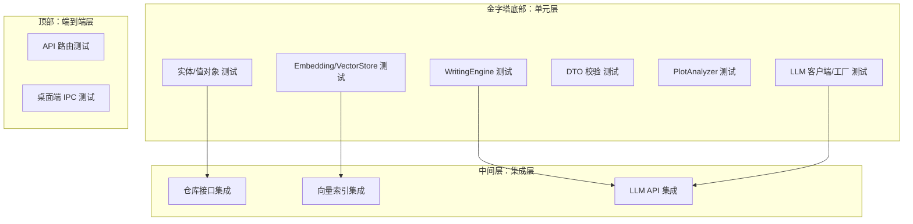
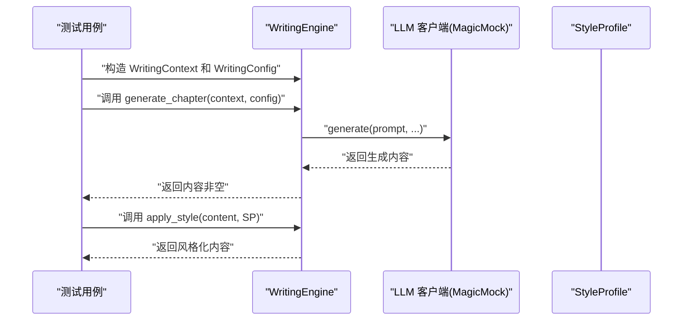
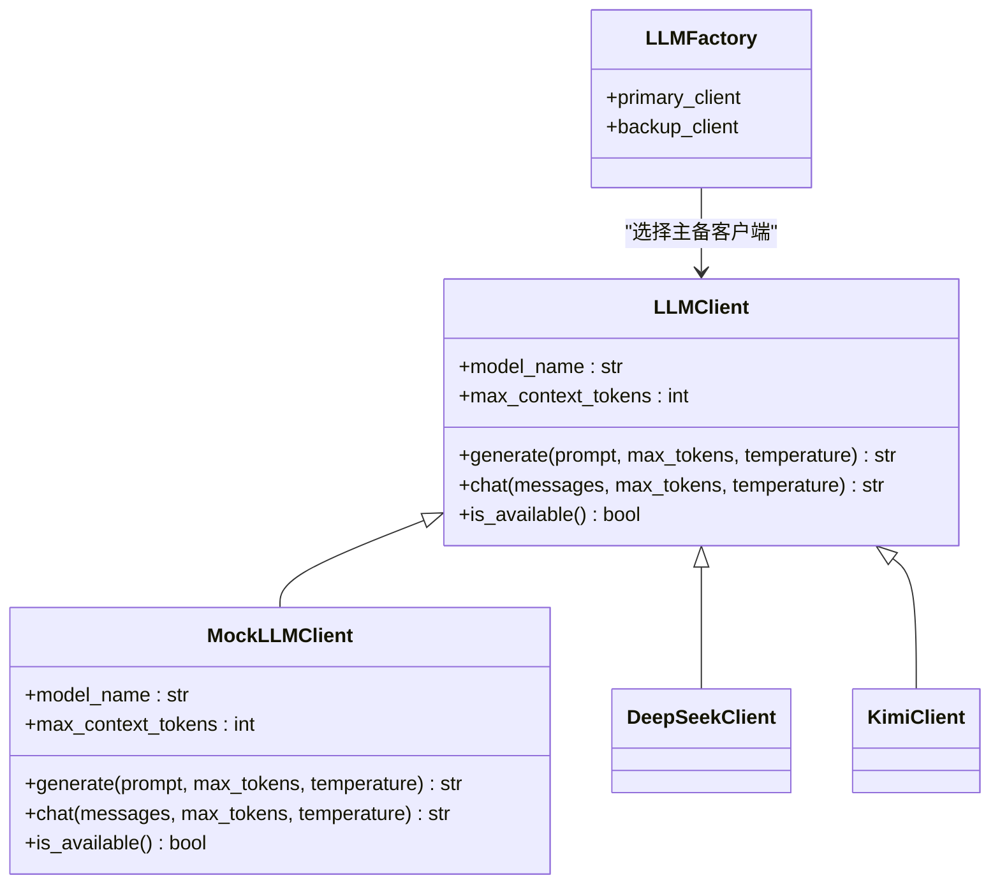
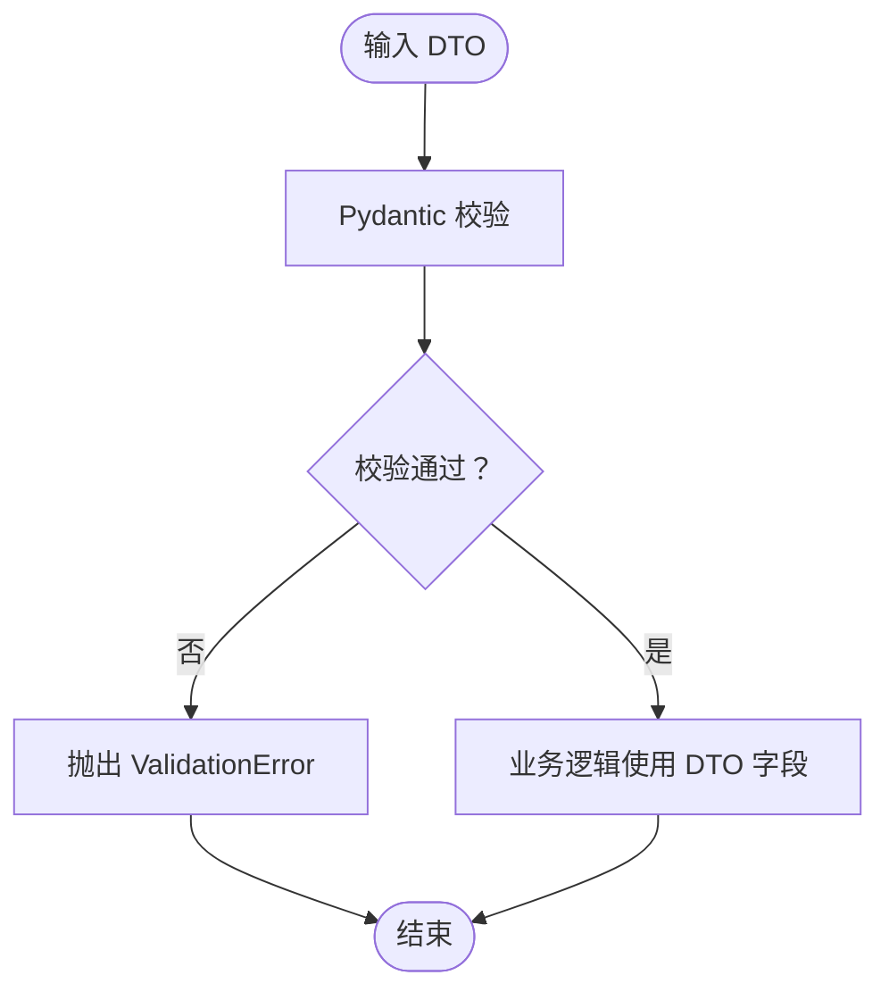
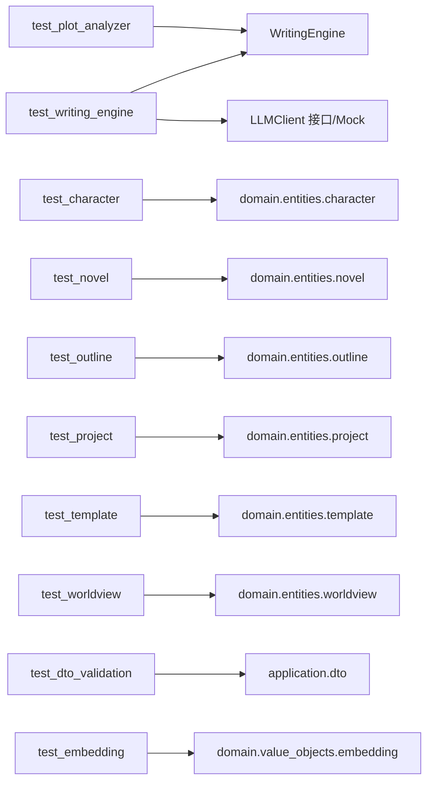

# 单元测试

<cite>
**本文引用的文件**
- [tests/unit/test_writing_engine.py](file://tests/unit/test_writing_engine.py)
- [tests/unit/test_llm_client.py](file://tests/unit/test_llm_client.py)
- [tests/unit/test_character.py](file://tests/unit/test_character.py)
- [tests/unit/test_novel.py](file://tests/unit/test_novel.py)
- [tests/unit/test_outline.py](file://tests/unit/test_outline.py)
- [tests/unit/test_project.py](file://tests/unit/test_project.py)
- [tests/unit/test_template.py](file://tests/unit/test_template.py)
- [tests/unit/test_worldview.py](file://tests/unit/test_worldview.py)
- [tests/unit/test_dto_validation.py](file://tests/unit/test_dto_validation.py)
- [tests/unit/test_embedding.py](file://tests/unit/test_embedding.py)
- [tests/unit/test_plot_analyzer.py](file://tests/unit/test_plot_analyzer.py)
- [tests/test_utils.py](file://tests/test_utils.py)
</cite>

## 目录
1. [简介](#简介)
2. [项目结构](#项目结构)
3. [核心组件](#核心组件)
4. [架构总览](#架构总览)
5. [详细组件分析](#详细组件分析)
6. [依赖分析](#依赖分析)
7. [性能考虑](#性能考虑)
8. [故障排查指南](#故障排查指南)
9. [结论](#结论)
10. [附录](#附录)

## 简介
本文件系统化梳理 InkTrace 项目的单元测试组织与实践，围绕“测试金字塔”理念，覆盖 AI 写作引擎、LLM 客户端、领域实体（小说、人物、大纲、项目、模板、世界观等）以及 DTO 校验、向量检索值对象、剧情分析服务等模块。文档重点阐述：
- 测试组织结构与分层策略
- 测试用例设计原则与编写规范
- Mock 对象、异步测试、测试数据准备与清理
- 典型业务逻辑、异常处理与边界条件的测试方法
- 测试覆盖率统计与改进策略
- 最佳实践与常见陷阱

## 项目结构
InkTrace 的单元测试位于 tests/unit 目录下，采用按功能域分层的组织方式：
- 领域服务与引擎：writing_engine、plot_analyzer
- LLM 客户端与工厂：llm_client、llm_client_improved、llm_config、llm_config_tdd
- 领域实体与值对象：character、novel、outline、project、template、worldview、embedding、types、value_objects
- 应用层 DTO 校验：dto_validation
- 基础工具：test_utils

```mermaid
graph TB
subgraph "测试层"
T1["tests/unit/test_writing_engine.py"]
T2["tests/unit/test_llm_client.py"]
T3["tests/unit/test_character.py"]
T4["tests/unit/test_novel.py"]
T5["tests/unit/test_outline.py"]
T6["tests/unit/test_project.py"]
T7["tests/unit/test_template.py"]
T8["tests/unit/test_worldview.py"]
T9["tests/unit/test_dto_validation.py"]
T10["tests/unit/test_embedding.py"]
T11["tests/unit/test_plot_analyzer.py"]
TU["tests/test_utils.py"]
end
subgraph "领域与基础设施"
D1["domain.services.writing_engine"]
D2["domain.entities.*"]
D3["domain.value_objects.*"]
D4["domain.types"]
I1["infrastructure.llm.*"]
A1["application.dto.*"]
end
T1 --> D1
T2 --> I1
T3 --> D2
T4 --> D2
T5 --> D2
T6 --> D2
T7 --> D2
T8 --> D2
T9 --> A1
T10 --> D3
T11 --> D1
TU --> D4
```

图表来源
- [tests/unit/test_writing_engine.py:1-133](file://tests/unit/test_writing_engine.py#L1-L133)
- [tests/unit/test_llm_client.py:1-134](file://tests/unit/test_llm_client.py#L1-L134)
- [tests/unit/test_character.py:1-245](file://tests/unit/test_character.py#L1-L245)
- [tests/unit/test_novel.py:1-345](file://tests/unit/test_novel.py#L1-L345)
- [tests/unit/test_outline.py:1-287](file://tests/unit/test_outline.py#L1-L287)
- [tests/unit/test_project.py:1-173](file://tests/unit/test_project.py#L1-L173)
- [tests/unit/test_template.py:1-193](file://tests/unit/test_template.py#L1-L193)
- [tests/unit/test_worldview.py:1-332](file://tests/unit/test_worldview.py#L1-L332)
- [tests/unit/test_dto_validation.py:1-264](file://tests/unit/test_dto_validation.py#L1-L264)
- [tests/unit/test_embedding.py:1-125](file://tests/unit/test_embedding.py#L1-L125)
- [tests/unit/test_plot_analyzer.py:1-158](file://tests/unit/test_plot_analyzer.py#L1-L158)
- [tests/test_utils.py:1-45](file://tests/test_utils.py#L1-L45)

章节来源
- [tests/unit/test_writing_engine.py:1-133](file://tests/unit/test_writing_engine.py#L1-L133)
- [tests/unit/test_llm_client.py:1-134](file://tests/unit/test_llm_client.py#L1-L134)
- [tests/unit/test_character.py:1-245](file://tests/unit/test_character.py#L1-L245)
- [tests/unit/test_novel.py:1-345](file://tests/unit/test_novel.py#L1-L345)
- [tests/unit/test_outline.py:1-287](file://tests/unit/test_outline.py#L1-L287)
- [tests/unit/test_project.py:1-173](file://tests/unit/test_project.py#L1-L173)
- [tests/unit/test_template.py:1-193](file://tests/unit/test_template.py#L1-L193)
- [tests/unit/test_worldview.py:1-332](file://tests/unit/test_worldview.py#L1-L332)
- [tests/unit/test_dto_validation.py:1-264](file://tests/unit/test_dto_validation.py#L1-L264)
- [tests/unit/test_embedding.py:1-125](file://tests/unit/test_embedding.py#L1-L125)
- [tests/unit/test_plot_analyzer.py:1-158](file://tests/unit/test_plot_analyzer.py#L1-L158)
- [tests/test_utils.py:1-45](file://tests/test_utils.py#L1-L45)

## 核心组件
本节聚焦关键测试模块与其覆盖范围，说明测试金字塔中的“单元层”职责与边界。

- AI 写作引擎与上下文
  - 测试要点：上下文构建、生成流程、剧情规划、风格应用
  - 关键断言：返回非空、异步调用被触发、列表长度与类型
  - 参考路径：[tests/unit/test_writing_engine.py:1-133](file://tests/unit/test_writing_engine.py#L1-L133)

- LLM 客户端与工厂
  - 测试要点：客户端创建、上下文 token 上限、工厂主备客户端选择
  - 关键断言：属性值、实例类型、可用性
  - 参考路径：[tests/unit/test_llm_client.py:1-134](file://tests/unit/test_llm_client.py#L1-L134)

- 领域实体与值对象
  - 人物：别名、能力、关系、状态、出场次数、角色判断
  - 小说：章节增删查、字数统计、角色管理、大纲设置、最新章节
  - 大纲：核心设定、分卷、主线/支线剧情、状态变更、按 ID 获取
  - 项目：配置对象、生命周期状态、名称更新、序列化/反序列化
  - 模板：人物/剧情模板、模板聚合、框架与文风引用、序列化/反序列化
  - 世界观：功法/势力/地点/物品、力量体系、一致性检查
  - 向量检索：嵌入元数据、搜索结果、向量存储配置
  - 参考路径：
    - [tests/unit/test_character.py:1-245](file://tests/unit/test_character.py#L1-L245)
    - [tests/unit/test_novel.py:1-345](file://tests/unit/test_novel.py#L1-L345)
    - [tests/unit/test_outline.py:1-287](file://tests/unit/test_outline.py#L1-L287)
    - [tests/unit/test_project.py:1-173](file://tests/unit/test_project.py#L1-L173)
    - [tests/unit/test_template.py:1-193](file://tests/unit/test_template.py#L1-L193)
    - [tests/unit/test_worldview.py:1-332](file://tests/unit/test_worldview.py#L1-L332)
    - [tests/unit/test_embedding.py:1-125](file://tests/unit/test_embedding.py#L1-L125)

- DTO 输入校验
  - 测试要点：Pydantic 校验、必填字段、默认值、非法值抛错
  - 参考路径：[tests/unit/test_dto_validation.py:1-264](file://tests/unit/test_dto_validation.py#L1-L264)

- 基础工具与通用断言
  - 测试要点：数值加法、相等/近似断言、零值处理
  - 参考路径：[tests/test_utils.py:1-45](file://tests/test_utils.py#L1-L45)

章节来源
- [tests/unit/test_writing_engine.py:1-133](file://tests/unit/test_writing_engine.py#L1-L133)
- [tests/unit/test_llm_client.py:1-134](file://tests/unit/test_llm_client.py#L1-L134)
- [tests/unit/test_character.py:1-245](file://tests/unit/test_character.py#L1-L245)
- [tests/unit/test_novel.py:1-345](file://tests/unit/test_novel.py#L1-L345)
- [tests/unit/test_outline.py:1-287](file://tests/unit/test_outline.py#L1-L287)
- [tests/unit/test_project.py:1-173](file://tests/unit/test_project.py#L1-L173)
- [tests/unit/test_template.py:1-193](file://tests/unit/test_template.py#L1-L193)
- [tests/unit/test_worldview.py:1-332](file://tests/unit/test_worldview.py#L1-L332)
- [tests/unit/test_embedding.py:1-125](file://tests/unit/test_embedding.py#L1-L125)
- [tests/unit/test_dto_validation.py:1-264](file://tests/unit/test_dto_validation.py#L1-L264)
- [tests/test_utils.py:1-45](file://tests/test_utils.py#L1-L45)

## 架构总览
单元测试在“测试金字塔”的底部，承担以下职责：
- 单元层：快速反馈、隔离外部依赖、保证核心算法与业务规则正确性
- 集成层：仓库/持久化、LLM 客户端交互、向量索引
- 端到端层：API 路由、前端集成

图表来源
- [tests/unit/test_writing_engine.py:1-133](file://tests/unit/test_writing_engine.py#L1-L133)
- [tests/unit/test_llm_client.py:1-134](file://tests/unit/test_llm_client.py#L1-L134)
- [tests/unit/test_character.py:1-245](file://tests/unit/test_character.py#L1-L245)
- [tests/unit/test_novel.py:1-345](file://tests/unit/test_novel.py#L1-L345)
- [tests/unit/test_outline.py:1-287](file://tests/unit/test_outline.py#L1-L287)
- [tests/unit/test_project.py:1-173](file://tests/unit/test_project.py#L1-L173)
- [tests/unit/test_template.py:1-193](file://tests/unit/test_template.py#L1-L193)
- [tests/unit/test_worldview.py:1-332](file://tests/unit/test_worldview.py#L1-L332)
- [tests/unit/test_embedding.py:1-125](file://tests/unit/test_embedding.py#L1-L125)
- [tests/unit/test_plot_analyzer.py:1-158](file://tests/unit/test_plot_analyzer.py#L1-L158)
- [tests/unit/test_dto_validation.py:1-264](file://tests/unit/test_dto_validation.py#L1-L264)

## 详细组件分析

### AI 写作引擎与上下文
- 设计要点
  - 使用 Mock 异步客户端，验证 generate/chat 是否被调用
  - 构造 WritingContext 与 WritingConfig，断言生成内容非空
  - 对 Outline 进行剧情规划，断言返回列表非空且包含节点
  - 应用 StyleProfile 对文本进行风格化处理
- 关键测试场景
  - 创建上下文并断言字段
  - 生成章节并断言异步调用
  - 规划剧情并断言节点数量
  - 应用风格并断言输出存在
- 参考路径：[tests/unit/test_writing_engine.py:1-133](file://tests/unit/test_writing_engine.py#L1-L133)

图表来源
- [tests/unit/test_writing_engine.py:58-111](file://tests/unit/test_writing_engine.py#L58-L111)

章节来源
- [tests/unit/test_writing_engine.py:1-133](file://tests/unit/test_writing_engine.py#L1-L133)

### LLM 客户端与工厂
- 设计要点
  - 继承抽象 LLMClient 并实现异步接口，用于 Mock
  - DeepSeek/Kimi 客户端创建与上下文 token 上限断言
  - 工厂根据配置选择主备客户端，断言实例类型
- 关键测试场景
  - 客户端创建与属性断言
  - 不同模型上下文大小断言
  - 工厂主备客户端选择断言
- 参考路径：[tests/unit/test_llm_client.py:1-134](file://tests/unit/test_llm_client.py#L1-L134)

图表来源
- [tests/unit/test_llm_client.py:19-38](file://tests/unit/test_llm_client.py#L19-L38)
- [tests/unit/test_llm_client.py:40-87](file://tests/unit/test_llm_client.py#L40-L87)
- [tests/unit/test_llm_client.py:89-118](file://tests/unit/test_llm_client.py#L89-L118)

章节来源
- [tests/unit/test_llm_client.py:1-134](file://tests/unit/test_llm_client.py#L1-L134)

### 领域实体与值对象

#### 人物实体
- 测试要点：别名去重、能力添加、关系增删查、状态更新、出场计数与首次出场保持
- 边界条件：重复别名、空字符串、不同角色类型
- 参考路径：[tests/unit/test_character.py:1-245](file://tests/unit/test_character.py#L1-L245)

#### 小说聚合根
- 测试要点：章节增删查、按编号查找、最新章节、角色管理、大纲设置、字数统计
- 边界条件：空章节列表、重复添加、字数计算
- 参考路径：[tests/unit/test_novel.py:1-345](file://tests/unit/test_novel.py#L1-L345)

#### 大纲聚合根
- 测试要点：核心设定更新、分卷增删查、主线/支线剧情添加、状态变更、按 ID 获取
- 边界条件：空集合、状态枚举转换
- 参考路径：[tests/unit/test_outline.py:1-287](file://tests/unit/test_outline.py#L1-L287)

#### 项目实体与配置
- 测试要点：默认/自定义配置、序列化/反序列化、状态切换（归档/激活）、名称更新校验
- 边界条件：空名称、重复状态操作
- 参考路径：[tests/unit/test_project.py:1-173](file://tests/unit/test_project.py#L1-L173)

#### 模板实体与模板值对象
- 测试要点：人物/剧情模板创建与序列化、模板聚合根添加模板、世界观框架与文风引用更新、完整序列化/反序列化
- 边界条件：空数组、内置标记
- 参考路径：[tests/unit/test_template.py:1-193](file://tests/unit/test_template.py#L1-L193)

#### 世界观聚合根与一致性检查
- 测试要点：功法/势力/地点/物品增删、力量体系设置；一致性检查器对等级与关系的校验
- 边界条件：等级越界、关系指向未知势力
- 参考路径：[tests/unit/test_worldview.py:1-332](file://tests/unit/test_worldview.py#L1-L332)

#### 向量检索值对象
- 测试要点：嵌入元数据、搜索结果、向量存储配置的创建与序列化
- 参考路径：[tests/unit/test_embedding.py:1-125](file://tests/unit/test_embedding.py#L1-L125)

章节来源
- [tests/unit/test_character.py:1-245](file://tests/unit/test_character.py#L1-L245)
- [tests/unit/test_novel.py:1-345](file://tests/unit/test_novel.py#L1-L345)
- [tests/unit/test_outline.py:1-287](file://tests/unit/test_outline.py#L1-L287)
- [tests/unit/test_project.py:1-173](file://tests/unit/test_project.py#L1-L173)
- [tests/unit/test_template.py:1-193](file://tests/unit/test_template.py#L1-L193)
- [tests/unit/test_worldview.py:1-332](file://tests/unit/test_worldview.py#L1-L332)
- [tests/unit/test_embedding.py:1-125](file://tests/unit/test_embedding.py#L1-L125)

### DTO 输入校验
- 测试要点：Pydantic 校验、必填字段、默认值、非法值抛错
- 场景覆盖：创建小说、生成章节、导入小说、分析小说、规划剧情、导出小说、更新章节、创建人物
- 参考路径：[tests/unit/test_dto_validation.py:1-264](file://tests/unit/test_dto_validation.py#L1-L264)

图表来源
- [tests/unit/test_dto_validation.py:48-96](file://tests/unit/test_dto_validation.py#L48-L96)
- [tests/unit/test_dto_validation.py:98-144](file://tests/unit/test_dto_validation.py#L98-L144)

章节来源
- [tests/unit/test_dto_validation.py:1-264](file://tests/unit/test_dto_validation.py#L1-L264)

### 基础工具与通用断言
- 测试要点：整数/浮点加法、相等与近似断言、零值处理
- 参考路径：[tests/test_utils.py:1-45](file://tests/test_utils.py#L1-L45)

章节来源
- [tests/test_utils.py:1-45](file://tests/test_utils.py#L1-L45)

### 剧情分析服务
- 测试要点：人物提取、时间线构建、伏笔提取、空输入处理、分析结果结构
- 参考路径：[tests/unit/test_plot_analyzer.py:1-158](file://tests/unit/test_plot_analyzer.py#L1-L158)

章节来源
- [tests/unit/test_plot_analyzer.py:1-158](file://tests/unit/test_plot_analyzer.py#L1-L158)

## 依赖分析
- 测试与被测模块的耦合
  - WritingEngine 测试依赖 LLM 客户端接口，通过 Mock 隔离真实网络调用
  - 实体测试依赖 types 与 value_objects，确保标识符与值对象行为正确
  - DTO 测试依赖 application.dto，验证输入约束
- 外部依赖
  - LLM 客户端通过工厂模式解耦，便于替换与测试
  - 向量检索值对象独立于具体向量库，利于单元测试

图表来源
- [tests/unit/test_writing_engine.py:10-44](file://tests/unit/test_writing_engine.py#L10-L44)
- [tests/unit/test_character.py:10-16](file://tests/unit/test_character.py#L10-L16)
- [tests/unit/test_novel.py:10-21](file://tests/unit/test_novel.py#L10-L21)
- [tests/unit/test_outline.py:10-15](file://tests/unit/test_outline.py#L10-L15)
- [tests/unit/test_project.py:10-15](file://tests/unit/test_project.py#L10-L15)
- [tests/unit/test_template.py:10-15](file://tests/unit/test_template.py#L10-L15)
- [tests/unit/test_worldview.py:10-22](file://tests/unit/test_worldview.py#L10-L22)
- [tests/unit/test_dto_validation.py:10-24](file://tests/unit/test_dto_validation.py#L10-L24)
- [tests/unit/test_embedding.py:10-13](file://tests/unit/test_embedding.py#L10-L13)
- [tests/unit/test_plot_analyzer.py:10-17](file://tests/unit/test_plot_analyzer.py#L10-L17)

章节来源
- [tests/unit/test_writing_engine.py:1-133](file://tests/unit/test_writing_engine.py#L1-L133)
- [tests/unit/test_llm_client.py:1-134](file://tests/unit/test_llm_client.py#L1-L134)
- [tests/unit/test_character.py:1-245](file://tests/unit/test_character.py#L1-L245)
- [tests/unit/test_novel.py:1-345](file://tests/unit/test_novel.py#L1-L345)
- [tests/unit/test_outline.py:1-287](file://tests/unit/test_outline.py#L1-L287)
- [tests/unit/test_project.py:1-173](file://tests/unit/test_project.py#L1-L173)
- [tests/unit/test_template.py:1-193](file://tests/unit/test_template.py#L1-L193)
- [tests/unit/test_worldview.py:1-332](file://tests/unit/test_worldview.py#L1-L332)
- [tests/unit/test_dto_validation.py:1-264](file://tests/unit/test_dto_validation.py#L1-L264)
- [tests/unit/test_embedding.py:1-125](file://tests/unit/test_embedding.py#L1-L125)
- [tests/unit/test_plot_analyzer.py:1-158](file://tests/unit/test_plot_analyzer.py#L1-L158)

## 性能考虑
- 测试执行效率
  - 优先使用内存级 Mock 与值对象，避免真实网络与磁盘 IO
  - 尽量复用 setUp 中的构造，减少重复对象创建
- 测试覆盖度
  - 以“可测试性”为导向重构复杂方法，拆分为更小的纯函数或值对象
  - 对热点路径（如向量检索、LLM 调用）增加边界与异常分支测试
- 可维护性
  - 保持测试命名与断言清晰，使用参数化测试覆盖多组输入
  - 对异步逻辑统一使用 AsyncMock，确保调用次数与顺序断言

## 故障排查指南
- 常见问题
  - Mock 未生效：确认使用 AsyncMock 替代异步方法，或使用继承 Mock 类实现接口
  - 断言失败：检查断言粒度与期望值，必要时使用更宽松的断言（如近似相等）
  - 异步测试超时：确保测试运行环境支持异步，或在 setUp 中显式注入事件循环
- 排查步骤
  - 逐步注释测试用例，定位失败用例
  - 打印关键中间状态（如实体集合长度、字典序列化结果）
  - 对比预期与实际的类型与结构

## 结论
InkTrace 的单元测试遵循测试金字塔底层为主的原则，通过 Mock 与值对象隔离外部依赖，覆盖 AI 写作引擎、LLM 客户端、领域实体与 DTO 校验等关键模块。建议持续扩展边界与异常分支测试，结合参数化与更细粒度的拆分，进一步提升覆盖率与可维护性。

## 附录

### 测试金字塔设计与组织
- 单元层（tests/unit）：快速、稳定、可重复
- 集成层（tests/integration）：仓库/向量/LLM API
- 端到端层（tests/e2e）：API 路由与桌面端 IPC

### 测试用例设计原则与编写规范
- 原则
  - 一个测试只验证一个行为
  - 使用 setUp 准备测试数据，tearDown 清理资源
  - 使用参数化覆盖多组输入
  - 对异步逻辑使用 AsyncMock
- 规范
  - 命名清晰：test_xxx_with_condition
  - 断言明确：优先断言结果而非副作用
  - 边界与异常：空值、越界、重复、非法格式
  - 数据准备：使用工厂方法或构造器，避免硬编码

### Mock 对象使用
- 常用模式
  - AsyncMock：异步方法调用验证
  - MagicMock：同步方法与属性
  - 继承抽象类：实现最小接口以满足被测代码依赖
- 示例路径
  - [tests/unit/test_writing_engine.py:30-34](file://tests/unit/test_writing_engine.py#L30-L34)
  - [tests/unit/test_llm_client.py:19-38](file://tests/unit/test_llm_client.py#L19-L38)

### 异步测试处理
- 使用 unittest.IsolatedAsyncioTestCase 或在测试中显式 await
- 对返回值与调用次数进行断言
- 示例路径
  - [tests/unit/test_writing_engine.py:30-34](file://tests/unit/test_writing_engine.py#L30-L34)

### 测试数据准备与清理
- setUp：构造实体、值对象、Mock
- tearDown：释放资源（如临时文件句柄），但单元测试通常无需清理
- 示例路径
  - [tests/unit/test_character.py:21-28](file://tests/unit/test_character.py#L21-L28)
  - [tests/unit/test_novel.py:26-32](file://tests/unit/test_novel.py#L26-L32)

### 具体测试示例（路径指引）
- 写作引擎生成章节
  - [tests/unit/test_writing_engine.py:58-75](file://tests/unit/test_writing_engine.py#L58-L75)
- LLM 客户端上下文上限
  - [tests/unit/test_llm_client.py:53-87](file://tests/unit/test_llm_client.py#L53-L87)
- 人物关系增删查
  - [tests/unit/test_character.py:96-141](file://tests/unit/test_character.py#L96-L141)
- 小说章节与字数统计
  - [tests/unit/test_novel.py:51-103](file://tests/unit/test_novel.py#L51-L103)
- 大纲剧情状态变更
  - [tests/unit/test_outline.py:149-171](file://tests/unit/test_outline.py#L149-L171)
- 项目状态切换与名称更新
  - [tests/unit/test_project.py:91-142](file://tests/unit/test_project.py#L91-L142)
- 模板聚合与序列化
  - [tests/unit/test_template.py:120-189](file://tests/unit/test_template.py#L120-L189)
- 世界观一致性检查
  - [tests/unit/test_worldview.py:270-328](file://tests/unit/test_worldview.py#L270-L328)
- DTO 校验与默认值
  - [tests/unit/test_dto_validation.py:48-96](file://tests/unit/test_dto_validation.py#L48-L96)
- 向量检索值对象
  - [tests/unit/test_embedding.py:18-58](file://tests/unit/test_embedding.py#L18-L58)
- 剧情分析结果结构
  - [tests/unit/test_plot_analyzer.py:42-103](file://tests/unit/test_plot_analyzer.py#L42-L103)

### 测试覆盖率统计与改进策略
- 统计方法
  - 使用覆盖率工具（如 coverage.py）收集单元测试覆盖率
  - 分模块统计：领域服务、实体、值对象、DTO、LLM 客户端
- 改进策略
  - 提升边界与异常分支覆盖率：空输入、越界、重复、非法格式
  - 参数化测试：多组输入组合，减少重复用例
  - 重构不可测试代码：拆分复杂函数、引入纯函数与值对象