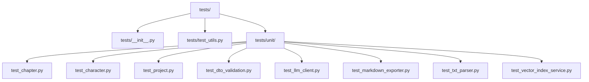
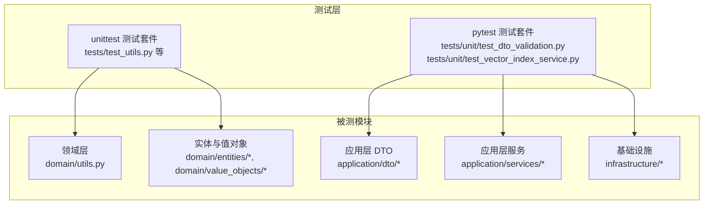
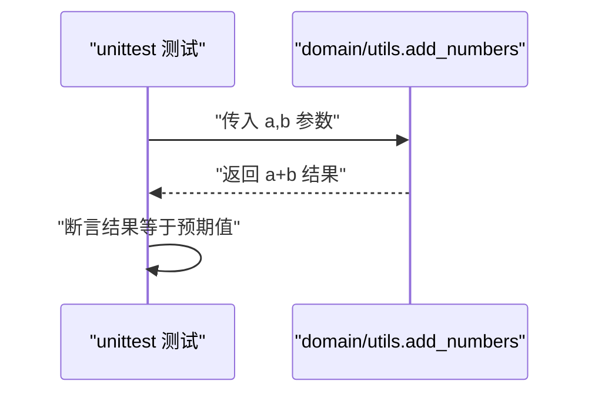
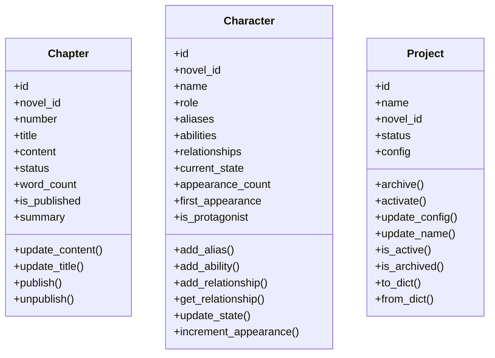
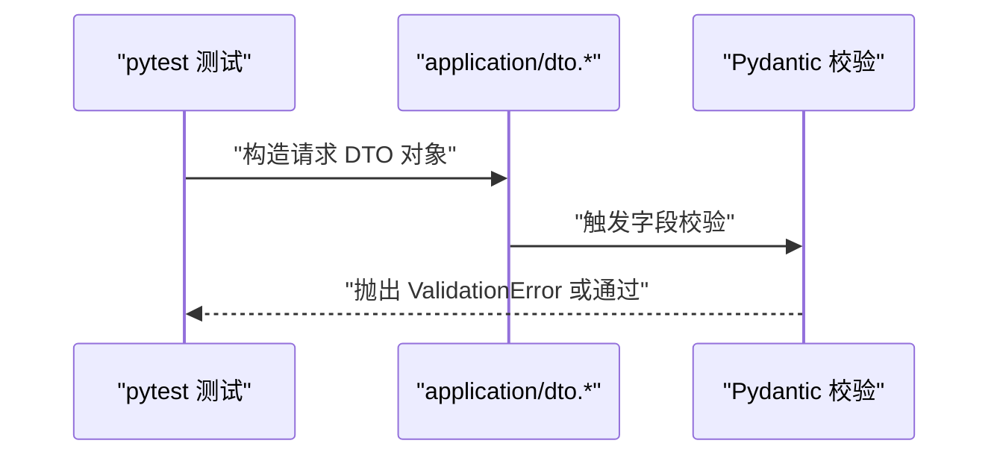
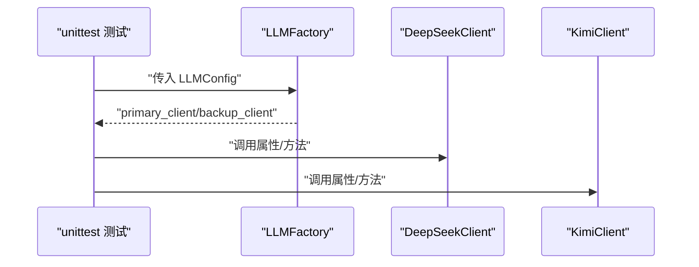
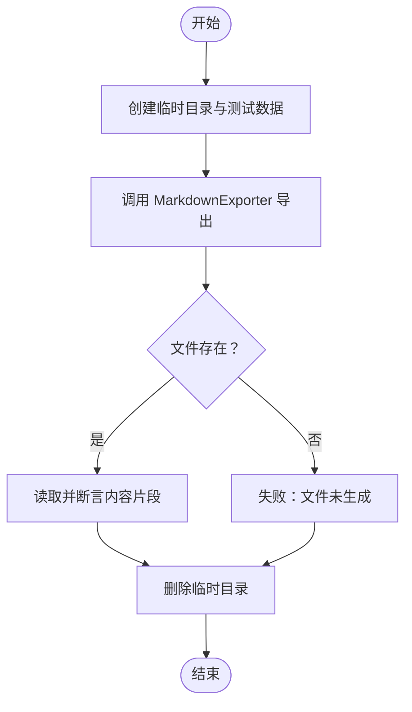
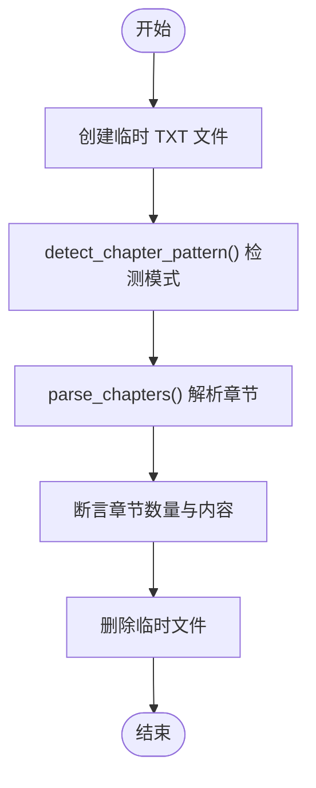
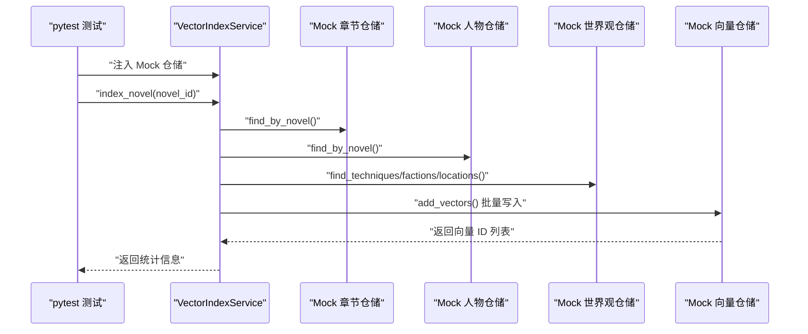
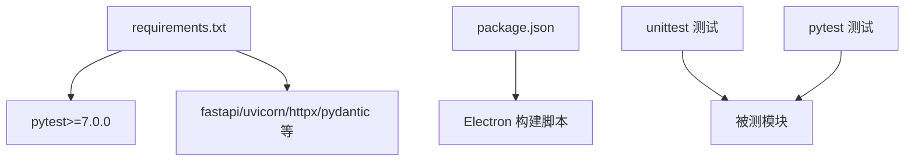

# 测试工具与管理

<cite>
**本文引用的文件**
- [tests/__init__.py](file://tests/__init__.py)
- [tests/test_utils.py](file://tests/test_utils.py)
- [tests/unit/test_chapter.py](file://tests/unit/test_chapter.py)
- [tests/unit/test_character.py](file://tests/unit/test_character.py)
- [tests/unit/test_project.py](file://tests/unit/test_project.py)
- [tests/unit/test_dto_validation.py](file://tests/unit/test_dto_validation.py)
- [tests/unit/test_llm_client.py](file://tests/unit/test_llm_client.py)
- [tests/unit/test_markdown_exporter.py](file://tests/unit/test_markdown_exporter.py)
- [tests/unit/test_txt_parser.py](file://tests/unit/test_txt_parser.py)
- [tests/unit/test_vector_index_service.py](file://tests/unit/test_vector_index_service.py)
- [domain/utils.py](file://domain/utils.py)
- [requirements.txt](file://requirements.txt)
- [package.json](file://package.json)
</cite>

## 目录
1. [简介](#简介)
2. [项目结构](#项目结构)
3. [核心组件](#核心组件)
4. [架构总览](#架构总览)
5. [详细组件分析](#详细组件分析)
6. [依赖分析](#依赖分析)
7. [性能考虑](#性能考虑)
8. [故障排查指南](#故障排查指南)
9. [结论](#结论)
10. [附录](#附录)

## 简介
本文件面向 InkTrace 项目的测试工具与管理体系，系统性介绍测试框架选择与配置（unittest 与 pytest 并存）、测试依赖与版本管理、测试数据生成与清理策略、测试报告与覆盖率统计、测试环境搭建与 CI/CD 集成、以及测试维护最佳实践与团队协作规范。文档以仓库现有测试代码为基础，结合依赖清单与前端 package 配置，给出可操作的实施建议。

## 项目结构
InkTrace 的测试组织采用按功能域划分的层次化目录结构，核心位于 tests/ 下，包含：
- tests/__init__.py：测试包入口
- tests/test_utils.py：通用工具函数的单元测试
- tests/unit/：按领域与应用层划分的单元测试集合，覆盖实体、DTO、基础设施与应用服务等

图表来源
- [tests/__init__.py](file://tests/__init__.py)
- [tests/test_utils.py](file://tests/test_utils.py)
- [tests/unit/test_chapter.py](file://tests/unit/test_chapter.py)
- [tests/unit/test_character.py](file://tests/unit/test_character.py)
- [tests/unit/test_project.py](file://tests/unit/test_project.py)
- [tests/unit/test_dto_validation.py](file://tests/unit/test_dto_validation.py)
- [tests/unit/test_llm_client.py](file://tests/unit/test_llm_client.py)
- [tests/unit/test_markdown_exporter.py](file://tests/unit/test_markdown_exporter.py)
- [tests/unit/test_txt_parser.py](file://tests/unit/test_txt_parser.py)
- [tests/unit/test_vector_index_service.py](file://tests/unit/test_vector_index_service.py)

章节来源
- [tests/__init__.py](file://tests/__init__.py)
- [tests/test_utils.py](file://tests/test_utils.py)
- [tests/unit/test_chapter.py](file://tests/unit/test_chapter.py)
- [tests/unit/test_character.py](file://tests/unit/test_character.py)
- [tests/unit/test_project.py](file://tests/unit/test_project.py)
- [tests/unit/test_dto_validation.py](file://tests/unit/test_dto_validation.py)
- [tests/unit/test_llm_client.py](file://tests/unit/test_llm_client.py)
- [tests/unit/test_markdown_exporter.py](file://tests/unit/test_markdown_exporter.py)
- [tests/unit/test_txt_parser.py](file://tests/unit/test_txt_parser.py)
- [tests/unit/test_vector_index_service.py](file://tests/unit/test_vector_index_service.py)

## 核心组件
- 测试框架与运行方式
  - unittest：作为 Python 标准库，广泛用于多数单元测试文件，支持断言、setUp/tearDown 生命周期钩子与独立运行入口。
  - pytest：在部分 DTO 校验与向量索引服务测试中使用，具备更丰富的 fixtures、参数化与标记能力，便于复杂场景测试。
- 测试依赖与版本控制
  - requirements.txt 中声明 pytest>=7.0.0，表明项目具备 pytest 运行能力；同时包含 fastapi、uvicorn、httpx、pydantic 等后端依赖。
  - package.json 展示了前端 Electron 构建脚本与依赖，虽非测试直接依赖，但对端到端测试与桌面应用打包相关联。
- 测试数据管理
  - 通过临时目录与文件进行测试数据的生成、读写与清理，确保测试隔离与幂等性。
- 测试报告与覆盖率
  - 当前仓库未内置覆盖率与报告生成配置；建议在 CI 中引入覆盖率统计与报告输出，以量化测试质量。

章节来源
- [requirements.txt](file://requirements.txt)
- [package.json](file://package.json)

## 架构总览
下图展示测试执行在不同模块中的分布与交互关系，体现测试框架（unittest/pytest）与被测模块（领域、应用、基础设施）之间的映射。

图表来源
- [tests/test_utils.py](file://tests/test_utils.py)
- [tests/unit/test_dto_validation.py](file://tests/unit/test_dto_validation.py)
- [tests/unit/test_vector_index_service.py](file://tests/unit/test_vector_index_service.py)
- [domain/utils.py](file://domain/utils.py)

## 详细组件分析

### 工具函数测试（domain/utils.py）
- 目标：验证 add_numbers 的数值加法行为，覆盖正数、负数、浮点与零值场景。
- 断言策略：使用 assertEqual/assertAlmostEqual 确保数值精度与边界条件正确。
- 运行方式：unittest 单独运行入口，适合快速验证简单逻辑。

图表来源
- [tests/test_utils.py](file://tests/test_utils.py)
- [domain/utils.py](file://domain/utils.py)

章节来源
- [tests/test_utils.py](file://tests/test_utils.py)
- [domain/utils.py](file://domain/utils.py)

### 实体与值对象测试（Chapter/Character/Project）
- Chapter 实体测试要点：创建、字数统计、内容/标题更新、发布/取消发布状态变更、摘要字段、异常场景（重复发布/草稿取消发布）。
- Character 实体测试要点：角色创建、别名与能力添加、人物关系增删查、状态更新、出场计数与首次出场保持。
- Project 实体测试要点：默认与自定义配置、序列化/反序列化、归档/激活状态切换、名称更新与空值校验。

图表来源
- [tests/unit/test_chapter.py](file://tests/unit/test_chapter.py)
- [tests/unit/test_character.py](file://tests/unit/test_character.py)
- [tests/unit/test_project.py](file://tests/unit/test_project.py)

章节来源
- [tests/unit/test_chapter.py](file://tests/unit/test_chapter.py)
- [tests/unit/test_character.py](file://tests/unit/test_character.py)
- [tests/unit/test_project.py](file://tests/unit/test_project.py)

### DTO 输入校验测试（Pydantic）
- 使用 pytest 驱动，基于 Pydantic 模型进行输入校验，覆盖多种请求 DTO 的合法与非法输入组合。
- 关键点：空标题/空名称、负数目标字数、无效章节数、默认值推断、上下文字段透传。

图表来源
- [tests/unit/test_dto_validation.py](file://tests/unit/test_dto_validation.py)

章节来源
- [tests/unit/test_dto_validation.py](file://tests/unit/test_dto_validation.py)

### 大模型客户端与工厂测试（Mock 与工厂模式）
- 使用 unittest 与 Mock，验证 DeepSeek/Kimi 客户端配置、上下文长度、工厂主备客户端选择。
- 接口契约测试：通过 MockLLMClient 确保抽象接口一致性。

图表来源
- [tests/unit/test_llm_client.py](file://tests/unit/test_llm_client.py)

章节来源
- [tests/unit/test_llm_client.py](file://tests/unit/test_llm_client.py)

### Markdown 导出器测试（文件 IO 与格式化）
- 使用临时目录与文件进行导出与读取，验证章节与小说导出格式、元数据格式化。
- 清理策略：通过 tearDown 删除临时目录，避免污染测试环境。

图表来源
- [tests/unit/test_markdown_exporter.py](file://tests/unit/test_markdown_exporter.py)

章节来源
- [tests/unit/test_markdown_exporter.py](file://tests/unit/test_markdown_exporter.py)

### TXT 解析器测试（文本解析与章节检测）
- 覆盖数字/中文数字章节标题识别、章节切分、大纲解析、字数统计与空文件处理。
- 通过临时文件与模式检测，保证解析器在不同文本格式下的鲁棒性。

图表来源
- [tests/unit/test_txt_parser.py](file://tests/unit/test_txt_parser.py)

章节来源
- [tests/unit/test_txt_parser.py](file://tests/unit/test_txt_parser.py)

### 向量索引服务测试（集成与分块策略）
- 使用 pytest fixtures 与 Mock，验证章节/人物/世界观内容的向量化索引流程、分块策略、索引状态查询与删除。
- 关键点：短/长内容分块、最小字段内容构建、批量向量写入与计数。

图表来源
- [tests/unit/test_vector_index_service.py](file://tests/unit/test_vector_index_service.py)

章节来源
- [tests/unit/test_vector_index_service.py](file://tests/unit/test_vector_index_service.py)

## 依赖分析
- 测试框架依赖
  - unittest：Python 标准库，无需额外安装，适用于大多数单元测试。
  - pytest：requirements.txt 明确声明 pytest>=7.0.0，可直接使用 pytest 运行器与高级特性。
- 被测模块依赖
  - 基于 Pydantic 的 DTO 校验：pytest 测试中直接触发校验错误。
  - 基础设施与应用服务：通过 Mock 与工厂模式解耦，便于测试隔离。
- 前端构建与测试关联
  - package.json 提供 Electron 构建脚本，若需桌面端端到端测试，可在 CI 中集成 Electron 应用启动与 UI 自动化。

图表来源
- [requirements.txt](file://requirements.txt)
- [package.json](file://package.json)

章节来源
- [requirements.txt](file://requirements.txt)
- [package.json](file://package.json)

## 性能考虑
- 测试执行性能
  - 尽量使用 Mock 与内存数据，避免真实外部依赖（数据库、网络、文件系统）带来的性能抖动。
  - 对长文本分块逻辑（如向量索引服务）进行基准测试，评估 chunk_size/chunk_overlap 对性能与召回的影响。
- 测试隔离与并发
  - 通过临时目录与唯一标识符确保测试并发执行时的隔离性。
  - 将 CPU 密集型测试（如向量嵌入）拆分为独立用例，减少相互干扰。
- 报告与覆盖率
  - 在 CI 中启用覆盖率统计（如 pytest-cov），关注关键路径与分支覆盖率，持续优化测试矩阵。

## 故障排查指南
- 常见问题定位
  - 文件 IO 失败：确认临时目录创建与权限，检查 tearDown 是否正常清理。
  - DTO 校验失败：核对 Pydantic 字段约束与默认值，必要时打印校验错误详情。
  - Mock 行为不符：检查 Mock 方法返回值与调用次数断言，确保替身对象与真实对象接口一致。
- 日志与调试
  - 在 CI 中开启详细日志输出，收集测试执行时间与失败堆栈。
  - 对外部依赖（如 LLM 客户端）增加可用性检查与超时控制，避免阻塞测试。

章节来源
- [tests/unit/test_markdown_exporter.py](file://tests/unit/test_markdown_exporter.py)
- [tests/unit/test_dto_validation.py](file://tests/unit/test_dto_validation.py)
- [tests/unit/test_llm_client.py](file://tests/unit/test_llm_client.py)

## 结论
InkTrace 的测试体系以 unittest 为主、pytest 为辅，覆盖领域工具、实体与值对象、DTO 校验、基础设施与应用服务等关键模块。通过 Mock 与临时文件管理实现测试隔离，结合 CI 可进一步引入覆盖率与报告生成，形成闭环的质量保障流程。建议后续补充桌面端 UI 自动化与端到端测试，完善测试金字塔。

## 附录

### 测试框架选择与配置
- unittest
  - 适用场景：简单函数与实体逻辑验证，标准库无需额外依赖。
  - 配置要点：每个测试类继承 unittest.TestCase，使用 setUp/tearDown 管理资源，独立运行入口。
- pytest
  - 适用场景：复杂 fixtures、参数化、标记与插件扩展。
  - 配置要点：requirements.txt 已声明 pytest>=7.0.0，可直接使用 pytest 运行器与高级断言。

章节来源
- [requirements.txt](file://requirements.txt)
- [tests/test_utils.py](file://tests/test_utils.py)
- [tests/unit/test_dto_validation.py](file://tests/unit/test_dto_validation.py)

### 测试数据管理策略
- 生成：在 setUp 中构造最小化测试数据，避免冗余。
- 存储：优先使用内存对象；需要持久化时使用临时目录与唯一文件名。
- 清理：在 tearDown 中删除临时文件与目录，防止跨会话污染。

章节来源
- [tests/unit/test_markdown_exporter.py](file://tests/unit/test_markdown_exporter.py)
- [tests/unit/test_txt_parser.py](file://tests/unit/test_txt_parser.py)

### 测试报告与覆盖率
- 建议在 CI 中集成覆盖率统计（如 pytest-cov），并生成 HTML 报告，定期审查低覆盖率模块。
- 将测试报告与制品一起归档，便于回溯与审计。

### 测试环境搭建与 CI/CD 集成
- 本地开发
  - 安装依赖：pip install -r requirements.txt
  - 运行 unittest：python -m tests.test_utils 或 python -m unittest tests.test_utils.TestAddNumbers
  - 运行 pytest：pytest tests/unit/test_dto_validation.py -v
- CI/CD
  - 步骤建议：安装依赖 → 运行 pytest（含覆盖率）→ 生成报告 → 归档制品
  - 若涉及桌面端，可在 CI 中执行 Electron 构建脚本（package.json 中的 build:* 脚本）

章节来源
- [requirements.txt](file://requirements.txt)
- [package.json](file://package.json)

### 团队协作规范
- 提交前检查
  - 本地运行所有相关测试，确保新增/修改代码不破坏既有断言。
- 测试命名与组织
  - 测试文件与被测模块一一对应，测试方法命名清晰描述预期行为。
- 依赖与版本
  - 统一通过 requirements.txt 管理测试依赖版本，避免环境漂移。
- 文档与注释
  - 重要测试用例添加简要注释，说明边界条件与异常路径。