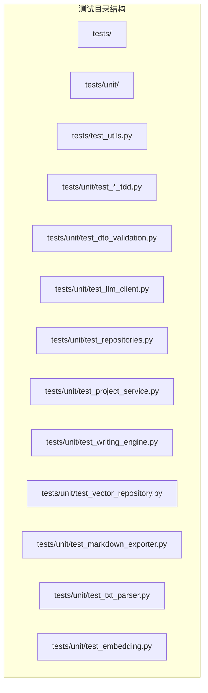
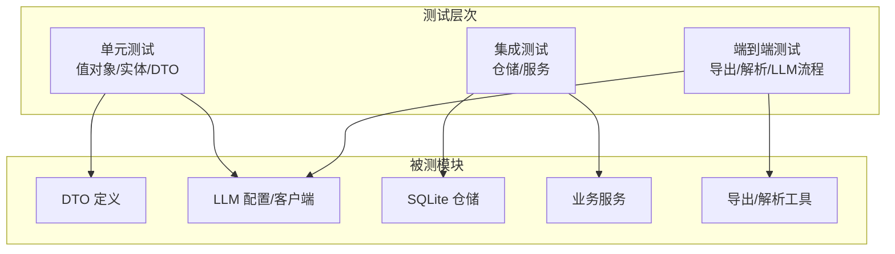
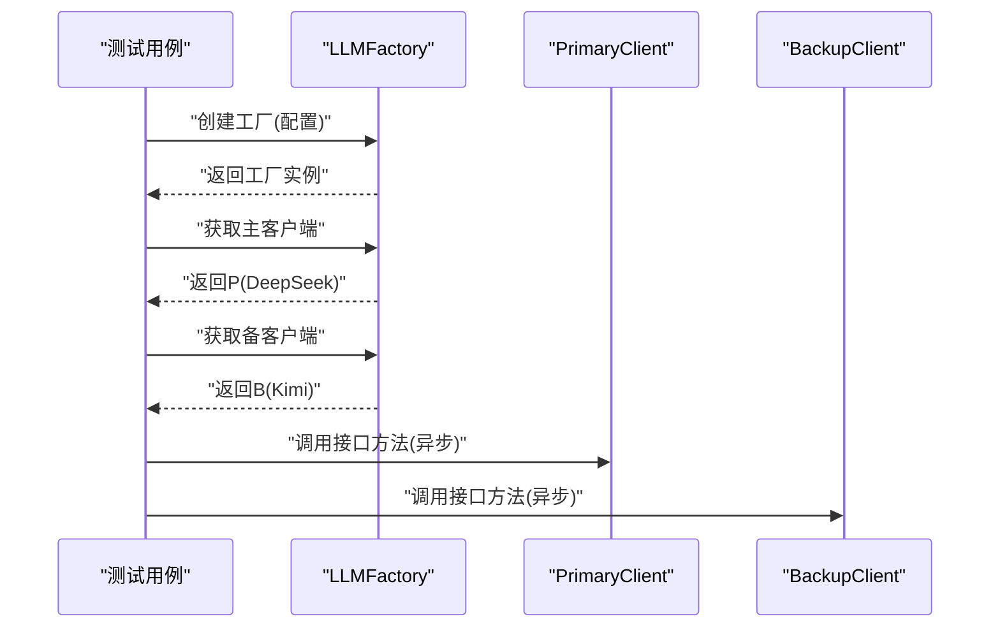
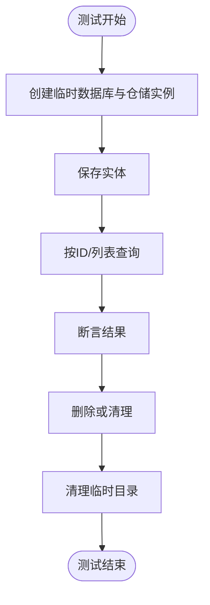
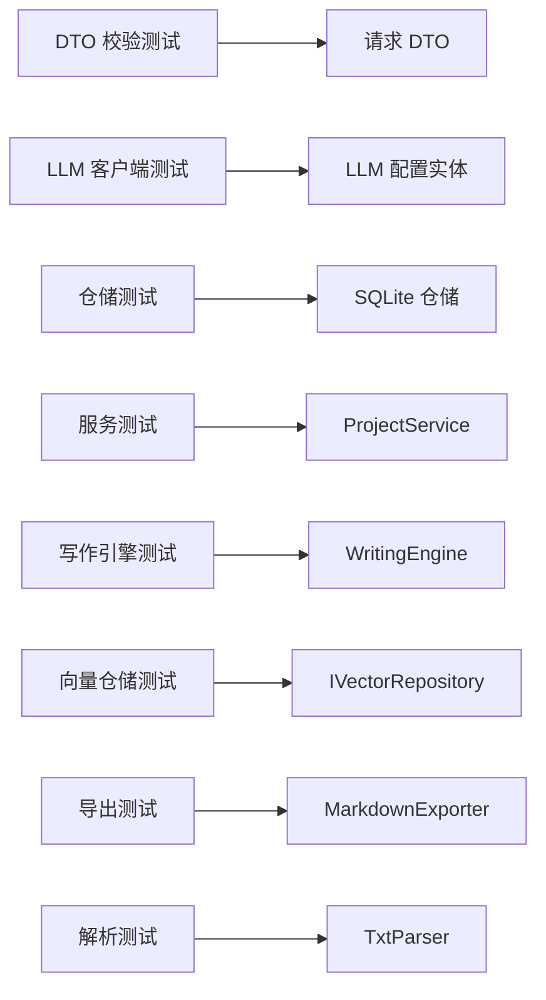

# 测试最佳实践

<cite>
**本文引用的文件**
- [tests/__init__.py](file://tests/__init__.py)
- [tests/test_utils.py](file://tests/test_utils.py)
- [tests/unit/__init__.py](file://tests/unit/__init__.py)
- [tests/unit/test_dto_validation.py](file://tests/unit/test_dto_validation.py)
- [tests/unit/test_llm_config_tdd.py](file://tests/unit/test_llm_config_tdd.py)
- [tests/unit/test_llm_client.py](file://tests/unit/test_llm_client.py)
- [tests/unit/test_repositories.py](file://tests/unit/test_repositories.py)
- [tests/unit/test_project_service.py](file://tests/unit/test_project_service.py)
- [tests/unit/test_writing_engine.py](file://tests/unit/test_writing_engine.py)
- [tests/unit/test_vector_repository.py](file://tests/unit/test_vector_repository.py)
- [tests/unit/test_markdown_exporter.py](file://tests/unit/test_markdown_exporter.py)
- [tests/unit/test_txt_parser.py](file://tests/unit/test_txt_parser.py)
- [tests/unit/test_embedding.py](file://tests/unit/test_embedding.py)
- [domain/entities/llm_config.py](file://domain/entities/llm_config.py)
- [application/dto/request_dto.py](file://application/dto/request_dto.py)
</cite>

## 目录
1. [引言](#引言)
2. [项目结构](#项目结构)
3. [核心组件](#核心组件)
4. [架构总览](#架构总览)
5. [详细组件分析](#详细组件分析)
6. [依赖分析](#依赖分析)
7. [性能考虑](#性能考虑)
8. [故障排查指南](#故障排查指南)
9. [结论](#结论)
10. [附录](#附录)

## 引言
本指南面向 InkTrace 项目的测试编写与维护，系统总结测试规范、TDD 实践、数据组织与共享、隔离与并发、调试与问题定位以及测试维护与重构策略。文档以现有测试代码为依据，结合 DTO 校验、LLM 配置与客户端、仓储层、服务层与导出/解析工具等关键模块，给出可操作的最佳实践建议。

## 项目结构
测试代码主要位于 tests 目录下，按“单元测试”分组，覆盖 DTO、LLM、仓储、服务、导出与解析、值对象等多个领域。测试组织遵循“按模块/功能分层”的思路，便于定位与维护。

图表来源
- [tests/__init__.py:1-5](file://tests/__init__.py#L1-L5)
- [tests/unit/__init__.py:1-10](file://tests/unit/__init__.py#L1-L10)

章节来源
- [tests/__init__.py:1-5](file://tests/__init__.py#L1-L5)
- [tests/unit/__init__.py:1-10](file://tests/unit/__init__.py#L1-L10)

## 核心组件
- DTO 输入校验测试：基于 Pydantic 的请求 DTO，覆盖字段长度、数值范围、可选字段与上下文字段的正确性与异常场景。
- LLM 配置与客户端测试：验证配置实体的有效性、工厂与客户端接口、模拟客户端行为与可用性判断。
- 仓储层测试：SQLite 仓储的 CRUD 与查询能力，含临时数据库与资源清理。
- 服务层测试：服务编排与仓储交互，使用 Mock 验证调用次数与参数。
- 导出与解析测试：Markdown 导出器与 TXT 解析器的功能与边界条件。
- 值对象测试：向量检索与嵌入元数据的序列化/反序列化与默认值。

章节来源
- [tests/unit/test_dto_validation.py:1-264](file://tests/unit/test_dto_validation.py#L1-L264)
- [tests/unit/test_llm_client.py:1-134](file://tests/unit/test_llm_client.py#L1-L134)
- [tests/unit/test_repositories.py:1-310](file://tests/unit/test_repositories.py#L1-L310)
- [tests/unit/test_project_service.py:1-130](file://tests/unit/test_project_service.py#L1-L130)
- [tests/unit/test_writing_engine.py:1-133](file://tests/unit/test_writing_engine.py#L1-L133)
- [tests/unit/test_vector_repository.py:1-262](file://tests/unit/test_vector_repository.py#L1-L262)
- [tests/unit/test_markdown_exporter.py:1-154](file://tests/unit/test_markdown_exporter.py#L1-L154)
- [tests/unit/test_txt_parser.py:1-229](file://tests/unit/test_txt_parser.py#L1-L229)
- [tests/unit/test_embedding.py:1-125](file://tests/unit/test_embedding.py#L1-L125)

## 架构总览
测试金字塔在 InkTrace 中体现为：底层为值对象与实体单元测试；中间为仓储与服务层测试；顶层为集成与端到端场景（如导出/解析）。DTO 校验贯穿应用层，作为输入质量的第一道防线。

## 详细组件分析

### DTO 输入校验测试
- 测试目标：验证 Pydantic DTO 的字段约束、默认值与上下文字段。
- 规范要点：
  - 使用 pytest 进行断言，异常场景使用 raises 验证。
  - 为每类 DTO 编写“有效场景 + 边界/异常场景”的完整集。
  - 对可选字段与默认值进行显式断言，避免隐式假设。
- 示例参考
  - 基础请求与上下文字段断言：[tests/unit/test_dto_validation.py:26-46](file://tests/unit/test_dto_validation.py#L26-L46)
  - 创建小说请求的字段长度与数值范围：[tests/unit/test_dto_validation.py:48-96](file://tests/unit/test_dto_validation.py#L48-L96)
  - 生成章节请求的默认值与无效参数：[tests/unit/test_dto_validation.py:98-144](file://tests/unit/test_dto_validation.py#L98-L144)
  - 导入/分析/导出/更新/创建人物请求的字段约束：[tests/unit/test_dto_validation.py:146-260](file://tests/unit/test_dto_validation.py#L146-L260)

```mermaid
classDiagram
class BaseRequest {
+user_id : str?
+session_id : str?
+trace_id : str?
}
class CreateNovelRequest {
+title : str
+author : str
+genre : str
+target_word_count : int
+options : dict?
}
class GenerateChapterRequest {
+novel_id : str
+goal : str
+constraints : list?
+context_summary : str?
+chapter_count : int
+target_word_count : int
+options : dict?
}
BaseRequest <|-- CreateNovelRequest
BaseRequest <|-- GenerateChapterRequest
```

图表来源
- [application/dto/request_dto.py:14-97](file://application/dto/request_dto.py#L14-L97)

章节来源
- [tests/unit/test_dto_validation.py:1-264](file://tests/unit/test_dto_validation.py#L1-L264)
- [application/dto/request_dto.py:1-97](file://application/dto/request_dto.py#L1-L97)

### LLM 配置与客户端测试
- 测试目标：验证配置实体有效性、工厂选择主备客户端、客户端接口一致性与可用性。
- 规范要点：
  - 使用 unittest 或 pytest，必要时结合 AsyncMock/MagicMock。
  - 通过临时配置与工厂实例验证客户端类型与属性。
  - 对模拟客户端进行接口契约测试，确保异步方法签名一致。
- 示例参考
  - 配置实体有效性与默认时间戳：[domain/entities/llm_config.py:15-54](file://domain/entities/llm_config.py#L15-L54)
  - 工厂与客户端创建、主备客户端类型断言：[tests/unit/test_llm_client.py:89-118](file://tests/unit/test_llm_client.py#L89-L118)
  - 接口一致性与模拟客户端行为：[tests/unit/test_llm_client.py:19-38](file://tests/unit/test_llm_client.py#L19-L38)

图表来源
- [tests/unit/test_llm_client.py:89-118](file://tests/unit/test_llm_client.py#L89-L118)

章节来源
- [domain/entities/llm_config.py:1-54](file://domain/entities/llm_config.py#L1-L54)
- [tests/unit/test_llm_client.py:1-134](file://tests/unit/test_llm_client.py#L1-L134)

### 仓储层测试（SQLite）
- 测试目标：验证仓储的保存、查询、删除与分页/最新记录等查询能力。
- 规范要点：
  - 使用临时目录与临时数据库，setUp 创建，tearDown 清理。
  - 对边界条件（空集合、单条、多条）分别断言。
  - 关注时间戳与状态枚举的一致性。
- 示例参考
  - 小说仓储保存/查找/删除：[tests/unit/test_repositories.py:43-110](file://tests/unit/test_repositories.py#L43-L110)
  - 章节仓储按小说查询与最新记录：[tests/unit/test_repositories.py:130-190](file://tests/unit/test_repositories.py#L130-L190)
  - 人物与大纲仓储按小说查询：[tests/unit/test_repositories.py:210-306](file://tests/unit/test_repositories.py#L210-L306)

图表来源
- [tests/unit/test_repositories.py:29-42](file://tests/unit/test_repositories.py#L29-L42)

章节来源
- [tests/unit/test_repositories.py:1-310](file://tests/unit/test_repositories.py#L1-L310)

### 服务层测试（ProjectService）
- 测试目标：验证服务层对仓储的编排与调用，关注参数传递与调用次数。
- 规范要点：
  - 使用 Mock 替换仓储，断言 save/find/delete 等调用。
  - 对不存在与存在两种场景分别断言返回值。
  - 对状态变更（归档）进行状态断言。
- 示例参考
  - 创建/获取/列表/删除/归档项目：[tests/unit/test_project_service.py:28-126](file://tests/unit/test_project_service.py#L28-L126)

章节来源
- [tests/unit/test_project_service.py:1-130](file://tests/unit/test_project_service.py#L1-L130)

### 写作引擎测试（WritingEngine）
- 测试目标：验证上下文构建、章节生成、剧情规划与文风应用。
- 规范要点：
  - 使用 AsyncMock 模拟 LLM 异步生成接口。
  - 构造合理的 StyleProfile 与 WritingConfig，断言输出非空与调用发生。
  - 对 Outline 的 PlotNode 列表进行长度与类型断言。
- 示例参考
  - 上下文与生成/规划/应用文风：[tests/unit/test_writing_engine.py:46-111](file://tests/unit/test_writing_engine.py#L46-L111)

章节来源
- [tests/unit/test_writing_engine.py:1-133](file://tests/unit/test_writing_engine.py#L1-L133)

### 向量仓储与值对象测试
- 测试目标：验证嵌入元数据、搜索结果与向量存储配置的序列化/反序列化与接口契约。
- 规范要点：
  - 使用 pytest 断言 from_dict/to_dict 的一致性。
  - Mock IVectorRepository 接口，验证参数与返回值。
- 示例参考
  - 嵌入元数据/搜索结果/配置：[tests/unit/test_vector_repository.py:16-161](file://tests/unit/test_vector_repository.py#L16-L161)
  - 接口方法与 Mock 行为：[tests/unit/test_vector_repository.py:163-183](file://tests/unit/test_vector_repository.py#L163-L183)
  - 添加/搜索/删除/计数等行为：[tests/unit/test_vector_repository.py:185-262](file://tests/unit/test_vector_repository.py#L185-L262)

章节来源
- [tests/unit/test_vector_repository.py:1-262](file://tests/unit/test_vector_repository.py#L1-L262)

### Markdown 导出器测试
- 测试目标：验证章节与小说导出、标题格式化与元数据渲染。
- 规范要点：
  - 使用临时目录与临时文件，断言文件存在与内容片段。
  - 对章节标题、正文与元数据进行断言。
- 示例参考
  - 章节/小说导出与元数据格式化：[tests/unit/test_markdown_exporter.py:37-150](file://tests/unit/test_markdown_exporter.py#L37-L150)

章节来源
- [tests/unit/test_markdown_exporter.py:1-154](file://tests/unit/test_markdown_exporter.py#L1-L154)

### TXT 解析器测试
- 测试目标：验证章节标题识别、章节切分、大纲解析与字数统计。
- 规范要点：
  - 使用临时文件与不同文本格式，断言章节数量与字段。
  - 对带/不带卷前缀的章节标题进行识别测试。
- 示例参考
  - 章节标题模式与解析：[tests/unit/test_txt_parser.py:41-97](file://tests/unit/test_txt_parser.py#L41-L97)
  - 小说文件与大纲文件解析：[tests/unit/test_txt_parser.py:107-154](file://tests/unit/test_txt_parser.py#L107-L154)
  - 字数统计与章节提取：[tests/unit/test_txt_parser.py:170-177](file://tests/unit/test_txt_parser.py#L170-L177)

章节来源
- [tests/unit/test_txt_parser.py:1-229](file://tests/unit/test_txt_parser.py#L1-L229)

### 值对象测试（Embedding/VectorStoreConfig）
- 测试目标：验证值对象的构造、默认值与序列化/反序列化。
- 规范要点：
  - 对默认字段与自定义字段分别断言。
  - 使用 from_dict/to_dict 验证数据一致性。
- 示例参考
  - 嵌入元数据与搜索结果：[tests/unit/test_embedding.py:15-96](file://tests/unit/test_embedding.py#L15-L96)
  - 向量存储配置默认值与自定义值：[tests/unit/test_embedding.py:98-121](file://tests/unit/test_embedding.py#L98-L121)

章节来源
- [tests/unit/test_embedding.py:1-125](file://tests/unit/test_embedding.py#L1-L125)

## 依赖分析
- 测试与被测模块的耦合关系清晰：测试仅依赖公开接口与 DTO 定义。
- Mock 广泛用于隔离外部依赖（异步 LLM、文件系统、数据库），保证测试稳定。
- DTO 与实体层测试相互补充：前者验证输入约束，后者验证业务规则与持久化。

图表来源
- [tests/unit/test_dto_validation.py:13-23](file://tests/unit/test_dto_validation.py#L13-L23)
- [tests/unit/test_llm_client.py:13-16](file://tests/unit/test_llm_client.py#L13-L16)
- [tests/unit/test_repositories.py:20-23](file://tests/unit/test_repositories.py#L20-L23)
- [tests/unit/test_project_service.py:13](file://tests/unit/test_project_service.py#L13)
- [tests/unit/test_writing_engine.py:20](file://tests/unit/test_writing_engine.py#L20)
- [tests/unit/test_vector_repository.py:12-13](file://tests/unit/test_vector_repository.py#L12-L13)
- [tests/unit/test_markdown_exporter.py:18](file://tests/unit/test_markdown_exporter.py#L18)
- [tests/unit/test_txt_parser.py:14](file://tests/unit/test_txt_parser.py#L14)

## 性能考虑
- 单元测试应避免真实网络与磁盘 IO，优先使用 Mock 与内存数据结构。
- 对于 LLM 相关测试，使用 AsyncMock 控制异步调用，减少等待时间。
- 仓储测试使用临时数据库，避免污染本地数据与 CI 环境。
- 对大数据量场景（向量检索）可在测试中使用小规模数据集与 Mock 返回，确保测试快速稳定。

## 故障排查指南
- 日志与错误追踪
  - 在测试失败时，优先打印关键输入与期望/实际值，便于定位。
  - 对异常场景使用 pytest.raises 明确捕获异常类型与消息。
- 调试技巧
  - 使用 unittest 的 fail() 作为 TDD 的占位符，先写失败用例，再实现修复：[tests/unit/test_llm_config_tdd.py:24](file://tests/unit/test_llm_config_tdd.py#L24)。
  - 对 Mock 的调用次数与参数进行断言，确保服务层编排逻辑正确。
- 数据与环境
  - 仓储测试的临时目录与数据库需在 tearDown 清理，避免残留影响后续测试。
  - 导出/解析测试使用临时文件，断言文件存在与内容片段。

章节来源
- [tests/unit/test_llm_config_tdd.py:1-50](file://tests/unit/test_llm_config_tdd.py#L1-L50)

## 结论
InkTrace 的测试体系以 DTO 校验、LLM 配置与客户端、仓储与服务、导出/解析工具为核心，采用 Mock 与临时资源隔离外部依赖，形成稳定的单元测试矩阵。建议持续遵循本文的命名、结构与注释规范，配合 TDD 与测试夹具管理，进一步提升测试覆盖率与可维护性。

## 附录

### 测试命名约定
- 类名：TestXxx，使用 PascalCase，描述被测对象或场景。
- 方法名：test_xxx，使用 snake_case，描述具体场景与预期结果。
- 示例参考
  - DTO 测试类与方法：[tests/unit/test_dto_validation.py:26-260](file://tests/unit/test_dto_validation.py#L26-L260)
  - 仓储测试类与方法：[tests/unit/test_repositories.py:26-306](file://tests/unit/test_repositories.py#L26-L306)
  - 服务测试类与方法：[tests/unit/test_project_service.py:17-126](file://tests/unit/test_project_service.py#L17-L126)

### 测试结构与注释规范
- 每个测试类聚焦单一职责，方法短小精悍，注释简洁明确。
- setUp/tearDown 统一管理资源生命周期，确保测试隔离。
- 示例参考
  - 资源清理与断言：[tests/unit/test_repositories.py:38-41](file://tests/unit/test_repositories.py#L38-L41)
  - 导出测试的临时目录与断言：[tests/unit/test_markdown_exporter.py:32-35](file://tests/unit/test_markdown_exporter.py#L32-L35)

### TDD 实践与应用场景
- 在 LLm 配置与加密密钥等实体尚未完全实现时，先编写失败的测试用例，再逐步实现与修复。
- 应用场景：LLM 配置实体创建与验证、加密/解密流程、DTO 默认值与异常分支。
- 示例参考
  - TDD 占位测试：[tests/unit/test_llm_config_tdd.py:18-46](file://tests/unit/test_llm_config_tdd.py#L18-L46)

### 测试数据组织与管理
- 使用临时目录/数据库与 Mock 数据，避免跨测试干扰。
- 对复杂输入（如章节、大纲、风格配置）在测试内构造，减少外部依赖。
- 示例参考
  - 临时数据库与资源清理：[tests/unit/test_repositories.py:29-41](file://tests/unit/test_repositories.py#L29-L41)
  - 值对象构造与序列化：[tests/unit/test_embedding.py:22-57](file://tests/unit/test_embedding.py#L22-L57)

### 测试隔离与并发执行
- 使用 Mock 与临时资源隔离文件系统与数据库。
- 并发执行时避免共享状态，确保每个测试独立运行。
- 示例参考
  - Mock 仓储与断言调用：[tests/unit/test_project_service.py:30-43](file://tests/unit/test_project_service.py#L30-L43)

### 测试调试与问题定位
- 对异常输入使用 raises 验证，明确异常类型与消息。
- 对 Mock 的调用参数与次数进行断言，定位服务层编排问题。
- 示例参考
  - DTO 异常场景：[tests/unit/test_dto_validation.py:64-82](file://tests/unit/test_dto_validation.py#L64-L82)
  - Mock 调用断言：[tests/unit/test_project_service.py:42](file://tests/unit/test_project_service.py#L42)

### 测试维护与重构策略
- 保持测试命名与结构一致，便于团队协作与知识沉淀。
- 对新增功能同步补充 DTO、仓储与服务测试，确保输入/处理/输出全链路覆盖。
- 对 Mock 与夹具进行集中管理，减少重复代码与维护成本。
- 示例参考
  - 测试夹具与资源管理：[tests/unit/test_repositories.py:29-41](file://tests/unit/test_repositories.py#L29-L41)