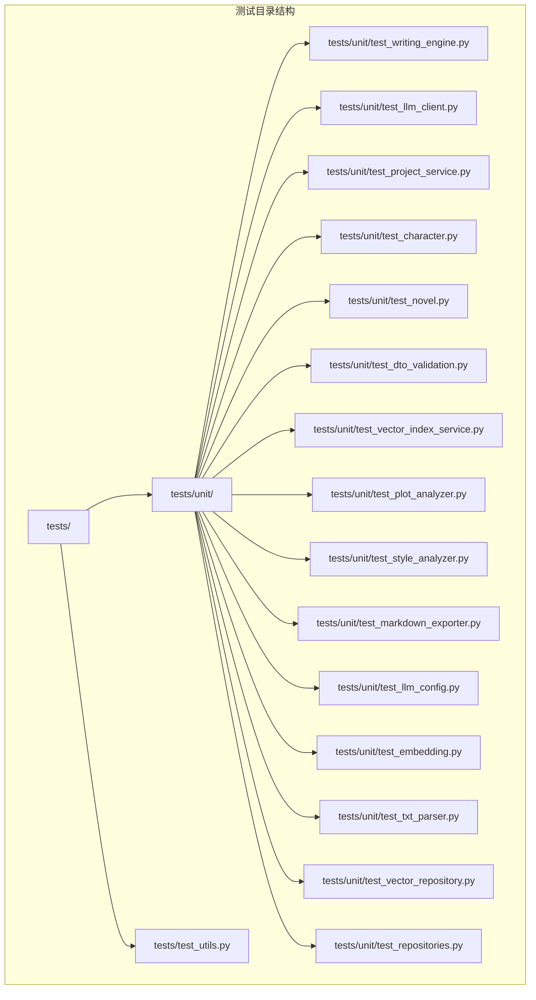
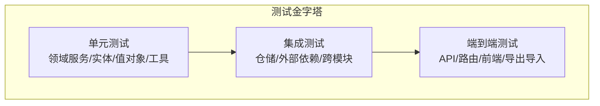
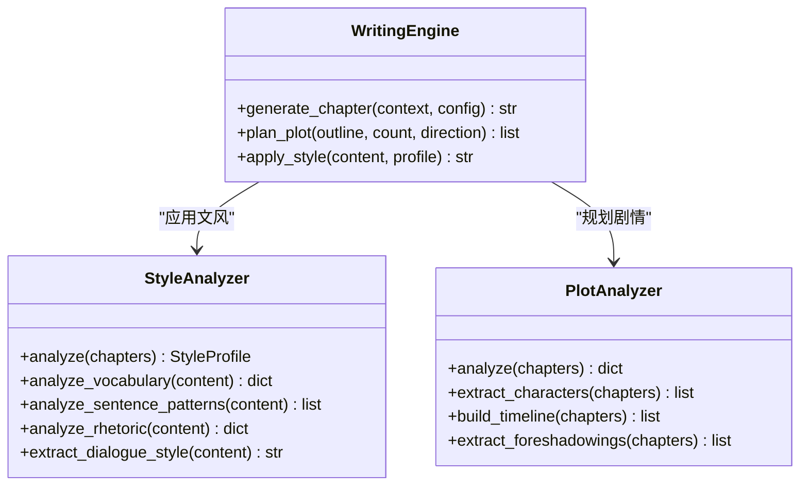
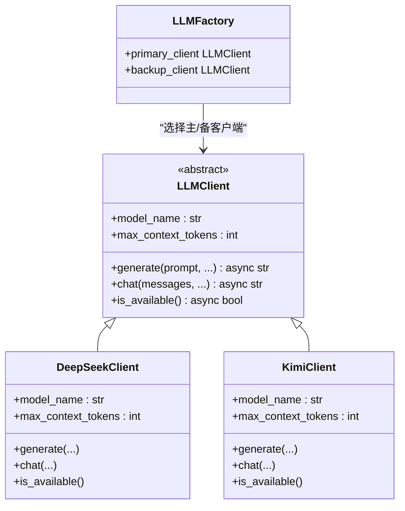
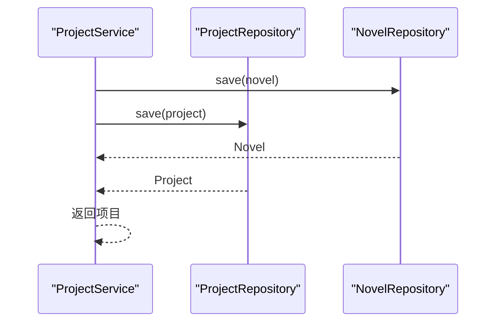
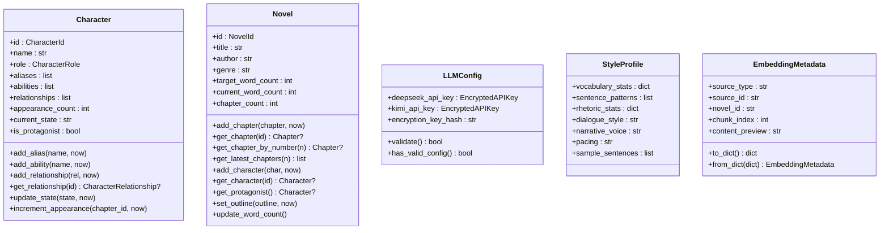
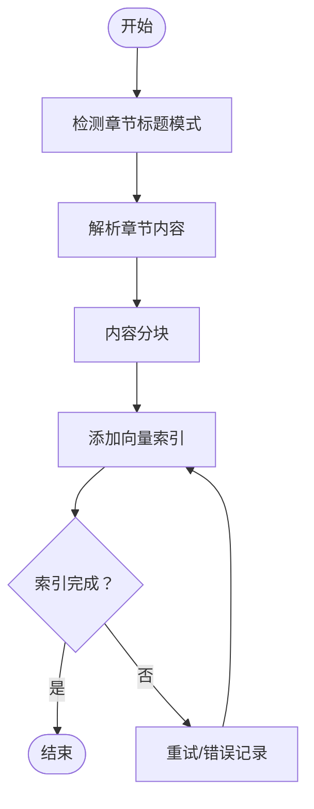
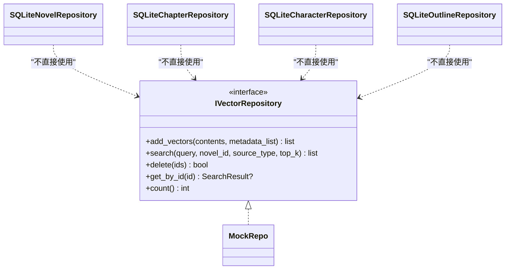
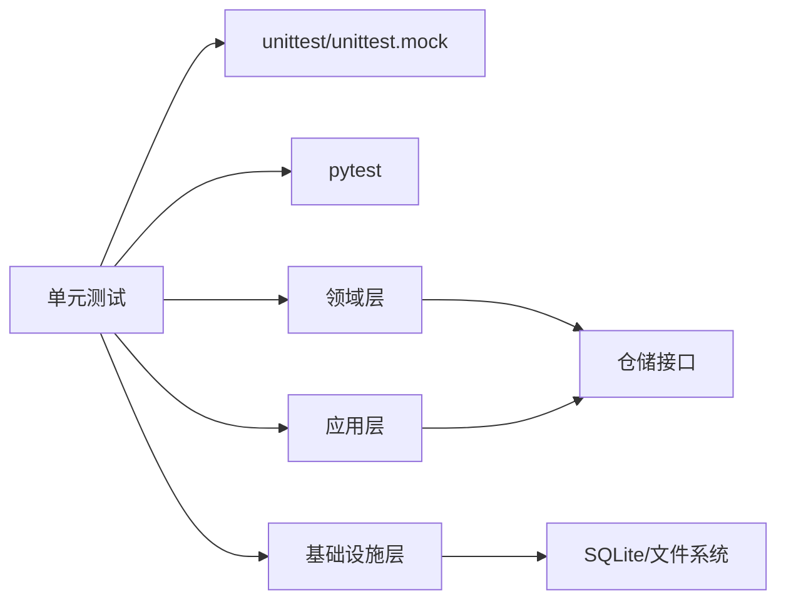

# 测试策略

<cite>
**本文引用的文件**
- [tests/__init__.py](file://tests/__init__.py)
- [tests/test_utils.py](file://tests/test_utils.py)
- [tests/unit/__init__.py](file://tests/unit/__init__.py)
- [tests/unit/test_writing_engine.py](file://tests/unit/test_writing_engine.py)
- [tests/unit/test_llm_client.py](file://tests/unit/test_llm_client.py)
- [tests/unit/test_project_service.py](file://tests/unit/test_project_service.py)
- [tests/unit/test_character.py](file://tests/unit/test_character.py)
- [tests/unit/test_novel.py](file://tests/unit/test_novel.py)
- [tests/unit/test_dto_validation.py](file://tests/unit/test_dto_validation.py)
- [tests/unit/test_vector_index_service.py](file://tests/unit/test_vector_index_service.py)
- [tests/unit/test_plot_analyzer.py](file://tests/unit/test_plot_analyzer.py)
- [tests/unit/test_style_analyzer.py](file://tests/unit/test_style_analyzer.py)
- [tests/unit/test_markdown_exporter.py](file://tests/unit/test_markdown_exporter.py)
- [tests/unit/test_llm_config.py](file://tests/unit/test_llm_config.py)
- [tests/unit/test_embedding.py](file://tests/unit/test_embedding.py)
- [tests/unit/test_txt_parser.py](file://tests/unit/test_txt_parser.py)
- [tests/unit/test_vector_repository.py](file://tests/unit/test_vector_repository.py)
- [tests/unit/test_repositories.py](file://tests/unit/test_repositories.py)
</cite>

## 目录
1. [引言](#引言)
2. [项目结构](#项目结构)
3. [核心组件](#核心组件)
4. [架构总览](#架构总览)
5. [详细组件分析](#详细组件分析)
6. [依赖分析](#依赖分析)
7. [性能考虑](#性能考虑)
8. [故障排查指南](#故障排查指南)
9. [结论](#结论)
10. [附录](#附录)

## 引言
本测试策略文档面向 InkTrace 项目，系统化阐述测试架构与测试金字塔设计，明确单元测试、集成测试的组织方式与覆盖范围，并给出测试数据准备与管理、测试工具选择与配置、最佳实践与代码规范、持续集成与自动化测试、性能与压力测试方法、覆盖率统计与改进策略，以及测试调试与问题定位方法。文档同时提供可视化图示，帮助不同技术背景的读者快速理解与落地。

## 项目结构
InkTrace 的测试主要集中在 tests 目录下，采用按“层次+功能”混合组织的方式：
- tests/unit：按领域层、应用层、基础设施层划分的单元测试集合
- tests/test_utils.py：通用工具类的单元测试
- tests/__init__.py、tests/unit/__init__.py：模块初始化文件

**图表来源**
- [tests/__init__.py](file://tests/__init__.py)
- [tests/unit/__init__.py](file://tests/unit/__init__.py)
- [tests/test_utils.py](file://tests/test_utils.py)
- [tests/unit/test_writing_engine.py](file://tests/unit/test_writing_engine.py)
- [tests/unit/test_llm_client.py](file://tests/unit/test_llm_client.py)
- [tests/unit/test_project_service.py](file://tests/unit/test_project_service.py)
- [tests/unit/test_character.py](file://tests/unit/test_character.py)
- [tests/unit/test_novel.py](file://tests/unit/test_novel.py)
- [tests/unit/test_dto_validation.py](file://tests/unit/test_dto_validation.py)
- [tests/unit/test_vector_index_service.py](file://tests/unit/test_vector_index_service.py)
- [tests/unit/test_plot_analyzer.py](file://tests/unit/test_plot_analyzer.py)
- [tests/unit/test_style_analyzer.py](file://tests/unit/test_style_analyzer.py)
- [tests/unit/test_markdown_exporter.py](file://tests/unit/test_markdown_exporter.py)
- [tests/unit/test_llm_config.py](file://tests/unit/test_llm_config.py)
- [tests/unit/test_embedding.py](file://tests/unit/test_embedding.py)
- [tests/unit/test_txt_parser.py](file://tests/unit/test_txt_parser.py)
- [tests/unit/test_vector_repository.py](file://tests/unit/test_vector_repository.py)
- [tests/unit/test_repositories.py](file://tests/unit/test_repositories.py)

**章节来源**
- [tests/__init__.py](file://tests/__init__.py)
- [tests/unit/__init__.py](file://tests/unit/__init__.py)

## 核心组件
- AI 写作引擎与文风/剧情分析：通过 WritingEngine、StyleAnalyzer、PlotAnalyzer 等领域服务进行测试，覆盖上下文构建、生成流程、风格应用、剧情抽取与时间线构建等。
- LLM 客户端与工厂：通过 DeepSeekClient、KimiClient、LLMFactory 等进行测试，覆盖客户端创建、上下文长度、主备客户端选择等。
- 应用服务：如 ProjectService、VectorIndexService 等，覆盖业务流程、仓储交互、配置管理等。
- 领域实体与值对象：Character、Novel、LLMConfig、StyleProfile、EmbeddingMetadata 等，覆盖构造、行为、不变式与转换。
- 基础设施：Markdown 导出器、TXT 解析器、SQLite 仓储实现等，覆盖文件处理、持久化、向量检索等。

**章节来源**
- [tests/unit/test_writing_engine.py](file://tests/unit/test_writing_engine.py)
- [tests/unit/test_llm_client.py](file://tests/unit/test_llm_client.py)
- [tests/unit/test_project_service.py](file://tests/unit/test_project_service.py)
- [tests/unit/test_character.py](file://tests/unit/test_character.py)
- [tests/unit/test_novel.py](file://tests/unit/test_novel.py)
- [tests/unit/test_dto_validation.py](file://tests/unit/test_dto_validation.py)
- [tests/unit/test_vector_index_service.py](file://tests/unit/test_vector_index_service.py)
- [tests/unit/test_plot_analyzer.py](file://tests/unit/test_plot_analyzer.py)
- [tests/unit/test_style_analyzer.py](file://tests/unit/test_style_analyzer.py)
- [tests/unit/test_markdown_exporter.py](file://tests/unit/test_markdown_exporter.py)
- [tests/unit/test_llm_config.py](file://tests/unit/test_llm_config.py)
- [tests/unit/test_embedding.py](file://tests/unit/test_embedding.py)
- [tests/unit/test_txt_parser.py](file://tests/unit/test_txt_parser.py)
- [tests/unit/test_vector_repository.py](file://tests/unit/test_vector_repository.py)
- [tests/unit/test_repositories.py](file://tests/unit/test_repositories.py)

## 架构总览
测试金字塔由三层构成：
- 单元测试（Unit Tests）：覆盖核心算法、值对象、实体、服务方法，强调快速反馈与高精度断言。
- 集成测试（Integration Tests）：覆盖仓储、外部依赖（如数据库、向量库）、跨模块协作，强调真实环境下的行为验证。
- 端到端测试（E2E）：覆盖 API 路由、前端交互、导出/导入流程等，强调用户场景闭环。

[此图为概念性总览，无需图表来源]

## 详细组件分析

### AI 写作引擎与文风/剧情分析
- WritingEngine：测试上下文构建、章节生成、剧情规划、风格应用等流程；通过异步客户端模拟确保生成链路可测。
- StyleAnalyzer：测试词汇、句式、修辞、对话风格等分析能力，输出 StyleProfile。
- PlotAnalyzer：测试人物提取、时间线构建、伏笔识别等。

**图表来源**
- [tests/unit/test_writing_engine.py](file://tests/unit/test_writing_engine.py)
- [tests/unit/test_style_analyzer.py](file://tests/unit/test_style_analyzer.py)
- [tests/unit/test_plot_analyzer.py](file://tests/unit/test_plot_analyzer.py)

**章节来源**
- [tests/unit/test_writing_engine.py](file://tests/unit/test_writing_engine.py)
- [tests/unit/test_style_analyzer.py](file://tests/unit/test_style_analyzer.py)
- [tests/unit/test_plot_analyzer.py](file://tests/unit/test_plot_analyzer.py)

### LLM 客户端与工厂
- DeepSeekClient/KimiClient：测试模型名称、上下文长度、可用性等。
- LLMFactory：测试主备客户端选择逻辑。
- 接口一致性：通过抽象基类约束，保证客户端实现一致。

**图表来源**
- [tests/unit/test_llm_client.py](file://tests/unit/test_llm_client.py)

**章节来源**
- [tests/unit/test_llm_client.py](file://tests/unit/test_llm_client.py)

### 应用服务与 DTO 校验
- ProjectService：测试项目 CRUD、状态变更、归档等。
- DTO 输入校验：基于 Pydantic 的请求 DTO 校验，覆盖必填项、范围、默认值等。

**图表来源**
- [tests/unit/test_project_service.py](file://tests/unit/test_project_service.py)

**章节来源**
- [tests/unit/test_project_service.py](file://tests/unit/test_project_service.py)
- [tests/unit/test_dto_validation.py](file://tests/unit/test_dto_validation.py)

### 领域实体与值对象
- Character/Novel：测试实体生命周期、关系管理、统计计算等。
- LLMConfig/StyleProfile/EmbeddingMetadata：测试构造、序列化、默认值与有效性。

**图表来源**
- [tests/unit/test_character.py](file://tests/unit/test_character.py)
- [tests/unit/test_novel.py](file://tests/unit/test_novel.py)
- [tests/unit/test_llm_config.py](file://tests/unit/test_llm_config.py)
- [tests/unit/test_style_analyzer.py](file://tests/unit/test_style_analyzer.py)
- [tests/unit/test_embedding.py](file://tests/unit/test_embedding.py)

**章节来源**
- [tests/unit/test_character.py](file://tests/unit/test_character.py)
- [tests/unit/test_novel.py](file://tests/unit/test_novel.py)
- [tests/unit/test_llm_config.py](file://tests/unit/test_llm_config.py)
- [tests/unit/test_embedding.py](file://tests/unit/test_embedding.py)

### 基础设施与文件处理
- MarkdownExporter：测试章节/小说导出、元数据格式化。
- TXT 解析器：测试章节标题识别、章节切分、大纲解析、字数统计。
- 向量索引服务：测试分块、索引、检索、状态查询、删除等。

**图表来源**
- [tests/unit/test_txt_parser.py](file://tests/unit/test_txt_parser.py)
- [tests/unit/test_vector_index_service.py](file://tests/unit/test_vector_index_service.py)

**章节来源**
- [tests/unit/test_markdown_exporter.py](file://tests/unit/test_markdown_exporter.py)
- [tests/unit/test_txt_parser.py](file://tests/unit/test_txt_parser.py)
- [tests/unit/test_vector_index_service.py](file://tests/unit/test_vector_index_service.py)

### 仓储与持久化
- SQLite 仓储：测试 CRUD、批量查询、最新条目、删除等。
- 向量仓储接口：测试接口契约、Mock 行为、序列化/反序列化。

**图表来源**
- [tests/unit/test_vector_repository.py](file://tests/unit/test_vector_repository.py)
- [tests/unit/test_repositories.py](file://tests/unit/test_repositories.py)

**章节来源**
- [tests/unit/test_vector_repository.py](file://tests/unit/test_vector_repository.py)
- [tests/unit/test_repositories.py](file://tests/unit/test_repositories.py)

## 依赖分析
- 测试耦合：单元测试广泛使用 unittest 和 pytest，部分测试使用 unittest.mock 进行依赖隔离。
- 外部依赖：SQLite 数据库、向量库接口、文件系统（导出/解析）。
- 依赖注入：通过构造函数注入仓储与客户端，便于测试替换。

[此图为概念性依赖关系，无需图表来源]

**章节来源**
- [tests/test_utils.py](file://tests/test_utils.py)
- [tests/unit/test_llm_client.py](file://tests/unit/test_llm_client.py)
- [tests/unit/test_vector_repository.py](file://tests/unit/test_vector_repository.py)

## 性能考虑
- 单元测试：优先使用内存级 Mock，避免 IO 与网络调用，确保测试执行快速稳定。
- 集成测试：对数据库与向量库操作进行批量化、分页与超时控制，避免长时间阻塞。
- 大规模数据：对分块、索引、检索进行基准测试，记录吞吐与延迟指标，作为回归基线。
- 并发与稳定性：对 LLM 客户端的并发调用进行压力测试，评估重试与熔断策略的有效性。

[本节为通用指导，无需章节来源]

## 故障排查指南
- 单元测试失败定位：优先检查 Mock 行为与断言点，确认输入参数与返回值是否符合预期。
- 集成测试失败定位：检查数据库连接、事务提交、文件权限与路径，关注异常堆栈中的具体模块。
- LLM 客户端问题：核对 API Key、URL、模型名称与上下文长度限制，确认 is_available 与异步调用正确性。
- 导出/解析问题：核对编码、换行符、文件路径与权限，逐段比对中间产物（如分块内容）。

**章节来源**
- [tests/unit/test_llm_client.py](file://tests/unit/test_llm_client.py)
- [tests/unit/test_markdown_exporter.py](file://tests/unit/test_markdown_exporter.py)
- [tests/unit/test_txt_parser.py](file://tests/unit/test_txt_parser.py)

## 结论
InkTrace 的测试体系以测试金字塔为核心，单元测试覆盖关键算法与领域逻辑，集成测试保障仓储与外部依赖的稳定性，端到端测试聚焦用户场景闭环。通过规范化的测试数据管理、工具配置与最佳实践，可显著提升代码质量与交付效率。建议持续完善覆盖率统计与回归基线，结合性能与压力测试，形成完整的质量保障闭环。

[本节为总结性内容，无需章节来源]

## 附录

### 测试工具与配置
- 测试框架：unittest（单元测试为主）、pytest（部分集成测试与夹具）
- Mock：unittest.mock（异步/同步）、pytest-mock
- 断言与夹具：pytest fixture、unittest.TestCase
- 示例参考：
  - [tests/test_utils.py](file://tests/test_utils.py)
  - [tests/unit/test_dto_validation.py](file://tests/unit/test_dto_validation.py)
  - [tests/unit/test_vector_index_service.py](file://tests/unit/test_vector_index_service.py)

**章节来源**
- [tests/test_utils.py](file://tests/test_utils.py)
- [tests/unit/test_dto_validation.py](file://tests/unit/test_dto_validation.py)
- [tests/unit/test_vector_index_service.py](file://tests/unit/test_vector_index_service.py)

### 测试数据准备与管理
- 临时文件与数据库：使用 tempfile 创建临时目录与 .db 文件，测试结束后清理。
- Mock 数据：通过构造函数或工厂方法创建实体与 DTO 实例，确保字段覆盖边界条件。
- 示例参考：
  - [tests/unit/test_markdown_exporter.py](file://tests/unit/test_markdown_exporter.py)
  - [tests/unit/test_repositories.py](file://tests/unit/test_repositories.py)
  - [tests/unit/test_txt_parser.py](file://tests/unit/test_txt_parser.py)

**章节来源**
- [tests/unit/test_markdown_exporter.py](file://tests/unit/test_markdown_exporter.py)
- [tests/unit/test_repositories.py](file://tests/unit/test_repositories.py)
- [tests/unit/test_txt_parser.py](file://tests/unit/test_txt_parser.py)

### 持续集成与自动化测试
- 建议在 CI 中执行：
  - 全量单元测试（unittest）
  - 部分集成测试（pytest）
  - 覆盖率统计（如 coverage.py 或 pytest-cov）
- 触发策略：PR/MR 自动触发，主分支保护与阈值控制
- 输出：测试报告、覆盖率报告、失败日志归档

[本节为通用指导，无需章节来源]

### 性能与压力测试
- 场景设计：大文本分块、批量索引、高并发检索、数据库写入压力
- 指标采集：响应时间、吞吐量、错误率、资源占用
- 回归基线：建立稳定版本的性能基线，作为后续优化依据

[本节为通用指导，无需章节来源]

### 测试覆盖率统计与改进
- 工具：pytest-cov、coverage.py
- 目标：语句/分支/函数/行覆盖率，重点提升关键路径与异常分支
- 改进策略：补充边界条件、异常路径、并发场景的测试用例

[本节为通用指导，无需章节来源]

### 测试编写最佳实践与代码规范
- 命名规范：测试类使用 TestXxx，测试方法使用 test_xxx，清晰表达意图
- 断言规范：使用具体断言（如 assertEqual/assertIsInstance），避免模糊断言
- Mock 使用：最小化依赖，仅模拟必要接口，避免过度 Mock
- 夹具与 setUp/tearDown：复用公共逻辑，确保测试隔离与可重复性
- 示例参考：
  - [tests/unit/test_writing_engine.py](file://tests/unit/test_writing_engine.py)
  - [tests/unit/test_llm_client.py](file://tests/unit/test_llm_client.py)
  - [tests/unit/test_project_service.py](file://tests/unit/test_project_service.py)

**章节来源**
- [tests/unit/test_writing_engine.py](file://tests/unit/test_writing_engine.py)
- [tests/unit/test_llm_client.py](file://tests/unit/test_llm_client.py)
- [tests/unit/test_project_service.py](file://tests/unit/test_project_service.py)