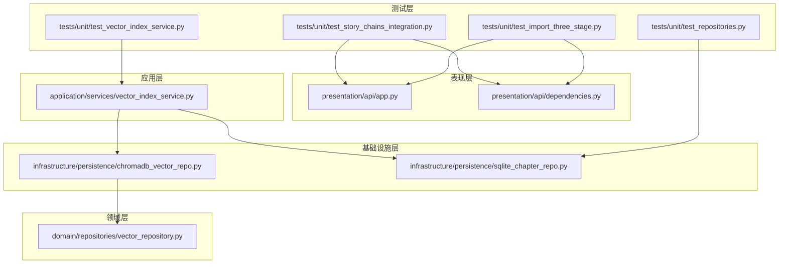
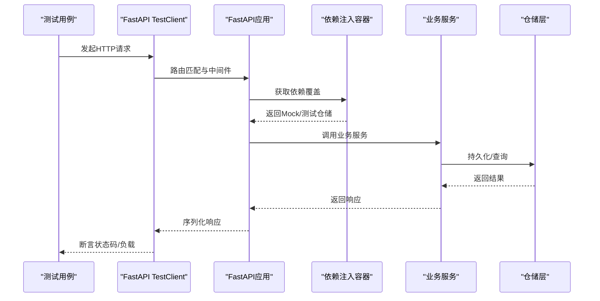
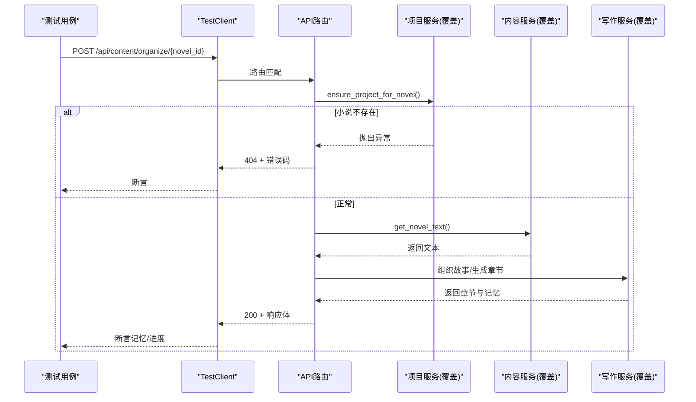
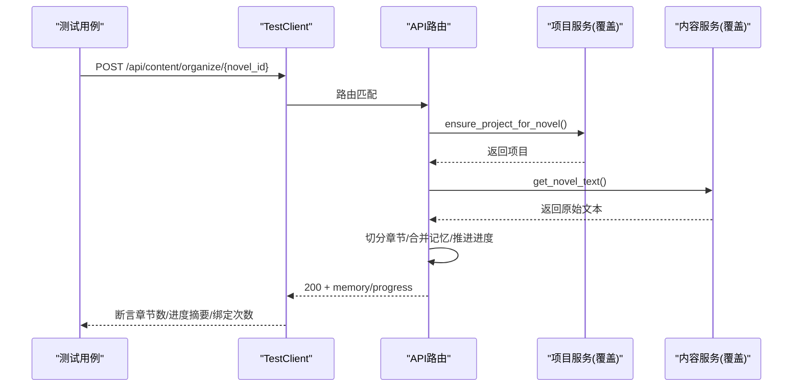
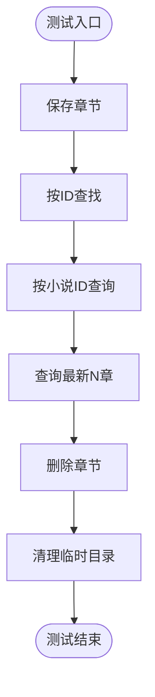
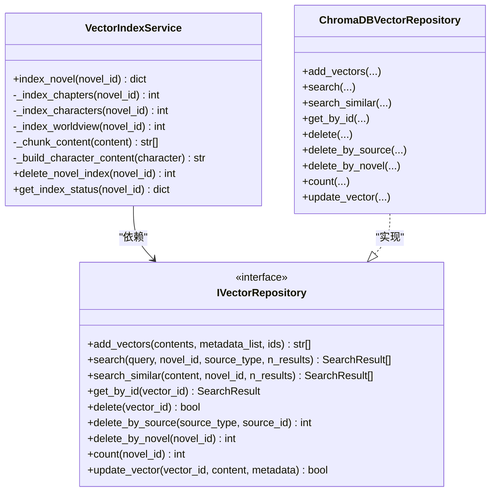
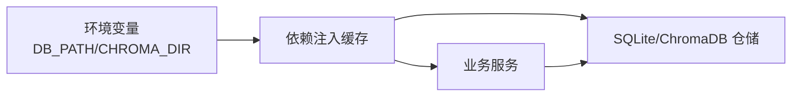

# 集成测试

<cite>
**本文引用的文件**
- [tests/unit/test_story_chains_integration.py](file://tests/unit/test_story_chains_integration.py)
- [tests/unit/test_vector_index_service.py](file://tests/unit/test_vector_index_service.py)
- [tests/unit/test_import_three_stage.py](file://tests/unit/test_import_three_stage.py)
- [tests/unit/test_repositories.py](file://tests/unit/test_repositories.py)
- [presentation/api/app.py](file://presentation/api/app.py)
- [presentation/api/dependencies.py](file://presentation/api/dependencies.py)
- [application/services/vector_index_service.py](file://application/services/vector_index_service.py)
- [infrastructure/persistence/chromadb_vector_repo.py](file://infrastructure/persistence/chromadb_vector_repo.py)
- [infrastructure/persistence/sqlite_chapter_repo.py](file://infrastructure/persistence/sqlite_chapter_repo.py)
- [domain/repositories/vector_repository.py](file://domain/repositories/vector_repository.py)
</cite>

## 目录
1. [简介](#简介)
2. [项目结构](#项目结构)
3. [核心组件](#核心组件)
4. [架构总览](#架构总览)
5. [详细组件分析](#详细组件分析)
6. [依赖分析](#依赖分析)
7. [性能考虑](#性能考虑)
8. [故障排查指南](#故障排查指南)
9. [结论](#结论)
10. [附录](#附录)

## 简介
本文件面向InkTrace项目的集成测试，系统性梳理端到端测试设计与实现方法，覆盖以下关键领域：
- 故事链集成测试：验证组织故事与继续写作的端到端流程，包含依赖注入覆盖与错误码断言。
- 仓储层测试：基于SQLite的章节仓储持久化行为验证，确保数据一致性与查询正确性。
- 向量索引服务测试：覆盖章节/人物/世界观三类实体的向量索引、分块、检索与状态查询。
- 小说导入三阶段流程测试：验证章节切分、内存合并与进度推进的完整导入流程。
- 测试环境搭建与配置：数据库与向量库的隔离与模拟，以及测试客户端的使用方式。
- 最佳实践：测试数据准备、执行顺序、错误处理策略与性能/压力测试建议。

## 项目结构
InkTrace采用分层架构，测试主要集中在tests目录下，分别覆盖：
- story_chains_integration：故事链端到端（组织故事/继续写作）。
- vector_index_service：向量索引服务的单元与集成测试。
- import_three_stage：小说导入三阶段流程测试。
- repositories：仓储层（SQLite）持久化测试。

图表来源
- [tests/unit/test_story_chains_integration.py:1-184](file://tests/unit/test_story_chains_integration.py#L1-L184)
- [tests/unit/test_vector_index_service.py:1-318](file://tests/unit/test_vector_index_service.py#L1-L318)
- [tests/unit/test_import_three_stage.py:1-106](file://tests/unit/test_import_three_stage.py#L1-L106)
- [tests/unit/test_repositories.py:1-310](file://tests/unit/test_repositories.py#L1-L310)
- [presentation/api/app.py:1-66](file://presentation/api/app.py#L1-L66)
- [presentation/api/dependencies.py:1-178](file://presentation/api/dependencies.py#L1-L178)
- [application/services/vector_index_service.py:1-206](file://application/services/vector_index_service.py#L1-L206)
- [infrastructure/persistence/chromadb_vector_repo.py:1-270](file://infrastructure/persistence/chromadb_vector_repo.py#L1-L270)
- [infrastructure/persistence/sqlite_chapter_repo.py:1-125](file://infrastructure/persistence/sqlite_chapter_repo.py#L1-L125)
- [domain/repositories/vector_repository.py:1-95](file://domain/repositories/vector_repository.py#L1-L95)

章节来源
- [presentation/api/app.py:1-66](file://presentation/api/app.py#L1-L66)
- [presentation/api/dependencies.py:1-178](file://presentation/api/dependencies.py#L1-L178)

## 核心组件
- FastAPI应用与依赖注入：通过依赖覆盖实现测试隔离，便于替换仓储与服务。
- 向量索引服务：负责章节/人物/世界观内容的分块、向量化与入库，并提供索引状态查询。
- ChromaDB向量仓储：实现向量的增删改查与按小说/来源过滤检索。
- SQLite章节仓储：提供章节的持久化、查询与最新章节检索。
- 测试客户端：使用FastAPI TestClient发起HTTP请求，验证端到端流程与错误码。

章节来源
- [presentation/api/app.py:19-66](file://presentation/api/app.py#L19-L66)
- [presentation/api/dependencies.py:45-178](file://presentation/api/dependencies.py#L45-L178)
- [application/services/vector_index_service.py:21-206](file://application/services/vector_index_service.py#L21-L206)
- [infrastructure/persistence/chromadb_vector_repo.py:19-270](file://infrastructure/persistence/chromadb_vector_repo.py#L19-L270)
- [infrastructure/persistence/sqlite_chapter_repo.py:19-125](file://infrastructure/persistence/sqlite_chapter_repo.py#L19-L125)

## 架构总览
下图展示集成测试中的关键交互：测试通过TestClient调用API，依赖注入覆盖将真实仓储替换为Mock或临时数据库，从而实现端到端验证。

图表来源
- [presentation/api/app.py:19-66](file://presentation/api/app.py#L19-L66)
- [presentation/api/dependencies.py:45-178](file://presentation/api/dependencies.py#L45-L178)
- [tests/unit/test_story_chains_integration.py:81-184](file://tests/unit/test_story_chains_integration.py#L81-L184)
- [tests/unit/test_import_three_stage.py:41-106](file://tests/unit/test_import_three_stage.py#L41-L106)

## 详细组件分析

### 故事链集成测试（组织故事与继续写作）
该测试验证“组织故事”和“继续写作”的端到端流程，重点在于：
- 缺失小说时返回特定错误码。
- 已有记忆时复用而不覆盖。
- 继续写作时缺少记忆应报错。
- 成功继续写作后持久化下一章并更新进度。

图表来源
- [tests/unit/test_story_chains_integration.py:87-126](file://tests/unit/test_story_chains_integration.py#L87-L126)
- [tests/unit/test_story_chains_integration.py:128-184](file://tests/unit/test_story_chains_integration.py#L128-L184)

章节来源
- [tests/unit/test_story_chains_integration.py:87-184](file://tests/unit/test_story_chains_integration.py#L87-L184)

### 小说导入三阶段流程测试
该测试聚焦“章节切分、内存合并、进度推进”的三阶段导入流程：
- 支持中英文章节标题模式与回退切分。
- 内存增量合并策略：去重聚合、关系更新、风格收敛。
- 导入完成后更新进度与摘要。

图表来源
- [tests/unit/test_import_three_stage.py:47-106](file://tests/unit/test_import_three_stage.py#L47-L106)

章节来源
- [tests/unit/test_import_three_stage.py:47-106](file://tests/unit/test_import_three_stage.py#L47-L106)

### 仓储层测试（SQLite章节仓储）
该测试以临时数据库验证章节仓储的关键行为：
- 保存与按ID查找。
- 按小说ID批量查询与最新N条查询。
- 删除与清理。

图表来源
- [tests/unit/test_repositories.py:130-190](file://tests/unit/test_repositories.py#L130-L190)
- [infrastructure/persistence/sqlite_chapter_repo.py:51-125](file://infrastructure/persistence/sqlite_chapter_repo.py#L51-L125)

章节来源
- [tests/unit/test_repositories.py:26-310](file://tests/unit/test_repositories.py#L26-L310)
- [infrastructure/persistence/sqlite_chapter_repo.py:19-125](file://infrastructure/persistence/sqlite_chapter_repo.py#L19-L125)

### 向量索引服务测试
该测试覆盖向量索引服务的核心逻辑：
- 空小说索引统计为0。
- 分块策略：短内容单块、长内容多块、空/None处理。
- 人物内容构建：姓名必填，其余字段可选拼接。
- 章节/人物/世界观三类实体的索引与入库。
- 索引删除与状态查询。

图表来源
- [application/services/vector_index_service.py:21-206](file://application/services/vector_index_service.py#L21-L206)
- [domain/repositories/vector_repository.py:17-95](file://domain/repositories/vector_repository.py#L17-L95)
- [infrastructure/persistence/chromadb_vector_repo.py:19-270](file://infrastructure/persistence/chromadb_vector_repo.py#L19-L270)

章节来源
- [tests/unit/test_vector_index_service.py:18-318](file://tests/unit/test_vector_index_service.py#L18-L318)
- [application/services/vector_index_service.py:21-206](file://application/services/vector_index_service.py#L21-L206)
- [infrastructure/persistence/chromadb_vector_repo.py:19-270](file://infrastructure/persistence/chromadb_vector_repo.py#L19-L270)
- [domain/repositories/vector_repository.py:17-95](file://domain/repositories/vector_repository.py#L17-L95)

## 依赖分析
- 依赖注入覆盖：测试通过dependency_overrides将真实仓储替换为Mock或临时实例，避免外部依赖影响。
- 环境变量：数据库路径与向量库路径通过环境变量控制，默认位于data目录。
- 路由与中间件：CORS允许跨域访问，根路径与健康检查接口便于快速探测。

图表来源
- [presentation/api/dependencies.py:45-96](file://presentation/api/dependencies.py#L45-L96)
- [presentation/api/app.py:27-33](file://presentation/api/app.py#L27-L33)

章节来源
- [presentation/api/dependencies.py:45-178](file://presentation/api/dependencies.py#L45-L178)
- [presentation/api/app.py:19-66](file://presentation/api/app.py#L19-L66)

## 性能考虑
- 向量分块参数：通过VectorStoreConfig的chunk_size与chunk_overlap控制分块大小与重叠，平衡召回与性能。
- 批量写入：向量入库时按批次提交，减少网络/磁盘往返。
- 查询过滤：在ChromaDB侧使用where条件进行novel_id/source_type过滤，降低检索范围。
- 数据库索引：SQLite章节表按novel_id与number建立索引，优化查询与排序。
- 并发与资源：测试中使用临时数据库与独立向量集合，避免并发竞争；生产环境建议限制并发写入与启用事务。

## 故障排查指南
- 端到端错误码断言
  - 小说缺失：组织故事返回404且包含NOVEL_NOT_FOUND错误码。
  - 记忆缺失：继续写作返回400且包含MEMORY_REQUIRED错误码。
- 仓储异常
  - 章节查询为空：确认保存是否成功、novel_id是否一致。
  - 最新章节数量不符：检查number排序与LIMIT参数。
- 向量检索异常
  - 检索结果为空：确认索引是否已建立、novel_id过滤是否正确。
  - 分块异常：检查chunk_size与内容长度，确保非空内容被正确切分。
- 环境问题
  - 数据库路径不存在：确认INKTRACE_DB_PATH指向有效路径并已创建目录。
  - 向量库路径不存在：确认INKTRACE_CHROMA_DIR指向有效路径并已创建目录。

章节来源
- [tests/unit/test_story_chains_integration.py:87-146](file://tests/unit/test_story_chains_integration.py#L87-L146)
- [tests/unit/test_repositories.py:130-190](file://tests/unit/test_repositories.py#L130-L190)
- [tests/unit/test_vector_index_service.py:87-207](file://tests/unit/test_vector_index_service.py#L87-L207)
- [presentation/api/dependencies.py:45-96](file://presentation/api/dependencies.py#L45-L96)

## 结论
本集成测试文档系统化梳理了InkTrace的端到端测试设计与实现要点，覆盖故事链流程、仓储持久化、向量索引服务与小说导入三阶段。通过依赖注入覆盖与临时环境配置，测试能够在隔离环境中验证关键业务流程与边界条件。建议在CI中固定测试顺序、引入性能回归指标，并对向量检索与数据库写入进行压力测试以保障系统稳定性。

## 附录
- 测试执行建议
  - 使用pytest运行tests/unit下的测试文件，确保依赖注入覆盖生效。
  - 在CI中设置INKTRACE_DB_PATH与INKTRACE_CHROMA_DIR指向临时目录，避免污染生产数据。
  - 对向量检索与数据库写入进行基准测试，记录QPS与P95延迟。
- 关键测试点清单
  - 故事链：错误码、记忆复用、进度推进。
  - 仓储：保存/查询/删除/最新章节。
  - 向量：分块策略、三类实体索引、状态查询。
  - 导入：章节切分、内存合并、进度摘要。