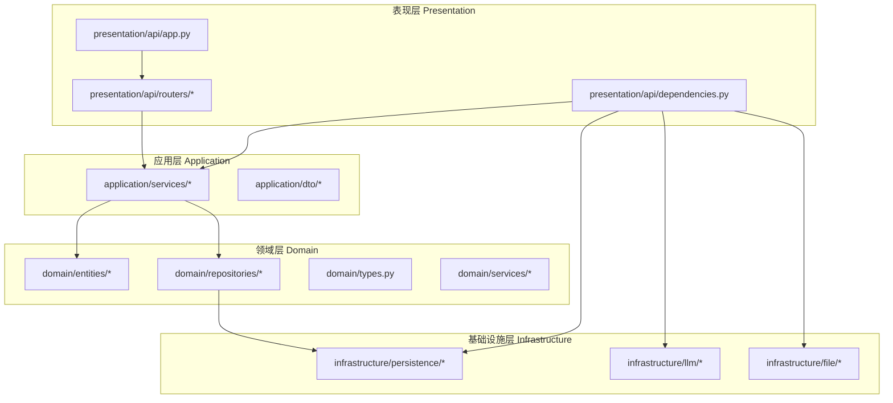
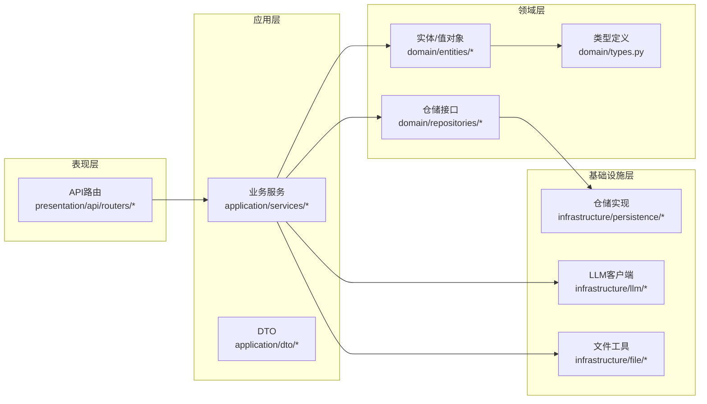
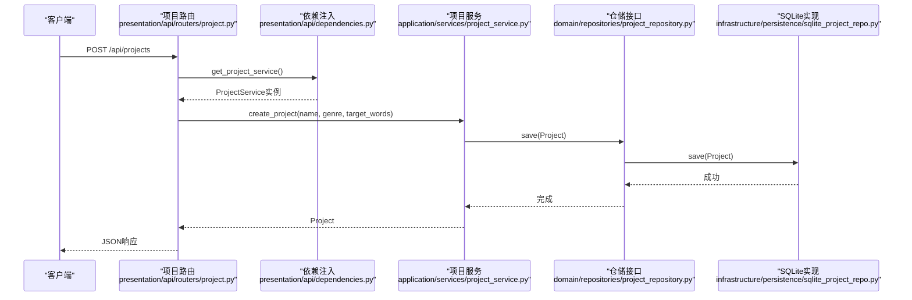
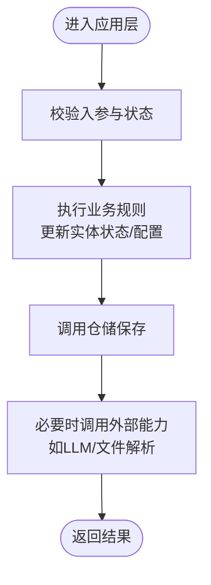
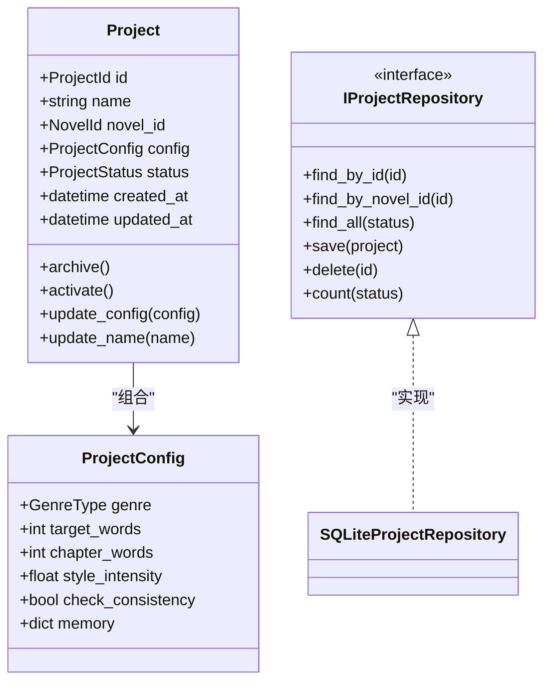
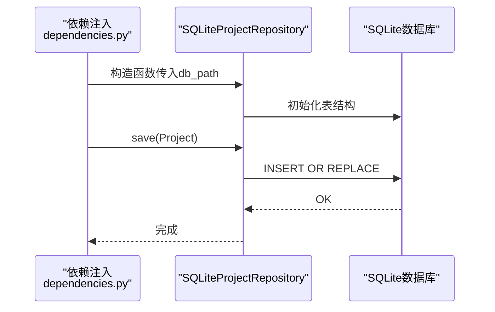
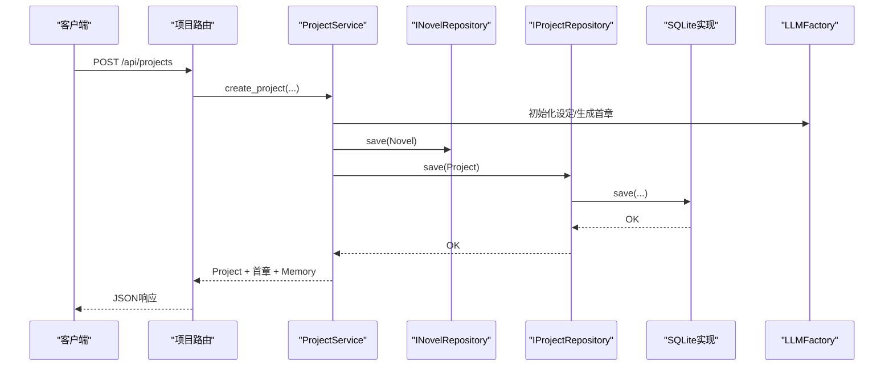
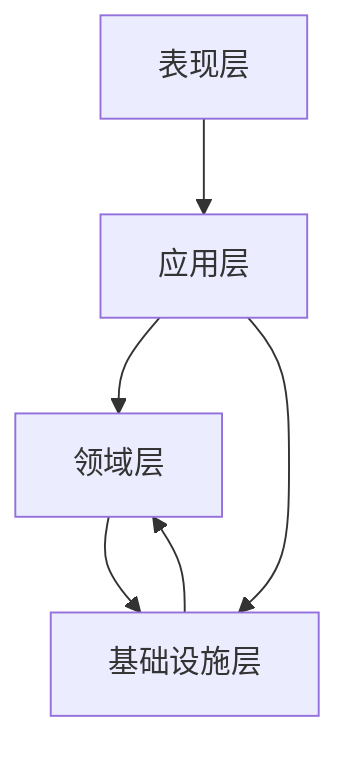

# 分层架构详解

<cite>
**本文引用的文件**
- [main.py](file://main.py)
- [presentation/api/app.py](file://presentation/api/app.py)
- [presentation/api/routers/project.py](file://presentation/api/routers/project.py)
- [presentation/api/dependencies.py](file://presentation/api/dependencies.py)
- [application/services/project_service.py](file://application/services/project_service.py)
- [domain/entities/project.py](file://domain/entities/project.py)
- [domain/entities/novel.py](file://domain/entities/novel.py)
- [domain/repositories/project_repository.py](file://domain/repositories/project_repository.py)
- [domain/types.py](file://domain/types.py)
- [infrastructure/persistence/sqlite_project_repo.py](file://infrastructure/persistence/sqlite_project_repo.py)
- [config.py](file://config.py)
- [application/dto/request_dto.py](file://application/dto/request_dto.py)
</cite>

## 目录
1. [引言](#引言)
2. [项目结构](#项目结构)
3. [核心组件](#核心组件)
4. [架构总览](#架构总览)
5. [详细组件分析](#详细组件分析)
6. [依赖分析](#依赖分析)
7. [性能考虑](#性能考虑)
8. [故障排查指南](#故障排查指南)
9. [结论](#结论)

## 引言
本文件面向InkTrace项目的开发者与架构师，系统性阐述基于Clean Architecture设计原则的分层架构：表现层（Presentation Layer）、应用层（Application Layer）、领域层（Domain Layer）与基础设施层（Infrastructure Layer）。文档将明确每层职责边界、依赖方向与交互模式，并结合实际代码路径给出层间依赖关系图与数据流向示意图，帮助读者快速理解并高效扩展系统。

## 项目结构
InkTrace采用典型的分层组织方式，各层在独立目录下清晰隔离：
- 表现层：presentation/api 提供FastAPI应用与路由，负责HTTP请求接入与响应输出。
- 应用层：application/services 聚合业务用例，协调领域实体与基础设施，不直接处理技术细节。
- 领域层：domain 定义实体、值对象、仓储接口与领域服务，封装核心业务规则与不变量。
- 基础设施层：infrastructure 实现仓储接口、LLM客户端、文件解析器等技术细节。

图表来源
- [presentation/api/app.py:1-66](file://presentation/api/app.py#L1-L66)
- [presentation/api/routers/project.py:1-290](file://presentation/api/routers/project.py#L1-L290)
- [presentation/api/dependencies.py:1-178](file://presentation/api/dependencies.py#L1-L178)
- [application/services/project_service.py:1-203](file://application/services/project_service.py#L1-L203)
- [domain/entities/project.py:1-112](file://domain/entities/project.py#L1-L112)
- [domain/repositories/project_repository.py:1-55](file://domain/repositories/project_repository.py#L1-L55)
- [domain/types.py:1-284](file://domain/types.py#L1-L284)
- [infrastructure/persistence/sqlite_project_repo.py:1-125](file://infrastructure/persistence/sqlite_project_repo.py#L1-L125)

章节来源
- [main.py:1-22](file://main.py#L1-L22)
- [presentation/api/app.py:1-66](file://presentation/api/app.py#L1-L66)
- [presentation/api/dependencies.py:1-178](file://presentation/api/dependencies.py#L1-L178)
- [config.py:1-46](file://config.py#L1-L46)

## 核心组件
- 启动入口与运行时配置
  - 入口脚本通过uvicorn运行FastAPI应用，主机与端口来自全局配置。
  - 参考路径：[main.py:15-21](file://main.py#L15-L21)，[config.py:14-46](file://config.py#L14-L46)

- 表现层（FastAPI）
  - 应用工厂创建FastAPI实例，注册多组路由与CORS中间件，提供健康检查端点。
  - 参考路径：[presentation/api/app.py:19-62](file://presentation/api/app.py#L19-L62)

- 应用层（服务编排）
  - 以ProjectService为代表的业务服务，协调仓储与外部能力（如LLM），封装业务流程。
  - 参考路径：[application/services/project_service.py:21-203](file://application/services/project_service.py#L21-L203)

- 领域层（实体与接口）
  - Project/ProjectConfig等实体承载业务不变量；IProjectRepository等接口定义数据访问契约。
  - 参考路径：[domain/entities/project.py:17-112](file://domain/entities/project.py#L17-L112)，[domain/repositories/project_repository.py:17-55](file://domain/repositories/project_repository.py#L17-L55)，[domain/types.py:118-261](file://domain/types.py#L118-L261)

- 基础设施层（实现）
  - SQLiteProjectRepository实现IProjectRepository，TxtParser、LLMFactory等提供具体技术实现。
  - 参考路径：[infrastructure/persistence/sqlite_project_repo.py:20-125](file://infrastructure/persistence/sqlite_project_repo.py#L20-L125)，[presentation/api/dependencies.py:22-110](file://presentation/api/dependencies.py#L22-L110)

章节来源
- [main.py:15-21](file://main.py#L15-L21)
- [presentation/api/app.py:19-62](file://presentation/api/app.py#L19-L62)
- [application/services/project_service.py:21-203](file://application/services/project_service.py#L21-L203)
- [domain/entities/project.py:17-112](file://domain/entities/project.py#L17-L112)
- [domain/repositories/project_repository.py:17-55](file://domain/repositories/project_repository.py#L17-L55)
- [domain/types.py:118-261](file://domain/types.py#L118-L261)
- [infrastructure/persistence/sqlite_project_repo.py:20-125](file://infrastructure/persistence/sqlite_project_repo.py#L20-L125)
- [presentation/api/dependencies.py:22-110](file://presentation/api/dependencies.py#L22-L110)

## 架构总览
Clean Architecture强调“依赖倒置”：高层策略（应用层）不依赖底层实现（基础设施层），而是依赖抽象（领域接口）。InkTrace通过以下方式实现：
- 表现层仅依赖应用层服务，不直接操作数据库或外部API。
- 应用层依赖领域接口（仓储接口），不关心具体实现。
- 领域层不依赖任何外部框架或技术细节，仅包含业务规则与数据模型。
- 基础设施层实现领域接口，向应用层暴露统一的数据访问能力。

图表来源
- [presentation/api/routers/project.py:1-290](file://presentation/api/routers/project.py#L1-L290)
- [application/services/project_service.py:1-203](file://application/services/project_service.py#L1-L203)
- [domain/entities/project.py:1-112](file://domain/entities/project.py#L1-L112)
- [domain/repositories/project_repository.py:1-55](file://domain/repositories/project_repository.py#L1-L55)
- [domain/types.py:1-284](file://domain/types.py#L1-L284)
- [infrastructure/persistence/sqlite_project_repo.py:1-125](file://infrastructure/persistence/sqlite_project_repo.py#L1-L125)
- [presentation/api/dependencies.py:1-178](file://presentation/api/dependencies.py#L1-L178)

## 详细组件分析

### 表现层（FastAPI）
- 职责边界
  - 接收HTTP请求，进行参数校验与异常转换，调用应用层服务，返回标准化响应。
  - 通过依赖注入模块集中管理仓储与外部能力的实例化与缓存。
- 依赖方向
  - 仅向下依赖应用层服务；向上不依赖应用层或领域层。
- 关键交互
  - 路由层将请求映射到应用层服务方法，服务内部再调用仓储与外部能力。
- 示例路径
  - 应用工厂与路由注册：[presentation/api/app.py:19-62](file://presentation/api/app.py#L19-L62)
  - 项目路由与依赖注入：[presentation/api/routers/project.py:26-290](file://presentation/api/routers/project.py#L26-L290)，[presentation/api/dependencies.py:122-124](file://presentation/api/dependencies.py#L122-L124)

图表来源
- [presentation/api/routers/project.py:91-181](file://presentation/api/routers/project.py#L91-L181)
- [presentation/api/dependencies.py:122-124](file://presentation/api/dependencies.py#L122-L124)
- [application/services/project_service.py:32-67](file://application/services/project_service.py#L32-L67)
- [domain/repositories/project_repository.py:40-42](file://domain/repositories/project_repository.py#L40-L42)
- [infrastructure/persistence/sqlite_project_repo.py:81-98](file://infrastructure/persistence/sqlite_project_repo.py#L81-L98)

章节来源
- [presentation/api/app.py:19-62](file://presentation/api/app.py#L19-L62)
- [presentation/api/routers/project.py:26-290](file://presentation/api/routers/project.py#L26-L290)
- [presentation/api/dependencies.py:122-124](file://presentation/api/dependencies.py#L122-L124)

### 应用层（业务服务）
- 职责边界
  - 组织业务用例，协调多个实体与仓储，封装跨实体的业务流程。
  - 不直接处理持久化与网络调用，通过接口与外部解耦。
- 交互模式
  - 以服务为中心，路由层只做薄薄的参数适配与异常转换。
- 示例路径
  - 项目服务：创建/查询/更新/归档/删除项目，维护项目与小说的一致性。
  - 参考：[application/services/project_service.py:21-203](file://application/services/project_service.py#L21-L203)

图表来源
- [application/services/project_service.py:32-67](file://application/services/project_service.py#L32-L67)
- [domain/entities/project.py:68-88](file://domain/entities/project.py#L68-L88)

章节来源
- [application/services/project_service.py:21-203](file://application/services/project_service.py#L21-L203)
- [domain/entities/project.py:17-112](file://domain/entities/project.py#L17-L112)

### 领域层（实体与接口）
- 职责边界
  - 定义业务实体与值对象，确保业务不变量与行为内聚在领域层。
  - 通过抽象接口约束应用层与基础设施层的交互契约。
- 示例路径
  - Project/ProjectConfig实体与状态变更方法：[domain/entities/project.py:17-112](file://domain/entities/project.py#L17-L112)
  - 项目ID/状态/题材等类型定义：[domain/types.py:118-261](file://domain/types.py#L118-L261)
  - 仓储接口IProjectRepository：[domain/repositories/project_repository.py:17-55](file://domain/repositories/project_repository.py#L17-L55)

图表来源
- [domain/entities/project.py:17-112](file://domain/entities/project.py#L17-L112)
- [domain/repositories/project_repository.py:17-55](file://domain/repositories/project_repository.py#L17-L55)
- [infrastructure/persistence/sqlite_project_repo.py:20-125](file://infrastructure/persistence/sqlite_project_repo.py#L20-L125)

章节来源
- [domain/entities/project.py:17-112](file://domain/entities/project.py#L17-L112)
- [domain/repositories/project_repository.py:17-55](file://domain/repositories/project_repository.py#L17-L55)
- [domain/types.py:118-261](file://domain/types.py#L118-L261)

### 基础设施层（实现与技术细节）
- 职责边界
  - 提供具体的技术实现，如数据库访问、文件解析、LLM客户端工厂等。
  - 对外暴露统一接口，被应用层通过依赖注入使用。
- 示例路径
  - SQLite项目仓储实现：[infrastructure/persistence/sqlite_project_repo.py:20-125](file://infrastructure/persistence/sqlite_project_repo.py#L20-L125)
  - 依赖注入工厂：[presentation/api/dependencies.py:50-110](file://presentation/api/dependencies.py#L50-L110)

图表来源
- [presentation/api/dependencies.py:50-77](file://presentation/api/dependencies.py#L50-L77)
- [infrastructure/persistence/sqlite_project_repo.py:27-98](file://infrastructure/persistence/sqlite_project_repo.py#L27-L98)

章节来源
- [infrastructure/persistence/sqlite_project_repo.py:20-125](file://infrastructure/persistence/sqlite_project_repo.py#L20-L125)
- [presentation/api/dependencies.py:50-110](file://presentation/api/dependencies.py#L50-L110)

### 数据流向示例（创建项目）
该流程贯穿表现层、应用层、领域层与基础设施层，体现Clean Architecture的依赖方向与职责分离。

图表来源
- [presentation/api/routers/project.py:91-181](file://presentation/api/routers/project.py#L91-L181)
- [application/services/project_service.py:32-67](file://application/services/project_service.py#L32-L67)
- [domain/repositories/project_repository.py:40-42](file://domain/repositories/project_repository.py#L40-L42)
- [infrastructure/persistence/sqlite_project_repo.py:81-98](file://infrastructure/persistence/sqlite_project_repo.py#L81-L98)
- [presentation/api/dependencies.py:104-109](file://presentation/api/dependencies.py#L104-L109)

章节来源
- [presentation/api/routers/project.py:91-181](file://presentation/api/routers/project.py#L91-L181)
- [application/services/project_service.py:32-67](file://application/services/project_service.py#L32-L67)

## 依赖分析
- 层间依赖方向
  - 表现层 → 应用层：路由调用服务方法。
  - 应用层 → 领域层：服务依赖实体与仓储接口。
  - 领域层 ← 基础设施层：接口被具体实现类实现。
- 内聚与解耦
  - 应用层通过接口屏蔽实现细节，避免对SQLite/LLM/TxtParser的直接耦合。
  - 领域层保持纯净，仅包含业务规则与数据模型。
- 循环依赖
  - 当前结构未见循环依赖迹象；依赖均单向从上层指向底层。

图表来源
- [presentation/api/routers/project.py:16-97](file://presentation/api/routers/project.py#L16-L97)
- [application/services/project_service.py:14-30](file://application/services/project_service.py#L14-L30)
- [domain/repositories/project_repository.py:14-28](file://domain/repositories/project_repository.py#L14-L28)
- [infrastructure/persistence/sqlite_project_repo.py:15-25](file://infrastructure/persistence/sqlite_project_repo.py#L15-L25)

章节来源
- [presentation/api/routers/project.py:16-97](file://presentation/api/routers/project.py#L16-L97)
- [application/services/project_service.py:14-30](file://application/services/project_service.py#L14-L30)
- [domain/repositories/project_repository.py:14-28](file://domain/repositories/project_repository.py#L14-L28)
- [infrastructure/persistence/sqlite_project_repo.py:15-25](file://infrastructure/persistence/sqlite_project_repo.py#L15-L25)

## 性能考虑
- 依赖注入缓存
  - 使用LRU缓存减少重复实例化开销，提升启动与请求处理效率。
  - 参考：[presentation/api/dependencies.py:50-110](file://presentation/api/dependencies.py#L50-L110)
- 数据访问优化
  - 仓储实现中使用批量查询与索引字段（如status排序），降低查询成本。
  - 参考：[infrastructure/persistence/sqlite_project_repo.py:67-79](file://infrastructure/persistence/sqlite_project_repo.py#L67-L79)
- 外部调用异步化
  - LLM调用建议采用异步或并发策略，避免阻塞主线程。
  - 参考：[presentation/api/routers/project.py:110-145](file://presentation/api/routers/project.py#L110-L145)

## 故障排查指南
- 常见错误与定位
  - 项目不存在/状态非法：路由层捕获并返回HTTP 4xx/5xx，便于前端与调试工具定位。
    - 参考：[presentation/api/routers/project.py:101-103](file://presentation/api/routers/project.py#L101-L103)，[presentation/api/routers/project.py:206-208](file://presentation/api/routers/project.py#L206-L208)
  - 仓储保存失败：检查数据库连接与表结构初始化。
    - 参考：[infrastructure/persistence/sqlite_project_repo.py:27-43](file://infrastructure/persistence/sqlite_project_repo.py#L27-L43)
  - LLM配置缺失：确认环境变量与工厂初始化。
    - 参考：[presentation/api/dependencies.py:104-109](file://presentation/api/dependencies.py#L104-L109)，[config.py:26-42](file://config.py#L26-L42)
- 日志与监控
  - 在应用层服务与路由层增加结构化日志，记录关键业务事件与异常堆栈。
  - 参考：[application/services/project_service.py:32-67](file://application/services/project_service.py#L32-L67)，[presentation/api/routers/project.py:91-181](file://presentation/api/routers/project.py#L91-L181)

章节来源
- [presentation/api/routers/project.py:101-103](file://presentation/api/routers/project.py#L101-L103)
- [presentation/api/routers/project.py:206-208](file://presentation/api/routers/project.py#L206-L208)
- [infrastructure/persistence/sqlite_project_repo.py:27-43](file://infrastructure/persistence/sqlite_project_repo.py#L27-L43)
- [presentation/api/dependencies.py:104-109](file://presentation/api/dependencies.py#L104-L109)
- [config.py:26-42](file://config.py#L26-L42)

## 结论
InkTrace遵循Clean Architecture原则，通过清晰的分层与依赖倒置实现了高内聚、低耦合与可测试性。表现层专注接口与协议，应用层编排业务流程，领域层封装核心规则，基础设施层提供实现细节。配合依赖注入与仓储接口，系统具备良好的扩展性与演进空间。建议在后续迭代中持续强化领域驱动建模与测试覆盖，确保业务稳定性与可维护性。