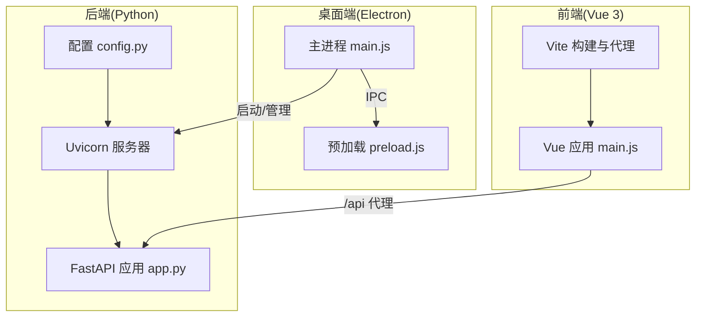
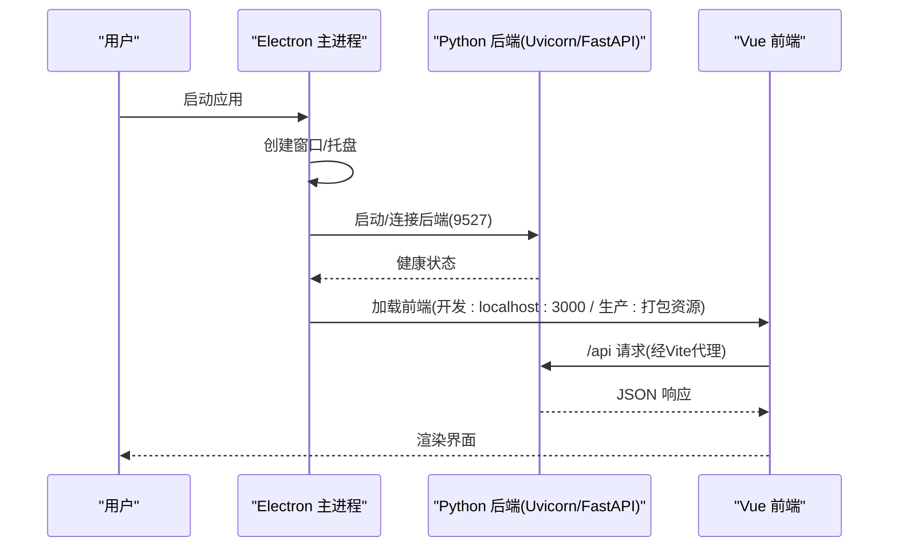
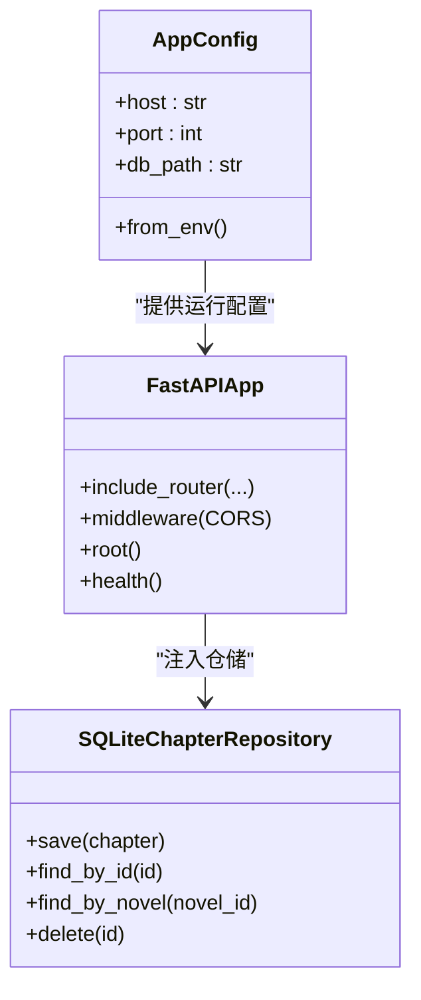
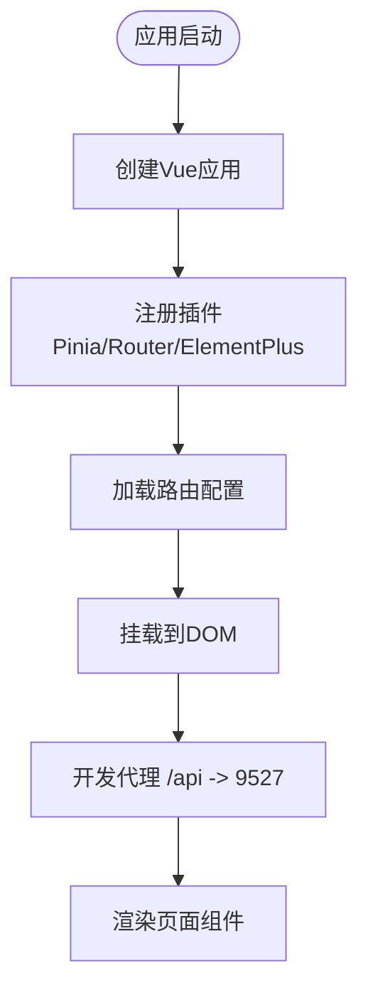
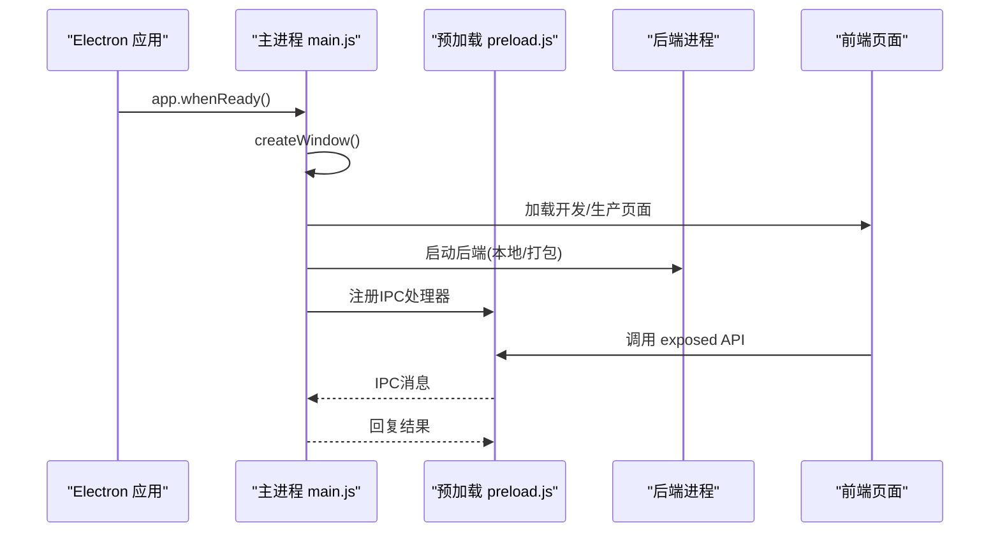
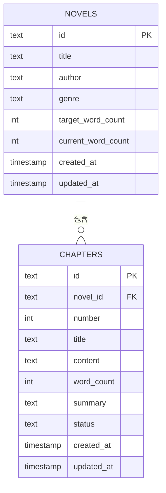
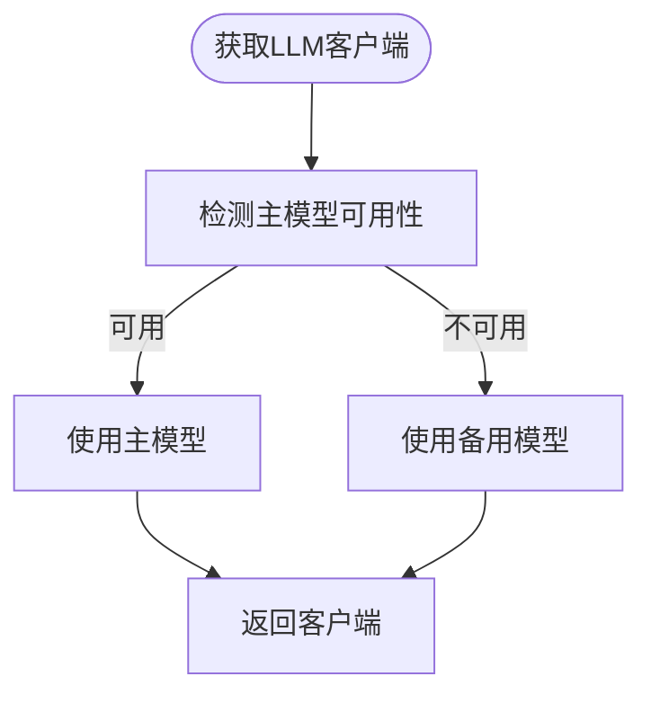
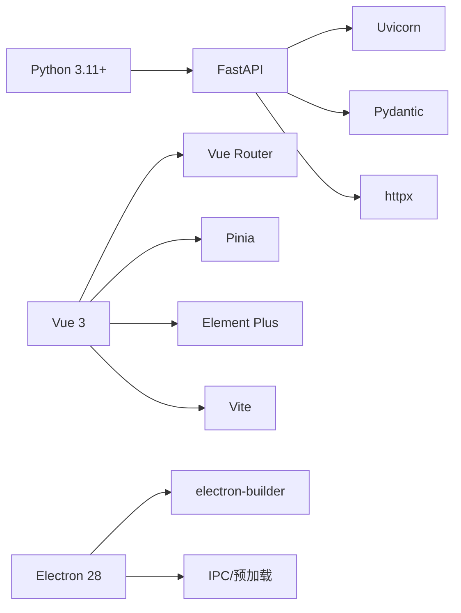

# 技术栈选型

<cite>
**本文引用的文件**
- [package.json](file://package.json)
- [requirements.txt](file://requirements.txt)
- [main.py](file://main.py)
- [config.py](file://config.py)
- [presentation/api/app.py](file://presentation/api/app.py)
- [frontend/package.json](file://frontend/package.json)
- [frontend/vite.config.js](file://frontend/vite.config.js)
- [frontend/src/main.js](file://frontend/src/main.js)
- [desktop/main.js](file://desktop/main.js)
- [desktop/preload.js](file://desktop/preload.js)
- [infrastructure/persistence/sqlite_chapter_repo.py](file://infrastructure/persistence/sqlite_chapter_repo.py)
- [infrastructure/llm/llm_factory.py](file://infrastructure/llm/llm_factory.py)
- [README.md](file://README.md)
- [domain/entities/novel.py](file://domain/entities/novel.py)
- [application/services/project_service.py](file://application/services/project_service.py)
</cite>

## 目录
1. [引言](#引言)
2. [项目结构](#项目结构)
3. [核心组件](#核心组件)
4. [架构总览](#架构总览)
5. [详细组件分析](#详细组件分析)
6. [依赖分析](#依赖分析)
7. [性能考量](#性能考量)
8. [故障排查指南](#故障排查指南)
9. [结论](#结论)
10. [附录](#附录)

## 引言
本文件面向InkTrace项目的“技术栈选型”，系统阐述后端（Python 3.11+、FastAPI、SQLite）、前端（Vue 3、Vite、Element Plus）、桌面应用（Electron）三部分的技术选型依据、版本兼容性、性能与生态影响，并给出升级路径与替代方案对比，帮助读者理解技术决策如何塑造系统架构与约束。

## 项目结构
InkTrace采用分层清晰的代码组织：领域层(domain)、应用层(application)、基础设施层(infrastructure)、表现层(presentation)以及独立的前端(frontend)与桌面端(desktop)。后端以FastAPI提供REST API，前端通过Vite构建并使用Vue 3/Element Plus，桌面端以Electron承载前后端运行时，统一通过9527端口通信。

图示来源
- [desktop/main.js:130-141](file://desktop/main.js#L130-L141)
- [main.py:15-21](file://main.py#L15-L21)
- [presentation/api/app.py:19-66](file://presentation/api/app.py#L19-L66)
- [frontend/vite.config.js:13-21](file://frontend/vite.config.js#L13-L21)
- [frontend/src/main.js:1-23](file://frontend/src/main.js#L1-L23)
- [config.py:14-46](file://config.py#L14-L46)

章节来源
- [README.md:72-106](file://README.md#L72-L106)

## 核心组件
- 后端框架：FastAPI 0.104+ + Uvicorn 0.24+，提供高性能异步API与自动生成OpenAPI文档。
- 数据存储：SQLite（内置数据库），结合aiofiles/aiosqlite进行异步IO；同时集成ChromaDB向量索引用于RAG检索。
- 大模型接入：LLM工厂模式支持主备模型（DeepSeek/Kimi）自动切换。
- 前端框架：Vue 3 + Vue Router + Pinia + Element Plus + Vite，组件化UI与现代化构建。
- 桌面端：Electron 28 + electron-builder，跨平台打包与系统托盘管理。

章节来源
- [requirements.txt:1-10](file://requirements.txt#L1-L10)
- [frontend/package.json:11-22](file://frontend/package.json#L11-L22)
- [package.json:16-19](file://package.json#L16-L19)
- [presentation/api/app.py:11-33](file://presentation/api/app.py#L11-L33)
- [infrastructure/llm/llm_factory.py:31-95](file://infrastructure/llm/llm_factory.py#L31-L95)
- [infrastructure/persistence/sqlite_chapter_repo.py:19-31](file://infrastructure/persistence/sqlite_chapter_repo.py#L19-L31)

## 架构总览
InkTrace采用“桌面容器 + 内嵌后端 + 前端”的混合架构。Electron主进程负责窗口生命周期、系统托盘与IPC；后端作为独立进程或可执行文件运行于本地9527端口；前端在开发模式下由Vite热更新，在生产模式下静态打包并与桌面端资源一起分发。

图示来源
- [desktop/main.js:161-186](file://desktop/main.js#L161-L186)
- [main.py:15-21](file://main.py#L15-L21)
- [presentation/api/app.py:54-61](file://presentation/api/app.py#L54-L61)
- [frontend/vite.config.js:15-20](file://frontend/vite.config.js#L15-L20)

## 详细组件分析

### 后端技术栈（Python 3.11+、FastAPI、SQLite）
- 语言与运行时
  - Python 3.11+：满足类型注解、异步生态与性能需求。
  - Uvicorn：ASGI服务器，支持异步路由与高并发。
- Web框架
  - FastAPI：强类型路由、Pydantic数据验证、自动生成交互式API文档，降低前后端耦合。
- 数据持久化
  - SQLite：单机轻量、零配置部署，适合桌面应用与中小规模数据。
  - aiosqlite：异步读写，避免阻塞事件循环。
  - ChromaDB：向量索引，支撑RAG检索。
- 生态与工具
  - httpx、pytest、sentence-transformers等，覆盖HTTP客户端、测试与嵌入向量。

图示来源
- [config.py:14-46](file://config.py#L14-L46)
- [presentation/api/app.py:19-66](file://presentation/api/app.py#L19-L66)
- [infrastructure/persistence/sqlite_chapter_repo.py:19-31](file://infrastructure/persistence/sqlite_chapter_repo.py#L19-L31)

章节来源
- [requirements.txt:1-10](file://requirements.txt#L1-L10)
- [config.py:14-46](file://config.py#L14-L46)
- [presentation/api/app.py:19-66](file://presentation/api/app.py#L19-L66)
- [infrastructure/persistence/sqlite_chapter_repo.py:19-31](file://infrastructure/persistence/sqlite_chapter_repo.py#L19-L31)

### 前端技术栈（Vue 3、Vite、Element Plus）
- 框架与状态
  - Vue 3：组合式API、更好的TS支持与性能；配合Pinia进行状态管理。
  - Vue Router：多视图路由，支持页面级导航。
- UI组件库
  - Element Plus：开箱即用的桌面风格组件，提供中文化与图标体系。
- 构建与开发体验
  - Vite：快速冷启动、热更新、原生ESM、代理转发至后端9527端口。
- 与后端协作
  - Axios封装请求；路由与布局组件化，视图按功能拆分。

图示来源
- [frontend/src/main.js:1-23](file://frontend/src/main.js#L1-L23)
- [frontend/vite.config.js:13-21](file://frontend/vite.config.js#L13-L21)

章节来源
- [frontend/package.json:11-22](file://frontend/package.json#L11-L22)
- [frontend/src/main.js:1-23](file://frontend/src/main.js#L1-L23)
- [frontend/vite.config.js:1-28](file://frontend/vite.config.js#L1-L28)

### 桌面应用技术栈（Electron）
- 进程模型
  - 主进程：窗口、托盘、菜单、IPC、进程生命周期管理。
  - 预加载：通过contextBridge暴露受控API给渲染进程。
- 启动流程
  - 开发：前端本地开发服务器，后端本地进程。
  - 生产：打包后将前端dist与后端资源嵌入，主进程加载本地资源并启动后端。
- 安全与隔离
  - 禁用nodeIntegration，启用contextIsolation与预加载桥接，降低安全风险。

图示来源
- [desktop/main.js:161-186](file://desktop/main.js#L161-L186)
- [desktop/preload.js:9-24](file://desktop/preload.js#L9-L24)

章节来源
- [package.json:5-19](file://package.json#L5-L19)
- [desktop/main.js:130-141](file://desktop/main.js#L130-L141)
- [desktop/preload.js:1-25](file://desktop/preload.js#L1-L25)

### 数据模型与仓储（SQLite）
- 设计要点
  - 仓储接口与SQLite实现分离，便于替换存储后端。
  - 使用Row工厂与类型转换，保证领域对象与数据库记录的一致映射。
- 性能与扩展
  - 对常用查询建立索引（如外键字段）；对于大批量写入采用事务或批量插入。
  - 若数据增长，可评估迁移到PostgreSQL/MySQL或引入连接池。

图示来源
- [infrastructure/persistence/sqlite_chapter_repo.py:34-49](file://infrastructure/persistence/sqlite_chapter_repo.py#L34-L49)
- [domain/entities/novel.py:20-40](file://domain/entities/novel.py#L20-L40)

章节来源
- [infrastructure/persistence/sqlite_chapter_repo.py:19-125](file://infrastructure/persistence/sqlite_chapter_repo.py#L19-L125)
- [domain/entities/novel.py:20-178](file://domain/entities/novel.py#L20-L178)

### LLM工厂与主备模型切换
- 工厂职责
  - 统一管理主备模型客户端，按可用性自动切换，提升稳定性。
- 可靠性策略
  - 在调用前探测可用性，失败时回退备用模型；支持手动重置为主模型。
- 配置来源
  - 从环境变量读取API密钥与基础URL，避免硬编码。

图示来源
- [infrastructure/llm/llm_factory.py:78-95](file://infrastructure/llm/llm_factory.py#L78-L95)

章节来源
- [infrastructure/llm/llm_factory.py:19-121](file://infrastructure/llm/llm_factory.py#L19-L121)
- [config.py:26-42](file://config.py#L26-L42)

## 依赖分析
- 版本兼容性
  - Python 3.11+：满足类型注解与异步特性。
  - FastAPI 0.104+、Uvicorn 0.24+：保持与Pydantic 2.x兼容。
  - Vue 3.4+、Vite 5.x：现代生态，热更新与ESM友好。
  - Electron 28：稳定长期支持版本，与electron-builder 24.x配合良好。
- 外部依赖
  - httpx：异步HTTP客户端，替代requests。
  - pytest：单元测试与覆盖率。
  - ChromaDB + sentence-transformers：RAG向量检索。
- 内部耦合
  - 前端通过Vite代理访问后端；桌面端通过IPC与后端交互；后端依赖仓储与领域服务。

图示来源
- [requirements.txt:1-10](file://requirements.txt#L1-L10)
- [frontend/package.json:11-22](file://frontend/package.json#L11-L22)
- [package.json:16-19](file://package.json#L16-L19)

章节来源
- [requirements.txt:1-10](file://requirements.txt#L1-L10)
- [frontend/package.json:11-22](file://frontend/package.json#L11-L22)
- [package.json:16-19](file://package.json#L16-L19)

## 性能考量
- 后端
  - 异步路由与中间件减少阻塞；SQLite适合小中型数据；向量检索建议限制上下文长度与批处理。
- 前端
  - Vite按需加载与Tree-shaking优化；Element Plus按需引入可减小体积。
- 桌面端
  - 预加载桥接与最小权限原则降低IPC开销；开发/生产模式差异明确，避免不必要的网络请求。
- 升级建议
  - 后端：逐步迁移至更成熟的异步ORM（如Tortoise ORM）以简化复杂查询；引入连接池与缓存。
  - 前端：升级到Vue 3.5+与Vite 6+，关注新特性的兼容性；按需加载Element Plus组件。
  - 桌面端：electron-builder升级至最新版本，关注asar与签名策略变更。

## 故障排查指南
- 后端无法启动
  - 检查端口占用与主机绑定；确认配置项是否从环境变量正确加载。
- 前端代理失败
  - 确认Vite代理目标指向127.0.0.1:9527；开发模式下确保后端已启动。
- 桌面端前端资源缺失
  - 查看主进程日志中的资源路径与存在性判断；确认打包时包含frontend/dist与backend资源。
- LLM不可用
  - 检查API密钥与网络连通；工厂会自动切换备用模型，可在日志中定位切换原因。

章节来源
- [main.py:15-21](file://main.py#L15-L21)
- [config.py:30-46](file://config.py#L30-L46)
- [frontend/vite.config.js:15-20](file://frontend/vite.config.js#L15-L20)
- [desktop/main.js:52-74](file://desktop/main.js#L52-L74)
- [infrastructure/llm/llm_factory.py:78-95](file://infrastructure/llm/llm_factory.py#L78-L95)

## 结论
InkTrace的技术栈围绕“易部署、低门槛、可维护”展开：后端以FastAPI+SQLite+异步IO实现高效率与可扩展性；前端以Vue 3/Vite/Element Plus提供现代化开发体验；桌面端以Electron统一交付。该选型在当前阶段具备良好的性能与生态支持，适合个人或小团队迭代演进。后续可根据数据规模与功能复杂度，逐步引入连接池、ORM、缓存与更完善的可观测性。

## 附录
- 技术栈升级路径
  - 后端：FastAPI/Pydantic升级、引入Tortoise ORM、连接池与缓存中间件。
  - 前端：Vue 3.5+、Vite 6+、按需引入Element Plus、TypeScript强化。
  - 桌面端：electron-builder升级、asar与签名策略更新、自动更新机制。
- 替代方案对比
  - Web框架：Django/Flask（更传统但生态庞大）、Starlette（底层ASGI）。
  - 数据库：PostgreSQL/MySQL（企业级能力更强）、Redis/MongoDB（特定场景）。
  - 前端：React + Ant Design（生态成熟）、SvelteKit（更轻量）。
  - 桌面端：Tauri（Rust后端，内存占用更低）、WebView（系统原生控件）。

章节来源
- [README.md:172-187](file://README.md#L172-L187)
- [requirements.txt:1-10](file://requirements.txt#L1-L10)
- [frontend/package.json:11-22](file://frontend/package.json#L11-L22)
- [package.json:16-19](file://package.json#L16-L19)