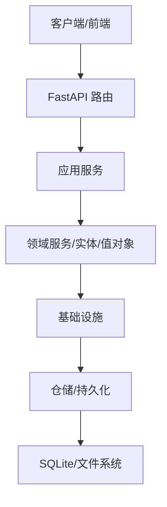
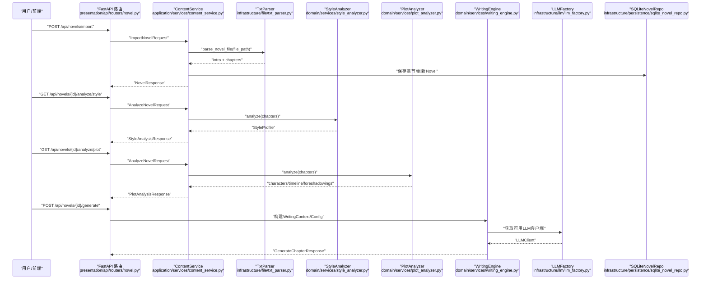
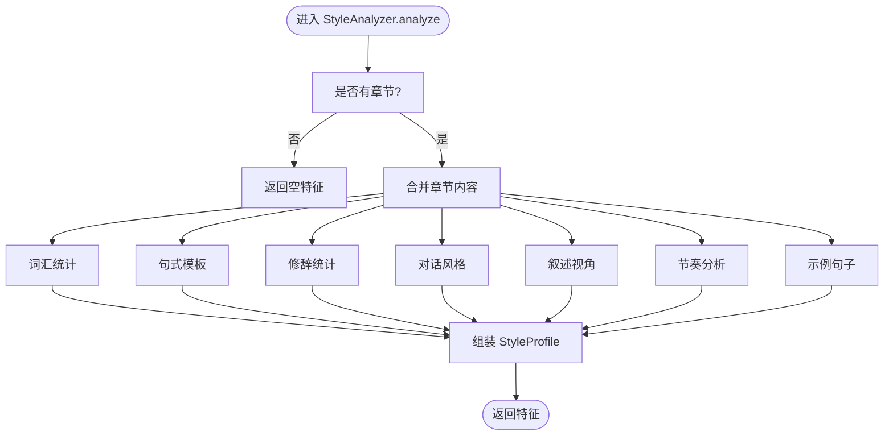
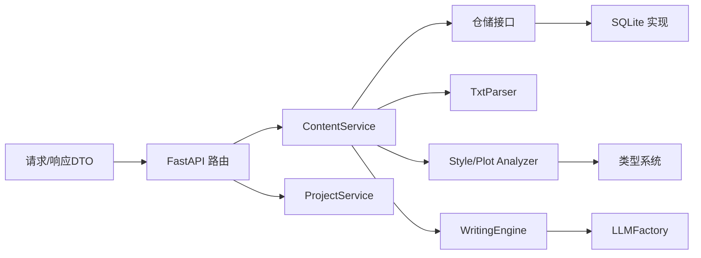

# 数据流分析

<cite>
**本文引用的文件**
- [application/dto/request_dto.py](file://application/dto/request_dto.py)
- [application/dto/response_dto.py](file://application/dto/response_dto.py)
- [domain/entities/novel.py](file://domain/entities/novel.py)
- [domain/entities/chapter.py](file://domain/entities/chapter.py)
- [domain/services/style_analyzer.py](file://domain/services/style_analyzer.py)
- [domain/services/plot_analyzer.py](file://domain/services/plot_analyzer.py)
- [domain/services/writing_engine.py](file://domain/services/writing_engine.py)
- [domain/value_objects/style_profile.py](file://domain/value_objects/style_profile.py)
- [domain/types.py](file://domain/types.py)
- [infrastructure/file/txt_parser.py](file://infrastructure/file/txt_parser.py)
- [infrastructure/llm/llm_factory.py](file://infrastructure/llm/llm_factory.py)
- [presentation/api/routers/novel.py](file://presentation/api/routers/novel.py)
- [application/services/content_service.py](file://application/services/content_service.py)
- [application/services/project_service.py](file://application/services/project_service.py)
- [infrastructure/persistence/sqlite_novel_repo.py](file://infrastructure/persistence/sqlite_novel_repo.py)
</cite>

## 目录
1. [简介](#简介)
2. [项目结构与数据流概览](#项目结构与数据流概览)
3. [核心数据结构与类型](#核心数据结构与类型)
4. [架构总览](#架构总览)
5. [详细数据流分析](#详细数据流分析)
6. [依赖关系分析](#依赖关系分析)
7. [性能与可扩展性](#性能与可扩展性)
8. [故障排查与错误恢复](#故障排查与错误恢复)
9. [结论](#结论)

## 简介
本文面向InkTrace项目的“小说导入—文风分析—剧情提取—AI生成—连贯性检查—结果输出”全链路，系统化梳理数据在各层之间的传递格式、转换规则与验证机制，给出数据流图与时序图，并讨论缓存策略、性能优化与错误恢复。

## 项目结构与数据流概览
InkTrace采用分层架构：
- 表现层（Presentation）：FastAPI路由接收请求，调用应用服务。
- 应用层（Application）：服务编排业务流程，协调仓储与基础设施。
- 领域层（Domain）：实体、值对象、领域服务承载业务规则。
- 基础设施层（Infrastructure）：文件解析、LLM客户端、持久化等。

数据流自上而下贯穿：请求DTO → 应用服务 → 领域实体/值对象 → 领域服务 → 基础设施 → 响应DTO。

```mermaid
graph TB
subgraph "表现层"
R["FastAPI 路由<br/>presentation/api/routers/novel.py"]
end
subgraph "应用层"
S1["ContentService<br/>application/services/content_service.py"]
S2["ProjectService<br/>application/services/project_service.py"]
end
subgraph "领域层"
E1["Novel 实体<br/>domain/entities/novel.py"]
E2["Chapter 实体<br/>domain/entities/chapter.py"]
V1["StyleProfile 值对象<br/>domain/value_objects/style_profile.py"]
D1["StyleAnalyzer 领域服务<br/>domain/services/style_analyzer.py"]
D2["PlotAnalyzer 领域服务<br/>domain/services/plot_analyzer.py"]
D3["WritingEngine 领域服务<br/>domain/services/writing_engine.py"]
T1["类型定义<br/>domain/types.py"]
end
subgraph "基础设施层"
F1["TxtParser 文件解析<br/>infrastructure/file/txt_parser.py"]
F2["LLM 工厂<br/>infrastructure/llm/llm_factory.py"]
P1["SQLite 小说仓储<br/>infrastructure/persistence/sqlite_novel_repo.py"]
end
subgraph "数据传输层"
DTO1["请求DTO<br/>application/dto/request_dto.py"]
DTO2["响应DTO<br/>application/dto/response_dto.py"]
end
DTO1 --> R --> S1
R --> S2
S1 --> F1
S1 --> D1
S1 --> D2
S1 --> E1
S1 --> E2
S1 --> P1
D3 --> F2
E1 --> P1
E2 --> P1
DTO2 <-- S1
DTO2 <-- S2
```

图表来源
- [presentation/api/routers/novel.py:1-162](file://presentation/api/routers/novel.py#L1-L162)
- [application/services/content_service.py:1-169](file://application/services/content_service.py#L1-L169)
- [application/services/project_service.py:1-203](file://application/services/project_service.py#L1-L203)
- [domain/entities/novel.py:1-178](file://domain/entities/novel.py#L1-L178)
- [domain/entities/chapter.py:1-109](file://domain/entities/chapter.py#L1-L109)
- [domain/value_objects/style_profile.py:1-30](file://domain/value_objects/style_profile.py#L1-L30)
- [domain/services/style_analyzer.py:1-286](file://domain/services/style_analyzer.py#L1-L286)
- [domain/services/plot_analyzer.py:1-225](file://domain/services/plot_analyzer.py#L1-L225)
- [domain/services/writing_engine.py:1-184](file://domain/services/writing_engine.py#L1-L184)
- [domain/types.py:1-284](file://domain/types.py#L1-L284)
- [infrastructure/file/txt_parser.py:1-316](file://infrastructure/file/txt_parser.py#L1-L316)
- [infrastructure/llm/llm_factory.py:1-121](file://infrastructure/llm/llm_factory.py#L1-L121)
- [infrastructure/persistence/sqlite_novel_repo.py:1-116](file://infrastructure/persistence/sqlite_novel_repo.py#L1-L116)
- [application/dto/request_dto.py:1-97](file://application/dto/request_dto.py#L1-L97)
- [application/dto/response_dto.py:1-200](file://application/dto/response_dto.py#L1-L200)

章节来源
- [presentation/api/routers/novel.py:1-162](file://presentation/api/routers/novel.py#L1-L162)
- [application/services/content_service.py:1-169](file://application/services/content_service.py#L1-L169)
- [application/services/project_service.py:1-203](file://application/services/project_service.py#L1-L203)
- [domain/entities/novel.py:1-178](file://domain/entities/novel.py#L1-L178)
- [domain/entities/chapter.py:1-109](file://domain/entities/chapter.py#L1-L109)
- [domain/value_objects/style_profile.py:1-30](file://domain/value_objects/style_profile.py#L1-L30)
- [domain/services/style_analyzer.py:1-286](file://domain/services/style_analyzer.py#L1-L286)
- [domain/services/plot_analyzer.py:1-225](file://domain/services/plot_analyzer.py#L1-L225)
- [domain/services/writing_engine.py:1-184](file://domain/services/writing_engine.py#L1-L184)
- [domain/types.py:1-284](file://domain/types.py#L1-L284)
- [infrastructure/file/txt_parser.py:1-316](file://infrastructure/file/txt_parser.py#L1-L316)
- [infrastructure/llm/llm_factory.py:1-121](file://infrastructure/llm/llm_factory.py#L1-L121)
- [infrastructure/persistence/sqlite_novel_repo.py:1-116](file://infrastructure/persistence/sqlite_novel_repo.py#L1-L116)
- [application/dto/request_dto.py:1-97](file://application/dto/request_dto.py#L1-L97)
- [application/dto/response_dto.py:1-200](file://application/dto/response_dto.py#L1-L200)

## 核心数据结构与类型
- 请求DTO：统一承载用户会话与业务参数，如创建小说、导入小说、分析、生成章节、续写、导出等。
- 响应DTO：标准化输出结构，包含成功标志、消息、trace_id以及具体业务数据。
- 领域实体：
  - Novel：聚合根，维护章节、人物、大纲与字数统计。
  - Chapter：章节实体，包含标题、内容、字数、状态等。
- 值对象：
  - StyleProfile：文风特征集合，供写作引擎应用文风。
- 类型系统：
  - ID值对象（NovelId、ChapterId等）与枚举（状态、题材、角色等），确保类型安全与边界清晰。
- 文件解析：
  - TxtParser：识别章节标题、抽取章节、统计字数、解析大纲字段。
- LLM工厂：
  - LLMFactory：主备模型切换与可用性探测，保障生成稳定性。

章节来源
- [application/dto/request_dto.py:14-97](file://application/dto/request_dto.py#L14-L97)
- [application/dto/response_dto.py:15-200](file://application/dto/response_dto.py#L15-L200)
- [domain/entities/novel.py:20-178](file://domain/entities/novel.py#L20-L178)
- [domain/entities/chapter.py:18-109](file://domain/entities/chapter.py#L18-L109)
- [domain/value_objects/style_profile.py:14-30](file://domain/value_objects/style_profile.py#L14-L30)
- [domain/types.py:15-284](file://domain/types.py#L15-L284)
- [infrastructure/file/txt_parser.py:25-316](file://infrastructure/file/txt_parser.py#L25-L316)
- [infrastructure/llm/llm_factory.py:31-121](file://infrastructure/llm/llm_factory.py#L31-L121)

## 架构总览
InkTrace遵循Clean Architecture分层，数据以DTO为边界，应用服务编排业务，领域服务承载规则，基础设施提供能力，仓储持久化实体。



图表来源
- [presentation/api/routers/novel.py:1-162](file://presentation/api/routers/novel.py#L1-L162)
- [application/services/content_service.py:1-169](file://application/services/content_service.py#L1-L169)
- [domain/services/style_analyzer.py:1-286](file://domain/services/style_analyzer.py#L1-L286)
- [domain/services/plot_analyzer.py:1-225](file://domain/services/plot_analyzer.py#L1-L225)
- [infrastructure/file/txt_parser.py:1-316](file://infrastructure/file/txt_parser.py#L1-L316)
- [infrastructure/llm/llm_factory.py:1-121](file://infrastructure/llm/llm_factory.py#L1-L121)
- [infrastructure/persistence/sqlite_novel_repo.py:1-116](file://infrastructure/persistence/sqlite_novel_repo.py#L1-L116)

## 详细数据流分析

### 典型场景：文件上传→文本解析→文风分析→剧情提取→AI生成→连贯性检查→结果输出
该流程覆盖导入、分析、生成与输出的关键节点，以下通过序列图与流程图展示。



图表来源
- [presentation/api/routers/novel.py:1-162](file://presentation/api/routers/novel.py#L1-L162)
- [application/services/content_service.py:52-147](file://application/services/content_service.py#L52-L147)
- [infrastructure/file/txt_parser.py:67-139](file://infrastructure/file/txt_parser.py#L67-L139)
- [domain/services/style_analyzer.py:25-66](file://domain/services/style_analyzer.py#L25-L66)
- [domain/services/plot_analyzer.py:55-75](file://domain/services/plot_analyzer.py#L55-L75)
- [domain/services/writing_engine.py:52-80](file://domain/services/writing_engine.py#L52-L80)
- [infrastructure/llm/llm_factory.py:78-95](file://infrastructure/llm/llm_factory.py#L78-L95)
- [infrastructure/persistence/sqlite_novel_repo.py:50-89](file://infrastructure/persistence/sqlite_novel_repo.py#L50-L89)

章节来源
- [presentation/api/routers/novel.py:1-162](file://presentation/api/routers/novel.py#L1-L162)
- [application/services/content_service.py:52-147](file://application/services/content_service.py#L52-L147)
- [infrastructure/file/txt_parser.py:67-139](file://infrastructure/file/txt_parser.py#L67-L139)
- [domain/services/style_analyzer.py:25-66](file://domain/services/style_analyzer.py#L25-L66)
- [domain/services/plot_analyzer.py:55-75](file://domain/services/plot_analyzer.py#L55-L75)
- [domain/services/writing_engine.py:52-80](file://domain/services/writing_engine.py#L52-L80)
- [infrastructure/llm/llm_factory.py:78-95](file://infrastructure/llm/llm_factory.py#L78-L95)
- [infrastructure/persistence/sqlite_novel_repo.py:50-89](file://infrastructure/persistence/sqlite_novel_repo.py#L50-L89)

### 数据在各层之间的传递与转换
- 请求层（DTO）：统一参数校验与默认值，保证上层调用契约稳定。
- 应用服务：编排业务步骤，协调仓储与基础设施；负责异常与边界条件处理。
- 领域服务：执行纯业务逻辑（文风/剧情分析、生成提示词构建、文风应用）。
- 基础设施：文件解析、LLM客户端、持久化。
- 响应层（DTO）：标准化输出，便于前端消费。

章节来源
- [application/dto/request_dto.py:14-97](file://application/dto/request_dto.py#L14-L97)
- [application/dto/response_dto.py:15-200](file://application/dto/response_dto.py#L15-L200)
- [application/services/content_service.py:52-147](file://application/services/content_service.py#L52-L147)
- [domain/services/style_analyzer.py:25-66](file://domain/services/style_analyzer.py#L25-L66)
- [domain/services/plot_analyzer.py:55-75](file://domain/services/plot_analyzer.py#L55-L75)
- [domain/services/writing_engine.py:52-80](file://domain/services/writing_engine.py#L52-L80)

### 关键算法与处理逻辑
- 文风分析（StyleAnalyzer）
  - 词汇统计：高频词、平均词长、词汇丰富度。
  - 句式模板：基于逗号分割的句式模式提取。
  - 修辞统计：比喻、拟人、排比、夸张计数。
  - 对话风格：平均长度与语气标记（感叹/疑问）。
  - 叙述视角：第一/第三人称比例判断。
  - 节奏：短句占比评估快/中/慢节奏。
  - 示例句子：抽样展示风格特征。



图表来源
- [domain/services/style_analyzer.py:25-66](file://domain/services/style_analyzer.py#L25-L66)
- [domain/services/style_analyzer.py:68-286](file://domain/services/style_analyzer.py#L68-L286)

章节来源
- [domain/services/style_analyzer.py:25-286](file://domain/services/style_analyzer.py#L25-L286)

- 剧情分析（PlotAnalyzer）
  - 人物：基于命名模式与出现频次提取主要角色。
  - 时间线：识别时间词与事件句，抽取章节与描述。
  - 伏笔：匹配“神秘/等待/埋下/暗示”等关键词，记录章节与状态。

章节来源
- [domain/services/plot_analyzer.py:55-225](file://domain/services/plot_analyzer.py#L55-L225)

- AI生成（WritingEngine）
  - 构建提示词：包含小说信息、大纲摘要、剧情方向、前文摘要与写作要求。
  - LLM调用：通过工厂选择主/备客户端，异步或同步生成内容。
  - 文风应用：按需将文风特征映射到生成内容（当前实现保留占位）。

章节来源
- [domain/services/writing_engine.py:52-184](file://domain/services/writing_engine.py#L52-L184)
- [infrastructure/llm/llm_factory.py:78-121](file://infrastructure/llm/llm_factory.py#L78-L121)

- 文件解析（TxtParser）
  - 章节模式检测：多语言/数字/中文序号识别。
  - 章节抽取：按标题匹配切分正文，统计字数。
  - 大纲解析：按字段映射抽取题材、背景、目标字数等。
  - 小节提取：按行标题分段。

章节来源
- [infrastructure/file/txt_parser.py:45-316](file://infrastructure/file/txt_parser.py#L45-L316)

- 持久化（SQLiteNovelRepository）
  - 表结构：存储小说元数据与统计字段。
  - CRUD：保存、查询、删除，支持按ID与全表查询。

章节来源
- [infrastructure/persistence/sqlite_novel_repo.py:20-116](file://infrastructure/persistence/sqlite_novel_repo.py#L20-L116)

## 依赖关系分析
- DTO与路由：路由依赖请求DTO进行参数校验，返回响应DTO。
- 应用服务依赖仓储与基础设施：ContentService依赖TxtParser、StyleAnalyzer、PlotAnalyzer与仓储；ProjectService管理项目生命周期。
- 领域服务依赖类型系统：使用ID值对象与枚举确保一致性。
- 基础设施解耦于领域：LLM工厂屏蔽模型差异；TxtParser封装解析细节。
- 仓储抽象：INovelRepository接口隔离SQLite实现。



图表来源
- [application/dto/request_dto.py:1-97](file://application/dto/request_dto.py#L1-L97)
- [application/dto/response_dto.py:1-200](file://application/dto/response_dto.py#L1-L200)
- [presentation/api/routers/novel.py:1-162](file://presentation/api/routers/novel.py#L1-L162)
- [application/services/content_service.py:1-169](file://application/services/content_service.py#L1-L169)
- [application/services/project_service.py:1-203](file://application/services/project_service.py#L1-L203)
- [domain/services/style_analyzer.py:1-286](file://domain/services/style_analyzer.py#L1-L286)
- [domain/services/plot_analyzer.py:1-225](file://domain/services/plot_analyzer.py#L1-L225)
- [domain/services/writing_engine.py:1-184](file://domain/services/writing_engine.py#L1-L184)
- [domain/types.py:1-284](file://domain/types.py#L1-L284)
- [infrastructure/file/txt_parser.py:1-316](file://infrastructure/file/txt_parser.py#L1-L316)
- [infrastructure/llm/llm_factory.py:1-121](file://infrastructure/llm/llm_factory.py#L1-L121)
- [infrastructure/persistence/sqlite_novel_repo.py:1-116](file://infrastructure/persistence/sqlite_novel_repo.py#L1-L116)

章节来源
- [application/dto/request_dto.py:1-97](file://application/dto/request_dto.py#L1-L97)
- [application/dto/response_dto.py:1-200](file://application/dto/response_dto.py#L1-L200)
- [presentation/api/routers/novel.py:1-162](file://presentation/api/routers/novel.py#L1-L162)
- [application/services/content_service.py:1-169](file://application/services/content_service.py#L1-L169)
- [application/services/project_service.py:1-203](file://application/services/project_service.py#L1-L203)
- [domain/services/style_analyzer.py:1-286](file://domain/services/style_analyzer.py#L1-L286)
- [domain/services/plot_analyzer.py:1-225](file://domain/services/plot_analyzer.py#L1-L225)
- [domain/services/writing_engine.py:1-184](file://domain/services/writing_engine.py#L1-L184)
- [domain/types.py:1-284](file://domain/types.py#L1-L284)
- [infrastructure/file/txt_parser.py:1-316](file://infrastructure/file/txt_parser.py#L1-L316)
- [infrastructure/llm/llm_factory.py:1-121](file://infrastructure/llm/llm_factory.py#L1-L121)
- [infrastructure/persistence/sqlite_novel_repo.py:1-116](file://infrastructure/persistence/sqlite_novel_repo.py#L1-L116)

## 性能与可扩展性
- 缓存策略
  - 文风/剧情分析结果可缓存至内存或Redis，避免重复计算；以novel_id为Key，设置TTL。
  - 生成提示词构建可复用最近N章摘要，减少重复拼接。
- 并发与异步
  - LLM调用建议异步执行，结合任务队列（如Celery）处理长耗时生成。
  - 批量导入章节时，采用批量插入与事务提交，降低IO开销。
- 分页与分片
  - 大量章节查询使用分页；对全文检索可引入向量索引（RAG）加速。
- 错误与降级
  - LLM工厂主备切换与可用性探测，失败时快速降级。
  - 文件解析失败时返回结构化错误，提示修复章节标题格式。

[本节为通用性能建议，不直接分析具体文件，故无章节来源]

## 故障排查与错误恢复
- 参数校验
  - 请求DTO内置字段长度、数值范围与必填约束，路由层统一拦截非法请求。
- 异常传播
  - 应用服务捕获领域异常（如章节已发布/未发布），转换为HTTP 4xx并返回标准错误响应。
- 日志与追踪
  - 响应DTO包含trace_id，便于端到端追踪。
- 恢复机制
  - LLM工厂在主模型不可用时自动切换备用模型；可配置重试与熔断。
  - 导入失败时回滚已保存的章节，保持数据一致性。

章节来源
- [application/dto/request_dto.py:14-97](file://application/dto/request_dto.py#L14-L97)
- [application/dto/response_dto.py:109-116](file://application/dto/response_dto.py#L109-L116)
- [domain/entities/chapter.py:76-109](file://domain/entities/chapter.py#L76-L109)
- [infrastructure/llm/llm_factory.py:78-121](file://infrastructure/llm/llm_factory.py#L78-L121)

## 结论
InkTrace通过清晰的分层与DTO契约，实现了从文件导入到AI生成的闭环数据流。领域服务承载核心规则，基础设施提供可插拔能力，仓储与类型系统确保一致性与可维护性。建议在现有基础上引入缓存、异步与RAG检索，进一步提升性能与可扩展性。