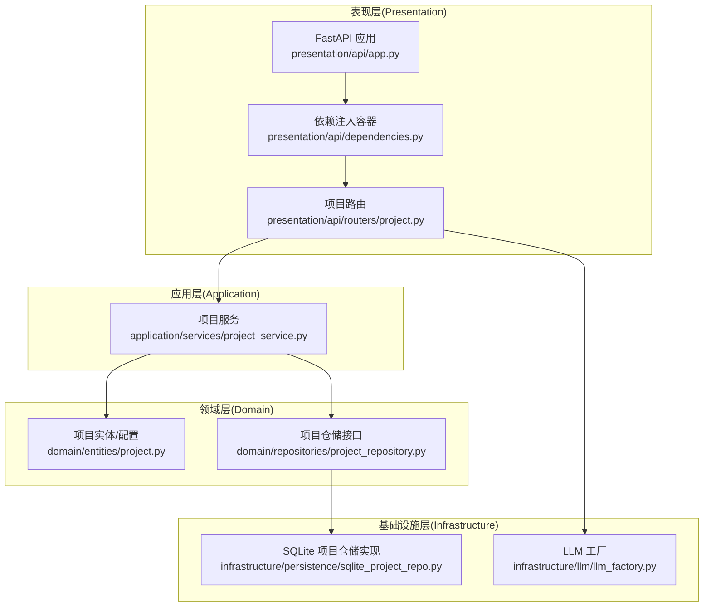
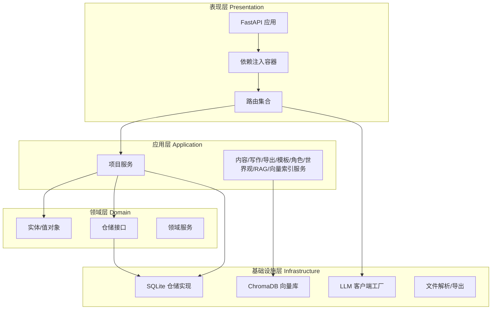
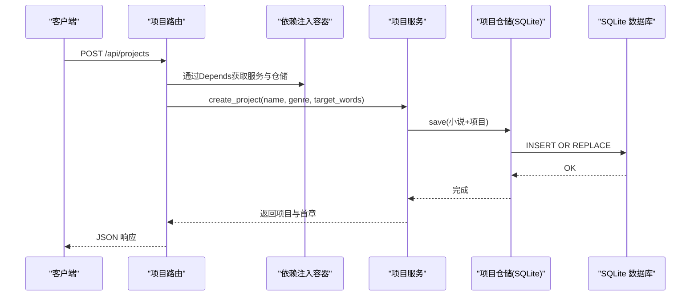
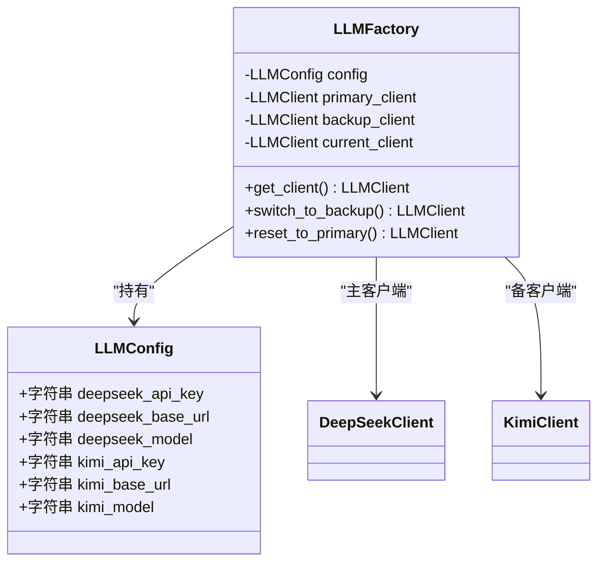
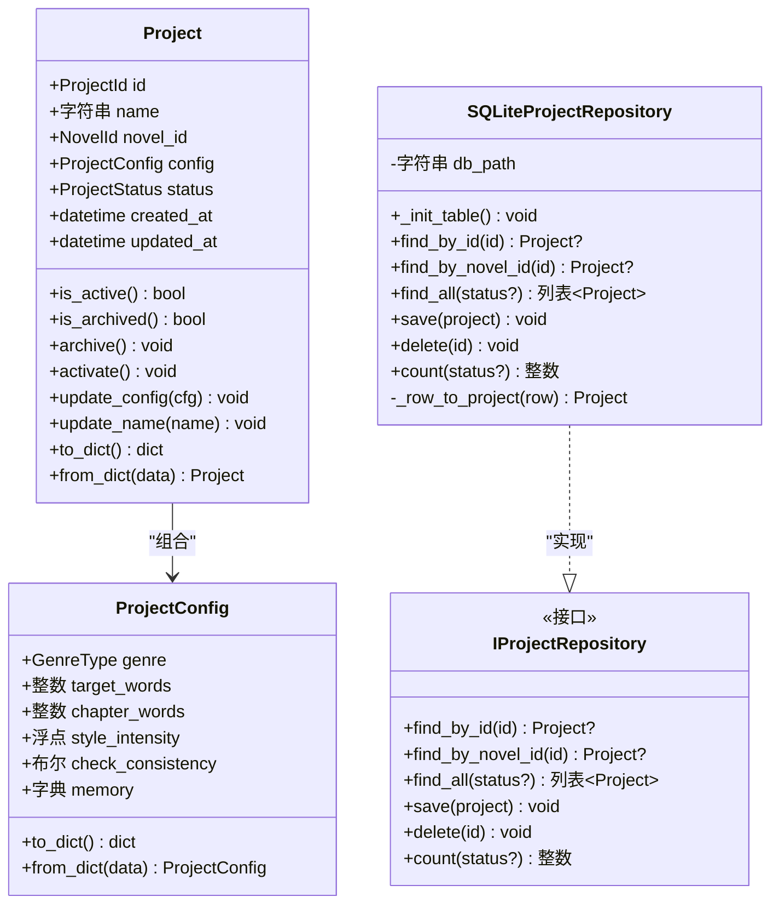
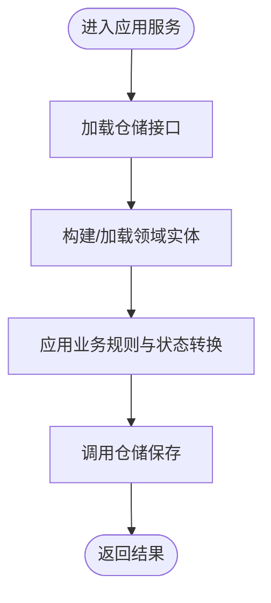
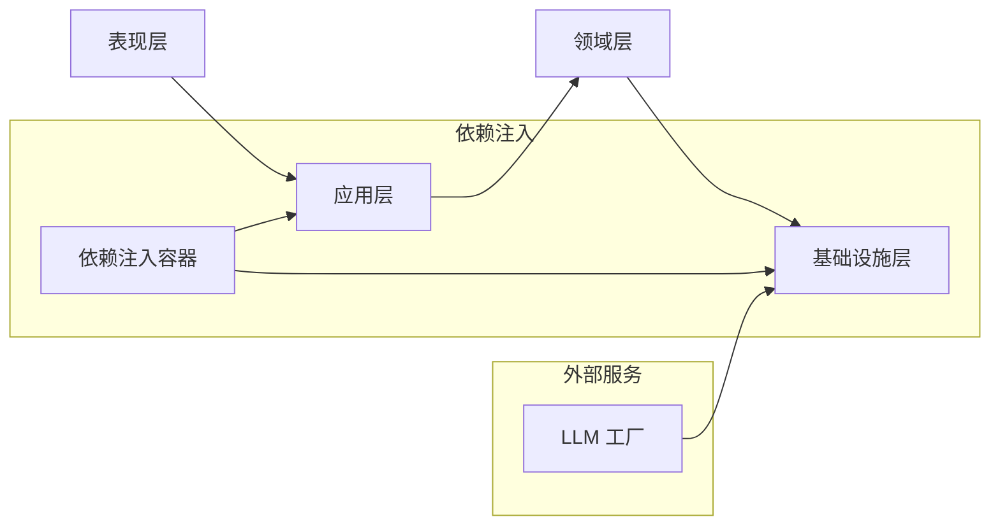

# 系统架构设计

<cite>
**本文引用的文件**
- [main.py](file://main.py)
- [presentation/api/app.py](file://presentation/api/app.py)
- [presentation/api/dependencies.py](file://presentation/api/dependencies.py)
- [presentation/api/routers/project.py](file://presentation/api/routers/project.py)
- [application/services/project_service.py](file://application/services/project_service.py)
- [domain/entities/project.py](file://domain/entities/project.py)
- [domain/repositories/project_repository.py](file://domain/repositories/project_repository.py)
- [infrastructure/persistence/sqlite_project_repo.py](file://infrastructure/persistence/sqlite_project_repo.py)
- [infrastructure/llm/llm_factory.py](file://infrastructure/llm/llm_factory.py)
- [config.py](file://config.py)
- [docs/ARCH_AI小说自动编写助手二期.md](file://docs/ARCH_AI小说自动编写助手二期.md)
- [docs/ARCH_AI小说自动编写助手三期.md](file://docs/ARCH_AI小说自动编写助手三期.md)
</cite>

## 目录
1. [引言](#引言)
2. [项目结构](#项目结构)
3. [核心组件](#核心组件)
4. [架构总览](#架构总览)
5. [详细组件分析](#详细组件分析)
6. [依赖分析](#依赖分析)
7. [性能考虑](#性能考虑)
8. [故障排查指南](#故障排查指南)
9. [结论](#结论)
10. [附录](#附录)

## 引言
本文件面向InkTrace项目的系统架构设计，采用领域驱动设计（DDD）与Clean Architecture思想，围绕表现层（Presentation）、应用层（Application）、领域层（Domain）与基础设施层（Infrastructure）进行分层阐述。文档重点说明各层职责、依赖方向、数据流与控制流，解析关键设计模式（工厂模式、依赖注入、仓储模式），并结合实际代码文件给出架构图与组件关系图，帮助开发者快速理解与扩展系统。

## 项目结构
InkTrace采用按“层”组织的目录结构，配合按“功能域”划分的子模块，形成清晰的分层与职责边界：
- 表现层：提供HTTP API与前端UI入口，负责请求接入、参数校验与响应封装。
- 应用层：编排业务流程，协调领域服务与仓储，实现用例与工作流。
- 领域层：承载核心业务实体、值对象、领域服务与仓储接口，体现业务不变量。
- 基础设施层：提供具体实现，如数据库访问、文件处理、LLM客户端、向量存储等。

图表来源
- [presentation/api/app.py:19-66](file://presentation/api/app.py#L19-L66)
- [presentation/api/dependencies.py:112-178](file://presentation/api/dependencies.py#L112-L178)
- [presentation/api/routers/project.py:26-290](file://presentation/api/routers/project.py#L26-L290)
- [application/services/project_service.py:21-203](file://application/services/project_service.py#L21-L203)
- [domain/entities/project.py:49-112](file://domain/entities/project.py#L49-L112)
- [domain/repositories/project_repository.py:17-55](file://domain/repositories/project_repository.py#L17-L55)
- [infrastructure/persistence/sqlite_project_repo.py:20-125](file://infrastructure/persistence/sqlite_project_repo.py#L20-L125)
- [infrastructure/llm/llm_factory.py:31-121](file://infrastructure/llm/llm_factory.py#L31-L121)

章节来源
- [main.py:15-22](file://main.py#L15-L22)
- [presentation/api/app.py:19-66](file://presentation/api/app.py#L19-L66)
- [presentation/api/dependencies.py:112-178](file://presentation/api/dependencies.py#L112-L178)
- [presentation/api/routers/project.py:26-290](file://presentation/api/routers/project.py#L26-L290)
- [application/services/project_service.py:21-203](file://application/services/project_service.py#L21-L203)
- [domain/entities/project.py:49-112](file://domain/entities/project.py#L49-L112)
- [domain/repositories/project_repository.py:17-55](file://domain/repositories/project_repository.py#L17-L55)
- [infrastructure/persistence/sqlite_project_repo.py:20-125](file://infrastructure/persistence/sqlite_project_repo.py#L20-L125)
- [infrastructure/llm/llm_factory.py:31-121](file://infrastructure/llm/llm_factory.py#L31-L121)
- [config.py:14-46](file://config.py#L14-L46)

## 核心组件
- 表现层组件
  - FastAPI应用与中间件：统一CORS、注册路由、健康检查。
  - 依赖注入容器：集中管理仓储、服务与工具实例，支持缓存与延迟初始化。
  - 路由器：以资源为中心的API路由，绑定DTO与服务调用。
- 应用层组件
  - 项目服务：封装项目生命周期管理、配置更新、与小说聚合关联。
- 领域层组件
  - 实体与值对象：项目与配置的数据结构与不变量。
  - 仓储接口：定义数据访问契约，隔离存储细节。
- 基础设施层组件
  - SQLite实现：持久化项目数据，JSON序列化配置。
  - LLM工厂：统一管理主备大模型客户端，支持可用性检测与切换。

章节来源
- [presentation/api/app.py:19-66](file://presentation/api/app.py#L19-L66)
- [presentation/api/dependencies.py:50-178](file://presentation/api/dependencies.py#L50-L178)
- [presentation/api/routers/project.py:26-290](file://presentation/api/routers/project.py#L26-L290)
- [application/services/project_service.py:21-203](file://application/services/project_service.py#L21-L203)
- [domain/entities/project.py:49-112](file://domain/entities/project.py#L49-L112)
- [domain/repositories/project_repository.py:17-55](file://domain/repositories/project_repository.py#L17-L55)
- [infrastructure/persistence/sqlite_project_repo.py:20-125](file://infrastructure/persistence/sqlite_project_repo.py#L20-L125)
- [infrastructure/llm/llm_factory.py:31-121](file://infrastructure/llm/llm_factory.py#L31-L121)

## 架构总览
InkTrace遵循Clean Architecture的依赖倒置原则：上层依赖抽象，下层实现抽象；应用层协调业务用例；领域层承载业务不变量；基础设施层提供技术实现。下图展示分层与交互关系，并与仓库文档中的架构图保持一致。

图表来源
- [presentation/api/app.py:19-66](file://presentation/api/app.py#L19-L66)
- [presentation/api/dependencies.py:112-178](file://presentation/api/dependencies.py#L112-L178)
- [application/services/project_service.py:21-203](file://application/services/project_service.py#L21-L203)
- [domain/entities/project.py:49-112](file://domain/entities/project.py#L49-L112)
- [domain/repositories/project_repository.py:17-55](file://domain/repositories/project_repository.py#L17-L55)
- [infrastructure/persistence/sqlite_project_repo.py:20-125](file://infrastructure/persistence/sqlite_project_repo.py#L20-L125)
- [infrastructure/llm/llm_factory.py:31-121](file://infrastructure/llm/llm_factory.py#L31-L121)
- [docs/ARCH_AI小说自动编写助手二期.md:14-71](file://docs/ARCH_AI小说自动编写助手二期.md#L14-L71)
- [docs/ARCH_AI小说自动编写助手三期.md:14-68](file://docs/ARCH_AI小说自动编写助手三期.md#L14-L68)

## 详细组件分析

### 组件A：项目管理API与服务链路
该链路展示了从HTTP请求到应用服务再到领域实体与仓储的完整流程，体现了Clean Architecture的依赖方向与职责分离。

图表来源
- [presentation/api/routers/project.py:91-181](file://presentation/api/routers/project.py#L91-L181)
- [presentation/api/dependencies.py:122-133](file://presentation/api/dependencies.py#L122-L133)
- [application/services/project_service.py:32-67](file://application/services/project_service.py#L32-L67)
- [infrastructure/persistence/sqlite_project_repo.py:81-98](file://infrastructure/persistence/sqlite_project_repo.py#L81-L98)

章节来源
- [presentation/api/routers/project.py:26-290](file://presentation/api/routers/project.py#L26-L290)
- [presentation/api/dependencies.py:122-133](file://presentation/api/dependencies.py#L122-L133)
- [application/services/project_service.py:21-203](file://application/services/project_service.py#L21-L203)
- [infrastructure/persistence/sqlite_project_repo.py:20-125](file://infrastructure/persistence/sqlite_project_repo.py#L20-L125)

### 组件B：LLM客户端工厂与主备切换
工厂模式用于统一管理不同供应商的大模型客户端，支持可用性检测与主备切换，提升系统鲁棒性。

图表来源
- [infrastructure/llm/llm_factory.py:19-121](file://infrastructure/llm/llm_factory.py#L19-L121)

章节来源
- [infrastructure/llm/llm_factory.py:31-121](file://infrastructure/llm/llm_factory.py#L31-L121)

### 组件C：项目实体与仓储接口
项目实体承载业务不变量与状态转换，仓储接口定义数据访问契约，基础设施层提供具体实现。

图表来源
- [domain/entities/project.py:49-112](file://domain/entities/project.py#L49-L112)
- [domain/repositories/project_repository.py:17-55](file://domain/repositories/project_repository.py#L17-L55)
- [infrastructure/persistence/sqlite_project_repo.py:20-125](file://infrastructure/persistence/sqlite_project_repo.py#L20-L125)

章节来源
- [domain/entities/project.py:49-112](file://domain/entities/project.py#L49-L112)
- [domain/repositories/project_repository.py:17-55](file://domain/repositories/project_repository.py#L17-L55)
- [infrastructure/persistence/sqlite_project_repo.py:20-125](file://infrastructure/persistence/sqlite_project_repo.py#L20-L125)

### 组件D：应用层服务与领域实体协作
应用层服务通过仓储接口与领域实体协作，完成业务用例；依赖注入容器负责实例化与装配。

图表来源
- [application/services/project_service.py:32-67](file://application/services/project_service.py#L32-L67)
- [domain/entities/project.py:68-88](file://domain/entities/project.py#L68-L88)
- [infrastructure/persistence/sqlite_project_repo.py:81-98](file://infrastructure/persistence/sqlite_project_repo.py#L81-L98)

章节来源
- [application/services/project_service.py:21-203](file://application/services/project_service.py#L21-L203)
- [domain/entities/project.py:49-112](file://domain/entities/project.py#L49-L112)
- [infrastructure/persistence/sqlite_project_repo.py:20-125](file://infrastructure/persistence/sqlite_project_repo.py#L20-L125)

## 依赖分析
- 依赖方向
  - 表现层仅依赖应用层接口与DTO，不直接依赖基础设施。
  - 应用层依赖领域层的实体、值对象与仓储接口，不直接依赖具体实现。
  - 领域层仅定义接口与不变量，不依赖其他层。
  - 基础设施层实现仓储接口与外部服务，向上暴露接口。
- 关键依赖点
  - 依赖注入容器集中管理仓储与服务实例，避免硬编码耦合。
  - LLM工厂作为外部服务适配器，向上暴露统一客户端接口。
  - SQLite实现对JSON序列化配置的处理，保证领域对象与持久化解耦。

图表来源
- [presentation/api/dependencies.py:112-178](file://presentation/api/dependencies.py#L112-L178)
- [infrastructure/llm/llm_factory.py:31-121](file://infrastructure/llm/llm_factory.py#L31-L121)

章节来源
- [presentation/api/dependencies.py:112-178](file://presentation/api/dependencies.py#L112-L178)
- [infrastructure/llm/llm_factory.py:31-121](file://infrastructure/llm/llm_factory.py#L31-L121)

## 性能考虑
- 缓存与延迟初始化
  - 使用缓存装饰器在依赖注入容器中复用仓储与服务实例，降低重复创建开销。
- I/O优化
  - SQLite写入采用批量或合并提交策略，减少事务次数。
  - JSON序列化配置避免复杂ORM映射带来的额外成本。
- 并发与可用性
  - LLM工厂支持主备切换与可用性检测，提高请求成功率与稳定性。
- 可扩展性建议
  - 仓储接口保持稳定，新增存储后仅替换实现类，不影响应用与领域层。
  - 将配置项集中于配置模块，便于运行时调整与环境隔离。

## 故障排查指南
- 常见问题定位
  - 项目不存在/状态非法：检查应用层服务对实体状态的约束与异常抛出逻辑。
  - 仓储保存失败：确认数据库路径存在且具备写权限，检查JSON序列化是否异常。
  - LLM不可用：检查API密钥与网络连通性，观察工厂的主备切换行为。
- 排查步骤
  - 从前端/客户端发起请求，查看路由层返回的错误码与消息。
  - 在依赖注入容器处打印/记录实例化过程，确认仓储与服务是否正确注入。
  - 在应用层服务中增加日志，定位业务规则触发点与持久化阶段。
  - 在基础设施层捕获底层异常（如数据库连接、文件读写、网络请求），并向上抛出语义化异常。

章节来源
- [application/services/project_service.py:167-198](file://application/services/project_service.py#L167-L198)
- [infrastructure/persistence/sqlite_project_repo.py:81-98](file://infrastructure/persistence/sqlite_project_repo.py#L81-L98)
- [infrastructure/llm/llm_factory.py:78-121](file://infrastructure/llm/llm_factory.py#L78-L121)

## 结论
InkTrace通过Clean Architecture与DDD分层，实现了表现层、应用层、领域层与基础设施层的清晰边界与稳定依赖方向。依赖注入容器与仓储接口进一步增强了可测试性与可替换性；工厂模式提升了外部服务集成的灵活性。整体架构在可扩展性、可维护性与性能之间取得平衡，适合持续演进与团队协作。

## 附录
- 技术选型与权衡
  - FastAPI：高性能异步框架，自动生成OpenAPI文档，便于前后端协同。
  - SQLite：轻量级本地存储，满足原型与中小规模场景，易于部署与迁移。
  - ChromaDB：嵌入式向量数据库，适合RAG与检索增强场景，便于扩展。
  - LLM工厂：统一外部服务接入，支持多供应商与主备切换，提升可用性。
- 启动与运行
  - 通过入口脚本启动服务，读取配置模块中的主机、端口与调试开关。
  - 依赖注入容器从环境变量加载数据库路径与API密钥，确保配置可插拔。

章节来源
- [main.py:15-22](file://main.py#L15-L22)
- [config.py:30-46](file://config.py#L30-L46)
- [presentation/api/app.py:19-66](file://presentation/api/app.py#L19-L66)
- [presentation/api/dependencies.py:45-109](file://presentation/api/dependencies.py#L45-L109)